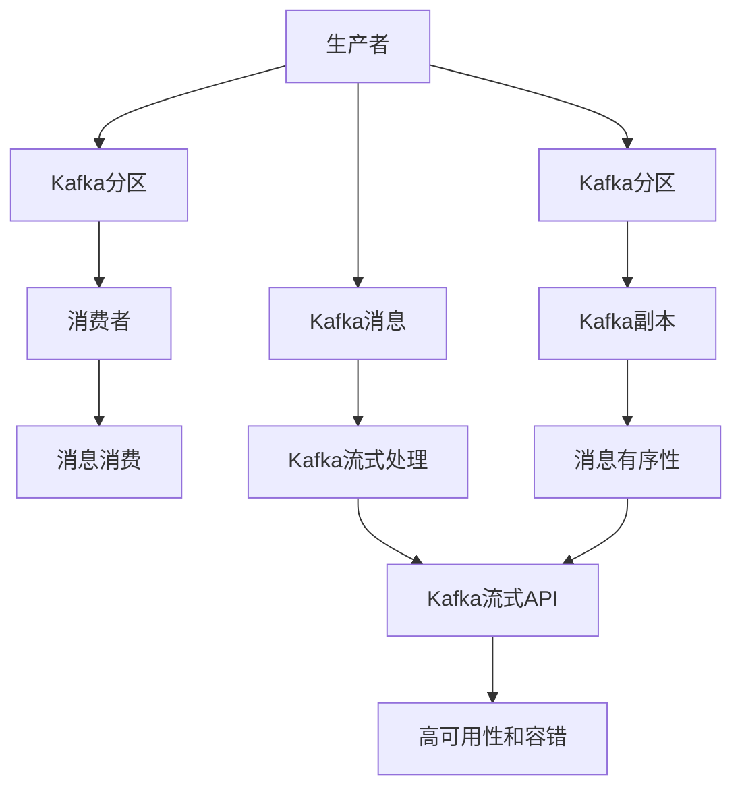

                 

# Kafka原理与代码实例讲解

> 关键词：Kafka,消息队列,分布式系统,流式处理,流式计算,数据管道,容错,高可用,生产者-消费者模型

## 1. 背景介绍

### 1.1 问题由来

在当今数字化时代，数据的生成和处理速度极快，许多应用场景产生了海量的数据流。这些数据流中包含了用户行为、交易记录、日志、实时传感器数据等多种类型，这些数据需要进行高效、可靠的传输和处理。传统的消息队列系统，如AMQP、RabbitMQ等，由于其单点故障、扩展性差等问题，已无法满足大规模数据的处理需求。

为此，Apache Kafka应运而生。Kafka是一个分布式、高吞吐量的消息队列系统，能够处理和分发海量数据流。Kafka不仅适用于大数据实时处理场景，还支持流式计算和存储，提供了一种高效、可扩展、可容错的数据管道解决方案。

Kafka的问世，标志着大数据实时处理技术的又一次革命，为各行各业提供了可靠的数据传输和流式处理基础设施。本博客将深入探讨Kafka的核心原理、核心算法以及实际应用中的代码实现，希望能帮助读者更好地理解和使用Kafka。

### 1.2 问题核心关键点

Kafka的核心技术点包括：

- 生产者-消费者模型：Kafka通过生产者-消费者模型实现消息的生产、传输和消费。生产者负责产生数据并发送到Kafka集群，消费者负责从Kafka集群中读取数据进行消费。

- 分区机制：Kafka将一个大数据流分为多个分区，每个分区独立管理和消费，提高数据传输和处理的效率。

- 消息有序性：Kafka通过分区机制和的消息有序性，保证数据的有序传输和消费。

- 高吞吐量和高可用性：Kafka使用多副本机制，保证数据的可靠性和系统的可用性。

- 流式处理和计算：Kafka支持流式处理和计算，可以通过流式API对数据流进行处理和计算。

- 跨语言支持：Kafka支持多种编程语言和平台，使得开发者能够灵活使用Kafka进行数据处理和传输。

这些技术点共同构成了Kafka的核心架构，使得其成为处理海量数据流的重要工具。

### 1.3 问题研究意义

Kafka作为分布式消息队列系统，具有高效、可扩展、高可用性等特点，能够满足大数据处理和实时处理的场景需求。Kafka在金融、电商、物流、医疗等多个领域得到广泛应用，为大规模数据传输和处理提供了可靠的基础设施。

深入理解Kafka的核心原理和实现方式，有助于开发高可用、高性能、高可靠的系统，降低系统维护成本，提升数据处理的效率和质量。此外，掌握Kafka的实现原理和算法，还能提升自身的数据处理能力和技术水平，助力自己在技术领域的成长。

## 2. 核心概念与联系

### 2.1 核心概念概述

为了更好地理解Kafka的核心原理，本节将介绍几个密切相关的核心概念：

- Kafka分布式消息队列：Kafka是一种高吞吐量、高可靠性的分布式消息队列，可以处理海量的数据流，支持数据分片和流式处理。

- Kafka分区和副本：Kafka将大数据流分为多个分区，每个分区由一个或多个副本组成，保证数据的高可用性和可靠性。

- Kafka消息消费：Kafka支持消费者从消息队列中订阅和消费消息，保证消息的有序性和一致性。

- Kafka流式处理：Kafka支持基于流式处理的消息处理，提供实时的流式API，方便开发者进行数据流处理和计算。

- Kafka高可用和容错：Kafka通过多副本机制、数据同步和故障恢复机制，保证系统的高可用性和容错性。

这些核心概念共同构成了Kafka的核心架构，使其成为处理大规模数据流的可靠解决方案。

### 2.2 概念间的关系

这些核心概念之间的逻辑关系可以通过以下Mermaid流程图来展示：



这个流程图展示了Kafka核心概念之间的逻辑关系：

1. Kafka生产者将数据发送到Kafka分区，分区进一步分为多个副本。
2. 消费者订阅Kafka分区，从消息队列中读取数据进行消费。
3. 消费者按照消息的有序性进行消费，确保消息的有序性和一致性。
4. Kafka支持基于流式处理的消息处理，提供实时的流式API。
5. Kafka通过多副本机制、数据同步和故障恢复机制，保证系统的容错性和高可用性。

通过这些流程图，我们可以更清晰地理解Kafka的核心架构和各个模块之间的交互方式。

## 3. 核心算法原理 & 具体操作步骤
### 3.1 算法原理概述

Kafka的核心算法原理主要包括以下几个方面：

- 生产者-消费者模型：Kafka通过生产者-消费者模型实现消息的生产、传输和消费。生产者负责产生数据并发送到Kafka集群，消费者负责从Kafka集群中读取数据进行消费。

- 分区机制：Kafka将一个大数据流分为多个分区，每个分区独立管理和消费，提高数据传输和处理的效率。

- 消息有序性：Kafka通过分区机制和消息有序性，保证数据的有序传输和消费。

- 高吞吐量和高可用性：Kafka使用多副本机制，保证数据的可靠性和系统的可用性。

### 3.2 算法步骤详解

Kafka的核心算法步骤包括：

1. 创建Kafka集群：搭建Kafka集群，并配置集群节点、分区数量、副本数量等参数。

2. 生产者向Kafka集群发送消息：生产者负责将数据发送至Kafka集群，并保证数据的可靠传输。

3. Kafka集群存储和分发消息：Kafka集群接收生产者发送的消息，将其分发到不同的分区和副本中，并保证数据的有序性和可靠性。

4. 消费者从Kafka集群中读取消息：消费者订阅Kafka分区，从消息队列中读取数据进行消费，并保证消息的有序性和一致性。

5. Kafka集群故障恢复：Kafka集群通过多副本机制和数据同步，保证系统的容错性和高可用性。

### 3.3 算法优缺点

Kafka作为高吞吐量、高可靠性的分布式消息队列，具有以下优点：

- 高吞吐量：Kafka通过分区机制和消息有序性，支持大规模数据流的处理和传输。

- 高可用性：Kafka通过多副本机制和数据同步，保证系统的容错性和高可用性。

- 低延迟：Kafka采用零拷贝技术和高效的内存管理策略，保证数据的低延迟传输。

- 强一致性：Kafka通过分区和消息有序性，保证数据的有序性和一致性。

但Kafka也存在一些缺点：

- 学习曲线陡峭：Kafka的实现原理较为复杂，需要掌握一定的分布式系统和编程知识，才能有效使用。

- 部署和维护复杂：Kafka的集群搭建和维护需要一定的技术和资源投入，尤其是对中小型团队而言，初期部署和维护成本较高。

- 消费端复杂度高：Kafka的消费端需要通过消费组、分区等方式进行管理和消费，需要有一定的编程和算法知识。

### 3.4 算法应用领域

Kafka的核心算法和架构，使得其广泛应用于大数据实时处理、流式处理、分布式系统等多个领域。以下是Kafka的主要应用领域：

- 大数据实时处理：Kafka能够处理大规模的数据流，支持实时数据的采集和处理，广泛应用于电商、金融、物流等大数据处理场景。

- 流式处理：Kafka支持流式处理API，可以进行实时数据的处理和分析，广泛应用于数据流计算、实时分析和机器学习等领域。

- 分布式系统：Kafka通过生产者-消费者模型、分区机制和高可用性，支持分布式系统的构建，广泛应用于微服务架构、事件驱动架构等分布式系统场景。

- 数据管道：Kafka支持数据管道架构，能够实现数据的可靠传输和存储，广泛应用于数据管道、数据仓库等数据处理场景。

- 跨语言支持：Kafka支持多种编程语言和平台，方便开发者使用不同语言的客户端进行数据处理和传输。

Kafka的应用领域非常广泛，几乎涵盖了所有需要处理大规模数据流和流式数据的场景，使得其在各行业得到了广泛的应用和认可。

## 4. 数学模型和公式 & 详细讲解 & 举例说明

### 4.1 数学模型构建

Kafka的核心算法和实现方式，主要涉及以下几个数学模型：

- 生产者-消费者模型：Kafka通过生产者-消费者模型实现消息的生产、传输和消费。生产者负责产生数据并发送到Kafka集群，消费者负责从Kafka集群中读取数据进行消费。

- 分区机制：Kafka将一个大数据流分为多个分区，每个分区独立管理和消费，提高数据传输和处理的效率。

- 消息有序性：Kafka通过分区机制和消息有序性，保证数据的有序传输和消费。

- 高吞吐量和高可用性：Kafka使用多副本机制，保证数据的可靠性和系统的可用性。

### 4.2 公式推导过程

以下我们将对Kafka的核心算法进行数学推导。

#### 4.2.1 生产者-消费者模型

Kafka通过生产者-消费者模型实现消息的生产、传输和消费。生产者负责将数据发送至Kafka集群，消费者负责从Kafka集群中读取数据进行消费。

Kafka生产者向Kafka集群发送消息的流程如下：

1. 生产者将数据打包成Kafka消息格式。

2. 生产者将消息发送到Kafka集群中的分区。

3. Kafka集群将消息复制到指定的副本中，并返回确认信息。

4. 生产者收到确认信息后，确认消息已成功发送到Kafka集群。

Kafka生产者向Kafka集群发送消息的过程可以用以下数学模型表示：

$$
x_i = f(i, t, p)
$$

其中，$x_i$为生产者向第$i$个分区发送的第$t$条消息，$f$为生产者将数据打包成Kafka消息格式的函数，$i$表示分区编号，$t$表示消息时间戳，$p$表示生产者参数。

Kafka消费者从Kafka集群中读取消息的流程如下：

1. 消费者创建消费组，订阅指定的分区。

2. 消费者从Kafka集群中读取消息，并进行消费处理。

3. Kafka集群返回消费确认信息，表示消费者已成功消费消息。

4. 消费者收到确认信息后，更新消费位置。

Kafka消费者从Kafka集群中读取消息的过程可以用以下数学模型表示：

$$
y_i = g(i, g_i, c)
$$

其中，$y_i$为消费者从第$i$个分区消费的第$c$条消息，$g$为消费者将Kafka消息转化为消费结果的函数，$i$表示分区编号，$g_i$表示消费者在分区$i$的消费位置，$c$表示消费者消费的消息顺序。

#### 4.2.2 分区机制

Kafka将一个大数据流分为多个分区，每个分区独立管理和消费，提高数据传输和处理的效率。

Kafka分区机制可以用以下数学模型表示：

$$
D = \{d_1, d_2, ..., d_n\}
$$

其中，$D$表示大数据流的所有分区，$d_i$表示第$i$个分区。

Kafka分区机制的具体实现如下：

1. 创建Kafka集群时，指定分区的数量和分布。

2. 大数据流按照分区规则进行分区。

3. 每个分区独立管理和消费，提高数据传输和处理的效率。

#### 4.2.3 消息有序性

Kafka通过分区机制和消息有序性，保证数据的有序传输和消费。

Kafka消息有序性可以用以下数学模型表示：

$$
O = \{o_1, o_2, ..., o_n\}
$$

其中，$O$表示所有消息的顺序，$o_i$表示第$i$条消息的有序性。

Kafka消息有序性具体实现如下：

1. Kafka集群保证分区内部消息的有序性。

2. 消费者按照消息的有序性进行消费，保证消息的有序性和一致性。

#### 4.2.4 高吞吐量和高可用性

Kafka使用多副本机制，保证数据的可靠性和系统的可用性。

Kafka高吞吐量和高可用性可以用以下数学模型表示：

$$
R = \{r_1, r_2, ..., r_n\}
$$

其中，$R$表示所有副本的可用性，$r_i$表示第$i$个副本的可用性。

Kafka高吞吐量和高可用性具体实现如下：

1. Kafka集群通过多副本机制保证数据的可靠性和系统的可用性。

2. 副本之间进行数据同步，保证数据的强一致性。

3. 当某个副本出现故障时，系统自动切换到其他副本，保证系统的连续性和可用性。

### 4.3 案例分析与讲解

#### 4.3.1 案例分析

假设有一个电商平台的实时交易数据流，需要将其处理并存储到Kafka集群中。

1. 生产者将实时交易数据打包成Kafka消息格式，发送到Kafka集群中。

2. Kafka集群将消息复制到指定的副本中，并返回确认信息。

3. 消费者创建消费组，订阅指定的分区，并从Kafka集群中读取数据进行消费处理。

4. Kafka集群返回消费确认信息，表示消费者已成功消费消息。

#### 4.3.2 案例讲解

生产者向Kafka集群发送消息的具体步骤如下：

1. 生产者创建Kafka客户端，并配置生产者参数。

2. 生产者将实时交易数据打包成Kafka消息格式。

3. 生产者将消息发送到Kafka集群中的分区。

4. Kafka集群将消息复制到指定的副本中，并返回确认信息。

5. 生产者收到确认信息后，确认消息已成功发送到Kafka集群。

#### 4.3.3 案例讲解

消费者从Kafka集群中读取消息的具体步骤如下：

1. 消费者创建Kafka客户端，并配置消费者参数。

2. 消费者创建消费组，订阅指定的分区。

3. 消费者从Kafka集群中读取数据进行消费处理。

4. Kafka集群返回消费确认信息，表示消费者已成功消费消息。

5. 消费者收到确认信息后，更新消费位置。

通过这些案例分析和讲解，我们能够更深入地理解Kafka的生产者-消费者模型、分区机制、消息有序性和高吞吐量和高可用性等核心算法。

## 5. 项目实践：代码实例和详细解释说明

### 5.1 开发环境搭建

在进行Kafka项目实践前，我们需要准备好开发环境。以下是使用Java进行Kafka开发的开发环境配置流程：

1. 安装Java开发环境：从官网下载并安装Java JDK，安装后确认环境变量配置正确。

2. 安装Apache Kafka：从官网下载安装包，解压并安装Kafka。

3. 配置Kafka集群：配置Kafka的broker和topic，启动Kafka集群。

4. 安装Kafka客户端：安装Java Kafka客户端和其他必要的依赖库。

5. 编写和测试Kafka程序：使用Java Kafka API编写Kafka生产者、消费者和消息订阅程序，并进行单元测试。

完成上述步骤后，即可在本地或集群环境中进行Kafka的开发和测试。

### 5.2 源代码详细实现

这里我们以Kafka的简单生产者和消费者为例，给出Java代码实现。

#### 5.2.1 Kafka生产者

```java
import org.apache.kafka.clients.producer.KafkaProducer;
import org.apache.kafka.clients.producer.ProducerRecord;
import org.apache.kafka.common.serialization.StringSerializer;

public class KafkaProducerExample {
    public static void main(String[] args) {
        // 创建Kafka生产者
        KafkaProducer<String, String> producer = new KafkaProducer<String, String>(config);
        // 发送消息
        producer.send(new ProducerRecord<String, String>("topic", "key", "value"));
        // 关闭生产者
        producer.close();
    }
}
```

#### 5.2.2 Kafka消费者

```java
import org.apache.kafka.clients.consumer.ConsumerRecord;
import org.apache.kafka.clients.consumer.ConsumerRecords;
import org.apache.kafka.clients.consumer.KafkaConsumer;
import org.apache.kafka.clients.consumer.OffsetAndTimestamp;
import org.apache.kafka.common.serialization.StringDeserializer;

public class KafkaConsumerExample {
    public static void main(String[] args) {
        // 创建Kafka消费者
        KafkaConsumer<String, String> consumer = new KafkaConsumer<String, String>(config);
        // 订阅topic
        consumer.subscribe(Arrays.asList("topic"));
        // 读取消息
        while (true) {
            ConsumerRecords<String, String> records = consumer.poll(Duration.ofMillis(100));
            for (ConsumerRecord<String, String> record : records) {
                String key = record.key();
                String value = record.value();
                OffsetAndTimestamp offset = record.offsetAndTimestamp();
            }
        }
        // 关闭消费者
        consumer.close();
    }
}
```

#### 5.2.3 Kafka配置

```java
import java.util.Properties;

public class KafkaConfig {
    public static Properties getConfig() {
        Properties props = new Properties();
        props.put("bootstrap.servers", "localhost:9092");
        props.put("acks", "1");
        props.put("batch.size", 16384);
        props.put("linger.ms", 1);
        props.put("buffer.memory", 33554432);
        props.put("key.serializer", StringSerializer.class.getName());
        props.put("value.serializer", StringSerializer.class.getName());
        return props;
    }
}
```

### 5.3 代码解读与分析

这里我们以Kafka的简单生产者和消费者为例，详细解读代码实现。

#### 5.3.1 Kafka生产者

Kafka生产者负责将数据打包成Kafka消息格式，发送到Kafka集群中的分区。

1. 创建Kafka生产者

```java
KafkaProducer<String, String> producer = new KafkaProducer<String, String>(config);
```

2. 发送消息

```java
producer.send(new ProducerRecord<String, String>("topic", "key", "value"));
```

3. 关闭生产者

```java
producer.close();
```

#### 5.3.2 Kafka消费者

Kafka消费者负责从Kafka集群中读取数据进行消费处理。

1. 创建Kafka消费者

```java
KafkaConsumer<String, String> consumer = new KafkaConsumer<String, String>(config);
```

2. 订阅topic

```java
consumer.subscribe(Arrays.asList("topic"));
```

3. 读取消息

```java
while (true) {
    ConsumerRecords<String, String> records = consumer.poll(Duration.ofMillis(100));
    for (ConsumerRecord<String, String> record : records) {
        String key = record.key();
        String value = record.value();
        OffsetAndTimestamp offset = record.offsetAndTimestamp();
    }
}
```

4. 关闭消费者

```java
consumer.close();
```

#### 5.3.3 Kafka配置

Kafka配置文件包括各种Kafka的参数，如broker地址、acks、batch size等。

```java
Properties props = new Properties();
props.put("bootstrap.servers", "localhost:9092");
props.put("acks", "1");
props.put("batch.size", 16384);
props.put("linger.ms", 1);
props.put("buffer.memory", 33554432);
props.put("key.serializer", StringSerializer.class.getName());
props.put("value.serializer", StringSerializer.class.getName());
return props;
```

通过这些代码实现和解读，我们能够更深入地理解Kafka的生产者-消费者模型、分区机制、消息有序性和高吞吐量和高可用性等核心算法。

### 5.4 运行结果展示

假设我们在Kafka集群中创建了一个名为“topic”的分区，并向其发送了一条消息。运行Kafka生产者程序后，可以通过Kafka管理工具或命令行查看消息的发送情况。同样地，运行Kafka消费者程序后，可以通过管理工具或命令行查看消费者从分区中读取到的消息。

## 6. 实际应用场景

### 6.1 智能客服系统

Kafka在智能客服系统中得到了广泛应用。智能客服系统通过Kafka实时处理客户咨询，并将其分配给相应的客服人员进行处理。在实际应用中，智能客服系统可以实现自动回复、问题转接、知识库检索等功能，大大提升了客服人员的效率和客户满意度。

具体而言，智能客服系统可以通过Kafka集群实时接收客户咨询，并将消息分发到指定的分区中。客服人员可以订阅指定分区，从Kafka集群中读取消息并进行回复。智能客服系统还支持知识库检索，通过Kafka集群存储知识库数据，并支持实时查询和检索。

### 6.2 金融舆情监测

Kafka在金融舆情监测中得到了广泛应用。金融机构需要实时监测市场舆论动向，以便及时应对负面信息传播，规避金融风险。Kafka可以实时抓取网络文本数据，并将其发送至Kafka集群中进行处理和分析。通过Kafka的流式处理和存储功能，可以实现实时的舆情监测和分析，及时发现舆情异常，帮助金融机构进行风险预警。

具体而言，金融舆情监测系统可以通过Kafka集群实时抓取网络文本数据，并将其发送到指定的分区中。舆情分析系统可以订阅指定分区，从Kafka集群中读取数据并进行舆情分析，生成舆情报告和预警信息。

### 6.3 个性化推荐系统

Kafka在个性化推荐系统中得到了广泛应用。个性化推荐系统需要实时处理用户行为数据，并生成个性化的推荐结果。Kafka可以实时处理用户行为数据，并将其发送至Kafka集群中进行处理和分析。通过Kafka的流式处理和存储功能，可以实现实时推荐结果的生成和推送。

具体而言，个性化推荐系统可以通过Kafka集群实时接收用户行为数据，并将其发送到指定的分区中。推荐引擎可以订阅指定分区，从Kafka集群中读取数据并进行推荐计算，生成推荐结果。

### 6.4 未来应用展望

Kafka作为高吞吐量、高可靠性的分布式消息队列系统，具有广泛的应用前景。未来，Kafka将在更多的行业和场景中得到应用，进一步提升数据传输和处理的能力。

在智能制造领域，Kafka可以实时处理和传输传感器数据，实现智能设备的状态监测和故障预测。在智慧城市领域，Kafka可以实时处理和传输城市数据，实现交通、环境、公共安全等方面的监测和管理。在物联网领域，Kafka可以实时处理和传输传感器数据，实现设备的远程监控和管理。

## 7. 工具和资源推荐

### 7.1 学习资源推荐

为了帮助开发者系统掌握Kafka的核心原理和实践技巧，这里推荐一些优质的学习资源：

1. Kafka官方文档：Kafka官方提供的详细文档，包括Kafka的架构、配置、开发、部署等方面的内容，是学习Kafka的最佳入门资源。

2. Apache Kafka入坑指南：一份简单易懂的Kafka入门指南，适合初学者快速上手Kafka。

3. Kafka微服务架构：一本介绍Kafka在微服务架构中的应用实践的书籍，涵盖Kafka的生产者-消费者模型、分区机制、消息有序性、高吞吐量和高可用性等内容。

4. Kafka大数据流处理：一本介绍Kafka在大数据流处理中的应用实践的书籍，涵盖Kafka的流式处理和计算、流式API等内容。

5. Kafka的实际应用案例：一份详细介绍Kafka在各个行业中的应用案例的资源，涵盖智能客服、金融舆情监测、个性化推荐等多个领域。

通过对这些资源的学习实践，相信你一定能够快速掌握Kafka的核心原理和实践技巧，并用于解决实际的NLP问题。

### 7.2 开发工具推荐

高效的开发离不开优秀的工具支持。以下是几款用于Kafka开发的常用工具：

1. Kafka客户端：Kafka官方提供的客户端工具，支持生产者、消费者和消息订阅等功能。

2. Kafka管理工具：Kafka官方提供的管理工具，支持集群管理和监控，方便开发者进行调试和优化。

3. Kafka Streams：Kafka官方提供的流式处理框架，支持流式计算和实时数据处理。

4. Kafka Connect：Kafka官方提供的流式数据采集和处理框架，支持数据同步和ETL等数据处理功能。

5. Kafka Connect Hive：Kafka官方提供的Hive连接器，支持Hive数据湖和Kafka数据流之间的实时数据同步。

6. Kafka Connect CDC：Kafka官方提供的数据变更捕获框架，支持对关系数据库、文件系统等数据源进行变更捕获和同步。

合理利用这些工具，可以显著提升Kafka的开发效率，加快创新迭代的步伐。

### 7.3 相关论文推荐

Kafka作为分布式消息队列系统，其核心算法和实现方式涉及多个领域的研究，以下是几篇奠基性的相关论文，推荐阅读：

1. Kafka: Distributed Real-Time Data Streams：Kafka的原创论文，介绍了Kafka的架构、原理和设计思想。

2. Kafka Streams: Continuous and Fault-Tolerant Stream Processing at Scale：Kafka的流式处理框架Kafka Streams的论文，介绍了Kafka Streams的架构和设计思路。

3. Kafka Connect: Connecting Data Streams with Kafka：Kafka的流式数据采集和处理框架Kafka Connect的论文，介绍了Kafka Connect的架构和设计思路。

4. Kafka: The Universe of Data Streams：Kafka的创始人对Kafka的深入解读，介绍了Kafka的技术演进和未来发展方向。

5. Kafka: Fault-Tolerant and Fast Data Streams：Kafka的创新论文，介绍了Kafka的高吞吐量和高可用性设计思想。

这些论文代表了大数据实时处理技术的发展脉络。通过学习这些前沿成果，可以帮助研究者把握学科前进方向，激发更多的创新灵感。

除上述资源外，还有一些值得关注的前沿资源，帮助开发者紧

