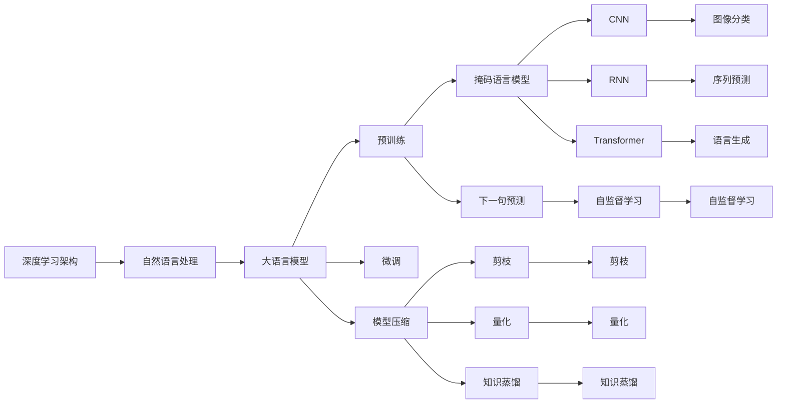
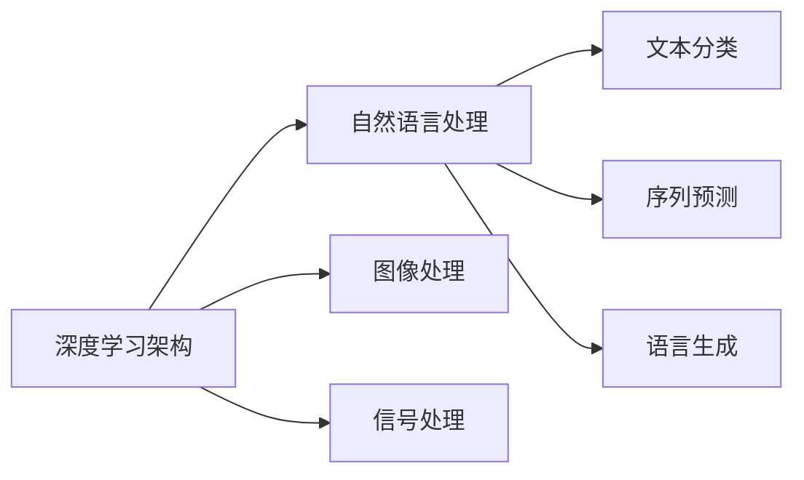
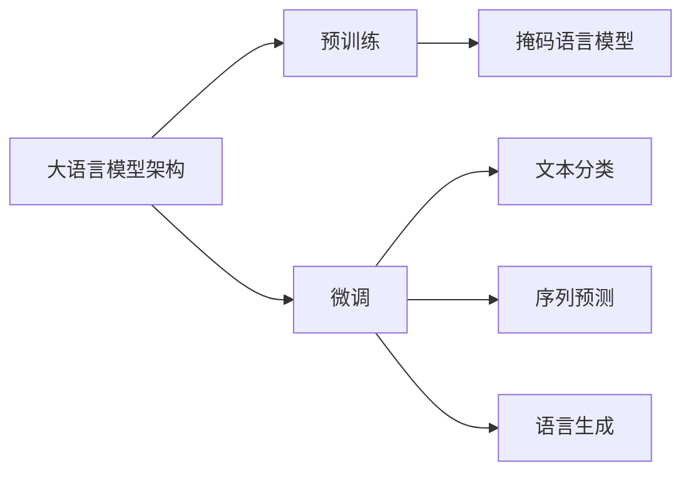
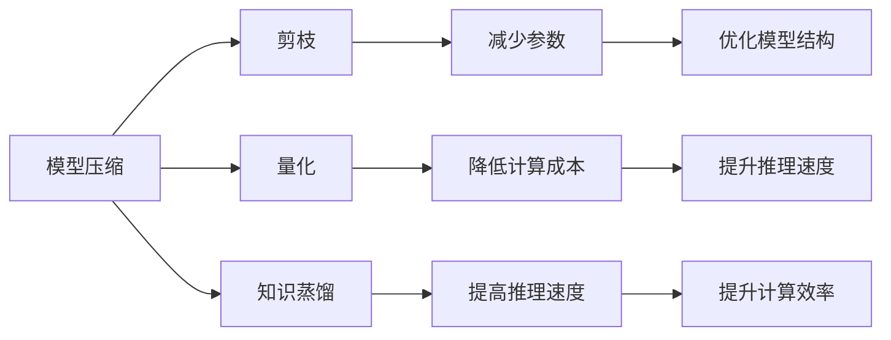
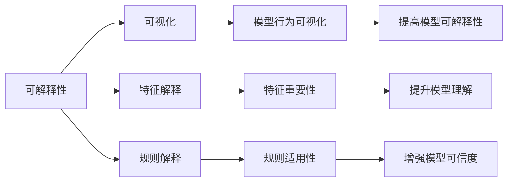
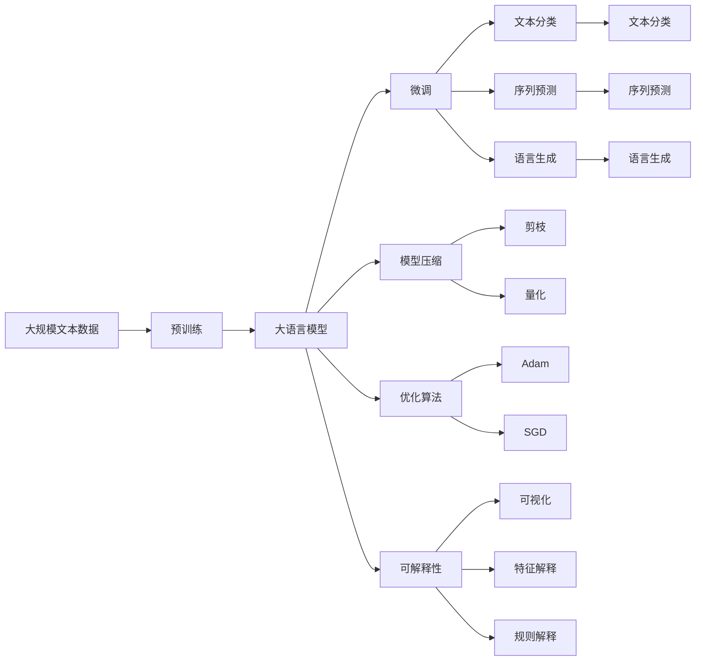

                 

# LLM：一种新的计算机架构

> 关键词：大语言模型,计算机架构,深度学习,自然语言处理,Transformer,BERT,预训练,微调

## 1. 背景介绍

### 1.1 问题由来
随着深度学习技术的迅猛发展，自然语言处理(NLP)领域取得了重大突破。大语言模型(LLM)通过在大规模无标签文本数据上进行预训练，学习到丰富的语言知识和常识，能够进行复杂的语言理解和生成，显著提升了NLP任务的性能。其中，基于Transformer架构的BERT、GPT等模型，成为目前NLP研究的主流。

然而，现有的深度学习架构在处理大规模数据时，存在计算成本高、存储需求大等问题，难以满足实际应用的需求。为了应对这些挑战，一种新的计算机架构——LLM架构应运而生。LLM架构旨在通过优化数据流、模型结构和计算方式，更好地支持大语言模型的训练和推理，从而推动NLP技术的发展和应用。

### 1.2 问题核心关键点
LLM架构的核心在于对深度学习架构的重新设计和优化，以适应大规模语言模型的训练和推理需求。其关键点包括：

- 设计高效的存储和计算模型，支持大规模数据存储和高效计算。
- 优化数据流和模型结构，提升模型训练和推理效率。
- 引入优化算法和模型压缩技术，降低计算资源消耗。
- 提高模型的鲁棒性和泛化能力，适应不同任务和数据集。
- 增强模型的可解释性和可解释性，提升应用的安全性和可信度。

这些关键点构成了LLM架构的基础，使得大规模语言模型在大规模数据上训练和推理变得高效、可靠和可解释。

### 1.3 问题研究意义
研究LLM架构对于推动NLP技术的发展和应用具有重要意义：

1. 降低计算成本和存储成本。LLM架构通过优化数据流和模型结构，显著降低深度学习模型在处理大规模数据时的计算成本和存储需求，有助于大规模NLP任务的落地。
2. 提升模型训练和推理效率。LLM架构通过引入优化算法和模型压缩技术，提升模型的训练和推理效率，缩短NLP应用开发周期。
3. 增强模型的鲁棒性和泛化能力。LLM架构通过优化数据流和模型结构，提升模型的鲁棒性和泛化能力，使其能够更好地适应不同任务和数据集。
4. 提升模型的可解释性和可解释性。LLM架构通过优化模型结构和计算方式，提高模型的可解释性，增强应用的安全性和可信度。

## 2. 核心概念与联系

### 2.1 核心概念概述

为了更好地理解LLM架构，本节将介绍几个密切相关的核心概念：

- 深度学习架构(Deep Learning Architecture)：基于神经网络模型的计算架构，用于实现各种深度学习任务，如分类、回归、生成等。
- 自然语言处理(Natural Language Processing, NLP)：通过计算机处理和理解自然语言，实现语言理解和生成。
- 大语言模型(Large Language Model, LLM)：基于深度学习架构，通过在大规模无标签文本数据上进行预训练，学习到丰富的语言知识和常识，能够进行复杂的语言理解和生成。
- 预训练(Pre-training)：在大规模无标签文本数据上，通过自监督学习任务训练通用语言模型的过程。常见的预训练任务包括掩码语言模型、下一句预测等。
- 微调(Fine-tuning)：在预训练模型的基础上，使用下游任务的少量标注数据，通过有监督学习优化模型在特定任务上的性能。
- 模型压缩(Model Compression)：通过剪枝、量化、蒸馏等技术，优化模型结构和参数，降低计算资源消耗，提高推理速度。
- 优化算法(Optimization Algorithm)：如Adam、SGD等，用于更新模型参数，最小化损失函数，提升模型性能。
- 可解释性(Interpretability)：指模型输出结果的可解释性，有助于理解和调试模型的行为。

这些核心概念之间的逻辑关系可以通过以下Mermaid流程图来展示：



这个流程图展示了大语言模型架构的基本组成和关键技术：

1. 深度学习架构是大语言模型的基础。
2. 自然语言处理是深度学习架构的重要应用方向之一。
3. 大语言模型通过预训练和微调获得语言理解和生成的能力。
4. 预训练和微调是大语言模型训练的关键步骤。
5. 模型压缩和优化算法是大语言模型推理的关键技术。
6. 可解释性是大语言模型应用的重要考量。

这些核心概念共同构成了大语言模型架构的基础，使得深度学习模型在处理自然语言数据时具有更高的效率和性能。

### 2.2 概念间的关系

这些核心概念之间存在着紧密的联系，形成了大语言模型架构的完整生态系统。下面我通过几个Mermaid流程图来展示这些概念之间的关系。

#### 2.2.1 深度学习架构与自然语言处理的关系



这个流程图展示了深度学习架构与自然语言处理的基本关系：

1. 深度学习架构支持各种计算任务，包括图像处理、信号处理等。
2. 自然语言处理是大规模计算任务的一部分，需要深度学习架构的支持。
3. 自然语言处理任务包括文本分类、序列预测、语言生成等。

#### 2.2.2 大语言模型架构与预训练、微调的关系



这个流程图展示了大语言模型架构与预训练、微调的关系：

1. 大语言模型架构通过预训练获得初始化参数。
2. 预训练任务包括掩码语言模型等自监督任务。
3. 微调任务包括文本分类、序列预测、语言生成等。

#### 2.2.3 模型压缩与优化算法的关系



这个流程图展示了模型压缩与优化算法的关系：

1. 模型压缩技术包括剪枝、量化、知识蒸馏等。
2. 剪枝减少模型参数，降低计算资源消耗。
3. 量化降低计算成本，提高推理速度。
4. 知识蒸馏提高推理速度，优化模型结构。

#### 2.2.4 可解释性与深度学习架构的关系



这个流程图展示了可解释性与深度学习架构的关系：

1. 可解释性包括可视化、特征解释、规则解释等。
2. 可视化展示模型行为，增强可解释性。
3. 特征解释说明模型输入输出的关系。
4. 规则解释描述模型决策依据。

### 2.3 核心概念的整体架构

最后，我们用一个综合的流程图来展示这些核心概念在大语言模型架构中的整体架构：



这个综合流程图展示了从预训练到微调，再到模型压缩和优化的完整过程。大语言模型首先在大规模文本数据上进行预训练，然后通过微调优化模型在特定任务上的性能。同时，通过模型压缩和优化算法，减少计算资源消耗，提升推理速度。最后，通过可解释性技术，提高模型的可解释性和可信度。

## 3. 核心算法原理 & 具体操作步骤
### 3.1 算法原理概述

LLM架构的核心思想是通过优化数据流和模型结构，提升大规模语言模型的训练和推理效率。其核心算法原理如下：

1. 在大规模无标签文本数据上进行预训练，学习到丰富的语言知识和常识。
2. 将预训练的初始化参数作为大语言模型的输入，通过有监督学习优化模型在特定任务上的性能。
3. 通过剪枝、量化、蒸馏等技术，优化模型结构和参数，降低计算资源消耗。
4. 引入优化算法(如Adam、SGD等)，更新模型参数，最小化损失函数，提升模型性能。
5. 通过可解释性技术(如可视化、特征解释、规则解释等)，提高模型的可解释性和可信度。

### 3.2 算法步骤详解

基于LLM架构的大语言模型微调一般包括以下几个关键步骤：

**Step 1: 准备预训练模型和数据集**
- 选择合适的预训练语言模型 $M_{\theta}$ 作为初始化参数，如 BERT、GPT等。
- 准备下游任务 $T$ 的标注数据集 $D$，划分为训练集、验证集和测试集。一般要求标注数据与预训练数据的分布不要差异过大。

**Step 2: 添加任务适配层**
- 根据任务类型，在预训练模型顶层设计合适的输出层和损失函数。
- 对于分类任务，通常在顶层添加线性分类器和交叉熵损失函数。
- 对于生成任务，通常使用语言模型的解码器输出概率分布，并以负对数似然为损失函数。

**Step 3: 设置微调超参数**
- 选择合适的优化算法及其参数，如 AdamW、SGD 等，设置学习率、批大小、迭代轮数等。
- 设置正则化技术及强度，包括权重衰减、Dropout、Early Stopping 等。
- 确定冻结预训练参数的策略，如仅微调顶层，或全部参数都参与微调。

**Step 4: 执行梯度训练**
- 将训练集数据分批次输入模型，前向传播计算损失函数。
- 反向传播计算参数梯度，根据设定的优化算法和学习率更新模型参数。
- 周期性在验证集上评估模型性能，根据性能指标决定是否触发 Early Stopping。
- 重复上述步骤直到满足预设的迭代轮数或 Early Stopping 条件。

**Step 5: 测试和部署**
- 在测试集上评估微调后模型 $M_{\hat{\theta}}$ 的性能，对比微调前后的精度提升。
- 使用微调后的模型对新样本进行推理预测，集成到实际的应用系统中。
- 持续收集新的数据，定期重新微调模型，以适应数据分布的变化。

以上是基于LLM架构的大语言模型微调的一般流程。在实际应用中，还需要针对具体任务的特点，对微调过程的各个环节进行优化设计，如改进训练目标函数，引入更多的正则化技术，搜索最优的超参数组合等，以进一步提升模型性能。

### 3.3 算法优缺点

基于LLM架构的大语言模型微调方法具有以下优点：

1. 高效处理大规模数据。LLM架构通过优化数据流和模型结构，使得深度学习模型能够高效处理大规模文本数据，加速模型训练。
2. 提升模型泛化能力。通过预训练和微调，大语言模型能够学习到更丰富的语言知识，提升模型的泛化能力和鲁棒性。
3. 降低计算资源消耗。通过模型压缩和优化算法，减少计算资源消耗，提升模型推理速度。
4. 提高模型可解释性。通过可解释性技术，提高模型的可解释性和可信度，便于理解和调试。

同时，该方法也存在一定的局限性：

1. 依赖高质量标注数据。微调的效果很大程度上取决于标注数据的质量和数量，获取高质量标注数据的成本较高。
2. 迁移能力有限。当目标任务与预训练数据的分布差异较大时，微调的性能提升有限。
3. 负面效果传递。预训练模型的固有偏见、有害信息等，可能通过微调传递到下游任务，造成负面影响。
4. 可解释性不足。微调模型的决策过程通常缺乏可解释性，难以对其推理逻辑进行分析和调试。

尽管存在这些局限性，但就目前而言，基于LLM架构的微调方法仍是大语言模型应用的主流范式。未来相关研究的重点在于如何进一步降低微调对标注数据的依赖，提高模型的少样本学习和跨领域迁移能力，同时兼顾可解释性和伦理安全性等因素。

### 3.4 算法应用领域

基于LLM架构的大语言模型微调方法在NLP领域已经得到了广泛的应用，覆盖了几乎所有常见任务，例如：

- 文本分类：如情感分析、主题分类、意图识别等。通过微调使模型学习文本-标签映射。
- 命名实体识别：识别文本中的人名、地名、机构名等特定实体。通过微调使模型掌握实体边界和类型。
- 关系抽取：从文本中抽取实体之间的语义关系。通过微调使模型学习实体-关系三元组。
- 问答系统：对自然语言问题给出答案。将问题-答案对作为微调数据，训练模型学习匹配答案。
- 机器翻译：将源语言文本翻译成目标语言。通过微调使模型学习语言-语言映射。
- 文本摘要：将长文本压缩成简短摘要。将文章-摘要对作为微调数据，使模型学习抓取要点。
- 对话系统：使机器能够与人自然对话。将多轮对话历史作为上下文，微调模型进行回复生成。

除了上述这些经典任务外，LLM架构的大语言模型微调也被创新性地应用到更多场景中，如可控文本生成、常识推理、代码生成、数据增强等，为NLP技术带来了全新的突破。随着预训练模型和微调方法的不断进步，相信NLP技术将在更广阔的应用领域大放异彩。

## 4. 数学模型和公式 & 详细讲解 & 举例说明

### 4.1 数学模型构建

本节将使用数学语言对基于LLM架构的大语言模型微调过程进行更加严格的刻画。

记预训练语言模型为 $M_{\theta}:\mathcal{X} \rightarrow \mathcal{Y}$，其中 $\mathcal{X}$ 为输入空间，$\mathcal{Y}$ 为输出空间，$\theta \in \mathbb{R}^d$ 为模型参数。假设微调任务的训练集为 $D=\{(x_i,y_i)\}_{i=1}^N, x_i \in \mathcal{X}, y_i \in \mathcal{Y}$。

定义模型 $M_{\theta}$ 在数据样本 $(x,y)$ 上的损失函数为 $\ell(M_{\theta}(x),y)$，则在数据集 $D$ 上的经验风险为：

$$
\mathcal{L}(\theta) = \frac{1}{N} \sum_{i=1}^N \ell(M_{\theta}(x_i),y_i)
$$

微调的优化目标是最小化经验风险，即找到最优参数：

$$
\theta^* = \mathop{\arg\min}_{\theta} \mathcal{L}(\theta)
$$

在实践中，我们通常使用基于梯度的优化算法（如SGD、Adam等）来近似求解上述最优化问题。设 $\eta$ 为学习率，$\lambda$ 为正则化系数，则参数的更新公式为：

$$
\theta \leftarrow \theta - \eta \nabla_{\theta}\mathcal{L}(\theta) - \eta\lambda\theta
$$

其中 $\nabla_{\theta}\mathcal{L}(\theta)$ 为损失函数对参数 $\theta$ 的梯度，可通过反向传播算法高效计算。

### 4.2 公式推导过程

以下我们以二分类任务为例，推导交叉熵损失函数及其梯度的计算公式。

假设模型 $M_{\theta}$ 在输入 $x$ 上的输出为 $\hat{y}=M_{\theta}(x) \in [0,1]$，表示样本属于正类的概率。真实标签 $y \in \{0,1\}$。则二分类交叉熵损失函数定义为：

$$
\ell(M_{\theta}(x),y) = -[y\log \hat{y} + (1-y)\log (1-\hat{y})]
$$

将其代入经验风险公式，得：

$$
\mathcal{L}(\theta) = -\frac{1}{N}\sum_{i=1}^N [y_i\log M_{\theta}(x_i)+(1-y_i)\log(1-M_{\theta}(x_i))]
$$

根据链式法则，损失函数对参数 $\theta_k$ 的梯度为：

$$
\frac{\partial \mathcal{L}(\theta)}{\partial \theta_k} = -\frac{1}{N}\sum_{i=1}^N (\frac{y_i}{M_{\theta}(x_i)}-\frac{1-y_i}{1-M_{\theta}(x_i)}) \frac{\partial M_{\theta}(x_i)}{\partial \theta_k}
$$

其中 $\frac{\partial M_{\theta}(x_i)}{\partial \theta_k}$ 可进一步递归展开，利用自动微分技术完成计算。

在得到损失函数的梯度后，即可带入参数更新公式，完成模型的迭代优化。重复上述过程直至收敛，最终得到适应下游任务的最优模型参数 $\theta^*$。

## 5. 项目实践：代码实例和详细解释说明

### 5.1 开发环境搭建

在进行微调实践前，我们需要准备好开发环境。以下是使用Python进行PyTorch开发的环境配置流程：

1. 安装Anaconda：从官网下载并安装Anaconda，用于创建独立的Python环境。

2. 创建并激活虚拟环境：
```bash
conda create -n pytorch-env python=3.8 
conda activate pytorch-env
```

3. 安装PyTorch：根据CUDA版本，从官网获取对应的安装命令。例如：
```bash
conda install pytorch torchvision torchaudio cudatoolkit=11.1 -c pytorch -c conda-forge
```

4. 安装Transformers库：
```bash
pip install transformers
```

5. 安装各类工具包：
```bash
pip install numpy pandas scikit-learn matplotlib tqdm jupyter notebook ipython
```

完成上述步骤后，即可在`pytorch-env`环境中开始微调实践。

### 5.2 源代码详细实现

下面我以命名实体识别(NER)任务为例，给出使用Transformers库对BERT模型进行微调的PyTorch代码实现。

首先，定义NER任务的数据处理函数：

```python
from transformers import BertTokenizer
from torch.utils.data import Dataset
import torch

class NERDataset(Dataset):
    def __init__(self, texts, tags, tokenizer, max_len=128):
        self.texts = texts
        self.tags = tags
        self.tokenizer = tokenizer
        self.max_len = max_len
        
    def __len__(self):
        return len(self.texts)
    
    def __getitem__(self, item):
        text = self.texts[item]
        tags = self.tags[item]
        
        encoding = self.tokenizer(text, return_tensors='pt', max_length=self.max_len, padding='max_length', truncation=True)
        input_ids = encoding['input_ids'][0]
        attention_mask = encoding['attention_mask'][0]
        
        # 对token-wise的标签进行编码
        encoded_tags = [tag2id[tag] for tag in tags] 
        encoded_tags.extend([tag2id['O']] * (self.max_len - len(encoded_tags)))
        labels = torch.tensor(encoded_tags, dtype=torch.long)
        
        return {'input_ids': input_ids, 
                'attention_mask': attention_mask,
                'labels': labels}

# 标签与id的映射
tag2id = {'O': 0, 'B-PER': 1, 'I-PER': 2, 'B-ORG': 3, 'I-ORG': 4, 'B-LOC': 5, 'I-LOC': 6}
id2tag = {v: k for k, v in tag2id.items()}

# 创建dataset
tokenizer = BertTokenizer.from_pretrained('bert-base-cased')

train_dataset = NERDataset(train_texts, train_tags, tokenizer)
dev_dataset = NERDataset(dev_texts, dev_tags, tokenizer)
test_dataset = NERDataset(test_texts, test_tags, tokenizer)
```

然后，定义模型和优化器：

```python
from transformers import BertForTokenClassification, AdamW

model = BertForTokenClassification.from_pretrained('bert-base-cased', num_labels=len(tag2id))

optimizer = AdamW(model.parameters(), lr=2e-5)
```

接着，定义训练和评估函数：

```python
from torch.utils.data import DataLoader
from tqdm import tqdm
from sklearn.metrics import classification_report

device = torch.device('cuda') if torch.cuda.is_available() else torch.device('cpu')
model.to(device)

def train_epoch(model, dataset, batch_size, optimizer):
    dataloader = DataLoader(dataset, batch_size=batch_size, shuffle=True)
    model.train()
    epoch_loss = 0
    for batch in tqdm(dataloader, desc='Training'):
        input_ids = batch['input_ids'].to(device)
        attention_mask = batch['attention_mask'].to(device)
        labels = batch['labels'].to(device)
        model.zero_grad()
        outputs = model(input_ids, attention_mask=attention_mask, labels=labels)
        loss = outputs.loss
        epoch_loss += loss.item()
        loss.backward()
        optimizer.step()
    return epoch_loss / len(dataloader)

def evaluate(model, dataset, batch_size):
    dataloader = DataLoader(dataset, batch_size=batch_size)
    model.eval()
    preds, labels = [], []
    with torch.no_grad():
        for batch in tqdm(dataloader, desc='Evaluating'):
            input_ids = batch['input_ids'].to(device)
            attention_mask = batch['attention_mask'].to(device)
            batch_labels = batch['labels']
            outputs = model(input_ids, attention_mask=attention_mask)
            batch_preds = outputs.logits.argmax(dim=2).to('cpu').tolist()
            batch_labels = batch_labels.to('cpu').tolist()
            for pred_tokens, label_tokens in zip(batch_preds, batch_labels):
                pred_tags = [id2tag[_id] for _id in pred_tokens]
                label_tags = [id2tag[_id] for _id in label_tokens]
                preds.append(pred_tags[:len(label_tags)])
                labels.append(label_tags)
                
    print(classification_report(labels, preds))
```

最后，启动训练流程并在测试集上评估：

```python
epochs = 5
batch_size = 16

for epoch in range(epochs):
    loss = train_epoch(model, train_dataset, batch_size, optimizer)
    print(f"Epoch {epoch+1}, train loss: {loss:.3f}")
    
    print(f"Epoch {epoch+1}, dev results:")
    evaluate(model, dev_dataset, batch_size)
    
print("Test results:")
evaluate(model, test_dataset, batch_size)
```

以上就是使用PyTorch对BERT进行命名实体识别任务微调的完整代码实现。可以看到，得益于Transformers库的强大封装，我们可以用相对简洁的代码完成BERT模型的加载和微调。

### 5.3 代码解读与分析

让我们再详细解读一下关键代码的实现细节：

**NERDataset类**：
- `__init__`方法：初始化文本、标签、分词器等关键组件。
- `__len__`方法：返回数据集的样本数量。
- `__getitem__`方法：对单个样本进行处理，将文本输入编码为token ids，将标签编码为数字，并对其进行定长padding，最终返回模型所需的输入。

**tag2id和id2tag字典**：
- 定义了标签与数字id之间的映射关系，用于将token-wise的预测结果解码回真实的标签。

**训练和评估函数**：
- 使用PyTorch的DataLoader

