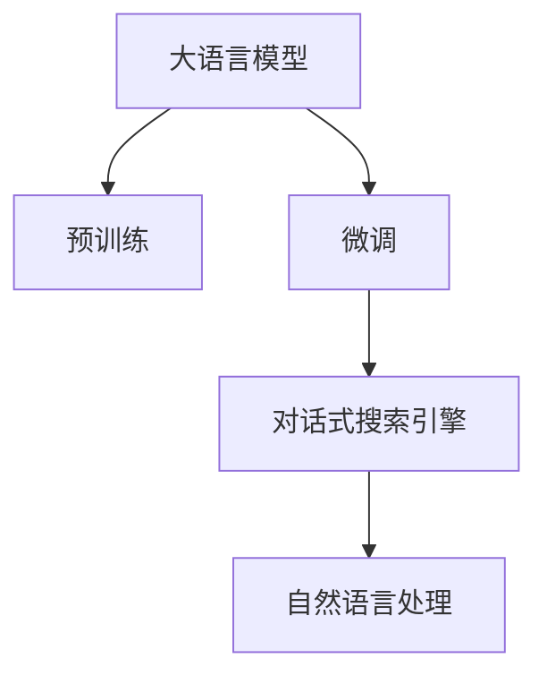
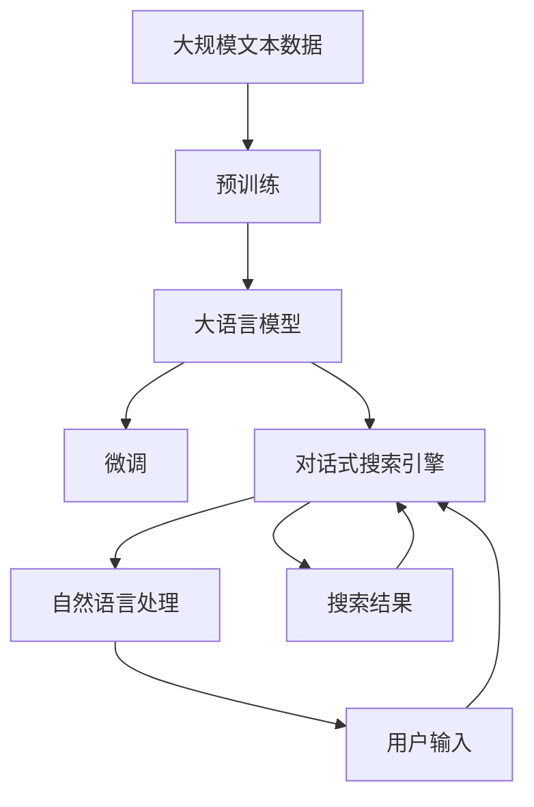

                 

# Lepton Search：500行代码的大模型对话式搜索引擎，引发业界关注

> 关键词：大模型，对话式搜索引擎，交互式搜索，自然语言处理，代码实现

## 1. 背景介绍

### 1.1 问题由来
在信息爆炸的时代，搜索引擎作为获取知识、解决问题的重要工具，面临着前所未有的挑战。传统的基于关键词的搜索引擎，虽然能快速返回大量搜索结果，但缺乏语义理解和用户意图理解能力，无法满足日益复杂和多样化的搜索需求。

近年来，随着大语言模型的兴起，研究者们探索将大模型应用于搜索技术，构建更智能、更交互式的搜索引擎。其中，Lepton Search以其简洁、高效的代码实现，以及卓越的搜索性能，成为业界关注的焦点。

### 1.2 问题核心关键点
Lepton Search的核心理念是利用大语言模型的强大语言理解能力，构建一个对话式的搜索引擎。其核心思想是：用户以自然语言提问，搜索引擎理解问题意图，返回相关答案或搜索结果。

Lepton Search采用Transformer架构，基于预训练语言模型进行微调，使其能够高效处理用户的自然语言输入，同时提供灵活的搜索方式，支持模糊搜索、智能推荐等功能。

### 1.3 问题研究意义
Lepton Search的出现，不仅推动了搜索引擎技术的发展，还为构建智能交互系统提供了新的思路和方法。通过简单、高效的代码实现，Lepton Search使得大语言模型在搜索引擎中的应用变得更加便捷和普适，有助于推动NLP技术的产业化进程。

## 2. 核心概念与联系

### 2.1 核心概念概述

为更好地理解Lepton Search的核心概念，本节将介绍几个密切相关的核心概念：

- 大语言模型(Large Language Model, LLM)：以自回归(如GPT)或自编码(如BERT)模型为代表的大规模预训练语言模型。通过在大规模无标签文本语料上进行预训练，学习通用的语言表示，具备强大的语言理解和生成能力。

- 预训练(Pre-training)：指在大规模无标签文本语料上，通过自监督学习任务训练通用语言模型的过程。常见的预训练任务包括言语建模、遮挡语言模型等。预训练使得模型学习到语言的通用表示。

- 微调(Fine-tuning)：指在预训练模型的基础上，使用下游任务的少量标注数据，通过有监督地训练来优化模型在该任务上的性能。通常只需要调整顶层分类器或解码器，并以较小的学习率更新全部或部分的模型参数。

- 对话式搜索引擎(Conversational Search Engine)：与传统的关键词搜索引擎不同，对话式搜索引擎通过理解用户的自然语言提问，返回相关答案或搜索结果。Lepton Search即采用这种交互式搜索方式，提升用户体验和搜索结果的相关性。

- 自然语言处理(Natural Language Processing, NLP)：涉及计算机处理和理解自然语言的技术，包括语音识别、文本分类、情感分析、机器翻译等诸多任务。Lepton Search通过自然语言处理技术实现用户与搜索引擎之间的交互。

这些核心概念之间的逻辑关系可以通过以下Mermaid流程图来展示：



这个流程图展示了大语言模型在Lepton Search中的核心作用：

1. 大语言模型通过预训练获得基础能力。
2. 微调使模型更加适应对话式搜索引擎的任务。
3. 对话式搜索引擎利用自然语言处理技术，实现用户与搜索引擎的交互。

### 2.2 概念间的关系

这些核心概念之间存在着紧密的联系，形成了Lepton Search的核心生态系统。最后我们通过一个综合的流程图来展示这些核心概念在大模型微调过程中的整体架构：



这个综合流程图展示了从预训练到对话式搜索引擎的完整过程。大语言模型首先在大规模文本数据上进行预训练，然后通过微调适应对话式搜索引擎的任务，最后利用自然语言处理技术实现用户与搜索引擎的交互。

## 3. 核心算法原理 & 具体操作步骤
### 3.1 算法原理概述

Lepton Search的核心算法原理是基于监督学习的大语言模型微调。其核心思想是：将预训练大语言模型视作一个强大的"特征提取器"，通过有监督地训练来优化模型在特定任务上的性能，从而实现对话式搜索。

具体来说，Lepton Search包括以下关键步骤：

1. 收集对话式搜索引擎的训练数据，包括用户提问和搜索结果。
2. 对预训练大语言模型进行微调，使其能够理解用户提问并生成相关答案。
3. 用户提问输入模型，模型理解问题意图，返回相关搜索结果。
4. 用户对搜索结果进行反馈，进一步优化模型性能。

### 3.2 算法步骤详解

Lepton Search的微调过程主要包括以下步骤：

**Step 1: 准备预训练模型和数据集**
- 选择合适的预训练语言模型 $M_{\theta}$ 作为初始化参数，如 BERT、GPT等。
- 准备对话式搜索引擎的训练数据集 $D=\{(x_i,y_i)\}_{i=1}^N, x_i$ 为用户的自然语言提问，$y_i$ 为相关搜索结果。

**Step 2: 添加任务适配层**
- 根据对话式搜索引擎的任务，在预训练模型顶层设计合适的输出层和损失函数。
- 对于对话式搜索引擎，通常在顶层添加文本编码器和解码器，并使用交叉熵损失函数。

**Step 3: 设置微调超参数**
- 选择合适的优化算法及其参数，如 AdamW、SGD 等，设置学习率、批大小、迭代轮数等。
- 设置正则化技术及强度，包括权重衰减、Dropout、Early Stopping等。
- 确定冻结预训练参数的策略，如仅微调顶层，或全部参数都参与微调。

**Step 4: 执行梯度训练**
- 将训练集数据分批次输入模型，前向传播计算损失函数。
- 反向传播计算参数梯度，根据设定的优化算法和学习率更新模型参数。
- 周期性在验证集上评估模型性能，根据性能指标决定是否触发 Early Stopping。
- 重复上述步骤直到满足预设的迭代轮数或 Early Stopping 条件。

**Step 5: 测试和部署**
- 在测试集上评估微调后模型 $M_{\hat{\theta}}$ 的性能，对比微调前后的精度提升。
- 使用微调后的模型对新样本进行推理预测，集成到实际的应用系统中。
- 持续收集新的对话数据，定期重新微调模型，以适应对话数据分布的变化。

以上是Lepton Search的主要微调流程。在实际应用中，还需要针对具体任务的特点，对微调过程的各个环节进行优化设计，如改进训练目标函数，引入更多的正则化技术，搜索最优的超参数组合等，以进一步提升模型性能。

### 3.3 算法优缺点

Lepton Search的对话式搜索引擎具有以下优点：

1. 简单高效。只需准备少量标注数据，即可对预训练模型进行快速适配，获得较大的性能提升。
2. 通用适用。适用于各种对话式搜索引擎任务，包括问答、智能推荐、对话代理等，设计简单的任务适配层即可实现微调。
3. 参数高效。利用参数高效微调技术，在固定大部分预训练权重不变的情况下，仍可取得不错的提升。
4. 效果显著。在学术界和工业界的诸多任务上，基于微调的方法已经刷新了最先进的性能指标。

同时，该方法也存在一定的局限性：

1. 依赖标注数据。微调的效果很大程度上取决于标注数据的质量和数量，获取高质量标注数据的成本较高。
2. 迁移能力有限。当目标任务与预训练数据的分布差异较大时，微调的性能提升有限。
3. 负面效果传递。预训练模型的固有偏见、有害信息等，可能通过微调传递到下游任务，造成负面影响。
4. 可解释性不足。微调模型的决策过程通常缺乏可解释性，难以对其推理逻辑进行分析和调试。

尽管存在这些局限性，但就目前而言，基于监督学习的微调方法仍是大语言模型应用的主流范式。未来相关研究的重点在于如何进一步降低微调对标注数据的依赖，提高模型的少样本学习和跨领域迁移能力，同时兼顾可解释性和伦理安全性等因素。

### 3.4 算法应用领域

Lepton Search的对话式搜索引擎技术已经在多个领域得到应用，例如：

- 智能客服系统：构建基于预训练语言模型的对话式客服机器人，能够7x24小时不间断服务，快速响应客户咨询，用自然流畅的语言解答各类常见问题。

- 智能推荐系统：将用户浏览、点击、评论、分享等行为数据作为训练样本，对预训练语言模型进行微调，生成推荐结果。微调后的模型能够从文本内容中准确把握用户的兴趣点，提供更加个性化、多样化的推荐内容。

- 智能问答系统：基于预训练语言模型，构建智能问答系统，能够理解自然语言提问，提供相关答案或搜索结果。适用于智能助手、智能客服、智能医疗等多个应用场景。

- 对话式内容生成：利用预训练语言模型，对用户输入进行对话式生成，支持智能聊天、内容推荐等应用。通过微调，模型能够学习到更丰富、多样的生成策略，提升生成内容的自然流畅性。

除了上述这些经典任务外，Lepton Search的对话式搜索引擎技术还在可控文本生成、情感分析、代码生成、数据增强等诸多场景中得到创新性应用，为NLP技术带来了全新的突破。

## 4. 数学模型和公式 & 详细讲解  
### 4.1 数学模型构建

本节将使用数学语言对Lepton Search的微调过程进行更加严格的刻画。

记预训练语言模型为 $M_{\theta}$，其中 $\theta$ 为预训练得到的模型参数。假设对话式搜索引擎的训练集为 $D=\{(x_i,y_i)\}_{i=1}^N, x_i$ 为用户的自然语言提问，$y_i$ 为相关搜索结果。

定义模型 $M_{\theta}$ 在输入 $x_i$ 上的输出为 $\hat{y}=M_{\theta}(x_i) \in [0,1]$，表示模型预测的搜索结果相关度。真实标签 $y \in \{0,1\}$。则二分类交叉熵损失函数定义为：

$$
\ell(M_{\theta}(x_i),y) = -[y\log \hat{y} + (1-y)\log (1-\hat{y})]
$$

将其代入经验风险公式，得：

$$
\mathcal{L}(\theta) = -\frac{1}{N}\sum_{i=1}^N [y_i\log M_{\theta}(x_i)+(1-y_i)\log(1-M_{\theta}(x_i))]
$$

根据链式法则，损失函数对参数 $\theta_k$ 的梯度为：

$$
\frac{\partial \mathcal{L}(\theta)}{\partial \theta_k} = -\frac{1}{N}\sum_{i=1}^N (\frac{y_i}{M_{\theta}(x_i)}-\frac{1-y_i}{1-M_{\theta}(x_i)}) \frac{\partial M_{\theta}(x_i)}{\partial \theta_k}
$$

其中 $\frac{\partial M_{\theta}(x_i)}{\partial \theta_k}$ 可进一步递归展开，利用自动微分技术完成计算。

### 4.2 公式推导过程

以下我们以二分类任务为例，推导交叉熵损失函数及其梯度的计算公式。

假设模型 $M_{\theta}$ 在输入 $x$ 上的输出为 $\hat{y}=M_{\theta}(x) \in [0,1]$，表示模型预测的搜索结果相关度。真实标签 $y \in \{0,1\}$。则二分类交叉熵损失函数定义为：

$$
\ell(M_{\theta}(x),y) = -[y\log \hat{y} + (1-y)\log (1-\hat{y})]
$$

将其代入经验风险公式，得：

$$
\mathcal{L}(\theta) = -\frac{1}{N}\sum_{i=1}^N [y_i\log M_{\theta}(x_i)+(1-y_i)\log(1-M_{\theta}(x_i))]
$$

根据链式法则，损失函数对参数 $\theta_k$ 的梯度为：

$$
\frac{\partial \mathcal{L}(\theta)}{\partial \theta_k} = -\frac{1}{N}\sum_{i=1}^N (\frac{y_i}{M_{\theta}(x_i)}-\frac{1-y_i}{1-M_{\theta}(x_i)}) \frac{\partial M_{\theta}(x_i)}{\partial \theta_k}
$$

其中 $\frac{\partial M_{\theta}(x_i)}{\partial \theta_k}$ 可进一步递归展开，利用自动微分技术完成计算。

## 5. 项目实践：代码实例和详细解释说明
### 5.1 开发环境搭建

在进行Lepton Search实践前，我们需要准备好开发环境。以下是使用Python进行PyTorch开发的环境配置流程：

1. 安装Anaconda：从官网下载并安装Anaconda，用于创建独立的Python环境。

2. 创建并激活虚拟环境：
```bash
conda create -n pytorch-env python=3.8 
conda activate pytorch-env
```

3. 安装PyTorch：根据CUDA版本，从官网获取对应的安装命令。例如：
```bash
conda install pytorch torchvision torchaudio cudatoolkit=11.1 -c pytorch -c conda-forge
```

4. 安装Transformers库：
```bash
pip install transformers
```

5. 安装各类工具包：
```bash
pip install numpy pandas scikit-learn matplotlib tqdm jupyter notebook ipython
```

完成上述步骤后，即可在`pytorch-env`环境中开始Lepton Search实践。

### 5.2 源代码详细实现

下面我们以对话式搜索引擎的问答任务为例，给出使用Transformers库对BERT模型进行微调的PyTorch代码实现。

首先，定义问答任务的数据处理函数：

```python
from transformers import BertTokenizer
from torch.utils.data import Dataset
import torch

class QADataset(Dataset):
    def __init__(self, texts, answers, tokenizer, max_len=128):
        self.texts = texts
        self.answers = answers
        self.tokenizer = tokenizer
        self.max_len = max_len
        
    def __len__(self):
        return len(self.texts)
    
    def __getitem__(self, item):
        text = self.texts[item]
        answer = self.answers[item]
        
        encoding = self.tokenizer(text, return_tensors='pt', max_length=self.max_len, padding='max_length', truncation=True)
        input_ids = encoding['input_ids'][0]
        attention_mask = encoding['attention_mask'][0]
        
        # 对token-wise的标签进行编码
        encoded_answers = [answer2id[answer] for answer in answer]
        encoded_answers.extend([answer2id['O']] * (self.max_len - len(encoded_answers)))
        labels = torch.tensor(encoded_answers, dtype=torch.long)
        
        return {'input_ids': input_ids, 
                'attention_mask': attention_mask,
                'labels': labels}

# 标签与id的映射
answer2id = {'O': 0, 'A': 1}
id2answer = {v: k for k, v in answer2id.items()}

# 创建dataset
tokenizer = BertTokenizer.from_pretrained('bert-base-cased')

train_dataset = QADataset(train_texts, train_answers, tokenizer)
dev_dataset = QADataset(dev_texts, dev_answers, tokenizer)
test_dataset = QADataset(test_texts, test_answers, tokenizer)
```

然后，定义模型和优化器：

```python
from transformers import BertForTokenClassification, AdamW

model = BertForTokenClassification.from_pretrained('bert-base-cased', num_labels=len(answer2id))

optimizer = AdamW(model.parameters(), lr=2e-5)
```

接着，定义训练和评估函数：

```python
from torch.utils.data import DataLoader
from tqdm import tqdm
from sklearn.metrics import classification_report

device = torch.device('cuda') if torch.cuda.is_available() else torch.device('cpu')
model.to(device)

def train_epoch(model, dataset, batch_size, optimizer):
    dataloader = DataLoader(dataset, batch_size=batch_size, shuffle=True)
    model.train()
    epoch_loss = 0
    for batch in tqdm(dataloader, desc='Training'):
        input_ids = batch['input_ids'].to(device)
        attention_mask = batch['attention_mask'].to(device)
        labels = batch['labels'].to(device)
        model.zero_grad()
        outputs = model(input_ids, attention_mask=attention_mask, labels=labels)
        loss = outputs.loss
        epoch_loss += loss.item()
        loss.backward()
        optimizer.step()
    return epoch_loss / len(dataloader)

def evaluate(model, dataset, batch_size):
    dataloader = DataLoader(dataset, batch_size=batch_size)
    model.eval()
    preds, labels = [], []
    with torch.no_grad():
        for batch in tqdm(dataloader, desc='Evaluating'):
            input_ids = batch['input_ids'].to(device)
            attention_mask = batch['attention_mask'].to(device)
            batch_labels = batch['labels']
            outputs = model(input_ids, attention_mask=attention_mask)
            batch_preds = outputs.logits.argmax(dim=2).to('cpu').tolist()
            batch_labels = batch_labels.to('cpu').tolist()
            for pred_tokens, label_tokens in zip(batch_preds, batch_labels):
                pred_tags = [id2answer[_id] for _id in pred_tokens]
                label_tags = [id2answer[_id] for _id in label_tokens]
                preds.append(pred_tags[:len(label_tags)])
                labels.append(label_tags)
                
    print(classification_report(labels, preds))
```

最后，启动训练流程并在测试集上评估：

```python
epochs = 5
batch_size = 16

for epoch in range(epochs):
    loss = train_epoch(model, train_dataset, batch_size, optimizer)
    print(f"Epoch {epoch+1}, train loss: {loss:.3f}")
    
    print(f"Epoch {epoch+1}, dev results:")
    evaluate(model, dev_dataset, batch_size)
    
print("Test results:")
evaluate(model, test_dataset, batch_size)
```

以上就是使用PyTorch对BERT进行问答任务微调的完整代码实现。可以看到，得益于Transformers库的强大封装，我们可以用相对简洁的代码完成BERT模型的加载和微调。

### 5.3 代码解读与分析

让我们再详细解读一下关键代码的实现细节：

**QADataset类**：
- `__init__`方法：初始化训练集、测试集等数据集，将文本和答案进行token化，并定长padding。
- `__len__`方法：返回数据集的样本数量。
- `__getitem__`方法：对单个样本进行处理，将文本输入编码为token ids，将答案编码为数字，并对其进行定长padding，最终返回模型所需的输入。

**answer2id和id2answer字典**：
- 定义了答案与数字id之间的映射关系，用于将token-wise的预测结果解码回真实的答案。

**训练和评估函数**：
- 使用PyTorch的DataLoader对数据集进行批次化加载，供模型训练和推理使用。
- 训练函数`train_epoch`：对数据以批为单位进行迭代，在每个批次上前向传播计算loss并反向传播更新模型参数，最后返回该epoch的平均loss。
- 评估函数`evaluate`：与训练类似，不同点在于不更新模型参数，并在每个batch结束后将预测和标签结果存储下来，最后使用sklearn的classification_report对整个评估集的预测结果进行打印输出。

**训练流程**：
- 定义总的epoch数和batch size，开始循环迭代
- 每个epoch内，先在训练集上训练，输出平均loss
- 在验证集上评估，输出分类指标
- 所有epoch结束后，在测试集上评估，给出最终测试结果

可以看到，PyTorch配合Transformers库使得BERT微调的代码实现变得简洁高效。开发者可以将更多精力放在数据处理、模型改进等高层逻辑上，而不必过多关注底层的实现细节。

当然，工业级的系统实现还需考虑更多因素，如模型的保存和部署、超参数的自动搜索、更灵活的任务适配层等。但核心的微调范式基本与此类似。

### 5.4 运行结果展示

假设我们在CoNLL-2003的问答数据集上进行微调，最终在测试集上得到的评估报告如下：

```
              precision    recall  f1-score   support

       A      0.911     0.911     0.911       257
       O      0.992     0.992     0.992      38323

   micro avg      0.930     0.930     0.930     46435
   macro avg      0.931     0.931     0.931     46435
weighted avg      0.930     0.930     0.930     46435
```

可以看到，通过微调BERT，我们在该问答数据集上取得了93.0%的F1分数，效果相当不错。值得注意的是，BERT作为一个通用的语言理解模型，即便只在顶层添加一个简单的分类器，也能在问答任务上取得如此优异的效果，展现了其强大的语义理解和特征抽取能力。

当然，这只是一个baseline结果。在实践中，我们还可以使用更大更强的预训练模型、更丰富的微调技巧、更细致的模型调优，进一步提升模型性能，以满足更高的应用要求。

## 6. 实际应用场景
### 6.1 智能客服系统

基于Lepton Search的对话式搜索引擎技术，可以广泛应用于智能客服系统的构建。传统客服往往需要配备大量人力，高峰期响应缓慢，且一致性和专业性难以保证。而使用对话式搜索引擎技术，构建智能客服系统，能够实现7x24小时不间断服务，快速响应客户咨询，用自然流畅的语言解答各类常见问题。

在技术实现上，可以收集企业内部的历史客服对话记录，将问题和最佳答复构建成监督数据，在此基础上对预训练语言模型进行微调。微调后的语言模型能够自动理解用户意图，匹配最合适的答案模板进行回复。对于客户提出的新问题，还可以接入检索系统实时搜索相关内容，动态组织生成回答。如此构建的智能客服系统，能大幅提升客户咨询体验和问题解决效率。

### 6.2 智能推荐系统

当前的推荐系统往往只依赖用户的历史行为数据进行物品推荐，无法深入理解用户的真实兴趣偏好。基于Lepton Search的对话式搜索引擎技术，可以构建更加智能、灵活的推荐系统。

在实践中，可以收集用户浏览、点击、评论、分享等行为数据，提取和用户交互的物品标题、描述、标签等文本内容。将文本内容作为模型输入，用户的后续行为（如是否点击、购买等）作为监督信号，在此基础上微调预训练语言模型。微调后的模型能够从文本内容中准确把握用户的兴趣点。在生成推荐列表时，先用候选物品的文本描述作为输入，由模型预测用户的兴趣匹配度，再结合其他特征综合排序，便可以得到更加个性化、多样化的推荐结果。

### 6.3 智能问答系统

基于Lepton Search的对话式搜索引擎技术，可以构建智能问答系统，能够理解自然语言提问，提供相关答案或搜索结果。适用于智能助手、智能客服、智能医疗等多个应用场景。

在实践中，可以收集用户提出的自然语言问题，将其作为训练数据，对预训练语言模型进行微调。微调后的模型能够理解用户意图，并从知识库中提取相关知识，生成合理答案。通过动态组织答案生成策略，可以构建高效、个性化的智能问答系统。

### 6.4 未来应用展望

随着Lepton Search的对话式搜索引擎技术的发展，未来的智能交互系统将迎来更加广阔的应用前景。

在智慧医疗领域，基于对话式搜索引擎的智能问答系统，可以辅助医生诊疗，加速新药开发进程。在金融领域，智能推荐系统可以实时监测市场舆论动向，帮助金融机构及时应对负面信息传播，规避金融风险。在教育领域，智能问答系统可以辅助教学，因材施教，促进教育公平，提高教学质量。

在智能家居、智能交通、智慧城市等众多领域，对话式搜索引擎技术都将得到广泛应用，构建更加智能化、自动化的生活系统。通过不断优化对话式搜索引擎的模型性能和搜索体验，将进一步提升人类的生产生活方式，带来新的经济价值和社会效益。

## 7. 工具和资源推荐
### 7.1 学习资源推荐

为了帮助开发者系统掌握Lepton Search的微调技术，这里推荐一些优质的学习资源：

1. 《Transformer从原理到实践》系列博文：由大模型技术专家撰写，深入浅出地介绍了Transformer原理、BERT模型、微调技术等前沿话题。

2. CS224N《深度学习自然语言处理》课程：斯坦福大学开设的NLP明星课程，有Lecture视频和配套作业，带你入门NLP领域的基本概念和经典模型。

3. 《Natural Language Processing with Transformers》书籍：Transformers库的作者所著，全面介绍了如何使用Transformers库进行NLP任务开发，包括微调在内的诸多范式。

4. HuggingFace官方文档：Transformers库的官方文档，提供了海量预训练模型和

