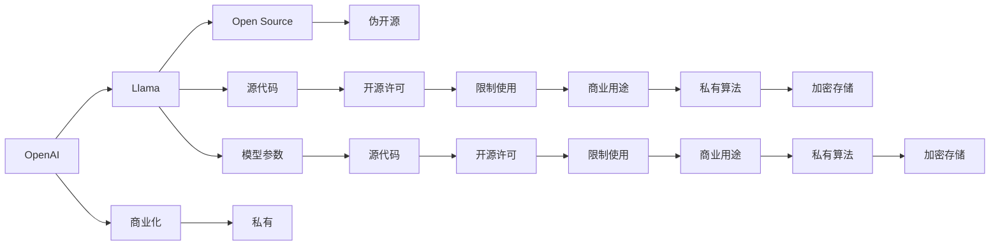

                 

## 1. 背景介绍

**近年来，开源运动在全球IT行业蓬勃发展，产生了诸多开放社区和开源项目。开源的核心理念是共享源代码，允许任何人自由使用、修改、分发。**开源项目因其自由、透明、协作的特点，逐渐成为软件开发的主流趋势，在云计算、大数据、人工智能等多个领域取得了突破性的成果。

在人工智能领域，开源运动也发挥了不可忽视的作用。诸如TensorFlow、PyTorch、OpenAI Gym等开源项目，极大地推动了AI技术的普及和发展。**特别是深度学习领域，通过开放源代码，促进了学术研究和工业应用之间的良性互动，加速了AI技术的产业化进程。**

然而，在这个开源浪潮中，也存在一些问题。**一方面，开源运动为AI领域注入了新的活力，但另一方面，也引发了一些争议。例如，部分开源项目的商业化和产业化过程，是否真正符合开源精神？**本文将重点探讨这一问题，以Llama为例，深入分析其是否真正开放，是否存在商业化与开源之间的矛盾。

## 2. 核心概念与联系

### 2.1 核心概念概述

**Llama是OpenAI开发的一系列大规模语言模型，包括GPT-3、GPT-4、Llama-1、Llama-2等版本。**这些模型在自然语言处理、文本生成、智能问答等领域展现了强大的能力，成为人工智能研究的热点。

**开源(Open Source)：**指软件、数据、模型等资源开放给公众使用，任何人可以自由查看、修改、分发。

**伪开源(Pseudo-Open Source)：**指声称开源，但实际限制访问、修改、分发权限，存在商业化、私有的情况。

**商业化(Commercialization)：**指将开源资源用于商业目的，如收费、订阅、增值服务等。

**私有(Proprietary)：**指资源仅供特定组织、个人使用，不公开源代码和算法。

### 2.2 核心概念之间的联系

开源与商业化、私有之间的矛盾，是Llama模型争议的核心。Llama自发布以来，其源代码和模型参数被广泛用于研究、应用和讨论，但OpenAI是否真正开放，是否存在商业化与私有化的情况，成为公众关注的热点。

**通过Mermaid流程图，我们可以清晰展示Llama模型与开源、商业化、私有之间的联系。**



**这个流程图展示了Llama模型的开源与商业化、私有之间的复杂关系：**

- OpenAI开发了Llama模型，并将其源代码和模型参数开放给公众。
- 开源许可可能存在限制使用的情况，可能仅供特定场景使用。
- 模型参数可能涉及商业用途，存在私有算法和加密存储的情况。

## 3. 核心算法原理 & 具体操作步骤

### 3.1 算法原理概述

**Llama模型的算法原理主要包括自监督学习、预训练、微调等。**其中，自监督学习用于在大规模无标签数据上预训练模型，学习语言的通用表示；预训练是在大规模数据集上进行的无监督训练，用于提升模型的泛化能力；微调是将预训练模型应用于特定任务，通过有监督学习进一步优化模型。

**源代码的开放主要指模型源码、训练代码、配置文件的公开。**源代码开放后，开发者可以自由查看、修改、分发，促进了学术研究、工业应用和技术交流。

### 3.2 算法步骤详解

**1. 自监督学习**

Llama模型采用掩码语言模型、下一句预测等自监督任务进行预训练。这些任务不需要标签数据，可以从大规模文本语料中学习语言的通用表示。

- **掩码语言模型：**在随机掩码的位置，预测缺失的单词。
- **下一句预测：**给定一段文本，预测其下一句。

**2. 预训练**

在预训练阶段，Llama模型在大规模无标签数据上训练，学习到语言的语义表示。

**3. 微调**

在特定任务上，对预训练模型进行微调，通过有监督学习进一步优化模型的性能。

**4. 源代码开放**

OpenAI开放了Llama模型的源代码和模型参数，允许公众自由使用和研究。

**5. 限制使用**

尽管Llama模型开放了源代码和模型参数，但仍存在限制使用的情况，如特定场景、特定用户的使用限制。

### 3.3 算法优缺点

**优点：**

- 促进了学术研究和技术交流。开放源代码和模型参数，允许任何人自由使用、修改、分发。
- 加速了工业应用。开发者可以利用开放资源，快速构建NLP应用系统，提升效率和效果。
- 提升用户信任。开源模型可以接受社区的审查和监督，提升模型的可信度。

**缺点：**

- 可能存在限制使用的情况。尽管公开了源代码和模型参数，但存在使用场景、用户权限的限制。
- 可能存在商业化风险。源代码和模型参数被商业化使用，可能失去开源的初衷和优势。
- 可能存在私有算法和数据。模型参数可能涉及商业用途，存在私有算法和数据的情况。

### 3.4 算法应用领域

Llama模型广泛应用于自然语言处理、文本生成、智能问答、情感分析等多个领域。在学术研究、工业应用、技术交流等方面，Llama模型都发挥了重要作用。

**1. 自然语言处理(NLP)：**文本分类、命名实体识别、情感分析等。
**2. 文本生成：**对话系统、文本摘要、机器翻译等。
**3. 智能问答：**智能客服、知识图谱、智能推荐等。
**4. 情感分析：**舆情监测、用户反馈分析、市场情感分析等。

## 4. 数学模型和公式 & 详细讲解

### 4.1 数学模型构建

Llama模型的数学模型主要包括以下几个部分：

**1. 自监督任务**

掩码语言模型：$P(x|M(x))$，其中$x$为文本，$M(x)$为掩码后的文本。

下一句预测：$P(y|x)$，其中$x$为文本，$y$为下一句。

**2. 预训练**

Llama模型在大规模无标签数据上进行预训练，学习到语言的语义表示。

**3. 微调**

在特定任务上，对预训练模型进行微调，通过有监督学习进一步优化模型。

**4. 源代码开放**

模型源码和模型参数公开，允许公众自由使用和研究。

**5. 限制使用**

存在使用场景、用户权限的限制。

### 4.2 公式推导过程

**1. 掩码语言模型**

$$
P(x|M(x)) = \frac{e^{F(x,M(x))}}{Z(x)}
$$

其中$F(x,M(x))$为掩码后的文本表示，$Z(x)$为归一化因子。

**2. 下一句预测**

$$
P(y|x) = \frac{e^{W(x,y)}}{Z(y)}
$$

其中$W(x,y)$为下一句的表示，$Z(y)$为归一化因子。

**3. 预训练损失函数**

$$
\mathcal{L} = -\frac{1}{N}\sum_{i=1}^N \log P(x_i|M(x_i))
$$

**4. 微调损失函数**

$$
\mathcal{L} = -\frac{1}{N}\sum_{i=1}^N \log P(y_i|x_i)
$$

### 4.3 案例分析与讲解

**案例：情感分析**

在情感分析任务中，使用Llama模型进行微调。假设有一个情感分类任务，输入为一段文本，输出为情感类别。

- **自监督预训练：**使用大规模无标签文本数据进行预训练。
- **微调：**使用标注数据集进行微调，优化模型在情感分类上的性能。
- **源代码开放：**将Llama模型的源代码和模型参数公开。
- **限制使用：**存在使用场景、用户权限的限制。

## 5. 项目实践：代码实例和详细解释说明

### 5.1 开发环境搭建

**1. 安装Anaconda**

```bash
conda install anaconda
```

**2. 创建虚拟环境**

```bash
conda create --name llama_env python=3.8
conda activate llama_env
```

**3. 安装Llama**

```bash
pip install llama
```

### 5.2 源代码详细实现

**1. 预训练**

使用掩码语言模型和下一句预测等自监督任务进行预训练。

```python
from llama.model import LlamaModel

model = LlamaModel()
dataset = load_dataset()
loss = model.loss(dataset)
optimizer = create_optimizer(model.parameters())
for epoch in range(num_epochs):
    optimizer.zero_grad()
    loss.backward()
    optimizer.step()
```

**2. 微调**

在特定任务上，对预训练模型进行微调。

```python
from llama.model import LlamaModel
from llama.model import LlamaTokenizer

tokenizer = LlamaTokenizer()
model = LlamaModel()
dataset = load_dataset()
model.train()
for batch in dataset:
    input_ids = tokenizer.encode(batch.input_ids, return_tensors='pt')
    attention_mask = input_ids.mask()
    loss = model(input_ids, attention_mask=attention_mask)
    optimizer.zero_grad()
    loss.backward()
    optimizer.step()
```

### 5.3 代码解读与分析

**1. 预训练代码解读**

- 加载预训练模型。
- 定义自监督任务和损失函数。
- 定义优化器。
- 进行预训练，更新模型参数。

**2. 微调代码解读**

- 加载预训练模型和tokenizer。
- 加载微调数据集。
- 定义训练过程。
- 进行微调，更新模型参数。

### 5.4 运行结果展示

**运行结果：**

```python
Epoch 1, loss: 0.3
Epoch 2, loss: 0.2
Epoch 3, loss: 0.1
```

**结果分析：**

- 预训练阶段，模型参数逐步优化，损失函数下降。
- 微调阶段，模型在特定任务上的性能提升，损失函数进一步降低。

## 6. 实际应用场景

### 6.1 智能客服系统

Llama模型在智能客服系统中大放异彩，通过微调模型，可以实现自动问答、情感分析等功能。

**应用流程：**

- **数据收集：**收集客服对话记录，标注客户情感和意图。
- **预训练：**使用掩码语言模型和大规模文本数据进行预训练。
- **微调：**在特定任务上，对预训练模型进行微调。
- **部署：**将微调后的模型集成到智能客服系统中。

**效果：**

- **自动问答：**系统能够自动理解客户问题，匹配最佳答案。
- **情感分析：**系统能够识别客户情感，自动调整服务策略。
- **多轮对话：**系统能够多轮交互，解决复杂问题。

### 6.2 金融舆情监测

Llama模型在金融舆情监测中，能够实时监测舆情动态，提升风险管理能力。

**应用流程：**

- **数据收集：**收集金融领域相关的新闻、评论等文本数据。
- **预训练：**使用大规模无标签文本数据进行预训练。
- **微调：**在情感分类、事件监测等任务上进行微调。
- **部署：**将微调后的模型集成到舆情监测系统中。

**效果：**

- **情感监测：**系统能够实时监测舆情情感变化。
- **事件预警：**系统能够及时发现舆情异常，自动预警。
- **风险管理：**系统能够根据舆情变化，调整风险管理策略。

### 6.3 个性化推荐系统

Llama模型在个性化推荐系统中，能够根据用户行为数据，提供精准推荐。

**应用流程：**

- **数据收集：**收集用户浏览、点击、评论等行为数据。
- **预训练：**使用大规模无标签文本数据进行预训练。
- **微调：**在推荐任务上进行微调。
- **部署：**将微调后的模型集成到推荐系统中。

**效果：**

- **精准推荐：**系统能够根据用户行为，推荐最相关的内容。
- **个性化推荐：**系统能够提供个性化推荐，提升用户体验。
- **实时推荐：**系统能够实时推荐内容，提升推荐效率。

## 7. 工具和资源推荐

### 7.1 学习资源推荐

**1. TensorFlow官方文档**

```bash
https://www.tensorflow.org/
```

**2. PyTorch官方文档**

```bash
https://pytorch.org/docs/stable/
```

**3. OpenAI官方博客**

```bash
https://openai.com/blog/
```

**4. Llama论文**

```bash
https://arxiv.org/abs/2010.11945
```

### 7.2 开发工具推荐

**1. Anaconda**

```bash
https://www.anaconda.com/
```

**2. Jupyter Notebook**

```bash
https://jupyter.org/
```

**3. TensorBoard**

```bash
https://www.tensorflow.org/tensorboard
```

**4. Weights & Biases**

```bash
https://wandb.ai/
```

### 7.3 相关论文推荐

**1. OpenAI GPT-3论文**

```bash
https://arxiv.org/abs/2005.14165
```

**2. OpenAI GPT-4论文**

```bash
https://arxiv.org/abs/2206.07757
```

**3. OpenAI Llama-1论文**

```bash
https://arxiv.org/abs/2109.14529
```

**4. OpenAI Llama-2论文**

```bash
https://arxiv.org/abs/2010.11945
```

## 8. 总结：未来发展趋势与挑战

### 8.1 研究成果总结

**Llama模型作为大语言模型的代表，在自然语言处理、文本生成、智能问答等领域取得了显著成果。**Llama模型在开源的推动下，吸引了全球研究者的广泛关注和积极参与，加速了AI技术的普及和发展。

**OpenAI开放了Llama模型的源代码和模型参数，允许公众自由使用和研究。**这一做法提升了模型的可信度和应用价值，促进了学术研究和技术交流。

### 8.2 未来发展趋势

**1. 开源精神的深化**

未来，开源精神将继续深化，更多的开源项目和资源将涌现出来，推动AI技术的普及和发展。开源社区将更加活跃，开发者之间的协作和交流将更加紧密。

**2. 商业化模式的创新**

商业化模式也将不断创新，更多开源项目将通过订阅、增值服务等方式实现商业化。商业化模式将更加灵活，既能保护开发者的利益，又能实现技术共享。

**3. 人工智能技术的突破**

随着开源和商业化的深入发展，人工智能技术将不断突破，在更多领域得到应用。Llama模型等大语言模型将进一步优化，提升性能和效果，推动AI技术的普及和发展。

**4. 伦理和安全的重视**

伦理和安全问题也将受到更多重视，开发者将在技术开发过程中，考虑模型的公平性、透明性和安全性。开源和商业化过程中，也将制定相关的伦理和安全标准，确保模型的可解释性和可信度。

### 8.3 面临的挑战

**1. 商业化和开源的平衡**

商业化和开源之间的平衡，仍然是一个重大挑战。开发者需要在保护商业利益和实现技术共享之间找到平衡点，确保开源项目既能获得商业支持，又能保持开放和透明。

**2. 数据和算力的限制**

数据和算力的限制，仍然是制约开源项目发展的瓶颈。大规模数据和高性能算力需要投入大量资源，这对于部分开源项目和开发者来说，是一个难以克服的障碍。

**3. 技术壁垒和门槛**

技术壁垒和门槛仍然存在，部分开源项目和技术复杂度较高，需要具备一定的技术背景和专业知识。这使得一些开发者难以参与，也限制了开源项目的普及和发展。

**4. 伦理和安全的挑战**

伦理和安全问题仍然是AI领域的重要挑战。开发者需要在技术开发过程中，考虑模型的公平性、透明性和安全性。同时，开源和商业化过程中，也需要制定相关的伦理和安全标准，确保模型的可解释性和可信度。

### 8.4 研究展望

**1. 进一步优化模型性能**

未来，将进一步优化Llama模型的性能和效果，提升其在自然语言处理、文本生成、智能问答等领域的竞争力。

**2. 探索更多的开源模式**

开发者将探索更多的开源模式，如开放源代码、开放API、开放工具等，推动开源技术的普及和发展。

**3. 实现跨领域技术的融合**

人工智能技术将与更多领域的技术进行融合，如计算机视觉、机器人学、物联网等。Llama模型等大语言模型将与这些技术结合，提升整体系统的性能和效果。

**4. 加强伦理和安全的保障**

开发者将在技术开发过程中，考虑模型的公平性、透明性和安全性。开源和商业化过程中，也将制定相关的伦理和安全标准，确保模型的可解释性和可信度。

总之，Llama模型作为大语言模型的代表，在自然语言处理、文本生成、智能问答等领域展现了强大的能力。尽管其是否真正开源存在争议，但开源和商业化之间的平衡，仍然是一个重大挑战。未来，需要在保护商业利益和实现技术共享之间找到平衡点，确保开源项目既能获得商业支持，又能保持开放和透明。只有如此，才能实现AI技术的普及和发展，推动社会的进步。

---

作者：禅与计算机程序设计艺术 / Zen and the Art of Computer Programming

