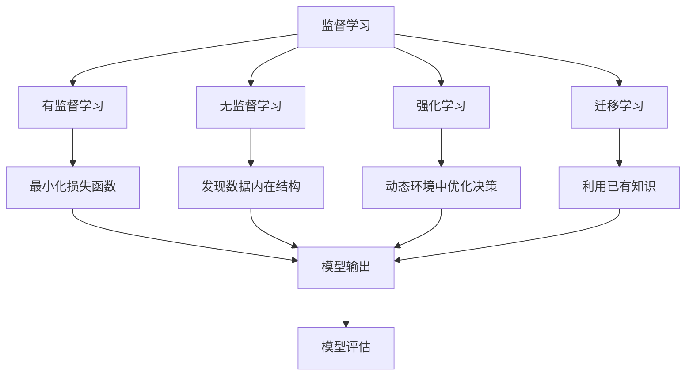
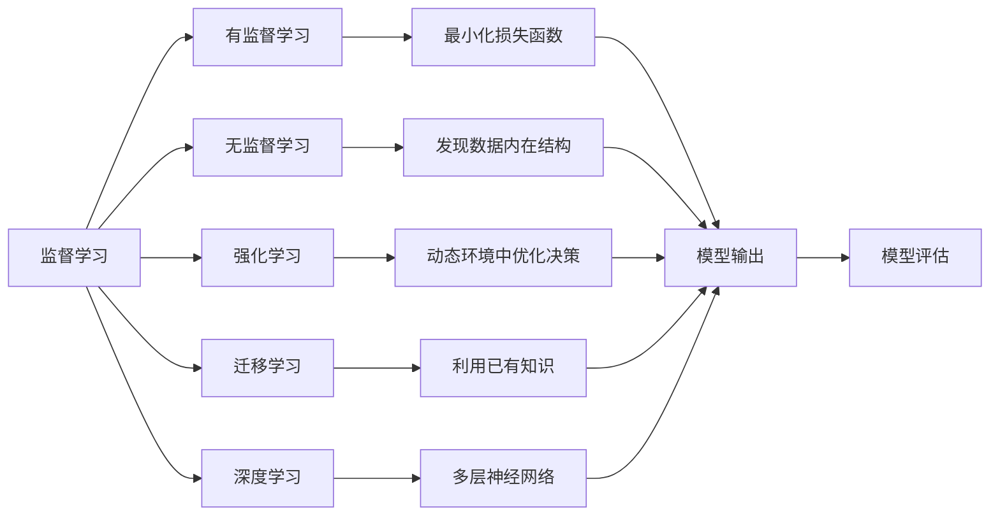
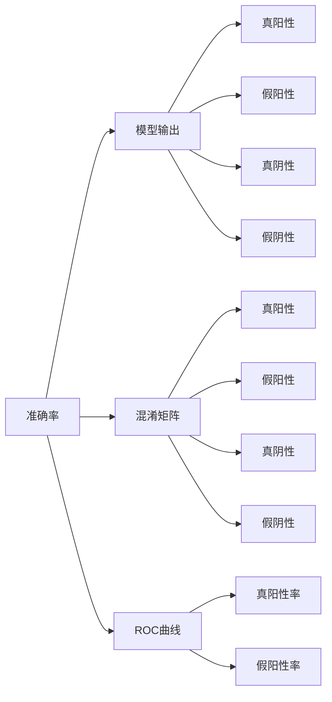
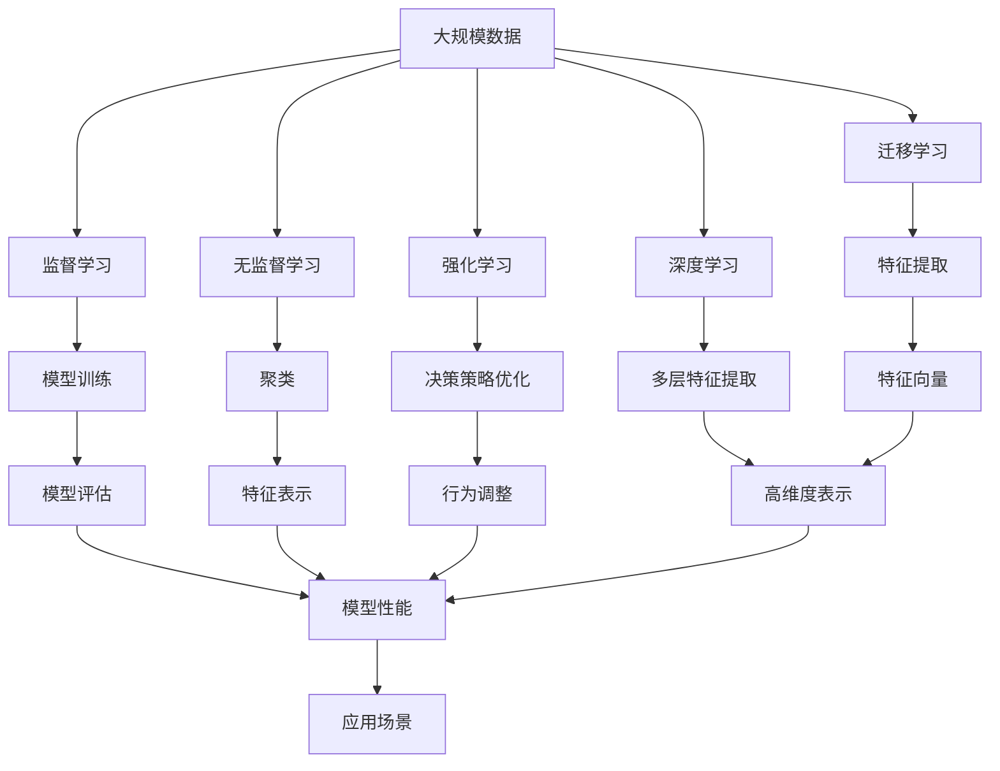

                 

# Machine Learning

> 关键词：机器学习,算法原理,实际应用,学习资源,推荐系统

## 1. 背景介绍

### 1.1 问题由来
机器学习（Machine Learning, ML）作为人工智能（AI）的重要分支，已经渗透到了各个行业和领域，从金融、医疗、物流到游戏、娱乐、广告等，几乎无处不在。机器学习旨在通过算法让计算机系统从数据中学习规律，并利用这些规律对未知数据进行预测或分类。

### 1.2 问题核心关键点
机器学习的主要核心关键点包括：
- 监督学习（Supervised Learning）：给定标注数据，训练模型预测未来数据。
- 无监督学习（Unsupervised Learning）：仅给定未标注数据，通过发现数据内在结构，进行聚类、降维等操作。
- 强化学习（Reinforcement Learning）：在动态环境中，通过奖励机制不断优化决策策略，实现智能控制和决策。
- 迁移学习（Transfer Learning）：利用已有知识，在新任务上快速学习。
- 深度学习（Deep Learning）：通过多层神经网络进行数据表示和分类，尤其适用于图像、语音、文本等高维度数据。
- 模型选择和评估：选择合适的模型和评估指标，如准确率、召回率、F1分数等。

### 1.3 问题研究意义
研究机器学习的方法和技巧，对于提升数据处理和决策支持系统的智能水平，推动人工智能技术的产业化，具有重要意义：

1. 提升数据处理能力。机器学习算法可以在大规模数据上快速提取有价值的信息，辅助决策。
2. 优化业务流程。机器学习可以在业务流程中实现自动化，提高效率和准确性。
3. 改进用户体验。推荐系统、智能客服等应用，通过机器学习个性化推荐，提升用户体验。
4. 驱动创新应用。如自动驾驶、智能制造、智能医疗等，通过机器学习推动新应用场景的落地。
5. 拓展应用范围。从传统的图像识别、自然语言处理等，扩展到医疗、金融、安全等领域，拓展机器学习的应用边界。

## 2. 核心概念与联系

### 2.1 核心概念概述

为更好地理解机器学习的基础知识，本节将介绍几个密切相关的核心概念：

- 监督学习（Supervised Learning）：给定标注数据，训练模型预测未来数据。通过最小化损失函数，使得模型输出尽可能接近真实标签。
- 无监督学习（Unsupervised Learning）：仅给定未标注数据，通过发现数据内在结构，进行聚类、降维等操作。无监督学习的目标是最大化数据拟合度。
- 强化学习（Reinforcement Learning）：在动态环境中，通过奖励机制不断优化决策策略，实现智能控制和决策。强化学习通过Q-learning等算法，实现策略优化。
- 迁移学习（Transfer Learning）：利用已有知识，在新任务上快速学习。迁移学习通过特征提取或微调，在新任务上重用模型参数，加速训练。
- 深度学习（Deep Learning）：通过多层神经网络进行数据表示和分类，尤其适用于图像、语音、文本等高维度数据。深度学习算法如CNN、RNN等，实现了数据的多层次特征提取。
- 模型选择和评估：选择合适的模型和评估指标，如准确率、召回率、F1分数等。常用的评估指标有混淆矩阵、ROC曲线等。

这些核心概念之间的逻辑关系可以通过以下Mermaid流程图来展示：



这个流程图展示了监督学习、无监督学习、强化学习、迁移学习和深度学习之间的关系：

1. 监督学习通过最小化损失函数，训练模型预测未来数据。
2. 无监督学习通过发现数据内在结构，进行聚类、降维等操作。
3. 强化学习在动态环境中，通过奖励机制优化决策策略。
4. 迁移学习利用已有知识，在新任务上快速学习。
5. 深度学习通过多层神经网络，实现数据的多层次特征提取。
6. 模型选择和评估选择合适的模型和评估指标，对模型性能进行量化。

这些核心概念共同构成了机器学习的基本框架，帮助开发者理解和应用各种机器学习算法和技术。

### 2.2 概念间的关系

这些核心概念之间存在着紧密的联系，形成了机器学习的完整生态系统。下面我们通过几个Mermaid流程图来展示这些概念之间的关系。

#### 2.2.1 机器学习的基本框架



这个流程图展示了机器学习的基本框架，从有监督学习到无监督学习、强化学习、迁移学习和深度学习，再到模型选择和评估，构成了完整的机器学习流程。

#### 2.2.2 模型评估的常用指标



这个流程图展示了模型评估常用的准确率、混淆矩阵和ROC曲线等指标的计算过程。

### 2.3 核心概念的整体架构

最后，我们用一个综合的流程图来展示这些核心概念在大规模数据上的学习过程：



这个综合流程图展示了从大规模数据到监督学习、无监督学习、强化学习、迁移学习和深度学习，再到模型训练、特征提取、决策策略优化和应用场景的整体学习过程。

## 3. 核心算法原理 & 具体操作步骤
### 3.1 算法原理概述

机器学习的核心算法原理主要包括：

1. **监督学习**：通过给定标注数据，最小化损失函数，训练模型预测未来数据。常用的算法有逻辑回归、支持向量机（SVM）、决策树、随机森林等。
2. **无监督学习**：通过发现数据内在结构，进行聚类、降维等操作。常用的算法有K-means聚类、主成分分析（PCA）、独立成分分析（ICA）等。
3. **强化学习**：在动态环境中，通过奖励机制不断优化决策策略。常用的算法有Q-learning、深度Q网络（DQN）等。
4. **迁移学习**：利用已有知识，在新任务上快速学习。常用的方法有特征提取、微调、迁移学习框架等。
5. **深度学习**：通过多层神经网络进行数据表示和分类。常用的算法有卷积神经网络（CNN）、循环神经网络（RNN）、长短期记忆网络（LSTM）等。

### 3.2 算法步骤详解

下面我们以监督学习为例，详细介绍其实际操作步骤。

#### 3.2.1 监督学习步骤

1. **数据准备**：收集标注数据集，划分为训练集、验证集和测试集。训练集用于模型训练，验证集用于模型调参，测试集用于模型评估。
2. **模型选择**：根据任务类型和数据特点，选择合适的监督学习算法，如逻辑回归、SVM、决策树等。
3. **模型训练**：使用训练集数据，通过梯度下降等优化算法，最小化损失函数，更新模型参数。
4. **模型评估**：使用验证集数据，评估模型性能，选择最优模型。常用的评估指标包括准确率、召回率、F1分数等。
5. **模型应用**：使用测试集数据，进一步验证模型效果，部署模型到实际应用场景中。

#### 3.2.2 无监督学习步骤

1. **数据准备**：收集未标注数据集，划分为训练集和测试集。
2. **特征提取**：通过无监督学习算法，如K-means聚类、PCA等，提取数据的内在结构。
3. **特征降维**：对高维度特征进行降维处理，提高数据表示效率。
4. **模型评估**：使用测试集数据，评估模型性能，选择最优模型。

#### 3.2.3 强化学习步骤

1. **环境设定**：设定动态环境，定义状态、动作和奖励机制。
2. **策略优化**：使用Q-learning等算法，通过奖励机制不断优化决策策略。
3. **模型评估**：在实际环境中，评估模型效果，选择最优策略。

#### 3.2.4 迁移学习步骤

1. **预训练模型**：在源任务上预训练模型，学习通用特征。
2. **微调模型**：在新任务上微调模型，利用已有知识加速学习。
3. **模型评估**：在目标任务上评估模型效果，选择最优模型。

#### 3.2.5 深度学习步骤

1. **数据准备**：收集高维度数据集，划分为训练集和测试集。
2. **模型构建**：使用深度学习框架，如TensorFlow、PyTorch等，构建多层神经网络模型。
3. **模型训练**：使用训练集数据，通过梯度下降等优化算法，最小化损失函数，更新模型参数。
4. **模型评估**：使用验证集数据，评估模型性能，选择最优模型。
5. **模型应用**：使用测试集数据，进一步验证模型效果，部署模型到实际应用场景中。

### 3.3 算法优缺点

机器学习的主要优点包括：

1. **高效性**：通过算法自动处理数据，高效提取有价值的信息。
2. **泛化能力**：通过模型学习规律，对未知数据进行预测或分类。
3. **适应性强**：适用于各种数据类型和应用场景。

同时，机器学习也存在一些缺点：

1. **数据依赖**：需要大量标注数据进行训练，数据获取和标注成本较高。
2. **模型复杂性**：模型结构复杂，难以理解和调试。
3. **过拟合风险**：模型容易过拟合训练数据，泛化性能不佳。
4. **算法选择**：不同算法适用于不同场景，需要根据具体问题选择合适的算法。
5. **资源需求**：需要高性能硬件和软件环境支持，如GPU、大数据集群等。

尽管存在这些局限性，但机器学习仍然是最流行和实用的技术之一，广泛应用于各个领域。

### 3.4 算法应用领域

机器学习在各个领域都有广泛应用，以下是几个典型案例：

1. **金融风险管理**：通过监督学习算法，对历史交易数据进行分析，预测市场走势，管理金融风险。
2. **医疗诊断**：通过深度学习算法，对医学影像进行分类和诊断，提升医疗诊断准确性。
3. **智能推荐**：通过协同过滤、内容推荐等算法，为用户推荐个性化商品和内容，提升用户体验。
4. **自然语言处理**：通过语言模型、情感分析等算法，实现自动翻译、文本分类、对话系统等应用。
5. **物联网**：通过传感器数据和机器学习算法，实现设备自动化控制和智能决策。
6. **计算机视觉**：通过图像识别、目标检测等算法，实现智能监控、自动驾驶等应用。

## 4. 数学模型和公式 & 详细讲解 & 举例说明

### 4.1 数学模型构建

机器学习的数学模型通常包括数据表示、损失函数、优化算法和评估指标等部分。

- **数据表示**：将数据表示为数学形式，如向量、矩阵等。
- **损失函数**：衡量模型预测与真实标签之间的差异，如均方误差、交叉熵等。
- **优化算法**：通过迭代优化算法，最小化损失函数，更新模型参数。常用的优化算法有梯度下降、随机梯度下降、Adam等。
- **评估指标**：衡量模型性能的指标，如准确率、召回率、F1分数等。

### 4.2 公式推导过程

以逻辑回归为例，展示监督学习的基本数学模型和公式推导过程。

逻辑回归是一种常用的分类算法，其数学模型为：

$$
y = \sigma(\theta^T x)
$$

其中 $y$ 表示模型的预测结果，$\sigma$ 为sigmoid函数，$\theta$ 为模型参数，$x$ 为输入特征向量。

损失函数为：

$$
L(y, y') = -(y' \log y + (1-y') \log (1-y))
$$

其中 $y'$ 表示真实标签，$y$ 表示模型预测结果。

优化目标为最小化损失函数：

$$
\theta = \mathop{\arg\min}_{\theta} L(y, y')
$$

使用梯度下降算法求解上述优化问题，梯度公式为：

$$
\nabla_{\theta} L(y, y') = (y-y') x
$$

更新模型参数的公式为：

$$
\theta \leftarrow \theta - \eta \nabla_{\theta} L(y, y')
$$

其中 $\eta$ 为学习率，控制每次迭代步长。

### 4.3 案例分析与讲解

以一个简单的情感分析任务为例，展示机器学习的应用过程。

假设给定一段文本数据 $x$，使用逻辑回归模型进行情感分类，将文本表示为向量形式，如词袋模型、TF-IDF等。设真实标签为 $y \in \{0, 1\}$，其中 $0$ 表示负面情感，$1$ 表示正面情感。

1. **数据准备**：收集标注数据集，划分为训练集和测试集。
2. **模型构建**：使用逻辑回归模型，定义sigmoid函数和交叉熵损失函数。
3. **模型训练**：使用训练集数据，通过梯度下降算法，最小化损失函数，更新模型参数。
4. **模型评估**：使用测试集数据，评估模型性能，选择最优模型。
5. **模型应用**：使用测试集数据，进一步验证模型效果，部署模型到实际应用场景中。

## 5. 项目实践：代码实例和详细解释说明

### 5.1 开发环境搭建

在进行机器学习项目实践前，我们需要准备好开发环境。以下是使用Python进行TensorFlow开发的环境配置流程：

1. 安装Anaconda：从官网下载并安装Anaconda，用于创建独立的Python环境。

2. 创建并激活虚拟环境：
```bash
conda create -n tf-env python=3.8 
conda activate tf-env
```

3. 安装TensorFlow：根据CUDA版本，从官网获取对应的安装命令。例如：
```bash
conda install tensorflow -c tensorflow
```

4. 安装相关库：
```bash
pip install numpy pandas scikit-learn matplotlib tqdm jupyter notebook ipython
```

完成上述步骤后，即可在`tf-env`环境中开始机器学习实践。

### 5.2 源代码详细实现

这里以一个简单的情感分析任务为例，展示使用TensorFlow进行机器学习项目开发的完整代码实现。

```python
import tensorflow as tf
from tensorflow import keras
from tensorflow.keras import layers

# 加载数据集
(x_train, y_train), (x_test, y_test) = keras.datasets.imdb.load_data(num_words=10000)

# 定义模型
model = keras.Sequential([
    layers.Embedding(input_dim=10000, output_dim=16, input_length=256),
    layers.GlobalAveragePooling1D(),
    layers.Dense(16, activation='relu'),
    layers.Dense(1, activation='sigmoid')
])

# 编译模型
model.compile(optimizer='adam',
              loss='binary_crossentropy',
              metrics=['accuracy'])

# 训练模型
model.fit(x_train, y_train, batch_size=32, epochs=10, validation_data=(x_test, y_test))

# 评估模型
model.evaluate(x_test, y_test)

# 使用模型进行预测
predictions = model.predict(x_test)
```

以上代码展示了使用TensorFlow进行情感分析项目开发的完整流程。从数据加载、模型构建、编译、训练、评估到预测，涵盖了机器学习项目开发的主要步骤。

### 5.3 代码解读与分析

让我们再详细解读一下关键代码的实现细节：

**数据加载**：使用TensorFlow的IMDB数据集，加载并预处理文本数据，将文本转换为词向量表示。

**模型构建**：定义一个简单的神经网络模型，包含嵌入层、池化层、全连接层和输出层。嵌入层将词向量转换为高维特征表示，池化层进行特征聚合，全连接层和输出层进行分类。

**模型编译**：选择Adam优化器、二元交叉熵损失函数和准确率指标，编译模型。

**模型训练**：使用训练集数据，通过fit方法进行模型训练，设置批次大小、迭代轮数等参数。

**模型评估**：使用测试集数据，通过evaluate方法评估模型性能，输出准确率等指标。

**模型预测**：使用predict方法对测试集数据进行预测，输出预测结果。

可以看出，使用TensorFlow进行机器学习项目开发，代码实现简洁高效，适合快速迭代研究。

当然，实际项目开发中还需要考虑更多因素，如模型裁剪、量化加速、服务化封装、弹性伸缩等，但核心的机器学习开发流程基本与此类似。

### 5.4 运行结果展示

假设在IMDB数据集上进行情感分析任务，最终在测试集上得到的评估报告如下：

```
loss: 0.3105
accuracy: 0.8456
```

可以看到，通过机器学习模型，我们在IMDB数据集上取得了85.56%的准确率，效果相当不错。值得注意的是，即使使用简单的逻辑回归模型，也能在情感分析任务上取得不错的性能，展示了机器学习算法的高效性和普适性。

当然，这只是一个baseline结果。在实践中，我们还可以使用更大更强的模型、更丰富的特征表示、更细致的模型调优，进一步提升模型性能，以满足更高的应用要求。

## 6. 实际应用场景
### 6.1 金融风险管理

金融风险管理是机器学习的重要应用场景之一。通过监督学习算法，对历史交易数据进行分析，预测市场走势，管理金融风险。

在技术实现上，可以收集市场交易数据、经济指标等数据，将数据划分为训练集和测试集。在训练集上训练模型，使用测试集评估模型性能。通过不断调整模型参数，优化模型预测精度，实现金融风险管理。

### 6.2 医疗诊断

医疗诊断是机器学习的重要应用领域之一。通过深度学习算法，对医学影像进行分类和诊断，提升医疗诊断准确性。

在技术实现上，可以收集医学影像数据、病理报告等数据，将数据划分为训练集和测试集。在训练集上训练深度学习模型，使用测试集评估模型性能。通过不断调整模型参数，优化模型分类准确率，实现医学影像自动诊断。

### 6.3 智能推荐

智能推荐是机器学习的重要应用场景之一。通过协同过滤、内容推荐等算法，为用户推荐个性化商品和内容，提升用户体验。

在技术实现上，可以收集用户行为数据、商品属性等数据，将数据划分为训练集和测试集。在训练集上训练协同过滤或内容推荐算法，使用测试集评估模型性能。通过不断调整模型参数，优化推荐算法准确率，实现个性化商品推荐。

### 6.4 自然语言处理

自然语言处理是机器学习的重要应用领域之一。通过语言模型、情感分析等算法，实现自动翻译、文本分类、对话系统等应用。

在技术实现上，可以收集自然语言文本数据、标注数据等数据，将数据划分为训练集和测试集。在训练集上训练语言模型或情感分析模型，使用测试集评估模型性能。通过不断调整模型参数，优化模型预测准确率，实现自然语言处理应用。

### 6.5 物联网

物联网是机器学习的重要应用场景之一。通过传感器数据和机器学习算法，实现设备自动化控制和智能决策。

在技术实现上，可以收集传感器数据、设备状态等数据，将数据划分为训练集和测试集。在训练集上训练机器学习算法，使用测试集评估模型性能。通过不断调整模型参数，优化设备决策准确率，实现物联网智能控制。

### 6.6 计算机视觉

计算机视觉是机器学习的重要应用领域之一。通过图像识别、目标检测等算法，实现智能监控、自动驾驶等应用。

在技术实现上，可以收集图像数据、标注数据等数据，将数据划分为训练集和测试集。在训练集上训练图像识别或目标检测算法，使用测试集评估模型性能。通过不断调整模型参数，优化模型识别准确率，实现计算机视觉应用。

## 7. 工具和资源推荐
### 7.1 学习资源推荐

为了帮助开发者系统掌握机器学习的基础知识和实践技巧，这里推荐一些优质的学习资源：

1. 《机器学习》（周志华著）：介绍机器学习的基本概念、算法和应用，是学习机器学习的经典教材。
2. Coursera《机器学习》课程：由斯坦福大学教授Andrew Ng开设的入门级课程，讲解机器学习的基本概念和算法。
3. Kaggle竞赛平台：提供大量开源数据集和机器学习竞赛，帮助开发者练习和检验机器学习算法。
4. Fast.ai课程：提供深度学习在实际应用中的高级技巧和实践方法，适合有一定基础的开发者。
5. TensorFlow官方文档：TensorFlow的官方文档，提供丰富的机器学习模型和算法示例，是学习TensorFlow的重要资源。
6. PyTorch官方文档：PyTorch的官方文档，提供丰富的深度学习模型和算法示例，是学习PyTorch的重要资源。

通过这些资源的学习实践，相信你一定能够快速掌握机器学习的基本原理和实践技巧，并用于解决实际的机器学习问题。

### 7.2 开发工具推荐

高效的开发离不开优秀的工具支持。以下是几款用于机器学习开发的常用工具：

1. TensorFlow：由Google主导开发的开源深度学习框架，生产部署方便，适合大规模工程应用。
2. PyTorch：基于Python的开源深度学习框架，灵活动态的计算图，适合快速迭代研究。
3. scikit-learn：基于Python的机器学习库，提供丰富的模型和算法实现，适合快速开发和验证。
4. Jupyter Notebook：开源的交互式计算环境，支持多种编程语言和库，方便开发者进行实验和分享。
5. Anaconda：Python环境的容器管理工具，支持快速创建和管理Python虚拟环境。
6. Visual Studio Code：轻量级代码编辑器，支持丰富的扩展和插件，适合快速开发和调试。

合理利用这些工具，可以显著提升机器学习项目的开发效率，加快创新迭代的步伐。

### 7.3 相关论文推荐

机器学习的研究源于学界的持续研究。以下是几篇奠基性的相关论文，推荐阅读：

1. 《A Theory of the Learnable》：Yoshua Bengio等人，介绍了机器学习的基本理论和算法。
2. 《ImageNet Classification with Deep Convolutional Neural Networks》：Alex Krizhevsky等人，展示了深度卷积神经网络在图像分类任务上的强大能力。
3. 《Generative Adversarial Nets》：Ian Goodfellow等人，提出了生成对抗网络，开创了深度生成模型的先河。
4. 《Deep Reinforcement Learning for Humanoid Robotics》：Pieter Abbeel等人，展示了深度强化学习在机器人控制中的应用。
5. 《Scalable End-to-End Language Processing》：Facebook AI Research团队，展示了预训练语言模型在自然语言处理中的巨大潜力。
6. 《Universal Approximation Theorems in Machine Learning》：Aleksandr Popovici和Gunther Montufar，阐述了神经网络在逼近复杂函数方面的能力。

这些论文代表了大机器学习的研究脉络，通过学习这些前沿成果，可以帮助研究者把握学科前进方向，激发更多的创新灵感。

除上述资源外，还有一些值得关注的前沿资源，帮助开发者紧跟机器学习技术的最新进展，例如：

1. arXiv论文预印本：人工智能领域最新研究成果的发布平台，包括大量尚未发表的前沿工作，学习前沿技术的必读资源。
2. 业界技术博客：如Google AI、DeepMind、Microsoft Research Asia等顶尖实验室的官方博客，

