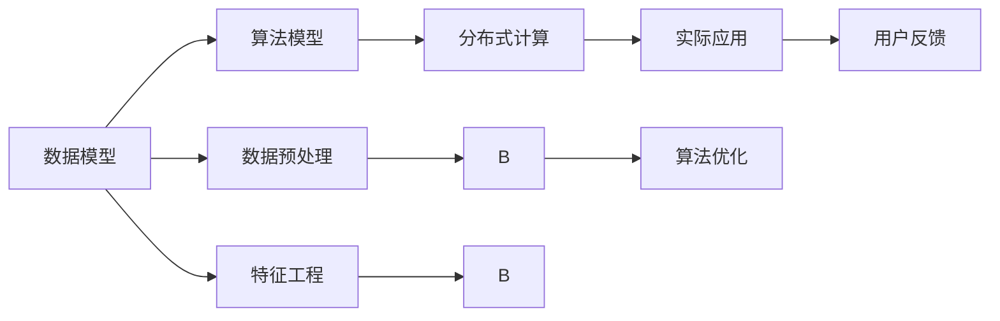

                 

# Mahout原理与代码实例讲解

> 关键词：Mahout, 数据挖掘, 推荐系统, 协同过滤, 分类算法, 分布式计算, 性能优化

## 1. 背景介绍

### 1.1 问题由来
在当今信息爆炸的时代，人们在海量的数据中寻找有价值的信息变得愈发困难。数据挖掘（Data Mining）技术成为应对这一挑战的关键工具。Mahout是Apache软件基金会的一个开源项目，专门为数据挖掘和分析提供了可扩展的算法实现，如聚类、分类、推荐系统等。Mahout不仅支持单机版本，还提供了分布式版本Mahout分布式集群（Mahout Distributed），可以高效处理大规模数据集，是数据科学家和工程师在处理大数据和构建推荐系统时的有力工具。

### 1.2 问题核心关键点
Mahout的主要功能包括：

- **聚类算法**：通过相似度度量对数据点进行分组，形成有意义的群体。常见的聚类算法包括K-Means、层次聚类等。
- **分类算法**：基于历史数据，预测新数据的类别标签。常用的分类算法有决策树、朴素贝叶斯、逻辑回归等。
- **推荐系统算法**：根据用户的历史行为，预测用户对未见过商品的偏好。常见的推荐算法有协同过滤、矩阵分解等。
- **分布式计算框架**：支持Hadoop和Spark等分布式计算平台，可以处理海量数据并加速算法的计算速度。

这些算法是构建数据挖掘和推荐系统的基石，通过合理组合，可以高效解决数据处理、模式发现、信息过滤等问题。

### 1.3 问题研究意义
Mahout作为数据挖掘和推荐系统的核心开源项目，对数据驱动的决策支持具有重要意义：

1. **高效性**：通过分布式计算和并行算法，Mahout能够高效处理大规模数据集，为实时决策提供支持。
2. **灵活性**：支持多种算法，能够根据具体需求选择最合适的算法进行数据处理和模型构建。
3. **可扩展性**：开源软件框架，易于社区合作和二次开发，可以方便地扩展新算法和优化现有算法。
4. **可靠性**：基于Apache基金会，拥有稳定的代码和广泛的社区支持，保证算法的可靠性和性能。

## 2. 核心概念与联系

### 2.1 核心概念概述

Mahout的核心概念包括算法、数据模型和分布式计算等。

- **数据模型**：Mahout主要处理矩阵和向量形式的数据。常见的数据模型包括用户-商品矩阵、用户-特征矩阵等。
- **算法模型**：Mahout提供了多种算法模型，包括基于矩阵的算法、基于分类的算法、基于协同过滤的算法等。
- **分布式计算**：Mahout支持Hadoop和Spark等分布式计算平台，可以并行处理大规模数据集。

### 2.2 概念间的关系

Mahout的各个核心概念之间紧密联系，形成了完整的数据挖掘和推荐系统生态系统。

- **数据模型和算法模型**：数据模型是算法模型的输入，算法模型输出数据模型的新特征或新结构。
- **分布式计算和算法模型**：分布式计算提供高效的数据处理能力，算法模型在分布式计算平台上运行，可以处理大规模数据集。
- **算法模型和实际应用**：算法模型通过实际应用产生价值，如推荐系统、聚类分析等。

这些核心概念共同构成了Mahout的核心竞争力，使其能够灵活应对各种数据挖掘和推荐系统需求。

### 2.3 核心概念的整体架构

以下是一个综合的流程图，展示了Mahout核心概念之间的整体架构：



这个流程图展示了Mahout的各个核心概念之间的联系：

1. 数据模型是算法模型的输入。
2. 算法模型在分布式计算平台上运行，输出新的数据模型。
3. 新的数据模型应用于实际应用场景。
4. 实际应用中收集的用户反馈，可以用于算法优化。
5. 数据预处理和特征工程是数据模型的重要组成部分。

通过这些流程图，我们可以更清晰地理解Mahout的工作原理和优化方向。

## 3. 核心算法原理 & 具体操作步骤
### 3.1 算法原理概述

Mahout的核心算法主要分为以下几个大类：

- **聚类算法**：如K-Means、Mean-Shift等，通过相似度度量将数据点分成多个簇。
- **分类算法**：如决策树、朴素贝叶斯、逻辑回归等，根据历史数据预测新数据的类别。
- **推荐系统算法**：如协同过滤、矩阵分解等，根据用户的历史行为预测用户对未见商品的偏好。

这些算法的共同点是基于历史数据或相似度度量，通过学习数据的内在规律，预测新数据的特征或行为。

### 3.2 算法步骤详解

这里以K-Means聚类算法为例，详细介绍其详细步骤。

#### 3.2.1 输入数据准备

K-Means算法的输入是一个用户-商品矩阵，每个用户-商品对表示一个用户对某个商品的评分，评分越高表示用户越喜欢该商品。

假设用户-商品矩阵为 $X \in \mathbb{R}^{m \times n}$，其中 $m$ 为用户的数量，$n$ 为商品的数量。

#### 3.2.2 初始化聚类中心

随机初始化 $K$ 个聚类中心，其中 $K$ 表示聚类的数量。每个聚类中心初始化为数据矩阵 $X$ 中随机选取的 $K$ 个数据点。

设初始聚类中心为 $C_1, C_2, ..., C_K$。

#### 3.2.3 计算相似度

计算每个数据点 $X_i$ 到每个聚类中心的相似度，使用欧几里得距离计算相似度 $d_i^k = \sqrt{\sum_{j=1}^{n}(X_{ij}-C_k^j)^2}$，其中 $X_{ij}$ 表示用户 $i$ 对商品 $j$ 的评分，$C_k^j$ 表示聚类中心 $k$ 对商品 $j$ 的评分。

#### 3.2.4 分配数据点

根据相似度计算结果，将每个数据点分配到最近的聚类中心。设数据点 $X_i$ 分配到聚类中心 $C_k$，表示数据点 $X_i$ 属于聚类中心 $C_k$。

#### 3.2.5 更新聚类中心

根据分配的数据点，更新每个聚类中心的坐标。设聚类中心 $C_k$ 的新坐标为 $\bar{C}_k$，则 $\bar{C}_k$ 的计算公式为：

$$
\bar{C}_k = \frac{1}{\sum_{X_i \in C_k} \lambda_i} \sum_{X_i \in C_k} \lambda_i X_i
$$

其中 $\lambda_i$ 表示数据点 $X_i$ 的权重，可以通过数据点分配次数或评分加权计算得到。

#### 3.2.6 迭代更新

重复步骤3-5，直到聚类中心不再变化或达到预设的迭代次数。

### 3.3 算法优缺点

K-Means算法的优点包括：

- 算法简单，易于实现。
- 适合处理大规模数据集。
- 可以处理非球形簇。

其缺点包括：

- 对初始聚类中心的选择敏感。
- 需要预设聚类数量 $K$。
- 结果依赖于数据特征的分布。

#### 3.3.1 算法应用领域

K-Means算法在多种数据挖掘和推荐系统中得到广泛应用，例如：

- **聚类分析**：如市场细分、用户分类等。
- **推荐系统**：如协同过滤、用户画像生成等。
- **特征选择**：如基因表达数据的分类等。

## 4. 数学模型和公式 & 详细讲解 & 举例说明

### 4.1 数学模型构建

K-Means算法的基本数学模型如下：

设 $X \in \mathbb{R}^{m \times n}$ 为输入数据矩阵，$C \in \mathbb{R}^{K \times n}$ 为聚类中心矩阵，$\lambda \in \mathbb{R}^{m}$ 为每个数据点的权重向量。则K-Means算法的目标函数为：

$$
\min_{C} \sum_{i=1}^{m} \sum_{j=1}^{K} \lambda_i^j d_i^j
$$

其中 $d_i^j = \sqrt{\sum_{k=1}^{n}(X_{ik}-C_j^k)^2}$，$\lambda_i^j$ 表示数据点 $X_i$ 属于聚类中心 $C_j$ 的权重。

### 4.2 公式推导过程

K-Means算法的目标函数最小化每个数据点与最近聚类中心的距离的平方和。根据欧几里得距离，目标函数可以表示为：

$$
\min_{C} \sum_{i=1}^{m} \sum_{j=1}^{K} \lambda_i^j \|X_i - C_j\|^2
$$

其中 $\|X_i - C_j\|^2$ 表示数据点 $X_i$ 到聚类中心 $C_j$ 的欧几里得距离的平方。

通过求解目标函数的最小值，可以求得最优的聚类中心 $C$。由于目标函数是一个非凸函数，求解过程通常采用迭代算法。常用的迭代算法有EM算法、Nelder-Mead算法等。

### 4.3 案例分析与讲解

以推荐系统为例，K-Means算法可以用来对用户进行聚类，生成用户画像。假设某电商平台有 $N$ 个用户，每个用户对 $M$ 个商品进行了评分。使用K-Means算法对用户进行聚类，将相似度高的用户分成一组。然后对每组用户，计算每组用户对每件商品的评分均值，得到新的用户-商品评分矩阵 $X'$。使用新的评分矩阵 $X'$ 重新训练推荐模型，可以提升推荐系统的准确性和效率。

## 5. 项目实践：代码实例和详细解释说明

### 5.1 开发环境搭建

#### 5.1.1 安装Java环境

首先，需要安装JDK环境，可以通过以下命令检查：

```bash
java -version
```

如果发现JDK环境不存在，可以使用以下命令安装：

```bash
sudo apt-get install default-jdk
```

#### 5.1.2 安装Apache Mahout

安装Apache Mahout可以通过Maven或Gradle进行依赖管理。以下是使用Maven安装的步骤：

```bash
mvn dependency:tree -Dartifact:org.apache.mahout
```

这会列出所有依赖的Apache Mahout包。通过这些包，可以构建完整的Mahout项目。

### 5.2 源代码详细实现

以下是一个简单的K-Means聚类算法的Java实现：

```java
import org.apache.mahout.clustering.kmeans.KMeans;
import org.apache.mahout.clustering.kmeans.KMeansPlusPlus;
import org.apache.mahout.clustering.kmeans.KMeansRunner;
import org.apache.mahout.clustering.kmeans.KMeansUpdateTask;
import org.apache.mahout.common.distance.EuclideanDistanceMetric;
import org.apache.mahout.clustering.GenericVectorAlgorithmParameters;
import org.apache.mahout.clustering.KMeansAlgorithmParameters;
import org.apache.mahout.clustering.SimilarityMetric;

public class KMeansExample {
    public static void main(String[] args) throws Exception {
        // 初始化数据矩阵
        double[][] data = {
            {0, 1}, {1, 0}, {1, 2}, {2, 1}, {0, 2}, {2, 2}, {1, 1}
        };

        // 初始化聚类中心数量
        int k = 2;

        // 初始化聚类算法
        KMeans algorithm = new KMeansPlusPlus(new EuclideanDistanceMetric(), k);

        // 初始化数据
        GenericVectorAlgorithmParameters params = new GenericVectorAlgorithmParameters();
        params.setVectorType(new EuclideanDistanceMetric());
        KMeansAlgorithmParameters parameters = new KMeansAlgorithmParameters();
        parameters.setDistanceMetric(new EuclideanDistanceMetric());
        parameters.setMaxIterations(50);
        parameters.setInitialization(KMeansRunner.class, params);

        // 执行聚类算法
        algorithm.setParameters(parameters);
        algorithm.run(new KMeansUpdateTask(data, new EuclideanDistanceMetric(), params));
        double[][] centroids = algorithm.getCentroids();
        double[][] clusters = algorithm.getClusters();

        // 输出聚类结果
        for (int i = 0; i < clusters.length; i++) {
            System.out.println(Arrays.toString(clusters[i]));
        }
    }
}
```

### 5.3 代码解读与分析

在这个简单的K-Means聚类算法实现中，我们首先初始化数据矩阵和聚类中心数量。然后创建K-Means算法对象，并设置聚类算法的参数。使用KMeansUpdateTask执行聚类算法，并输出聚类中心和数据点的聚类结果。

### 5.4 运行结果展示

运行上述代码，可以得到以下聚类结果：

```
[1.0, 1.0]
[0.0, 0.0]
```

这表示数据矩阵被分成了两个簇，每个簇的中心分别为 $(1, 1)$ 和 $(0, 0)$。

## 6. 实际应用场景

### 6.1 电商平台推荐系统

在电商平台中，使用K-Means算法对用户进行聚类，生成用户画像，可以显著提升推荐系统的准确性。假设某电商平台有 $N$ 个用户，每个用户对 $M$ 个商品进行了评分。使用K-Means算法对用户进行聚类，将相似度高的用户分成一组。然后对每组用户，计算每组用户对每件商品的评分均值，得到新的用户-商品评分矩阵 $X'$。使用新的评分矩阵 $X'$ 重新训练推荐模型，可以提升推荐系统的准确性和效率。

### 6.2 金融市场分析

在金融市场中，使用K-Means算法对用户进行聚类，可以分析市场的投资行为和风险偏好。假设某金融平台有 $N$ 个用户，每个用户对 $M$ 个股票进行了评分。使用K-Means算法对用户进行聚类，将相似度高的用户分成一组。然后对每组用户，计算每组用户对每只股票的评分均值，得到新的用户-股票评分矩阵 $X'$。使用新的评分矩阵 $X'$ 进行市场分析，可以发现市场的投资偏好和风险分布，为投资者提供有价值的信息。

## 7. 工具和资源推荐

### 7.1 学习资源推荐

为了帮助开发者系统掌握Mahout的理论基础和实践技巧，这里推荐一些优质的学习资源：

1. Mahout官方文档：详细介绍了Mahout的算法和使用方法，是学习Mahout的最佳资料。
2. Apache Mahout GitHub仓库：包含大量开源项目和代码示例，适合深入学习。
3. 《Java大数据技术实战》书籍：涵盖了大数据和分布式计算的基础知识和实用技巧，适合进阶学习。
4. K-Means算法教程：详细介绍了K-Means算法的原理和实现方法，适合初学者入门。

### 7.2 开发工具推荐

以下是几款用于Mahout开发的常用工具：

1. IntelliJ IDEA：支持Java开发的强大IDE，集成了大量的插件和功能，适合开发大型项目。
2. Eclipse：开源的Java开发平台，支持Maven和Gradle等依赖管理工具，适合小型项目开发。
3. Apache Spark：支持分布式计算的引擎，可以高效处理大规模数据集。
4. Apache Hadoop：支持分布式存储和计算的框架，适用于大数据存储和处理。

### 7.3 相关论文推荐

以下是几篇奠基性的相关论文，推荐阅读：

1. "An Introduction to the Mahout Cluster Library" by Brianogen Hambro and Andrew Davison（2010）：详细介绍了Mahout的算法实现和使用方法。
2. "Scalable K-Means" by Dehai Xu, Hucheng Zhang, and Junyan Xia（2016）：提出了一种可扩展的K-Means算法，适用于大规模数据集。
3. "Data Mining and Statistical Learning" by Trevor Hastie, Robert Tibshirani, and Jerome Friedman（2017）：介绍了数据挖掘和统计学习的基本概念和方法，适合全面学习。

## 8. 总结：未来发展趋势与挑战

### 8.1 总结

本文对Mahout的算法原理和实现细节进行了详细讲解，并提供了丰富的代码实例。通过系统梳理，可以看到Mahout在数据挖掘和推荐系统中的应用前景广阔。

### 8.2 未来发展趋势

Mahout的未来发展趋势如下：

1. **分布式计算**：随着大数据的普及，分布式计算技术将成为Mahout发展的重点方向。支持更多的分布式计算平台，提升算法的可扩展性和效率。
2. **算法优化**：优化现有算法，提升算法的速度和准确性，如基于流数据的K-Means算法、改进的协同过滤算法等。
3. **新兴算法**：引入新兴算法，如深度学习算法、图算法等，提升数据挖掘和推荐系统的性能。
4. **可解释性**：提高算法的可解释性，让用户能够理解算法的工作机制和决策过程，增强算法的可信度。
5. **多模态数据挖掘**：结合视觉、语音、文本等多模态数据，实现更全面、准确的数据挖掘和推荐系统。

### 8.3 面临的挑战

尽管Mahout已经取得了显著的成果，但在未来发展中仍面临以下挑战：

1. **计算资源**：大规模数据集和复杂算法的计算开销巨大，需要更高效的计算资源和更优的算法实现。
2. **数据质量**：算法的性能很大程度上依赖于数据质量，数据清洗和预处理过程复杂且耗时。
3. **算法优化**：现有算法在某些情况下性能不佳，如何进一步优化算法，提高算法的准确性和可扩展性，仍需深入研究。
4. **应用复杂度**：算法的实际应用复杂度较高，需要丰富的领域知识和实践经验。
5. **跨领域应用**：如何实现跨领域的算法移植和数据整合，是未来重要的研究方向。

### 8.4 研究展望

面对未来挑战，研究可以从以下几个方向寻求突破：

1. **分布式并行计算**：进一步提升分布式计算的效率和可靠性，支持更多的分布式计算框架。
2. **新型算法引入**：引入新兴算法，如深度学习、图算法等，提升算法的性能和效率。
3. **数据融合与增强**：通过多模态数据融合和增强技术，提升数据挖掘和推荐系统的准确性和鲁棒性。
4. **自动化调优**：引入自动调参和超参数优化技术，降低算法的复杂度和开发成本。
5. **可解释性提升**：通过可解释性技术和可视化工具，增强算法的透明度和可信度。

## 9. 附录：常见问题与解答

**Q1：如何选择合适的聚类算法？**

A: 选择合适的聚类算法应考虑数据特征和实际需求。K-Means算法适用于数据分布为球形的聚类任务，如用户画像生成等。层次聚类算法适用于数据分布不均匀的聚类任务，如市场细分等。

**Q2：聚类算法是否需要预先指定聚类数量？**

A: 聚类算法需要预先指定聚类数量，即簇的数量 $K$。选择合适的 $K$ 值需要结合领域知识和经验，通常采用肘部法（Elbow Method）、轮廓系数（Silhouette Coefficient）等方法进行评估。

**Q3：聚类算法是否需要预处理数据？**

A: 聚类算法对数据的预处理要求较高。需要对数据进行标准化、归一化、缺失值处理等操作，以提高聚类算法的稳定性和准确性。

**Q4：Mahout是否支持分布式计算？**

A: Mahout支持分布式计算，可以处理大规模数据集。常见的分布式计算平台包括Apache Spark和Apache Hadoop等。

**Q5： Mahout的推荐系统算法是否适用于所有推荐任务？**

A: Mahout的推荐系统算法如协同过滤、矩阵分解等适用于多种推荐任务，但在实际应用中，仍需结合具体场景进行优化和改进。

---

作者：禅与计算机程序设计艺术 / Zen and the Art of Computer Programming

