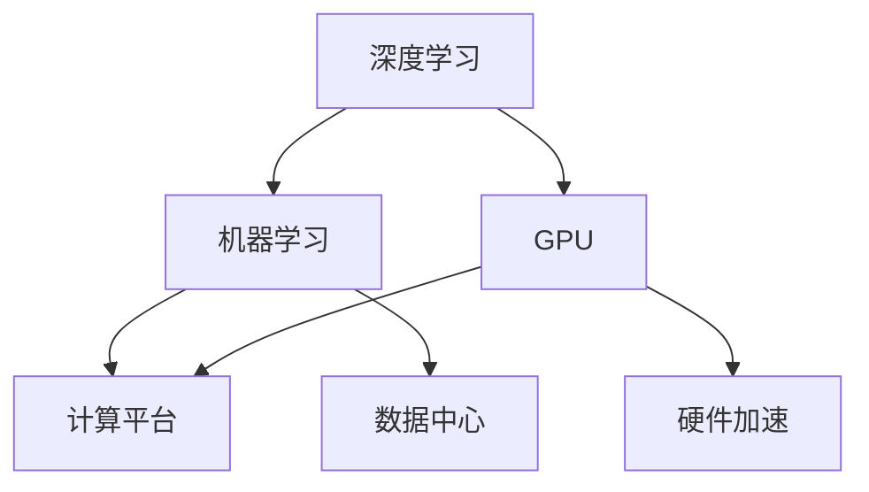

                 

# Nvidia的GPU与AI的发展

> 关键词：人工智能,深度学习,机器学习,计算平台,图形处理单元,硬件加速,数据中心

## 1. 背景介绍

在过去十年中，Nvidia的GPU在人工智能（AI）和机器学习（ML）领域的发展和普及中起到了关键作用。随着深度学习技术的飞速进步，GPU的强大并行计算能力成为了训练复杂深度神经网络（DNN）不可或缺的硬件资源。在这篇博客中，我们将探讨Nvidia GPU在AI和ML领域的发展历程、关键技术和应用领域，并展望未来发展趋势。

## 2. 核心概念与联系

### 2.1 核心概念概述

为了更好地理解Nvidia GPU在AI和ML领域的应用，我们首先介绍几个关键概念：

- **图形处理单元（GPU）**：一种专用集成电路（ASIC），用于加速计算密集型的并行任务，尤其是图形和视频处理。
- **深度学习（Deep Learning）**：一种机器学习方法，通过多层神经网络实现对复杂数据模式的学习和预测。
- **机器学习（Machine Learning）**：使用算法让计算机系统能够从数据中学习和改进，并做出预测或决策。
- **计算平台**：用于运行和支持AI和ML任务的软件和硬件的集合。
- **硬件加速**：通过专用硬件（如GPU）加速软件算法的计算过程，提高性能。
- **数据中心**：大规模计算设施，用于存储、处理和分析海量数据。

这些概念之间的联系在于，GPU的并行计算能力使得深度学习和机器学习算法能够在合理的时间内处理和分析海量数据，加速模型的训练和推理过程，从而推动AI和ML技术的快速发展。

### 2.2 概念间的关系

通过以下Mermaid流程图，我们可以更好地理解这些概念之间的联系：



这个流程图展示了深度学习、机器学习和计算平台之间的层级关系，以及GPU和数据中心在硬件加速中的作用。

## 3. 核心算法原理 & 具体操作步骤

### 3.1 算法原理概述

Nvidia GPU在AI和ML中的应用主要基于两个原理：并行计算和加速内存。

- **并行计算**：深度学习模型中包含大量参数，每个参数都需要在训练过程中进行计算。GPU通过数千个计算核心并行处理这些参数，大大提升了计算效率。
- **加速内存**：GPU的内存带宽远高于CPU，能够快速读写数据，减少了数据传输和计算的时间延迟，提高了模型的训练速度。

### 3.2 算法步骤详解

Nvidia GPU支持AI和ML算法的主要步骤如下：

1. **数据预处理**：将原始数据转换为模型可处理的形式，如图像预处理、文本向量表示等。
2. **模型构建**：选择或构建适合的深度学习模型，如卷积神经网络（CNN）、循环神经网络（RNN）等。
3. **模型训练**：使用GPU加速训练过程，通过反向传播算法更新模型参数，最小化损失函数。
4. **模型推理**：使用GPU加速模型推理过程，快速计算输入数据在模型中的输出。

### 3.3 算法优缺点

Nvidia GPU在AI和ML领域的应用具有以下优点：

- **高效计算**：GPU的并行计算能力使得深度学习模型的训练和推理速度大大提升。
- **广泛应用**：GPU可用于多种AI和ML任务，包括计算机视觉、自然语言处理、推荐系统等。
- **资源丰富**：Nvidia提供了多样化的GPU产品，如Tesla、Quadro、GeForce等，满足不同场景的需求。

同时，也存在一些缺点：

- **功耗高**：高性能GPU的功耗较大，需要高效的散热系统支持。
- **内存限制**：尽管GPU内存容量不断增加，但依然存在限制，影响某些大型模型的训练。
- **成本高**：高性能GPU价格较高，对预算有限的机构和个人构成挑战。

### 3.4 算法应用领域

Nvidia GPU在AI和ML领域的应用领域广泛，以下是几个主要的应用场景：

- **计算机视觉**：GPU用于训练和推理各种视觉识别模型，如图像分类、目标检测、人脸识别等。
- **自然语言处理（NLP）**：GPU加速了各种NLP任务，如机器翻译、情感分析、文本生成等。
- **推荐系统**：GPU优化了推荐引擎的训练和推荐速度，提高了用户体验。
- **数据科学**：GPU加速了数据清洗、处理和分析过程，提升了数据科学家的工作效率。
- **科学研究**：GPU加速了科学计算和模拟过程，推动了物理学、生物学等领域的科研进展。

## 4. 数学模型和公式 & 详细讲解  
### 4.1 数学模型构建

Nvidia GPU在AI和ML中的应用通常基于以下数学模型：

- **反向传播算法**：用于更新深度学习模型的参数，最小化损失函数。
- **卷积神经网络（CNN）**：使用卷积操作提取图像特征，广泛应用于计算机视觉任务。
- **循环神经网络（RNN）**：用于处理序列数据，如自然语言处理中的文本序列。
- **深度强化学习**：通过奖励机制训练模型，实现智能决策和控制。

### 4.2 公式推导过程

以下推导CNN的基本计算过程：

$$
\text{卷积运算} = \sum_{i=0}^{n-1} \sum_{j=0}^{m-1} w_{i,j} * x_{i,j}
$$

其中，$w_{i,j}$ 为卷积核权重，$x_{i,j}$ 为输入数据。

### 4.3 案例分析与讲解

以图像分类为例，我们可以使用卷积神经网络（CNN）进行训练和推理。CNN通过卷积层、池化层和全连接层等模块，逐层提取和分类图像特征。具体步骤如下：

1. **卷积层**：使用卷积核提取图像特征。
2. **池化层**：通过最大池化或平均池化降低特征图的维度。
3. **全连接层**：使用Softmax函数输出分类结果。

## 5. 项目实践：代码实例和详细解释说明

### 5.1 开发环境搭建

为了在Nvidia GPU上运行AI和ML代码，我们需要进行以下环境搭建：

1. **安装CUDA和cuDNN**：Nvidia的并行计算平台，用于加速GPU计算。
2. **安装TensorFlow或PyTorch**：流行的深度学习框架，支持GPU加速。
3. **安装Nvidia GPU驱动程序**：确保GPU与主机的连接和兼容性。

### 5.2 源代码详细实现

以下是一个使用TensorFlow和Nvidia GPU进行图像分类的示例代码：

```python
import tensorflow as tf
from tensorflow.keras import layers
from tensorflow.keras.layers import Conv2D, MaxPooling2D, Flatten, Dense
from tensorflow.keras.optimizers import Adam

# 构建模型
model = tf.keras.Sequential([
    layers.Conv2D(32, (3, 3), activation='relu', input_shape=(28, 28, 1)),
    MaxPooling2D((2, 2)),
    Flatten(),
    Dense(10, activation='softmax')
])

# 编译模型
model.compile(optimizer=Adam(learning_rate=0.001), loss='categorical_crossentropy', metrics=['accuracy'])

# 训练模型
model.fit(train_images, train_labels, epochs=10, validation_data=(test_images, test_labels))

# 推理模型
predictions = model.predict(test_images)
```

### 5.3 代码解读与分析

在上述代码中，我们使用了TensorFlow的Keras API构建了一个简单的卷积神经网络模型。通过`Conv2D`层进行卷积运算，`MaxPooling2D`层进行池化操作，`Dense`层进行全连接运算。我们使用Adam优化器进行模型训练，并在训练过程中输出准确率和损失函数。

## 6. 实际应用场景

### 6.1 智能驾驶

智能驾驶系统需要实时处理大量的传感器数据，如摄像头图像、雷达数据等。使用Nvidia GPU可以加速这些数据的处理和深度学习模型的推理，提高自动驾驶的安全性和可靠性。

### 6.2 医学影像分析

医学影像分析需要处理大量高分辨率图像，如CT、MRI等。Nvidia GPU可以加速图像处理和深度学习模型的训练，帮助医生快速诊断疾病，提高诊断准确率。

### 6.3 科学研究

科学计算和模拟通常需要处理大量数据和运行复杂的算法。Nvidia GPU可以加速计算过程，推动物理学、生物学等领域的研究进展。

### 6.4 未来应用展望

随着Nvidia GPU的不断升级和优化，其在AI和ML领域的应用将更加广泛和深入。未来，我们可以期待以下几个方向的发展：

- **自动驾驶**：智能驾驶系统将更加成熟和可靠，提供更高安全性和舒适性。
- **医疗诊断**：医学影像分析和疾病预测将更加准确和快速，提高诊断效率和准确率。
- **科学研究**：复杂科学计算和模拟将更加高效，推动科研领域的创新和突破。
- **普适化应用**：Nvidia GPU将进一步降低成本，应用于更多行业和领域，推动AI和ML技术的普及和落地。

## 7. 工具和资源推荐

### 7.1 学习资源推荐

为了掌握Nvidia GPU在AI和ML领域的应用，以下是一些推荐的学习资源：

1. **Nvidia官方文档**：提供详细的GPU架构、性能优化和应用指导。
2. **TensorFlow和PyTorch官方文档**：提供深度学习框架的API和应用案例。
3. **Deep Learning Specialization**：由Andrew Ng教授主讲的深度学习课程，涵盖深度学习的基础和应用。
4. **Coursera AI and Machine Learning Specialization**：由deeplearning.ai主讲的AI和ML课程，涵盖深度学习、强化学习等内容。

### 7.2 开发工具推荐

以下是几个常用的Nvidia GPU开发工具：

1. **NVIDIA CUDA Toolkit**：用于GPU编程和优化的开发工具包。
2. **TensorFlow**：基于Nvidia GPU的深度学习框架。
3. **PyTorch**：基于Nvidia GPU的深度学习框架。
4. **cuDNN**：Nvidia提供的深度神经网络库，用于加速深度学习算法的计算。
5. **NVIDIA TensorRT**：用于加速深度学习模型的推理和部署。

### 7.3 相关论文推荐

以下是几篇关键论文，推荐阅读：

1. **DeepBlue**：IBM开发的国际象棋人工智能系统，展示了Nvidia GPU在计算密集型任务中的应用。
2. **AlphaGo**：DeepMind开发的围棋人工智能系统，展示了Nvidia GPU在强化学习中的应用。
3. **ImageNet Large Scale Visual Recognition Challenge (ILSVRC)**：计算机视觉领域的年度竞赛，展示了Nvidia GPU在图像分类任务中的应用。

## 8. 总结：未来发展趋势与挑战

### 8.1 研究成果总结

Nvidia GPU在AI和ML领域的应用已经取得了显著进展，推动了深度学习技术和应用的快速发展。通过并行计算和加速内存等技术，Nvidia GPU加速了模型训练和推理过程，提升了计算效率和模型性能。

### 8.2 未来发展趋势

未来，Nvidia GPU将在以下几个方向继续发展：

- **自适应计算**：根据任务需求自动调整计算资源，优化性能和能效。
- **边缘计算**：将GPU计算能力扩展到边缘设备，支持实时数据处理和推理。
- **量子计算**：结合量子计算和GPU计算，推动计算能力的新突破。
- **混合精度计算**：通过混合精度计算技术，提升GPU的计算效率和精度。

### 8.3 面临的挑战

尽管Nvidia GPU在AI和ML领域取得了巨大成功，但仍面临一些挑战：

- **功耗管理**：高性能GPU的功耗较大，需要高效的散热系统支持。
- **内存限制**：尽管GPU内存容量不断增加，但依然存在限制，影响某些大型模型的训练。
- **成本问题**：高性能GPU价格较高，对预算有限的机构和个人构成挑战。
- **数据隐私和安全**：在处理敏感数据时，需要确保数据隐私和安全，防止数据泄露和滥用。

### 8.4 研究展望

未来，我们需要在以下几个方面进行深入研究：

- **高效能计算**：进一步提升GPU的计算效率和能效，降低能耗和成本。
- **自适应计算**：开发自适应计算技术，使GPU根据任务需求动态调整计算资源，优化性能和能效。
- **跨领域应用**：推动GPU技术在其他领域的应用，如自动化、智能制造等。
- **数据隐私和安全**：研究数据隐私保护和安全机制，确保数据安全和隐私。

总之，Nvidia GPU在AI和ML领域的应用前景广阔，但也需要不断优化和创新，以应对未来的挑战和需求。相信随着Nvidia GPU的不断进步，AI和ML技术将更加强大和普适，推动社会的全面智能化。

## 9. 附录：常见问题与解答

**Q1：Nvidia GPU在AI和ML中的应用与CPU有哪些区别？**

A: Nvidia GPU与CPU的主要区别在于并行计算能力和内存带宽。GPU可以同时处理大量数据，而CPU通常是串行计算。GPU的内存带宽远高于CPU，能够快速读写数据，减少数据传输和计算的时间延迟，提高模型的训练速度。

**Q2：如何优化Nvidia GPU的性能？**

A: 优化Nvidia GPU的性能可以从以下几个方面入手：
- **使用混合精度计算**：通过降低数据精度来提高计算效率。
- **调整计算图**：优化GPU计算图的结构和布局，减少计算量。
- **数据预处理**：对数据进行预处理和优化，提高数据传输和计算效率。
- **使用并行算法**：使用并行算法加速计算过程，提高计算效率。

**Q3：Nvidia GPU在未来有哪些新的应用场景？**

A: 未来，Nvidia GPU将在以下几个新应用场景中发挥重要作用：
- **自动驾驶**：智能驾驶系统需要处理大量的传感器数据，GPU可以加速这些数据的处理和深度学习模型的推理。
- **医疗影像分析**：医学影像分析需要处理大量高分辨率图像，GPU可以加速图像处理和深度学习模型的训练。
- **科学研究**：科学计算和模拟通常需要处理大量数据和运行复杂的算法，GPU可以加速计算过程，推动科研领域的创新和突破。
- **普适化应用**：Nvidia GPU将进一步降低成本，应用于更多行业和领域，推动AI和ML技术的普及和落地。

---

作者：禅与计算机程序设计艺术 / Zen and the Art of Computer Programming

