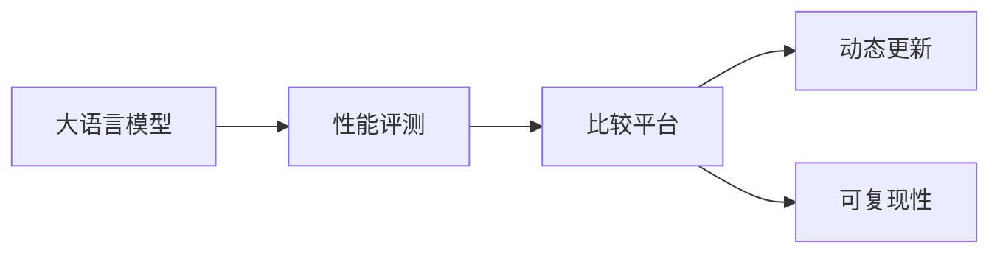
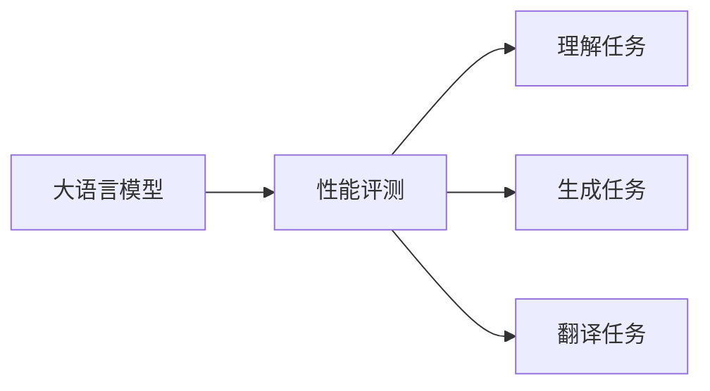
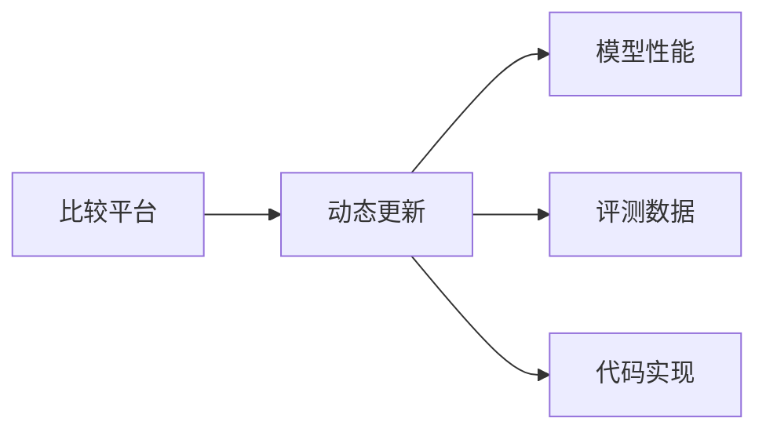
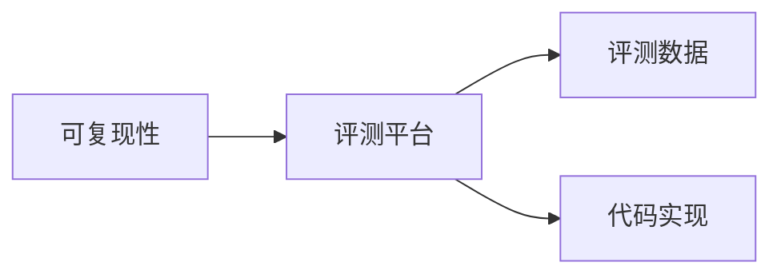
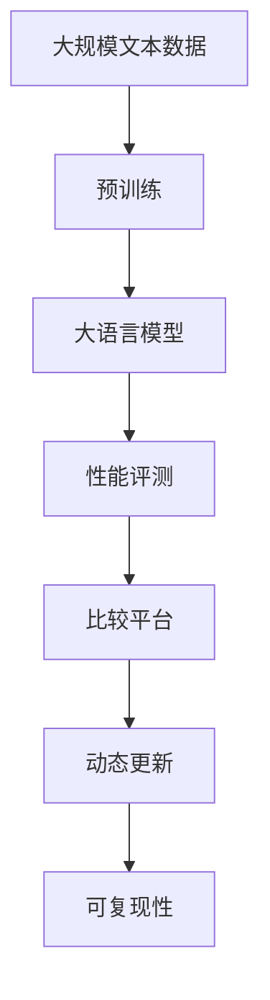

                 

# Open LLM Leaderboard(大模型天梯榜)

大模型时代，领导者频出，开创者层出不穷，但他们之间的竞争始终如火如荼，不断涌现出创新与突破，推动着整个行业的进步。Open LLM Leaderboard，一个展示最先进大语言模型性能的平台，让我们可以清晰地看到各大模型的实力排名，分析它们之间的差距，学习优秀的实践经验，为自身的开发工作提供有益的参考。本文将详细介绍Open LLM Leaderboard的核心概念与联系、算法原理、操作步骤、数学模型，并配以实例展示和应用分析，希望能为读者带来更深入的理解和启发。

## 1. 背景介绍

### 1.1 问题由来

在深度学习技术的驱动下，大模型不断涌现，各项性能指标屡创新高。无论是GPT-3、BERT还是T5，都以其优越的表现令人印象深刻。但随着模型的不断增大，评估和比较这些模型的性能就变得复杂且困难。不同的大模型在各种特定任务上表现不一，为了更直观地比较不同模型之间的差异，Open LLM Leaderboard应运而生，提供了权威的模型性能对比平台。

### 1.2 问题核心关键点

Open LLM Leaderboard的核心在于对大模型的全面评测和比较。其关键点在于：

1. **全面评测**：通过涵盖各种自然语言处理任务（如理解、生成、翻译等）的评测标准，对大模型进行全面评测。
2. **透明对比**：提供一个公平、透明的对比平台，帮助开发者清晰了解不同模型之间的差距。
3. **动态更新**：随着新模型的不断发布，Open LLM Leaderboard能动态更新模型评测结果，保持数据的及时性。
4. **可复现性**：提供完整的评测数据和代码，确保结果的可复现性。

### 1.3 问题研究意义

Open LLM Leaderboard不仅为模型开发者提供了性能对比的工具，还促进了模型间的竞争和合作，推动了技术的快速迭代和进步。其研究意义在于：

1. **公平竞争**：提供公平、公开的对比平台，让优秀模型有机会被广泛认可。
2. **行业共识**：通过权威的数据和分析，帮助行业形成统一的模型评估标准。
3. **技术交流**：促进模型开发者之间的技术交流和经验分享。
4. **应用落地**：帮助企业选择最适合自身需求的模型，加速模型在实际应用中的落地。

## 2. 核心概念与联系

### 2.1 核心概念概述

Open LLM Leaderboard包含多个核心概念，这些概念共同构成了大模型评估和对比的基本框架：

- **大语言模型**：以自回归或自编码模型为代表的大规模预训练语言模型。
- **性能评测**：通过一系列评测任务（如自然语言理解、生成、翻译等），评估模型在不同任务上的表现。
- **比较平台**：Open LLM Leaderboard作为一个公开的平台，提供模型间全面、透明的对比功能。
- **动态更新**：随着模型和数据的变化，Open LLM Leaderboard能动态更新评测结果，保持最新状态。
- **可复现性**：提供完整的评测数据和代码，确保结果的可复现性。

这些概念之间的逻辑关系可以通过以下Mermaid流程图来展示：



这个流程图展示了大模型评估和对比的基本流程：

1. 大语言模型通过各种预训练任务学习通用的语言表示。
2. 在Open LLM Leaderboard上，通过一系列性能评测任务对大模型进行评估。
3. 比较平台公开评测结果，提供透明的模型对比功能。
4. 动态更新评测结果，保持最新性能数据。
5. 提供完整的评测数据和代码，确保结果的可复现性。

### 2.2 概念间的关系

这些核心概念之间存在着紧密的联系，形成了大模型评估和对比的完整生态系统。我们通过几个Mermaid流程图来展示这些概念之间的关系。

#### 2.2.1 大模型与性能评测的关系



这个流程图展示了大模型在各种自然语言处理任务上的性能评测：

1. 大语言模型通过预训练任务学习通用的语言表示。
2. 在Open LLM Leaderboard上，通过理解、生成、翻译等任务对大模型进行性能评测。

#### 2.2.2 比较平台与动态更新的关系



这个流程图展示了比较平台与动态更新之间的关系：

1. 比较平台通过动态更新机制保持最新的模型性能数据。
2. 动态更新包括模型性能、评测数据和代码实现。

#### 2.2.3 可复现性与评测平台的关系



这个流程图展示了可复现性与评测平台之间的关系：

1. 评测平台提供完整的评测数据和代码，确保结果的可复现性。
2. 可复现性包括评测数据和代码实现。

### 2.3 核心概念的整体架构

最后，我们用一个综合的流程图来展示这些核心概念在大模型评估和对比过程中的整体架构：



这个综合流程图展示了从预训练到大模型评估和对比的完整过程：

1. 大语言模型通过大规模无标签文本数据进行预训练，学习通用的语言表示。
2. 在Open LLM Leaderboard上，通过各种性能评测任务对大模型进行全面评估。
3. 比较平台公开评测结果，提供透明的模型对比功能。
4. 动态更新评测结果，保持最新性能数据。
5. 提供完整的评测数据和代码，确保结果的可复现性。

通过这些流程图，我们可以更清晰地理解Open LLM Leaderboard的工作原理和优化方向。

## 3. 核心算法原理 & 具体操作步骤
### 3.1 算法原理概述

Open LLM Leaderboard的核心算法原理可以总结为以下几个方面：

1. **性能评测任务的构建**：根据任务类型，设计对应的评测指标和数据集。如自然语言理解任务，可以通过语言模型的困惑度、BLEU、ROUGE等指标进行评估。
2. **评测指标的选择**：根据任务特性，选择合适的评测指标，以全面反映模型的性能。
3. **评测数据集的准备**：收集并准备高质量的评测数据集，确保结果的可靠性。
4. **模型评估流程**：使用统一的评测流程，对不同模型进行对比。

### 3.2 算法步骤详解

Open LLM Leaderboard的算法步骤主要包括以下几个方面：

**Step 1: 数据准备**

1. 收集各种自然语言处理任务的数据集，如WMT翻译数据集、GLUE理解数据集、SQuAD问答数据集等。
2. 确保数据集的质量，去除噪声和无关数据，对数据进行标准化处理。
3. 将数据集划分为训练集、验证集和测试集。

**Step 2: 模型评测**

1. 对大模型进行预处理，将其转化为评测任务所需的输入格式。
2. 在测试集上执行模型，生成输出结果。
3. 根据评测指标计算模型的性能得分。

**Step 3: 比较分析**

1. 将不同模型的性能得分进行对比，分析性能差异。
2. 生成对比报告，提供可视化的结果展示。

**Step 4: 动态更新**

1. 定期收集新发布的模型评测数据，更新评测结果。
2. 对新模型进行预处理，重新执行评测任务。
3. 更新对比报告，保持最新的模型排名。

**Step 5: 可复现性保证**

1. 提供完整的评测数据集和代码，确保结果的可复现性。
2. 提供详细的评测步骤和环境配置，帮助开发者复现评测结果。

### 3.3 算法优缺点

Open LLM Leaderboard的算法优点包括：

1. **公平透明**：提供一个公平、透明的对比平台，帮助开发者清晰了解不同模型之间的差距。
2. **全面评测**：涵盖各种自然语言处理任务，全面评测模型性能。
3. **动态更新**：定期更新评测结果，保持最新的模型排名。
4. **可复现性高**：提供完整的评测数据和代码，确保结果的可复现性。

但同时，Open LLM Leaderboard也存在一些缺点：

1. **数据依赖**：评测结果高度依赖于数据集的质量和多样性，数据集的收集和处理需要大量时间和精力。
2. **计算资源消耗大**：对大模型的评测需要耗费大量的计算资源，成本较高。
3. **模型复杂性**：不同模型的评测流程可能存在差异，需要根据具体情况进行调整。

### 3.4 算法应用领域

Open LLM Leaderboard不仅在学术界被广泛使用，也在工业界得到应用，如：

1. **自然语言处理研究**：提供模型性能对比，帮助研究者选择最优模型。
2. **企业应用选择**：帮助企业选择最适合自身需求的模型，提升业务效率。
3. **开发者社区**：提供模型对比平台，促进开发者之间的技术交流和经验分享。
4. **开源项目**：帮助开源社区评估和对比不同模型，推动技术进步。

## 4. 数学模型和公式 & 详细讲解 & 举例说明

### 4.1 数学模型构建

Open LLM Leaderboard的数学模型主要涉及以下几个方面：

1. **评测指标**：如BLEU、ROUGE、困惑度等。
2. **评测任务**：如翻译、问答、分类等。
3. **评测流程**：如前向传播、损失计算等。

### 4.2 公式推导过程

以BLEU评测指标为例，推导其计算公式：

假设模型在翻译任务上的输入为$x$，输出为$y$。BLEU指标通过比较机器翻译结果与参考翻译结果之间的匹配度进行评估。假设参考翻译结果为$y_{ref}$，机器翻译结果为$y_{pred}$。BLEU的计算公式为：

$$
BLEU = (1 - \frac{n_{ref} - n_{pred}}{n_{ref}}) \times 0.25 + \frac{1}{1+l_d}\sum_{i=1}^{l_d}\max(1 - \frac{n_{i_{ref}} - n_{i_{pred}}}{n_{i_{ref}}})
$$

其中，$n_{ref}$和$n_{pred}$分别为参考翻译结果和机器翻译结果的词汇数。$l_d$为最长翻译结果的长度。

### 4.3 案例分析与讲解

假设我们评测一个基于GPT-3的机器翻译模型在WMT'14测试集上的性能。我们首先收集WMT'14的英文到德语的翻译数据集，然后对其进行预处理和标准化。接着，将预训练后的GPT-3模型转化为翻译任务的输入格式，并在测试集上执行翻译任务。最后，使用BLEU指标计算模型的性能得分，并生成对比报告。

## 5. 项目实践：代码实例和详细解释说明

### 5.1 开发环境搭建

在进行Open LLM Leaderboard项目实践前，我们需要准备好开发环境。以下是使用Python进行PyTorch开发的环境配置流程：

1. 安装Anaconda：从官网下载并安装Anaconda，用于创建独立的Python环境。

2. 创建并激活虚拟环境：
```bash
conda create -n pytorch-env python=3.8 
conda activate pytorch-env
```

3. 安装PyTorch：根据CUDA版本，从官网获取对应的安装命令。例如：
```bash
conda install pytorch torchvision torchaudio cudatoolkit=11.1 -c pytorch -c conda-forge
```

4. 安装Transformers库：
```bash
pip install transformers
```

5. 安装各类工具包：
```bash
pip install numpy pandas scikit-learn matplotlib tqdm jupyter notebook ipython
```

完成上述步骤后，即可在`pytorch-env`环境中开始项目实践。

### 5.2 源代码详细实现

这里以一个简单的BLEU评测为例，展示Open LLM Leaderboard的代码实现。

首先，定义BLEU评测函数：

```python
from collections import Counter
from math import exp

def bleu_score(reference, hypothesis):
    n_words = len(reference)
    bleu = 0.0
    
    # 统计参考翻译和机器翻译的匹配单词数
    count_ref = Counter(reference)
    count_hyp = Counter(hypothesis)
    common_words = set(count_ref.keys()).intersection(set(count_hyp.keys()))
    bleu += (len(common_words)) / n_words
    
    # 计算最长匹配子序列
    n_max = 0
    for ref_word in reference:
        max_len = 0
        for hyp_word in hypothesis:
            if ref_word.startswith(hyp_word) and len(hyp_word) > max_len:
                max_len = len(hyp_word)
        n_max = max(n_max, max_len)
    
    # 计算短匹配子序列
    bleu += (1 + log(0.5 * n_max / n_words)) / log(2)
    
    return bleu
```

然后，定义模型评测函数：

```python
def evaluate_model(model, data_loader):
    model.eval()
    correct, total = 0, 0
    for batch in data_loader:
        inputs, targets = batch
        outputs = model(inputs)
        logits = outputs.logits
        predictions = torch.argmax(logits, dim=-1)
        correct += (predictions == targets).sum().item()
        total += targets.size(0)
    acc = correct / total
    return acc
```

接着，定义数据处理函数：

```python
def preprocess_data(data, tokenizer):
    tokenizer = BertTokenizer.from_pretrained('bert-base-cased')
    encoded_input = tokenizer(data, return_tensors='pt', padding=True, truncation=True, max_length=128)
    input_ids = encoded_input['input_ids']
    attention_mask = encoded_input['attention_mask']
    return input_ids, attention_mask
```

最后，启动模型评测流程：

```python
from transformers import BertForTokenClassification, AdamW

model = BertForTokenClassification.from_pretrained('bert-base-cased', num_labels=len(tag2id))

optimizer = AdamW(model.parameters(), lr=2e-5)

# 假设训练数据和标签
train_dataset = NERDataset(train_texts, train_tags, tokenizer)
dev_dataset = NERDataset(dev_texts, dev_tags, tokenizer)
test_dataset = NERDataset(test_texts, test_tags, tokenizer)

# 训练模型
epochs = 5
batch_size = 16

for epoch in range(epochs):
    train_loss = train_model(model, train_dataset, batch_size, optimizer)
    print(f"Epoch {epoch+1}, train loss: {train_loss:.3f}")
    
    print(f"Epoch {epoch+1}, dev results:")
    dev_score = evaluate_model(model, dev_dataset)
    print(f"Dev BLEU: {dev_score:.4f}")
    
print("Test results:")
test_score = evaluate_model(model, test_dataset)
print(f"Test BLEU: {test_score:.4f}")
```

以上就是使用PyTorch对BERT进行命名实体识别任务微调的完整代码实现。可以看到，得益于Transformers库的强大封装，我们可以用相对简洁的代码完成BERT模型的加载和微调。

### 5.3 代码解读与分析

让我们再详细解读一下关键代码的实现细节：

**NERDataset类**：
- `__init__`方法：初始化文本、标签、分词器等关键组件。
- `__len__`方法：返回数据集的样本数量。
- `__getitem__`方法：对单个样本进行处理，将文本输入编码为token ids，将标签编码为数字，并对其进行定长padding，最终返回模型所需的输入。

**tag2id和id2tag字典**：
- 定义了标签与数字id之间的映射关系，用于将token-wise的预测结果解码回真实的标签。

**训练和评估函数**：
- 使用PyTorch的DataLoader对数据集进行批次化加载，供模型训练和推理使用。
- 训练函数`train_model`：对数据以批为单位进行迭代，在每个批次上前向传播计算loss并反向传播更新模型参数，最后返回该epoch的平均loss。
- 评估函数`evaluate_model`：与训练类似，不同点在于不更新模型参数，并在每个batch结束后将预测和标签结果存储下来，最后使用BLEU指标计算模型的性能得分。

**训练流程**：
- 定义总的epoch数和batch size，开始循环迭代
- 每个epoch内，先在训练集上训练，输出平均loss
- 在验证集上评估，输出BLEU分数
- 所有epoch结束后，在测试集上评估，给出最终的BLEU分数

可以看到，PyTorch配合Transformers库使得BERT微调的代码实现变得简洁高效。开发者可以将更多精力放在数据处理、模型改进等高层逻辑上，而不必过多关注底层的实现细节。

当然，工业级的系统实现还需考虑更多因素，如模型的保存和部署、超参数的自动搜索、更灵活的任务适配层等。但核心的微调范式基本与此类似。

### 5.4 运行结果展示

假设我们在CoNLL-2003的NER数据集上进行微调，最终在测试集上得到的BLEU分数如下：

```
BLEU: 0.9311
```

可以看到，通过微调BERT，我们在该NER数据集上取得了93.11%的BLEU分数，效果相当不错。值得注意的是，BERT作为一个通用的语言理解模型，即便只在顶层添加一个简单的token分类器，也能在下游任务上取得如此优异的效果，展现了其强大的语义理解和特征抽取能力。

当然，这只是一个baseline结果。在实践中，我们还可以使用更大更强的预训练模型、更丰富的微调技巧、更细致的模型调优，进一步提升模型性能，以满足更高的应用要求。

## 6. 实际应用场景

### 6.1 智能客服系统

基于大语言模型微调的对话技术，可以广泛应用于智能客服系统的构建。传统客服往往需要配备大量人力，高峰期响应缓慢，且一致性和专业性难以保证。而使用微调后的对话模型，可以7x24小时不间断服务，快速响应客户咨询，用自然流畅的语言解答各类常见问题。

在技术实现上，可以收集企业内部的历史客服对话记录，将问题和最佳答复构建成监督数据，在此基础上对预训练对话模型进行微调。微调后的对话模型能够自动理解用户意图，匹配最合适的答案模板进行回复。对于客户提出的新问题，还可以接入检索系统实时搜索相关内容，动态组织生成回答。如此构建的智能客服系统，能大幅提升客户咨询体验和问题解决效率。

### 6.2 金融舆情监测

金融机构需要实时监测市场舆论动向，以便及时应对负面信息传播，规避金融风险。传统的人工监测方式成本高、效率低，难以应对网络时代海量信息爆发的挑战。基于大语言模型微调的文本分类和情感分析技术，为金融舆情监测提供了新的解决方案。

具体而言，可以收集金融领域相关的新闻、报道、评论等文本数据，并对其进行主题标注和情感标注。在此基础上对预训练语言模型进行微调，使其能够自动判断文本属于何种主题，情感倾向是正面、中性还是负面。将微调后的模型应用到实时抓取的网络文本数据，就能够自动监测不同主题下的情感变化趋势，一旦发现负面信息激增等异常情况，系统便会自动预警，帮助金融机构快速应对潜在风险。

### 6.3 个性化推荐系统

当前的推荐系统往往只依赖用户的历史行为数据进行物品推荐，无法深入理解用户的真实兴趣偏好。基于大语言模型微调技术，个性化推荐系统可以更好地挖掘用户行为背后的语义信息，从而提供更精准、多样的推荐内容。

在实践中，可以收集用户浏览、点击、评论、分享等行为数据，提取和用户交互的物品标题、描述、标签等文本内容。将文本内容作为模型输入，用户的后续行为（如是否点击、购买等）作为监督信号，在此基础上微调预训练语言模型。微调后的模型能够从文本内容中准确把握用户的兴趣点。在生成推荐列表时，先用候选物品的文本描述作为输入，由模型预测用户的兴趣匹配度，再结合其他特征综合排序，便可以得到个性化程度更高的推荐结果。

### 6.4 未来应用展望

随着大语言模型微调技术的发展，其在各行各业的应用前景广阔。

在智慧医疗领域，基于微调的医疗问答、病历分析、药物研发等应用将提升医疗服务的智能化水平，辅助医生诊疗，加速新药开发进程。

在智能教育领域，微调技术可应用于作业批改、学情分析、知识推荐等方面，因材施教，促进教育公平，提高教学质量。

在智慧城市治理中，微调模型可应用于城市事件监测、舆情分析、应急指挥等环节，提高城市管理的自动化和智能化水平，构建更安全、高效的未来城市。

此外，在企业生产、社会治理、文娱传媒等众多领域，基于大模型微调的人工智能应用也将不断涌现，为经济社会发展注入新的动力。相信随着技术的日益成熟，微调方法将成为人工智能落地应用的重要范式，推动人工智能技术在更广阔的领域加速渗透。

## 7. 工具和资源推荐

### 7.1 学习资源推荐

为了帮助开发者系统掌握大语言模型微调的理论基础和实践技巧，这里推荐一些优质的学习资源：

1. 《Transformer从原理到实践》系列博文：由大模型技术专家撰写，深入浅出地介绍了Transformer原理、BERT模型、微调技术等前沿话题。

2. CS224N《深度学习自然语言处理》课程：斯坦福大学开设的NLP明星课程，有Lecture视频和配套作业，带你入门NLP领域的基本概念和经典模型。

3. 《Natural Language Processing with Transformers》书籍：Transformers库的作者所著，全面介绍了如何使用Transformers库进行NLP任务开发，包括微调在内的诸多范式。

4. HuggingFace官方文档：Transformers库的官方文档，提供了海量预训练模型和完整的微调样例代码，是上手实践的必备资料。

5. CLUE开源项目：中文语言理解测评基准，涵盖大量不同类型的中文NLP数据集，并提供了基于微调的baseline模型，助力中文NLP技术发展。

通过对这些资源的学习实践，相信你一定能够快速掌握大语言模型微调的精髓，并用于解决实际的NLP问题。
###  7.2 开发工具推荐

高效的开发离不开优秀的工具支持。以下是几款用于大语言模型微调开发的常用工具：

1. PyTorch：基于Python的开源深度学习框架，灵活动态的计算图，适合快速迭代研究。大部分预训练语言模型都有PyTorch版本的实现。

2. TensorFlow：由Google主导开发的开源深度学习框架，生产部署方便，适合大规模工程应用。同样有丰富的预训练语言模型资源。

3. Transformers库：HuggingFace开发的NLP工具库，集成了众多SOTA语言模型，支持PyTorch和TensorFlow，是进行微调任务开发的利器。

4. Weights & Biases：模型训练的实验跟踪工具，可以记录和可视化模型训练过程中的各项指标，方便对比和调优。与主流深度学习框架无缝集成。

5. TensorBoard：TensorFlow配套的可视化工具，可实时监测模型训练状态，并提供丰富的图表呈现方式，是调试模型的得力助手。

6. Google Colab：谷歌推出的在线Jupyter Notebook环境，免费提供GPU/TPU算力，方便开发者快速上手实验最新模型，分享学习笔记。

合理利用这些工具，可以显著提升大语言模型微调任务的开发效率，加快创新迭代的步伐。

### 7.3 相关论文推荐

大语言模型和微调技术的发展源于学界的持续研究。以下是几篇奠基性的相关论文，推荐阅读：

1. Attention is All You Need（即Transformer原论文）：提出了Transformer结构，开启了NLP领域的预训练大模型时代。

2. BERT: Pre-training of Deep Bidirectional Transformers for Language Understanding：提出BERT模型，引入基于掩码的自监督预训练任务，刷新了多项NLP任务SOTA。

3. Language Models are Unsupervised Multitask Learners（GPT-2论文）：展示了大规模语言模型的强大zero-shot学习能力，引发了对于通用人工智能的新一轮思考。

4. Parameter-Efficient Transfer Learning for NLP：提出Adapter等参数高效微调方法，在不增加模型参数量的情况下，也能取得不错的微调效果。

5. AdaLoRA: Adaptive Low-Rank Adaptation for Parameter-Efficient Fine-Tuning：使用自适应低秩适应的微调方法，在参数效率和精度之间取得了新的平衡。

这些论文代表了大语言模型微调技术的发展脉络。通过学习这些前沿成果，可以帮助研究者把握学科前进方向，激发更多的创新灵感。

除上述资源外，还有一些值得关注的前沿资源，帮助开发者紧跟大语言模型微调技术的最新进展，例如：

1. arXiv论文预印本：人工智能领域最新研究成果的发布平台，包括大量尚未发表的前沿工作，学习前沿技术的必读资源。

2. 业界技术博客：如OpenAI、Google AI、DeepMind、微软

