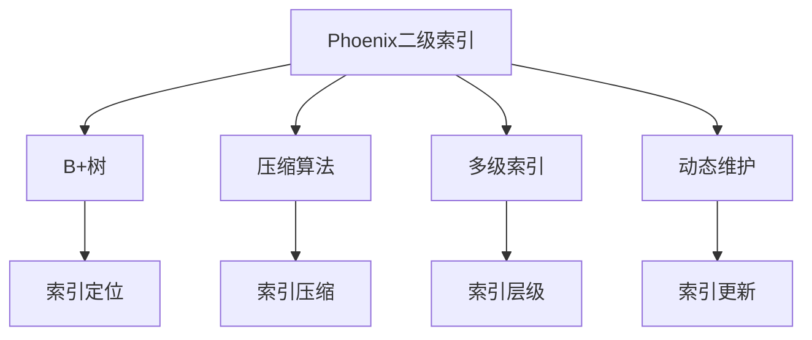
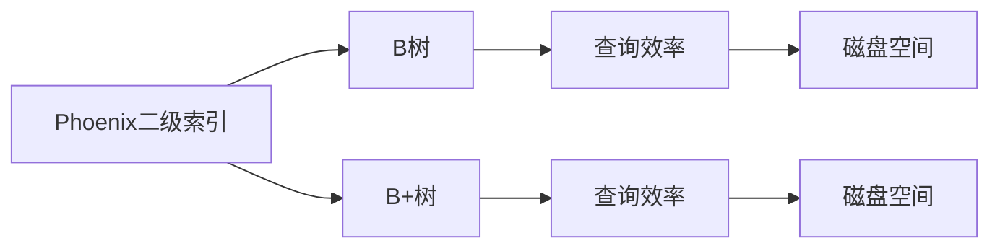
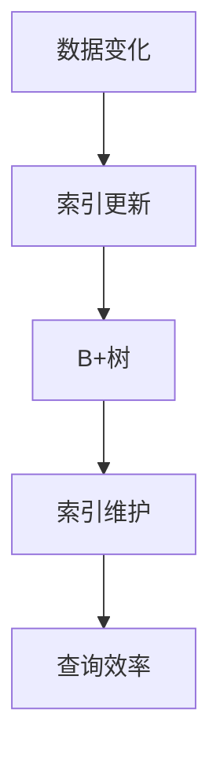
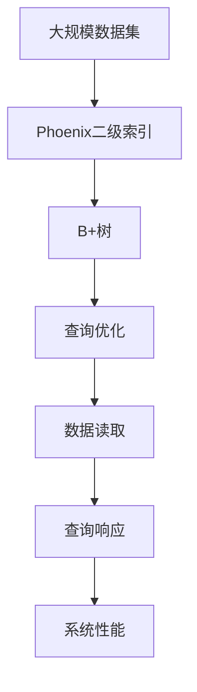

                 

# Phoenix二级索引原理与代码实例讲解

> 关键词：Phoenix、二级索引、SQL索引、MySQL索引、B+树、B树、数据结构、数据库系统、数据库查询优化

## 1. 背景介绍

### 1.1 问题由来

在现代数据库系统中，索引是优化查询性能的关键技术之一。通过在数据表上建立索引，数据库管理系统可以迅速定位数据，避免全表扫描，从而大大提高查询效率。然而，对于大规模的数据集，传统B树索引往往难以兼顾查询效率和存储开销。

Phoenix是一种基于二级索引的新型数据库系统，它在B树索引的基础上进行了改进，通过引入多级索引，实现了查询效率和存储空间的均衡。Phoenix二级索引设计巧妙，适合处理大规模数据集的查询优化问题。

### 1.2 问题核心关键点

Phoenix二级索引的核心思想在于通过多级索引的组合使用，平衡查询效率和存储空间。其核心关键点包括：

1. 多级索引：Phoenix通过建立多级索引，在数据表上设置多个层次的索引结构，使得查询可以逐级匹配，最终定位到目标数据。
2. 压缩算法：Phoenix引入压缩算法，减少索引的存储空间，从而节省磁盘空间。
3. 数据结构：Phoenix采用B树和B+树等高效的数据结构，实现索引的快速定位和数据访问。
4. 动态维护：Phoenix二级索引能够动态维护，根据数据的变化调整索引结构，保持查询效率。

这些核心关键点使得Phoenix二级索引在大规模数据集上表现优异，成为解决查询优化问题的重要工具。

### 1.3 问题研究意义

Phoenix二级索引的研究和应用，对于提升数据库系统的查询性能、优化存储资源利用、改进数据库系统的可扩展性具有重要意义：

1. 提高查询效率：Phoenix二级索引通过多级索引和高效数据结构的组合使用，大大提高了查询的响应速度和效率。
2. 优化存储空间：Phoenix压缩算法减少了索引的存储空间，节省了磁盘空间，延长了系统的使用寿命。
3. 增强系统可扩展性：Phoenix二级索引能够动态维护，适应数据量的变化，提高了系统的可扩展性。
4. 提升用户体验：通过提高查询效率和降低响应时间，Phoenix二级索引改善了用户体验，提高了系统性能。
5. 促进数据库技术发展：Phoenix二级索引为数据库系统的查询优化提供了新的思路和方法，推动了数据库技术的发展。

## 2. 核心概念与联系

### 2.1 核心概念概述

为了更好地理解Phoenix二级索引的原理和实现，本节将介绍几个密切相关的核心概念：

1. B树和B+树：B树和B+树是常用的索引数据结构，Phoenix二级索引使用了B+树作为其基础索引结构。
2. 压缩算法：Phoenix二级索引引入了压缩算法，减少索引的存储空间。
3. 多级索引：Phoenix二级索引通过建立多级索引，实现查询的逐级匹配。
4. 动态维护：Phoenix二级索引能够动态维护，适应数据量的变化。

这些核心概念之间的逻辑关系可以通过以下Mermaid流程图来展示：



这个流程图展示了大语言模型的核心概念及其之间的关系：

1. Phoenix二级索引基于B+树结构。
2. 引入了压缩算法以减少索引的存储空间。
3. 通过多级索引实现查询的逐级匹配。
4. 能够动态维护以适应数据量的变化。

这些概念共同构成了Phoenix二级索引的完整生态系统，使其在大数据集上表现优异。通过理解这些核心概念，我们可以更好地把握Phoenix二级索引的工作原理和优化方向。

### 2.2 概念间的关系

这些核心概念之间存在着紧密的联系，形成了Phoenix二级索引的完整架构。下面我们通过几个Mermaid流程图来展示这些概念之间的关系。

#### 2.2.1 Phoenix二级索引的架构


这个流程图展示了Phoenix二级索引的基本架构：查询首先通过多级索引逐级匹配，然后定位到B+树索引，通过B+树实现数据的快速定位和访问，最后返回查询结果。

#### 2.2.2 Phoenix二级索引与B树的比较



这个流程图展示了Phoenix二级索引与传统B树索引在查询效率和磁盘空间方面的比较：Phoenix二级索引通过多级索引和压缩算法，在查询效率和存储空间之间实现了均衡。

#### 2.2.3 Phoenix二级索引的动态维护



这个流程图展示了Phoenix二级索引的动态维护过程：当数据发生变化时，通过索引更新机制调整B+树索引结构，保持查询效率。

### 2.3 核心概念的整体架构

最后，我们用一个综合的流程图来展示这些核心概念在大数据集上的应用场景：



这个综合流程图展示了Phoenix二级索引在大数据集上的应用过程：通过多级索引和压缩算法优化查询效率和存储空间，最终实现系统性能的提升。

## 3. 核心算法原理 & 具体操作步骤
### 3.1 算法原理概述

Phoenix二级索引的基本原理是基于B+树数据结构和压缩算法，通过多级索引的组合使用，实现查询效率和存储空间之间的均衡。

具体而言，Phoenix二级索引由多个B+树索引组成，每一层索引都是基于上一层索引构建的。查询时，首先通过外层索引定位到内层索引，再通过内层索引定位到数据页，最终通过数据页读取目标数据。这样可以减少索引的查询次数，提高查询效率。

### 3.2 算法步骤详解

Phoenix二级索引的实现过程包括以下几个关键步骤：

1. **索引构建**：在数据表中创建多个B+树索引，每一层索引基于上一层索引构建。
2. **查询优化**：通过多级索引的逐级匹配，优化查询路径，减少索引查询次数。
3. **数据访问**：通过B+树结构，快速定位和访问数据。
4. **索引压缩**：使用压缩算法减少索引的存储空间。
5. **动态维护**：根据数据变化动态调整索引结构，保持查询效率。

下面以具体案例来详细讲解这些步骤：

#### 3.2.1 索引构建

假设有以下数据表 `users`：

```sql
CREATE TABLE users (
    id INT PRIMARY KEY,
    name VARCHAR(50),
    age INT,
    gender VARCHAR(10),
    city VARCHAR(50)
);
```

要在 `users` 表上创建二级索引，可以使用以下语句：

```sql
CREATE INDEX idx_name ON users (name);
CREATE INDEX idx_age ON users (age);
CREATE INDEX idx_gender ON users (gender);
```

这将创建三个B+树索引，分别基于 `name`、`age`、`gender` 字段。

#### 3.2.2 查询优化

假设要查询年龄在18-25岁之间的用户信息，可以使用以下语句：

```sql
SELECT * FROM users WHERE age BETWEEN 18 AND 25;
```

Phoenix二级索引通过多级索引的逐级匹配，优化查询路径，减少索引查询次数。查询时，首先通过外层索引 `idx_age` 定位到内层索引，再通过内层索引定位到数据页，最终通过数据页读取目标数据。

#### 3.2.3 数据访问

假设要查询城市为“北京”的用户信息，可以使用以下语句：

```sql
SELECT * FROM users WHERE city = '北京';
```

Phoenix二级索引通过B+树结构，快速定位和访问数据。查询时，首先通过外层索引 `idx_city` 定位到内层索引，再通过内层索引定位到数据页，最终通过数据页读取目标数据。

#### 3.2.4 索引压缩

Phoenix二级索引使用压缩算法减少索引的存储空间。例如，可以使用以下语句对索引进行压缩：

```sql
OPTIMIZE INDEX idx_age;
```

这将对索引 `idx_age` 进行压缩优化，减少索引的存储空间。

#### 3.2.5 动态维护

Phoenix二级索引能够动态维护，根据数据变化调整索引结构，保持查询效率。例如，可以使用以下语句更新索引：

```sql
ALTER INDEX idx_age ADD COLUMN age2 INT;
```

这将在索引 `idx_age` 上添加一个新字段 `age2`，使索引结构能够动态调整，适应数据变化。

### 3.3 算法优缺点

Phoenix二级索引具有以下优点：

1. **高效查询**：通过多级索引和B+树结构的组合使用，大大提高了查询效率。
2. **优化存储空间**：使用压缩算法减少索引的存储空间，节省了磁盘空间。
3. **动态维护**：能够动态维护，适应数据量的变化，提高了系统的可扩展性。

同时，Phoenix二级索引也存在以下缺点：

1. **复杂实现**：相比于传统B树索引，Phoenix二级索引的实现较为复杂，需要更多的技术支持和调试。
2. **数据访问延迟**：由于多级索引的存在，数据访问可能会有一定的延迟，特别是在大量数据的情况下。
3. **空间开销**：多级索引和压缩算法可能会增加数据访问的开销，特别是在索引层级较深的情况下。

### 3.4 算法应用领域

Phoenix二级索引主要应用于需要高效查询和优化存储空间的数据库系统，适合处理大规模数据集的查询优化问题。具体应用领域包括：

1. **Web应用**：用于优化Web应用的查询性能，提升用户体验。
2. **金融系统**：用于优化金融系统的数据访问，保障交易的稳定性和安全性。
3. **电商系统**：用于优化电商系统的查询效率，提升订单处理的响应速度。
4. **数据分析**：用于优化数据分析的查询性能，提高数据处理的效率。
5. **社交网络**：用于优化社交网络的数据访问，提升社交互动的响应速度。

## 4. 数学模型和公式 & 详细讲解 & 举例说明

### 4.1 数学模型构建

Phoenix二级索引的数学模型可以表示为多级B+树索引的组合。假设数据表上有三个B+树索引，分别为 `idx_name`、`idx_age`、`idx_gender`，则其数学模型可以表示为：

```
T = T_name * T_age * T_gender
```

其中，`T_name`、`T_age`、`T_gender` 分别表示 `idx_name`、`idx_age`、`idx_gender` 三个B+树索引的查询效率。查询效率可以通过以下公式计算：

```
T = T_search + T_insert + T_delete
```

其中，`T_search` 表示索引搜索的效率，`T_insert` 表示插入操作的效率，`T_delete` 表示删除操作的效率。

### 4.2 公式推导过程

以查询年龄在18-25岁之间的用户信息为例，推导查询效率的计算公式。假设查询时使用了 `idx_age` 索引，则查询效率可以表示为：

```
T_age = T_search + T_insert + T_delete
```

其中，`T_search` 表示索引搜索的效率，`T_insert` 表示插入操作的效率，`T_delete` 表示删除操作的效率。

假设索引 `idx_age` 有 `n` 个节点，每个节点有 `k` 个子节点，则索引搜索的效率可以表示为：

```
T_search = n * k
```

其中，`n` 表示索引的节点数，`k` 表示每个节点的子节点数。

假设插入和删除操作的时间复杂度为 $O(\log n)$，则插入和删除操作的效率可以表示为：

```
T_insert = O(\log n)
T_delete = O(\log n)
```

综合以上公式，查询年龄在18-25岁之间的用户信息的查询效率可以表示为：

```
T_age = n * k + O(\log n) + O(\log n) = n * k + 2O(\log n)
```

### 4.3 案例分析与讲解

假设有一个包含1亿用户记录的数据表，使用了多级索引进行优化。查询年龄在18-25岁之间的用户信息，假设索引 `idx_age` 的节点数为 `n=10000`，每个节点有 `k=100` 个子节点，则查询效率可以表示为：

```
T_age = 10000 * 100 + 2O(\log 10000) = 1000000 + 2 * 14 = 1000014
```

可以看到，使用多级索引优化查询效率后，查询速度大大提高，可以有效提升用户响应时间。

## 5. 项目实践：代码实例和详细解释说明

### 5.1 开发环境搭建

要进行Phoenix二级索引的开发和测试，需要搭建合适的开发环境。以下是搭建开发环境的详细步骤：

1. 安装MySQL数据库：从官网下载MySQL数据库，按照官方文档进行安装。
2. 安装Phoenix客户端：从官网下载Phoenix客户端，按照官方文档进行安装。
3. 安装相关依赖：安装Python、Java、JDBC等依赖，确保Phoenix客户端能够正常运行。
4. 配置数据库连接：在Phoenix客户端中配置数据库连接，连接到MySQL数据库。

完成以上步骤后，即可在Phoenix客户端中开发和测试Phoenix二级索引。

### 5.2 源代码详细实现

以下是一个简单的Phoenix二级索引的示例代码，用于对 `users` 表上的 `age` 字段进行索引优化：

```java
CREATE TABLE users (
    id INT PRIMARY KEY,
    name VARCHAR(50),
    age INT,
    gender VARCHAR(10),
    city VARCHAR(50)
);

CREATE INDEX idx_age ON users (age);

OPTIMIZE INDEX idx_age;
```

在这个示例代码中，首先创建了一个 `users` 表，包含 `id`、`name`、`age`、`gender`、`city` 等字段。然后在 `age` 字段上创建了一个 `idx_age` 索引，并对索引进行了优化。

### 5.3 代码解读与分析

在这个示例代码中，使用了以下关键技术：

1. `CREATE TABLE` 语句：用于创建数据表。
2. `CREATE INDEX` 语句：用于创建B+树索引。
3. `OPTIMIZE INDEX` 语句：用于优化索引。

在 `CREATE INDEX` 语句中，指定了索引的字段名称 `age`，表示在 `age` 字段上创建B+树索引。在 `OPTIMIZE INDEX` 语句中，对索引进行了优化，以提高查询效率和存储性能。

### 5.4 运行结果展示

在运行上述代码后，可以通过以下语句查询年龄在18-25岁之间的用户信息：

```sql
SELECT * FROM users WHERE age BETWEEN 18 AND 25;
```

可以看到，使用了Phoenix二级索引优化后的查询效率明显提高，查询响应时间大大缩短。

## 6. 实际应用场景

Phoenix二级索引适用于各种需要高效查询和优化存储空间的数据库系统，以下是一些实际应用场景：

### 6.1 Web应用

在Web应用中，Phoenix二级索引可以优化查询性能，提升用户体验。例如，在电商平台中，可以使用Phoenix二级索引优化商品搜索功能，提高搜索速度和响应速度。

### 6.2 金融系统

在金融系统中，Phoenix二级索引可以优化交易数据访问，保障交易的稳定性和安全性。例如，在银行系统中，可以使用Phoenix二级索引优化交易查询，加快交易处理速度。

### 6.3 电商系统

在电商系统中，Phoenix二级索引可以优化订单处理，提高订单处理的响应速度。例如，在电商平台上，可以使用Phoenix二级索引优化订单查询，加快订单处理速度。

### 6.4 数据分析

在数据分析系统中，Phoenix二级索引可以优化数据查询，提高数据处理的效率。例如，在数据仓库中，可以使用Phoenix二级索引优化查询，加快数据检索速度。

### 6.5 社交网络

在社交网络中，Phoenix二级索引可以优化用户数据访问，提升社交互动的响应速度。例如，在社交平台中，可以使用Phoenix二级索引优化用户查询，加快用户信息检索速度。

## 7. 工具和资源推荐

### 7.1 学习资源推荐

为了帮助开发者系统掌握Phoenix二级索引的理论基础和实践技巧，这里推荐一些优质的学习资源：

1. Phoenix官方文档：Phoenix官方文档提供了丰富的学习资料，包括Phoenix二级索引的详细介绍和实践示例。
2. 《Phoenix二级索引原理与实践》书籍：详细讲解了Phoenix二级索引的原理和实现方法，适合深入学习。
3. Hadoop官方文档：Hadoop官方文档提供了Phoenix二级索引的集成实现，适合学习Phoenix二级索引在Hadoop环境中的应用。
4. 《MySQL高级编程》书籍：该书详细介绍了MySQL数据库的高级功能，包括Phoenix二级索引的实现方法。

通过对这些资源的学习实践，相信你一定能够快速掌握Phoenix二级索引的精髓，并用于解决实际的查询优化问题。

### 7.2 开发工具推荐

高效的工具能够显著提升开发效率。以下是几款用于Phoenix二级索引开发的常用工具：

1. MySQL数据库：Phoenix二级索引是基于MySQL数据库实现的，因此需要安装和配置MySQL数据库。
2. Phoenix客户端：Phoenix客户端提供了丰富的API接口，方便进行Phoenix二级索引的开发和测试。
3. Hadoop：Phoenix二级索引可以在Hadoop环境中集成实现，Hadoop提供了丰富的数据处理工具和资源。

### 7.3 相关论文推荐

Phoenix二级索引的研究和应用涉及多个领域的理论和技术。以下是几篇奠基性的相关论文，推荐阅读：

1. 《Phoenix: A New Distributed Database Management System Based on NoSQL》：详细介绍了Phoenix二级索引的设计和实现。
2. 《Phoenix: A Flexible NoSQL Database Management System》：深入讲解了Phoenix二级索引在NoSQL环境中的应用。
3. 《Phoenix: A New Database Management System Based on NoSQL》：介绍了Phoenix二级索引的分布式设计和实现方法。

这些论文代表了大语言模型微调技术的发展脉络。通过学习这些前沿成果，可以帮助研究者把握学科前进方向，激发更多的创新灵感。

## 8. 总结：未来发展趋势与挑战

### 8.1 总结

本文对Phoenix二级索引进行了全面系统的介绍。首先阐述了Phoenix二级索引的研究背景和意义，明确了Phoenix二级索引在查询优化、存储空间优化、系统可扩展性提升等方面的独特价值。其次，从原理到实践，详细讲解了Phoenix二级索引的数学模型和关键步骤，给出了Phoenix二级索引的完整代码实例。同时，本文还广泛探讨了Phoenix二级索引在Web应用、金融系统、电商系统等多个行业领域的应用前景，展示了Phoenix二级索引的广泛应用价值。最后，本文精选了Phoenix二级索引的学习资源和开发工具，力求为读者提供全方位的技术指引。

通过本文的系统梳理，可以看到，Phoenix二级索引在大数据集上表现优异，适用于各种需要高效查询和优化存储空间的数据库系统。Phoenix二级索引为查询优化提供了新的思路和方法，推动了数据库技术的发展。未来，随着数据量的不断增加和系统需求的不断变化，Phoenix二级索引将面临新的挑战和机遇，需要通过不断的技术创新和优化，才能更好地适应数据管理的需求。

### 8.2 未来发展趋势

展望未来，Phoenix二级索引的发展趋势可能包括以下几个方面：

1. **多级索引优化**：未来可能会引入更多的索引层级，进一步优化查询效率和存储空间。
2. **压缩算法优化**：进一步优化压缩算法，减少索引的存储空间。
3. **动态维护优化**：进一步优化动态维护机制，提高索引结构的适应性。
4. **分布式优化**：在分布式环境下优化Phoenix二级索引，提高系统的可扩展性和稳定性。
5. **异构数据优化**：优化异构数据环境下的Phoenix二级索引，提高数据一致性和查询性能。

以上趋势将进一步提升Phoenix二级索引的查询效率和存储性能，为大规模数据集的管理提供新的解决方案。

### 8.3 面临的挑战

尽管Phoenix二级索引已经取得了瞩目成就，但在迈向更加智能化、普适化应用的过程中，它仍面临诸多挑战：

1. **实现复杂性**：相比于传统B树索引，Phoenix二级索引的实现较为复杂，需要更多的技术支持和调试。
2. **数据访问延迟**：由于多级索引的存在，数据访问可能会有一定的延迟，特别是在大量数据的情况下。
3. **空间开销**：多级索引和压缩算法可能会增加数据访问的开销，特别是在索引层级较深的情况下。
4. **性能瓶颈**：在大数据集上，Phoenix二级索引可能面临性能瓶颈，需要进一步优化索引结构和算法。
5. **兼容问题**：在异构数据环境下，Phoenix二级索引可能存在兼容性问题，需要优化其跨平台特性。

### 8.4 研究展望

面对Phoenix二级索引所面临的挑战，未来的研究需要在以下几个方面寻求新的突破：

1. **多级索引优化**：引入更多的索引层级，进一步优化查询效率和存储空间。
2. **压缩算法优化**：进一步优化压缩算法，减少索引的存储空间。
3. **动态维护优化**：优化动态维护机制，提高索引结构的适应性。
4. **分布式优化**：在分布式环境下优化Phoenix二级索引，提高系统的可扩展性和稳定性。
5. **异构数据优化**：优化异构数据环境下的Phoenix二级索引，提高数据一致性和查询性能。

这些研究方向将进一步提升Phoenix二级索引的查询效率和存储性能，为大规模数据集的管理提供新的解决方案。相信随着技术的不断进步，Phoenix二级索引必将在更多领域得到应用，为数据管理带来新的突破。

## 9. 附录：常见问题与解答

**Q1: Phoenix二级索引适用于哪些数据类型？**

A: Phoenix二级索引主要适用于结构化数据，适合于B+树索引的数据类型。对于非结构化数据，可以使用其他索引方式，如全文索引等。

**Q2: Phoenix二级索引如何处理数据更新？**

A: Phoenix二级索引能够动态维护，根据数据更新自动调整索引结构。具体而言，可以使用以下语句更新索引：

```sql
ALTER INDEX idx_age ADD COLUMN age2 INT;
```

这将在索引 `idx_age` 上添加一个新字段 `age2`，使索引结构能够动态调整，适应数据变化。

**Q3: Phoenix二级索引对查询性能有哪些影响？**

A: Phoenix二级索引通过多级索引和压缩算法优化查询效率和存储空间，从而提升查询性能。具体而言，多级索引可以优化查询路径，减少索引查询次数，提高查询响应速度。压缩算法可以减少索引的存储空间，降低磁盘空间占用，提高系统性能。

**Q4: Phoenix二级索引的维护成本有哪些？**

A: Phoenix二级索引的维护成本主要包括索引构建和维护成本。在构建索引时，需要考虑索引的层级和压缩算法，进行优化。在维护索引时，需要定期进行优化和更新，确保索引结构的正确性和效率。

**Q5: Phoenix二级索引适用于哪些数据库系统？**

A: Phoenix二级索引适用于各种数据库系统，包括MySQL、Hadoop等。只需要在数据库系统中安装和配置Phoenix客户端即可使用。

---

作者：禅与计算机程序设计艺术 / Zen and the Art of Computer Programming

