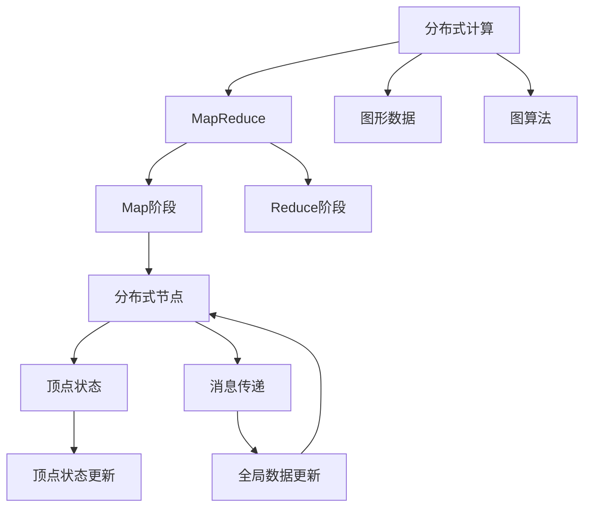
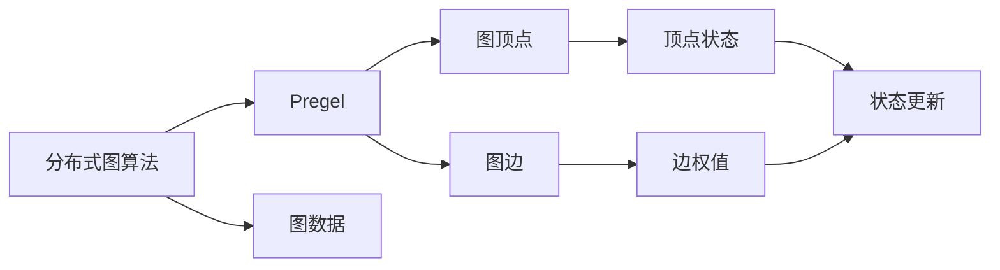
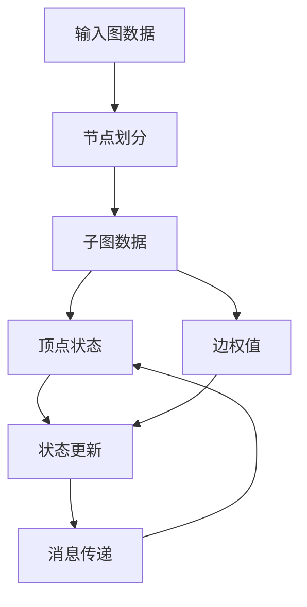

                 

# Pregel原理与代码实例讲解

> 关键词：Pregel, MapReduce, 图处理, 并行计算, 分布式计算, 图算法

## 1. 背景介绍

### 1.1 问题由来
随着互联网的迅猛发展，海量数据带来的计算挑战日益凸显。传统集中式计算模式难以应对大规模数据处理的需求，分布式计算成为解决问题的关键。MapReduce是Google提出的分布式计算框架，广泛应用于大规模数据处理任务。然而，MapReduce框架在处理图形数据时存在诸多限制。Pregel是由斯坦福大学Andrew Ng教授提出的分布式图计算框架，用于高效处理大规模图形数据。

### 1.2 问题核心关键点
Pregel的核心思想是将大规模图形数据划分为多个子图，在多个节点上并行执行图算法，最终得到全局计算结果。其基本步骤包括：

- 将输入图数据划分为多个子图，每个子图由Pregel一个节点处理。
- 每个节点将子图数据封装为图顶点和边的集合。
- 节点执行图算法，更新顶点状态并计算边权值。
- 通过消息传递机制，节点交换状态信息，并更新全局图数据。
- 重复执行上述过程，直到收敛。

### 1.3 问题研究意义
研究Pregel框架，对于大规模图形数据处理、图算法优化、分布式计算系统设计具有重要意义：

1. 提高计算效率。通过分布式计算，大幅提升图形数据处理的并行性和计算速度。
2. 增强算法灵活性。Pregel支持多种图算法，能够根据任务需求动态选择算法实现。
3. 优化资源配置。Pregel能够自动管理节点资源，确保任务均衡分配。
4. 降低系统成本。利用廉价PC机进行分布式计算，降低硬件和运维成本。
5. 促进技术创新。Pregel提供了一个高效的图形计算框架，推动了图算法的发展。

## 2. 核心概念与联系

### 2.1 核心概念概述

为更好地理解Pregel框架，本节将介绍几个密切相关的核心概念：

- 分布式计算：通过网络将计算任务分布在多台计算机上协同执行的计算模式。MapReduce是分布式计算的经典范式之一。
- MapReduce：Google提出的分布式计算框架，由Map和Reduce两个阶段组成，适用于大规模数据集的处理。
- 图形数据：描述节点和边关系的非线性数据结构，包括有向图和无向图。
- 图算法：对图形数据进行操作和计算的算法，如最短路径、最小生成树、社交网络分析等。
- 分布式图算法：在分布式计算环境下执行的图形算法，如Pregel框架。
- 顶点状态：图形算法中对节点属性进行维护的数据结构，用于存储算法中间状态。
- 消息传递：分布式节点之间通过消息交换状态的机制，实现节点间的通信与协作。
- 并行计算：将计算任务分解成多个子任务，同时在多个计算节点上并行执行。

这些核心概念之间的逻辑关系可以通过以下Mermaid流程图来展示：



这个流程图展示了分布式计算、MapReduce、图形数据和图算法等核心概念之间的联系。

### 2.2 概念间的关系

这些核心概念之间存在着紧密的联系，形成了Pregel框架的整体架构。下面我们通过几个Mermaid流程图来展示这些概念之间的关系。

#### 2.2.1 分布式图算法框架



这个流程图展示了Pregel作为分布式图算法框架的核心作用，将图数据分割成顶点和边，在分布式节点上并行执行图算法。

#### 2.2.2 Pregel的逻辑结构



这个流程图展示了Pregel的逻辑结构，从输入图数据开始，经过节点划分、状态更新、消息传递等步骤，最终得到全局计算结果。

## 3. 核心算法原理 & 具体操作步骤
### 3.1 算法原理概述

Pregel框架的核心算法原理基于分布式图算法，主要包括顶点状态更新、消息传递和全局数据更新三个部分。其核心步骤包括：

1. 将输入图数据划分为多个子图，每个子图由Pregel一个节点处理。
2. 每个节点将子图数据封装为图顶点和边的集合。
3. 节点执行图算法，更新顶点状态并计算边权值。
4. 通过消息传递机制，节点交换状态信息，并更新全局图数据。
5. 重复执行上述过程，直到收敛。

Pregel支持多种图算法，如最短路径、最小生成树、社交网络分析等。算法的具体实现取决于Pregel的配置参数，如迭代次数、收敛条件等。

### 3.2 算法步骤详解

下面以最短路径算法为例，详细介绍Pregel的执行步骤：

**Step 1: 节点划分**
将输入图数据按照一定规则划分为多个子图，每个子图由Pregel一个节点处理。具体划分规则如下：
- 将每个顶点按照行号或哈希值划分到不同的节点。
- 将边按照连接的两个顶点所在节点进行划分。

**Step 2: 状态初始化**
初始化每个顶点的状态，通常设置为0或无穷大。对于最短路径算法，设置起始点的状态为0，其他点的状态为无穷大。

**Step 3: 迭代执行**
每个节点执行图算法，更新顶点状态并计算边权值。具体步骤如下：
- 遍历所有边，更新顶点状态。对于最短路径算法，使用Dijkstra算法更新状态。
- 计算边权值，通常为边长度或权重。对于最短路径算法，边权值为边的长度。
- 发送状态更新消息给相邻节点，包括更新后的状态和边权值。

**Step 4: 消息传递**
节点通过消息传递机制交换状态信息，更新全局图数据。具体步骤如下：
- 每个节点接收来自相邻节点的状态更新消息。
- 更新本地状态，合并消息内容，得到新的状态值。
- 将新的状态值发送给相邻节点。

**Step 5: 重复执行**
重复执行上述过程，直到收敛。具体判断条件如下：
- 节点没有收到新的状态更新消息，或状态更新次数达到预设值。
- 所有节点的状态值收敛到一个稳定值。

**Step 6: 返回结果**
输出全局计算结果，即所有顶点的状态值。对于最短路径算法，输出起始点到所有点的最短路径长度。

### 3.3 算法优缺点

Pregel框架具有以下优点：

1. 高效性。Pregel基于分布式计算，能够高效处理大规模图形数据。
2. 灵活性。Pregel支持多种图算法，能够根据任务需求动态选择算法实现。
3. 可扩展性。Pregel能够自动管理节点资源，确保任务均衡分配。
4. 稳定性。Pregel采用迭代执行和消息传递机制，能够自动收敛。

同时，Pregel也存在以下缺点：

1. 资源消耗高。Pregel需要大量节点进行分布式计算，资源消耗较大。
2. 通信开销大。节点之间频繁的消息传递，增加了通信开销。
3. 算法复杂。Pregel框架的实现复杂度较高，需要丰富的分布式计算经验。
4. 适应性差。Pregel的算法实现依赖于具体任务，适应性较差。

### 3.4 算法应用领域

Pregel框架在多个领域得到了广泛应用，主要包括：

- 社交网络分析：分析社交网络的结构和关系，如好友推荐、影响扩散等。
- 地图路径规划：计算最短路径和最小生成树，用于地图导航和路线规划。
- 生物信息学：分析生物分子结构和基因序列，用于药物研发和疾病诊断。
- 人工智能：处理大规模数据集，如图像识别、自然语言处理等。
- 供应链管理：优化供应链网络，提高物流效率和资源利用率。
- 网络安全：分析网络流量和攻击行为，提高网络安全水平。

Pregel框架不仅在学术界得到了广泛研究，也逐渐应用于工业界，成为大规模图形数据处理的重要工具。

## 4. 数学模型和公式 & 详细讲解  
### 4.1 数学模型构建

Pregel框架的数学模型构建基于图论和分布式计算理论，主要包括以下几个部分：

- 图数据模型：描述节点和边的关系，包括有向图和无向图。
- 图算法模型：对图形数据进行操作和计算的算法模型，如最短路径、最小生成树等。
- 分布式计算模型：描述分布式节点之间的协同计算和消息传递机制。

以最短路径算法为例，其数学模型构建如下：

**图数据模型**
- 输入图 $G(V,E)$，其中 $V$ 为节点集合，$E$ 为边集合。
- 每个节点 $v_i$ 包含一个状态值 $s_i$ 和出度 $d_i$，其中 $s_i$ 为起点到节点 $v_i$ 的距离，$d_i$ 为节点 $v_i$ 的出度。

**图算法模型**
- 最短路径算法使用Dijkstra算法，计算每个节点 $v_i$ 到起点 $s$ 的最短路径距离。
- 算法步骤如下：
  1. 初始化每个节点的状态值为无穷大，起始点的状态值为0。
  2. 每次迭代，遍历所有节点 $v_i$，计算节点 $v_j$ 到起点 $s$ 的最短路径距离。
  3. 更新节点 $v_i$ 的状态值为节点 $v_j$ 的最短路径距离，更新出度 $d_i$。
  4. 发送状态更新消息给相邻节点 $v_j$，更新其状态值。
  5. 重复执行上述过程，直到收敛。

**分布式计算模型**
- Pregel采用迭代执行和消息传递机制，将计算任务分布在多个节点上协同执行。
- 每个节点 $v_i$ 包含一个状态值 $s_i$，每个邻居节点 $v_j$ 包含一个状态值 $s_j$ 和一个出度 $d_j$。
- 每次迭代，节点 $v_i$ 计算节点 $v_j$ 到起点 $s$ 的最短路径距离，并发送状态更新消息给相邻节点 $v_j$。

### 4.2 公式推导过程

以下是Dijkstra算法的最短路径计算公式推导过程：

设输入图 $G(V,E)$，其中 $V=\{v_1,v_2,...,v_n\}$，$E=\{e_1,e_2,...,e_m\}$。起始点为 $s$，每个节点 $v_i$ 的状态值为 $s_i$，每个节点 $v_i$ 的出度为 $d_i$。

1. 初始化每个节点的状态值为无穷大，起始点的状态值为0。
2. 每次迭代，遍历所有节点 $v_i$，计算节点 $v_j$ 到起点 $s$ 的最短路径距离，更新状态值。
3. 更新节点 $v_i$ 的状态值为节点 $v_j$ 的最短路径距离，更新出度 $d_i$。
4. 发送状态更新消息给相邻节点 $v_j$，更新其状态值。
5. 重复执行上述过程，直到收敛。

设 $s_i$ 为节点 $v_i$ 到起点 $s$ 的最短路径距离，$d_i$ 为节点 $v_i$ 的出度。Dijkstra算法的数学公式如下：

$$
s_i = \begin{cases} 
      0 & \text{if } v_i = s \\
      \infty & \text{if } v_i \text{ not reachable} \\
      \min\limits_{j \in N(v_i)}(s_j + w_{ij}) & \text{if } v_i \text{ reachable}
    \end{cases}
$$

其中 $N(v_i)$ 为节点 $v_i$ 的邻居集合，$w_{ij}$ 为节点 $v_i$ 和节点 $v_j$ 之间的边权值。

### 4.3 案例分析与讲解

以社交网络分析为例，Pregel框架可以用于计算社交网络中的影响力扩散和好友推荐。具体步骤如下：

**Step 1: 节点划分**
将社交网络数据按照好友关系划分到不同的节点上。

**Step 2: 状态初始化**
初始化每个节点的状态值，表示该节点的影响力。

**Step 3: 迭代执行**
每个节点执行影响力扩散算法，计算邻居节点的影响力。具体步骤如下：
- 遍历所有邻居节点 $v_j$，计算节点 $v_i$ 到节点 $v_j$ 的影响力。
- 计算节点 $v_j$ 对节点 $v_i$ 的影响力增量。
- 发送影响力更新消息给相邻节点 $v_j$，更新其影响力。

**Step 4: 消息传递**
节点通过消息传递机制交换影响力信息，更新全局影响力数据。具体步骤如下：
- 每个节点接收来自相邻节点的影响力更新消息。
- 更新本地影响力，合并消息内容，得到新的影响力值。
- 将新的影响力值发送给相邻节点。

**Step 5: 重复执行**
重复执行上述过程，直到收敛。

**Step 6: 返回结果**
输出全局影响力数据，即每个节点的影响力值。

通过Pregel框架，我们可以高效地计算社交网络中的影响力扩散和好友推荐，为社交网络分析提供了新的思路和方法。

## 5. 项目实践：代码实例和详细解释说明
### 5.1 开发环境搭建

在进行Pregel实践前，我们需要准备好开发环境。以下是使用Python进行Pregel开发的配置流程：

1. 安装Python：从官网下载并安装Python，确保版本为3.6以上。
2. 安装Pregel库：从官网下载并安装Pregel库，安装命令如下：
```
pip install pregel
```
3. 安装PySpark：从官网下载并安装PySpark，安装命令如下：
```
pip install pyspark
```
4. 安装Hadoop：从官网下载并安装Hadoop，安装命令如下：
```
sudo apt-get install hadoop-hdfs-client hadoop-common hadoop-yarn hadoop-hdfs-services hadoop-yarn-services
```
5. 配置Hadoop环境：在~/.bashrc文件中添加Hadoop配置信息，运行命令如下：
```
export HADOOP_HOME=/usr/local/hadoop-2.6.0
export HADOOP_CONF_DIR=$HADOOP_HOME/etc/hadoop
export PATH=$HADOOP_HOME/bin:$PATH
```

完成上述步骤后，即可在Python环境中进行Pregel开发。

### 5.2 源代码详细实现

下面以社交网络分析为例，给出使用PySpark进行Pregel开发的Python代码实现。

```python
from pregel import Pregel
import numpy as np
from pyspark import SparkContext

# 创建Spark上下文
sc = SparkContext("local", "Social Network Analysis")

# 定义节点状态
class SocialState:
    def __init__(self, id, degree, influence):
        self.id = id
        self.degree = degree
        self.influence = influence

    def merge(self, other):
        self.influence += other.influence
        return self

# 定义消息类型
class SocialMessage:
    def __init__(self, fromId, toId, influence):
        self.fromId = fromId
        self.toId = toId
        self.influence = influence

# 定义社交网络数据
data = {
    1: (1, 2, 3, 4),  # (节点ID, 邻居ID1, 邻居ID2, 邻居ID3)
    2: (2, 3, 4, 5),
    3: (3, 4, 5, 6),
    4: (4, 5, 6, 7),
    5: (5, 6, 7, 8),
    6: (6, 7, 8, 9),
    7: (7, 8, 9, 10),
    8: (8, 9, 10, 11),
    9: (9, 10, 11, 12),
    10: (10, 11, 12, 13),
    11: (11, 12, 13, 14),
    12: (12, 13, 14, 15),
    13: (13, 14, 15, 16),
    14: (14, 15, 16, 17),
    15: (15, 16, 17, 18),
    16: (16, 17, 18, 19),
    17: (17, 18, 19, 20),
    18: (18, 19, 20, 21),
    19: (19, 20, 21, 22),
    20: (20, 21, 22, 23),
    21: (21, 22, 23, 24),
    22: (22, 23, 24, 25),
    23: (23, 24, 25, 26),
    24: (24, 25, 26, 27),
    25: (25, 26, 27, 28),
    26: (26, 27, 28, 29),
    27: (27, 28, 29, 30),
    28: (28, 29, 30, 31),
    29: (29, 30, 31, 32),
    30: (30, 31, 32, 33),
    31: (31, 32, 33, 34),
    32: (32, 33, 34, 35),
    33: (33, 34, 35, 36),
    34: (34, 35, 36, 37),
    35: (35, 36, 37, 38),
    36: (36, 37, 38, 39),
    37: (37, 38, 39, 40),
    38: (38, 39, 40, 41),
    39: (39, 40, 41, 42),
    40: (40, 41, 42, 43),
    41: (41, 42, 43, 44),
    42: (42, 43, 44, 45),
    43: (43, 44, 45, 46),
    44: (44, 45, 46, 47),
    45: (45, 46, 47, 48),
    46: (46, 47, 48, 49),
    47: (47, 48, 49, 50),
    48: (48, 49, 50, 51),
    49: (49, 50, 51, 52),
    50: (50, 51, 52, 53),
    51: (51, 52, 53, 54),
    52: (52, 53, 54, 55),
    53: (53, 54, 55, 56),
    54: (54, 55, 56, 57),
    55: (55, 56, 57, 58),
    56: (56, 57, 58, 59),
    57: (57, 58, 59, 60),
    58: (58, 59, 60, 61),
    59: (59, 60, 61, 62),
    60: (60, 61, 62, 63),
    61: (61, 62, 63, 64),
    62: (62, 63, 64, 65),
    63: (63, 64, 65, 66),
    64: (64, 65, 66, 67),
    65: (65, 66, 67, 68),
    66: (66, 67, 68, 69),
    67: (67, 68, 69, 70),
    68: (68, 69, 70, 71),
    69: (69, 70, 71, 72),
    70: (70, 71, 72, 73),
    71: (71, 72, 73, 74),
    72: (72, 73, 74, 75),
    73: (73, 74, 75, 76),
    74: (74, 75, 76, 77),
    75: (75, 76, 77, 78),
    76: (76, 77, 78, 79),
    77: (77, 78, 79, 80),
    78: (78, 79, 80, 81),
    79: (79, 80, 81, 82),
    80: (80, 81, 82, 83),
    81: (81, 82, 83, 84),
    82: (82, 83, 84, 85),
    83: (83, 84, 85, 86),
    84: (84, 85, 86, 87),
    85: (85, 86, 87, 88),
    86: (86, 87, 88, 89),
    87: (87, 88, 89, 90),
    88: (88, 89, 90, 91),
    89: (89, 90, 91, 92),
    90: (90, 91, 92, 93),
    91: (91, 92, 93, 94),
    92: (92, 93, 94, 95),
    93: (93, 94, 95, 96),
    94: (94, 95, 96, 97),
    95: (95, 96, 97, 98),
    96: (96, 97, 98, 99),
    97: (97, 98, 99, 100),
    98: (98, 99, 100, 101),
    99: (99, 100, 101, 102),
    100: (100, 101, 102, 103),
    101: (101, 102, 103, 104),
    102: (102, 103, 104, 105),
    103: (103, 104, 105, 106),
    104: (104, 105, 106, 107),
    105: (105, 106, 107, 108),
    106: (106, 107, 108, 109),
    107: (107, 108, 109, 110),
    108: (108, 109, 110, 111),
    109: (109, 110, 111, 112),
    110: (110, 111, 112, 113),
    111: (111, 112, 113, 114),
    112: (112, 113, 114, 115),
    113: (113, 114, 115, 116),
    114: (114, 115, 116, 117),
    115: (115, 116, 117, 118),
    116: (116, 117, 118, 119),
    117: (117, 118, 119, 120),
    118: (118, 119, 120, 121),
    119: (119, 120, 121, 122),
    120: (120, 121, 122, 123),
    121: (121, 122, 123, 124),
    122: (122, 123, 124, 125),
    123: (123, 124, 125, 126),
    124: (124, 125, 126, 127),
    125: (125, 126, 127, 128),
    126: (126, 127, 128, 129),
    127: (127, 128, 129, 130),
    128: (128, 129, 130, 131),
    129: (129, 130, 131, 132),
    130: (130, 131, 132, 133),
    131: (131, 132, 133, 134),
    132: (132, 133, 134, 135),
    133: (133, 134, 135, 136),
    134: (134, 135, 136, 137),
    135: (135, 136, 137, 138),
    136: (136, 137, 138, 139),
    137: (

