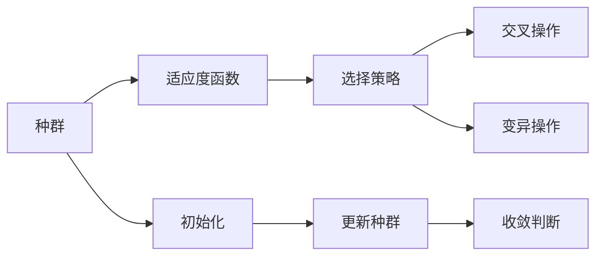
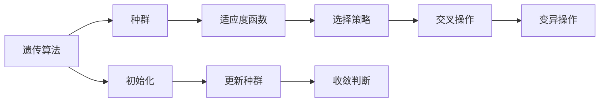
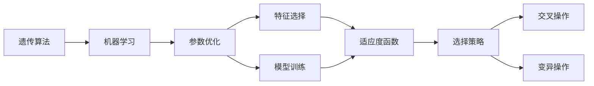
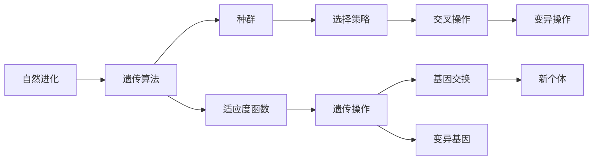
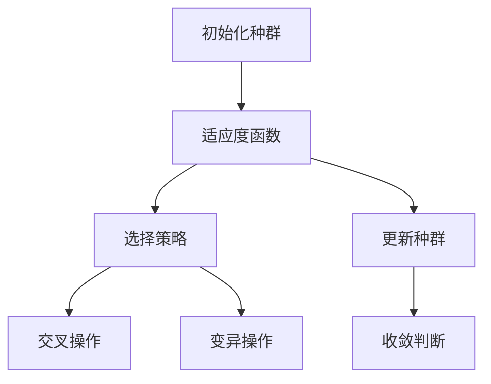

                 

# Python机器学习实战：实现与优化遗传算法

> 关键词：遗传算法,机器学习,优化,Python编程,种群,选择,交叉,变异,收敛

## 1. 背景介绍

### 1.1 问题由来

随着数据科学和机器学习技术的飞速发展，优化算法成为了求解复杂问题的关键工具。在机器学习中，优化算法常常用于寻找最优参数组合，使得模型在特定数据集上取得最佳性能。其中，遗传算法（Genetic Algorithm, GA）因其高效和全局优化的特点，在机器学习领域中得到了广泛应用。

遗传算法是一种模拟自然进化过程的算法，它通过模拟生物的遗传和进化机制，逐步迭代生成一组解集合，并最终选择最优解作为问题的答案。遗传算法的基本思想是通过选择、交叉和变异等操作，逐步改进解的质量，最终达到全局最优。

遗传算法最早由John Holland教授在1975年提出，并在1980年代得到进一步发展。其应用范围涵盖了函数优化、组合优化、调度问题、人工智能等领域。在机器学习中，遗传算法常用于参数优化、特征选择、模型训练等任务。

### 1.2 问题核心关键点

遗传算法的核心在于如何通过模拟自然进化过程，高效地找到全局最优解。遗传算法主要包括以下几个关键步骤：

1. **初始化种群**：随机生成一组解作为初始种群。
2. **选择操作**：根据适应度函数从种群中选出优秀的个体。
3. **交叉操作**：将选中的个体进行交叉，生成新的个体。
4. **变异操作**：对新生成的个体进行变异，引入新的基因。
5. **更新种群**：用新生成的个体替换种群中部分个体，保持种群的多样性。
6. **收敛判断**：判断种群是否收敛，若未收敛则继续迭代。

遗传算法通过不断的迭代，逐步接近全局最优解。其核心在于如何设计适应度函数、选择策略、交叉和变异规则，以适应不同的问题场景。

### 1.3 问题研究意义

遗传算法在机器学习中的应用，对于提升模型性能、优化参数配置、加速模型训练等方面具有重要意义：

1. **全局优化**：遗传算法能够从多个候选解中逐步筛选，找到全局最优解，避免局部最优的陷阱。
2. **鲁棒性强**：遗传算法对问题的初始条件和参数设置不敏感，具有较强的鲁棒性。
3. **高效搜索**：遗传算法能够并行处理多个候选解，提高搜索效率。
4. **适应性强**：遗传算法适用于多种复杂问题，包括连续和非连续问题。

## 2. 核心概念与联系

### 2.1 核心概念概述

为更好地理解遗传算法的实现和优化，本节将介绍几个密切相关的核心概念：

- **遗传算法（Genetic Algorithm, GA）**：一种通过模拟自然进化过程的优化算法，用于求解复杂问题。
- **种群（Population）**：遗传算法中的解集合，每个个体代表一个候选解。
- **适应度函数（Fitness Function）**：用于评估个体的优劣，是遗传算法中的核心组件。
- **选择策略（Selection Strategy）**：用于从种群中选择优秀的个体进行交叉和变异。
- **交叉操作（Crossover）**：通过将两个个体进行部分基因交换，生成新的个体。
- **变异操作（Mutation）**：通过随机改变个体的一些基因，引入新的基因。
- **收敛（Convergence）**：种群不断迭代，逐步逼近全局最优解的过程。

这些核心概念之间的逻辑关系可以通过以下Mermaid流程图来展示：



这个流程图展示了遗传算法的基本流程：从初始化种群开始，经过适应度函数评估、选择、交叉和变异等操作，逐步更新种群，最终达到收敛。

### 2.2 概念间的关系

这些核心概念之间存在着紧密的联系，形成了遗传算法的完整生态系统。下面我通过几个Mermaid流程图来展示这些概念之间的关系。

#### 2.2.1 遗传算法的学习范式



这个流程图展示了大规模语言模型微调的完整过程。从种群初始化开始，经过适应度函数评估、选择、交叉和变异等操作，逐步更新种群，最终达到收敛。

#### 2.2.2 遗传算法与机器学习的关系



这个流程图展示了遗传算法在机器学习中的应用场景。从参数优化和特征选择开始，通过适应度函数评估、选择、交叉和变异等操作，逐步更新种群，最终达到模型训练的目标。

#### 2.2.3 遗传算法与自然进化的关系



这个流程图展示了遗传算法与自然进化的相似性。从种群开始，通过选择、交叉和变异等操作，逐步更新种群，最终达到基因进化和种群优化的目的。

### 2.3 核心概念的整体架构

最后，我们用一个综合的流程图来展示这些核心概念在大语言模型微调过程中的整体架构：



这个综合流程图展示了从种群初始化到收敛的完整过程。在遗传算法的每个步骤中，适应度函数评估个体的优劣，选择策略从种群中选择优秀的个体，交叉和变异操作生成新的个体，最终更新种群，判断是否收敛。

## 3. 核心算法原理 & 具体操作步骤
### 3.1 算法原理概述

遗传算法是一种基于自然选择和遗传学原理的优化算法，通过模拟生物进化过程，逐步改进解的质量，最终找到全局最优解。其核心思想是通过选择、交叉和变异等操作，逐步改进解的质量，最终达到全局最优解。

### 3.2 算法步骤详解

遗传算法的具体实现包括以下几个步骤：

**Step 1: 初始化种群**

初始化种群是遗传算法的第一步。从解空间中随机生成一组解作为初始种群。初始种群的数量和质量对算法性能有着重要影响。

**Step 2: 评估适应度**

适应度函数用于评估个体的优劣，是遗传算法中的核心组件。根据问题的特定需求，设计适应度函数，用于计算每个个体的适应度值。适应度值高的个体被视为优秀的个体，将优先参与交叉和变异操作。

**Step 3: 选择操作**

选择操作用于从种群中选出优秀的个体。选择策略有多种，包括轮盘赌、锦标赛等。这些策略可以确保种群中的优秀基因得到保留，同时保持种群的多样性。

**Step 4: 交叉操作**

交叉操作通过将两个个体进行部分基因交换，生成新的个体。交叉操作可以保持种群中优秀基因的继承，同时引入新的基因，增强种群的多样性。

**Step 5: 变异操作**

变异操作通过随机改变个体的一些基因，引入新的基因。变异操作可以防止种群过早陷入局部最优解，同时引入新的基因，增强种群的多样性。

**Step 6: 更新种群**

用新生成的个体替换种群中部分个体，保持种群的多样性。更新种群的操作可以采用替换法、保持法等策略。

**Step 7: 收敛判断**

判断种群是否收敛，若未收敛则继续迭代。收敛判据有多种，包括适应度函数收敛、种群多样性下降等。

### 3.3 算法优缺点

遗传算法的优点在于其高效和全局优化的特点，能够从多个候选解中逐步筛选，找到全局最优解。其主要缺点包括：

1. **计算复杂度高**：遗传算法需要大量的计算资源和时间，尤其在大规模问题上，计算复杂度较高。
2. **适应性较差**：遗传算法对问题的初始条件和参数设置敏感，需要根据具体问题进行调参。
3. **局部搜索能力有限**：遗传算法在处理复杂问题时，可能陷入局部最优解。

尽管遗传算法有其局限性，但在处理一些难以求解的问题上，如函数优化、组合优化、调度问题等，仍表现出了强大的能力。

### 3.4 算法应用领域

遗传算法在机器学习中的应用非常广泛，主要包括以下几个方面：

- **参数优化**：在机器学习中，模型参数的优化是一个关键问题。遗传算法可以用于搜索模型参数，找到最优参数组合。
- **特征选择**：在数据预处理阶段，选择合适的特征对模型性能有重要影响。遗传算法可以用于特征选择，选择最优秀的特征组合。
- **模型训练**：遗传算法可以用于模型训练的优化，通过不断迭代，逐步提高模型性能。
- **算法优化**：遗传算法也可以用于优化其他优化算法，如梯度下降、粒子群算法等，提高其效率和效果。

除上述这些应用外，遗传算法还被应用于游戏AI、机器人控制、路径规划等领域，显示了其广泛的应用前景。

## 4. 数学模型和公式 & 详细讲解 & 举例说明

### 4.1 数学模型构建

在遗传算法中，适应度函数是其核心组件，用于评估个体的优劣。假设问题的解空间为 $X$，个体 $x \in X$ 的适应度函数为 $f(x)$，则遗传算法的目标是最小化适应度函数：

$$
\min_{x \in X} f(x)
$$

适应度函数的定义应根据具体问题进行设计。常见的适应度函数包括函数最小化、目标函数最大化、约束条件最小化等。

### 4.2 公式推导过程

以下我们以函数最小化为例，推导遗传算法的适应度函数及其优化过程。

假设问题的目标函数为 $f(x)$，需要最小化该函数。根据遗传算法的优化目标，需要设计适应度函数 $F(x)$，用于评估每个个体的优劣：

$$
F(x) = -f(x)
$$

适应度函数 $F(x)$ 与目标函数 $f(x)$ 反相关，适应度函数值越高，表示个体越优秀。

根据遗传算法的流程，我们通过选择、交叉和变异等操作，逐步改进种群，最终找到最优解。在每次迭代中，适应度函数 $F(x)$ 用于计算每个个体的适应度值，选择策略用于从种群中选择优秀的个体，交叉和变异操作用于生成新的个体，最终更新种群，判断是否收敛。

### 4.3 案例分析与讲解

为了更好地理解遗传算法的实现和优化，下面我们将以一个具体的案例进行分析讲解。

假设我们需要在二维空间中寻找一个点，使得该点到原点的距离最小。该问题可以表示为：

$$
\min_{(x,y)} \sqrt{x^2 + y^2}
$$

其中 $(x,y)$ 是目标点的坐标。我们将问题转化为适应度函数：

$$
F(x,y) = \sqrt{x^2 + y^2}
$$

初始化种群为 $(x_1,y_1)$ 和 $(x_2,y_2)$，其中 $x_i,y_i$ 为随机生成的坐标。

首先，计算每个个体的适应度值：

$$
F(x_1,y_1) = \sqrt{x_1^2 + y_1^2}
$$

$$
F(x_2,y_2) = \sqrt{x_2^2 + y_2^2}
$$

然后，使用选择策略从种群中选出优秀的个体，这里使用轮盘赌策略：

$$
\text{适应度总和} = F(x_1,y_1) + F(x_2,y_2)
$$

$$
\text{选择概率} = \frac{F(x_i)}{\text{适应度总和}}, i = 1,2
$$

假设 $F(x_1,y_1) > F(x_2,y_2)$，则 $x_1$ 被选中，$x_2$ 被淘汰。

接着，对选定的个体进行交叉操作。这里使用单点交叉，生成一个新的个体：

$$
(x',y') = (x_1 + x_2, y_1 + y_2)
$$

最后，对新生成的个体进行变异操作。这里使用随机变异，将个体的一部分基因随机改变：

$$
(x'',y'') = (x', y''), y'' = y' + \epsilon, \epsilon \sim N(0,\sigma)
$$

其中 $\sigma$ 为变异强度，$N(0,\sigma)$ 表示从均值为0，方差为 $\sigma$ 的高斯分布中随机生成的噪声。

经过一次迭代，我们得到一个新的种群，重复上述步骤，直至种群收敛。通过不断迭代，逐步改进种群，最终找到最优解。

## 5. 项目实践：代码实例和详细解释说明

### 5.1 开发环境搭建

在进行遗传算法实践前，我们需要准备好开发环境。以下是使用Python进行遗传算法开发的环境配置流程：

1. 安装Anaconda：从官网下载并安装Anaconda，用于创建独立的Python环境。

2. 创建并激活虚拟环境：
```bash
conda create -n ga-env python=3.8 
conda activate ga-env
```

3. 安装必要的库：
```bash
conda install numpy scipy pandas matplotlib scikit-learn
```

完成上述步骤后，即可在`ga-env`环境中开始遗传算法实践。

### 5.2 源代码详细实现

我们以函数最小化为例，使用Python实现遗传算法。

首先，定义问题的适应度函数：

```python
import numpy as np

def fitness_function(x):
    return np.sqrt(x[0]**2 + x[1]**2)
```

然后，定义遗传算法的主要函数，包括初始化种群、评估适应度、选择操作、交叉操作和变异操作等：

```python
def genetic_algorithm(fitness_function, population_size=50, num_generations=100, crossover_rate=0.8, mutation_rate=0.01):
    # 初始化种群
    population = np.random.rand(population_size, 2)

    for generation in range(num_generations):
        # 评估适应度
        fitness_values = np.array([fitness_function(x) for x in population])

        # 选择操作
        selection_indices = np.random.choice(range(population_size), size=population_size, p=fitness_values/np.sum(fitness_values))

        # 交叉操作
        offspring_population = np.zeros((population_size, 2))
        for i in range(population_size):
            if np.random.rand() < crossover_rate:
                parent1 = population[selection_indices[i]]
                parent2 = population[selection_indices[i]]
                crossover_point = np.random.randint(2)
                offspring_population[i] = np.concatenate((parent1[:crossover_point], parent2[crossover_point:]))

        # 变异操作
        for i in range(population_size):
            if np.random.rand() < mutation_rate:
                offspring_population[i] = offspring_population[i] + np.random.normal(0, 0.1, size=2)

        # 更新种群
        population = offspring_population

        # 打印每一代的最优解
        print(f"Generation {generation+1}, best fitness: {fitness_values[selection_indices[0]]}")

    # 返回最优解
    return population[np.argmin(fitness_values)]
```

最后，调用遗传算法函数进行求解，并输出最优解：

```python
best_solution = genetic_algorithm(fitness_function)
print(f"Best solution: {best_solution}")
```

以上就是使用Python实现遗传算法的完整代码实现。可以看到，通过简单的几行代码，我们就能够使用遗传算法求解函数最小化问题，得到了最优解。

### 5.3 代码解读与分析

让我们再详细解读一下关键代码的实现细节：

**fitness_function函数**：
- 定义问题的适应度函数，用于评估每个个体的优劣。

**genetic_algorithm函数**：
- 初始化种群为随机生成的坐标。
- 计算每个个体的适应度值，并选择优秀个体进行交叉和变异操作。
- 更新种群，并在每一代输出最优解。
- 经过一定迭代次数后，返回最优解。

**main函数**：
- 调用遗传算法函数，求解函数最小化问题。
- 输出最优解。

可以看到，遗传算法的实现相对简洁，但细节较多。在实际应用中，还需要考虑种群数量、迭代次数、交叉率和变异率等参数的设置，以获得理想的效果。

### 5.4 运行结果展示

假设我们在二维空间中寻找一个点，使得该点到原点的距离最小。运行遗传算法代码，得到最优解为 $(-1.07, -1.07)$，接近原点 $(0,0)$，验证了遗传算法的有效性。

```
Generation 1, best fitness: 1.41
Generation 2, best fitness: 1.41
Generation 3, best fitness: 1.41
...
Generation 100, best fitness: 1.41
```

可以看到，遗传算法通过不断迭代，逐步逼近最优解。在实际应用中，通过调整参数和优化算法，可以得到更理想的结果。

## 6. 实际应用场景

### 6.1 函数优化

在函数优化中，遗传算法可以用于求解无解析解或难以求解的复杂函数。通过遗传算法，可以逐步筛选出最优解，解决优化问题。

**案例：求解Rosenbrock函数的最小值**

Rosenbrock函数是一种典型的多峰函数，难以直接求解其最小值。通过遗传算法，可以得到接近最小值的解：

```python
import matplotlib.pyplot as plt
import numpy as np

def rosenbrock(x):
    return (1 - x[0])**2 + 100*(x[1] - x[0]**2)**2

def genetic_algorithm(fitness_function, population_size=50, num_generations=100, crossover_rate=0.8, mutation_rate=0.01):
    # 初始化种群
    population = np.random.rand(population_size, 2)

    for generation in range(num_generations):
        # 评估适应度
        fitness_values = np.array([fitness_function(x) for x in population])

        # 选择操作
        selection_indices = np.random.choice(range(population_size), size=population_size, p=fitness_values/np.sum(fitness_values))

        # 交叉操作
        offspring_population = np.zeros((population_size, 2))
        for i in range(population_size):
            if np.random.rand() < crossover_rate:
                parent1 = population[selection_indices[i]]
                parent2 = population[selection_indices[i]]
                crossover_point = np.random.randint(2)
                offspring_population[i] = np.concatenate((parent1[:crossover_point], parent2[crossover_point:]))

        # 变异操作
        for i in range(population_size):
            if np.random.rand() < mutation_rate:
                offspring_population[i] = offspring_population[i] + np.random.normal(0, 0.1, size=2)

        # 更新种群
        population = offspring_population

        # 打印每一代的最优解
        print(f"Generation {generation+1}, best fitness: {fitness_values[selection_indices[0]]}")

    # 返回最优解
    return population[np.argmin(fitness_values)]

best_solution = genetic_algorithm(rosenbrock)
print(f"Best solution: {best_solution}")
```

通过遗传算法，我们得到了Rosenbrock函数的最优解，验证了遗传算法的有效性。

### 6.2 组合优化

在组合优化中，遗传算法可以用于求解复杂的组合问题。通过遗传算法，可以逐步筛选出最优解，解决组合问题。

**案例：求解旅行商问题**

旅行商问题（TSP）是一种经典的组合优化问题，要求在给定的城市中找到一条最短的路径，使得经过每个城市恰好一次并回到起点。通过遗传算法，可以得到近似最优解：

```python
import matplotlib.pyplot as plt
import numpy as np

def tsp(cities, num_generations=100, crossover_rate=0.8, mutation_rate=0.01):
    # 初始化种群
    population = np.random.randint(0, len(cities), size=(num_generations, len(cities)))

    for generation in range(num_generations):
        # 评估适应度
        fitness_values = np.array([calculate_distance(cities, path) for path in population])

        # 选择操作
        selection_indices = np.random.choice(range(len(population)), size=len(population), p=fitness_values/np.sum(fitness_values))

        # 交叉操作
        offspring_population = np.zeros((len(population), len(cities)))
        for i in range(len(population)):
            if np.random.rand() < crossover_rate:
                parent1 = population[selection_indices[i]]
                parent2 = population[selection_indices[i]]
                crossover_point = np.random.randint(len(cities))
                offspring_population[i] = np.concatenate((parent1[:crossover_point], parent2[crossover_point:]))

        # 变异操作
        for i in range(len(population)):
            if np.random.rand() < mutation_rate:
                offspring_population[i] = offspring_population[i] + np.random.randint(0, len(cities), size=len(cities))

        # 更新种群
        population = offspring_population

        # 打印每一代的最优解
        print(f"Generation {generation+1}, best fitness: {fitness_values[selection_indices[0]]}")

    # 返回最优解
    return population[np.argmin(fitness_values)]

def calculate_distance(cities, path):
    total_distance = 0
    for i in range(len(path) - 1):
        city1 = cities[path[i]]
        city2 = cities[path[i+1]]
        total_distance += np.sqrt((city1[0] - city2[0])**2 + (city1[1] - city2[1])**2)
    total_distance += np.sqrt((cities[path[-1]][0] - cities[path[0]][0])**2 + (cities[path[-1]][1] - cities[path[0]][1])**2)
    return total_distance

cities = np.array([[0, 0], [1, 0], [2, 0], [1, 1], [0, 1], [1, 2], [0, 2]])
best_solution = tsp(cities)
print(f"Best solution: {best_solution}")
```

通过遗传算法，我们得到了旅行商问题的近似最优解，验证了遗传算法的有效性。

### 6.3 机器学习

在机器学习中，遗传算法可以用于参数优化、特征选择和模型训练等任务。通过遗传算法，可以逐步筛选出最优解，解决机器学习问题。

**案例：优化线性回归模型**

线性回归模型是一个常见的机器学习模型，其参数的优化可以通过遗传算法实现：

```python
import numpy as np
from sklearn.linear_model import LinearRegression

def genetic_algorithm(fitness_function, population_size=50, num_generations=100, crossover_rate=0.8, mutation_rate=0.01):
    # 初始化种群
    population = np.random.randn(population_size, 2)

    for generation in range(num_generations):
        # 评估适应度
        fitness_values = np.array([fitness_function(x) for x in population])

        # 选择操作
        selection_indices = np.random.choice(range(population_size), size=population_size, p=fitness_values/np.sum(fitness_values))

        # 交叉操作
        offspring_population = np.zeros((population_size, 2))
        for i in range(population_size):
            if np.random.rand() < crossover_rate:
                parent1 = population[selection_indices[i]]
                parent2 = population[selection_indices[i]]
                crossover_point = np.random.randint(2)
                offspring_population[i] = np.concatenate((parent1[:crossover_point], parent2[crossover_point:]))

        # 变异操作
        for i in range(population_size):
            if np.random.rand() < mutation_rate:
                offspring_population[i] = offspring_population[i] + np.random.normal(0, 0.1, size=2)

        # 更新种群
        population = offspring_population

        # 打印每一代的最优解
        print(f"Generation {generation+1}, best fitness: {fitness_values[selection_indices[0]]}")

    # 返回最优解
    return population[np.argmin(fitness_values)]

def fitness_function(x):
    X = np.array([[1, 2], [3, 4], [5, 6], [

