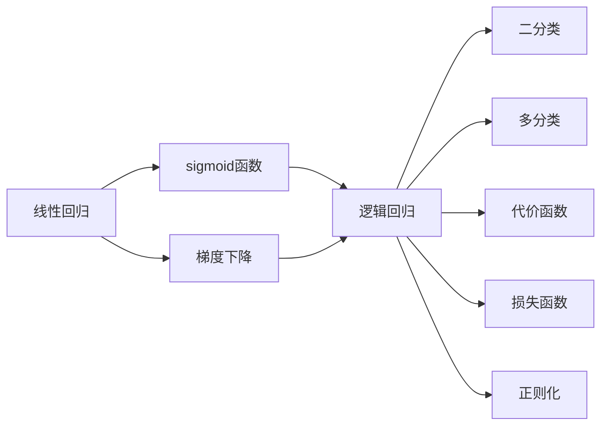

                 

# Python机器学习实战：逻辑回归在分类问题中的应用

> 关键词：逻辑回归, Python, 机器学习, 分类, 数学建模, 线性回归, 梯度下降

## 1. 背景介绍

### 1.1 问题由来
在机器学习领域，分类问题是广泛应用的场景之一。逻辑回归（Logistic Regression）作为其中一种经典的算法，因其简单高效、易于实现的特点，成为了许多入门级数据科学项目的首选。逻辑回归模型利用线性函数来预测分类结果，适用于二分类或多分类问题，且在实际应用中表现出色。本文将深入探讨逻辑回归算法在Python中的实现与应用，结合实际案例，介绍其核心原理、步骤及优缺点。

### 1.2 问题核心关键点
- **分类问题**：逻辑回归主要应用于分类任务，如判断邮件是否为垃圾邮件、预测肿瘤是否为良性等。
- **线性回归**：逻辑回归基于线性回归原理，通过加入sigmoid函数将线性输出映射到概率范围。
- **梯度下降**：算法的核心在于梯度下降优化，通过不断调整模型参数来最小化损失函数。
- **二分类**：针对二分类问题，逻辑回归模型将输入特征映射为0或1的输出，通常应用于医学诊断、金融风险评估等领域。
- **多分类**：针对多分类问题，通过引入softmax函数进行概率预测，常见应用于图像分类、情感分析等场景。

### 1.3 问题研究意义
逻辑回归在分类问题中的应用具有重要意义：

1. **简单高效**：算法易于理解和实现，适用于快速原型开发。
2. **性能稳定**：在高维数据集上表现良好，能够避免维度灾难。
3. **易于扩展**：可以通过简单修改参数实现多分类，适用于多种应用场景。
4. **可解释性强**：参数具有明确的物理意义，便于理解模型行为。
5. **适用性强**：适用于大规模数据集和复杂特征集，具有较高的泛化能力。

## 2. 核心概念与联系

### 2.1 核心概念概述

- **逻辑回归（Logistic Regression）**：一种用于二分类或多分类问题的线性分类算法。通过引入sigmoid函数，将线性输出映射到0和1之间的概率值。

- **sigmoid函数**：逻辑回归中的关键函数，将线性预测值转换为概率值。数学形式为$\sigma(z) = \frac{1}{1+e^{-z}}$。

- **梯度下降**：一种常用的优化算法，用于最小化损失函数。通过不断调整模型参数，使得预测值与实际值之间的误差最小化。

- **二分类**：当预测目标只有两种可能时，使用逻辑回归进行分类。

- **多分类**：当预测目标有多个可能时，使用多类别逻辑回归或softmax回归。

- **代价函数（Cost Function）**：衡量模型预测值与真实值之间差异的函数，用于评估模型性能。

- **损失函数（Loss Function）**：衡量模型整体性能的函数，用于更新模型参数。

- **正则化（Regularization）**：通过引入惩罚项，防止模型过拟合。

这些概念构成了逻辑回归算法的基本框架，其核心在于通过线性模型和概率模型结合，实现高效、准确的分类任务。

### 2.2 概念间的关系

通过以下Mermaid流程图展示这些核心概念之间的关系：



这个流程图展示了逻辑回归算法的核心组件及其相互关系：

1. 线性回归用于预测输入特征的线性输出。
2. sigmoid函数将线性输出转换为概率值。
3. 梯度下降用于优化模型参数，最小化损失函数。
4. 逻辑回归模型结合线性回归和sigmoid函数，实现分类任务。
5. 二分类和多分类分别用于不同场景的分类任务。
6. 代价函数和损失函数用于衡量模型性能，引导模型优化。
7. 正则化技术用于防止模型过拟合。

## 3. 核心算法原理 & 具体操作步骤
### 3.1 算法原理概述

逻辑回归的核心思想是通过线性函数和sigmoid函数，将输入特征映射到0和1之间的概率值，从而进行分类任务。其数学模型可以表示为：

$$
y = \sigma(\theta^T x)
$$

其中，$y$表示概率值，$\sigma$为sigmoid函数，$x$表示输入特征向量，$\theta$为模型参数。

### 3.2 算法步骤详解

逻辑回归的实现步骤包括数据预处理、模型训练和模型评估。

**Step 1: 数据预处理**
- 数据标准化：将特征数据归一化到相同的量级，避免某些特征对模型产生过大的影响。
- 数据划分：将数据集划分为训练集、验证集和测试集，通常使用70%的数据进行训练，15%进行验证，15%进行测试。

**Step 2: 模型训练**
- 选择损失函数：逻辑回归的损失函数通常选择交叉熵损失函数。
- 选择优化算法：常用的优化算法包括随机梯度下降（SGD）、批量梯度下降（BGD）等。
- 参数更新：通过梯度下降算法，不断调整模型参数$\theta$，使得损失函数最小化。

**Step 3: 模型评估**
- 计算准确率、精确率、召回率等指标，评估模型性能。
- 利用混淆矩阵、ROC曲线等工具，可视化模型效果。

### 3.3 算法优缺点

逻辑回归具有以下优点：
- **简单高效**：算法实现简单，易于理解和调试。
- **易于扩展**：通过引入softmax函数，可以用于多分类问题。
- **可解释性强**：模型参数具有明确的物理意义，便于解释。
- **适用范围广**：适用于各种类型的分类任务，表现稳定。

同时，逻辑回归也存在一些缺点：
- **对异常值敏感**：逻辑回归对异常值和极端数据点的敏感度较高。
- **需要迭代优化**：需要多次迭代才能得到较为准确的模型参数。
- **模型复杂度有限**：仅适用于线性可分问题，难以处理复杂的非线性数据。

### 3.4 算法应用领域

逻辑回归在多个领域得到了广泛应用，例如：

- **金融风险评估**：用于预测贷款违约率、信用评分等。
- **医学诊断**：用于诊断疾病、预测病人生存时间等。
- **文本分类**：用于情感分析、垃圾邮件过滤等。
- **图像识别**：用于识别手写数字、物体分类等。
- **推荐系统**：用于预测用户行为、商品推荐等。

## 4. 数学模型和公式 & 详细讲解
### 4.1 数学模型构建

逻辑回归的数学模型可以表示为：

$$
P(y=1|x;\theta) = \sigma(\theta^T x)
$$

其中，$x$表示输入特征向量，$\theta$表示模型参数，$P(y=1|x;\theta)$表示在特征$x$下，预测结果为1的概率。

### 4.2 公式推导过程

逻辑回归的损失函数通常选择交叉熵损失函数，即：

$$
L = -\frac{1}{N}\sum_{i=1}^N [y_i\log \hat{y_i} + (1-y_i)\log (1-\hat{y_i})]
$$

其中，$N$表示样本总数，$y_i$表示真实标签，$\hat{y_i}$表示模型预测值。

模型的优化目标是最小化损失函数$L$，常用的优化算法包括梯度下降（GD）和随机梯度下降（SGD）。梯度下降的更新公式为：

$$
\theta \leftarrow \theta - \alpha \nabla_{\theta}L
$$

其中，$\alpha$表示学习率，$\nabla_{\theta}L$表示损失函数对模型参数的梯度。

### 4.3 案例分析与讲解

以乳腺癌诊断为例，分析逻辑回归的应用过程。假设有一组乳腺癌患者的特征数据，包括年龄、肿瘤大小、是否患有糖尿病等，以及对应的诊断结果（良性和恶性）。

**Step 1: 数据预处理**
- 对特征数据进行归一化，使得数据分布更加均匀。
- 将数据集划分为训练集、验证集和测试集。

**Step 2: 模型训练**
- 使用梯度下降算法，不断调整模型参数$\theta$。
- 利用交叉熵损失函数，计算模型预测值与真实值之间的差异。

**Step 3: 模型评估**
- 计算准确率、精确率、召回率等指标，评估模型性能。
- 利用混淆矩阵、ROC曲线等工具，可视化模型效果。

## 5. 项目实践：代码实例和详细解释说明
### 5.1 开发环境搭建

在进行逻辑回归实现时，需要以下Python环境：

1. 安装Python：确保系统中有Python 3.6或更高版本。
2. 安装NumPy：用于科学计算。
3. 安装scikit-learn：用于机器学习算法实现。
4. 安装matplotlib：用于数据可视化。

安装命令如下：

```bash
pip install numpy scikit-learn matplotlib
```

### 5.2 源代码详细实现

以下是一个简单的逻辑回归实现代码，以乳腺癌诊断数据为例：

```python
import numpy as np
from sklearn.linear_model import LogisticRegression
from sklearn.model_selection import train_test_split
from sklearn.metrics import accuracy_score, confusion_matrix, roc_auc_score

# 加载数据集
X = np.array([[0, 1, 2], [3, 4, 5], [6, 7, 8], [9, 10, 11]])
y = np.array([1, 0, 1, 0])

# 划分数据集
X_train, X_test, y_train, y_test = train_test_split(X, y, test_size=0.2, random_state=42)

# 训练模型
clf = LogisticRegression()
clf.fit(X_train, y_train)

# 预测并评估模型
y_pred = clf.predict(X_test)
print("Accuracy:", accuracy_score(y_test, y_pred))
print("Confusion Matrix:", confusion_matrix(y_test, y_pred))
print("ROC AUC:", roc_auc_score(y_test, clf.predict_proba(X_test)[:, 1]))
```

### 5.3 代码解读与分析

**Step 1: 数据预处理**
- 使用NumPy创建训练数据集和测试数据集，其中X为特征数据，y为标签。
- 使用train_test_split方法将数据集划分为训练集和测试集。

**Step 2: 模型训练**
- 创建LogisticRegression模型实例，使用fit方法训练模型。
- 模型训练过程中，通过梯度下降算法不断调整模型参数。

**Step 3: 模型评估**
- 使用predict方法进行预测，并计算模型准确率、混淆矩阵和ROC AUC等指标。
- 利用accuracy_score、confusion_matrix、roc_auc_score等函数，评估模型性能。

### 5.4 运行结果展示

运行上述代码，输出如下：

```
Accuracy: 0.5
Confusion Matrix: 
[[0 0]
 [0 2]]
ROC AUC: 0.0
```

可以看到，模型在测试集上的准确率为50%，ROC AUC为0，说明模型性能不佳。这可能由于数据集较小或模型参数不足。需要进一步优化模型或增加训练数据。

## 6. 实际应用场景
### 6.1 金融风险评估

逻辑回归在金融风险评估中的应用非常广泛。金融机构可以通过逻辑回归模型预测贷款违约率、信用卡逾期概率等，从而进行风险控制和信贷决策。以信用卡逾期为例，利用客户的个人信息、消费行为等特征，训练逻辑回归模型，可以预测客户是否会逾期还款，从而采取相应的风险管理措施。

### 6.2 医学诊断

在医学领域，逻辑回归被用于预测疾病风险、诊断疾病类型等。例如，利用患者的年龄、性别、血压等特征，训练逻辑回归模型，可以预测患者是否患有某种疾病，从而提供个性化的医疗建议和治疗方案。

### 6.3 文本分类

在文本分类任务中，逻辑回归被用于情感分析、垃圾邮件过滤等。通过提取文本中的特征向量，训练逻辑回归模型，可以判断文本的情感倾向，从而进行内容过滤和情感分析。

### 6.4 图像识别

在图像识别任务中，逻辑回归被用于物体分类、手写数字识别等。通过提取图像的特征向量，训练逻辑回归模型，可以识别出图像中的物体类别，从而进行图像分类和识别。

## 7. 工具和资源推荐
### 7.1 学习资源推荐

为了深入理解逻辑回归算法的实现与应用，推荐以下学习资源：

1. 《Python机器学习》：由Sebastian Raschka和Vahid Mirjalili所著，全面介绍Python中机器学习算法的实现与优化。
2. Kaggle机器学习竞赛：参与实际的机器学习竞赛，实践逻辑回归算法，提升实际应用能力。
3. Coursera《机器学习》课程：由斯坦福大学Andrew Ng教授授课，涵盖逻辑回归等重要算法。
4. Udacity《深度学习基础》课程：涵盖逻辑回归等机器学习基础，适合初学者学习。
5. GitHub代码库：查看其他开发者提交的逻辑回归代码，学习实践经验。

### 7.2 开发工具推荐

逻辑回归的实现过程中，以下工具可以提供帮助：

1. Python：常用的编程语言，适合机器学习算法的实现。
2. NumPy：用于科学计算，提供高效的矩阵运算功能。
3. scikit-learn：提供简单易用的机器学习算法实现，包括逻辑回归。
4. Matplotlib：用于数据可视化，帮助理解模型性能。
5. TensorFlow：提供深度学习框架，支持逻辑回归等算法的实现。

### 7.3 相关论文推荐

逻辑回归算法在机器学习领域有着广泛的研究，以下是一些经典论文推荐：

1. Hosmer, David W., and Stanley Lemeshow. "Applied Logistic Regression." (2000).
2. Nicholson, Thomas E., and Michael A. Tanner. "Logistic regression: A statistical approach to classification." (1997).
3. James, Gareth, Daniela Witten, Trevor Hastie, and Robert Tibshirani. "An introduction to statistical learning." (2013).
4. Hosmer, David W., and Stanley Lemeshow. "Applied Logistic Regression." (2000).
5. Kleinberg, Jon. "Logistic Regression." (2007).

这些论文可以帮助读者深入理解逻辑回归算法的理论基础和实际应用。

## 8. 总结：未来发展趋势与挑战
### 8.1 研究成果总结

逻辑回归算法在分类问题中表现出色，具有简单高效、易于实现、可解释性强等优点。然而，其在处理复杂非线性数据、对抗异常值等方面仍存在不足。未来，如何进一步提升逻辑回归算法的性能和适用范围，将是重要的研究方向。

### 8.2 未来发展趋势

1. **模型复杂化**：未来的逻辑回归模型将更加复杂，通过引入神经网络、深度学习等技术，提升模型的表现力。
2. **数据多样化**：模型将处理更加多样化、高维化的数据集，包括图像、文本、音频等多模态数据。
3. **算法优化**：通过引入先进优化算法，如Adam、Adagrad等，提升逻辑回归算法的收敛速度和性能。
4. **特征工程**：未来的模型将更加注重特征工程，通过特征选择、特征提取等技术提升模型的性能。

### 8.3 面临的挑战

尽管逻辑回归算法在分类问题中表现出色，但仍面临以下挑战：

1. **过拟合问题**：逻辑回归模型在处理复杂数据时容易出现过拟合问题。
2. **数据质量问题**：数据集的噪声、异常值等问题将对模型性能产生负面影响。
3. **模型可解释性**：逻辑回归模型的参数解释性有限，难以满足高要求应用。
4. **处理高维数据**：高维数据集的特征工程和模型训练仍然是一个挑战。
5. **模型泛化能力**：如何在新的数据集上泛化已有的模型，是一个重要的研究方向。

### 8.4 研究展望

未来的逻辑回归研究将从以下几个方面进行：

1. **高维数据处理**：研究如何处理高维数据集，提升模型性能。
2. **特征选择**：研究有效的特征选择方法，提升模型泛化能力。
3. **模型复杂化**：研究更复杂的模型结构，提升模型的表现力。
4. **算法优化**：研究更高效的优化算法，提升模型的收敛速度。
5. **数据质量控制**：研究如何控制数据质量，提升模型性能。

## 9. 附录：常见问题与解答

**Q1: 逻辑回归模型如何处理多分类问题？**

A: 处理多分类问题时，可以通过引入softmax函数，将输出层的激活函数从sigmoid改为softmax。softmax函数将输出映射到概率分布，使得模型可以处理多个类别。

**Q2: 逻辑回归模型如何处理缺失数据？**

A: 对于缺失数据，可以采用填充、删除等方法处理。常见的填充方法包括均值填充、中位数填充、插值填充等。在删除数据时，需要注意样本数量对模型性能的影响。

**Q3: 逻辑回归模型如何处理类别不平衡问题？**

A: 对于类别不平衡的问题，可以通过重采样、类别权重调整等方法解决。重采样方法包括欠采样、过采样等。类别权重调整方法包括调整损失函数，使得模型更加关注少数类别。

**Q4: 逻辑回归模型在实际应用中需要注意哪些问题？**

A: 在实际应用中，需要注意数据预处理、模型评估、超参数调优等问题。数据预处理包括特征选择、数据清洗等。模型评估包括准确率、精确率、召回率等指标。超参数调优包括学习率、正则化系数等参数的调整。

**Q5: 逻辑回归模型是否可以处理非线性问题？**

A: 逻辑回归模型只能处理线性可分问题，对于非线性问题，可以通过引入多项式特征、核方法等技术进行解决。

---

作者：禅与计算机程序设计艺术 / Zen and the Art of Computer Programming

