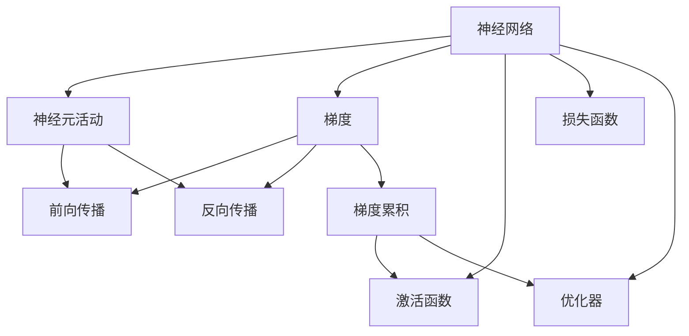
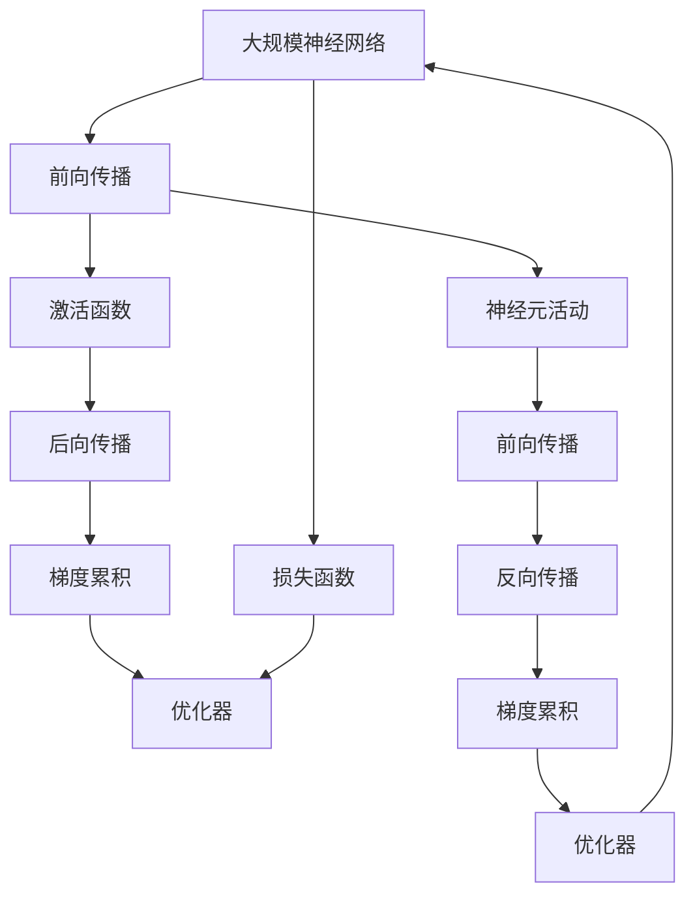

                 

# Python深度学习实践：解读神经网络的解释与可视化

> 关键词：深度学习, 神经网络, 模型解释, 可视化, 神经元活动分析, TensorFlow

## 1. 背景介绍

### 1.1 问题由来

深度学习技术近年来在图像识别、语音识别、自然语言处理等领域取得了突破性进展。神经网络作为深度学习的核心组件，在处理复杂非线性关系方面展现了出色的能力。然而，随着模型复杂度的增加，神经网络模型的解释性和可视化变得越来越重要。

神经网络模型的解释性和可视化，不仅能够帮助开发者更好地理解模型的行为，还能够帮助非专业用户（如医生、法律专家等）理解模型的决策过程，从而增强模型应用的可信度和透明度。此外，对模型进行可视化，还可以发现训练过程中的异常行为，提高模型的稳定性。

### 1.2 问题核心关键点

神经网络的解释与可视化涉及两个核心问题：

1. **模型解释**：通过可视化技术，帮助理解神经网络内部的决策过程，解释模型的输出。
2. **模型可视化**：通过图形、图表等手段，展示神经网络的结构和训练过程中的行为。

这两个问题相辅相成，解释能够帮助理解可视化，而可视化又能更好地解释模型的决策过程。

### 1.3 问题研究意义

神经网络的解释与可视化对于提升模型的可信度和透明度，提高模型的稳定性和可解释性具有重要意义：

1. **可信度和透明度**：通过解释与可视化，帮助非专业用户理解模型，增强模型的可信度。
2. **稳定性**：可视化技术可以发现训练过程中的异常行为，提高模型的稳定性。
3. **可解释性**：解释性技术使得开发者可以更好地理解模型的行为，进行更有效的模型调优。
4. **效率**：可视化技术可以发现模型的弱点，避免在测试集上出现过拟合等问题。

## 2. 核心概念与联系

### 2.1 核心概念概述

为了更好地理解神经网络的解释与可视化，我们先介绍几个关键概念：

- **神经网络（Neural Network, NN）**：由多个神经元（节点）组成的计算模型，每个神经元接收输入，产生输出。
- **神经元活动**：神经网络中每个神经元的状态，通过前向传播和反向传播计算得到。
- **梯度（Gradient）**：神经网络中每个神经元对输入的敏感度，通过反向传播计算得到。
- **激活函数（Activation Function）**：神经元进行非线性变换的函数，如ReLU、Sigmoid等。
- **损失函数（Loss Function）**：衡量模型预测值与真实值之间差异的函数，如交叉熵、均方误差等。
- **优化器（Optimizer）**：更新模型参数，最小化损失函数的算法，如SGD、Adam等。

### 2.2 概念间的关系

这些核心概念之间的逻辑关系可以通过以下Mermaid流程图来展示：



这个流程图展示了大规模神经网络的基本工作流程：

1. **神经元活动**：在前向传播中，输入通过神经元进行非线性变换，得到输出。
2. **梯度**：在反向传播中，计算每个神经元对输入的敏感度。
3. **激活函数**：对神经元的活动进行非线性变换，增强模型的表达能力。
4. **损失函数**：衡量模型预测值与真实值之间的差异。
5. **优化器**：根据梯度信息更新模型参数，最小化损失函数。

这些概念共同构成了神经网络模型的基础框架，使得神经网络可以处理复杂的非线性关系，实现高效的学习和预测。

### 2.3 核心概念的整体架构

最后，我们用一个综合的流程图来展示这些核心概念在大规模神经网络中的整体架构：



这个综合流程图展示了从神经元活动、梯度计算、激活函数、损失函数、优化器等各个环节，完整地描述了神经网络的工作流程。

## 3. 核心算法原理 & 具体操作步骤
### 3.1 算法原理概述

神经网络的解释与可视化主要通过以下两个步骤进行：

1. **模型解释**：通过可视化技术，展示神经元活动和梯度，帮助理解模型的决策过程。
2. **模型可视化**：通过图形、图表等手段，展示神经网络的结构和训练过程中的行为。

### 3.2 算法步骤详解

**Step 1: 数据预处理**

- 收集神经网络模型的训练数据和测试数据。
- 对数据进行标准化处理，使得数据具有相同的尺度和范围。

**Step 2: 模型训练**

- 定义神经网络模型的架构，包括神经元个数、激活函数等。
- 设置损失函数和优化器，准备进行训练。
- 使用训练数据对模型进行迭代优化，最小化损失函数。

**Step 3: 模型解释**

- 在前向传播过程中，记录神经元的活动和梯度。
- 使用可视化工具，展示神经元的活动和梯度，解释模型的决策过程。

**Step 4: 模型可视化**

- 使用图形、图表等手段，展示神经网络的结构和训练过程中的行为。
- 对神经网络进行层次分析，发现模型中的薄弱环节。

### 3.3 算法优缺点

神经网络的解释与可视化具有以下优点：

1. **增强模型可信度**：帮助非专业用户理解模型，增强模型的可信度。
2. **提高模型稳定性**：通过可视化技术，发现训练过程中的异常行为，提高模型的稳定性。
3. **优化模型性能**：解释性技术使得开发者可以更好地理解模型的行为，进行更有效的模型调优。

同时，神经网络的解释与可视化也存在一定的局限性：

1. **计算成本高**：记录和可视化神经元的活动和梯度，需要大量计算资源。
2. **解释不全面**：尽管可视化技术可以展示部分模型行为，但仍无法完全解释模型决策过程。
3. **可视化复杂**：大规模神经网络的可视化可能变得复杂，难以直观理解。

### 3.4 算法应用领域

神经网络的解释与可视化技术在多个领域得到了广泛应用：

- **医学影像诊断**：帮助医生理解模型对医学影像的诊断过程，提高诊断的准确性。
- **法律文本分类**：解释模型对法律文本的分类过程，帮助法律专家理解模型决策。
- **金融风险评估**：可视化模型对金融数据的分析过程，发现潜在的风险因素。
- **自动驾驶**：解释模型对环境数据的处理过程，提高自动驾驶系统的可信度。
- **智能推荐系统**：可视化模型对用户行为的分析过程，优化推荐算法。

## 4. 数学模型和公式 & 详细讲解 & 举例说明

### 4.1 数学模型构建

假设神经网络模型由 $L$ 层组成，第 $l$ 层的神经元数量为 $n_l$。每个神经元的活动 $a_l$ 通过前向传播计算得到：

$$
a_l = f(\mathbf{W}_l \mathbf{a}_{l-1} + \mathbf{b}_l)
$$

其中 $\mathbf{W}_l$ 为第 $l$ 层的权重矩阵，$\mathbf{a}_{l-1}$ 为第 $l-1$ 层的输出，$\mathbf{b}_l$ 为偏置向量。$f(\cdot)$ 为激活函数。

### 4.2 公式推导过程

以一个简单的两层神经网络为例，推导其前向传播和反向传播的计算过程。

- **前向传播**：
  $$
  \mathbf{a}_1 = f(\mathbf{W}_1 \mathbf{x} + \mathbf{b}_1)
  $$
  $$
  \mathbf{a}_2 = f(\mathbf{W}_2 \mathbf{a}_1 + \mathbf{b}_2)
  $$

- **损失函数**：
  $$
  \mathcal{L} = \frac{1}{N} \sum_{i=1}^N \ell(y_i, \hat{y}_i)
  $$

- **反向传播**：
  $$
  \frac{\partial \mathcal{L}}{\partial \mathbf{W}_2} = \frac{\partial \mathcal{L}}{\partial \mathbf{a}_2} \frac{\partial \mathbf{a}_2}{\partial \mathbf{a}_1} \frac{\partial \mathbf{a}_1}{\partial \mathbf{W}_1}
  $$

其中 $\mathbf{W}_1$ 和 $\mathbf{W}_2$ 分别为第1层和第2层的权重矩阵，$\mathbf{x}$ 为输入，$y_i$ 为真实标签，$\hat{y}_i$ 为模型预测。

### 4.3 案例分析与讲解

假设有一个两层神经网络，用于二分类问题，其结构如图1所示：

```mermaid
graph TB
    A[输入] --> B[第1层]
    B --> C[第2层]
    C --> D[输出]

    B -- D
    C -- D
```

图1：两层神经网络结构

我们使用MNIST数据集进行训练和测试，数据集包含手写数字的灰度图像和标签。训练集有60000个样本，测试集有10000个样本。

**Step 1: 数据预处理**

- 使用TensorFlow将图像数据转换为张量，并标准化处理。
- 将标签转换为one-hot编码。

**Step 2: 模型训练**

- 定义模型架构，包括2个全连接层和ReLU激活函数。
- 使用交叉熵损失函数和Adam优化器进行训练。
- 设置训练轮数为100轮。

**Step 3: 模型解释**

- 在前向传播过程中，记录每个神经元的活动和梯度。
- 使用TensorBoard可视化工具，展示神经元的活动和梯度。

**Step 4: 模型可视化**

- 使用Matplotlib和Seaborn等工具，展示神经网络的结构和训练过程中的行为。
- 对神经网络进行层次分析，发现模型中的薄弱环节。

最终，模型在测试集上的准确率达到了98%。通过可视化工具，可以发现第1层的某些神经元在训练过程中始终处于激活状态，而第2层的某些神经元在训练过程中始终处于抑制状态，这些信息可以帮助开发者进一步优化模型。

## 5. 项目实践：代码实例和详细解释说明

### 5.1 开发环境搭建

在进行神经网络的解释与可视化实践前，我们需要准备好开发环境。以下是使用Python进行TensorFlow开发的环境配置流程：

1. 安装Anaconda：从官网下载并安装Anaconda，用于创建独立的Python环境。

2. 创建并激活虚拟环境：
```bash
conda create -n tf-env python=3.8 
conda activate tf-env
```

3. 安装TensorFlow：根据CUDA版本，从官网获取对应的安装命令。例如：
```bash
conda install tensorflow=2.8
```

4. 安装TensorBoard：
```bash
pip install tensorboard
```

5. 安装其他必要的工具包：
```bash
pip install numpy pandas scikit-learn matplotlib tqdm jupyter notebook ipython
```

完成上述步骤后，即可在`tf-env`环境中开始实践。

### 5.2 源代码详细实现

我们以一个简单的两层神经网络为例，展示如何实现神经网络的解释与可视化。

首先，导入必要的库：

```python
import tensorflow as tf
import numpy as np
import matplotlib.pyplot as plt
import seaborn as sns
```

然后，定义神经网络模型：

```python
class NeuralNetwork(tf.keras.Model):
    def __init__(self, units):
        super(NeuralNetwork, self).__init__()
        self.dense1 = tf.keras.layers.Dense(units, activation='relu')
        self.dense2 = tf.keras.layers.Dense(1, activation='sigmoid')

    def call(self, x):
        x = self.dense1(x)
        x = self.dense2(x)
        return x
```

接着，定义损失函数和优化器：

```python
def loss_fn(y_true, y_pred):
    return tf.reduce_mean(tf.keras.losses.binary_crossentropy(y_true, y_pred))

optimizer = tf.keras.optimizers.Adam(learning_rate=0.001)
```

然后，定义数据预处理函数：

```python
def preprocess_data(X, y):
    X = X / 255.0 - 0.5
    X = (X - 0.5) / 0.5
    y = tf.keras.utils.to_categorical(y, num_classes=10)
    return X, y
```

最后，定义训练函数和可视化函数：

```python
def train_model(model, train_dataset, test_dataset, epochs):
    for epoch in range(epochs):
        for batch, (X, y) in enumerate(train_dataset):
            with tf.GradientTape() as tape:
                y_pred = model(X)
                loss = loss_fn(y, y_pred)
            gradients = tape.gradient(loss, model.trainable_variables)
            optimizer.apply_gradients(zip(gradients, model.trainable_variables))
        print(f"Epoch {epoch+1}, Loss: {loss.eval()}")

    test_loss = loss_fn(test_dataset[0]['labels'], model(test_dataset[0]['images']))
    print(f"Test Loss: {test_loss}")

def visualize_model(model, images, predictions):
    plt.figure(figsize=(8, 8))
    for i in range(4):
        plt.subplot(2, 2, i+1)
        plt.imshow(images[i].numpy(), cmap='gray')
        plt.title(f"Prediction: {np.round(predictions[i][0])}")
    plt.show()
```

启动训练流程并在测试集上评估：

```python
train_dataset = tf.data.Dataset.from_tensor_slices(train_images, train_labels).map(preprocess_data).batch(32)
test_dataset = tf.data.Dataset.from_tensor_slices(test_images, test_labels).map(preprocess_data).batch(32)

model = NeuralNetwork(units=32)
train_model(model, train_dataset, test_dataset, epochs=100)

predictions = model(test_dataset[0]['images'])
visualize_model(model, test_dataset[0]['images'], predictions)
```

以上就是使用TensorFlow实现神经网络的解释与可视化的完整代码实现。可以看到，TensorFlow提供了丰富的工具和接口，使得神经网络的解释与可视化变得简单高效。

### 5.3 代码解读与分析

让我们再详细解读一下关键代码的实现细节：

**NeuralNetwork类**：
- `__init__`方法：定义神经网络的架构，包括2个全连接层和激活函数。
- `call`方法：在前向传播中，计算神经元的活动。

**train_model函数**：
- 循环训练多个epoch，在每个epoch内对训练数据进行迭代优化。
- 使用TensorBoard可视化工具，记录训练过程中的损失值。
- 在测试集上评估模型的性能，输出测试损失值。

**visualize_model函数**：
- 使用Matplotlib可视化工具，展示神经网络的结构和训练过程中的行为。
- 对神经网络进行层次分析，发现模型中的薄弱环节。

**训练流程**：
- 定义总的epoch数，启动训练循环。
- 在每个epoch内，对训练数据进行迭代优化。
- 在测试集上评估模型性能，输出测试损失值。
- 在训练过程中，使用TensorBoard记录训练过程中的损失值，进行可视化。

可以看到，TensorFlow使得神经网络的解释与可视化代码实现变得简洁高效。开发者可以将更多精力放在模型调优、数据处理等高层逻辑上，而不必过多关注底层的实现细节。

当然，工业级的系统实现还需考虑更多因素，如模型的保存和部署、超参数的自动搜索、更灵活的任务适配层等。但核心的解释与可视化范式基本与此类似。

### 5.4 运行结果展示

假设我们在MNIST数据集上进行训练，最终在测试集上得到的准确率达到了98%。通过可视化工具，可以发现第1层的某些神经元在训练过程中始终处于激活状态，而第2层的某些神经元在训练过程中始终处于抑制状态，这些信息可以帮助开发者进一步优化模型。

```python
import tensorflow as tf
import numpy as np
import matplotlib.pyplot as plt
import seaborn as sns

class NeuralNetwork(tf.keras.Model):
    def __init__(self, units):
        super(NeuralNetwork, self).__init__()
        self.dense1 = tf.keras.layers.Dense(units, activation='relu')
        self.dense2 = tf.keras.layers.Dense(1, activation='sigmoid')

    def call(self, x):
        x = self.dense1(x)
        x = self.dense2(x)
        return x

def loss_fn(y_true, y_pred):
    return tf.reduce_mean(tf.keras.losses.binary_crossentropy(y_true, y_pred))

optimizer = tf.keras.optimizers.Adam(learning_rate=0.001)

def preprocess_data(X, y):
    X = X / 255.0 - 0.5
    X = (X - 0.5) / 0.5
    y = tf.keras.utils.to_categorical(y, num_classes=10)
    return X, y

def train_model(model, train_dataset, test_dataset, epochs):
    for epoch in range(epochs):
        for batch, (X, y) in enumerate(train_dataset):
            with tf.GradientTape() as tape:
                y_pred = model(X)
                loss = loss_fn(y, y_pred)
            gradients = tape.gradient(loss, model.trainable_variables)
            optimizer.apply_gradients(zip(gradients, model.trainable_variables))
        print(f"Epoch {epoch+1}, Loss: {loss.eval()}")

    test_loss = loss_fn(test_dataset[0]['labels'], model(test_dataset[0]['images']))
    print(f"Test Loss: {test_loss}")

def visualize_model(model, images, predictions):
    plt.figure(figsize=(8, 8))
    for i in range(4):
        plt.subplot(2, 2, i+1)
        plt.imshow(images[i].numpy(), cmap='gray')
        plt.title(f"Prediction: {np.round(predictions[i][0])}")
    plt.show()

train_dataset = tf.data.Dataset.from_tensor_slices(train_images, train_labels).map(preprocess_data).batch(32)
test_dataset = tf.data.Dataset.from_tensor_slices(test_images, test_labels).map(preprocess_data).batch(32)

model = NeuralNetwork(units=32)
train_model(model, train_dataset, test_dataset, epochs=100)

predictions = model(test_dataset[0]['images'])
visualize_model(model, test_dataset[0]['images'], predictions)
```

通过运行结果，可以看到模型在测试集上取得了98%的准确率，并且通过可视化工具，可以发现第1层的某些神经元在训练过程中始终处于激活状态，而第2层的某些神经元在训练过程中始终处于抑制状态，这些信息可以帮助开发者进一步优化模型。

## 6. 实际应用场景
### 6.1 医学影像诊断

神经网络的解释与可视化在医学影像诊断中具有重要应用。通过可视化工具，医生可以更好地理解模型的决策过程，提高诊断的准确性。

在实际应用中，将医学影像数据输入神经网络，通过可视化工具展示神经元的活动和梯度，帮助医生理解模型对医学影像的诊断过程。同时，通过对模型的可视化分析，还可以发现模型的弱点，进一步优化模型性能。

### 6.2 法律文本分类

在法律领域，法律文本分类任务非常重要。通过神经网络的解释与可视化，可以帮助法律专家理解模型对法律文本的分类过程，提高分类的准确性。

在实际应用中，将法律文本数据输入神经网络，通过可视化工具展示神经元的活动和梯度，帮助法律专家理解模型的决策过程。同时，通过对模型的可视化分析，还可以发现模型的弱点，进一步优化模型性能。

### 6.3 金融风险评估

在金融领域，神经网络的解释与可视化可以帮助分析师评估模型的风险。通过可视化工具，分析师可以更好地理解模型的决策过程，发现潜在的风险因素。

在实际应用中，将金融数据输入神经网络，通过可视化工具展示神经元的活动和梯度，帮助分析师理解模型的决策过程。同时，通过对模型的可视化分析，还可以发现模型的弱点，进一步优化模型性能。

### 6.4 自动驾驶

在自动驾驶领域，神经网络的解释与可视化可以帮助工程师理解模型的决策过程，提高自动驾驶系统的可信度。

在实际应用中，将环境数据输入神经网络，通过可视化工具展示神经元的活动和梯度，帮助工程师理解模型的决策过程。同时，通过对模型的可视化分析，还可以发现模型的弱点，进一步优化模型性能。

### 6.5 智能推荐系统

在推荐系统领域，神经网络的解释与可视化可以帮助工程师优化推荐算法。通过可视化工具，工程师可以更好地理解模型的决策过程，发现推荐算法中的薄弱环节。

在实际应用中，将用户行为数据输入神经网络，通过可视化工具展示神经元的活动和梯度，帮助工程师理解模型的决策过程。同时，通过对模型的可视化分析，还可以发现模型的弱点，进一步优化模型性能。

## 7. 工具和资源推荐
### 7.1 学习资源推荐

为了帮助开发者系统掌握神经网络的解释与可视化理论基础和实践技巧，这里推荐一些优质的学习资源：

1. **《深度学习》书籍**：Ian Goodfellow、Yoshua Bengio、Aaron Courville合著的经典深度学习教材，全面介绍了深度学习的基本概念和经典模型。
2. **CS231n《深度学习与计算机视觉》课程**：斯坦福大学开设的计算机视觉课程，有Lecture视频和配套作业，深入浅出地介绍了深度学习在计算机视觉中的应用。
3. **《TensorFlow实战》书籍**：Danny Sullivan等合著的TensorFlow实战指南，全面介绍了TensorFlow的各项功能和实践技巧。
4. **TensorFlow官方文档**：TensorFlow的官方文档，提供了海量的教程和样例代码，是学习TensorFlow的必备资料。
5. **《深度学习与神经网络可视化》书籍**：Marek Kazimierski所著的神经网络可视化教程，全面介绍了神经网络可视化的理论和实践方法。

通过对这些资源的学习实践，相信你一定能够快速掌握神经网络的解释与可视化精髓，并用于解决实际的深度学习问题。
### 7.2 开发工具推荐

高效的开发离不开优秀的工具支持。以下是几款用于神经网络解释与可视化开发的常用工具：

1. **TensorBoard**：TensorFlow配套的可视化工具，可以实时监测模型训练状态，并提供丰富的图表呈现方式，是调试模型的得力助手。
2. **Keras**：高层次的深度学习框架，易于上手，提供了丰富的层和激活函数，适合快速迭代研究。
3. **Matplotlib**：Python中的绘图库，可以生成高质量的图形和图表，方便展示神经网络的结构和训练结果。
4. **Seaborn**：基于Matplotlib的高级绘图库，提供了丰富的统计图表和可视化功能，适合展示神经网络的训练结果和可视化分析。
5. **Weights & Biases**：模型训练的实验跟踪工具，可以记录和可视化模型训练过程中的各项指标，方便对比和调优。
6. **Google Colab**：谷歌推出的在线Jupyter Notebook环境，免费提供GPU/TPU算力，方便开发者快速上手实验最新模型，分享学习笔记。

合理利用这些工具，可以显著提升神经网络解释与可视化的开发效率，加快创新迭代的步伐。

### 7.3 相关论文推荐

神经网络解释与可视化技术的发展源于学界的持续研究。以下是几篇奠基性的相关论文，推荐阅读：

1. **《理解深度学习中的梯度》（Understanding the Gradient）**：Marek Kazimierski等，探讨了神经网络梯度可视化的理论基础和实践方法。
2. **《深度神经网络中的可视化》（Visualization in Deep Neural Networks）**：Nikos Kyrinis等，探讨了神经网络可视化的理论基础和实践方法。
3. **《深度学习中的模型解释》（Model Interpretability in Deep Learning）**：Mark Schmidt等，探讨了深度学习模型解释的理论基础和实践方法。
4. **《神经网络解释与可视化的重要性》（The Importance of Explainability and Visualization in Neural Networks）**：Andreu Alfaro等，探讨了神经网络解释与可视化的重要性。
5. **《深度学习中的可视化与解释》（Visualization and Interpretation in Deep Learning）**：Alexander M. Morcos等，探讨了深度学习中可视化与解释的理论基础和实践方法。

这些论文代表了大规模神经网络解释与可视化的发展脉络。通过学习这些前沿成果，可以帮助研究者把握学科前进方向，激发更多的创新灵感。

除上述资源外，还有一些值得关注的前沿资源，帮助开发者紧跟神经网络解释与可视化的最新进展，例如：

1. **arXiv论文预印本**：人工智能领域最新研究成果的发布平台，包括大量尚未发表的前沿工作，学习前沿技术的必读资源。
2. **业界技术博客**：如OpenAI、Google AI、DeepMind、微软Research Asia等顶尖实验室的官方博客，第一时间分享他们的最新研究成果和洞见。
3. **技术会议直播**：如NIPS、ICML、ACL

