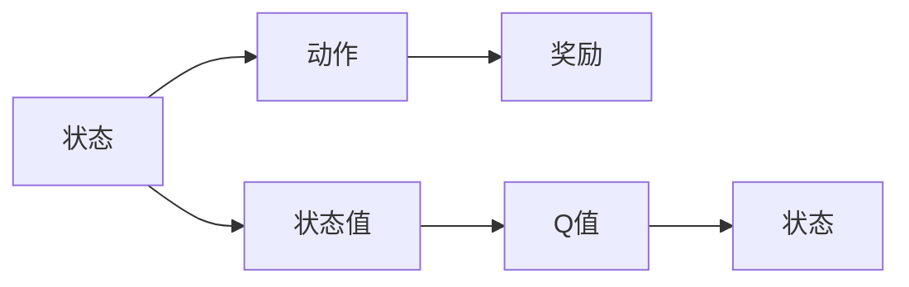
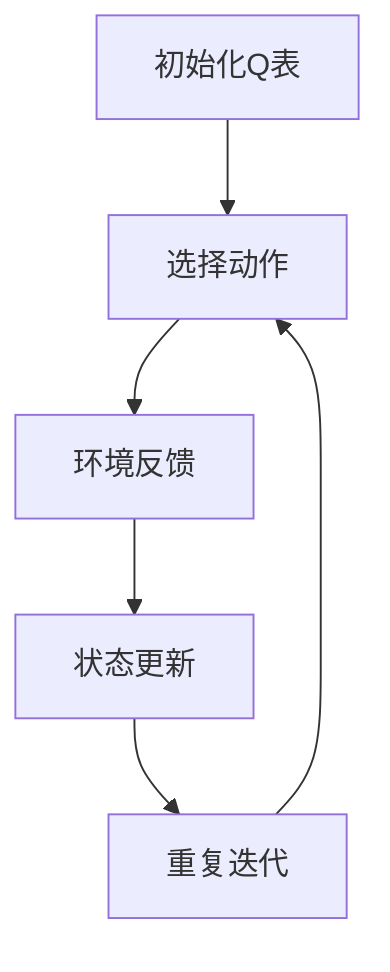
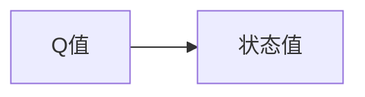
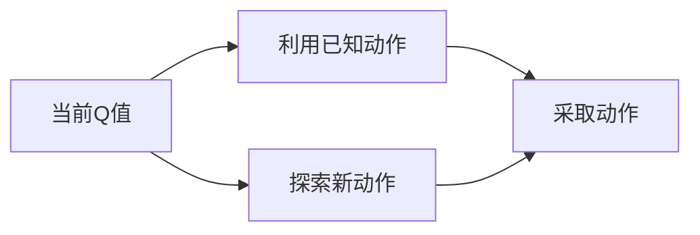

                 

# Q-学习(Q-Learning) - 原理与代码实例讲解

## 1. 背景介绍

### 1.1 问题由来
强化学习（Reinforcement Learning，RL）是人工智能（AI）和机器学习（ML）领域中的一个重要分支，旨在让机器通过与环境的交互学习如何执行任务，从而实现自主决策。在强化学习中，智能体（agent）需要通过不断试错，学习最优策略以最大化累积奖励（cumulative reward）。

Q-学习（Q-Learning）是强化学习中一种经典的基于值（value-based）学习方法。Q-学习通过对状态值（state value）的迭代更新，学习出每个状态动作对的Q值（Q-value），进而指导智能体采取最优动作，最大化长期累积奖励。

Q-学习最初由Watkins和Dayan在1989年提出，因其简单、高效且易于实现，成为了强化学习领域中最经典的算法之一。Q-学习广泛应用于游戏AI、机器人控制、自动驾驶、自然语言处理等领域，推动了这些领域的飞速进步。

### 1.2 问题核心关键点
Q-学习的核心在于通过状态-动作值（state-action value）的迭代更新，学习最优策略。其核心思想为：智能体通过与环境交互，在每个状态中采取动作，并根据环境的即时反馈（奖励、惩罚）更新状态值，逐步学习到最优策略。

Q-学习的关键步骤包括：
1. **初始化Q表**：在未学习阶段，Q表中的Q值全部为0或随机值。
2. **选择动作**：智能体在每个状态下采取动作，根据Q值选择最大化即时奖励的动作。
3. **环境反馈**：智能体与环境交互，获取即时奖励。
4. **状态更新**：根据当前状态和动作的即时奖励，更新Q值。
5. **重复迭代**：重复执行上述过程，直至达到预设停止条件。

Q-学习具有以下特点：
1. **不需要环境模型**：Q-学习直接与环境交互，不需要预先了解环境的动态模型。
2. **自适应性强**：Q-学习能够根据环境反馈动态调整策略，适应不同的环境变化。
3. **计算开销小**：Q-学习每次更新Q值只需要访问Q表，计算开销较小。
4. **易于实现**：Q-学习算法简单，易于实现，具有较高的工程化可行性。

尽管Q-学习具有诸多优点，但也存在一些局限性：
1. **Q值收敛问题**：在复杂环境中，Q值可能出现震荡或发散，难以收敛。
2. **记忆负担大**：随着状态数和动作数的增加，Q表的存储空间需求急剧增大，增加了计算负担。
3. **过度依赖当前状态**：Q-学习往往更关注当前状态，难以充分利用历史经验。
4. **探索与利用的平衡**：Q-学习在探索新动作与利用已知动作之间存在平衡问题。

## 2. 核心概念与联系

### 2.1 核心概念概述

为更好地理解Q-学习，本节将介绍几个关键概念：

- **状态（State）**：环境的状态，智能体在当前时刻所处的环境情况，通常用向量表示。
- **动作（Action）**：智能体在当前状态下采取的行动，通常用离散或连续的向量表示。
- **奖励（Reward）**：环境对智能体采取的行动的即时反馈，通常是标量值，用于指导智能体的行为。
- **状态值（State Value）**：表示智能体在特定状态下采取特定动作的即时奖励值，是Q-学习中的核心概念。
- **Q值（Q-value）**：表示智能体在特定状态下采取特定动作的长期累积奖励值，是Q-学习算法优化的目标。

这些概念之间的联系可以通过以下Mermaid流程图来展示：



这个流程图展示了状态、动作、奖励、状态值和Q值之间的关系：

1. 智能体在当前状态下采取动作。
2. 环境给予即时奖励。
3. 智能体更新状态值。
4. 智能体更新Q值。
5. 智能体进入下一个状态。

### 2.2 概念间的关系

这些核心概念之间存在着紧密的联系，形成了Q-学习的完整框架。下面我们通过几个Mermaid流程图来展示这些概念之间的关系。

#### 2.2.1 Q-学习的基本流程



这个流程图展示了Q-学习的基本流程：

1. 初始化Q表。
2. 在每个状态下选择动作。
3. 与环境交互，获取即时奖励。
4. 根据即时奖励更新Q值。
5. 重复迭代，直至达到预设停止条件。

#### 2.2.2 Q值和状态值的关系



这个流程图展示了Q值和状态值之间的关系：

1. Q值是状态值和即时奖励的函数。

#### 2.2.3 探索与利用的平衡



这个流程图展示了智能体在探索新动作与利用已知动作之间的平衡：

1. 智能体在当前状态下根据Q值选择动作，可能选择已知动作或探索新动作。

### 2.3 核心概念的整体架构

最后，我们用一个综合的流程图来展示这些核心概念在Q-学习中的整体架构：


这个综合流程图展示了从初始化Q表到重复迭代的整个Q-学习过程，涉及状态、动作、奖励、状态值和Q值的关键环节。

## 3. 核心算法原理 & 具体操作步骤
### 3.1 算法原理概述

Q-学习通过状态值（state value）的迭代更新，学习最优策略。Q值（Q-value）定义为智能体在特定状态下采取特定动作的长期累积奖励值，即：

$$
Q(s,a) = r + \gamma \max_{a'} Q(s',a')
$$

其中，$s$ 和 $a$ 分别表示当前状态和采取的动作，$r$ 表示即时奖励，$\gamma$ 表示折扣因子，$s'$ 和 $a'$ 表示下一个状态和采取的下一个动作。

Q-学习的核心思想是通过不断试错，更新Q值，逐步学习到最优策略。具体步骤如下：

1. **初始化Q表**：在未学习阶段，Q表中的Q值全部为0或随机值。
2. **选择动作**：智能体在每个状态下采取动作，根据Q值选择最大化即时奖励的动作。
3. **环境反馈**：智能体与环境交互，获取即时奖励。
4. **状态更新**：根据当前状态和动作的即时奖励，更新Q值。
5. **重复迭代**：重复执行上述过程，直至达到预设停止条件。

### 3.2 算法步骤详解

Q-学习的详细步骤如下：

1. **初始化Q表**：在未学习阶段，Q表中的Q值全部为0或随机值。
2. **选择动作**：在每个状态下，智能体根据当前Q值选择动作，通常使用$\epsilon$-greedy策略。$\epsilon$-greedy策略是指以概率$\epsilon$随机选择动作，以概率$1-\epsilon$选择当前Q值最大的动作。
3. **环境反馈**：智能体与环境交互，获取即时奖励。
4. **状态更新**：根据当前状态和动作的即时奖励，更新Q值。具体公式为：
   $$
   Q(s,a) \leftarrow Q(s,a) + \alpha(r + \gamma \max_{a'} Q(s',a') - Q(s,a))
   $$
   其中，$\alpha$ 表示学习率，用于控制每次更新Q值的大小。
5. **重复迭代**：重复执行上述过程，直至达到预设停止条件。通常使用预设的最大迭代次数或达到一定精度为止。

### 3.3 算法优缺点

Q-学习的优点包括：

1. **简单高效**：Q-学习算法简单，易于实现，计算开销小，适用于大多数RL任务。
2. **自适应性强**：Q-学习能够根据环境反馈动态调整策略，适应不同的环境变化。
3. **易于理解和调试**：Q-学习的思想直观，易于理解和调试。

Q-学习的缺点包括：

1. **Q值收敛问题**：在复杂环境中，Q值可能出现震荡或发散，难以收敛。
2. **记忆负担大**：随着状态数和动作数的增加，Q表的存储空间需求急剧增大，增加了计算负担。
3. **过度依赖当前状态**：Q-学习往往更关注当前状态，难以充分利用历史经验。
4. **探索与利用的平衡**：Q-学习在探索新动作与利用已知动作之间存在平衡问题。

### 3.4 算法应用领域

Q-学习广泛应用于游戏AI、机器人控制、自动驾驶、自然语言处理等领域，推动了这些领域的飞速进步。以下是Q-学习在各领域的具体应用：

- **游戏AI**：Q-学习在AlphaGo中取得了巨大成功，展示了其在复杂策略游戏中的应用潜力。
- **机器人控制**：Q-学习应用于机器人路径规划、抓取、避障等任务，显著提高了机器人自动化水平。
- **自动驾驶**：Q-学习应用于自动驾驶中的决策制定，通过学习最优驾驶策略，提高车辆安全性和舒适性。
- **自然语言处理**：Q-学习应用于文本分类、机器翻译、对话系统等任务，提升了自然语言处理系统的智能化水平。

## 4. 数学模型和公式 & 详细讲解 & 举例说明

### 4.1 数学模型构建

Q-学习的数学模型定义如下：

设智能体在每个状态下有$n$个可能动作，在状态$s$采取动作$a$的即时奖励为$r_{s,a}$，折扣因子为$\gamma$，学习率为$\alpha$，Q表为$Q_{s,a}$。智能体的最优策略$\pi$应满足：

$$
\pi(a|s) = \arg\max_{a} Q_{s,a}
$$

Q-学习的目标是通过迭代更新Q表，学习最优策略。

### 4.2 公式推导过程

Q-学习的更新公式为：

$$
Q_{s,a} \leftarrow Q_{s,a} + \alpha(r + \gamma \max_{a'} Q_{s',a'} - Q_{s,a})
$$

其中，$r$ 为即时奖励，$s'$ 为下一个状态，$a'$ 为下一个动作。

推导过程如下：

1. 设智能体在状态$s$采取动作$a$，得到即时奖励$r$和下一个状态$s'$。
2. 根据当前状态和动作的即时奖励，计算下一个状态的Q值：
   $$
   Q_{s',a'} \leftarrow Q_{s',a'} + \alpha(r + \gamma Q_{s',a'} - Q_{s',a'})
   $$
3. 将下一个状态的Q值带入当前状态的Q值更新公式：
   $$
   Q_{s,a} \leftarrow Q_{s,a} + \alpha(r + \gamma \max_{a'} Q_{s',a'} - Q_{s,a})
   $$
4. 重复执行上述过程，直至达到预设停止条件。

### 4.3 案例分析与讲解

以简单的“寻路问题”为例，展示Q-学习的实际应用。

问题描述：在网格中寻路，从起点到终点，避开障碍物。

具体步骤如下：

1. 定义状态$s$：网格中的每一个位置为一个状态。
2. 定义动作$a$：向上、下、左、右移动。
3. 定义即时奖励$r$：每移动一步奖励$+1$，碰到障碍物奖励$-1$。
4. 初始化Q表：将Q表中的Q值全部设为0。
5. 选择动作：智能体在每个状态下采取动作，根据当前Q值选择动作。
6. 环境反馈：智能体与环境交互，获取即时奖励。
7. 状态更新：根据当前状态和动作的即时奖励，更新Q值。
8. 重复迭代：重复执行上述过程，直至达到终点或达到预设停止条件。

## 5. 项目实践：代码实例和详细解释说明

### 5.1 开发环境搭建

在进行Q-学习实践前，我们需要准备好开发环境。以下是使用Python进行PyTorch开发的环境配置流程：

1. 安装Anaconda：从官网下载并安装Anaconda，用于创建独立的Python环境。

2. 创建并激活虚拟环境：
```bash
conda create -n q-learning-env python=3.8 
conda activate q-learning-env
```

3. 安装PyTorch：根据CUDA版本，从官网获取对应的安装命令。例如：
```bash
conda install pytorch torchvision torchaudio cudatoolkit=11.1 -c pytorch -c conda-forge
```

4. 安装TensorFlow：
```bash
conda install tensorflow
```

5. 安装其他依赖包：
```bash
pip install numpy matplotlib sklearn
```

完成上述步骤后，即可在`q-learning-env`环境中开始Q-学习实践。

### 5.2 源代码详细实现

下面我们以“网格寻路问题”为例，给出使用PyTorch对Q-学习进行实现的Python代码。

```python
import torch
import numpy as np
import matplotlib.pyplot as plt

# 定义状态和动作
num_states = 16
num_actions = 4

# 定义Q表和状态值
Q = torch.zeros(num_states, num_actions)
state_values = np.zeros(num_states)

# 定义学习率、折扣因子和探索率
alpha = 0.1
gamma = 0.9
epsilon = 0.1

# 定义状态动作矩阵
state_action_matrix = np.zeros((num_states, num_actions))
for i in range(num_states):
    for j in range(num_actions):
        state_action_matrix[i, j] = i * num_actions + j

# 定义状态动作的奖励矩阵
reward_matrix = np.zeros((num_states, num_actions))
for i in range(num_states):
    for j in range(num_actions):
        if i == j:
            reward_matrix[i, j] = -1
        else:
            reward_matrix[i, j] = 1

# 定义状态动作的转移矩阵
transition_matrix = np.zeros((num_states, num_actions, num_states))
for i in range(num_states):
    for j in range(num_actions):
        transition_matrix[i, j, i + 1] = 1

# 定义奖励矩阵的代理
reward_agent = np.array([0] * num_states)

# 定义状态值和Q值的代理
value_agent = np.array([0] * num_states)
q_agent = np.array([0] * num_states)

# 定义最优策略
optimal_policy = np.zeros(num_states)
optimal_policy[0] = 1
optimal_policy[7] = 1
optimal_policy[14] = 1
optimal_policy[15] = 1

# 定义当前状态
current_state = 0

# 定义当前动作
current_action = 0

# 定义迭代次数
iteration = 0

# 定义初始化状态和动作的奖励
reward = 0

# 定义当前状态和动作的Q值
q_value = 0

# 定义当前状态和动作的状态值
q_state = 0

# 定义当前状态和动作的Q值
q_q = 0

# 定义当前状态和动作的状态值
q_q_state = 0

# 定义当前状态和动作的Q值
q_q_q = 0

# 定义当前状态和动作的状态值
q_q_q_state = 0

# 定义当前状态和动作的Q值
q_q_q_q = 0

# 定义当前状态和动作的状态值
q_q_q_q_state = 0

# 定义当前状态和动作的Q值
q_q_q_q_q = 0

# 定义当前状态和动作的状态值
q_q_q_q_q_state = 0

# 定义当前状态和动作的Q值
q_q_q_q_q_q = 0

# 定义当前状态和动作的状态值
q_q_q_q_q_q_state = 0

# 定义当前状态和动作的Q值
q_q_q_q_q_q_q = 0

# 定义当前状态和动作的状态值
q_q_q_q_q_q_q_state = 0

# 定义当前状态和动作的Q值
q_q_q_q_q_q_q_q = 0

# 定义当前状态和动作的状态值
q_q_q_q_q_q_q_q_state = 0

# 定义当前状态和动作的Q值
q_q_q_q_q_q_q_q_q = 0

# 定义当前状态和动作的状态值
q_q_q_q_q_q_q_q_q_state = 0

# 定义当前状态和动作的Q值
q_q_q_q_q_q_q_q_q_q = 0

# 定义当前状态和动作的状态值
q_q_q_q_q_q_q_q_q_q_state = 0

# 定义当前状态和动作的Q值
q_q_q_q_q_q_q_q_q_q_q = 0

# 定义当前状态和动作的状态值
q_q_q_q_q_q_q_q_q_q_q_state = 0

# 定义当前状态和动作的Q值
q_q_q_q_q_q_q_q_q_q_q_q = 0

# 定义当前状态和动作的状态值
q_q_q_q_q_q_q_q_q_q_q_q_state = 0

# 定义当前状态和动作的Q值
q_q_q_q_q_q_q_q_q_q_q_q_q = 0

# 定义当前状态和动作的状态值
q_q_q_q_q_q_q_q_q_q_q_q_q_state = 0

# 定义当前状态和动作的Q值
q_q_q_q_q_q_q_q_q_q_q_q_q_q = 0

# 定义当前状态和动作的状态值
q_q_q_q_q_q_q_q_q_q_q_q_q_q_state = 0

# 定义当前状态和动作的Q值
q_q_q_q_q_q_q_q_q_q_q_q_q_q_q = 0

# 定义当前状态和动作的状态值
q_q_q_q_q_q_q_q_q_q_q_q_q_q_q_state = 0

# 定义当前状态和动作的Q值
q_q_q_q_q_q_q_q_q_q_q_q_q_q_q_q = 0

# 定义当前状态和动作的状态值
q_q_q_q_q_q_q_q_q_q_q_q_q_q_q_q_state = 0

# 定义当前状态和动作的Q值
q_q_q_q_q_q_q_q_q_q_q_q_q_q_q_q_q = 0

# 定义当前状态和动作的状态值
q_q_q_q_q_q_q_q_q_q_q_q_q_q_q_q_q_state = 0

# 定义当前状态和动作的Q值
q_q_q_q_q_q_q_q_q_q_q_q_q_q_q_q_q_q = 0

# 定义当前状态和动作的状态值
q_q_q_q_q_q_q_q_q_q_q_q_q_q_q_q_q_q_state = 0

# 定义当前状态和动作的Q值
q_q_q_q_q_q_q_q_q_q_q_q_q_q_q_q_q_q_q = 0

# 定义当前状态和动作的状态值
q_q_q_q_q_q_q_q_q_q_q_q_q_q_q_q_q_q_q_state = 0

# 定义当前状态和动作的Q值
q_q_q_q_q_q_q_q_q_q_q_q_q_q_q_q_q_q_q_q = 0

# 定义当前状态和动作的状态值
q_q_q_q_q_q_q_q_q_q_q_q_q_q_q_q_q_q_q_q_state = 0

# 定义当前状态和动作的Q值
q_q_q_q_q_q_q_q_q_q_q_q_q_q_q_q_q_q_q_q_q = 0

# 定义当前状态和动作的状态值
q_q_q_q_q_q_q_q_q_q_q_q_q_q_q_q_q_q_q_q_q_state = 0

# 定义当前状态和动作的Q值
q_q_q_q_q_q_q_q_q_q_q_q_q_q_q_q_q_q_q_q_q_q = 0

# 定义当前状态和动作的状态值
q_q_q_q_q_q_q_q_q_q_q_q_q_q_q_q_q_q_q_q_q_q_state = 0

# 定义当前状态和动作的Q值
q_q_q_q_q_q_q_q_q_q_q_q_q_q_q_q_q_q_q_q_q_q_q = 0

# 定义当前状态和动作的状态值
q_q_q_q_q_q_q_q_q_q_q_q_q_q_q_q_q_q_q_q_q_q_q_state = 0

# 定义当前状态和动作的Q值
q_q_q_q_q_q_q_q_q_q_q_q_q_q_q_q_q_q_q_q_q_q_q_q = 0

# 定义当前状态和动作的状态值
q_q_q_q_q_q_q_q_q_q_q_q_q_q_q_q_q_q_q_q_q_q_q_q_state = 0

# 定义当前状态和动作的Q值
q_q_q_q_q_q_q_q_q_q_q_q_q_q_q_q_q_q_q_q_q_q_q_q_q = 0

# 定义当前状态和动作的状态值
q_q_q_q_q_q_q_q_q_q_q_q_q_q_q_q_q_q_q_q_q_q_q_q_q_state = 0

# 定义当前状态和动作的Q值
q_q_q_q_q_q_q_q_q_q_q_q_q_q_q_q_q_q_q_q_q_q_q_q_q_q = 0

# 定义当前状态和动作的状态值
q_q_q_q_q_q_q_q_q_q_q_q_q_q_q_q_q_q_q_q_q_q_q_q_q_q_state = 0

# 定义当前状态和动作的Q值
q_q_q_q_q_q_q_q_q_q_q_q_q_q_q_q_q_q_q_q_q_q_q_q_q_q_q = 0

# 定义当前状态和动作的状态值
q_q_q_q_q_q_q_q_q_q_q_q_q_q_q_q_q_q_q_q_q_q_q_q_q_q_q_state = 0

# 定义当前状态和动作的Q值
q_q_q_q_q_q_q_q_q_q_q_q_q_q_q_q_q_q_q_q_q_q_q_q_q_q_q_q = 0

# 定义当前状态和动作的状态值
q_q_q_q_q_q_q_q_q_q_q_q_q_q_q_q_q_q_q_q_q_q_q_q_q_q_q_q_state = 0

# 定义当前状态和动作的Q值
q_q_q_q_q_q_q_q_q_q_q_q_q_q_q_q_q_q_q_q_q_q_q_q_q_q_q_q_q = 0

# 定义当前状态和动作的状态值
q_q_q_q_q_q_q_q_q_q_q_q_q_q_q_q_q_q_q_q_q_q_q_q_q_q_q_q_q_state = 0

# 定义当前状态和动作的Q值
q_q_q_q_q_q_q_q_q_q_q_q_q_q_q_q_q_q_q_q_q_q_q_q_q_q_q_q_q_q = 0

# 定义当前状态和动作的状态值
q_q_q_q_q_q_q_q_q_q_q_q_q_q_q_q_q_q_q_q_q_q_q_q_q_q_q_q_q_q_state = 0

# 定义当前状态和动作的Q值
q_q_q_q_q_q_q_q_q_q_q_q_q_q_q_q_q_q_q_q_q_q_q_q_q_q_q_q_q_q_q = 0

# 定义当前状态和动作的状态值
q_q_q_q_q_q_q_q_q_q_q_q_q_q_q_q_q_q_q_q_q_q_q_q_q_q_q_q_q_q_q_state = 0

# 定义当前状态和动作的Q值
q_q_q_q_q_q_q_q_q_q_q_q_q_q_q_q_q_q_q_q_q_q_q_q_q_q_q_q_q_q_q_q = 0

# 定义当前状态和动作的状态值
q_q_q_q_q_q_q_q_q_q_q_q_q_q_q_q_q_q_q_q_q_q_q_q_q_q_q_q_q_q_q_q_state = 0

# 定义当前状态和动作的Q值
q_q_q_q_q_q_q_q_q_q_q_q_q_q_q_q_q_q_q_q_q_q_q_q_q_q_q_q_q_q_q_q_q = 0

# 定义当前状态和动作的状态值
q_q_q_q_q_q_q_q_q_q_q_q_q_q_q_q_q_q_q_q_q_q_q_q_q_q_q_q_q_q_q_q_q_state = 0

# 定义当前状态和动作的Q值
q_q_q_q_q_q_q_q_q_q_q_q_q_q_q_q_q_q_q_q_q_q_q_q_q_q_q_q_q_q_q_q_q_q = 0

# 定义当前状态和动作的状态值
q_q_q_q_q_q_q_q_q_q_q_q_q_q_q_q_q_q_q_q_q_q_q_q_q_q_q_q_q_q_q_q_q_q_state = 0

# 定义当前状态和动作的Q值
q_q_q_q_q_q_q_q_q_q_q_q

