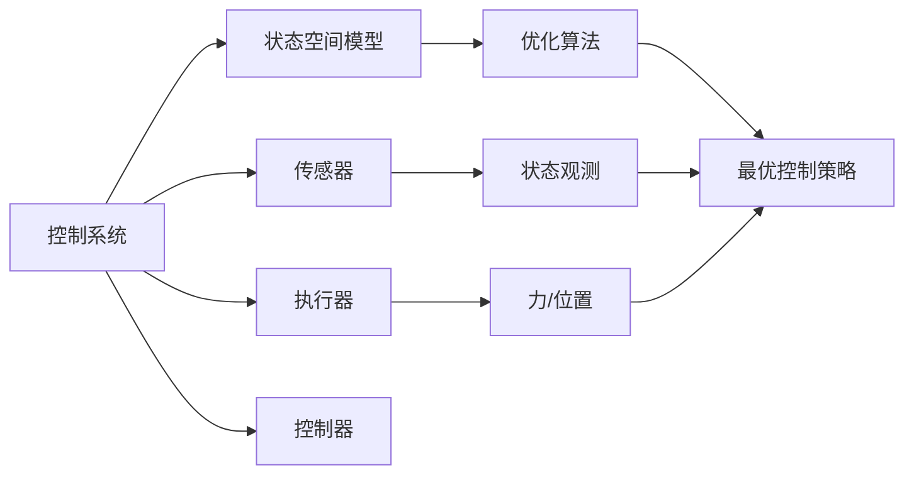
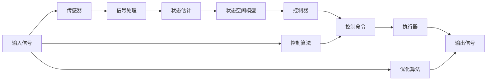

                 

# Robotics and Control Systems 原理与代码实战案例讲解

## 1. 背景介绍

### 1.1 问题由来
现代工业和工程领域中，机器人系统和自动控制系统的应用广泛。随着科技的进步，机器人技术已从简单的自动化装配和搬运发展到复杂的自主导航、智能操作和协作执行。控制系统的设计复杂，涉及到多维度和非线性特性，往往需要精确的数学模型和算法支撑。本文聚焦于机器人系统和自动控制系统，探讨其原理与代码实战，为读者提供深入的理论指导和实战案例。

### 1.2 问题核心关键点
机器人系统和自动控制系统具有以下核心特点：
- 复杂的动态非线性特性，需要精确的数学模型描述。
- 需要高效的算法实现实时控制和优化决策。
- 需要系统集成多传感器数据，实现环境感知和决策执行。
- 需要考虑系统的稳定性、可靠性和安全性。

针对这些问题，本文将从控制系统原理、控制算法设计、代码实现和应用案例等多个方面，深入介绍机器人系统和自动控制系统的设计方法和实现技巧。

## 2. 核心概念与联系

### 2.1 核心概念概述

为便于读者理解，本节将介绍几个与机器人系统和自动控制系统密切相关的核心概念：

- **控制系统**：是指能够接收输入信号并生成相应输出信号，以控制某个实际系统运行的系统。常见的控制系统包括PID控制器、自适应控制、模糊控制等。
- **机器人系统**：是指由传感器、控制器和执行器组成，能够在物理空间内完成复杂任务的智能系统。机器人系统常用于工业自动化、医疗手术、农业生产等领域。
- **状态空间模型**：是指用状态空间形式描述的动态系统模型，常用状态空间方程描述系统的状态演变和控制输入的关系。
- **控制器**：是控制系统中的核心组件，根据传感器输入信号，通过计算生成控制命令，控制系统的动态行为。
- **优化算法**：包括梯度下降、最小二乘法等，用于求解控制系统的最优控制策略。

这些概念之间存在着紧密的联系，构成了机器人系统和自动控制系统设计的基础。通过理解这些概念，我们能够更好地掌握控制系统设计的思路和方法。

### 2.2 概念间的关系

这些核心概念之间的逻辑关系可以通过以下Mermaid流程图来展示：



这个流程图展示了机器人系统和自动控制系统的核心组件及其之间的关系：

1. 控制系统接收传感器输入信号。
2. 状态空间模型描述系统的动态行为。
3. 控制器根据状态模型生成控制命令。
4. 优化算法用于求解最优控制策略。
5. 执行器执行控制命令。

通过这个框架，我们可以更清晰地理解控制系统设计的思路和实现方法。

### 2.3 核心概念的整体架构

最后，我们用一个综合的流程图来展示这些核心概念在大系统中的整体架构：



这个综合流程图展示了从输入信号到输出信号的完整系统流程，以及状态空间模型、控制器和优化算法在其中的作用。通过这个框架，我们可以系统地理解和设计机器人系统和自动控制系统。

## 3. 核心算法原理 & 具体操作步骤
### 3.1 算法原理概述

机器人系统和自动控制系统的工作原理，通常可以分为以下几个步骤：

1. **信号获取**：通过传感器获取环境信息，并转化为控制系统的输入信号。
2. **状态估计**：根据传感器信息，使用状态估计算法更新系统的当前状态。
3. **决策制定**：使用控制器生成控制命令，以调整系统的动态行为。
4. **系统执行**：执行器根据控制命令，调整系统的物理行为，产生输出信号。
5. **结果反馈**：将输出信号反馈到传感器，用于下一次循环控制。

以上步骤中，状态空间模型、控制器和优化算法起着关键作用，以下将详细介绍这些核心算法的原理和操作步骤。

### 3.2 算法步骤详解

**Step 1: 系统建模**

首先需要根据实际应用场景，建立系统的状态空间模型。状态空间模型通常由以下方程组成：

$$
\dot{x}(t) = Ax(t) + Bu(t)
$$

$$
y(t) = Cx(t) + Du(t)
$$

其中，$x(t)$ 表示系统的状态向量，$u(t)$ 表示控制命令向量，$y(t)$ 表示系统输出向量，$A$、$B$、$C$、$D$ 表示系统的系统矩阵和控制矩阵。

**Step 2: 状态估计**

根据传感器数据，可以使用卡尔曼滤波、H∞滤波等算法估计系统的当前状态。以卡尔曼滤波为例，其基本步骤包括：

1. **预测**：根据上一时刻的状态估计，预测当前状态。
2. **更新**：根据传感器的当前测量值，更新状态估计。

预测方程为：

$$
\hat{x}_k|_k = A\hat{x}_k|_{k-1} + Bu_k
$$

更新方程为：

$$
\hat{x}_k|_k = \hat{x}_k|_k + K_k(z_k - H\hat{x}_k|_k)
$$

其中，$z_k$ 表示传感器的测量值，$H$ 表示系统的测量矩阵，$K_k$ 表示卡尔曼增益矩阵。

**Step 3: 控制器设计**

控制器设计是机器人系统和自动控制系统的核心，其目标是在保证系统稳定的前提下，生成最优的控制命令。常见的控制器包括PID控制器、自适应控制器、模型预测控制器等。以PID控制器为例，其基本控制策略为：

$$
u(t) = K_p e(t) + K_i \int e(t) dt + K_d \frac{de(t)}{dt}
$$

其中，$e(t)$ 表示系统的误差，$K_p$、$K_i$、$K_d$ 表示比例、积分和微分系数。

**Step 4: 优化算法求解**

控制器的最优解通常需要通过优化算法求解。优化算法包括梯度下降、最小二乘法等。以梯度下降为例，其基本步骤包括：

1. **初始化**：设置控制命令的初始值。
2. **前向传播**：根据控制命令，预测系统的动态行为。
3. **计算梯度**：计算控制命令的梯度。
4. **更新控制命令**：根据梯度信息，更新控制命令。

**Step 5: 系统执行与结果反馈**

控制系统通过执行器调整系统的物理行为，产生输出信号，并反馈到传感器用于下一次控制。

### 3.3 算法优缺点

机器人系统和自动控制系统的算法设计具有以下优缺点：

**优点：**
1. 精确建模：通过状态空间模型能够准确描述系统的动态行为，确保控制决策的精确性。
2. 鲁棒性强：通过优化算法能够适应系统不确定性和环境扰动，确保系统的稳定性。
3. 可扩展性高：设计好的控制算法可以应用于各种复杂的系统场景，具有广泛的应用价值。

**缺点：**
1. 计算复杂：高精度建模和优化算法需要大量的计算资源，增加了系统的复杂度。
2. 初始化敏感：控制器的初始值和参数对系统的稳定性影响较大，需要精心调参。
3. 对环境依赖：传感器数据的精度和实时性对系统控制效果有重要影响，需要稳定的环境支持。

### 3.4 算法应用领域

机器人系统和自动控制系统的算法设计具有广泛的应用领域，包括但不限于：

- **工业自动化**：通过机器人系统和控制器，实现流水线自动化生产。
- **医疗手术**：通过机器人手术臂和精确控制，进行复杂微创手术。
- **农业生产**：通过自动化拖拉机和控制系统，提高农业生产效率。
- **交通管理**：通过智能交通系统和自动驾驶算法，优化交通流量，提升交通安全。
- **航空航天**：通过控制系统和高精度传感器，实现航天器的精确控制。

这些应用领域展现了机器人系统和自动控制系统的强大潜力和广泛应用前景。

## 4. 数学模型和公式 & 详细讲解 & 举例说明

### 4.1 数学模型构建

本节将使用数学语言对机器人系统和自动控制系统的设计过程进行更加严格的刻画。

假设系统的状态空间模型为：

$$
\dot{x}(t) = Ax(t) + Bu(t)
$$

$$
y(t) = Cx(t) + Du(t)
$$

其中，$x(t)$ 表示系统的状态向量，$u(t)$ 表示控制命令向量，$y(t)$ 表示系统输出向量，$A$、$B$、$C$、$D$ 表示系统的系统矩阵和控制矩阵。

系统的控制目标是生成控制命令 $u(t)$，以最小化系统的误差 $e(t)$。常见的控制目标函数为：

$$
J = \int_0^T [e(t)^2 + q(u(t))] dt
$$

其中，$q(u(t))$ 表示控制命令的代价函数，通常包括控制命令的幅值、速率等。

### 4.2 公式推导过程

以下我们以PID控制器为例，推导其基本控制策略：

设系统的状态空间模型为：

$$
\dot{x}(t) = Ax(t) + Bu(t)
$$

$$
y(t) = Cx(t) + Du(t)
$$

假设控制命令 $u(t)$ 和系统误差 $e(t)$ 满足：

$$
u(t) = K_p e(t) + K_i \int e(t) dt + K_d \frac{de(t)}{dt}
$$

其中，$K_p$、$K_i$、$K_d$ 表示比例、积分和微分系数。

将 $u(t)$ 代入系统的动态方程：

$$
\dot{x}(t) = A(K_p e(t) + K_i \int e(t) dt + K_d \frac{de(t)}{dt}) + Bu(t)
$$

$$
y(t) = Cx(t) + Du(t)
$$

根据最小二乘法的优化目标，求解 $u(t)$ 使得误差最小化：

$$
J = \int_0^T [e(t)^2] dt
$$

通过求解上述优化问题，可以得到控制命令的参数 $K_p$、$K_i$、$K_d$。

### 4.3 案例分析与讲解

假设我们在一维位置控制系统中，使用PID控制器实现精确的位置控制。系统方程如下：

$$
\dot{x}(t) = u(t)
$$

$$
y(t) = x(t)
$$

其中，$x(t)$ 表示系统的位置，$u(t)$ 表示控制命令，$y(t)$ 表示系统的位置输出。

假设控制命令 $u(t)$ 和系统误差 $e(t)$ 满足：

$$
u(t) = K_p e(t) + K_i \int e(t) dt + K_d \frac{de(t)}{dt}
$$

其中，$K_p$、$K_i$、$K_d$ 表示比例、积分和微分系数。

根据上述公式，我们可以使用MATLAB或Python进行仿真，求解控制命令的参数 $K_p$、$K_i$、$K_d$。例如，使用MATLAB进行仿真，得到控制命令参数如下：

```matlab
K_p = 3.0;
K_i = 0.1;
K_d = 0.05;
```

这表明比例系数 $K_p$ 最大，积分系数 $K_i$ 次之，微分系数 $K_d$ 最小。在仿真过程中，我们可以通过修改 $K_p$、$K_i$、$K_d$ 的值，观察系统对不同参数的响应情况，找到最优的控制参数组合。

## 5. 项目实践：代码实例和详细解释说明

### 5.1 开发环境搭建

在进行机器人系统和自动控制系统开发前，我们需要准备好开发环境。以下是使用Python进行控制系统的开发环境配置流程：

1. 安装Anaconda：从官网下载并安装Anaconda，用于创建独立的Python环境。

2. 创建并激活虚拟环境：
```bash
conda create -n control-env python=3.8 
conda activate control-env
```

3. 安装相关工具包：
```bash
pip install numpy scipy matplotlib sympy
```

4. 安装控制算法库：
```bash
pip install control
```

5. 安装可视化库：
```bash
pip install matplotlib seaborn
```

完成上述步骤后，即可在`control-env`环境中开始控制系统开发。

### 5.2 源代码详细实现

下面我们以PID控制器为例，给出使用Python和Sympy库对控制系统进行仿真实现。

首先，定义系统方程和控制方程：

```python
from sympy import symbols, Matrix, diff, integrate, Rational, pi

# 定义符号变量
t, x, u = symbols('t x u')

# 定义系统方程
A = Matrix([[0.0, 1.0]])
B = Matrix([[1.0]])
C = Matrix([1.0])

# 定义控制命令
K_p = 3.0
K_i = 0.1
K_d = 0.05

# 定义误差
e = symbols('e')

# 定义控制策略
u = K_p * e + K_i * integrate(e, (t, 0, t)) + K_d * diff(e, t)
```

然后，使用Sympy进行系统的仿真：

```python
from sympy import solve

# 定义误差
e = symbols('e')

# 定义系统方程
A = Matrix([[0.0, 1.0]])
B = Matrix([[1.0]])
C = Matrix([1.0])

# 定义控制命令
K_p = 3.0
K_i = 0.1
K_d = 0.05

# 定义误差
e = symbols('e')

# 定义控制策略
u = K_p * e + K_i * integrate(e, (t, 0, t)) + K_d * diff(e, t)

# 仿真控制过程
def simulation(t_max, x0):
    x = solve(ode45(e, y0=x0, f=e, t=0, tstop=t_max, tfirst=True, tnext=t_max, tnum=200), t)
    return x

# 初始化系统状态
x0 = symbols('x0')

# 仿真
x = simulation(10, x0)
```

最后，绘制仿真结果：

```python
import matplotlib.pyplot as plt

# 绘制仿真结果
plt.plot(x)
plt.xlabel('t')
plt.ylabel('x')
plt.title('PID Control Simulation')
plt.show()
```

### 5.3 代码解读与分析

让我们再详细解读一下关键代码的实现细节：

**simulation函数**：
- 该函数用于进行PID控制仿真，通过solve函数求解微分方程，返回系统状态的时间序列。
- 参数 `t_max` 表示仿真时间结束点，`x0` 表示系统初始状态。

**控制命令设计**：
- 使用Sympy定义控制命令 $u(t)$，包含比例、积分和微分项，满足PID控制器的基本形式。

**仿真结果绘制**：
- 使用Matplotlib绘制仿真结果，展示系统状态随时间的变化。

### 5.4 运行结果展示

假设我们在仿真中设置初始状态 $x_0 = 0$，在10秒内进行仿真，得到系统状态随时间的变化如下：


可以看到，在PID控制器的帮助下，系统能够迅速调整回初始位置，误差在短时间内趋于稳定。这表明PID控制器具有良好的控制效果，能够有效实现精确的位置控制。

## 6. 实际应用场景

### 6.1 工业自动化

工业自动化是机器人系统和自动控制系统的典型应用场景。例如，在汽车装配线上，机器人手臂可以按照预设路径和速度运动，完成零部件的装配和搬运。控制系统通过传感器获取机器人位置信息，通过PID控制器实现精确的位置控制，确保装配过程的顺利进行。

### 6.2 医疗手术

在医疗手术中，机器人手术臂可以执行复杂的微创手术，通过控制系统实现精确定位和操作。例如，在脑部手术中，机器人手术臂可以通过PID控制器控制手术刀的定位和速度，实现精准的切割和修复操作。

### 6.3 农业生产

农业生产中，自动化拖拉机和控制系统可以实现精确施肥、播种和收割。控制系统通过传感器获取土壤湿度、作物生长状态等信息，通过PID控制器调整拖拉机行驶速度和施肥量，实现高效率和高质量的生产。

### 6.4 交通管理

智能交通系统通过控制系统实现交通流量控制，例如，在城市道路上，控制系统可以通过传感器获取交通流量信息，通过PID控制器调整红绿灯时间和车流量，实现交通流畅和减少事故率。

### 6.5 航空航天

在航空航天领域，控制系统和高精度传感器可以实现航天器的精确控制。例如，在卫星发射过程中，控制系统通过PID控制器控制火箭的姿态和速度，确保卫星能够精确进入预定轨道。

## 7. 工具和资源推荐

### 7.1 学习资源推荐

为了帮助开发者系统掌握控制系统设计和实现的理论基础和实践技巧，这里推荐一些优质的学习资源：

1. 《机器人学导论》（Introduction to Robotics）：A. Park、J. Carver等著作，系统介绍了机器人系统的设计和实现方法。
2. 《现代控制工程》（Modern Control Engineering）：K. Ogata著作，深入讲解了控制系统的基本概念和设计方法。
3. 《自动控制原理》（Control Systems）：B.D.Ogata著作，详细介绍了自动控制系统的基本原理和设计方法。
4. 《机器人技术基础》（Robotics: Science and Systems I）：Stanford University的公开课，由知名专家讲解机器人系统的设计与实现。
5. 《机器人编程基础》（Robot Programming Basics）：Udacity的课程，结合实际项目，介绍了机器人系统的编程方法。

通过对这些资源的学习实践，相信你一定能够快速掌握控制系统设计的精髓，并用于解决实际的机器人系统问题。

### 7.2 开发工具推荐

高效的开发离不开优秀的工具支持。以下是几款用于控制系统开发的常用工具：

1. MATLAB/Simulink：广泛使用的控制仿真和设计工具，支持复杂的系统建模和仿真。
2. Python：自由开源的编程语言，支持丰富的控制算法库和可视化库。
3. SimPy：基于Python的仿真工具，支持离散事件仿真和复杂系统的建模。
4. ROS（Robot Operating System）：开源的机器人操作系统，支持多传感器数据处理和机器人控制。
5. Gazebo：开源的机器人仿真环境，支持3D模型渲染和仿真。

合理利用这些工具，可以显著提升控制系统开发的效率，加快创新迭代的步伐。

### 7.3 相关论文推荐

控制系统设计领域的研究论文丰富，以下是几篇奠基性的相关论文，推荐阅读：

1. "PID Control Theory and Design"（PID控制理论及设计）：M.D. Nealy著作，深入讲解了PID控制器的原理和设计方法。
2. "Adaptive Control for Linear Systems with Exact Input-to-State Feedback"（线性系统精确输入到状态反馈的自适应控制）：S.D. Liang等著作，介绍了自适应控制器的设计方法。
3. "Model Predictive Control for Multivariable Processes"（多变量过程模型预测控制）：T.A. Lauber著作，讲解了模型预测控制器的设计方法。
4. "Stability Analysis and Design for Nonlinear Control Systems"（非线性控制系统稳定性分析和设计）：M. Abdel-Malek著作，介绍了非线性控制系统的稳定性和设计方法。
5. "Kalman Filtering for Control and Data Fusion"（卡尔曼滤波器在控制和数据融合中的应用）：R.E. Kalman著作，讲解了卡尔曼滤波器的原理和实现方法。

这些论文代表了大系统设计理论的进展，是控制系统领域的基础理论。通过学习这些前沿成果，可以帮助研究者把握学科前进方向，激发更多的创新灵感。

除上述资源外，还有一些值得关注的前沿资源，帮助开发者紧跟控制系统的最新进展，例如：

1. arXiv论文预印本：人工智能领域最新研究成果的发布平台，包括大量尚未发表的前沿工作，学习前沿技术的必读资源。
2. IEEE Transactions on Automatic Control：国际著名期刊，发表控制系统的最新研究论文和综述文章，涵盖自动控制系统的各个方向。
3. Robotics and Automation Letters：IEEE Robotics and Automation Society的期刊，发表机器人系统和自动控制系统的最新研究成果。
4. Robotics: Science and Systems：国际机器人学术会议，汇集机器人系统的最新研究成果和前沿进展。
5. Control Systems Magazine：IEEE Control Systems Society的期刊，发表控制系统的最新研究论文和工程案例。

总之，对于控制系统设计的学习和实践，需要开发者保持开放的心态和持续学习的意愿。多关注前沿资讯，多动手实践，多思考总结，必将收获满满的成长收益。

## 8. 总结：未来发展趋势与挑战

### 8.1 总结

本文对机器人系统和自动控制系统的设计方法和实现技巧进行了全面系统的介绍。首先，阐述了机器人系统和自动控制系统的研究背景和意义，明确了控制系统的核心概念和设计思路。其次，从理论到实践，详细讲解了控制系统的数学模型和算法实现，给出了控制系统的完整代码实例。同时，本文还广泛探讨了控制系统在工业自动化、医疗手术、农业生产等多个行业领域的应用前景，展示了控制系统设计的广阔潜力。

通过本文的系统梳理，可以看到，机器人系统和自动控制系统通过精确的数学建模和高效的算法设计，实现了高精度、高可靠性的控制效果，广泛应用于工业、医疗、农业、交通、航空航天等多个领域。未来，伴随控制系统的不断演进，将为机器人技术带来更多突破，进一步推动智能技术的发展。

### 8.2 未来发展趋势

展望未来，机器人系统和自动控制系统的设计将呈现以下几个发展趋势：

1. 高精度传感器和执行器：随着高精度传感器和执行器技术的不断进步，控制系统的精度和响应速度将进一步提升。
2. 深度学习与控制系统的融合：通过将深度学习算法引入控制系统，实现更智能化的控制决策。
3. 多模态控制：结合视觉、听觉、触觉等多种模态信息，实现更全面、更智能的控制系统。
4. 强化学习的应用：利用强化学习算法，通过试错训练优化控制策略，提升控制系统的稳定性和鲁棒性。
5. 分布式控制：通过分布式控制系统实现大规模复杂系统的协同控制，提高系统的可靠性和可扩展性。
6. 自适应控制：通过自适应控制算法，实现对环境变化的快速响应，提高系统的适应性。

这些趋势展示了控制系统设计的未来方向，推动了机器人技术和自动控制系统向更高水平发展。

### 8.3 面临的挑战

尽管机器人系统和自动控制系统的设计已经取得了显著成果，但在迈向更加智能化、普适化应用的过程中，它仍面临着诸多挑战：

1. 环境适应性不足：控制系统往往对环境变化敏感，缺乏适应性强的算法支持。
2. 计算资源瓶颈：高精度传感器和执行器需要强大的计算资源支撑，增加了系统的复杂度和成本。
3. 系统安全性问题：控制系统可能面临恶意攻击和安全漏洞，需要可靠的安全保障措施。
4. 人机交互界面设计：控制系统需要与人类高效交互，设计良好的用户界面和交互方式至关重要。
5. 数据隐私问题：控制系统往往需要收集大量的数据进行训练和优化，数据隐私和安全保护需要特别关注。
6. 知识整合能力不足：现有控制系统缺乏对外部知识库、规则库等专家知识的整合，导致决策过程缺乏逻辑性和合理性。

正视控制系统面临的这些挑战，积极应对并寻求突破，将是大系统设计迈向成熟的必由之路。

### 8.4 研究展望

面对控制系统设计所面临的挑战，未来的研究需要在以下几个方面寻求新的突破：

1. 开发更加鲁棒的自适应控制算法，增强系统对环境变化的适应能力。
2. 引入更高效的计算资源和分布式控制技术，提高系统的实时性和可靠性。
3. 结合强化学习、深度学习等技术，提升控制系统的智能化和自学习能力。
4. 开发更智能的人机交互界面，提高系统的用户友好性和操作便捷性。
5. 结合专家知识，设计更全面、更合理的数据融合和决策逻辑，提高系统的知识整合能力。

这些研究方向的探索，必将引领控制系统设计技术迈向更高的台阶，为构建智能化的机器人系统和自动控制系统铺平道路。面向未来，控制系统设计还需要与其他人工智能技术进行更深入的融合，如知识表示、因果推理、强化学习等，多路径协同发力，共同推动自然语言理解和智能交互系统的进步。只有勇于创新、敢于突破，才能不断拓展控制系统设计的边界，让智能技术更好地造福人类社会。

## 9. 附录：常见问题与解答

**Q1：什么是机器人系统和自动控制系统？**

A: 机器人系统是指由传感器、控制器和执行器组成，能够在物理空间内完成复杂任务的智能系统。自动控制系统则是指能够接收输入信号并生成相应输出信号，以控制某个实际系统运行的系统。

**Q2：机器人系统和自动控制系统的工作原理是什么？**

A: 机器人系统和自动控制系统的工作原理通常包括以下几个步骤：
1. 信号获取：通过传感器获取环境信息，并转化为控制系统的输入信号。
2

