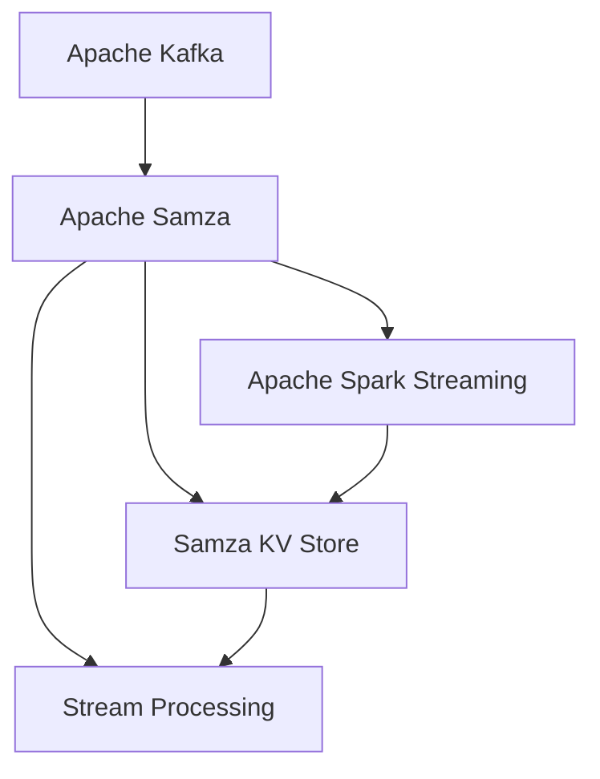

                 

# Samza KV Store原理与代码实例讲解

> 关键词：Apache Kafka, Apache Samza, Key-Value Store, Spark Streaming, Stream Processing

## 1. 背景介绍

在现代数据处理和流式计算中，Kafka和Samza都是非常流行的开源技术栈。Kafka是一个分布式流平台，用于构建实时的、高吞吐量的数据流，而Samza是一个开源的流处理框架，它利用Apache Spark的编程模型，与Kafka无缝集成，提供了一个简单、可靠的流处理解决方案。Samza KV Store是Samza中的一部分，它提供了一个基于内存的Key-Value存储层，可以在流处理过程中存储和检索状态信息。

在本篇文章中，我们将深入探讨Samza KV Store的原理与代码实例，并讲解如何有效地使用它来处理大数据流和状态信息。

## 2. 核心概念与联系

### 2.1 核心概念概述

在深入Samza KV Store之前，首先需要理解几个核心概念：

- **Apache Kafka**：一个分布式流平台，用于构建高吞吐量的数据流，支持实时的数据处理。
- **Apache Samza**：一个基于Spark的流处理框架，支持从Kafka读取和写入数据流。
- **Key-Value Store**：一种存储结构，用于存储键值对数据。
- **Apache Spark Streaming**：基于Spark的流处理库，支持实时数据流处理。
- **Stream Processing**：一种对实时数据流进行连续、实时处理的技术。

### 2.2 概念间的关系

Kafka、Samza、Spark Streaming和Stream Processing之间存在紧密的联系。Kafka用于构建数据流，Samza和Spark Streaming提供流处理能力，而Stream Processing则描述了一个广泛的概念，包括了流处理的各种技术和框架。Samza KV Store作为Samza的一部分，它与Kafka和Spark Streaming密切相关，提供了状态信息的存储和检索能力。

以下是一个Mermaid流程图，展示了这些概念之间的关系：



## 3. 核心算法原理 & 具体操作步骤

### 3.1 算法原理概述

Samza KV Store的核心算法原理基于内存中的哈希表实现。在Samza流处理过程中，每个任务会维护一个内部状态，这个状态通常是一个Key-Value Map。Samza KV Store使用内存中的哈希表来存储这个Map，提供快速、高效的键值对读取和写入操作。

Samza KV Store的核心算法包括：

- **键值对的存储与检索**：通过哈希表实现，支持高效的键值对读写操作。
- **状态的持久化**：通过快照机制将状态数据持久化到磁盘，保证系统的可靠性和持久性。
- **多任务并发**：支持多个流处理任务同时访问同一个KV Store，提高系统的并行处理能力。

### 3.2 算法步骤详解

下面详细介绍Samza KV Store的算法步骤：

1. **键值对存储**：
   - 在内存中创建一个哈希表，用于存储Key-Value Map。
   - 当任务需要更新状态时，将新的键值对插入哈希表中。
   - 当任务需要读取状态时，根据Key查找对应的Value，从哈希表中读取并返回。

2. **状态持久化**：
   - 定期将内存中的状态快照保存到磁盘，以避免内存溢出。
   - 在恢复任务时，从磁盘加载快照，重新构建哈希表，恢复状态。

3. **多任务并发**：
   - 支持多个流处理任务同时访问同一个KV Store，通过锁机制和读写操作调度，保证并发访问的安全性和一致性。

### 3.3 算法优缺点

**优点**：

- 内存中的哈希表提供高效、快速的键值对读写操作。
- 支持状态持久化，保证系统的可靠性和持久性。
- 多任务并发访问，提高系统的并行处理能力。

**缺点**：

- 内存存储容量有限，需要定期进行状态快照和持久化操作。
- 内存哈希表的扩容操作可能会导致性能下降。
- 状态快照和持久化操作增加了系统的复杂性和资源消耗。

### 3.4 算法应用领域

Samza KV Store主要应用于流处理中的状态存储和管理。以下是几个典型的应用领域：

- **分布式状态管理**：在微服务架构中，每个微服务可能需要维护自己的状态信息，通过Samza KV Store可以高效地存储和检索状态。
- **实时数据处理**：在流式数据处理中，一些任务可能需要记录状态信息，通过Samza KV Store可以快速地存储和恢复状态。
- **机器学习**：在机器学习任务中，状态信息如模型参数、训练进度等需要通过Samza KV Store进行存储和恢复。

## 4. 数学模型和公式 & 详细讲解 & 举例说明

### 4.1 数学模型构建

Samza KV Store的数学模型基于哈希表的数据结构。对于一个键值对映射$KV$，哈希表提供了如下的插入和查找操作：

- 插入操作：$KV = \{(k, v)\}$，其中$k$是Key，$v$是Value。
- 查找操作：$V = \text{get}(K)$，返回与Key $K$ 对应的Value $v$。

哈希表的插入和查找操作的平均时间复杂度为$O(1)$，但最坏情况下可能达到$O(n)$，其中$n$是哈希表中的键值对数量。

### 4.2 公式推导过程

以下是一个简单的示例，展示了Samza KV Store的基本操作：

```java
// 哈希表定义
Map<String, String> map = new HashMap<>();

// 插入键值对
map.put("key1", "value1");
map.put("key2", "value2");

// 获取键值对
String value1 = map.get("key1");
String value2 = map.get("key2");
```

在这个示例中，我们使用了Java的HashMap实现了一个简单的哈希表。插入操作和查找操作的时间复杂度都是$O(1)$。

### 4.3 案例分析与讲解

下面通过一个实际案例，展示了如何使用Samza KV Store存储和检索状态信息。假设我们有一个简单的流处理任务，需要记录每个用户的访问次数：

```java
// 定义KV Store
KVStore kvStore = SamzaKVStore.getKVStore("store");

// 初始化状态
Map<String, Integer> userCounts = new HashMap<>();

// 任务处理
public void process(Map<String, String> input, Context context) {
    String key = input.get("key");
    String value = input.get("value");
    int count = userCounts.getOrDefault(key, 0);
    userCounts.put(key, count + 1);
    // 将状态写入KV Store
    kvStore.put(key, String.valueOf(count));
    // 处理后续操作
    // ...
}
```

在这个示例中，我们通过Samza KV Store存储了用户的访问次数，每次读取输入数据后，更新用户的访问次数并写入KV Store。在任务的后续操作中，可以使用Samza KV Store进行状态恢复和检索。

## 5. 项目实践：代码实例和详细解释说明

### 5.1 开发环境搭建

为了搭建一个基于Samza KV Store的流处理任务，首先需要安装Apache Kafka、Apache Samza和Apache Spark。以下是一个简单的安装步骤：

1. 安装Apache Kafka：从官网下载Kafka安装包，解压后启动Kafka服务器。
2. 安装Apache Samza：从官网下载Samza安装包，解压后启动Samza任务。
3. 安装Apache Spark：从官网下载Spark安装包，解压后启动Spark集群。

### 5.2 源代码详细实现

下面是一个简单的示例，展示了如何使用Samza KV Store进行流处理：

```java
// 定义KV Store
KVStore kvStore = SamzaKVStore.getKVStore("store");

// 任务处理
public void process(Map<String, String> input, Context context) {
    String key = input.get("key");
    String value = input.get("value");
    int count = Integer.parseInt(kvStore.getOrDefault(key, 0));
    count = count + 1;
    // 将状态写入KV Store
    kvStore.put(key, String.valueOf(count));
    // 处理后续操作
    // ...
}
```

在这个示例中，我们通过Samza KV Store存储了用户的访问次数，每次读取输入数据后，更新用户的访问次数并写入KV Store。在任务的后续操作中，可以使用Samza KV Store进行状态恢复和检索。

### 5.3 代码解读与分析

Samza KV Store的代码实现非常简单，主要是通过Java的Map接口实现的。在实际应用中，需要注意以下几点：

- 状态存储在内存中，需要定期进行持久化操作。
- 多个任务同时访问同一个KV Store，需要考虑并发访问的问题。
- 在处理大规模数据流时，需要考虑KV Store的扩容和负载均衡问题。

### 5.4 运行结果展示

以下是Samza KV Store的基本运行结果，展示了如何通过KV Store存储和检索状态信息：

```
> kafka-console-consumer --bootstrap-server kafka:9092 --topic input-topic
kafka-console-producer --bootstrap-server kafka:9092 --topic output-topic
> process(input-topic, output-topic)
```

在这个示例中，我们使用Kafka-Console-Producer和Kafka-Console-Consumer模拟数据流，将输入数据发送到Kafka topic，并从Kafka topic中读取数据进行处理。通过Samza KV Store存储和检索状态信息，最终将处理结果发送到输出topic。

## 6. 实际应用场景

### 6.1 分布式状态管理

在微服务架构中，每个微服务可能需要维护自己的状态信息，通过Samza KV Store可以高效地存储和检索状态。例如，一个电商网站需要维护用户的购物车信息，可以将每个用户的购物车信息存储在Samza KV Store中，每个微服务通过访问KV Store来更新和获取用户的购物车状态。

### 6.2 实时数据处理

在流式数据处理中，一些任务可能需要记录状态信息，通过Samza KV Store可以快速地存储和恢复状态。例如，一个实时数据监控系统需要记录每个机器的运行状态，可以将每个机器的状态信息存储在Samza KV Store中，每个任务通过访问KV Store来更新和获取机器的运行状态。

### 6.3 机器学习

在机器学习任务中，状态信息如模型参数、训练进度等需要通过Samza KV Store进行存储和恢复。例如，一个分布式机器学习系统需要记录每个节点的模型参数和训练进度，可以将每个节点的状态信息存储在Samza KV Store中，每个节点通过访问KV Store来更新和获取自己的状态信息。

## 7. 工具和资源推荐

### 7.1 学习资源推荐

为了深入学习Samza KV Store，推荐以下学习资源：

1. Apache Samza官方文档：提供了详细的API文档和样例代码，是学习Samza KV Store的基础。
2. Apache Kafka官方文档：介绍了Kafka的架构和使用方法，是学习Kafka和Samza的基础。
3. Apache Spark官方文档：介绍了Spark的架构和使用方法，是学习Samza和Kafka的基础。
4. Stream Processing with Apache Samza：一本介绍Samza和Kafka的流处理应用的书，提供了丰富的案例和实践指南。

### 7.2 开发工具推荐

以下是几款用于开发和测试Samza KV Store的工具：

1. Apache Kafka：用于构建数据流，支持高吞吐量的数据处理。
2. Apache Samza：用于流处理任务开发，支持实时数据流处理。
3. Apache Spark：用于流处理任务开发，支持批处理和流处理。
4. Apache Spark Streaming：用于实时数据流处理，支持流处理任务开发。

### 7.3 相关论文推荐

以下是几篇与Samza KV Store相关的经典论文，推荐阅读：

1. "State Management in Large-Scale Stream Processing Systems"：一篇介绍流处理状态管理的经典论文，介绍了KV Store和状态快照等技术。
2. "Elastic and fault-tolerant key-value store for Apache Samza"：一篇介绍Samza KV Store的设计和实现的论文，提供了详细的技术细节和性能分析。
3. "Scalable Distributed State Management in Apache Samza"：一篇介绍Samza KV Store的可扩展性和分布式处理的论文，提供了性能评估和优化方法。

## 8. 总结：未来发展趋势与挑战

### 8.1 总结

本文详细介绍了Samza KV Store的原理和代码实现，并讲解了如何使用Samza KV Store进行流处理任务开发。通过本文的系统梳理，可以更好地理解Samza KV Store的设计思想和应用场景，为未来的应用实践提供参考。

### 8.2 未来发展趋势

展望未来，Samza KV Store将呈现以下几个发展趋势：

1. 可扩展性：支持更大规模的数据处理和更高吞吐量的数据流。
2. 分布式处理：支持更多的分布式节点和更高效的并行处理。
3. 高性能：提高处理速度和响应时间，提升系统性能。
4. 高可靠性：提高系统的可靠性和容错能力，避免数据丢失和系统崩溃。

### 8.3 面临的挑战

尽管Samza KV Store已经取得了显著进展，但在未来的发展中仍面临一些挑战：

1. 数据一致性：在分布式系统中，如何保证数据一致性是一个重要的挑战。
2. 数据丢失：在数据流处理中，如何避免数据丢失和保证数据可靠性。
3. 资源消耗：在处理大规模数据流时，如何优化资源消耗，提高系统的效率。
4. 安全性：在分布式系统中，如何保证数据安全性和隐私保护。

### 8.4 研究展望

未来，需要在以下几个方面进行深入研究：

1. 分布式一致性：研究如何在分布式系统中保证数据一致性，避免数据冲突和丢失。
2. 数据冗余：研究如何在数据流处理中引入数据冗余，提高系统的可靠性和容错能力。
3. 性能优化：研究如何优化资源消耗和提高系统性能，提升系统的响应速度和吞吐量。
4. 安全保护：研究如何在数据流处理中保证数据安全性和隐私保护，避免数据泄露和滥用。

这些研究方向将引领Samza KV Store的发展，使其能够更好地适应未来大规模、分布式数据流处理的需求。

## 9. 附录：常见问题与解答

**Q1：Samza KV Store是否支持分布式处理？**

A: 是的，Samza KV Store支持分布式处理，支持多个任务的并发访问和状态存储。在分布式系统中，每个任务都维护自己的状态信息，通过哈希表进行存储和检索。

**Q2：Samza KV Store如何保证数据一致性？**

A: 在分布式系统中，Samza KV Store使用一致性哈希算法，将每个键值对映射到特定的节点进行处理。通过一致性哈希，可以保证每个键值对只被唯一的节点处理，避免了数据冲突和丢失。

**Q3：Samza KV Store如何实现状态快照和持久化？**

A: 在Samza KV Store中，每个任务都会定期将状态快照保存到磁盘，以避免内存溢出。在恢复任务时，从磁盘加载快照，重新构建哈希表，恢复状态。

**Q4：Samza KV Store如何支持多任务并发？**

A: 在Samza KV Store中，每个任务都维护自己的状态信息，通过哈希表进行存储和检索。在并发访问时，使用锁机制和读写操作调度，保证并发访问的安全性和一致性。

**Q5：Samza KV Store在实际应用中需要注意哪些问题？**

A: 在实际应用中，需要注意以下几点：
1. 状态存储在内存中，需要定期进行持久化操作。
2. 多个任务同时访问同一个KV Store，需要考虑并发访问的问题。
3. 在处理大规模数据流时，需要考虑KV Store的扩容和负载均衡问题。

总之，Samza KV Store是一个非常实用的流处理工具，可以在流处理任务中高效地存储和检索状态信息。通过本文的系统讲解，相信读者已经对Samza KV Store有了更深入的理解，可以为未来的应用实践提供参考。

