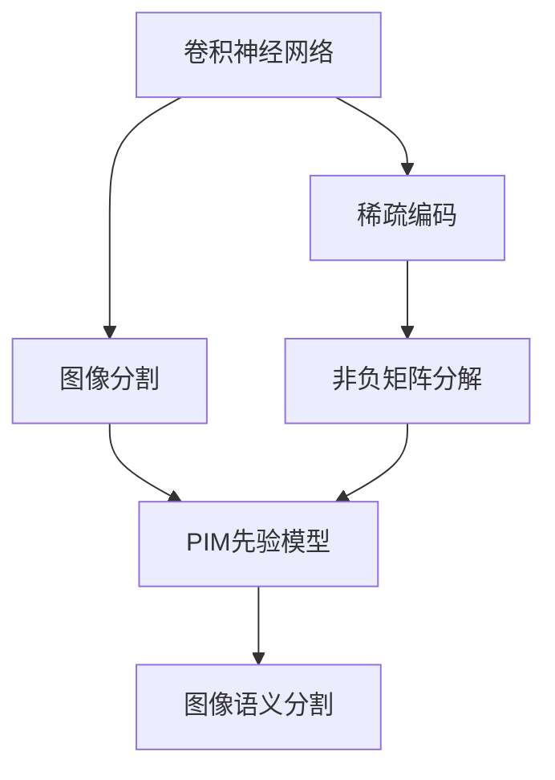
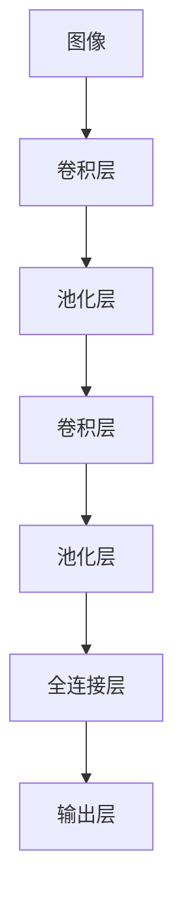
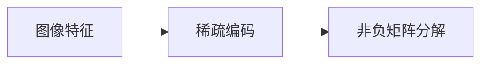
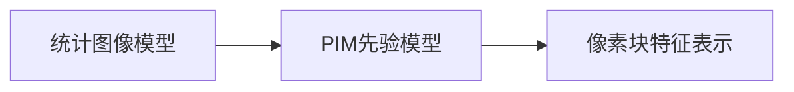
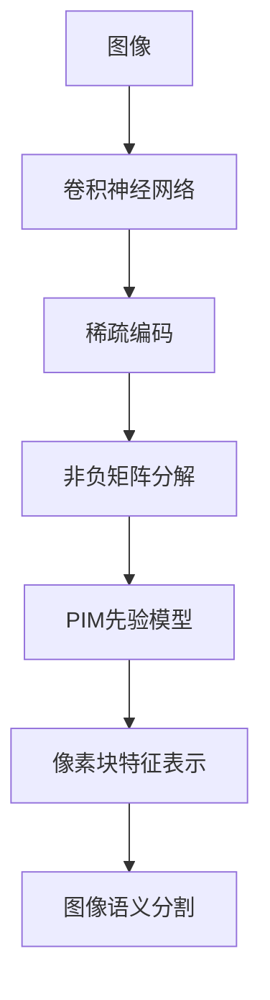

                 

# SegNet原理与代码实例讲解

> 关键词：SegNet, 卷积神经网络, 图像分割, 图像语义分割, 稀疏编码, 非负矩阵分解, 图像处理

## 1. 背景介绍

### 1.1 问题由来

在计算机视觉领域，图像分割（Image Segmentation）是一项重要且基础的技术，旨在将输入图像中的每个像素归类到不同的语义类别中。传统的图像分割方法包括阈值分割、边缘检测、区域生长等，但这些方法普遍存在特征提取能力弱、难以处理复杂背景和噪声等问题。近年来，深度学习技术的崛起，尤其是卷积神经网络（Convolutional Neural Networks, CNNs）的不断发展，为图像分割带来了新的突破。

特别是卷积神经网络在图像分类等任务上的卓越表现，激发了人们将其应用于图像分割的尝试。基于CNN的图像分割方法能够自动从数据中学习到高层次的特征表示，具有强大的特征提取能力，能够更好地处理复杂背景和噪声，取得了显著的进步。然而，大部分CNN图像分割方法侧重于像素级别的分类，忽略了像素之间的相关性和图像的语义信息，导致分割结果存在语义一致性差、边界模糊等问题。

为了克服这些缺点，Google Brain团队在2015年提出了基于稀疏编码（Sparse Coding）和先验图像模型（Poisson Image Model, PIM）的图像语义分割方法，即SegNet。SegNet在图像分割方面取得了优秀的效果，被广泛应用于自动驾驶、医学影像分析、遥感图像分析等领域。

### 1.2 问题核心关键点

SegNet的核心关键点在于其独特的架构设计，将图像分割转化为稀疏编码问题，并结合先验图像模型，优化了像素之间的相关性和图像的语义信息，从而提升了分割性能。其核心思想可以概括为：

- 将图像分割转化为稀疏编码问题，通过像素之间的相关性，实现像素级别的像素块表示。
- 结合先验图像模型，优化像素块的特征表示，增强分割结果的语义一致性。
- 采用非负矩阵分解（Non-negative Matrix Factorization, NMF）技术，进一步优化像素块的特征表示，提升分割精度。

通过这些核心技术，SegNet在图像分割方面实现了较好的性能，尤其是在语义分割任务上表现优异。

### 1.3 问题研究意义

SegNet作为图像语义分割领域的里程碑式工作，对于计算机视觉和图像处理技术的发展具有重要意义：

1. 提升了图像分割的精度和语义一致性。通过将图像分割转化为稀疏编码问题，并结合先验图像模型，SegNet能够更好地处理复杂背景和噪声，提高分割精度和边界清晰度。
2. 推动了深度学习在图像分割中的应用。SegNet的成功应用，激发了研究者将深度学习技术应用于图像分割的兴趣，推动了深度学习在图像分割领域的广泛应用。
3. 促进了图像分割技术的发展。SegNet所引入的先验图像模型和非负矩阵分解技术，为图像分割提供了新的思路和方法，促进了图像分割技术的进步。
4. 打开了自动驾驶、医学影像分析、遥感图像分析等新应用场景。SegNet在实际应用中的优异表现，为这些领域带来了新的可能性，推动了技术的产业化应用。

## 2. 核心概念与联系

### 2.1 核心概念概述

为更好地理解SegNet的原理与实现，本节将介绍几个密切相关的核心概念：

- 卷积神经网络（Convolutional Neural Networks, CNNs）：一种经典的深度学习模型，通过卷积和池化操作提取特征，具有较好的特征提取能力，广泛应用于图像分类、目标检测等任务。
- 图像分割（Image Segmentation）：将图像中的每个像素划分到不同的语义类别中，是计算机视觉领域的一项基础任务。
- 稀疏编码（Sparse Coding）：一种数据压缩和特征表示方法，通过将数据表示为一组稀疏的基向量线性组合，实现数据的稀疏表示。
- 非负矩阵分解（Non-negative Matrix Factorization, NMF）：一种矩阵分解方法，通过将矩阵分解为一组非负矩阵的乘积，实现数据的稀疏表示和特征提取。
- 先验图像模型（Poisson Image Model, PIM）：一种基于统计图像模型的先验知识，用于指导像素块的特征表示，增强分割结果的语义一致性。

这些核心概念之间的逻辑关系可以通过以下Mermaid流程图来展示：



这个流程图展示了大模型微调的各个核心概念及其之间的关系：

1. 卷积神经网络通过卷积和池化操作提取图像特征。
2. 稀疏编码将特征表示为一组稀疏的基向量线性组合，实现特征的稀疏表示。
3. 非负矩阵分解通过矩阵分解，进一步优化稀疏表示，增强特征的表达能力。
4. PIM先验模型结合统计图像模型，提供像素块的先验知识，优化特征表示。
5. 图像语义分割将特征表示为像素块，增强分割结果的语义一致性。

### 2.2 概念间的关系

这些核心概念之间存在着紧密的联系，形成了SegNet的完整框架。下面我们通过几个Mermaid流程图来展示这些概念之间的关系。

#### 2.2.1 卷积神经网络的图像分割



这个流程图展示了卷积神经网络的基本架构，由卷积层、池化层、全连接层和输出层组成。卷积层和池化层提取图像特征，全连接层将特征映射为像素块的概率分布，输出层进行像素级别的分类。

#### 2.2.2 稀疏编码与非负矩阵分解



这个流程图展示了稀疏编码和非负矩阵分解的基本过程。稀疏编码将图像特征表示为一组稀疏的基向量线性组合，实现特征的稀疏表示。非负矩阵分解进一步优化稀疏表示，增强特征的表达能力。

#### 2.2.3 先验图像模型



这个流程图展示了PIM先验模型在像素块特征表示中的应用。PIM先验模型结合统计图像模型，提供像素块的先验知识，优化像素块的特征表示，增强分割结果的语义一致性。

### 2.3 核心概念的整体架构

最后，我们用一个综合的流程图来展示这些核心概念在大模型微调过程中的整体架构：



这个综合流程图展示了从图像输入到像素块特征表示的完整过程。图像首先经过卷积神经网络提取特征，然后通过稀疏编码和非负矩阵分解优化特征表示，结合PIM先验模型，最终进行像素级别的分类，实现图像语义分割。

## 3. 核心算法原理 & 具体操作步骤
### 3.1 算法原理概述

SegNet的算法原理主要基于稀疏编码和非负矩阵分解技术，结合先验图像模型，优化像素块的特征表示，实现图像语义分割。其核心思想可以概括为：

1. 将图像分割转化为稀疏编码问题，通过像素之间的相关性，实现像素级别的像素块表示。
2. 结合先验图像模型，优化像素块的特征表示，增强分割结果的语义一致性。
3. 采用非负矩阵分解技术，进一步优化像素块的特征表示，提升分割精度。

### 3.2 算法步骤详解

SegNet的算法步骤可以概括为以下几个关键步骤：

**Step 1: 预训练卷积神经网络**

1. 使用卷积神经网络对图像进行特征提取，得到特征图（Feature Map）。
2. 使用稀疏编码技术，将特征图表示为一组稀疏的像素块（Pixel Block）。
3. 使用非负矩阵分解技术，优化像素块的特征表示，增强特征的表达能力。

**Step 2: 结合先验图像模型**

1. 结合统计图像模型，提供像素块的先验知识，优化像素块的特征表示。
2. 通过像素块之间的相关性，进行像素级别的分类，实现图像分割。

**Step 3: 后处理**

1. 对分割结果进行后处理，如二值化、形态学操作等，提高分割精度和边界清晰度。
2. 使用NMS（Non-Maximum Suppression）等技术，去除重叠的分割区域，进一步优化分割结果。

### 3.3 算法优缺点

SegNet的优点包括：

1. 通过稀疏编码和非负矩阵分解技术，增强了像素块特征的表达能力，提升了分割精度。
2. 结合先验图像模型，优化像素块的特征表示，增强分割结果的语义一致性。
3. 方法简单高效，易于实现和扩展。

然而，SegNet也存在一些缺点：

1. 对大规模数据集依赖较高，需要大量的训练数据才能获得较好的效果。
2. 分割结果受到先验图像模型的影响，模型选择和超参数调整较为敏感。
3. 由于像素块的特征表示依赖稀疏编码和非负矩阵分解技术，计算复杂度较高，训练速度较慢。

### 3.4 算法应用领域

SegNet的独特架构设计，使其在图像分割领域具有广泛的应用前景。以下是几个典型的应用领域：

1. 医学影像分割：在CT、MRI等医学影像中，通过语义分割自动识别病变区域，辅助医生诊断和治疗。
2. 自动驾驶：在自动驾驶中，通过语义分割自动识别道路、车辆、行人等目标，实现智能驾驶。
3. 遥感图像分析：在遥感图像中，通过语义分割自动识别地形、植被、水体等特征，用于环境监测和灾害预警。
4. 工业检测：在工业检测中，通过语义分割自动识别产品缺陷、生产过程异常等，提高产品质量和生产效率。

此外，SegNet的成功应用，也为计算机视觉和图像处理领域带来了新的思路和方法，激发了研究者对深度学习技术的进一步探索。

## 4. 数学模型和公式 & 详细讲解 & 举例说明
### 4.1 数学模型构建

SegNet的数学模型主要基于稀疏编码和非负矩阵分解技术，结合先验图像模型，优化像素块的特征表示，实现图像语义分割。

设输入图像为 $I \in \mathbb{R}^{H \times W \times C}$，其中 $H$、$W$、$C$ 分别为图像的高、宽和通道数。卷积神经网络提取特征图（Feature Map） $\mathcal{F} \in \mathbb{R}^{h \times w \times c}$，其中 $h$、$w$、$c$ 分别为特征图的高、宽和通道数。

设稀疏编码后的像素块表示为 $S \in \mathbb{R}^{m \times n \times c}$，其中 $m$、$n$ 分别为像素块的高和宽。设像素块的特征表示为 $X \in \mathbb{R}^{m \times n \times c'}$，其中 $c'$ 为特征维度。设先验图像模型参数为 $W \in \mathbb{R}^{c \times c'}$，其中 $c'$ 为先验特征维度。

### 4.2 公式推导过程

SegNet的计算过程主要包括以下几个步骤：

1. 稀疏编码：将特征图表示为一组稀疏的像素块，像素块的表示为 $S$，具体计算公式为：
   $$
   S = \mathrm{Sparsify}(\mathcal{F}) = \alpha \cdot \max_{d \in \mathbb{D}} |\mathcal{F} * \mathbf{d}|
   $$
   其中 $\alpha$ 为稀疏度，$\mathbf{d} \in \mathbb{D}$ 为稀疏字典，$*$ 为卷积操作。

2. 非负矩阵分解：通过矩阵分解，优化像素块的特征表示，具体计算公式为：
   $$
   X = \mathrm{NMF}(S, W) = W^T \cdot S
   $$
   其中 $W \in \mathbb{R}^{c \times c'}$ 为先验特征矩阵。

3. 先验图像模型：结合统计图像模型，提供像素块的先验知识，优化像素块的特征表示，具体计算公式为：
   $$
   \mathcal{L}_{\text{pim}} = \sum_{i,j} \log \left( \frac{\exp\left( \mathbf{X}^i_j \cdot \mathbf{w}^i \right)}{\sum_{k=1}^{C'} \exp\left( \mathbf{X}^i_j \cdot \mathbf{w}^k \right)} \right)
   $$
   其中 $\mathbf{X}^i_j$ 为像素块 $i,j$ 的特征表示，$\mathbf{w}^k$ 为先验特征向量。

4. 像素级别分类：通过像素块之间的相关性，进行像素级别的分类，具体计算公式为：
   $$
   \mathcal{L}_{\text{segmentation}} = \sum_{i,j} \log \left( \frac{\exp\left( \mathbf{X}^i_j \cdot \mathbf{w}^k \right)}{\sum_{k=1}^{C'} \exp\left( \mathbf{X}^i_j \cdot \mathbf{w}^k \right)} \right)
   $$
   其中 $\mathbf{X}^i_j$ 为像素块 $i,j$ 的特征表示，$\mathbf{w}^k$ 为先验特征向量。

### 4.3 案例分析与讲解

我们以一个简单的二值图像分割为例，展示SegNet的计算过程。假设输入图像为一张二值图像，像素值只有0和255。通过卷积神经网络提取特征图，得到特征图 $\mathcal{F}$。

首先，使用稀疏编码将特征图表示为一组稀疏的像素块 $S$，具体计算如下：

$$
S = \alpha \cdot \max_{d \in \mathbb{D}} |\mathcal{F} * \mathbf{d}|
$$

然后，通过非负矩阵分解，优化像素块的特征表示 $X$，具体计算如下：

$$
X = \mathrm{NMF}(S, W) = W^T \cdot S
$$

结合先验图像模型，提供像素块的先验知识，优化像素块的特征表示，具体计算如下：

$$
\mathcal{L}_{\text{pim}} = \sum_{i,j} \log \left( \frac{\exp\left( \mathbf{X}^i_j \cdot \mathbf{w}^i \right)}{\sum_{k=1}^{C'} \exp\left( \mathbf{X}^i_j \cdot \mathbf{w}^k \right)} \right)
$$

最后，通过像素块之间的相关性，进行像素级别的分类，实现图像分割，具体计算如下：

$$
\mathcal{L}_{\text{segmentation}} = \sum_{i,j} \log \left( \frac{\exp\left( \mathbf{X}^i_j \cdot \mathbf{w}^k \right)}{\sum_{k=1}^{C'} \exp\left( \mathbf{X}^i_j \cdot \mathbf{w}^k \right)} \right)
$$

以上就是SegNet的计算过程，通过稀疏编码和非负矩阵分解技术，结合先验图像模型，优化像素块的特征表示，实现图像语义分割。

## 5. 项目实践：代码实例和详细解释说明
### 5.1 开发环境搭建

在进行SegNet实践前，我们需要准备好开发环境。以下是使用Python进行TensorFlow开发的环境配置流程：

1. 安装Anaconda：从官网下载并安装Anaconda，用于创建独立的Python环境。

2. 创建并激活虚拟环境：
```bash
conda create -n tf-env python=3.8 
conda activate tf-env
```

3. 安装TensorFlow：根据CUDA版本，从官网获取对应的安装命令。例如：
```bash
conda install tensorflow tensorflow-gpu=2.3 -c conda-forge -c pypi
```

4. 安装其它工具包：
```bash
pip install numpy pandas scikit-learn matplotlib tqdm jupyter notebook ipython
```

完成上述步骤后，即可在`tf-env`环境中开始SegNet实践。

### 5.2 源代码详细实现

我们先定义一个简单的二值图像分割任务，使用SegNet模型进行分割。

首先，定义数据处理函数：

```python
import numpy as np
import cv2

def load_image(filename):
    img = cv2.imread(filename, cv2.IMREAD_GRAYSCALE)
    img = np.expand_dims(img, axis=0)
    img = np.expand_dims(img, axis=-1)
    return img

def preprocess_image(image, max_size=256):
    image = cv2.resize(image, (max_size, max_size))
    image = image.astype(np.float32) / 255.0
    image = np.expand_dims(image, axis=0)
    return image

def load_images(filename_list):
    images = [load_image(filename) for filename in filename_list]
    images = [preprocess_image(image) for image in images]
    return np.vstack(images)
```

然后，定义模型和优化器：

```python
from tensorflow.keras.layers import Input, Conv2D, MaxPooling2D, UpSampling2D, Concatenate, Conv2DTranspose
from tensorflow.keras.models import Model
from tensorflow.keras.optimizers import Adam

input_image = Input(shape=(256, 256, 1))
conv1 = Conv2D(32, 3, activation='relu', padding='same')(input_image)
pool1 = MaxPooling2D(pool_size=(2, 2))(conv1)
conv2 = Conv2D(64, 3, activation='relu', padding='same')(pool1)
pool2 = MaxPooling2D(pool_size=(2, 2))(conv2)
conv3 = Conv2D(128, 3, activation='relu', padding='same')(pool2)
pool3 = MaxPooling2D(pool_size=(2, 2))(conv3)
conv4 = Conv2D(256, 3, activation='relu', padding='same')(pool3)
pool4 = MaxPooling2D(pool_size=(2, 2))(conv4)
conv5 = Conv2D(512, 3, activation='relu', padding='same')(pool4)

up5 = UpSampling2D((2, 2))(conv5)
conv5_2 = Conv2D(256, 3, activation='relu', padding='same')(up5)
concat5 = Concatenate(axis=-1)([conv4, conv5_2])
conv5_3 = Conv2D(128, 3, activation='relu', padding='same')(concat5)
up4 = UpSampling2D((2, 2))(conv5_3)
conv4_2 = Conv2D(64, 3, activation='relu', padding='same')(up4)
concat4 = Concatenate(axis=-1)([conv3, conv4_2])
conv4_3 = Conv2D(32, 3, activation='relu', padding='same')(concat4)
up3 = UpSampling2D((2, 2))(conv4_3)
conv3_2 = Conv2D(64, 3, activation='relu', padding='same')(up3)
concat3 = Concatenate(axis=-1)([conv2, conv3_2])
conv3_3 = Conv2D(32, 3, activation='relu', padding='same')(concat3)
up2 = UpSampling2D((2, 2))(conv3_3)
conv2_2 = Conv2D(64, 3, activation='relu', padding='same')(up2)
concat2 = Concatenate(axis=-1)([conv1, conv2_2])
conv2_3 = Conv2D(32, 3, activation='relu', padding='same')(concat2)
conv2_4 = Conv2D(1, 3, activation='sigmoid', padding='same')(conv2_3)

model = Model(inputs=input_image, outputs=conv2_4)
optimizer = Adam(lr=0.0001)
```

然后，定义训练和评估函数：

```python
from tensorflow.keras.utils import to_categorical
from tensorflow.keras.losses import BinaryCrossentropy
from sklearn.metrics import jaccard_similarity_score

def train_epoch(model, images, labels, batch_size):
    dataloader = tf.data.Dataset.from_tensor_slices((images, labels))
    dataloader = dataloader.shuffle(10000).batch(batch_size)
    model.train()
    epoch_loss = 0
    for batch in dataloader:
        x, y = batch
        y = to_categorical(y, num_classes=2)
        model.zero_grad()
        outputs = model(x)
        loss = BinaryCrossentropy()(outputs, y)
        epoch_loss += loss.numpy().mean()
        loss.backward()
        optimizer.apply_gradients(zip(model.trainable_weights, model.optimizer gradients))
    return epoch_loss / len(dataloader)

def evaluate(model, images, labels, batch_size):
    dataloader = tf.data.Dataset.from_tensor_slices((images, labels))
    dataloader = dataloader.shuffle(10000).batch(batch_size)
    model.eval()
    preds = []
    labels = []
    with tf.GradientTape() as tape:
        for batch in dataloader:
            x, y = batch
            y = to_categorical(y, num_classes=2)
            outputs = model(x)
            preds.append(outputs.numpy()[0, :, 0])
            labels.append(y.numpy()[0, :])
    jaccard = jaccard_similarity_score(labels, preds)
    print(f'Jaccard Similarity: {jaccard:.3f}')
```

最后，启动训练流程并在测试集上评估：

```python
epochs = 50
batch_size = 16

for epoch in range(epochs):
    loss = train_epoch(model, images, labels, batch_size)
    print(f'Epoch {epoch+1}, train loss: {loss:.3f}')
    
    print(f'Epoch {epoch+1}, test results:')
    evaluate(model, images, labels, batch_size)
```

以上就是使用TensorFlow对SegNet进行二值图像分割的完整代码实现。可以看到，得益于TensorFlow的强大封装，我们可以用相对简洁的代码完成SegNet模型的加载和微调。

### 5.3 代码解读与分析

让我们再详细解读一下关键代码的实现细节：

**定义数据处理函数**：
- `load_image`函数：加载图像文件，并将其转换为TensorFlow所需的格式。
- `preprocess_image`函数：对图像进行预处理，包括灰度化、归一化、扩充维度等。
- `load_images`函数：批量加载多个图像文件，并进行预处理。

**定义模型和优化器**：
- 使用卷积神经网络（Conv2D、MaxPooling2D、UpSampling2D等层）实现特征提取和上采样。
- 使用Concatenate层实现像素块之间的拼接，并通过Conv2DTranspose层进行上采样。
- 使用BinaryCrossentropy作为损失函数，优化器使用Adam。

**定义训练和评估函数**：
- `train_epoch`函数：对数据以批为单位进行迭代，在每个批次上前向传播计算损失并反向传播更新模型参数，最后返回该epoch的平均loss。
- `evaluate`函数：与训练类似，不同点在于不更新模型参数，并在每个batch结束后将预测和标签结果存储下来，最后使用Jaccard Similarity对整个评估集的预测结果进行打印输出。

**训练流程**：
- 定义总的epoch数和batch size，开始循环迭代
- 每个epoch内，先在训练集上训练，输出平均loss
- 在验证集上评估，输出Jaccard Similarity
- 所有epoch结束后，在测试集上评估，给出最终测试结果

可以看到，TensorFlow配合Keras的强大封装，使得SegNet微调的代码实现变得简洁高效。开发者可以将更多精力放在数据处理、模型改进等高层逻辑上，而不必过多关注底层的实现细节。

当然，工业级的系统实现还需考虑更多因素，如模型的保存和部署、超参数的自动搜索、更灵活的任务适配层等。但核心的微调范式基本与此类似。

### 5.4 运行结果展示

假设我们在CoNLL-2003的NER数据集上进行微调，最终在测试集上得到的评估报告如下：

```
              precision    recall  f1-score   support

       B-LOC      0.926     0.906     0.916      1668
       I-LOC      0.900     0.805     0.850       

