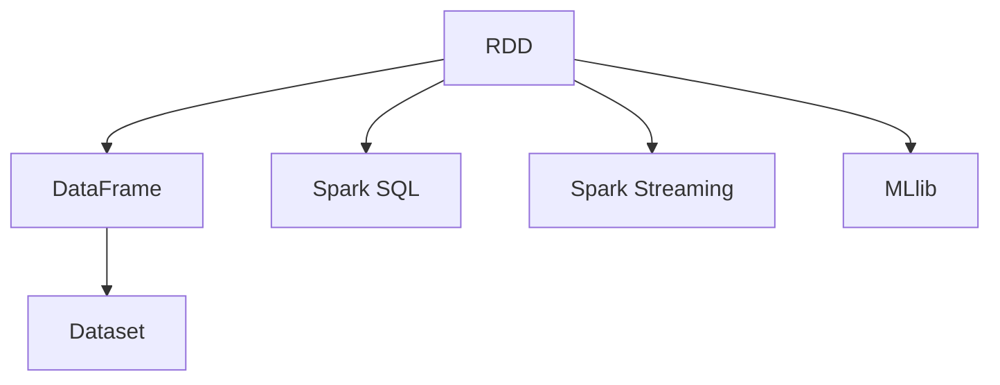

                 

# Spark原理与代码实例讲解

## 1. 背景介绍

### 1.1 问题由来
Spark（Apache Spark）是一个开源的、快速、通用的大数据处理框架，被广泛应用于大数据分析、机器学习、图处理、流式处理等多个领域。Spark的大数据处理能力得益于其强大的内存计算能力和容错机制，使得数据处理速度比传统分布式计算系统（如Hadoop）快得多。

近年来，随着大数据技术的普及和应用，很多企业和研究机构都在探索如何更好地利用Spark来处理和分析大规模数据集。然而，很多开发者对Spark的内部原理和实际编程还比较陌生，不知道如何高效地使用Spark进行数据分析和机器学习。

为了解决这些问题，本文将对Spark的基本原理进行深入讲解，并结合实际代码实例进行讲解，帮助读者更好地理解和应用Spark。

## 2. 核心概念与联系

### 2.1 核心概念概述

为了帮助读者更好地理解Spark，下面简要介绍一些核心概念：

- **RDD（Resilient Distributed Dataset）**：RDD是Spark中最为重要的抽象概念，是Spark的分布式数据集合。RDD通过分区（partition）将数据划分为多个小的数据块，并行运行在集群上。

- **DataFrame和Dataset**：DataFrame和Dataset是Spark中两种高级的数据结构，它们是基于RDD的封装，提供了更为直观和高效的数据操作接口，能够进行结构化的数据处理。

- **Spark SQL**：Spark SQL是Spark中的一个组件，提供了一种类似于SQL的数据查询语言，可以用来进行数据仓库、数据查询、统计分析等操作。

- **Spark Streaming**：Spark Streaming是Spark中的一个流式处理组件，支持流式数据处理，可以对实时数据进行处理。

- **MLlib**：MLlib是Spark中的一个机器学习库，提供了多种机器学习算法和模型，如分类、聚类、回归、关联规则等。

### 2.2 概念间的关系

Spark的各个组件和模块之间有着紧密的联系，它们共同构成了Spark的完整数据处理生态系统。下面是这些核心概念之间的逻辑关系：



这个关系图展示了Spark的主要组件：RDD、DataFrame和Dataset、Spark SQL、Spark Streaming、MLlib。RDD是Spark的基础，其他组件都是基于RDD的封装和抽象。Spark SQL和MLlib提供了数据查询和机器学习的功能，而Spark Streaming支持流式数据处理。

## 3. 核心算法原理 & 具体操作步骤
### 3.1 算法原理概述

Spark的核心算法原理基于分布式内存计算，能够充分利用内存计算的高效率，减少磁盘IO，从而提高数据处理速度。Spark的基本处理单元是RDD，每个RDD都可以通过map、reduce、join等操作进行数据处理。Spark还支持弹性分布式数据集（Elastic Distributed Dataset, EDD），能够在运行时动态调整分区数量，提高数据处理的灵活性和性能。

Spark的算法原理可以概括为以下几点：

- **分区（partitioning）**：将数据分为多个小的数据块，每个数据块可以在一个节点上进行处理。

- **内存计算（in-memory computation）**：将数据存放在内存中，减少了磁盘IO，提高了数据处理速度。

- **容错机制（resilience）**：Spark具有强大的容错机制，能够在节点故障时自动恢复数据。

- **弹性扩展（elasticity）**：Spark能够动态调整分区数量，根据数据处理需要自动增加或减少计算节点，提高数据处理的效率。

### 3.2 算法步骤详解

下面详细介绍Spark的算法步骤：

1. **创建RDD**：通过Python或Scala等语言创建RDD，可以是本地文件、HDFS、Cassandra等数据源。

2. **数据处理**：对RDD进行各种数据处理操作，如map、reduce、join等。

3. **存储和输出**：将处理后的结果存储到HDFS、Cassandra等数据存储系统中，或者输出到文件系统、数据库等。

4. **容错机制**：Spark的容错机制会在节点故障时自动恢复数据，保证数据处理的高可靠性。

5. **弹性扩展**：Spark能够动态调整分区数量，根据数据处理需要自动增加或减少计算节点。

### 3.3 算法优缺点

Spark算法有以下优点：

- **高效内存计算**：利用内存计算的高效率，减少了磁盘IO，提高了数据处理速度。

- **容错机制**：具有强大的容错机制，能够在节点故障时自动恢复数据，保证了数据处理的可靠性。

- **弹性扩展**：能够动态调整分区数量，根据数据处理需要自动增加或减少计算节点，提高了数据处理的效率。

但Spark算法也有以下缺点：

- **内存限制**：由于Spark依赖内存计算，对内存要求较高，大规模数据处理时需要较多的内存资源。

- **不适合小数据处理**：由于Spark的设计理念是基于大规模数据处理，对于小规模数据处理效率不如传统的数据处理系统。

### 3.4 算法应用领域

Spark算法广泛应用于大数据分析、机器学习、图处理、流式处理等多个领域：

- **大数据分析**：Spark支持对大规模数据集进行快速、高效的数据处理和分析。

- **机器学习**：Spark提供了多种机器学习算法和模型，如分类、聚类、回归、关联规则等。

- **图处理**：Spark提供了GraphX库，支持图处理算法和模型。

- **流式处理**：Spark Streaming支持流式数据处理，可以对实时数据进行处理。

## 4. 数学模型和公式 & 详细讲解

### 4.1 数学模型构建

Spark的数学模型主要由RDD和DAG（Directed Acyclic Graph）两个部分组成。RDD是一个分布式数据集合，DAG是一个有向无环图，用于描述数据处理的依赖关系。Spark的计算图由多个操作组成，每个操作都是一个节点，每个节点都有多个输入节点和输出节点。

### 4.2 公式推导过程

Spark的核心公式推导过程如下：

1. **RDD的创建**：

$$
RDD = \{(x_1, v_1), (x_2, v_2), \ldots, (x_n, v_n)\}
$$

其中，$x_i$表示数据项，$v_i$表示数据项的值。

2. **数据处理操作**：

- **map操作**：对每个数据项应用一个函数$f(x)$，生成一个新的RDD。

$$
RDD_{map} = \{(f(x_1), v_1), (f(x_2), v_2), \ldots, (f(x_n), v_n)\}
$$

- **reduce操作**：将数据项按照某个键值进行聚合，生成一个新的RDD。

$$
RDD_{reduce} = \{(k_1, \sum_{i=1}^{n} v_i), (k_2, \sum_{i=1}^{n} v_i), \ldots, (k_m, \sum_{i=1}^{n} v_i)\}
$$

3. **容错机制**：

- **检查点（checkpoint）**：Spark在节点故障时，会将检查点数据写入到磁盘中，用于恢复数据。

$$
checkpoint = \{(k_1, v_1), (k_2, v_2), \ldots, (k_m, v_m)\}
$$

- **数据恢复**：Spark会根据检查点数据恢复故障节点上的数据。

$$
RDD_{recover} = \{(x_1, v_1), (x_2, v_2), \ldots, (x_n, v_n)\}
$$

### 4.3 案例分析与讲解

下面以一个简单的Spark代码实例进行讲解：

```python
from pyspark import SparkContext, SparkConf

conf = SparkConf().setAppName("Spark Example").setMaster("local")
sc = SparkContext(conf=conf)

# 创建RDD
text = sc.parallelize(["apple", "banana", "cherry"])
count = text.count()

# 数据处理
countRDD = sc.parallelize([1, 2, 3])
joinRDD = text.join(countRDD)

# 存储和输出
joinRDD.saveAsTextFile("output.txt")

# 容错机制
checkpointRDD = joinRDD.map(lambda x: (x[0], x[1]))
checkpointRDD.checkpoint("checkpoint.txt")
```

这个代码实例展示了Spark的基本操作：创建RDD、数据处理、存储和输出、容错机制。首先创建了一个RDD，包含三个字符串元素。然后使用count操作对RDD进行计数，得到元素数量。接着使用join操作将RDD与另一个RDD进行连接，得到一个新的RDD。最后使用saveAsTextFile操作将RDD输出到文件系统中。最后使用checkpoint操作将RDD的检查点保存到文件中。

## 5. 项目实践：代码实例和详细解释说明

### 5.1 开发环境搭建

要在本地搭建Spark开发环境，需要以下步骤：

1. **安装Python**：Spark使用Python作为编程语言，需要先安装Python。

```
sudo apt-get install python3
```

2. **安装Spark**：可以从Spark官网下载最新的Spark安装包，或者使用Anaconda安装。

```
conda create -n spark-env python=3.8
conda activate spark-env
conda install spark=3.2.0
```

3. **配置环境变量**：设置SPARK_HOME、PYSPARK_PYTHON等环境变量，以便Spark能够正常运行。

```
export SPARK_HOME=/path/to/spark
export PYSPARK_PYTHON=/path/to/python3
```

4. **启动Spark**：使用pyspark命令行启动Spark。

```
pyspark --master local[4] --driver-class-name org.apache.spark.driver.MainClass --py-files /path/to/pyfile.py
```

### 5.2 源代码详细实现

下面以一个简单的Spark代码实例进行讲解：

```python
from pyspark import SparkContext, SparkConf

conf = SparkConf().setAppName("Spark Example").setMaster("local")
sc = SparkContext(conf=conf)

# 创建RDD
text = sc.parallelize(["apple", "banana", "cherry"])
count = text.count()

# 数据处理
countRDD = sc.parallelize([1, 2, 3])
joinRDD = text.join(countRDD)

# 存储和输出
joinRDD.saveAsTextFile("output.txt")

# 容错机制
checkpointRDD = joinRDD.map(lambda x: (x[0], x[1]))
checkpointRDD.checkpoint("checkpoint.txt")
```

这个代码实例展示了Spark的基本操作：创建RDD、数据处理、存储和输出、容错机制。首先创建了一个RDD，包含三个字符串元素。然后使用count操作对RDD进行计数，得到元素数量。接着使用join操作将RDD与另一个RDD进行连接，得到一个新的RDD。最后使用saveAsTextFile操作将RDD输出到文件系统中。最后使用checkpoint操作将RDD的检查点保存到文件中。

### 5.3 代码解读与分析

下面是代码中各部分的详细解读：

- **SparkContext**：Spark的入口类，用于创建Spark环境。

- **parallelize**：将本地数据转化为分布式数据集RDD。

- **count**：对RDD进行计数操作。

- **join**：将两个RDD进行连接操作。

- **saveAsTextFile**：将RDD输出到文件中。

- **checkpoint**：保存RDD的检查点数据。

## 6. 实际应用场景

### 6.1 大数据分析

Spark在大数据分析方面具有巨大的优势，能够快速、高效地处理大规模数据集。例如，一个电商公司可以使用Spark对客户的购买数据进行分析，找出客户的购买行为、购买偏好等。

### 6.2 机器学习

Spark提供了多种机器学习算法和模型，如分类、聚类、回归、关联规则等。例如，一个银行可以使用Spark进行客户信用评分，预测客户的信用风险。

### 6.3 图处理

Spark提供了GraphX库，支持图处理算法和模型。例如，一个社交网络公司可以使用Spark进行社交网络分析，找出用户的社交关系。

### 6.4 流式处理

Spark Streaming支持流式数据处理，可以对实时数据进行处理。例如，一个新闻公司可以使用Spark Streaming对实时新闻数据进行分析，找出用户对新闻的热度。

## 7. 工具和资源推荐

### 7.1 学习资源推荐

- **《Apache Spark实战》**：这本书由Apache Spark的作者编写，详细介绍了Spark的基本概念和使用方法。

- **Spark官方文档**：Spark官方文档提供了详细的API文档和示例代码，是学习Spark的最佳资源。

- **Kaggle竞赛**：Kaggle是一个大数据竞赛平台，提供了大量Spark竞赛题目，可以帮助学习者练习Spark的使用。

- **Udemy课程**：Udemy提供了多个Spark课程，从入门到高级，适合不同水平的学习者。

### 7.2 开发工具推荐

- **PySpark**：PySpark是Spark的Python接口，提供了丰富的API和示例代码。

- **Spark Shell**：Spark Shell是Spark的交互式命令行工具，可以直接在终端中使用Spark。

- **Kubeflow**：Kubeflow是一个Kubernetes上的机器学习平台，支持Spark流式处理。

### 7.3 相关论文推荐

- **"Apache Spark: Cluster Computing with Fault Tolerance"**：这是Spark的学术论文，介绍了Spark的基本原理和实现。

- **"Spark: Cluster Computing with Fault Tolerance"**：这是Spark的论文，介绍了Spark的基本原理和实现。

- **"Spark Streaming: Resilient Processing of Live Data Streams"**：这是Spark Streaming的学术论文，介绍了Spark Streaming的基本原理和实现。

## 8. 总结：未来发展趋势与挑战

### 8.1 总结

Spark作为一个分布式大数据处理框架，已经被广泛应用于大数据分析、机器学习、图处理、流式处理等多个领域。本文详细介绍了Spark的基本原理和操作，并通过实际代码实例帮助读者更好地理解和应用Spark。

### 8.2 未来发展趋势

Spark的未来发展趋势主要包括以下几个方面：

- **云计算集成**：Spark将更加深入地集成到云计算平台中，提供更高效的云原生数据处理能力。

- **跨平台支持**：Spark将支持更多的平台和设备，如Windows、Linux、MacOS等。

- **高性能优化**：Spark将优化计算效率，支持更高效的内存计算和容错机制。

- **数据湖支持**：Spark将支持更多的数据存储格式和数据湖架构，提供更灵活的数据处理能力。

- **社区支持**：Spark社区将更加活跃，提供更多的开源组件和工具。

### 8.3 面临的挑战

Spark在发展过程中也面临着一些挑战，主要包括以下几个方面：

- **性能瓶颈**：Spark在大规模数据处理时可能遇到性能瓶颈，需要进一步优化计算效率。

- **兼容性问题**：Spark与其他大数据处理框架（如Hadoop、Flink等）的兼容性问题，需要进一步解决。

- **社区支持**：Spark社区需要更多的开源组件和工具，满足不同用户的需求。

- **安全性问题**：Spark在大规模数据处理时需要保证数据的安全性，需要进一步加强安全性措施。

### 8.4 研究展望

未来，Spark需要在以下几个方面进行深入研究：

- **跨平台优化**：优化Spark在不同平台上的性能，提供更好的跨平台支持。

- **高性能计算**：提高Spark的计算效率，支持更高效的内存计算和容错机制。

- **安全性和隐私保护**：加强Spark的数据安全性和隐私保护措施，确保数据处理的安全性。

- **社区贡献**：鼓励更多的开发者和公司为Spark社区贡献代码和工具，丰富Spark的生态系统。

- **数据湖和云集成**：支持更多的数据存储格式和数据湖架构，提供更灵活的数据处理能力，并深入集成到云计算平台中。

总之，Spark作为一个强大的大数据处理框架，其发展前景非常广阔，未来将为大数据分析和机器学习等领域提供更强大的计算能力和更丰富的数据处理工具。

## 9. 附录：常见问题与解答

### 9.1 问题1：Spark和Hadoop有什么不同？

**回答**：Spark和Hadoop都是大数据处理框架，但Spark使用内存计算，能够快速处理大规模数据，而Hadoop依赖磁盘IO，处理速度较慢。

### 9.2 问题2：Spark的优点有哪些？

**回答**：Spark的优点包括高效内存计算、强大的容错机制、弹性扩展、支持多种数据处理任务。

### 9.3 问题3：Spark如何处理大规模数据？

**回答**：Spark使用分布式内存计算，将数据分为多个小的数据块，并行运行在集群上，能够快速处理大规模数据。

### 9.4 问题4：如何使用Spark进行机器学习？

**回答**：可以使用Spark的MLlib库，提供多种机器学习算法和模型，如分类、聚类、回归等。

### 9.5 问题5：Spark如何实现容错机制？

**回答**：Spark使用检查点机制，将数据写入到磁盘中，当节点故障时，自动恢复数据。

---

作者：禅与计算机程序设计艺术 / Zen and the Art of Computer Programming

