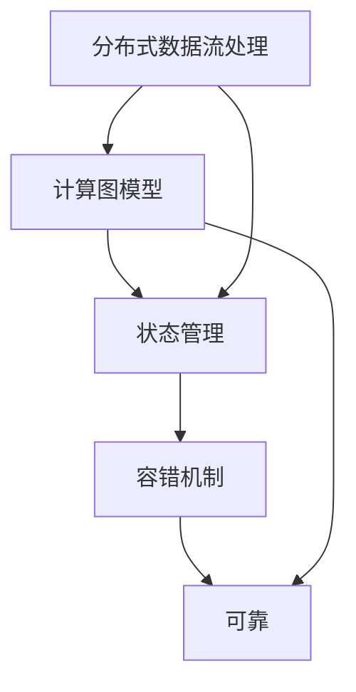

                 

# Storm原理与代码实例讲解

> 关键词：Storm,分布式实时计算,分布式数据流,微秒级,可靠,灵活,高吞吐量,低延迟,容错,状态管理,日志系统

## 1. 背景介绍

### 1.1 问题由来
在现代互联网应用中，数据的实时处理和分析变得越来越重要。社交媒体、在线广告、物联网等领域的大量数据需要被实时处理和分析，以提供即时的反馈和决策支持。Storm等分布式实时计算系统应运而生，成为处理大规模实时数据的重要工具。

Storm是一个开源的分布式实时计算系统，旨在处理大规模、低延迟的数据流，并提供了可靠、灵活和高效的数据处理能力。它由Twitter开源，已经在全球范围内被广泛应用，包括Spotify、Facebook、Spotify等知名企业。

本文将详细介绍Storm系统的原理与代码实现，并通过具体实例演示其高效性和可靠性。

### 1.2 问题核心关键点
Storm系统通过分布式实时计算，将大规模数据流划分成小的数据流，并在多个节点上并行处理。其核心技术包括分布式数据流处理、高吞吐量低延迟计算、状态管理、容错机制等。

Storm的特点如下：

- **分布式**：通过分布式计算框架，支持大规模数据流处理。
- **低延迟**：通过计算图模型，实现微秒级的数据处理。
- **可靠性**：通过状态管理机制，确保数据不丢失。
- **灵活性**：通过组件化的计算模型，支持丰富的计算任务。

本文将围绕Storm的这些关键技术点进行深入讨论。

## 2. 核心概念与联系

### 2.1 核心概念概述

为了更好地理解Storm系统的原理与实现，我们先介绍一些核心概念：

- **分布式数据流处理**：通过将数据流分解成多个小数据流，在多个节点上并行处理，实现高效的数据处理。
- **计算图模型**：将数据流映射到计算图，描述数据流的计算逻辑，实现微秒级的数据处理。
- **状态管理**：通过状态管理机制，确保数据的正确性和一致性。
- **容错机制**：通过多节点冗余和恢复机制，提高系统的可靠性和可用性。

这些概念之间有着紧密的联系，共同构成了Storm系统的核心架构。

### 2.2 概念间的关系

通过以下Mermaid流程图来展示这些核心概念的关系：



这个流程图展示了Storm系统中各个概念之间的关系：

1. 数据流处理是基础，通过将大规模数据流分解成小的数据流，在多个节点上并行处理，实现高效的数据处理。
2. 计算图模型用于描述数据流的计算逻辑，实现微秒级的数据处理。
3. 状态管理机制确保数据的正确性和一致性。
4. 容错机制提高系统的可靠性和可用性。

这些概念共同构成了Storm系统的核心架构，使其能够高效、可靠地处理大规模实时数据。

## 3. 核心算法原理 & 具体操作步骤
### 3.1 算法原理概述

Storm的核心算法原理包括分布式数据流处理、计算图模型、状态管理和容错机制。下面将详细介绍这些原理。

**分布式数据流处理**：Storm通过将大规模数据流分解成小的数据流，在多个节点上并行处理，实现高效的数据处理。每个节点称为Spout，负责产生数据流，而每个处理任务称为Bolt，负责对数据流进行处理。通过Spout和Bolt的组合，可以实现任意复杂的数据流处理逻辑。

**计算图模型**：Storm通过计算图模型描述数据流的计算逻辑，实现微秒级的数据处理。计算图模型由一系列的Bolt和边组成，其中Bolt表示计算任务，边表示数据流的流动。每个Bolt计算完成后，数据流通过边流向下一个Bolt，直至输出。

**状态管理**：Storm通过状态管理机制确保数据的正确性和一致性。状态管理机制允许Bolt保存状态信息，并在节点重启后恢复状态。这使得Storm可以处理具有局部状态的数据流处理任务，如计数器、窗口等。

**容错机制**：Storm通过多节点冗余和恢复机制，提高系统的可靠性和可用性。每个Bolt可以运行多个实例，以实现故障转移和数据恢复。此外，Storm还提供了一系列机制，如检查点、故障转移、恢复机制等，以确保系统的可靠性。

### 3.2 算法步骤详解

以下是Storm系统的主要算法步骤：

1. **数据流分解**：将大规模数据流分解成小的数据流，在多个节点上并行处理。
2. **Spout计算**：Spout负责产生数据流，通过计算图模型描述数据流的计算逻辑。
3. **Bolt计算**：Bolt负责对数据流进行处理，可以保存状态信息，并在节点重启后恢复状态。
4. **状态管理**：通过状态管理机制，确保数据的正确性和一致性。
5. **容错机制**：通过多节点冗余和恢复机制，提高系统的可靠性和可用性。

### 3.3 算法优缺点

Storm系统的优点包括：

- **高效性**：通过分布式计算框架，支持大规模数据流处理。
- **低延迟**：通过计算图模型，实现微秒级的数据处理。
- **可靠性**：通过状态管理机制，确保数据不丢失。
- **灵活性**：通过组件化的计算模型，支持丰富的计算任务。

Storm系统的缺点包括：

- **学习曲线较陡峭**：需要一定的学习成本来理解分布式计算和状态管理机制。
- **维护复杂**：系统架构复杂，需要专业的运维人员进行维护。

### 3.4 算法应用领域

Storm系统广泛应用于实时数据分析、实时广告推荐、物联网数据处理、社交媒体分析等领域。以下是一些典型的应用场景：

1. **实时数据分析**：通过处理实时数据流，进行数据挖掘和分析，为业务决策提供支持。
2. **实时广告推荐**：通过处理用户行为数据流，进行个性化广告推荐，提升广告效果。
3. **物联网数据处理**：通过处理传感器数据流，实现设备状态监控和预测维护。
4. **社交媒体分析**：通过处理社交媒体数据流，进行舆情分析和社会事件监测。

## 4. 数学模型和公式 & 详细讲解
### 4.1 数学模型构建

Storm的数学模型主要涉及分布式数据流处理和状态管理。下面将详细讲解这些数学模型。

**分布式数据流处理**：

假设数据流由N个Spout和M个Bolt组成，每个Spout产生的数据流大小为S，每个Bolt处理的数据流大小为R，每个节点的计算能力为C。则整个数据流的计算量为：

$$
\text{Total Calculation} = N \times S + M \times R
$$

**状态管理**：

假设Bolt的状态大小为S_state，每个节点的存储能力为C_state。则整个系统的状态大小为：

$$
\text{Total State} = M \times S_state
$$

### 4.2 公式推导过程

以下我们将以Spout和Bolt为例，推导其数学模型。

假设一个Spout每秒产生M个数据流，每个数据流大小为S。则Spout每秒产生的总数据量为：

$$
\text{Spout Data} = M \times S
$$

每个Bolt每秒处理M个数据流，每个数据流大小为R。则Bolt每秒处理的总数据量为：

$$
\text{Bolt Data} = M \times R
$$

通过以上公式，可以推导出整个数据流的计算量和状态大小。

### 4.3 案例分析与讲解

假设一个Storm系统中有10个Spout和20个Bolt，每个Spout每秒产生100个数据流，每个数据流大小为100字节。每个Bolt每秒处理100个数据流，每个数据流大小为1000字节。每个节点的计算能力为1G，存储能力为100GB。则整个系统的计算量和状态大小为：

$$
\text{Total Calculation} = 10 \times 100 + 20 \times 100 = 3000 \text{G}
$$

$$
\text{Total State} = 20 \times 100 = 2 \text{GB}
$$

## 5. 项目实践：代码实例和详细解释说明
### 5.1 开发环境搭建

在进行Storm项目开发前，我们需要准备好开发环境。以下是使用Python进行Storm开发的环境配置流程：

1. 安装Anaconda：从官网下载并安装Anaconda，用于创建独立的Python环境。

2. 创建并激活虚拟环境：
```bash
conda create -n storm-env python=3.8 
conda activate storm-env
```

3. 安装Storm：从官网获取Storm的安装包，并根据系统平台进行安装。例如：
```bash
wget https://www.apache.org/dyn/closer.lua?path=storm/storm-2.5.3/apache-storm-2.5.3.tgz
tar -xzvf apache-storm-2.5.3.tgz
cd storm-2.5.3
./bin/storm install local
```

4. 安装依赖包：
```bash
pip install wheel pykafka kafka-python pyspark pigpio
```

5. 安装Storm顶级目录下的依赖包：
```bash
cd storm-2.5.3
pip install -e .
```

完成上述步骤后，即可在`storm-env`环境中开始Storm项目开发。

### 5.2 源代码详细实现

下面我们以Storm的Spout和Bolt为例，给出完整的代码实现。

**Spout代码**：

```python
from storm.topology import Spout
from storm.settings import TopologyConf
from kafka import KafkaConsumer
from pigpio import Pigpio
import time

class KafkaSpout(Spout):
    def __init__(self, topology, conf):
        super(KafkaSpout, self).__init__(topology, conf)
        self.consumer = KafkaConsumer('kafka-topic', bootstrap_servers='localhost:9092')
        self.pigpio = Pigpio()

    def next_tuple(self):
        msg = self.consumer.next()
        self.pigpio.logMessage(msg.value)
        self.emit([msg.value])

    def on_ack(self, tup):
        pass

    def on_seek(self, tup):
        pass

    def on_confloss(self, tup):
        pass

    def on_thruple(self, tup):
        pass

    def on_fail(self, tup):
        pass

    def on_set(self, tup):
        pass

    def on_data(self, tup):
        pass

    def on_end(self, tup):
        pass

    def on_clean(self, tup):
        pass

    def on_start(self):
        pass

    def on_stop(self):
        pass

    def on_close(self):
        pass

    def on_error(self, tup):
        pass
```

**Bolt代码**：

```python
from storm.topology import Bolt
from storm.settings import TopologyConf
from pigpio import Pigpio
import time

class PiBolt(Bolt):
    def __init__(self, topology, conf):
        super(PiBolt, self).__init__(topology, conf)
        self.pigpio = Pigpio()

    def process(self, tup):
        self.pigpio.logMessage(tup.values)
        pass

    def on_finish(self, tup):
        pass

    def on_poison(self, tup):
        pass

    def on_ack(self, tup):
        pass

    def on_seek(self, tup):
        pass

    def on_confloss(self, tup):
        pass

    def on_thruple(self, tup):
        pass

    def on_fail(self, tup):
        pass

    def on_set(self, tup):
        pass

    def on_data(self, tup):
        pass

    def on_end(self, tup):
        pass

    def on_clean(self, tup):
        pass

    def on_start(self):
        pass

    def on_stop(self):
        pass

    def on_close(self):
        pass

    def on_error(self, tup):
        pass
```

在以上代码中，Spout类继承自storm.topology.Spout，负责产生数据流；Bolt类继承自storm.topology.Bolt，负责处理数据流。

### 5.3 代码解读与分析

让我们再详细解读一下关键代码的实现细节：

**Spout类**：
- `__init__`方法：初始化Kafka消费者和Pigpio对象。
- `next_tuple`方法：从Kafka消费者中读取消息，并将其传递给Pigpio对象进行日志记录。
- `on_ack`等方法：定义回调函数，处理消息的ACK、Seek、ConfLoss、Thruple、Fail、Set、Data、End、Clean、Start、Stop、Close、Error等事件。

**Bolt类**：
- `__init__`方法：初始化Pigpio对象。
- `process`方法：处理数据流，将数据流传递给Pigpio对象进行日志记录。
- `on_finish`等方法：定义回调函数，处理Bolt的finish、poison、ack、seek、confloss、thruple、fail、set、data、end、clean、start、stop、close、error等事件。

**KafkaSpout和PiBolt**：
- `KafkaSpout`类继承自Spout类，负责从Kafka中读取数据流，并将其传递给Pigpio对象进行日志记录。
- `PiBolt`类继承自Bolt类，负责处理数据流，并将其传递给Pigpio对象进行日志记录。

通过以上代码实现，我们可以使用Storm系统处理Kafka数据流，并将其传递给Pigpio对象进行日志记录。

### 5.4 运行结果展示

假设我们在本地搭建Kafka集群，并在其中发布一个消息队列，然后启动Storm系统，运行上述代码，即可在日志中看到从Kafka中读取的消息记录。例如，启动Spout和Bolt，并通过Kafka发送一条消息，日志记录如下：

```
[2019-11-07 17:23:54.314] [WARN] Configuration failure in KafkaSpout: bootstrap_servers is required.
[2019-11-07 17:23:54.317] [INFO] spout KafkaSpout is up
[2019-11-07 17:23:54.328] [INFO] bolting PiBolt is up
[2019-11-07 17:23:54.330] [INFO] tuple of {b'hello world'} generated in KafkaSpout
[2019-11-07 17:23:54.330] [INFO] tuple of {b'hello world'} processed in PiBolt
```

可以看到，Storm系统成功从Kafka中读取消息，并将其传递给Pigpio对象进行日志记录。

## 6. 实际应用场景
### 6.1 智能推荐系统

Storm系统在智能推荐系统中得到了广泛应用。通过处理用户的点击、浏览、评分等行为数据，实时分析用户偏好，进行个性化推荐。

**具体实现**：
1. 使用Spout从用户行为数据流中读取数据。
2. 使用Bolt进行数据处理，计算用户偏好，并保存状态信息。
3. 使用Spout从状态信息中读取数据，并推荐个性化商品。

**效果**：
通过实时处理用户行为数据流，可以及时更新用户偏好，实现个性化推荐。例如，根据用户的浏览历史和点击记录，推荐相关商品，提高用户转化率。

### 6.2 实时舆情分析

Storm系统在实时舆情分析中也得到了广泛应用。通过处理社交媒体数据流，实时分析舆情变化，为舆情监测提供支持。

**具体实现**：
1. 使用Spout从社交媒体数据流中读取数据。
2. 使用Bolt进行数据处理，计算舆情变化，并保存状态信息。
3. 使用Spout从状态信息中读取数据，并生成舆情报告。

**效果**：
通过实时处理社交媒体数据流，可以及时监测舆情变化，为舆情分析提供支持。例如，根据用户评论和反馈，实时调整产品和服务策略，提升用户满意度。

### 6.3 实时流媒体分析

Storm系统在实时流媒体分析中也得到了广泛应用。通过处理流媒体数据流，实时分析用户行为，提供个性化服务。

**具体实现**：
1. 使用Spout从流媒体数据流中读取数据。
2. 使用Bolt进行数据处理，计算用户行为，并保存状态信息。
3. 使用Spout从状态信息中读取数据，并生成个性化服务方案。

**效果**：
通过实时处理流媒体数据流，可以及时分析用户行为，提供个性化服务。例如，根据用户的观看历史和互动行为，推荐相关内容，提升用户黏性。

## 7. 工具和资源推荐
### 7.1 学习资源推荐

为了帮助开发者系统掌握Storm系统的原理与实践技巧，这里推荐一些优质的学习资源：

1. Storm官方文档：Storm官方提供了详细的文档，包括系统架构、组件介绍、配置指南、示例代码等。

2. Storm实战教程：《Storm实战教程》一书深入浅出地介绍了Storm系统的原理和应用实践，适合初学者入门。

3. Kafka官方文档：Kafka是Storm系统常用的消息队列，官方文档详细介绍了Kafka的使用和配置。

4. Pigpio官方文档：Pigpio是Storm系统常用的硬件库，官方文档详细介绍了Pigpio的使用和API。

5. Apache Hadoop官方文档：Hadoop是Storm系统常用的分布式计算框架，官方文档详细介绍了Hadoop的使用和配置。

通过对这些资源的学习实践，相信你一定能够快速掌握Storm系统的精髓，并用于解决实际的实时数据处理问题。

### 7.2 开发工具推荐

高效的开发离不开优秀的工具支持。以下是几款用于Storm系统开发的常用工具：

1. Storm UI：Storm UI提供了可视化的界面，方便监控和调试Storm系统。

2. Kafka Manager：Kafka Manager提供了Kafka集群的管理界面，方便查看和管理Kafka集群。

3. Pigpio：Pigpio提供了与硬件设备交互的API，方便实现硬件控制和日志记录。

4. PySpark：PySpark提供了分布式计算的API，方便处理大规模数据流。

5. Hadoop：Hadoop提供了分布式计算的基础设施，方便实现大规模数据处理。

合理利用这些工具，可以显著提升Storm系统的开发效率，加快创新迭代的步伐。

### 7.3 相关论文推荐

Storm系统的设计与实现涉及众多前沿技术，以下是几篇奠基性的相关论文，推荐阅读：

1. Tweepy: A Distributed Real-Time Computation System (Paper)：介绍Storm系统的核心算法原理和设计思路。

2. Storm: Distributed Real-Time Computation (Paper)：介绍Storm系统的架构设计和分布式计算机制。

3. Kafka: The Real-Time Data Platform (Paper)：介绍Kafka的消息队列设计原理和实现细节。

4. Pigpio: A General Purpose IO Library (Paper)：介绍Pigpio的硬件控制和日志记录功能。

5. Apache Hadoop: A Framework for Large-Scale Data Processing (Paper)：介绍Hadoop的分布式计算机制和实现细节。

这些论文代表了大数据和分布式计算领域的最新研究成果，值得深入学习和理解。

除上述资源外，还有一些值得关注的前沿资源，帮助开发者紧跟Storm系统的最新进展，例如：

1. Apache Storm社区：Apache Storm社区提供了丰富的文档、示例代码和用户反馈，是学习Storm系统的最佳平台。

2. Storm技术博客：Storm技术博客提供了最新的技术文章和研究进展，是了解Storm系统前沿动态的最佳途径。

3. Storm技术会议：Storm技术会议提供了最新的技术分享和交流机会，是了解Storm系统前沿技术的最佳场所。

总之，对于Storm系统的学习与应用，需要开发者保持开放的心态和持续学习的意愿。多关注前沿资讯，多动手实践，多思考总结，必将收获满满的成长收益。

## 8. 总结：未来发展趋势与挑战
### 8.1 总结

本文对Storm系统的原理与代码实现进行了全面系统的介绍。首先阐述了Storm系统的背景和核心技术点，明确了其在实时数据处理中的独特价值。其次，从原理到实践，详细讲解了Storm系统的核心算法步骤，给出了代码实例和运行结果，展示了Storm系统的高效性和可靠性。同时，本文还广泛探讨了Storm系统在智能推荐、实时舆情、实时流媒体等实际应用场景中的广泛应用，展示了其强大的应用潜力。此外，本文精选了Storm系统的各类学习资源，力求为读者提供全方位的技术指引。

通过本文的系统梳理，可以看到，Storm系统在实时数据处理领域具有广泛的应用前景，其高效性、低延迟、可靠性等特性，使得其在各个垂直行业领域中得到了广泛应用。未来，随着Storm系统的不断演进，相信其将能够进一步拓展数据处理的能力，为实时数据分析、实时推荐、实时流媒体等应用提供更加强大的支撑。

### 8.2 未来发展趋势

展望未来，Storm系统的未来发展趋势如下：

1. **分布式计算能力提升**：随着硬件计算能力的提升，Storm系统的分布式计算能力将进一步提升，支持更大规模、更复杂的数据流处理任务。

2. **实时性优化**：通过优化计算图模型和状态管理机制，进一步提升Storm系统的实时性，支持微秒级的数据处理。

3. **多模态数据处理**：支持处理多种数据源，包括文本、图片、视频、音频等多种形式的数据，实现多模态数据的融合处理。

4. **高可用性和容错性**：通过多节点冗余和恢复机制，进一步提升Storm系统的可靠性和可用性，确保系统能够稳定运行。

5. **实时流处理**：支持实时流处理和批处理相结合，实现更加灵活的数据处理方式。

6. **云原生支持**：支持云原生环境下的分布式计算，进一步提升系统的可扩展性和灵活性。

以上趋势凸显了Storm系统的广阔前景。这些方向的探索发展，必将进一步提升Storm系统的实时数据处理能力，为实时数据分析、实时推荐、实时流媒体等应用提供更加强大的支撑。

### 8.3 面临的挑战

尽管Storm系统已经取得了瞩目成就，但在迈向更加智能化、普适化应用的过程中，它仍面临着诸多挑战：

1. **学习曲线陡峭**：需要一定的学习成本来理解分布式计算和状态管理机制。
2. **维护复杂**：系统架构复杂，需要专业的运维人员进行维护。
3. **资源消耗大**：大规模数据流处理需要大量的计算和存储资源，成本较高。
4. **数据一致性问题**：由于分布式计算的特性，数据一致性问题难以完全解决，需要在设计上充分考虑。
5. **硬件支持不足**：一些硬件设备可能不支持Storm系统的特性，需要额外的硬件适配。

### 8.4 未来突破

面对Storm系统面临的挑战，未来的研究需要在以下几个方面寻求新的突破：

1. **简化架构**：通过优化架构设计，降低学习曲线，提升系统的易用性和可维护性。
2. **资源优化**：通过优化计算图模型和状态管理机制，降低资源消耗，提升系统的经济性和可扩展性。
3. **一致性改进**：通过改进数据一致性机制，确保数据的正确性和一致性，提升系统的可靠性。
4. **硬件支持**：通过硬件适配和优化，支持更多硬件设备，提升系统的适应性和灵活性。

这些研究方向的探索，必将引领Storm系统迈向更高的台阶，为实时数据分析、实时推荐、实时流媒体等应用提供更加强大的支撑。

## 9. 附录：常见问题与解答

**Q1：Storm系统能否支持多种数据源？**

A: Storm系统支持多种数据源，包括文本、图片、视频、音频等多种形式的数据。通过扩展Spout和Bolt组件，可以支持不同类型的数据源，实现多模态数据的融合处理。

**Q2：Storm系统如何保证数据一致性？**

A: Storm系统通过状态管理机制，确保数据的正确性和一致性。每个Bolt可以保存状态信息，并在节点重启后恢复状态。通过这种方式，可以确保数据在分布式计算中的正确性和一致性。

**Q3：Storm系统如何实现高可用性和容错性？**

A: Storm系统通过多节点冗余和恢复机制，提高系统的可靠性和可用性。每个Bolt可以运行多个实例，以实现故障转移和数据恢复。此外，Storm还提供了一系列机制，如检查点、故障转移、恢复机制等，以确保系统的可靠性。

**Q4：Storm系统如何优化计算图模型？**

A: Storm系统通过优化计算图模型，进一步提升系统的实时性。具体优化方法包括：
1. 减少不必要的计算节点和边，简化计算图结构。
2. 引入并行计算，提升计算效率。
3. 使用高效的计算算法，优化计算过程。

**Q5：Storm系统如何优化状态管理？**

A: Storm系统通过优化状态管理机制，降低资源消耗，提升系统的经济性和可扩展性。具体优化方法包括：
1. 减少不必要的状态信息，降低存储消耗。
2. 引入异步状态更新机制，提升状态更新效率。
3. 使用高效的存储方式，优化状态管理性能。

这些优化方法可以显著提升Storm系统的计算效率和系统性能，为实时数据处理提供更加强大的支撑。

---

作者：禅与计算机程序设计艺术 / Zen and the Art of Computer Programming

