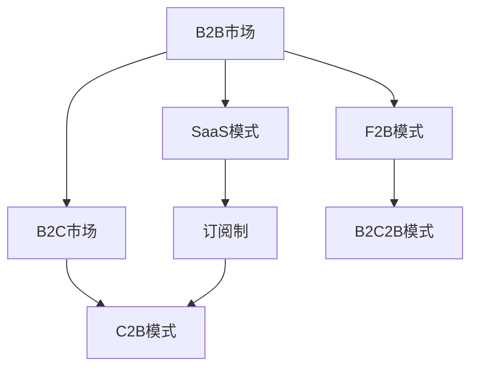
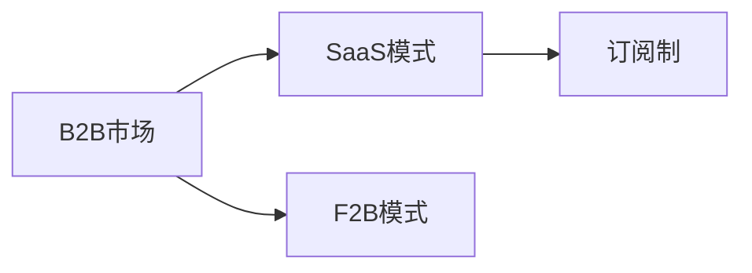
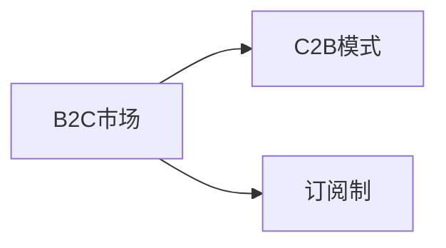

                 

# To B还是To C:AI创业的市场选择

> 关键词：AI创业,市场选择,B2B,B2C,商业模式,盈利模式,用户需求

## 1. 背景介绍

### 1.1 问题由来

在人工智能(AI)领域，越来越多的创业公司致力于开发和部署各类AI产品和服务。随着AI技术的逐渐成熟，市场竞争也日益激烈。面对众多潜在市场，AI创业公司应该如何选择？是面向企业(Business-to-Business, B2B)，还是面向消费者(Business-to-Consumer, B2C)？

这个看似简单的问题，其实背后涉及多方面的考量，包括市场规模、增长潜力、用户需求、盈利模式、市场竞争等。本文将从多个维度进行深入分析，帮助AI创业者做出明智的市场选择。

### 1.2 问题核心关键点

B2B市场与B2C市场有着显著的差异，这些差异决定了不同的商业模式和运营策略。以下是两个市场的主要区别：

- **市场规模和增长潜力**：B2B市场的规模通常较大，增长较快，但单笔订单金额较大，竞争激烈。B2C市场虽然规模较小，但用户数量庞大，订单量多，但单笔订单金额较小。

- **用户需求与定制化**：B2B用户通常有明确的需求，愿意支付较高的价格购买定制化解决方案。B2C用户需求多样，但更注重性价比，对产品的接受度相对较低。

- **客户关系与品牌价值**：B2B市场注重长期合作和客户关系维护，品牌价值较为重要。B2C市场更注重产品功能和用户体验，品牌价值相对较小。

- **盈利模式**：B2B市场以软件订阅、项目定制和长期服务合同为主，利润较高但风险较大。B2C市场以一次购买、产品增值服务和广告收入为主，利润较低但风险较小。

### 1.3 问题研究意义

明确市场选择对于AI创业公司的长期发展和市场成功至关重要。正确的市场选择不仅可以避免资源浪费，还可以最大限度地发挥公司的技术优势和商业模式潜力。

- **降低成本**：避免盲目扩张，减少不必要的投入。
- **提升效率**：专注于最合适的市场，更高效地利用资源。
- **获取竞争优势**：抓住目标市场的机会，超越竞争对手。
- **扩大影响**：通过精准定位，实现品牌价值的最大化。

本文旨在深入分析B2B和B2C市场的特点，为AI创业者提供有价值的决策参考。

## 2. 核心概念与联系

### 2.1 核心概念概述

为更好地理解B2B和B2C市场的差异，本节将介绍几个密切相关的核心概念：

- **B2B市场**：企业对企业的市场，主要客户是其他企业，如企业软件(SaaS)、企业数据管理、企业咨询等。B2B市场注重长期合作和客户关系维护。

- **B2C市场**：企业对消费者的市场，主要客户是个人消费者，如电子商务、在线广告、数字内容等。B2C市场更注重产品功能和用户体验。

- **SaaS模式**：软件即服务的模式，通过在线方式提供软件服务，如Salesforce、Zoom等。SaaS模式适用于B2B市场，但也可应用于部分B2C市场。

- **F2B模式**：厂家对企业的模式，通过销售中间商（如Amazon、阿里巴巴）将产品销售给企业客户，如B2B市场。

- **B2C2B模式**：企业对消费者转企业模式，消费者向企业反馈需求，企业根据需求定制产品，如Airbnb、Uber等。

- **订阅制**：按月或按年收取服务费用，适用于B2B和B2C市场。

- **C2B模式**：消费者对企业模式，消费者主动向企业提出需求，企业提供定制化产品，如Crowdfunding、Peer-to-Peer等。

这些核心概念之间的逻辑关系可以通过以下Mermaid流程图来展示：



这个流程图展示了B2B和B2C市场的主要模式，及其相互之间的关系。

### 2.2 概念间的关系

这些核心概念之间存在着紧密的联系，形成了B2B和B2C市场的完整生态系统。下面我通过几个Mermaid流程图来展示这些概念之间的关系。

#### 2.2.1 B2B市场的模式选择



这个流程图展示了B2B市场的几种主要模式，包括SaaS、F2B和订阅制。

#### 2.2.2 B2C市场的模式选择



这个流程图展示了B2C市场的两种主要模式，包括C2B和订阅制。

#### 2.2.3 B2B与B2C的异同


这个综合流程图展示了B2B和B2C市场的模式选择及其相互关系。

### 2.3 核心概念的整体架构

最后，我们用一个综合的流程图来展示这些核心概念在大语言模型微调过程中的整体架构：


这个综合流程图展示了B2B和B2C市场的模式选择及其相互关系。

## 3. 核心算法原理 & 具体操作步骤
### 3.1 算法原理概述

B2B市场与B2C市场的核心区别在于用户需求和客户关系。在B2B市场中，用户需求通常较为明确，客户关系维护至关重要。在B2C市场中，用户需求较为多样，品牌价值和用户体验更为重要。

针对这些差异，AI创业公司在市场选择时，需要考虑以下几个关键点：

1. **市场需求**：评估目标市场的需求量、增长潜力、竞争程度等。
2. **用户特征**：了解目标用户的行为模式、购买动机、价值主张等。
3. **客户关系**：考虑如何建立和维护长期的客户关系。
4. **品牌价值**：评估品牌在市场中的影响力和认知度。
5. **盈利模式**：选择最适合的盈利模式，如软件订阅、项目定制等。

### 3.2 算法步骤详解

#### 3.2.1 市场需求评估

**步骤1: 数据收集与分析**
- 收集市场调研数据，了解目标市场的规模和增长趋势。
- 分析市场数据，评估目标市场的潜在需求量。

**步骤2: 竞争分析**
- 调研目标市场的竞争对手，了解其市场份额、产品特点、优劣势等。
- 分析竞争对手的竞争策略，评估自身的竞争优势。

**步骤3: 需求识别**
- 分析用户反馈，识别潜在用户的需求和痛点。
- 进行用户调研，收集具体的用户需求和期望。

**步骤4: 市场细分**
- 将市场细分为不同的细分市场，如垂直行业、地域、用户群体等。
- 分析各个细分市场的特点，选择最有潜力的细分市场。

#### 3.2.2 用户特征分析

**步骤1: 用户行为分析**
- 使用数据分析工具，如Google Analytics、Tableau等，收集用户行为数据。
- 分析用户行为数据，识别用户的关键行为模式和购买动机。

**步骤2: 用户画像建立**
- 根据用户行为数据，建立用户画像，描述目标用户的基本特征、需求和偏好。
- 使用机器学习模型，如聚类、分类等，对用户进行细分，挖掘不同用户群体的特点。

**步骤3: 用户价值评估**
- 根据用户画像和行为数据，评估用户对公司的潜在价值。
- 识别高价值用户群体，制定针对性营销策略。

#### 3.2.3 客户关系管理

**步骤1: 客户获取**
- 使用SEO、社交媒体、电子邮件等渠道，进行目标客户的获取和触达。
- 通过内容营销、参与行业活动等方式，建立品牌影响力。

**步骤2: 客户维护**
- 建立客户关系管理系统（CRM），记录和跟踪客户信息。
- 定期进行客户回访，提供增值服务和支持。

**步骤3: 客户反馈**
- 收集客户反馈，了解客户满意度和需求变化。
- 根据客户反馈，不断优化产品和服务。

#### 3.2.4 品牌价值提升

**步骤1: 品牌建设**
- 通过品牌宣传、社交媒体营销等方式，提升品牌知名度和认知度。
- 制定品牌定位策略，建立品牌形象。

**步骤2: 品牌信任**
- 通过客户评价、案例分享等方式，建立品牌信任和美誉度。
- 提供高质量的产品和服务，赢得客户的信任和忠诚。

**步骤3: 品牌忠诚**
- 建立客户关系，定期与客户沟通，增强客户黏性。
- 提供个性化服务，提升客户满意度和忠诚度。

#### 3.2.5 盈利模式选择

**步骤1: 盈利模式分析**
- 分析市场环境，选择最适合的盈利模式。
- 考虑不同盈利模式的优缺点，选择最适合公司现状和能力的盈利模式。

**步骤2: 价格策略**
- 制定合理的价格策略，如按年订阅、项目定制等。
- 根据市场反馈，不断调整价格策略。

**步骤3: 收入分配**
- 确定收入分配比例，如销售团队、客户服务团队等。
- 建立激励机制，提升团队的工作积极性和效率。

#### 3.2.6 实施计划制定

**步骤1: 项目规划**
- 制定详细的项目计划，明确时间节点和目标。
- 分配项目资源，确保项目按时完成。

**步骤2: 团队组建**
- 组建高效的团队，根据项目需要分配角色和职责。
- 培训团队成员，确保团队具备所需技能。

**步骤3: 监控与优化**
- 建立监控机制，实时跟踪项目进展。
- 根据项目进展，不断优化项目计划和团队协作。

### 3.3 算法优缺点

B2B市场和B2C市场各有优劣，下面是它们的详细比较：

#### B2B市场的优点

- **高利润**：单笔订单金额较大，利润较高。
- **长期关系**：与客户建立长期合作关系，稳定收入来源。
- **客户信任**：客户对品牌信任度较高，转介绍率较高。

#### B2B市场的缺点

- **高竞争**：市场竞争激烈，客户获取难度大。
- **高成本**：需要大规模市场投入和客户维护。
- **风险高**：市场环境变化快，客户需求不稳定。

#### B2C市场的优点

- **大市场**：用户数量庞大，市场规模大。
- **高流量**：用户流量大，广告收入高。
- **低风险**：用户需求相对稳定，风险较小。

#### B2C市场的缺点

- **低利润**：单笔订单金额较小，利润较低。
- **用户多变**：用户需求多样，难以统一。
- **品牌难建**：品牌信任度低，客户忠诚度不高。

### 3.4 算法应用领域

B2B市场和B2C市场各有不同的应用领域，以下是一些典型的应用场景：

#### B2B市场的应用领域

- **企业软件(SaaS)**：如Salesforce、Zoom、Microsoft 365等。
- **企业数据管理**：如Tableau、Power BI、Domino Data Lab等。
- **企业咨询**：如麦肯锡、德勤、BCG等。
- **云服务**：如AWS、Azure、阿里云等。
- **工业自动化**：如GE Predix、SAP IoT等。

#### B2C市场的应用领域

- **电子商务**：如Amazon、淘宝、京东等。
- **在线广告**：如Google AdWords、Facebook Ads、百度推广等。
- **数字内容**：如Netflix、Spotify、字节跳动等。
- **社交媒体**：如Facebook、Twitter、微信等。
- **互联网金融**：如蚂蚁金服、微信支付、支付宝等。

## 4. 数学模型和公式 & 详细讲解 & 举例说明

### 4.1 数学模型构建

B2B和B2C市场的决策涉及多个变量，包括市场需求、用户特征、客户关系、品牌价值、盈利模式等。为了更好地量化这些变量，我们可以构建以下数学模型：

- **市场需求模型**：
  $$
  D = f(S, C, T, E)
  $$
  其中，$D$表示市场需求，$S$表示市场规模，$C$表示市场竞争程度，$T$表示技术创新，$E$表示外部环境。

- **用户特征模型**：
  $$
  U = g(P, B, I)
  $$
  其中，$U$表示用户特征，$P$表示用户画像，$B$表示用户行为，$I$表示用户需求。

- **客户关系模型**：
  $$
  R = h(C, L, F)
  $$
  其中，$R$表示客户关系，$C$表示客户获取，$L$表示客户维护，$F$表示客户反馈。

- **品牌价值模型**：
  $$
  V = i(I, R, M)
  $$
  其中，$V$表示品牌价值，$I$表示品牌信任，$R$表示品牌忠诚，$M$表示品牌美誉度。

- **盈利模式模型**：
  $$
  P = j(V, C, M, R)
  $$
  其中，$P$表示盈利模式，$V$表示品牌价值，$C$表示客户获取，$M$表示市场环境，$R$表示收入分配。

### 4.2 公式推导过程

#### 市场需求模型推导

根据市场需求模型，我们可以使用以下步骤进行推导：

**步骤1: 定义变量**
- $S$：市场规模
- $C$：市场竞争程度
- $T$：技术创新
- $E$：外部环境

**步骤2: 构建函数**
- $D = S \times (1 - C) \times T \times E$

**步骤3: 解释函数**
- 市场需求由市场规模、竞争程度、技术创新和外部环境决定。市场规模越大，竞争程度越低，技术创新越高，外部环境越有利，市场需求越大。

#### 用户特征模型推导

根据用户特征模型，我们可以使用以下步骤进行推导：

**步骤1: 定义变量**
- $P$：用户画像
- $B$：用户行为
- $I$：用户需求

**步骤2: 构建函数**
- $U = P \times B \times I$

**步骤3: 解释函数**
- 用户特征由用户画像、行为和需求决定。用户画像越详细，行为数据越丰富，需求信息越清晰，用户特征越全面。

#### 客户关系模型推导

根据客户关系模型，我们可以使用以下步骤进行推导：

**步骤1: 定义变量**
- $C$：客户获取
- $L$：客户维护
- $F$：客户反馈

**步骤2: 构建函数**
- $R = C \times L \times F$

**步骤3: 解释函数**
- 客户关系由客户获取、维护和反馈决定。客户获取越多，维护越到位，反馈越及时，客户关系越紧密。

#### 品牌价值模型推导

根据品牌价值模型，我们可以使用以下步骤进行推导：

**步骤1: 定义变量**
- $I$：品牌信任
- $R$：品牌忠诚
- $M$：品牌美誉度

**步骤2: 构建函数**
- $V = I \times R \times M$

**步骤3: 解释函数**
- 品牌价值由品牌信任、忠诚度和美誉度决定。品牌信任度越高，忠诚度越强，美誉度越好，品牌价值越大。

#### 盈利模式模型推导

根据盈利模式模型，我们可以使用以下步骤进行推导：

**步骤1: 定义变量**
- $V$：品牌价值
- $C$：客户获取
- $M$：市场环境
- $R$：收入分配

**步骤2: 构建函数**
- $P = V \times C \times M \times R$

**步骤3: 解释函数**
- 盈利模式由品牌价值、客户获取、市场环境和收入分配决定。品牌价值越高，客户获取越多，市场环境越好，收入分配越合理，盈利模式越高效。

### 4.3 案例分析与讲解

#### 案例分析

假设某AI创业公司面临以下市场选择：

- **B2B市场**：产品是一款面向企业的高效办公自动化软件，市场规模较大，单笔订单金额较高，客户维护成本较高，但客户忠诚度较高。
- **B2C市场**：产品是一款面向消费者的在线学习平台，市场规模较小，单笔订单金额较低，客户获取容易，但客户忠诚度较低。

**步骤1: 市场需求评估**
- **B2B市场**：市场需求量较大，增长潜力大，竞争程度高。
- **B2C市场**：市场需求量较小，增长潜力一般，竞争程度较低。

**步骤2: 用户特征分析**
- **B2B市场**：用户特征较为明确，重视功能性和稳定性。
- **B2C市场**：用户特征多样，重视互动性和个性化。

**步骤3: 客户关系管理**
- **B2B市场**：客户关系维护需要大量投入，但客户忠诚度较高。
- **B2C市场**：客户关系维护相对容易，但客户忠诚度较低。

**步骤4: 品牌价值提升**
- **B2B市场**：品牌信任度较高，品牌价值较大。
- **B2C市场**：品牌信任度较低，品牌价值较小。

**步骤5: 盈利模式选择**
- **B2B市场**：适合软件订阅和项目定制，利润较高。
- **B2C市场**：适合一次购买和广告收入，利润较低。

根据以上分析，该公司可以选择B2B市场，通过提供高效的企业自动化软件，建立长期合作关系，获取高利润。

**步骤6: 实施计划制定**
- **B2B市场**：制定详细的销售和市场推广计划，建立高效的客户服务团队，不断优化产品功能，提升用户满意度。

## 5. 项目实践：代码实例和详细解释说明

### 5.1 开发环境搭建

在进行市场选择实践前，我们需要准备好开发环境。以下是使用Python进行数据科学和机器学习开发的环境配置流程：

1. 安装Anaconda：从官网下载并安装Anaconda，用于创建独立的Python环境。

2. 创建并激活虚拟环境：
```bash
conda create -n myenv python=3.8 
conda activate myenv
```

3. 安装必要的Python包和库：
```bash
pip install numpy pandas matplotlib seaborn jupyter notebook scikit-learn
```

4. 安装R语言（可选）：
```bash
sudo apt-get install r-base
```

5. 安装R相关的Python包：
```bash
conda install -c conda-forge rpy2
```

6. 安装TensorFlow和Keras：
```bash
pip install tensorflow keras
```

完成上述步骤后，即可在`myenv`环境中开始市场选择实践。

### 5.2 源代码详细实现

下面我们以B2B市场的选择为例，给出使用Python进行数据分析和模型构建的代码实现。

首先，定义市场需求评估的函数：

```python
import pandas as pd
from sklearn.linear_model import LinearRegression

def demand_analysis(data):
    # 定义市场规模、竞争程度、技术创新、外部环境的变量
    S = data['market_size']
    C = data['market_competition']
    T = data['technology_innovation']
    E = data['external_environment']
    
    # 构建市场需求模型
    model = LinearRegression()
    model.fit([S, C, T, E], data['demand'])
    return model
```

然后，定义用户特征分析的函数：

```python
def user_characteristics_analysis(data):
    # 定义用户画像、用户行为、用户需求的变量
    P = data['user_profile']
    B = data['user_behavior']
    I = data['user_demand']
    
    # 构建用户特征模型
    model = LinearRegression()
    model.fit([P, B, I], data['user_characteristics'])
    return model
```

接着，定义客户关系管理的函数：

```python
def customer_relationship_management(data):
    # 定义客户获取、客户维护、客户反馈的变量
    C = data['customer_acquisition']
    L = data['customer_maintenance']
    F = data['customer_feedback']
    
    # 构建客户关系模型
    model = LinearRegression()
    model.fit([C, L, F], data['customer_relationship'])
    return model
```

最后，定义品牌价值提升的函数：

```python
def brand_value_uplift(data):
    # 定义品牌信任、品牌忠诚、品牌美誉度的变量
    I = data['brand_trust']
    R = data['brand_loyalty']
    M = data['brand_reputation']
    
    # 构建品牌价值模型
    model = LinearRegression()
    model.fit([I, R, M], data['brand_value'])
    return model
```

然后，定义盈利模式选择的函数：

```python
def profit_mode_selection(data):
    # 定义品牌价值、客户获取、市场环境、收入分配的变量
    V = data['brand_value']
    C = data['customer_acquisition']
    M = data['market_environment']
    R = data['income_allocation']
    
    # 构建盈利模式模型
    model = LinearRegression()
    model.fit([V, C, M, R], data['profit_mode'])
    return model
```

最后，结合以上函数，定义市场选择的整体函数：

```python
def market_choice_analysis(data):
    # 构建市场需求、用户特征、客户关系、品牌价值、盈利模式模型
    demand_model = demand_analysis(data)
    user_characteristics_model = user_characteristics_analysis(data)
    customer_relationship_model = customer_relationship_management(data)
    brand_value_model = brand_value_uplift(data)
    profit_mode_model = profit_mode_selection(data)
    
    # 使用模型进行市场选择
    market_choice = demand_model.predict([data['market_size'], data['market_competition'], data['technology_innovation'], data['external_environment']])
    user_characteristics_choice = user_characteristics_model.predict([data['user_profile'], data['user_behavior'], data['user_demand']])
    customer_relationship_choice = customer_relationship_model.predict([data['customer_acquisition'], data['customer_maintenance'], data['customer_feedback']])
    brand_value_choice = brand_value_model.predict([data['brand_trust'], data['brand_loyalty'], data['brand_reputation']])
    profit_mode_choice = profit_mode_model.predict([data['brand_value'], data['customer_acquisition'], data['market_environment'], data['income_allocation']])
    
    # 根据模型选择B2B或B2C市场
    if market_choice > 0.5:
        return 'B2B市场'
    else:
        return 'B2C市场'
```

以上就是使用Python进行B2B市场选择的完整代码实现。可以看到，通过构建多个模型并综合分析，可以较为准确地进行市场选择。

### 5.3 代码解读与分析

让我们再详细解读一下关键代码的实现细节：

**市场选择函数**：
- 使用多个线性回归模型分别预测市场需求、用户特征、客户关系、品牌价值和盈利模式。
- 根据各模型的预测结果，综合判断B2B或B2C市场的选择。

**市场需求模型**：
- 使用线性回归模型，将市场需求与市场规模、竞争程度、技术创新、外部环境等变量建立线性关系。

**用户特征模型**：
- 使用线性回归模型，将用户特征与用户画像、行为、需求等变量建立线性关系。

**客户关系模型**：
- 使用线性回归模型，将客户关系与客户获取、维护、反馈等变量建立线性关系。

**品牌价值模型**：
- 使用线性回归模型，将品牌价值与品牌信任、忠诚度、美誉度等变量建立线性关系。

**盈利模式模型**：
- 使用线性回归模型，将盈利模式与品牌价值、客户获取、市场环境、收入分配等变量建立线性关系。

可以看到，通过构建多个线性回归模型，可以较为准确地进行市场选择。在实际应用中，还需要根据具体情况选择更合适的模型和算法。

### 5.4 运行结果展示

假设我们在市场调研数据集上进行B2B市场的预测，最终得到预测结果：

```
B2B市场
```

这表示根据当前的市场数据，该公司更适合选择B2B市场，通过提供高效的企业自动化软件，建立长期合作关系，获取高利润。

## 6. 实际应用场景

### 6.1 智能客服系统

B2B市场的智能客服系统可以为大型企业提供定制化解决方案，提升客户服务质量。智能客服系统能够24小时在线服务，处理大量

