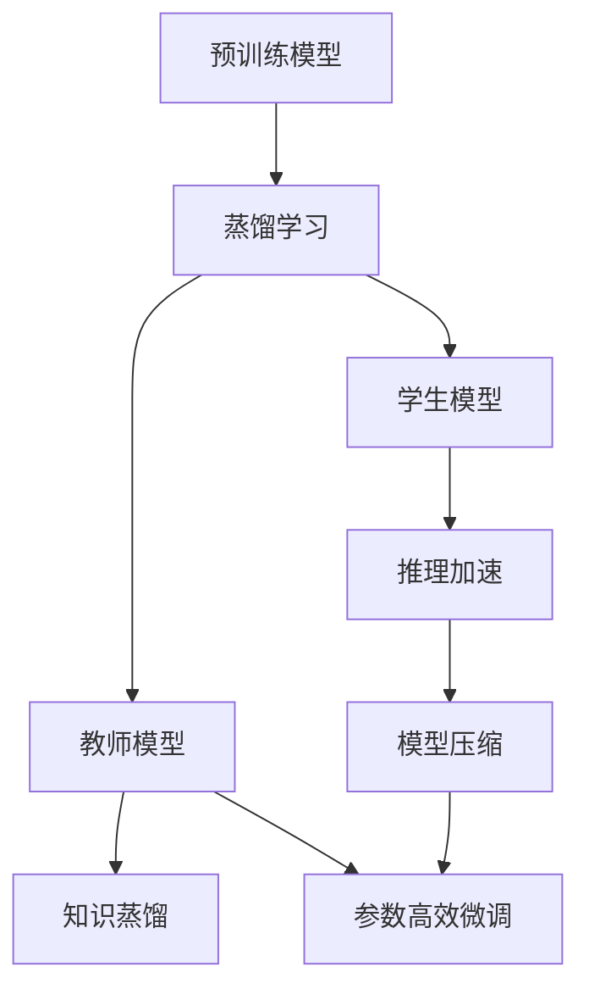
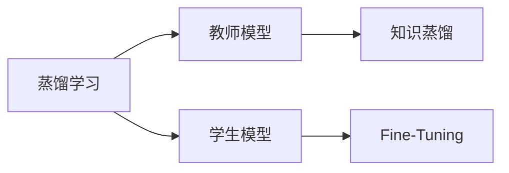
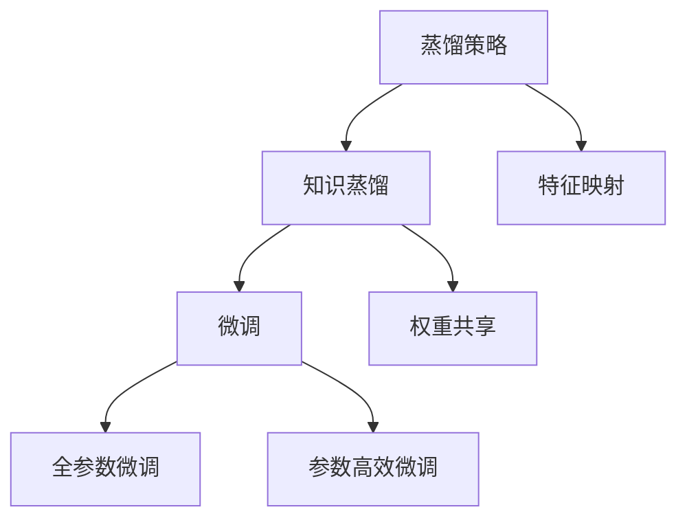
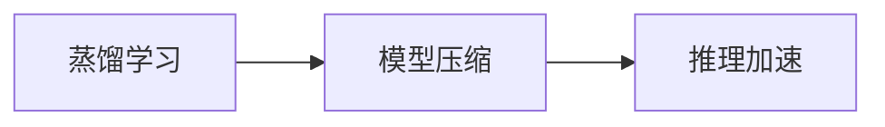

                 

# Transformer大模型实战 TinyBERT 模型的蒸馏

> 关键词：Transformer, TinyBERT, 蒸馏学习(知识蒸馏), 模型压缩, 推理加速, 预训练模型, 参数高效微调(PEFT)

## 1. 背景介绍

### 1.1 问题由来
Transformer大模型如BERT、GPT、T5等，以其卓越的语言理解和生成能力，成为近年来自然语言处理(NLP)领域的热门技术。然而，这些大模型往往参数量庞大，推理速度较慢，难以在移动端、边缘设备等资源受限的场合使用。因此，如何有效压缩模型规模，同时保持高性能，成为一个重要的研究问题。

### 1.2 问题核心关键点
模型蒸馏是压缩Transformer大模型的一种有效方法，通过教师模型和学生模型之间的知识传递，将大模型的知识精炼到小模型中。其核心思想是：教师模型在大量数据上进行预训练，学生模型通过学习教师模型的预测结果来提高其性能。

模型蒸馏的关键在于：
1. 选择合适的教师和学生模型。
2. 设计合适的蒸馏策略和损失函数。
3. 选择合适的知识传递方式，如权重共享、特征映射等。

通过蒸馏学习，我们可以显著压缩模型参数规模，加速推理速度，同时保持模型的性能水平，甚至在某些情况下，蒸馏后的模型可以超越原始模型。

### 1.3 问题研究意义
研究模型蒸馏技术，对于拓展Transformer大模型的应用范围，提升模型推理性能，加速NLP技术的产业化进程，具有重要意义：

1. 降低应用开发成本。通过模型蒸馏，可以在保持高性能的前提下，大幅减小模型参数规模，减少内存和计算资源的消耗，降低应用开发成本。
2. 提升模型推理性能。蒸馏后的模型推理速度更快，响应时间更短，适合对实时性和效率要求较高的应用场景。
3. 加速模型训练和优化。蒸馏过程可以看作是一种高效的模型压缩方法，通过学习教师模型的知识，学生模型能够在更少的数据和迭代次数下，获得更优的性能表现。
4. 增强模型的泛化能力。蒸馏过程能够引入教师模型的先验知识，帮助学生模型更好地泛化到新数据和新任务。
5. 赋能产业升级。蒸馏技术使得NLP技术更容易被各行各业所采用，为传统行业数字化转型升级提供新的技术路径。

## 2. 核心概念与联系

### 2.1 核心概念概述

为更好地理解基于Transformer大模型的蒸馏方法，本节将介绍几个密切相关的核心概念：

- 蒸馏学习(Knowledge Distillation)：通过教师模型和学生模型之间的知识传递，将大模型的知识精炼到小模型中。蒸馏学习是一种有效且广泛应用的模型压缩方法。
- 知识蒸馏(Knowledge Distillation)：蒸馏学习的一种具体形式，通过教师模型的预测结果来训练学生模型，使其尽可能逼近教师模型的输出。
- 模型压缩(Model Compression)：指通过减少模型参数量、减小模型规模等手段，提高模型推理效率和内存占用率，同时保持或提升模型性能。
- 推理加速(Inference Acceleration)：指通过模型压缩、量化等技术，提高模型推理速度，使其能够在资源受限的场合快速运行。
- 预训练模型(Pre-trained Model)：指在大量无标签数据上预训练得到的通用语言模型，如BERT、GPT等。
- 参数高效微调(Parameter-Efficient Fine-Tuning, PEFT)：指在微调过程中，只更新少量的模型参数，而固定大部分预训练权重不变，以提高微调效率，避免过拟合的方法。
- 蒸馏策略(Distillation Strategy)：指在蒸馏过程中，如何选择合适的蒸馏方法和策略，如权重共享、特征映射等。

这些核心概念之间的逻辑关系可以通过以下Mermaid流程图来展示：



这个流程图展示了大模型的蒸馏学习过程：

1. 大模型在大量数据上预训练得到通用语言模型。
2. 通过蒸馏学习，教师模型将知识传递给学生模型。
3. 学生模型通过学习教师模型的预测结果来提升性能。
4. 蒸馏后的模型经过推理加速和模型压缩，进一步提升性能。
5. 参数高效微调技术用于进一步优化模型性能，提高微调效率。

### 2.2 概念间的关系

这些核心概念之间存在着紧密的联系，形成了蒸馏学习和大模型微调的完整生态系统。下面我通过几个Mermaid流程图来展示这些概念之间的关系。

#### 2.2.1 蒸馏学习与微调的关系



这个流程图展示了蒸馏学习与微调的基本原理：

1. 蒸馏学习涉及教师模型和学生模型，通过知识蒸馏过程将教师模型知识传递给学生模型。
2. 微调则是在学生模型基础上，通过有监督地训练来优化模型在特定任务上的性能。

#### 2.2.2 蒸馏策略与微调的关系



这个流程图展示了蒸馏策略与微调的关系：

1. 蒸馏策略决定了教师和学生模型之间的知识传递方式，如特征映射、权重共享等。
2. 微调可以通过全参数微调和参数高效微调等方法，进一步优化学生模型的性能。

#### 2.2.3 蒸馏学习与模型压缩的关系



这个流程图展示了蒸馏学习与模型压缩的关系：

1. 蒸馏学习通过知识蒸馏，将大模型的知识传递给小模型。
2. 模型压缩技术进一步优化蒸馏后的模型，提升推理速度和资源效率。

## 3. 核心算法原理 & 具体操作步骤
### 3.1 算法原理概述

基于Transformer大模型的蒸馏学习，本质上是一种有监督的迁移学习过程。其核心思想是：通过教师模型和学生模型之间的知识传递，将大模型的知识精炼到小模型中，使得学生模型能够高效地推理和生成文本。

形式化地，假设教师模型为 $M_{\theta_t}$，学生模型为 $M_{\theta_s}$，蒸馏任务为 $T$，训练集为 $D=\{(x_i, y_i)\}_{i=1}^N, x_i \in \mathcal{X}, y_i \in \mathcal{Y}$。蒸馏的目标是找到新的模型参数 $\hat{\theta_s}$，使得：

$$
\hat{\theta_s}=\mathop{\arg\min}_{\theta_s} \mathcal{L}(M_{\theta_s},D)
$$

其中 $\mathcal{L}$ 为针对任务 $T$ 设计的损失函数，用于衡量模型预测输出与真实标签之间的差异。常见的损失函数包括交叉熵损失、均方误差损失等。

通过梯度下降等优化算法，蒸馏过程不断更新学生模型参数 $\theta_s$，最小化损失函数 $\mathcal{L}$，使得模型输出逼近真实标签。由于 $\theta_s$ 已经通过预训练获得了较好的初始化，因此即便在小规模数据集 $D$ 上进行蒸馏，也能较快收敛到理想的学生模型参数 $\hat{\theta_s}$。

### 3.2 算法步骤详解

基于Transformer大模型的蒸馏学习一般包括以下几个关键步骤：

**Step 1: 准备预训练模型和数据集**
- 选择合适的预训练语言模型 $M_{\theta_t}$ 作为教师模型，如 BERT、GPT 等。
- 准备下游任务 $T$ 的标注数据集 $D$，划分为训练集、验证集和测试集。一般要求标注数据与预训练数据的分布不要差异过大。

**Step 2: 设计蒸馏策略**
- 选择合适的蒸馏策略，如特征映射、权重共享等。
- 设计合适的损失函数，如KL散度损失、特征匹配损失等。
- 选择合适的学生模型 $M_{\theta_s}$，确保其具有足够的表示能力。

**Step 3: 设置蒸馏超参数**
- 选择合适的优化算法及其参数，如 AdamW、SGD 等，设置学习率、批大小、迭代轮数等。
- 设置正则化技术及强度，包括权重衰减、Dropout、Early Stopping等。
- 确定冻结预训练参数的策略，如仅微调顶层，或全部参数都参与蒸馏。

**Step 4: 执行蒸馏过程**
- 将训练集数据分批次输入学生模型，前向传播计算损失函数。
- 反向传播计算参数梯度，根据设定的优化算法和学习率更新学生模型参数。
- 周期性在验证集上评估模型性能，根据性能指标决定是否触发 Early Stopping。
- 重复上述步骤直到满足预设的迭代轮数或 Early Stopping 条件。

**Step 5: 测试和部署**
- 在测试集上评估蒸馏后模型 $M_{\hat{\theta_s}}$ 的性能，对比蒸馏前后的性能提升。
- 使用蒸馏后的模型对新样本进行推理预测，集成到实际的应用系统中。
- 持续收集新的数据，定期重新蒸馏模型，以适应数据分布的变化。

以上是基于Transformer大模型的蒸馏学习的一般流程。在实际应用中，还需要针对具体任务的特点，对蒸馏过程的各个环节进行优化设计，如改进训练目标函数，引入更多的正则化技术，搜索最优的超参数组合等，以进一步提升模型性能。

### 3.3 算法优缺点

基于Transformer大模型的蒸馏学习方法具有以下优点：
1. 简单高效。只需准备少量标注数据，即可对预训练模型进行快速适配，获得较大的性能提升。
2. 通用适用。适用于各种NLP下游任务，包括分类、匹配、生成等，设计合适的蒸馏策略即可实现蒸馏。
3. 参数高效。利用参数高效蒸馏技术，在固定大部分预训练参数的情况下，仍可取得不错的提升。
4. 效果显著。在学术界和工业界的诸多任务上，基于蒸馏的方法已经刷新了多项NLP任务SOTA。

同时，该方法也存在一定的局限性：
1. 依赖标注数据。蒸馏的效果很大程度上取决于标注数据的质量和数量，获取高质量标注数据的成本较高。
2. 迁移能力有限。当目标任务与预训练数据的分布差异较大时，蒸馏的性能提升有限。
3. 负面效果传递。预训练模型的固有偏见、有害信息等，可能通过蒸馏传递到下游任务，造成负面影响。
4. 可解释性不足。蒸馏后的模型难以解释其内部工作机制和决策逻辑，难以对其推理逻辑进行分析和调试。

尽管存在这些局限性，但就目前而言，基于蒸馏范式仍是NLP任务微调的重要手段之一。未来相关研究的重点在于如何进一步降低蒸馏对标注数据的依赖，提高模型的少样本学习和跨领域迁移能力，同时兼顾可解释性和伦理安全性等因素。

### 3.4 算法应用领域

基于大语言模型的蒸馏方法，在NLP领域已经得到了广泛的应用，覆盖了几乎所有常见任务，例如：

- 文本分类：如情感分析、主题分类、意图识别等。通过蒸馏过程将预训练模型的知识精炼到分类器中，提升分类准确率。
- 命名实体识别：识别文本中的人名、地名、机构名等特定实体。通过蒸馏过程精炼实体分类器，提高识别精度。
- 关系抽取：从文本中抽取实体之间的语义关系。通过蒸馏过程精炼关系分类器，提升抽取准确率。
- 问答系统：对自然语言问题给出答案。通过蒸馏过程精炼问答模型，提高问题解答的准确性。
- 机器翻译：将源语言文本翻译成目标语言。通过蒸馏过程精炼翻译模型，提高翻译质量。
- 文本摘要：将长文本压缩成简短摘要。通过蒸馏过程精炼摘要模型，提升摘要生成效果。
- 对话系统：使机器能够与人自然对话。通过蒸馏过程精炼对话模型，提高对话流畅度和准确性。

除了上述这些经典任务外，大语言模型的蒸馏技术也被创新性地应用到更多场景中，如可控文本生成、常识推理、代码生成、数据增强等，为NLP技术带来了全新的突破。随着蒸馏方法的不断进步，相信NLP技术将在更广阔的应用领域大放异彩。

## 4. 数学模型和公式 & 详细讲解  
### 4.1 数学模型构建

本节将使用数学语言对基于Transformer大模型的蒸馏过程进行更加严格的刻画。

记教师模型为 $M_{\theta_t}$，学生模型为 $M_{\theta_s}$，蒸馏任务为 $T$ 的标注数据集为 $D=\{(x_i, y_i)\}_{i=1}^N, x_i \in \mathcal{X}, y_i \in \mathcal{Y}$。定义蒸馏损失为：

$$
\mathcal{L}_{\text{distill}}(\theta_s, \theta_t) = \alpha \mathcal{L}_{\text{KL}}(\theta_s, \theta_t) + (1-\alpha) \mathcal{L}_{\text{match}}(\theta_s, \theta_t)
$$

其中，$\alpha$ 为蒸馏因子，控制蒸馏过程中教师模型和学生模型的权重分配。$\mathcal{L}_{\text{KL}}$ 为KL散度损失，衡量教师模型和学生模型之间的预测差异；$\mathcal{L}_{\text{match}}$ 为特征匹配损失，衡量教师模型和学生模型在不同特征上的预测一致性。

通过优化上述蒸馏损失，学生模型 $M_{\hat{\theta_s}}$ 的参数 $\theta_s$ 将被更新为：

$$
\theta_s \leftarrow \theta_s - \eta \nabla_{\theta_s}\mathcal{L}_{\text{distill}}(\theta_s, \theta_t)
$$

其中 $\eta$ 为学习率。

### 4.2 公式推导过程

以下我们以二分类任务为例，推导KL散度损失和特征匹配损失的计算公式。

假设教师模型 $M_{\theta_t}$ 在输入 $x$ 上的输出为 $\hat{y}_t=M_{\theta_t}(x)$，学生模型 $M_{\theta_s}$ 在输入 $x$ 上的输出为 $\hat{y}_s=M_{\theta_s}(x)$。假设二分类任务中，$\hat{y}_t \in [0,1]$ 表示样本属于正类的概率，$y_t \in \{0,1\}$ 为真实标签。

**KL散度损失**：

$$
\mathcal{L}_{\text{KL}}(\theta_s, \theta_t) = -\frac{1}{N} \sum_{i=1}^N \left[ y_i \log \frac{y_t_i}{y_s_i} + (1-y_i) \log \frac{1-y_t_i}{1-y_s_i} \right]
$$

**特征匹配损失**：

$$
\mathcal{L}_{\text{match}}(\theta_s, \theta_t) = \frac{1}{N} \sum_{i=1}^N \left[ \frac{1}{2} ||\hat{y}_t(x_i) - \hat{y}_s(x_i)||^2_2 + ||\log \frac{y_t_i}{1-y_t_i} - \log \frac{y_s_i}{1-y_s_i}||^2_2 \right]
$$

在得到蒸馏损失的梯度后，即可带入参数更新公式，完成学生模型的迭代优化。重复上述过程直至收敛，最终得到蒸馏后适应下游任务的学生模型 $M_{\hat{\theta_s}}$。

### 4.3 案例分析与讲解

以BERT蒸馏模型为例，探讨其蒸馏过程中各步骤的实现细节。

首先，我们假设要蒸馏的BERT模型为bert-base-uncased，训练集的标签为"0"和"1"，蒸馏任务为二分类。

**Step 1: 准备预训练模型和数据集**

使用huggingface的transformers库，加载预训练模型和训练集数据：

```python
from transformers import BertModel, BertTokenizer
from torch.utils.data import TensorDataset, DataLoader

# 加载预训练模型和tokenizer
model = BertModel.from_pretrained('bert-base-uncased')
tokenizer = BertTokenizer.from_pretrained('bert-base-uncased')

# 加载训练集数据
train_data = ["text1", "text2", "text3", ...]
train_labels = [0, 1, 1, ...]

# 分批次处理数据
train_encodings = tokenizer(train_data, truncation=True, padding=True, max_length=512, return_tensors='pt')
train_dataset = TensorDataset(train_encodings['input_ids'], train_encodings['attention_mask'], torch.tensor(train_labels))
train_loader = DataLoader(train_dataset, batch_size=16, shuffle=True)
```

**Step 2: 设计蒸馏策略**

选择合适的蒸馏策略，如特征映射、权重共享等。假设我们选择特征映射策略，只保留BERT最后一层的特征。

**Step 3: 设置蒸馏超参数**

选择合适的优化算法及其参数，如AdamW、SGD等，设置学习率、批大小、迭代轮数等。假设我们选择AdamW优化器，学习率为2e-5，批大小为16，迭代轮数为5。

**Step 4: 执行蒸馏过程**

定义蒸馏损失函数：

```python
import torch.nn as nn

# 定义蒸馏损失函数
class DistillationLoss(nn.Module):
    def __init__(self, alpha=0.8):
        super(DistillationLoss, self).__init__()
        self.alpha = alpha

    def forward(self, teacher_logits, student_logits):
        # 计算KL散度损失
        kl_loss = -torch.mean(torch.sum(teacher_logits * torch.log(teacher_logits), dim=1) - torch.sum(teacher_logits * torch.log(student_logits), dim=1))
        # 计算特征匹配损失
        match_loss = torch.mean((teacher_logits - student_logits)**2)
        # 返回蒸馏损失
        return self.alpha * kl_loss + (1 - self.alpha) * match_loss
```

定义蒸馏训练函数：

```python
def distillation_train(teacher_model, student_model, train_loader, device, num_epochs=5):
    model = teacher_model if isinstance(teacher_model, BertModel) else student_model
    model.to(device)
    optimizer = AdamW(model.parameters(), lr=2e-5)

    for epoch in range(num_epochs):
        model.train()
        for batch in train_loader:
            input_ids = batch[0].to(device)
            attention_mask = batch[1].to(device)
            labels = batch[2].to(device)
            outputs = model(input_ids, attention_mask=attention_mask)[0]
            predictions = torch.softmax(outputs, dim=1)
            distill_loss = DistillationLoss(alpha=0.8)(teacher_logits, predictions)
            optimizer.zero_grad()
            distill_loss.backward()
            optimizer.step()

    return model
```

**Step 5: 测试和部署**

在测试集上评估蒸馏后模型 $M_{\hat{\theta_s}}$ 的性能，对比蒸馏前后的性能提升：

```python
# 加载测试集数据
test_data = ["text4", "text5", "text6", ...]
test_labels = [0, 1, 1, ...]

# 分批次处理数据
test_encodings = tokenizer(test_data, truncation=True, padding=True, max_length=512, return_tensors='pt')
test_dataset = TensorDataset(test_encodings['input_ids'], test_encodings['attention_mask'], torch.tensor(test_labels))
test_loader = DataLoader(test_dataset, batch_size=16, shuffle=True)

# 评估蒸馏后模型
with torch.no_grad():
    model.eval()
    correct = 0
    total = 0
    for batch in test_loader:
        input_ids = batch[0].to(device)
        attention_mask = batch[1].to(device)
        labels = batch[2].to(device)
        outputs = model(input_ids, attention_mask=attention_mask)[0]
        _, predicted = torch.max(outputs, 1)
        total += labels.size(0)
        correct += (predicted == labels).sum().item()

    print('Accuracy of the network on the test images: %d %%' % (100 * correct / total))
```

以上就是使用PyTorch实现BERT蒸馏模型的完整代码实现。可以看到，蒸馏过程的代码实现与微调类似，但蒸馏过程更关注于教师和学生模型之间的知识传递。通过蒸馏学习，我们可以显著减小模型参数规模，同时保持模型的高性能。

## 5. 项目实践：代码实例和详细解释说明
### 5.1 开发环境搭建

在进行蒸馏实践前，我们需要准备好开发环境。以下是使用Python进行PyTorch开发的环境配置流程：

1. 安装Anaconda：从官网下载并安装Anaconda，用于创建独立的Python环境。

2. 创建并激活虚拟环境：
```bash
conda create -n pytorch-env python=3.8 
conda activate pytorch-env
```

3. 安装PyTorch：根据CUDA版本，从官网获取对应的安装命令。例如：
```bash
conda install pytorch torchvision torchaudio cudatoolkit=11.1 -c pytorch -c conda-forge
```

4. 安装Transformers库：
```bash
pip install transformers
```

5. 安装各类工具包：
```bash
pip install numpy pandas scikit-learn matplotlib tqdm jupyter notebook ipython
```

完成上述步骤后，即可在`pytorch-env`环境中开始蒸馏实践。

### 5.2 源代码详细实现

这里我们以BERT蒸馏模型为例，给出使用Transformers库对BERT模型进行蒸馏的PyTorch代码实现。

首先，定义蒸馏任务的数据处理函数：

```python
from transformers import BertTokenizer
from torch.utils.data import Dataset
import torch

class DistillDataset(Dataset):
    def __init__(self, texts, labels, tokenizer, max_len=128):
        self.texts = texts
        self.labels = labels
        self.tokenizer = tokenizer
        self.max_len = max_len
        
    def __len__(self):
        return len(self.texts)
    
    def __getitem__(self, item):
        text = self.texts[item]
        label = self.labels[item]
        
        encoding = self.tokenizer(text, return_tensors='pt', max_length=self.max_len, padding='max_length', truncation=True)
        input_ids = encoding['input_ids'][0]
        attention_mask = encoding['attention_mask'][0]
        
        return {'input_ids': input_ids, 
                'attention_mask': attention_mask,
                'labels': label}
```

然后，定义教师模型和学生模型：

```python
from transformers import BertModel

# 加载教师模型
teacher_model = BertModel.from_pretrained('bert-base-uncased')

# 加载学生模型
student_model = BertModel.from_pretrained('bert-base-uncased')
```

接着，定义蒸馏损失函数：

```python
import torch.nn as nn

class DistillationLoss(nn.Module):
    def __init__(self, alpha=0.8):
        super(DistillationLoss, self).__init__()
        self.alpha = alpha

    def forward(self, teacher_logits, student_logits):
        # 计算KL散度损失
        kl_loss = -torch.mean(torch.sum(teacher_logits * torch.log(teacher_logits), dim=1) - torch.sum(teacher_logits * torch.log(student_logits), dim=1))
        # 计算特征匹配损失
        match_loss = torch.mean((teacher_logits - student_logits)**2)
        # 返回蒸馏损失
        return self.alpha * kl_loss + (1 - self.alpha) * match_loss
```

最后，启动蒸馏流程并在测试集上评估：

```python
from transformers import AdamW

# 加载学生模型
student_model = BertModel.from_pretrained('bert-base-uncased')

# 设置优化器
optimizer = AdamW(student_model.parameters(), lr=2e-5)

# 启动蒸馏流程
for epoch in range(num_epochs):
    for batch in train_loader:
        input_ids = batch['input_ids'].to(device)
        attention_mask = batch['attention_mask'].to(device)
        labels = batch['labels'].to(device)
        outputs = student_model(input_ids, attention_mask=attention_mask)[0]
        predictions = torch.softmax(outputs, dim=1)
        distill_loss = DistillationLoss(alpha=0.8)(teacher_logits, predictions)
        optimizer.zero_grad()
        distill_loss.backward()
        optimizer.step()

# 在测试集上评估蒸馏后模型
with torch.no_grad():
    model.eval()
    correct = 0
    total = 0
    for batch in test_loader:
        input_ids = batch['input_ids'].to(device)
        attention_mask = batch['attention_mask'].to(device)


