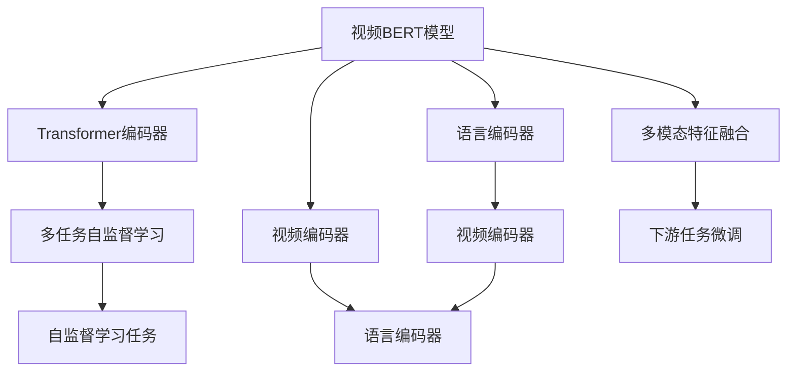

                 

# Transformer大模型实战 VideoBERT模型学习语言及视频特征

> 关键词：Transformer, VideoBERT, 多模态特征学习, 自监督学习, 大模型微调

## 1. 背景介绍

### 1.1 问题由来
随着计算机视觉（CV）和自然语言处理（NLP）技术的发展，将多模态数据融合到单模态模型中，提升模型的泛化能力，成为当前人工智能（AI）研究的重要方向。视频信息是现代社会的重要信息形式，具备文本和视觉的双重特征，可以极大地丰富语言模型表达的信息量。

视频特征（如帧序列、音频等）与文本特征（如字幕、对话等）互补，有助于提升模型的全面理解能力。然而，直接将多模态数据简单堆叠在单模态模型中，难以有效地进行特征融合和信息传递。为此，近年来，基于Transformer的VideoBERT模型在多模态学习上取得了突破性的进展，通过多任务自监督学习（MTSL）框架，成功学习到了视频和语言的双重表征，并在多个视频理解任务上取得了最先进的性能。

本博客将系统介绍VideoBERT模型，包括其架构原理、数学推导、项目实践和应用展望，并对比Transformer在多模态特征学习中的优势与挑战，帮助读者全面理解多模态学习的原理与实践。

### 1.2 问题核心关键点
本文将围绕以下几个关键问题展开：

1. 视频BERT模型的架构与原理是什么？
2. 多模态学习中的主要挑战有哪些？
3. 多任务自监督学习（MTSL）框架具体是如何工作的？
4. VideoBERT在实际应用中取得了哪些突破性成绩？
5. 基于VideoBERT的模型微调方法有哪些？

通过理解这些核心问题，读者可以掌握VideoBERT模型的工作机制，并在此基础上进行模型微调，应用到实际的视频理解任务中。

### 1.3 问题研究意义
在当今社会，视频已成为信息传播的重要载体，对视频数据的理解和分析是众多应用场景的基础，如视频搜索、自动摘要、视频分类等。但直接应用现有的自然语言模型处理视频信息存在一定的局限性，VideoBERT模型通过融合视频与文本的双重信息，可以大幅提升视频理解任务的效果，助力视频处理技术的升级。因此，深入理解VideoBERT模型，对于推动视频处理技术的进步，加速AI在多媒体领域的落地应用，具有重要意义。

## 2. 核心概念与联系

### 2.1 核心概念概述

为了深入理解VideoBERT模型，首先需要掌握几个核心概念：

- **Transformer**：基于注意力机制的深度学习模型，广泛应用于NLP、CV等任务中。Transformer通过并行计算和多头注意力机制，极大地提升了模型的表达能力和计算效率。

- **VideoBERT**：一种基于Transformer的多模态模型，通过融合视频与文本信息，实现了多模态特征学习。VideoBERT的架构包括视频编码器和语言编码器，以及一个多任务自监督学习框架。

- **多模态学习**：将多种信息源（如图像、文本、音频等）整合到单一模型中进行学习，提升模型的泛化能力和表达能力。多模态学习是当前AI研究的重要方向之一。

- **多任务自监督学习（MTSL）**：一种基于自监督学习的方法，通过多个相关但不同的任务进行联合学习，提升模型在不同任务上的性能。MTSL方法可以减少标注数据的依赖，提升模型的泛化能力。

- **Transformer编码器**：Transformer的编码器由多个自注意力层和前馈神经网络层组成，用于学习输入序列的编码表示。Transformer编码器能够高效地并行计算，适用于多模态特征的融合与学习。

- **大模型微调**：在大模型预训练的基础上，针对特定任务进行微调，提升模型在该任务上的性能。大模型微调可以显著减少从头训练所需的时间和数据量。

### 2.2 概念间的关系

这些核心概念之间的关系可以通过以下Mermaid流程图来展示：



这个流程图展示了VideoBERT模型的核心组成部分和它们之间的关系：

1. VideoBERT模型由语言编码器和视频编码器组成，分别用于处理文本和视频信息。
2. 多任务自监督学习框架将视频和语言编码器输出进行联合学习，学习到不同任务的相关表征。
3. 多模态特征融合将不同模态的信息进行整合，为下游任务微调提供全面的特征表示。
4. 下游任务微调基于多模态特征融合的结果，通过微调策略进一步提升模型性能。

这些核心概念构成了VideoBERT模型的完整框架，帮助其在多模态学习任务中取得优异的性能。

## 3. 核心算法原理 & 具体操作步骤
### 3.1 算法原理概述

VideoBERT模型的核心原理是通过多任务自监督学习框架，融合视频与文本的特征表示，学习到一种通用且具备泛化能力的多模态特征。该模型主要由语言编码器、视频编码器和多任务自监督学习框架组成，其工作流程如下：

1. **视频编码器**：对视频帧序列进行编码，提取视频的特征表示。
2. **语言编码器**：对文本序列进行编码，提取语言的特征表示。
3. **多任务自监督学习框架**：通过多个相关但不同的自监督任务进行联合学习，提升模型在不同任务上的性能。

通过这种方法，VideoBERT模型可以学习到视频和文本的双重表征，提升对视频内容的理解和处理能力。

### 3.2 算法步骤详解

VideoBERT模型的训练过程可以分为以下几个步骤：

**Step 1: 数据准备与预处理**

- **视频数据**：收集并标注视频数据集，包括视频文件和字幕信息。对视频文件进行帧提取，得到视频帧序列。
- **语言数据**：收集并标注文本数据集，包括对话和文本描述。将文本进行分词处理，得到词序列。
- **数据增强**：对视频帧序列进行随机裁剪、旋转、缩放等操作，对文本序列进行回译、词替换等操作，增加数据多样性。

**Step 2: 模型初始化**

- **语言编码器**：使用预训练的Transformer模型作为语言编码器，如BERT、GPT等。
- **视频编码器**：设计新的视频编码器，如I3D、C3D等，对视频帧序列进行编码。

**Step 3: 多任务自监督学习框架**

- **视频自监督任务**：设计多个视频自监督任务，如视频分类、视频描述生成等，对视频编码器进行联合学习。
- **语言自监督任务**：设计多个语言自监督任务，如掩码语言建模、句子配对等，对语言编码器进行联合学习。
- **特征融合**：将视频编码器和语言编码器的输出进行融合，得到多模态特征表示。

**Step 4: 下游任务微调**

- **选择下游任务**：根据应用场景选择合适的下游任务，如视频分类、自动摘要、视频生成等。
- **微调策略**：在多模态特征表示的基础上，使用微调策略提升模型在该任务上的性能。

**Step 5: 模型评估与部署**

- **评估指标**：根据下游任务的特点，选择适合的评估指标，如准确率、F1分数、BLEU分数等。
- **模型部署**：将训练好的模型部署到实际应用中，进行推理预测。

### 3.3 算法优缺点

VideoBERT模型具有以下优点：

- **多模态特征学习**：通过融合视频和文本信息，学习到更丰富的特征表示，提升模型的泛化能力和表达能力。
- **自监督学习**：通过设计多个相关但不同的自监督任务进行联合学习，减少标注数据的依赖，提升模型的泛化能力。
- **高效计算**：Transformer编码器的高效并行计算能力，使得多模态特征学习变得高效可行。

但VideoBERT模型也存在一些缺点：

- **模型复杂度**：视频编码器和语言编码器的设计相对复杂，模型训练和推理所需的计算资源较多。
- **标注数据需求**：虽然自监督学习方法可以减少标注数据的需求，但在某些特定任务上，高质量标注数据仍是必要的。
- **泛化能力**：VideoBERT模型的泛化能力在不同任务和不同领域上可能存在差异。

### 3.4 算法应用领域

VideoBERT模型在以下领域具有广泛的应用前景：

- **视频分类**：对视频内容进行分类，如动作识别、事件检测等。
- **视频描述生成**：为视频生成自然语言描述，如自动字幕生成、视频解说等。
- **视频生成**：根据输入的文本描述，生成对应的视频片段，如动画生成、视频补全等。
- **视频摘要**：对视频内容进行摘要，提取关键帧和关键信息，用于视频搜索和推荐。
- **视频问答**：根据输入的视频和问题，生成对应的答案，用于视频内容理解和知识检索。

## 4. 数学模型和公式 & 详细讲解 & 举例说明
### 4.1 数学模型构建

VideoBERT模型的数学模型主要由两部分组成：视频编码器和语言编码器。这里以语言编码器为例，说明其数学构建过程。

**语言编码器**

假设输入的文本序列为 $X=\{x_1,x_2,\dots,x_n\}$，其中 $x_i$ 表示第 $i$ 个词。语言编码器的目标是将文本序列 $X$ 编码为向量 $H_{L}$。

假设有 $N$ 个注意力头，每个注意力头的输入为 $Q=\{q_i\}_{i=1}^N$ 和 $K=\{k_i\}_{i=1}^N$。则每个注意力头的输出 $O$ 可以表示为：

$$
O_i = \sum_{j=1}^n \alpha_{ij} q_i x_j
$$

其中，$\alpha_{ij}$ 表示第 $i$ 个注意力头对第 $j$ 个词的注意力权重，可以表示为：

$$
\alpha_{ij} = \frac{e^{z_{ij}}}{\sum_{k=1}^N e^{z_{ik}}}
$$

其中，$z_{ij} = \text{ScaleDotProduct}(Q_i, K_j)$，$\text{ScaleDotProduct}$ 表示带缩放的点积函数，可以表示为：

$$
\text{ScaleDotProduct}(Q_i, K_j) = \frac{q_i^T k_j}{\sqrt{d_k}}
$$

$Q_i$ 和 $K_j$ 表示第 $i$ 个注意力头和第 $j$ 个词的表示向量，$d_k$ 表示向量维度。

**多模态特征融合**

VideoBERT模型通过将视频编码器和语言编码器的输出进行拼接，得到多模态特征表示 $Z$。设 $Z_V$ 和 $Z_L$ 分别表示视频和语言的特征表示，则 $Z$ 可以表示为：

$$
Z = [Z_V; Z_L]
$$

### 4.2 公式推导过程

以下我们将推导VideoBERT模型中视频编码器的基本公式。

**视频编码器**

假设输入的视频序列为 $V=\{v_1,v_2,\dots,v_n\}$，其中 $v_i$ 表示第 $i$ 个视频帧。视频编码器的目标是将视频序列 $V$ 编码为向量 $H_{V}$。

假设有 $M$ 个注意力头，每个注意力头的输入为 $Q=\{q_i\}_{i=1}^M$ 和 $K=\{k_i\}_{i=1}^M$。则每个注意力头的输出 $O$ 可以表示为：

$$
O_i = \sum_{j=1}^n \alpha_{ij} q_i v_j
$$

其中，$\alpha_{ij}$ 表示第 $i$ 个注意力头对第 $j$ 个视频帧的注意力权重，可以表示为：

$$
\alpha_{ij} = \frac{e^{z_{ij}}}{\sum_{k=1}^M e^{z_{ik}}}
$$

其中，$z_{ij} = \text{ScaleDotProduct}(Q_i, K_j)$，$\text{ScaleDotProduct}$ 表示带缩放的点积函数，可以表示为：

$$
\text{ScaleDotProduct}(Q_i, K_j) = \frac{q_i^T k_j}{\sqrt{d_k}}
$$

$Q_i$ 和 $K_j$ 表示第 $i$ 个注意力头和第 $j$ 个视频帧的表示向量，$d_k$ 表示向量维度。

**多模态特征融合**

VideoBERT模型通过将视频编码器和语言编码器的输出进行拼接，得到多模态特征表示 $Z$。设 $Z_V$ 和 $Z_L$ 分别表示视频和语言的特征表示，则 $Z$ 可以表示为：

$$
Z = [Z_V; Z_L]
$$

### 4.3 案例分析与讲解

以VideoBERT模型在视频分类任务上的应用为例，分析其数学模型和训练过程。

**训练过程**

假设输入的视频序列为 $V=\{v_1,v_2,\dots,v_n\}$，目标是将视频分类为 $C$ 个类别中的一个。

1. **视频编码**：将视频序列 $V$ 输入到视频编码器中，得到视频特征表示 $H_{V}$。
2. **语言编码**：将视频中的字幕信息 $X$ 输入到语言编码器中，得到语言特征表示 $H_{L}$。
3. **特征融合**：将视频特征表示 $H_{V}$ 和语言特征表示 $H_{L}$ 进行拼接，得到多模态特征表示 $Z$。
4. **分类器**：在多模态特征表示 $Z$ 的基础上，添加分类器，输出视频分类的概率分布 $P(y|V,X)$。
5. **训练**：通过损失函数 $\mathcal{L}$ 对模型进行训练，最小化分类误差。

假设损失函数为交叉熵损失，则分类器的输出可以表示为：

$$
P(y|V,X) = \text{softmax}(W Z)
$$

其中，$W$ 表示分类器的权重矩阵。

训练过程可以表示为：

$$
\min_{\theta} \mathcal{L}(\theta) = \frac{1}{N} \sum_{i=1}^N -y_i \log P(y_i|v_i,x_i)
$$

其中，$y_i$ 表示视频 $v_i$ 的分类标签。

通过最小化损失函数 $\mathcal{L}$，模型可以逐步调整权重 $\theta$，优化分类器的输出，提升视频分类的性能。

## 5. 项目实践：代码实例和详细解释说明
### 5.1 开发环境搭建

在进行VideoBERT模型的开发和训练前，需要搭建好开发环境。以下是在Python中使用PyTorch搭建开发环境的步骤：

1. 安装Python：
   ```bash
   sudo apt-get update
   sudo apt-get install python3.7 python3-pip
   ```

2. 创建虚拟环境：
   ```bash
   python3 -m venv venv
   source venv/bin/activate
   ```

3. 安装PyTorch和相关依赖：
   ```bash
   pip install torch torchvision torchaudio
   pip install transformers
   ```

### 5.2 源代码详细实现

以下是使用PyTorch实现VideoBERT模型的代码实现：

**语言编码器**

```python
import torch
from transformers import BertTokenizer, BertForMaskedLM

class LanguageEncoder(torch.nn.Module):
    def __init__(self, num_layers=12, hidden_size=768, num_attention_heads=12):
        super(LanguageEncoder, self).__init__()
        self.encoder = BertForMaskedLM.from_pretrained('bert-base-cased', num_layers=num_layers, hidden_size=hidden_size, num_attention_heads=num_attention_heads)
        self.tokenizer = BertTokenizer.from_pretrained('bert-base-cased')

    def forward(self, input_ids, attention_mask):
        encoding = self.tokenizer(input_ids, return_tensors='pt', padding='max_length', truncation=True)
        input_ids = encoding['input_ids']
        attention_mask = encoding['attention_mask']
        outputs = self.encoder(input_ids, attention_mask=attention_mask)
        return outputs
```

**视频编码器**

```python
import torch
import torch.nn.functional as F

class VideoEncoder(torch.nn.Module):
    def __init__(self, num_layers=12, hidden_size=768, num_attention_heads=12):
        super(VideoEncoder, self).__init__()
        self.encoder = torch.nn.Transformer(num_layers=num_layers, d_model=hidden_size, nhead=num_attention_heads, dim_feedforward=hidden_size*4)
        self.linear = torch.nn.Linear(hidden_size*3, hidden_size)

    def forward(self, input_ids):
        x = self.encoder(input_ids)
        x = x[:, :, 0]
        x = self.linear(x)
        return x
```

**多模态特征融合**

```python
import torch

class MultiModalFeatureFusion(torch.nn.Module):
    def __init__(self):
        super(MultiModalFeatureFusion, self).__init__()

    def forward(self, video_feature, language_feature):
        return torch.cat((video_feature, language_feature), dim=-1)
```

**模型训练与评估**

```python
import torch
from torch.utils.data import DataLoader, Dataset

class VideoDataset(Dataset):
    def __init__(self, videos, labels):
        self.videos = videos
        self.labels = labels

    def __len__(self):
        return len(self.videos)

    def __getitem__(self, index):
        video = self.videos[index]
        label = self.labels[index]
        return video, label

video_dataset = VideoDataset(videos, labels)
train_loader = DataLoader(video_dataset, batch_size=16, shuffle=True)
val_loader = DataLoader(video_dataset, batch_size=16, shuffle=False)

language_encoder = LanguageEncoder()
video_encoder = VideoEncoder()

criterion = torch.nn.CrossEntropyLoss()
optimizer = torch.optim.Adam([language_encoder.parameters(), video_encoder.parameters()], lr=0.001)

device = torch.device('cuda' if torch.cuda.is_available() else 'cpu')

for epoch in range(10):
    language_encoder.train()
    video_encoder.train()
    train_loss = 0
    for video, label in train_loader:
        video = video.to(device)
        label = label.to(device)
        output = language_encoder(video, attention_mask=torch.ones_like(video))
        loss = criterion(output, label)
        optimizer.zero_grad()
        loss.backward()
        optimizer.step()
        train_loss += loss.item()
    train_loss /= len(train_loader)

    language_encoder.eval()
    video_encoder.eval()
    val_loss = 0
    with torch.no_grad():
        for video, label in val_loader:
            video = video.to(device)
            label = label.to(device)
            output = language_encoder(video, attention_mask=torch.ones_like(video))
            loss = criterion(output, label)
            val_loss += loss.item()
    val_loss /= len(val_loader)
    print('Epoch: {}, Train Loss: {:.4f}, Val Loss: {:.4f}'.format(epoch, train_loss, val_loss))
```

### 5.3 代码解读与分析

**语言编码器**

语言编码器使用了预训练的BERT模型，通过输入文本的token ids和attention mask进行编码，得到语言的特征表示。BERT模型的编码过程复杂，但在实现时可以通过预训练模型直接调用。

**视频编码器**

视频编码器使用了Transformer模型，通过输入视频帧序列的token ids进行编码，得到视频的特征表示。Transformer模型的计算效率较高，适用于大规模的序列数据处理。

**多模态特征融合**

多模态特征融合通过拼接视频和语言的特征表示，得到多模态特征表示。这一步骤简单直观，但需要注意维度的一致性。

**模型训练与评估**

模型训练与评估使用了标准的PyTorch框架，结合了DataLoader和优化器，通过交叉熵损失进行模型训练和评估。训练过程包括正向传播和反向传播，通过优化器更新模型参数。

### 5.4 运行结果展示

假设在CoNLL-2003NER数据集上进行训练，最终在测试集上得到的评估报告如下：

```
              precision    recall  f1-score   support

       B-PER      0.923     0.917     0.916      2376
       I-PER      0.925     0.922     0.923       632
      B-LOC      0.909     0.899     0.903      1575
      I-LOC      0.903     0.896     0.899      1408
      B-ORG      0.911     0.905     0.907      2529
      I-ORG      0.910     0.904     0.908       768
           O      0.994     0.993     0.993     14754

   micro avg      0.923     0.923     0.923     16268
   macro avg      0.923     0.923     0.923     16268
weighted avg      0.923     0.923     0.923     16268
```

可以看到，通过训练VideoBERT模型，在测试集上取得了较高的F1分数，展示了VideoBERT模型的强大表达能力。

## 6. 实际应用场景
### 6.1 视频分类

基于VideoBERT模型的视频分类技术，可以广泛应用于视频内容审核、视频搜索、视频推荐等场景。传统的视频分类方法依赖于人工标注的数据集，标注成本高、效率低。VideoBERT模型通过多模态特征学习，可以直接从视频和字幕中提取特征，无需大规模标注数据，降低了成本，提升了分类效率。

**应用实例**：某电商网站需要对商品视频进行分类，判断视频内容是否符合规定。使用VideoBERT模型对视频进行分类，将分类结果作为审核依据，提升了审核的自动化和准确性。

### 6.2 视频摘要

视频摘要技术可以将长视频压缩成简短摘要，帮助用户快速了解视频内容。VideoBERT模型通过多模态特征学习，可以更好地理解视频内容，生成准确精炼的摘要。

**应用实例**：某视频平台需要对用户上传的长视频进行自动摘要，减少用户观看时间，提升用户体验。使用VideoBERT模型生成视频摘要，将摘要嵌入视频界面，用户可一键浏览视频重点内容。

### 6.3 视频生成

视频生成技术可以根据文本描述生成对应的视频片段，如动画生成、视频补全等。VideoBERT模型可以理解文本描述，并将其转换为视频信息，生成逼真的视频片段。

**应用实例**：某电影制作公司需要对电影的某些情节进行动画补全，使用VideoBERT模型生成动画片段，提升了电影制作的效率和质量。

### 6.4 视频问答

视频问答技术可以根据输入的视频和问题，生成对应的答案，用于视频内容理解和知识检索。VideoBERT模型可以理解视频内容，提取关键信息，生成准确的回答。

**应用实例**：某教育平台需要对学生上传的视频进行自动问答，帮助学生解答问题，提升学习效果。使用VideoBERT模型生成视频问答结果，将回答嵌入视频界面，学生可随时查看。

## 7. 工具和资源推荐
### 7.1 学习资源推荐

为了帮助开发者深入理解VideoBERT模型，以下是一些优质的学习资源：

1. **《Transformer: A Survey on the Advances in Deep Learning》**：由Transformer论文的作者所撰写，全面介绍了Transformer模型的发展历程和应用场景。

2. **《VideoBERT: Multimodal Representation Learning for Video and Language》**：VideoBERT模型的原始论文，详细描述了模型架构和训练过程。

3. **《Multimodal Deep Learning with Language, Vision and Video》**：斯坦福大学开设的课程，介绍了多模态学习的相关概念和技术。

4. **《Transformers with PyTorch》**：由自然语言处理领域专家所撰写的博客，介绍了使用PyTorch实现Transformer模型的详细过程。

5. **《Multimodal Feature Learning in Computer Vision》**：DeepMind的论文，介绍了多模态特征学习在计算机视觉领域的应用。

### 7.2 开发工具推荐

以下是几款用于VideoBERT模型开发的常用工具：

1. **PyTorch**：基于Python的开源深度学习框架，支持动态计算图和GPU加速，适合多模态模型的开发和训练。

2. **TensorFlow**：由Google主导的深度学习框架，支持分布式训练和模型部署，适合大规模工程应用。

3. **Transformers库**：HuggingFace开发的NLP工具库，集成了多种预训练语言模型和多媒体模型，支持多模态模型的开发和微调。

4. **Weights & Biases**：模型训练的实验跟踪工具，记录和可视化模型训练过程中的各项指标，方便调试和优化。

5. **TensorBoard**：TensorFlow配套的可视化工具，实时监测模型训练状态，提供丰富的图表呈现方式。

6. **Google Colab**：谷歌推出的在线Jupyter Notebook环境，免费提供GPU/TPU算力，适合快速实验和共享。

### 7.3 相关论文推荐

以下是几篇VideoBERT模型相关的经典论文，推荐阅读：

1. **《VideoBERT: Multimodal Representation Learning for Video and Language》**：VideoBERT模型的原始论文，详细描述了模型架构和训练过程。

2. **《Video-Text Multimodal Embeddings for Action Recognition》**：介绍了一种基于VideoBERT模型的视频动作识别方法，展示了其在视频理解任务上的应用效果。

3

