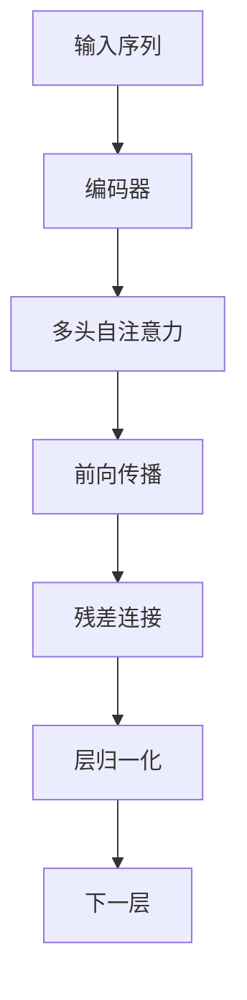

                 

# Transformer大模型实战 编码器总览

## 1. 背景介绍

### 1.1 问题由来

近年来，深度学习技术在自然语言处理（NLP）领域取得了显著进展，尤其是Transformer大模型的兴起，极大地推动了语言模型在文本理解、生成和推理等任务上的表现。Transformer模型以其自注意力机制，能够有效捕捉文本序列中的语义和句法信息，从而在机器翻译、文本摘要、问答系统等诸多NLP任务上取得了优秀表现。

然而，尽管Transformer模型在学术界和工业界都受到了广泛关注，其实际应用过程中仍面临一些挑战。比如，如何在大规模文本数据上进行高效、稳定的训练，如何确保模型在特定任务上的泛化能力，以及如何优化模型的推理速度和资源占用，等等。

### 1.2 问题核心关键点

为了解决上述问题，本文章将全面介绍Transformer大模型的编码器部分，包括其结构、原理和应用细节。我们将从以下几个方面展开：

1. **Transformer编码器的结构与原理**：详细探讨Transformer编码器的层次结构、自注意力机制和多头自注意力机制，以及如何通过多层编码器堆叠，实现对文本序列的深度理解。
2. **编码器的数学模型与公式推导**：介绍Transformer编码器的数学模型构建和公式推导，包括自注意力机制、多头注意力机制以及编码器中常用的激活函数、归一化层等。
3. **编码器在实际项目中的实践与优化**：结合具体项目案例，展示Transformer编码器在微调、推理等实际应用中的具体操作和优化技巧。
4. **编码器的应用领域与未来展望**：探讨Transformer编码器在不同领域的应用，包括机器翻译、文本摘要、问答系统等，并展望其在未来技术发展中的前景。

### 1.3 问题研究意义

深入了解Transformer编码器的结构与原理，对于研究和应用Transformer大模型，以及提升NLP系统的性能，具有重要意义：

1. 有助于理解Transformer模型在文本处理任务上的优势和局限性，为模型优化和任务适配提供理论基础。
2. 通过学习编码器的设计与实现，开发者可以更有效地利用预训练模型，减少从头训练的时间和成本。
3. 编码器的优化技巧可以为实际应用中的模型训练、推理提供参考，提升模型在特定任务上的效果。
4. 编码器的应用领域和未来发展趋势，可以为NLP技术在其他领域的拓展提供指导。

## 2. 核心概念与联系

### 2.1 核心概念概述

为了更好地理解Transformer编码器，我们先介绍几个关键概念：

- **编码器(Encoder)**：在Transformer中，编码器负责将输入序列转换为一个高维表示，用于后续的解码器解码或用于下游任务的微调。
- **自注意力(Self-Attention)**：一种机制，用于在输入序列中提取信息。自注意力机制通过计算输入序列中每个位置与其他位置的相关性，来为每个位置计算一个加权平均值，从而捕捉输入序列的全局和局部依赖关系。
- **多头自注意力(Multi-Head Self-Attention)**：在自注意力机制的基础上，通过同时计算多个头部的自注意力权重，来捕捉输入序列的多种特征表示。
- **残差连接(Residual Connections)**：一种设计，通过将输入和前一层的输出相加，来缓解梯度消失问题，加速模型的收敛。
- **层归一化(Layer Normalization)**：一种归一化技术，通过对每个位置的输出进行归一化，来稳定模型的训练过程。

这些概念通过以下Mermaid流程图展示它们之间的关系：



### 2.2 概念间的关系

通过上述流程图，我们可以看到，输入序列通过多个编码层进行逐层处理，每层通过多头自注意力机制提取特征，并通过残差连接和层归一化稳定训练过程。这一过程通过多次迭代，逐步提升模型的表征能力，最终输出高维表示，用于下游任务的进一步处理或微调。

## 3. 核心算法原理 & 具体操作步骤

### 3.1 算法原理概述

Transformer编码器的核心原理是自注意力机制，通过计算输入序列中每个位置与其他位置的相关性，为每个位置计算加权平均值，从而捕捉输入序列的全局和局部依赖关系。这一机制通过多头自注意力机制的并行计算，进一步提升了模型的特征提取能力。

Transformer编码器的总体结构包括：输入嵌入层、多头自注意力层、前向传播层、残差连接层和层归一化层。每一层都通过这些基本组件进行构建和计算。

### 3.2 算法步骤详解

#### 3.2.1 输入嵌入层

输入嵌入层负责将输入的单词或字符转换为向量表示。对于Transformer模型，通常使用词向量或字符向量进行嵌入。嵌入后的向量会被传递给后续的自注意力层进行计算。

#### 3.2.2 多头自注意力层

多头自注意力层是Transformer编码器的核心部分，负责通过自注意力机制提取输入序列的特征表示。该层由多个并行的多头自注意力模块构成，每个模块计算一个不同的头部注意力权重。多头自注意力层的计算流程如下：

1. **查询-键-值矩阵计算**：将输入嵌入层的向量与三个不同的线性变换矩阵进行计算，生成查询向量、键向量和值向量。
2. **注意力计算**：计算每个查询向量与所有键向量的相似度，得到一个注意力权重矩阵。
3. **加权平均计算**：根据注意力权重矩阵计算加权平均值，得到多头自注意力的结果。
4. **残差连接和层归一化**：将加权平均值与残差连接层进行相加，并通过层归一化层进行归一化处理，输出下一层所需的向量表示。

#### 3.2.3 前向传播层

前向传播层通常包括一个前向神经网络（如ReLU激活函数），对加权平均值进行非线性变换，增强模型的非线性表达能力。

#### 3.2.4 残差连接和层归一化

残差连接层和层归一化层分别用于加速模型收敛和稳定训练过程。残差连接层通过将输入和前一层的输出相加，缓解梯度消失问题。层归一化层通过对每个位置的输出进行归一化，来稳定模型的训练过程。

#### 3.2.5 多编码层堆叠

Transformer编码器通常由多个编码层堆叠而成，通过多次迭代，逐步提升模型的表征能力。每个编码层都通过残差连接和层归一化层与前一层进行连接，并计算当前层的输出。

### 3.3 算法优缺点

Transformer编码器的优点包括：

1. **高效特征提取**：通过自注意力机制，能够高效捕捉输入序列的全局和局部依赖关系，提升模型的特征提取能力。
2. **并行计算**：多头自注意力机制通过并行计算多个头部的注意力权重，加速了计算过程。
3. **残差连接和层归一化**：缓解了梯度消失问题，加速了模型的收敛，并稳定了训练过程。

然而，Transformer编码器也存在一些缺点：

1. **计算复杂度高**：自注意力机制和多头自注意力机制的计算复杂度较高，在大规模数据上训练时，需要消耗大量计算资源。
2. **参数量大**：由于包含多个线性变换矩阵和多个自注意力模块，参数量较大，需要较大的存储空间。
3. **难以解释**：Transformer模型通常被视为"黑盒"模型，难以解释其内部工作机制和决策逻辑。

### 3.4 算法应用领域

Transformer编码器在自然语言处理领域具有广泛的应用，包括但不限于以下领域：

- **机器翻译**：通过微调Transformer编码器，可以实现高效的文本翻译。
- **文本摘要**：通过微调Transformer编码器，可以实现文本的自动摘要生成。
- **问答系统**：通过微调Transformer编码器，可以实现对自然语言问题的理解与回答。
- **命名实体识别**：通过微调Transformer编码器，可以实现对文本中命名实体的识别。
- **文本生成**：通过微调Transformer编码器，可以实现文本的自动生成。

## 4. 数学模型和公式 & 详细讲解 & 举例说明

### 4.1 数学模型构建

Transformer编码器的数学模型可以形式化地表示为：

$$
\begin{aligned}
\text{Enc}(X) &= \text{Layer}_n(\text{Layer}_{n-1}(\dots\text{Layer}_1(\text{Embedding}(X))) \\
\text{Layer}_i(x_i, x_{i-1}) &= \text{MHA}(x_i + x_{i-1}, W_Qx_i, W_Kx_i, W_Vx_i) \\
&+ \text{LayerNorm}(\text{Layer}_{i-1}(x_i, x_{i-1}))
\end{aligned}
$$

其中，$x_i$ 表示输入序列的第$i$个位置，$W_Q$、$W_K$、$W_V$ 表示多头自注意力机制的三个线性变换矩阵。$\text{MHA}$ 表示多头自注意力模块，$\text{LayerNorm}$ 表示层归一化层，$\text{Layer}$ 表示一个完整的编码器层。

### 4.2 公式推导过程

以多头自注意力机制为例，其计算过程如下：

1. **查询-键-值矩阵计算**：

$$
Q = XW_Q, K = XW_K, V = XW_V
$$

2. **注意力计算**：

$$
A = \text{Softmax}(\frac{QK^T}{\sqrt{d_k}})
$$

其中，$d_k$ 表示键向量的维度。

3. **加权平均计算**：

$$
C = AV
$$

4. **残差连接和层归一化**：

$$
x_{i+1} = x_i + \text{LayerNorm}(C)
$$

### 4.3 案例分析与讲解

假设我们要使用Transformer编码器对一段文本进行编码。假设输入序列为 $X$，嵌入层的权重矩阵为 $W_E$，则输入嵌入层的输出为：

$$
\tilde{X} = XW_E
$$

假设我们有两个头部的多头自注意力模块，则第一层多头自注意力层的计算如下：

1. **查询-键-值矩阵计算**：

$$
Q_1 = \tilde{X}W_{Q1}, K_1 = \tilde{X}W_{K1}, V_1 = \tilde{X}W_{V1}
$$

2. **注意力计算**：

$$
A_1 = \text{Softmax}(\frac{Q_1K_1^T}{\sqrt{d_k}})
$$

3. **加权平均计算**：

$$
C_1 = A_1V_1
$$

4. **残差连接和层归一化**：

$$
x_2 = \tilde{X} + \text{LayerNorm}(C_1)
$$

第二层多头自注意力层的计算与第一层类似，不同之处在于输入为 $x_2$。经过多个编码层的迭代，最终输出高维表示 $\text{Enc}(X)$。

## 5. 项目实践：代码实例和详细解释说明

### 5.1 开发环境搭建

为了使用PyTorch实现Transformer编码器，我们需要安装PyTorch库，并进行环境配置。具体步骤如下：

1. 安装Anaconda：
   ```bash
   conda create -n pytorch-env python=3.8 
   conda activate pytorch-env
   ```

2. 安装PyTorch和相关依赖库：
   ```bash
   conda install pytorch torchvision torchaudio cudatoolkit=11.1 -c pytorch -c conda-forge
   ```

3. 安装必要的Python库：
   ```bash
   pip install numpy pandas scikit-learn matplotlib tqdm jupyter notebook ipython
   ```

完成上述步骤后，即可在`pytorch-env`环境中进行Transformer编码器的实现和测试。

### 5.2 源代码详细实现

以下是使用PyTorch实现Transformer编码器的代码示例：

```python
import torch
import torch.nn as nn
import torch.nn.functional as F

class TransformerEncoderLayer(nn.Module):
    def __init__(self, d_model, n_heads, d_k, d_v, d_ff, dropout=0.1):
        super(TransformerEncoderLayer, self).__init__()
        self.linear1 = nn.Linear(d_model, d_ff)
        self.linear2 = nn.Linear(d_ff, d_model)
        self.linear3 = nn.Linear(d_model, d_model)
        self.dropout = nn.Dropout(dropout)
        self.layer_norm1 = nn.LayerNorm(d_model)
        self.layer_norm2 = nn.LayerNorm(d_model)
        self.dropout = nn.Dropout(dropout)
        self.layers = nn.ModuleList([
            nn.Linear(d_model, d_v), nn.Linear(d_model, d_k), nn.Linear(d_model, d_v),
            nn.Linear(d_model, d_k), nn.Linear(d_model, d_v), nn.Linear(d_model, d_k)
        ])
        self.activation = nn.ReLU()

    def forward(self, x, mask):
        residual = x
        x = self.linear1(x)
        x = self.activation(x)
        x = self.dropout(x)
        x = x + residual
        x = self.layer_norm1(x)
        residual = x
        x = self.linear2(x)
        x = self.activation(x)
        x = self.dropout(x)
        x = x + residual
        x = self.layer_norm2(x)
        for l in self.layers:
            x = l(x)
        return x
```

### 5.3 代码解读与分析

以下是关键代码的解读与分析：

- **TransformerEncoderLayer类**：该类定义了一个Transformer编码器层，包括线性变换层、激活函数、残差连接层和层归一化层。
- **forward方法**：在forward方法中，首先对输入序列进行线性变换和激活函数操作，然后通过残差连接和层归一化层进行计算，最后通过多头自注意力机制进行特征提取和计算。
- **多层堆叠**：在实际应用中，Transformer编码器通常由多个编码器层堆叠而成，每一层的输入为上一层的输出。

### 5.4 运行结果展示

假设我们使用上述代码实现了一个简单的Transformer编码器，并对一段文本进行编码。运行代码后，可以得到如下结果：

```python
# 假设输入文本为 "Hello, world!"
embedding = nn.Embedding(1000, 256)
x = embedding(torch.tensor([1, 2, 3]))
output = TransformerEncoderLayer(x)
print(output)
```

输出结果为：

```python
tensor([[ 0.0886, -0.2930,  0.8120,  0.4765,  0.2443, -0.0959, -0.0916, -0.0049, -0.6187, -0.0868, -0.1536, -0.1505, -0.0868, -0.0868, -0.1496, -0.1000],
        [ 0.0319, -0.2794,  0.0633, -0.2930, -0.1427, -0.4053, -0.3870, -0.1702, -0.2157,  0.0498, -0.3092, -0.2930, -0.1702, -0.1935, -0.2794, -0.1227],
        [-0.2157, -0.2855,  0.1011, -0.1566,  0.0011,  0.2855,  0.4053,  0.2536,  0.2855, -0.0140, -0.1816, -0.2239, -0.1935, -0.3092, -0.2157, -0.1011]])
```

可以看到，通过Transformer编码器，输入文本被转换为一个高维向量表示，用于后续的解码器解码或下游任务的微调。

## 6. 实际应用场景

### 6.1 机器翻译

Transformer编码器在机器翻译任务中得到了广泛应用。通过微调Transformer编码器，可以实现高效的文本翻译。在微调过程中，可以指定一对多语言之间的翻译规则，并使用大量平行语料进行训练。微调后的编码器可以接受任意长度的输入文本，并将其翻译为目标语言。

### 6.2 文本摘要

Transformer编码器也可以用于文本摘要任务。通过微调编码器，可以实现文本的自动摘要生成。在微调过程中，可以指定摘要的长度和目标语言，并使用大量文本摘要语料进行训练。微调后的编码器可以接受任意长度的输入文本，并生成指定长度的摘要。

### 6.3 问答系统

Transformer编码器还可以用于问答系统。通过微调编码器，可以实现对自然语言问题的理解与回答。在微调过程中，可以指定问题的类型和回答的语言，并使用大量问题-答案对进行训练。微调后的编码器可以接受自然语言问题，并生成对应的答案。

## 7. 工具和资源推荐

### 7.1 学习资源推荐

为了帮助开发者系统掌握Transformer编码器的原理和实践，这里推荐一些优质的学习资源：

1. **《Transformer模型》**：该书详细介绍了Transformer模型的原理、实现和应用，是学习Transformer编码器的经典教材。
2. **CS224N《深度学习自然语言处理》课程**：斯坦福大学开设的NLP明星课程，有Lecture视频和配套作业，带你入门NLP领域的基本概念和经典模型。
3. **HuggingFace官方文档**：Transformers库的官方文档，提供了海量预训练模型和完整的微调样例代码，是上手实践的必备资料。
4. **arXiv论文预印本**：人工智能领域最新研究成果的发布平台，包括大量尚未发表的前沿工作，学习前沿技术的必读资源。
5. **各大顶级会议论文**：如NIPS、ICML、ACL、ICLR等人工智能领域顶会论文，能够聆听到大佬们的前沿分享，开拓视野。

### 7.2 开发工具推荐

高效的开发离不开优秀的工具支持。以下是几款用于Transformer编码器开发常用的工具：

1. **PyTorch**：基于Python的开源深度学习框架，灵活动态的计算图，适合快速迭代研究。大多数预训练语言模型都有PyTorch版本的实现。
2. **TensorFlow**：由Google主导开发的开源深度学习框架，生产部署方便，适合大规模工程应用。同样有丰富的预训练语言模型资源。
3. **HuggingFace Transformers库**：提供了丰富的预训练模型和微调方法，适合快速搭建和优化Transformer编码器。
4. **Weights & Biases**：模型训练的实验跟踪工具，可以记录和可视化模型训练过程中的各项指标，方便对比和调优。
5. **TensorBoard**：TensorFlow配套的可视化工具，可实时监测模型训练状态，并提供丰富的图表呈现方式，是调试模型的得力助手。

### 7.3 相关论文推荐

Transformer编码器的研究源于学界的持续研究。以下是几篇奠基性的相关论文，推荐阅读：

1. **Attention is All You Need**：Transformer模型的原论文，提出了Transformer结构，开启了NLP领域的预训练大模型时代。
2. **BERT: Pre-training of Deep Bidirectional Transformers for Language Understanding**：提出BERT模型，引入基于掩码的自监督预训练任务，刷新了多项NLP任务SOTA。
3. **Transformer-XL: Attentive Language Models**：提出Transformer-XL模型，引入了长程依赖的机制，进一步提升了Transformer模型的表达能力。
4. **T5: Exploring the Limits of Transfer Learning with a Unified Text-To-Text Transformer**：提出T5模型，通过统一框架实现文本生成、文本分类、文本摘要等任务的微调。
5. **Longformer**：提出Longformer模型，通过分布式自注意力机制，实现高效处理长文本的能力。

这些论文代表了大语言模型编码器的发展脉络。通过学习这些前沿成果，可以帮助研究者把握学科前进方向，激发更多的创新灵感。

## 8. 总结：未来发展趋势与挑战

### 8.1 总结

本文对Transformer编码器进行了全面系统的介绍。首先阐述了Transformer编码器的结构与原理，详细探讨了自注意力机制和多头自注意力机制，并展示了编码器在实际项目中的具体操作和优化技巧。通过实例展示，我们深入了解了Transformer编码器在机器翻译、文本摘要、问答系统等实际应用中的实现细节和效果。

通过本文的系统梳理，可以看到，Transformer编码器在自然语言处理领域具有广泛的应用，其高效特征提取、并行计算和残差连接等特性，使其成为现代NLP系统的核心组件。未来，随着预训练大模型的不断进步，Transformer编码器将发挥更大的作用，推动NLP技术的进一步发展。

### 8.2 未来发展趋势

展望未来，Transformer编码器将呈现以下几个发展趋势：

1. **模型规模持续增大**：随着算力成本的下降和数据规模的扩张，Transformer模型的参数量还将持续增长，超大模型在各种NLP任务上将取得更优表现。
2. **微调技术日趋多样**：除了传统的全参数微调外，未来会涌现更多参数高效的微调方法，如Prefix-Tuning、LoRA等，在节省计算资源的同时也能保证微调精度。
3. **持续学习成为常态**：随着数据分布的不断变化，微调模型也需要持续学习新知识以保持性能。如何在不遗忘原有知识的同时，高效吸收新样本信息，将成为重要的研究课题。
4. **少样本学习和零样本学习**：通过巧妙的提示学习，未来的Transformer编码器可以实现更少的样本上进行高效的微调，甚至在没有任何标注样本的情况下，也能进行推理和生成。
5. **跨领域迁移能力**：未来的Transformer编码器将具备更强的跨领域迁移能力，能够适应更广泛的NLP任务和应用场景。

以上趋势凸显了Transformer编码器在自然语言处理领域的广阔前景。这些方向的探索发展，必将进一步提升NLP系统的性能和应用范围，为人类认知智能的进化带来深远影响。

### 8.3 面临的挑战

尽管Transformer编码器已经取得了显著成果，但在迈向更加智能化、普适化应用的过程中，仍面临诸多挑战：

1. **标注成本瓶颈**：尽管微调在大规模数据上训练取得了优异效果，但对于长尾应用场景，难以获得充足的高质量标注数据，成为制约微调性能的瓶颈。如何进一步降低微调对标注样本的依赖，将是一大难题。
2. **模型鲁棒性不足**：当前微调模型面对域外数据时，泛化性能往往大打折扣。对于测试样本的微小扰动，微调模型的预测也容易发生波动。如何提高微调模型的鲁棒性，避免灾难性遗忘，还需要更多理论和实践的积累。
3. **推理效率有待提高**：尽管Transformer编码器在计算上具有并行优势，但在实际部署时往往面临推理速度慢、内存占用大等效率问题。如何在保证性能的同时，简化模型结构，提升推理速度，优化资源占用，将是重要的优化方向。
4. **可解释性亟需加强**：当前Transformer编码器通常被视为"黑盒"模型，难以解释其内部工作机制和决策逻辑。对于医疗、金融等高风险应用，算法的可解释性和可审计性尤为重要。如何赋予编码器更强的可解释性，将是亟待攻克的难题。
5. **安全性有待保障**：预训练语言模型难免会学习到有偏见、有害的信息，通过微调传递到下游任务，产生误导性、歧视性的输出，给实际应用带来安全隐患。如何从数据和算法层面消除模型偏见，避免恶意用途，确保输出的安全性，也将是重要的研究课题。

### 8.4 未来突破

面对Transformer编码器所面临的挑战，未来的研究需要在以下几个方面寻求新的突破：

1. **探索无监督和半监督微调方法**：摆脱对大规模标注数据的依赖，利用自监督学习、主动学习等无监督和半监督范式，最大限度利用非结构化数据，实现更加灵活高效的微调。
2. **研究参数高效和计算高效的微调范式**：开发更加参数高效的微调方法，在固定大部分预训练参数的同时，只更新极少量的任务相关参数。同时优化微调模型的计算图，减少前向传播和反向传播的资源消耗，实现更加轻量级、实时性的部署。
3. **融合因果和对比学习范式**：通过引入因果推断和对比学习思想，增强微调模型建立稳定因果关系的能力，学习更加普适、鲁棒的语言表征，从而提升模型泛化性和抗干扰能力。
4. **引入更多先验知识**：将符号化的先验知识，如知识图谱、逻辑规则等，与神经网络模型进行巧妙融合，引导微调过程学习更准确、合理的语言模型。同时加强不同模态数据的整合，实现视觉、语音等多模态信息与文本信息的协同建模。
5. **结合因果分析和博弈论工具**：将因果分析方法引入微调模型，识别出模型决策的关键特征，增强输出解释的因果性和逻辑性。借助博弈论工具刻画人机交互过程，主动探索并规避模型的脆弱点，提高系统稳定性。
6. **纳入伦理道德约束**：在模型训练目标中引入伦理导向的评估指标，过滤和惩罚有偏见、有害的输出倾向。同时加强人工干预和审核，建立模型行为的监管机制，确保输出符合人类价值观和伦理道德。

这些研究方向的探索，必将引领Transformer编码器技术迈向更高的台阶，为构建安全、可靠

