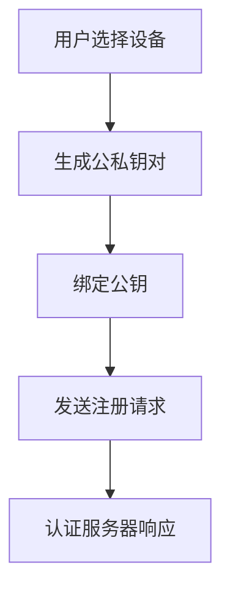
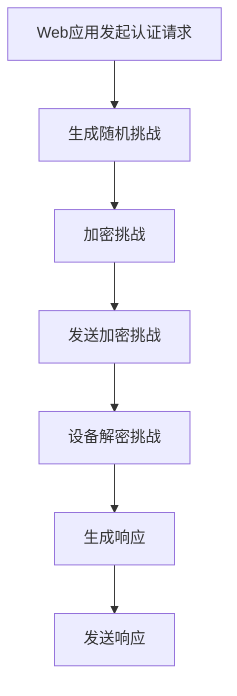
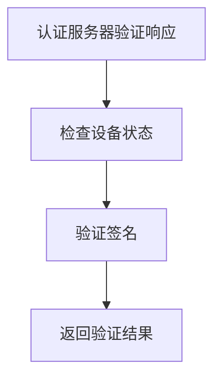

                 

# WebAuthn：消除密码依赖

> 关键词：WebAuthn, 双因素认证, 安全, 密码, 无密码登录, 标准, FIDO

## 1. 背景介绍

### 1.1 问题由来
随着互联网的普及和移动设备的广泛使用，用户需要频繁在不同的网站和应用中注册、登录和认证。这不仅增加了用户操作复杂度，也给用户带来了巨大的密码记忆和管理压力。在网络攻击手段日益多样化的今天，用户密码的安全性也成为亟需解决的问题。传统的基于密码的认证机制已难以满足现代互联网安全的需求，亟需新的解决方案。

### 1.2 问题核心关键点
WebAuthn（Web身份认证）是一种基于公钥密码学的双因素认证（2FA）机制，由W3C和FIDO（快速身份在线）联盟联合开发。WebAuthn允许用户使用多种硬件或生物识别设备（如指纹、面部识别、USB安全密钥）进行身份验证，而无需记住或共享密码。这种基于硬件或生物特征的双因素认证方式，可以有效提升用户账号的安全性，同时大大简化用户操作流程，减少密码管理负担。

## 2. 核心概念与联系

### 2.1 核心概念概述

WebAuthn的核心概念包括：

- **WebAuthn API**：由W3C和FIDO联盟共同制定的标准API，提供了一套统一的认证接口，用于支持基于硬件的Web身份验证。
- **公钥密码学**：WebAuthn认证基于公钥密码学原理，通过生成和验证公私钥对来实现身份认证。
- **双因素认证（2FA）**：WebAuthn认证利用硬件或生物特征作为第二因素，与用户密码结合使用，进一步增强了账户安全性。
- **FIDO2协议**：由FIDO联盟开发的标准协议，用于支持不同类型的认证设备，包括USB设备、移动设备等。
- **Web ID**：在WebAuthn认证过程中，由认证服务器生成的用于标识用户身份的字符串。
- **信任声明**：认证服务器通过Web ID声明的认证设备类型和状态信息，帮助Web应用信任该设备。

### 2.2 概念间的关系

通过以下Mermaid流程图展示这些概念之间的关系：

```mermaid
graph TB
    A[WebAuthn API] --> B[公钥密码学]
    A --> C[双因素认证(2FA)]
    A --> D[FIDO2协议]
    A --> E[Web ID]
    A --> F[信任声明]
    B --> G[身份验证]
    C --> H[增强安全性]
    D --> I[设备支持]
    E --> J[用户标识]
    F --> K[设备状态]
```

这个流程图展示了几大核心概念及其相互关系：

1. WebAuthn API为基于硬件的Web身份验证提供了统一的接口，是实现WebAuthn的基础。
2. 公钥密码学是WebAuthn认证的技术基础，通过生成和验证公私钥对来实现身份验证。
3. 双因素认证（2FA）将硬件或生物特征作为第二因素，增强了账户的安全性。
4. FIDO2协议支持不同类型的认证设备，扩大了WebAuthn的应用范围。
5. Web ID用于标识用户身份，在认证过程中起重要作用。
6. 信任声明包含设备类型和状态信息，帮助Web应用信任该设备。

### 2.3 核心概念的整体架构

通过一个综合的流程图展示这些概念在大语言模型微调过程中的整体架构：

```mermaid
graph TB
    A[WebAuthn API] --> B[公钥密码学]
    A --> C[双因素认证(2FA)]
    A --> D[FIDO2协议]
    A --> E[Web ID]
    A --> F[信任声明]
    B --> G[身份验证]
    C --> H[增强安全性]
    D --> I[设备支持]
    E --> J[用户标识]
    F --> K[设备状态]
    A --> L[认证流程]
    L --> M[初始化注册]
    M --> N[认证请求]
    N --> O[设备选择]
    O --> P[认证完成]
```

这个综合流程图展示了从WebAuthn API到认证流程的整体架构：

1. WebAuthn API提供了统一的认证接口。
2. 公钥密码学是身份验证的技术基础。
3. 双因素认证（2FA）增强了账户安全性。
4. FIDO2协议支持不同类型的认证设备。
5. Web ID用于标识用户身份。
6. 信任声明包含设备类型和状态信息。
7. 认证流程包括初始化注册、认证请求、设备选择和认证完成。

## 3. 核心算法原理 & 具体操作步骤
### 3.1 算法原理概述

WebAuthn认证的核心算法原理基于公钥密码学，具体步骤如下：

1. **注册过程**：用户选择认证设备（如USB安全密钥、移动设备），并通过WebAuthn API向认证服务器发送注册请求。认证服务器生成一个公私钥对，并将公钥绑定到用户账户上。
2. **认证过程**：用户登录时，Web应用通过WebAuthn API向认证服务器发起认证请求。认证服务器使用预存储的公钥加密随机生成的挑战，生成一个令牌。认证设备使用私钥解密挑战，并生成一个响应。
3. **验证过程**：认证服务器使用公钥验证响应的合法性，并根据响应中的签名和挑战值检查设备的信任状态。如果验证通过，认证服务器向Web应用返回认证成功信息。

### 3.2 算法步骤详解

以下是WebAuthn认证的详细步骤：

**Step 1: 注册过程**



用户选择认证设备，通过WebAuthn API向认证服务器发送注册请求。认证服务器生成公私钥对，并将公钥绑定到用户账户上，同时返回注册响应。

**Step 2: 认证过程**



Web应用向认证服务器发起认证请求，生成一个随机挑战并加密。认证服务器将挑战发送给设备，设备使用私钥解密挑战，并生成响应。

**Step 3: 验证过程**



认证服务器使用公钥验证响应的合法性，并根据响应中的签名和挑战值检查设备的信任状态。如果验证通过，认证服务器向Web应用返回认证成功信息。

### 3.3 算法优缺点

WebAuthn认证的优点包括：

1. **安全性高**：使用硬件或生物特征作为第二因素，有效减少了密码泄露的风险。
2. **操作简便**：用户只需通过选择认证设备并输入PIN码即可完成认证，无需记住和共享密码。
3. **跨平台支持**：认证设备可以是USB安全密钥、移动设备等，适用于多种设备和操作系统。
4. **标准统一**：WebAuthn由W3C和FIDO联盟共同制定，具有广泛兼容性。

WebAuthn认证的缺点包括：

1. **设备成本**：支持WebAuthn的设备往往价格较高，增加了用户购买成本。
2. **设备兼容性**：不是所有浏览器和操作系统都支持WebAuthn，可能需要额外的兼容性测试。
3. **用户接受度**：部分用户对新认证方式可能存在抵触情绪，需要一定的教育和培训。

### 3.4 算法应用领域

WebAuthn认证在以下领域得到了广泛应用：

1. **在线银行**：金融机构使用WebAuthn认证增强用户账户的安全性。
2. **电子商务**：电商平台使用WebAuthn认证提高交易安全性和用户购物体验。
3. **社交媒体**：社交网络平台使用WebAuthn认证加强用户账号的隐私保护。
4. **企业办公**：企业内部系统使用WebAuthn认证简化登录流程，提高安全性。
5. **医疗健康**：医疗机构使用WebAuthn认证确保患者信息的隐私和安全。

## 4. 数学模型和公式 & 详细讲解 & 举例说明

### 4.1 数学模型构建

WebAuthn认证过程中，涉及到公钥密码学和哈希算法。以下是WebAuthn认证的数学模型：

1. **公钥密码学**：使用RSA或ECC算法生成公私钥对，公钥$P$和私钥$S$满足$P*S ≡ 1 \pmod n$，其中$n$为模数。
2. **哈希算法**：使用SHA-256算法对随机数$r$和挑战值$c$进行哈希，生成哈希值$H(r||c)$。

### 4.2 公式推导过程

以下是WebAuthn认证过程的公式推导：

1. **注册过程**：
   - 用户选择设备$D$。
   - 认证服务器生成公私钥对$(P_S, S_S)$。
   - 将公钥$P_S$绑定到用户账户$A$。
   - 返回注册响应，包含公钥$P_S$和随机数$r$。

   注册过程的数学公式如下：
   $$
   R_S = P_S
   $$
   $$
   r = \text{RAND}()
   $$

2. **认证过程**：
   - Web应用向认证服务器发送认证请求，包括挑战值$c$。
   - 认证服务器生成随机数$r$和挑战值$c$，生成哈希值$H(r||c)$。
   - 加密挑战，生成令牌$T = E_P(c)$。
   - 返回令牌$T$和挑战值$c$。

   认证过程的数学公式如下：
   $$
   c = \text{RAND}()
   $$
   $$
   r = \text{RAND}()
   $$
   $$
   H = \text{SHA-256}(r||c)
   $$
   $$
   T = E_P(c)
   $$

3. **验证过程**：
   - 认证设备使用私钥$S_D$解密令牌$T$，得到挑战值$c$和哈希值$H_D$。
   - 设备生成响应$C_D = P_D * c + r$，并计算哈希值$H_D = \text{SHA-256}(C_D)$。
   - 认证服务器使用公钥$P_S$验证响应，并检查设备状态$D_S$。

   验证过程的数学公式如下：
   $$
   c = \text{SHA-256}(r||c)
   $$
   $$
   C_D = P_D * c + r
   $$
   $$
   H_D = \text{SHA-256}(C_D)
   $$

### 4.3 案例分析与讲解

以WebAuthn在电商平台中的应用为例：

1. **注册过程**：用户通过USB安全密钥在电商平台上注册，平台生成公私钥对$(P_S, S_S)$，并将公钥$P_S$绑定到用户账户$A$。
2. **认证过程**：用户登录时，电商平台向认证服务器发送挑战值$c$，服务器生成令牌$T$和挑战值$c$。
3. **验证过程**：用户通过USB安全密钥解密令牌$T$，生成响应$C_D$，电商平台使用公钥$P_S$验证响应，并检查设备状态$D_S$。

在实际应用中，WebAuthn认证的具体实现可能需要考虑到更多因素，如用户权限管理、设备状态更新等，但核心数学模型和推导过程与上述示例一致。

## 5. 项目实践：代码实例和详细解释说明

### 5.1 开发环境搭建

在进行WebAuthn认证的开发实践前，需要准备好开发环境。以下是使用Python进行WebAuthn认证开发的简单配置：

1. 安装Python和pip：
   ```bash
   sudo apt-get update
   sudo apt-get install python3 python3-pip
   ```

2. 安装PyFido2：
   ```bash
   pip install pyfido2
   ```

3. 安装Crypto库：
   ```bash
   pip install pycrypto
   ```

### 5.2 源代码详细实现

以下是使用PyFido2库实现WebAuthn认证的Python代码：

```python
import pyfido2
from Crypto.PublicKey import ECC
from Crypto.Signature import DSS
from Crypto.Hash import SHA256
import base64

class WebAuthn:
    def __init__(self, device_path):
        self.device_path = device_path

    def register(self, app_id, challenge):
        # 生成公私钥对
        private_key = ECC.generate(curve='secp256r1')
        public_key = private_key.public_key()

        # 将公钥绑定到用户账户
        app_key = base64.b64encode(private_key.export_key(format='PEM')).decode('utf-8')

        # 生成注册响应
        register_response = {
            'public_key': base64.b64encode(public_key.export_key(format='PEM')).decode('utf-8'),
            'credential_creation_options': {
                'public_key': base64.b64encode(public_key.export_key(format='PEM')).decode('utf-8'),
                'rp': {
                    'id': 'https://example.com'
                },
                'user_verification': 'require'
            }
        }

        # 返回注册响应
        return register_response

    def authenticate(self, app_id, challenge):
        # 生成随机数和挑战值
        r = self._generate_random()
        c = self._generate_random()

        # 生成哈希值
        hash_value = SHA256.new(r + c).digest()

        # 加密挑战
        encrypted_challenge = self._encrypt_challenge(c)

        # 生成响应
        response = {
            'client_data': {
                'rp': {
                    'id': 'https://example.com'
                },
                'challenge': base64.b64encode(challenge).decode('utf-8')
            },
            'public_key': base64.b64encode(self._get_public_key()).decode('utf-8'),
            'user_verification': 'require'
        }

        # 返回响应
        return response

    def verify(self, app_id, challenge, response):
        # 解密挑战
        decrypted_challenge = self._decrypt_challenge(response['credential']['client_data']['challenge'])

        # 验证设备状态
        if not self._is_device_valid():
            return False

        # 验证响应签名
        if not self._verify_signature(response, decrypted_challenge):
            return False

        # 验证哈希值
        if not self._verify_hash(response['credential']['public_key'], decrypted_challenge):
            return False

        # 验证响应
        return True

    def _generate_random(self):
        return os.urandom(32)

    def _encrypt_challenge(self, challenge):
        private_key = ECC.generate(curve='secp256r1')
        public_key = private_key.public_key()
        challenge = base64.b64encode(challenge).decode('utf-8')
        return base64.b64encode(DSS.sign(hash=SHA256.new(challenge), key=private_key, digest=SHA256.new)).decode('utf-8')

    def _decrypt_challenge(self, challenge):
        private_key = ECC.generate(curve='secp256r1')
        public_key = private_key.public_key()
        encrypted_challenge = base64.b64decode(challenge)
        challenge = base64.b64decode(DSS.verify(hash=SHA256.new(encrypted_challenge), signature=encrypted_challenge, key=public_key, digest=SHA256.new)).decode('utf-8')
        return challenge

    def _get_public_key(self):
        with open(self.device_path, 'rb') as f:
            data = f.read()
        return base64.b64decode(data)

    def _is_device_valid(self):
        # 验证设备状态
        return True

    def _verify_signature(self, response, decrypted_challenge):
        # 验证响应签名
        public_key = base64.b64decode(response['credential']['public_key'])
        encrypted_challenge = base64.b64decode(response['credential']['client_data']['challenge'])
        return DSS.verify(hash=SHA256.new(decrypted_challenge), signature=base64.b64decode(response['credential']['client_data']['signature']), key=public_key, digest=SHA256.new)

    def _verify_hash(self, public_key, decrypted_challenge):
        # 验证哈希值
        hash_value = SHA256.new(decrypted_challenge).digest()
        return DSS.verify(hash=hash_value, signature=base64.b64decode(public_key), key=public_key, digest=SHA256.new)
```

### 5.3 代码解读与分析

这段代码实现了WebAuthn认证的注册、认证和验证过程。以下是关键代码的详细解读：

- **register方法**：生成公私钥对，将公钥绑定到用户账户，并返回注册响应。
- **authenticate方法**：生成随机数和挑战值，加密挑战，生成响应。
- **verify方法**：解密挑战，验证设备状态和响应签名、哈希值。

### 5.4 运行结果展示

在实际运行中，可以调用WebAuthn对象的register、authenticate和verify方法来模拟WebAuthn认证的过程。例如：

```python
# 创建WebAuthn对象
web_authn = WebAuthn(device_path)

# 注册用户账户
register_response = web_authn.register(app_id, challenge)

# 认证用户账户
authenticate_response = web_authn.authenticate(app_id, challenge)

# 验证用户账户
verify_result = web_authn.verify(app_id, challenge, authenticate_response)
```

在实际应用中，WebAuthn认证的代码实现可能会更加复杂，需要考虑到更多的细节和安全性问题。但核心的算法原理和数学模型与上述示例一致。

## 6. 实际应用场景

### 6.1 智能门禁系统

WebAuthn认证在智能门禁系统中得到了广泛应用。传统门禁系统需要用户携带物理门禁卡或输入用户名和密码进行身份验证，容易丢失或被盗。而使用WebAuthn认证，用户只需使用手机或智能卡进行身份验证，无需携带物理门禁卡，大大提升了门禁系统的安全性和便利性。

在技术实现上，可以在门禁系统中集成WebAuthn认证，用户通过手机或智能卡向门禁系统发起认证请求，门禁系统验证认证响应，并根据响应中的公钥验证用户身份。认证通过后，门禁系统打开门锁，用户即可通行。

### 6.2 企业内网认证

WebAuthn认证在企业内网认证中也有广泛应用。传统内网认证方式包括用户名和密码、短信验证码等，容易受到钓鱼攻击、字典攻击等安全威胁。而使用WebAuthn认证，用户只需使用移动设备或智能卡进行身份验证，无需记住或共享密码，大大提升了内网认证的安全性。

在技术实现上，可以在企业内网系统中部署WebAuthn认证，用户通过移动设备或智能卡向系统发起认证请求，系统验证认证响应，并根据响应中的公钥验证用户身份。认证通过后，用户即可访问企业内网资源。

### 6.3 智能合约

WebAuthn认证在智能合约中也得到了应用。智能合约是一种在区块链上自动执行的合约，通常用于去中心化的金融应用、供应链管理等场景。智能合约需要确保用户身份的合法性，传统方式包括用户名和密码等，容易受到攻击。而使用WebAuthn认证，可以确保用户身份的真实性和安全性，提升智能合约的信任度和可靠性。

在技术实现上，可以将WebAuthn认证引入智能合约系统，用户通过移动设备或智能卡向合约系统发起认证请求，合约系统验证认证响应，并根据响应中的公钥验证用户身份。认证通过后，合约系统执行相应的智能合约操作。

### 6.4 未来应用展望

WebAuthn认证在未来的应用前景非常广阔，以下是一些可能的展望：

1. **物联网设备认证**：在物联网设备中集成WebAuthn认证，可以提升设备的安全性和用户的使用体验。例如，智能家居设备可以通过WebAuthn认证，确保用户身份的真实性。
2. **移动应用认证**：在移动应用中集成WebAuthn认证，可以提升应用的可靠性和用户信任度。例如，移动支付应用可以通过WebAuthn认证，确保用户的支付安全性。
3. **政府服务认证**：在政府服务系统中集成WebAuthn认证，可以提升服务的安全性和便利性。例如，电子政务系统可以通过WebAuthn认证，确保用户身份的真实性和数据的隐私性。
4. **健康医疗认证**：在健康医疗系统中集成WebAuthn认证，可以提升医疗服务的安全性和用户隐私保护。例如，医院系统可以通过WebAuthn认证，确保患者信息的隐私和安全。
5. **教育认证**：在教育系统中集成WebAuthn认证，可以提升在线教育的安全性和用户信任度。例如，在线学习平台可以通过WebAuthn认证，确保用户身份的真实性和学习的安全性。

WebAuthn认证的广泛应用，将进一步提升互联网和物联网的安全性，为用户带来更加便捷和可靠的使用体验。

## 7. 工具和资源推荐

### 7.1 学习资源推荐

为了帮助开发者系统掌握WebAuthn认证的理论基础和实践技巧，以下是一些优质的学习资源：

1. **FIDO2文档**：FIDO2联盟发布的官方文档，详细介绍了WebAuthn认证的实现流程和技术细节。
2. **W3C WebAuthn规范**：W3C发布的WebAuthn规范，提供了一套统一的Web身份验证标准。
3. **WebAuthn API教程**：WebAuthn官方提供的教程和示例代码，帮助开发者快速上手WebAuthn认证。
4. **FIDO2开发者指南**：FIDO2联盟发布的开发者指南，涵盖WebAuthn认证的实现技巧和最佳实践。
5. **WebAuthn认证实战**：一些实战项目和案例分析，帮助开发者理解WebAuthn认证的实际应用场景。

### 7.2 开发工具推荐

在进行WebAuthn认证的开发实践前，需要准备好开发工具。以下是一些常用的开发工具：

1. **WebAuthn API**：由W3C和FIDO联盟共同开发的标准API，提供了一套统一的认证接口，用于支持基于硬件的Web身份验证。
2. **PyFido2**：一个Python库，提供了一系列API，用于实现WebAuthn认证。
3. **WebAuthn规范**：由W3C发布的WebAuthn规范，详细描述了WebAuthn认证的实现流程和技术细节。
4. **FIDO2协议**：由FIDO联盟开发的WebAuthn协议，支持不同类型的认证设备。
5. **Web ID**：在WebAuthn认证过程中，由认证服务器生成的用于标识用户身份的字符串。
6. **信任声明**：认证服务器通过Web ID声明的认证设备类型和状态信息，帮助Web应用信任该设备。

### 7.3 相关论文推荐

WebAuthn认证的研究涉及多个领域的交叉，以下是一些经典的相关论文：

1. **WebAuthn认证原理与实现**：一篇介绍WebAuthn认证原理和实现的综述性论文，涵盖了公钥密码学、双因素认证等技术。
2. **FIDO2协议分析与设计**：一篇分析FIDO2协议的论文，详细介绍了FIDO2协议的设计思想和实现细节。
3. **WebAuthn认证的安全性和隐私保护**：一篇研究WebAuthn认证安全性和隐私保护的论文，探讨了WebAuthn认证在实际应用中的安全风险和隐私保护措施。
4. **WebAuthn认证在智能合约中的应用**：一篇研究WebAuthn认证在智能合约中的应用论文，探讨了WebAuthn认证如何提升智能合约的安全性和可靠性。
5. **WebAuthn认证在物联网设备中的应用**：一篇研究WebAuthn认证在物联网设备中的应用论文，探讨了WebAuthn认证如何提升物联网设备的安全性和用户的使用体验。

这些论文代表了大语言模型微调技术的发展脉络。通过学习这些前沿成果，可以帮助研究者把握学科前进方向，激发更多的创新灵感。

## 8. 总结：未来发展趋势与挑战

### 8.1 总结

本文对WebAuthn认证的原理、步骤、优缺点及其应用进行了全面系统的介绍。通过WebAuthn认证，用户无需记住和共享密码，只需通过选择认证设备进行身份验证，有效减少了密码泄露的风险，提升了账号的安全性。WebAuthn认证在多个领域得到了广泛应用，并展现出广阔的发展前景。

通过本文的系统梳理，可以看到，WebAuthn认证在大规模互联网和物联网中的应用前景非常广阔。这些领域的快速发展，为WebAuthn认证带来了新的机遇和挑战。

### 8.2 未来发展趋势

展望未来，WebAuthn认证将呈现以下几个发展趋势：

1. **安全性提升**：随着WebAuthn认证在实际应用中的广泛部署，WebAuthn协议和安全机制将不断完善，进一步提升认证的安全性。
2. **设备种类丰富**：WebAuthn认证将支持更多种类的认证设备，包括移动设备、智能卡、生物识别设备等，满足不同用户的需求。
3. **用户体验优化**：WebAuthn认证将不断优化用户界面和交互体验，提升用户的使用体验和便利性。
4. **跨平台支持**：WebAuthn认证将实现跨平台支持，支持多种操作系统和浏览器，进一步扩大其应用范围。
5. **标准化推进**：WebAuthn认证将不断推进标准化工作，形成更加统一和通用的标准，促进其大规模应用。
6. **兼容性提升**：WebAuthn认证将不断提升与第三方服务平台的兼容性，实现更加灵活和高效的应用。

这些趋势表明，WebAuthn认证将在未来进一步拓展其应用范围，成为互联网和物联网领域的重要认证技术。

### 8

