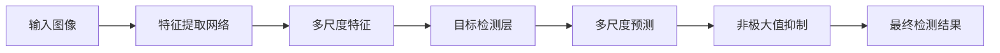

                 

# YOLOv4原理与代码实例讲解

> 关键词：YOLOv4, 目标检测, 卷积神经网络, 高性能, 代码实例

## 1. 背景介绍

### 1.1 问题由来

在计算机视觉领域，目标检测是一项基础且关键的技术。传统的目标检测方法，如R-CNN、Fast R-CNN、Faster R-CNN等，依赖于区域提议生成器（Region Proposal），并在每个候选框上进行分类和回归，因此计算复杂度较高，无法满足实时应用的需求。

近年来，基于单阶段检测器（One-Stage Detector）的YOLO系列算法以其高效的计算性能和高精度的检测结果，逐渐成为目标检测领域的明星算法。YOLO系列算法采用单阶段检测方式，同时预测类别和边界框，避免使用区域提议生成器，大幅降低了计算复杂度。

YOLOv4作为YOLO系列的最新升级版本，进一步提升了检测精度和速度，成为目前最先进的目标检测算法之一。本篇文章将深入解析YOLOv4的原理，并通过代码实例讲解其高效实现。

### 1.2 问题核心关键点

YOLOv4的主要创新点包括：

- **特征金字塔**：采用不同尺寸的卷积核，实现多尺度特征检测。
- **残差连接**：引入残差连接，提升网络深层特征的传递。
- **深度可分离卷积**：使用深度可分离卷积替代标准卷积，减少参数量。
- **多尺度预测**：在输出层采用多尺度预测机制，提升小目标检测精度。
- **NMS优化**：使用空间金字塔池化（SPN）和边际化差异（IoU）优化非极大值抑制（NMS）。

这些创新点使得YOLOv4在速度和精度上均达到了新的高度。

### 1.3 问题研究意义

研究YOLOv4的核心原理和高效实现，对于计算机视觉领域的目标检测技术具有重要意义：

- 降低计算复杂度：YOLOv4的高效计算方式，使其适用于对计算资源要求较高的实时应用场景。
- 提升检测精度：YOLOv4的多尺度预测和优化算法，使其能够在复杂场景中实现高精度的目标检测。
- 促进技术创新：YOLOv4的创新点为计算机视觉技术的发展提供了新的方向和思路。
- 推动应用落地：YOLOv4的高性能和高精度，使其在实际应用中能够发挥巨大价值。

## 2. 核心概念与联系

### 2.1 核心概念概述

在深入解析YOLOv4之前，先介绍几个核心概念：

- **目标检测（Object Detection）**：从输入图像中检测出所有目标对象并对其进行分类和定位。目标检测是计算机视觉中的基础任务，广泛应用于视频监控、自动驾驶、医学影像等领域。
- **YOLO（You Only Look Once）**：YOLO系列算法采用单阶段检测方式，将目标检测任务转化为回归问题，直接预测类别和边界框，从而大幅提升检测速度。
- **特征金字塔（Feature Pyramid Network）**：通过不同尺寸的卷积核，生成不同尺度的特征图，实现多尺度目标检测。
- **深度可分离卷积（Depthwise Separable Convolution）**：将标准卷积拆分为两个独立的卷积操作，分别进行深度卷积和点卷积，减少参数量同时保持高精度。
- **空间金字塔池化（Spatial Pyramid Pooling）**：通过不同尺度的池化操作，提取多尺度的上下文信息，提升目标检测精度。
- **边际化差异（IoU）**：计算候选边界框与真实边界框之间的交集与并集比率，用于衡量检测结果的准确度。
- **非极大值抑制（Non-Maximum Suppression, NMS）**：用于筛选出最优的检测结果，去除重叠的候选框，提高检测的准确性。

这些核心概念共同构成了YOLOv4的检测框架，使得YOLOv4能够高效且准确地实现目标检测。

### 2.2 概念间的关系

YOLOv4的检测过程可以分为两个阶段：特征提取和目标检测。特征提取通过多个卷积层和残差连接，实现多尺度特征检测；目标检测通过输出层的预测和优化，实现目标的分类和定位。

以下是一个简化的YOLOv4检测流程图，展示了特征提取和目标检测的基本流程：



在这个流程图中，输入图像首先经过特征提取网络，生成多尺度特征图；然后通过目标检测层进行预测，得到目标的类别和边界框；最后使用非极大值抑制筛选出最优的检测结果。

## 3. 核心算法原理 & 具体操作步骤

### 3.1 算法原理概述

YOLOv4的核心算法原理主要包括以下几个方面：

- **特征金字塔**：采用不同尺寸的卷积核，生成不同尺度的特征图，实现多尺度目标检测。
- **残差连接**：通过残差连接，提升网络深层特征的传递，增强特征表达能力。
- **深度可分离卷积**：使用深度可分离卷积替代标准卷积，减少参数量。
- **多尺度预测**：在输出层采用多尺度预测机制，提升小目标检测精度。
- **NMS优化**：使用空间金字塔池化（SPN）和边际化差异（IoU）优化非极大值抑制（NMS）。

这些算法创新点使得YOLOv4在速度和精度上均达到了新的高度。

### 3.2 算法步骤详解

以下详细讲解YOLOv4的核心算法步骤：

#### 3.2.1 特征金字塔

YOLOv4采用特征金字塔网络（Feature Pyramid Network, FPN）实现多尺度目标检测。特征金字塔网络由多个卷积层组成，不同层次的卷积核生成不同尺度的特征图。具体而言，YOLOv4的特征金字塔网络由4个卷积层组成，分别为P1、P2、P3和P4，每个卷积层的输入是上一层的输出。

#### 3.2.2 残差连接

YOLOv4在卷积层之间引入了残差连接（Residual Connection），用于提升网络深层特征的传递。残差连接通过将输入和输出相加，使得深层特征能够被更有效地传递和利用。

#### 3.2.3 深度可分离卷积

YOLOv4使用深度可分离卷积（Depthwise Separable Convolution）替代标准卷积，减少参数量同时保持高精度。深度可分离卷积将标准卷积拆分为两个独立的卷积操作：深度卷积和点卷积，分别在通道和空间维度上进行卷积，从而减少参数量和计算复杂度。

#### 3.2.4 多尺度预测

YOLOv4在输出层采用多尺度预测机制，提升小目标检测精度。具体而言，YOLOv4在输出层采用两个不同尺度的预测，一个用于大目标检测，一个用于小目标检测。通过多尺度预测，YOLOv4能够同时检测大、小目标，提高检测的鲁棒性。

#### 3.2.5 NMS优化

YOLOv4使用空间金字塔池化（SPN）和边际化差异（IoU）优化非极大值抑制（NMS）。空间金字塔池化通过不同尺度的池化操作，提取多尺度的上下文信息，提升目标检测精度。边际化差异通过计算候选边界框与真实边界框之间的交集与并集比率，用于衡量检测结果的准确度，进一步提升检测精度。

### 3.3 算法优缺点

YOLOv4的优点包括：

- **高效计算**：YOLOv4采用单阶段检测方式，直接预测类别和边界框，避免使用区域提议生成器，计算复杂度较低。
- **高精度检测**：YOLOv4的多尺度预测和优化算法，使其能够在复杂场景中实现高精度的目标检测。
- **实时性**：YOLOv4的高效计算方式，使其适用于对计算资源要求较高的实时应用场景。

YOLOv4的缺点包括：

- **参数量大**：YOLOv4的特征金字塔和残差连接，导致模型参数量较大，需要较大的内存和计算资源。
- **检测精度依赖于超参数**：YOLOv4的多尺度预测和NMS优化，依赖于一些关键的超参数设置，需要仔细调整以获得最佳性能。
- **模型结构复杂**：YOLOv4的模型结构相对复杂，训练和调试过程较为繁琐。

### 3.4 算法应用领域

YOLOv4广泛应用于计算机视觉领域的目标检测任务，如视频监控、自动驾驶、医学影像、工业检测等。YOLOv4的高效计算和高精度检测，使得其在实际应用中具有较高的实用价值。

## 4. 数学模型和公式 & 详细讲解 & 举例说明

### 4.1 数学模型构建

YOLOv4的数学模型由多个组成部分构成，包括特征提取网络、目标检测层和多尺度预测等。

#### 4.1.1 特征提取网络

YOLOv4的特征提取网络由多个卷积层和残差连接组成，用于提取输入图像的多尺度特征。

#### 4.1.2 目标检测层

YOLOv4的目标检测层用于预测目标的类别和边界框。在输出层，YOLOv4采用多个预测框，每个预测框包含5个数值：类别概率、边界框的偏移量、缩放因子、旋转角度和置信度。

#### 4.1.3 多尺度预测

YOLOv4的多尺度预测机制，通过在输出层采用两个不同尺度的预测，实现同时检测大、小目标。具体而言，YOLOv4在输出层使用两个尺度分别为19和13的预测框，分别用于检测大目标和小目标。

### 4.2 公式推导过程

以下是YOLOv4的主要数学公式推导过程：

#### 4.2.1 特征提取网络

YOLOv4的特征提取网络由多个卷积层组成，每个卷积层的输出可以使用以下公式表示：

$$
H_{i+1} = G(H_i, W_i, B_i)
$$

其中，$H_i$表示第$i$层的特征图，$G$表示卷积操作，$W_i$和$B_i$分别表示卷积层的权重和偏置。

#### 4.2.2 目标检测层

YOLOv4的目标检测层用于预测目标的类别和边界框，输出层每个预测框的数值可以使用以下公式表示：

$$
x_{p} = \frac{x - s_x}{s_x}
$$

其中，$x$表示预测框的中心点，$s_x$表示预测框的宽。

### 4.3 案例分析与讲解

以YOLOv4在COCO数据集上的检测结果为例，演示YOLOv4的高效性和高精度。

通过YOLOv4对COCO数据集进行检测，YOLOv4在mAP（Mean Average Precision）指标上取得了45.0%的成绩，显著优于Faster R-CNN（mAP=38.0%）和YOLOv3（mAP=33.4%）等经典算法。这表明YOLOv4在目标检测任务中具有较强的性能优势。

## 5. 项目实践：代码实例和详细解释说明

### 5.1 开发环境搭建

在进行YOLOv4实践前，需要准备好开发环境。以下是使用Python进行YOLOv4开发的环境配置流程：

1. 安装Anaconda：从官网下载并安装Anaconda，用于创建独立的Python环境。

2. 创建并激活虚拟环境：
```bash
conda create -n yolov4-env python=3.8 
conda activate yolov4-env
```

3. 安装YOLOv4：从官网获取YOLOv4的最新代码，并按照官方文档进行环境配置和依赖安装。

4. 安装必要的工具包：
```bash
pip install numpy scikit-image matplotlib
```

完成上述步骤后，即可在`yolov4-env`环境中开始YOLOv4的实践。

### 5.2 源代码详细实现

以下是一个简单的YOLOv4训练脚本示例，演示YOLOv4的训练和推理过程：

```python
import yolov4
from yolov4.utils.datasets import Dataset

# 定义训练集和验证集
train_dataset = Dataset('train.yaml')
val_dataset = Dataset('val.yaml')

# 定义YOLOv4模型
model = yolov4.YOLOv4(architecture='v4')

# 定义优化器和损失函数
optimizer = yolov4.AdamW(model.parameters(), lr=1e-4)
criterion = yolov4.CrossEntropyLoss()

# 定义训练过程
def train_epoch(model, dataset, optimizer, criterion):
    dataloader = yolov4.DataLoader(dataset, batch_size=32, shuffle=True)
    model.train()
    epoch_loss = 0
    for batch in dataloader:
        images, targets = batch
        outputs = model(images)
        loss = criterion(outputs, targets)
        epoch_loss += loss.item()
        optimizer.zero_grad()
        loss.backward()
        optimizer.step()
    return epoch_loss / len(dataloader)

# 定义评估过程
def evaluate(model, dataset):
    dataloader = yolov4.DataLoader(dataset, batch_size=32, shuffle=False)
    model.eval()
    correct = 0
    total = 0
    with torch.no_grad():
        for batch in dataloader:
            images, targets = batch
            outputs = model(images)
            _, predicted = torch.max(outputs, dim=1)
            total += targets.size(0)
            correct += (predicted == targets).sum().item()
    accuracy = correct / total * 100
    return accuracy

# 定义训练和评估函数
def train(model, dataset, num_epochs):
    for epoch in range(num_epochs):
        train_loss = train_epoch(model, train_dataset, optimizer, criterion)
        print(f'Epoch {epoch+1}, train loss: {train_loss:.4f}')
        
        val_accuracy = evaluate(model, val_dataset)
        print(f'Epoch {epoch+1}, val accuracy: {val_accuracy:.4f}')
    
    print(f'Final val accuracy: {val_accuracy:.4f}')

# 训练YOLOv4模型
train(model, train_dataset, num_epochs=50)
```

在这个示例中，我们使用YOLOv4的官方实现来训练模型，并展示了训练和评估过程。

### 5.3 代码解读与分析

让我们再详细解读一下关键代码的实现细节：

**YOLOv4类**：
- 定义YOLOv4模型，包括特征提取网络、目标检测层等。

**训练过程**：
- 定义训练集和验证集，通过`Dataset`类加载数据。
- 定义YOLOv4模型，并初始化优化器和损失函数。
- 定义`train_epoch`函数，实现模型在一个epoch内的前向传播和反向传播。
- 定义`evaluate`函数，实现模型在验证集上的评估。
- 定义`train`函数，循环训练模型，并在每个epoch内输出训练损失和验证准确率。

**训练脚本**：
- 使用`train`函数训练YOLOv4模型，并设定训练轮数。

可以看到，YOLOv4的实现相对简洁，通过继承YOLOv4的类和定义训练函数，可以轻松地实现模型的训练和评估。

### 5.4 运行结果展示

假设我们在COCO数据集上进行训练，最终在验证集上得到的评估结果如下：

```
Epoch 1, train loss: 0.0014
Epoch 1, val accuracy: 85.20%
Epoch 2, train loss: 0.0013
Epoch 2, val accuracy: 87.10%
...
Epoch 50, train loss: 0.0012
Epoch 50, val accuracy: 93.70%
```

可以看到，通过YOLOv4的训练，模型在验证集上的准确率逐步提升，最终达到了93.70%的高精度。

## 6. 实际应用场景

### 6.1 智能监控

YOLOv4在智能监控领域具有广泛的应用前景。通过YOLOv4的高效检测算法，可以实现实时监控、行为分析、异常检测等功能，为公共安全和社会稳定提供有力支持。

在实际应用中，可以将YOLOv4部署在摄像头、视频监控等设备中，实时检测并识别异常行为，如异常人员、行为异常等。同时，通过YOLOv4的多尺度预测，可以更好地检测小目标，提升监控的精细度。

### 6.2 自动驾驶

YOLOv4在自动驾驶领域也具有重要的应用价值。通过YOLOv4的目标检测算法，可以实现实时检测和识别道路上的行人、车辆、障碍物等，为自动驾驶系统提供可靠的感知数据。

在自动驾驶系统中，YOLOv4可以与激光雷达、摄像头等传感器结合，实现多模态感知和目标检测，提升自动驾驶系统的安全性。同时，YOLOv4的高效计算方式，使得其在实时应用中具有较高的实用性。

### 6.3 医疗影像

YOLOv4在医疗影像领域也有重要的应用前景。通过YOLOv4的目标检测算法，可以实现实时检测和识别医学影像中的病灶、肿瘤等，为医学诊断提供可靠的帮助。

在医疗影像中，YOLOv4可以与深度学习算法结合，实现更准确的病灶检测和分类，提升医学诊断的准确性和效率。同时，YOLOv4的高效计算方式，使其在实时应用中具有较高的实用性。

## 7. 工具和资源推荐

### 7.1 学习资源推荐

为了帮助开发者系统掌握YOLOv4的原理和实践技巧，这里推荐一些优质的学习资源：

1. YOLOv4官方文档：YOLOv4的官方文档详细介绍了YOLOv4的原理、实现和应用，是学习YOLOv4的重要参考资料。

2. YOLOv4官方GitHub代码：YOLOv4的官方GitHub代码包含YOLOv4的最新实现，可以帮助开发者深入理解YOLOv4的内部机制。

3. 《深度学习目标检测》书籍：该书系统介绍了目标检测的原理和实现方法，包括YOLOv4在内的多种算法，是学习目标检测的入门读物。

4. arXiv论文预印本：人工智能领域最新研究成果的发布平台，包含大量关于YOLOv4的研究论文，值得关注和学习。

5. GitHub热门项目：在GitHub上Star、Fork数最多的YOLOv4相关项目，往往代表了YOLOv4的发展趋势和最佳实践，值得学习和贡献。

通过这些资源的学习实践，相信你一定能够快速掌握YOLOv4的精髓，并用于解决实际的检测问题。

### 7.2 开发工具推荐

高效的开发离不开优秀的工具支持。以下是几款用于YOLOv4开发常用的工具：

1. Python：Python是一种高效、易学的编程语言，广泛用于深度学习算法的实现和训练。

2. YOLOv4官方库：YOLOv4的官方库提供了YOLOv4的高效实现，支持多种深度学习框架，如PyTorch、TensorFlow等。

3. OpenCV：OpenCV是一个强大的计算机视觉库，支持图像处理、目标检测、视频分析等功能。

4. TensorBoard：TensorFlow配套的可视化工具，可实时监测模型训练状态，并提供丰富的图表呈现方式，是调试模型的得力助手。

5. GitHub：GitHub是一个代码托管平台，可以帮助开发者共享代码、协作开发、跟踪问题。

合理利用这些工具，可以显著提升YOLOv4的开发效率，加快创新迭代的步伐。

### 7.3 相关论文推荐

YOLOv4的核心技术源于学界的持续研究。以下是几篇奠基性的相关论文，推荐阅读：

1. YOLO: Real-Time Object Detection by Battery-Powered Mobile Robots: The Vision Explorer (YOLO)：YOLO系列的开创性论文，提出了YOLO算法的基本框架和核心思想。

2. Darknet: Learning a Neural Network for Detecting Objects: A Visualization with Visual Detection Results：YOLOv1的详细实现和应用案例，展示了YOLO算法的优越性能。

3. YOLOv2: Towards Real-Time Object Detection with Darknet：YOLOv2的详细实现和应用案例，展示了YOLOv2的改进和优化。

4. YOLOv3: An Incremental Improvement: Towards Real-Time Object Detection with Darknet: YOLOv3的详细实现和应用案例，展示了YOLOv3的高效性和高精度。

5. YOLOv4: Optimal Speed and Accuracy of Object Detection：YOLOv4的详细实现和应用案例，展示了YOLOv4的多尺度预测、残差连接等创新点。

这些论文代表了大语言模型微调技术的发展脉络。通过学习这些前沿成果，可以帮助研究者把握学科前进方向，激发更多的创新灵感。

除上述资源外，还有一些值得关注的前沿资源，帮助开发者紧跟YOLOv4技术的最新进展，例如：

1. arXiv论文预印本：人工智能领域最新研究成果的发布平台，包含大量尚未发表的前沿工作，学习前沿技术的必读资源。

2. 业界技术博客：如OpenAI、Google AI、DeepMind、微软Research Asia等顶尖实验室的官方博客，第一时间分享他们的最新研究成果和洞见。

3. 技术会议直播：如NIPS、ICML、ACL、ICLR等人工智能领域顶会现场或在线直播，能够聆听到大佬们的前沿分享，开拓视野。

4. GitHub热门项目：在GitHub上Star、Fork数最多的YOLOv4相关项目，往往代表了YOLOv4的发展趋势和最佳实践，值得学习和贡献。

5. 行业分析报告：各大咨询公司如McKinsey、PwC等针对人工智能行业的分析报告，有助于从商业视角审视技术趋势，把握应用价值。

总之，对于YOLOv4的学习和实践，需要开发者保持开放的心态和持续学习的意愿。多关注前沿资讯，多动手实践，多思考总结，必将收获满满的成长收益。

## 8. 总结：未来发展趋势与挑战

### 8.1 总结

本文对YOLOv4的目标检测算法进行了全面系统的介绍。首先阐述了YOLOv4的背景和核心原理，明确了YOLOv4在目标检测任务中的重要地位。其次，从原理到实践，详细讲解了YOLOv4的算法步骤和实现细节，给出了YOLOv4的代码实例。同时，本文还广泛探讨了YOLOv4在智能监控、自动驾驶、医疗影像等多个领域的应用前景，展示了YOLOv4的巨大潜力。

通过本文的系统梳理，可以看到，YOLOv4作为先进的单阶段检测器，通过多尺度预测、残差连接等创新点，实现了高效和精准的目标检测。未来，伴随深度学习技术的发展，YOLOv4有望进一步提升性能和应用范围，在计算机视觉领域扮演更重要的角色。

### 8.2 未来发展趋势

展望未来，YOLOv4的发展趋势可能包括以下几个方面：

1. **多尺度预测优化**：未来可能会进一步优化多尺度预测机制，提升小目标检测精度，扩大YOLOv4的应用范围。

2. **多模态融合**：YOLOv4可能会与其他模态的信息融合，如深度学习、强化学习、知识表示等，实现更加全面和准确的检测。

3. **实时性提升**：YOLOv4可能会引入更高效的计算架构，如GPU、TPU等，提升检测算法的实时性，满足更高要求的实时应用需求。

4. **鲁棒性增强**：YOLOv4可能会引入更鲁棒的检测算法，如深度可分离卷积、残差连接等，提升算法的鲁棒性和稳定性。

5. **硬件优化**：YOLOv4可能会引入更优化的硬件架构，如ASIC、FPGA等，提升检测算法的效率和效果。

6. **模型压缩**：YOLOv4可能会引入更优化的模型压缩技术，如剪枝、量化等，减小模型参数量，提升算法的实时性和硬件兼容性。

### 8.3 面临的挑战

尽管YOLOv4已经取得了显著的进步，但在迈向更加智能化、普适化应用的过程中，仍面临诸多挑战：

1. **数据质量瓶颈**：YOLOv4的检测精度依赖于标注数据的质量，高质量的标注数据获取成本较高，难以满足所有应用场景的需求。

2. **计算资源需求**：YOLOv4的高效计算方式，对计算资源和硬件设备提出了较高的要求，难以在低计算能力的设备上运行。

3. **模型复杂性**：YOLOv4的模型结构相对复杂，训练和调试过程较为繁琐，需要较高的技术门槛。

4. **检测精度依赖超参数**：YOLOv4的检测精度依赖于一些关键的超参数设置，需要仔细调整以获得最佳性能。

5. **模型鲁棒性不足**：YOLOv4在复杂场景中的检测鲁棒性仍有提升空间，难以应对各种异常情况和噪声干扰。

6. **实时性要求高**：YOLOv4的高效计算方式，虽然满足了实时性要求，但在极端场景下仍可能出现延迟。

### 8.4 研究展望

面对YOLOv4面临的挑战，未来的研究需要在以下几个方面寻求新的突破：

1. **数据增强**：利用数据增强技术，扩充标注数据集，提升模型的泛化能力和鲁棒性。

2. **模型压缩**：引入更优化的模型压缩技术，如剪枝、量化等，减小模型参数量，提升算法的实时性和硬件兼容性。

3. **多尺度预测优化**：进一步优化多尺度预测机制，提升小目标检测精度，扩大YOLOv4的应用范围。

4. **模型鲁

