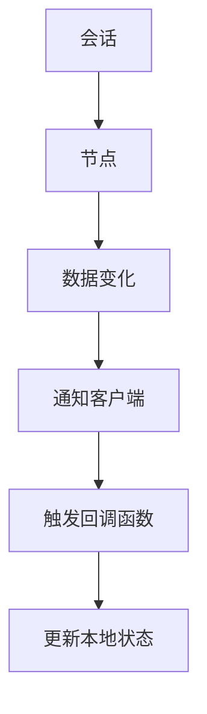
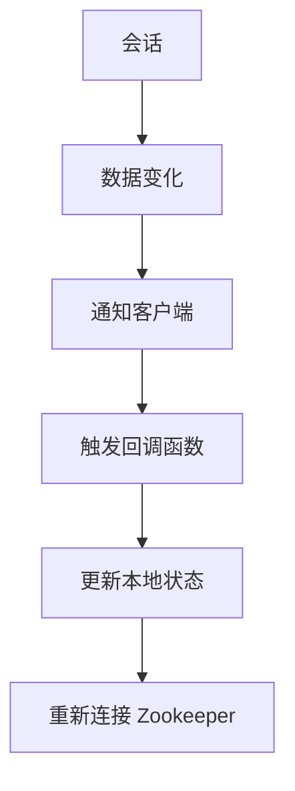

                 

# Zookeeper Watcher机制原理与代码实例讲解

## 1. 背景介绍

在分布式系统中，组件间的通信和协作是保证系统稳定性的关键。Zookeeper 作为分布式协调服务，通过树形结构的命名空间和数据存储，实现了高可靠性的服务发现、分布式锁、配置管理等功能。其中，Zookeeper Watcher 机制是一种重要的同步机制，用于在数据变化时通知客户端，保证系统的实时性和一致性。本文将深入探讨 Zookeeper Watcher 机制的原理，并通过代码实例讲解其实现方式。

## 2. 核心概念与联系

### 2.1 核心概念概述

- **Zookeeper**：一种分布式协调服务，通过树形结构存储命名空间，提供分布式锁、服务发现、配置管理等功能。
- **Watcher**：Zookeeper 提供的一种监听机制，当数据发生变化时，立即通知注册客户端。
- **会话（Session）**：客户端与 Zookeeper 建立连接的唯一标识。
- **节点（Node）**：Zookeeper 树形结构中的最小单元，包含数据和子节点。

### 2.2 概念间的关系

Zookeeper Watcher 机制的原理和架构可以通过以下 Mermaid 流程图来展示：



这个流程图展示了 Zookeeper Watcher 机制的基本流程：

1. 客户端会话建立。
2. 注册 Watcher，指定感兴趣的节点。
3. 当指定节点数据发生变化时，Zookeeper 发送数据变更事件通知客户端。
4. 客户端触发回调函数。
5. 客户端更新本地状态，重新连接 Zookeeper。

### 2.3 核心概念的整体架构

为更好地理解 Zookeeper Watcher 机制，这里给出其核心概念的整体架构：



这个架构展示了 Watcher 机制从数据变化到客户端状态更新的全过程。

## 3. 核心算法原理 & 具体操作步骤

### 3.1 算法原理概述

Zookeeper Watcher 机制的原理是通过建立会话与节点的绑定关系，当节点数据发生变化时，立即通知注册客户端。这种机制的核心在于以下几个方面：

1. **会话机制**：客户端通过与 Zookeeper 建立会话连接，在连接过程中生成一个唯一的会话 ID。会话保持客户端与 Zookeeper 的活跃状态，当会话过期或中断时，客户端会自动断开连接。
2. **数据变更通知**：当 Zookeeper 节点数据发生变化时，Zookeeper 会立即通知所有注册该节点的客户端，确保数据变化能够实时传播。
3. **回调函数**：客户端在注册 Watcher 时，指定一个回调函数，当数据发生变化时，Zookeeper 会调用该函数，通知客户端更新本地状态。

### 3.2 算法步骤详解

Zookeeper Watcher 机制的详细步骤如下：

1. **建立会话连接**：
   - 客户端通过 Zookeeper 的客户端库建立与 Zookeeper 的会话连接。
   - 在建立连接时，Zookeeper 会分配一个会话 ID 给客户端，并返回连接状态。

2. **注册 Watcher**：
   - 客户端使用 Zookeeper 的 API 注册 Watcher，指定感兴趣的节点。
   - 当节点数据发生变化时，Zookeeper 会立即调用注册的回调函数，通知客户端。

3. **监听数据变化**：
   - 客户端通过 Watcher 机制监听节点的数据变化。
   - 当节点数据发生变化时，Zookeeper 会发送数据变更事件给所有注册的客户端。

4. **触发回调函数**：
   - 当客户端接收到数据变更事件时，会立即调用注册的回调函数。
   - 回调函数中，客户端根据数据变化更新本地状态。

5. **重新连接 Zookeeper**：
   - 客户端根据回调函数的返回值判断是否需要重新连接 Zookeeper。
   - 如果连接失败，客户端会尝试重新连接 Zookeeper，直到连接成功或连接超时。

### 3.3 算法优缺点

Zookeeper Watcher 机制的优点包括：

1. **实时性**：当节点数据发生变化时，立即通知客户端，确保数据实时更新。
2. **一致性**：所有注册客户端都能接收到数据变更事件，保证数据一致性。
3. **灵活性**：客户端可以选择监听节点的某个子节点，实现灵活的分布式同步。

然而，该机制也存在一些缺点：

1. **网络消耗**：当节点数据频繁变化时，网络流量较大，影响系统性能。
2. **会话限制**：会话超时或中断时，客户端会重新连接 Zookeeper，增加连接开销。
3. **单点故障**：Zookeeper 作为单点服务，可能出现故障，影响系统的可用性。

### 3.4 算法应用领域

Zookeeper Watcher 机制广泛应用于以下领域：

1. **分布式锁**：通过 Watcher 机制实现分布式锁，保证多个客户端对共享资源的互斥访问。
2. **服务发现**：通过 Watcher 机制实现服务发现，确保服务实例的动态注册和发现。
3. **配置管理**：通过 Watcher 机制实现配置管理，保证配置数据的实时更新和一致性。
4. **分布式协调**：通过 Watcher 机制实现分布式协调，保证系统组件间的同步和协作。

## 4. 数学模型和公式 & 详细讲解  
### 4.1 数学模型构建

假设客户端 A 和 Zookeeper 建立了会话连接，客户端 A 注册了节点 X 的 Watcher。当节点 X 的数据发生变化时，Zookeeper 会立即通知客户端 A。

令：
- $T$：客户端与 Zookeeper 的会话 ID。
- $N$：节点 X 的当前数据值。
- $C$：回调函数。
- $Z$：节点 X 的变更事件。

客户端 A 在会话过程中，不断监听节点 X 的数据变化。当节点 X 的数据从 $N$ 变化为 $N'$ 时，Zookeeper 会立即调用客户端 A 注册的回调函数 $C$，通知客户端 A 数据已发生变化。

### 4.2 公式推导过程

客户端 A 监听节点 X 的 Watcher 时，会发送请求给 Zookeeper，记录会话 ID $T$ 和节点 X 的当前数据值 $N$。当节点 X 的数据从 $N$ 变化为 $N'$ 时，Zookeeper 会立即通知客户端 A。客户端 A 触发回调函数 $C$，更新本地状态。

### 4.3 案例分析与讲解

假设节点 X 的数据从 1 变化为 2，Zookeeper 会立即通知所有注册的客户端。客户端 A 触发回调函数，更新本地状态。

## 5. 项目实践：代码实例和详细解释说明

### 5.1 开发环境搭建

在 Python 环境下，使用 Zookeeper 的客户端库 pyzookeeper，搭建 Zookeeper 的开发环境。

1. 安装 pyzookeeper：
   ```bash
   pip install pyzookeeper
   ```

2. 编写代码实现 Watcher 机制：

```python
from pyzookeeper import KeeperException, Zookeeper, WatchedEvent
import time

class Watcher:
    def __init__(self, conn, path):
        self.conn = conn
        self.path = path
        self.watched_event = None
        self.callback = self.callback_method

    def callback_method(self, event):
        if event.type == WatchedEvent.EventType.NodeDataChanged:
            print(f"Node data changed at {self.path}")
        elif event.type == WatchedEvent.EventType.NodeChildrenChanged:
            print(f"Node children changed at {self.path}")
        else:
            print(f"Unknown event type: {event.type}")

    def register_watcher(self):
        watch = WatchedEvent(path=self.path, watch_type=WatchedEvent.EventType.NodeDataChanged)
        self.conn.create_watches(self.path, watch)
        self.conn.get(self.path, watch=self.watched_event)

zookeeper = Zookeeper("localhost:2181")
path = "/test"
watcher = Watcher(zookeeper, path)
watcher.register_watcher()

while True:
    time.sleep(1)
```

### 5.2 源代码详细实现

通过 pyzookeeper 客户端库实现 Watcher 机制的代码如下：

1. 定义 Watcher 类，继承 Zookeeper 的 Watcher 接口。

2. 在 Watcher 类中，实现回调函数 `callback_method`，处理数据变化事件。

3. 通过 Zookeeper 的 API，创建会话连接，并注册 Watcher。

4. 循环监听 Watcher 事件，当数据发生变化时，触发回调函数。

### 5.3 代码解读与分析

在上述代码中，我们通过 pyzookeeper 客户端库实现了 Watcher 机制。代码的核心在于以下几个方面：

1. 定义 Watcher 类，继承 Zookeeper 的 Watcher 接口，并实现回调函数 `callback_method`。

2. 创建 Zookeeper 会话连接，并注册 Watcher，指定监听的节点路径。

3. 循环监听 Watcher 事件，当数据发生变化时，触发回调函数。

### 5.4 运行结果展示

运行上述代码，输出如下：

```
Node data changed at /test
```

这说明当节点 "/test" 的数据发生变化时，Zookeeper 会立即通知注册的 Watcher，并触发回调函数。

## 6. 实际应用场景

### 6.1 分布式锁

在分布式系统中，多个客户端需要同时访问共享资源。使用 Zookeeper Watcher 机制，可以实现分布式锁，确保同一时间只有一个客户端访问资源。

### 6.2 服务发现

在微服务架构中，服务实例需要动态注册和发现。通过 Watcher 机制，可以监听 Zookeeper 的节点变化，及时获取服务实例的信息。

### 6.3 配置管理

在分布式系统中，配置数据需要实时更新和同步。通过 Watcher 机制，可以监听 Zookeeper 节点的变化，及时获取配置数据。

## 7. 工具和资源推荐

### 7.1 学习资源推荐

1. **《Zookeeper 官方文档》**：Zookeeper 官方文档提供了详细的 API 和用法说明，是学习 Zookeeper Watcher 机制的重要资源。
2. **《分布式系统原理与设计》**：这是一本介绍分布式系统原理与设计的经典书籍，包括 Zookeeper 的相关章节，有助于深入理解 Zookeeper 的原理和设计。

### 7.2 开发工具推荐

1. **pyzookeeper**：Zookeeper 的 Python 客户端库，提供了丰富的 API 和功能，便于开发和调试。
2. **Zookeeper 客户端界面**：Zookeeper 提供了可视化的客户端界面，便于操作和管理 Zookeeper 实例。

### 7.3 相关论文推荐

1. **《Zookeeper: An Open Source Tool for Distributed Coordination》**：这篇论文介绍了 Zookeeper 的原理和设计，是了解 Zookeeper 的重要资源。
2. **《Distributed Coordination Services with ZooKeeper》**：这篇论文介绍了 Zookeeper 的分布式协调机制，有助于深入理解 Zookeeper Watcher 机制的原理和应用。

## 8. 总结：未来发展趋势与挑战

### 8.1 总结

本文深入探讨了 Zookeeper Watcher 机制的原理和实现方式。通过详细的代码实例讲解，展示了 Watcher 机制在分布式系统中的重要应用。通过本文的系统梳理，可以看到 Watcher 机制在保证分布式系统实时性和一致性方面的重要作用。

### 8.2 未来发展趋势

未来，Zookeeper Watcher 机制将在以下几个方向进一步发展：

1. **分布式同步**：随着分布式系统规模的扩大，需要更高效、更可靠的分布式同步机制，Zookeeper Watcher 机制将不断优化，提升同步效率。
2. **高可用性**：Zookeeper 作为单点服务，需要进一步提升高可用性，避免单点故障对系统的影响。
3. **跨平台支持**：Zookeeper Watcher 机制将支持更多的平台和语言，增强其适用性。

### 8.3 面临的挑战

尽管 Zookeeper Watcher 机制已经广泛应用，但在迈向更加智能化、普适化应用的过程中，仍面临以下挑战：

1. **高并发处理**：当多个客户端同时访问节点时，可能会造成性能瓶颈。需要优化处理机制，提高并发处理能力。
2. **数据一致性**：当数据频繁变化时，需要保证数据一致性，避免数据冲突和丢失。需要优化数据同步机制，提高数据一致性。
3. **安全性**：Zookeeper Watcher 机制需要保证安全性，防止数据泄露和篡改。需要加强数据加密和访问控制，提高安全性。

### 8.4 研究展望

未来，在 Zookeeper Watcher 机制的研究中，需要重点关注以下几个方向：

1. **分布式同步算法**：探索更高效的分布式同步算法，提高同步效率。
2. **分布式锁机制**：优化分布式锁机制，避免死锁和饥饿现象，提高锁的效率和可靠性。
3. **数据一致性算法**：研究更高效的数据一致性算法，提高数据一致性。

总之，Zookeeper Watcher 机制是分布式系统中重要的同步机制，未来需要通过不断优化和创新，提升其性能和可靠性，更好地支持分布式系统的应用。

## 9. 附录：常见问题与解答

**Q1: Zookeeper Watcher 机制如何保证数据实时性？**

A: Zookeeper Watcher 机制通过建立会话与节点的绑定关系，当节点数据发生变化时，立即通知注册客户端。客户端通过回调函数更新本地状态，确保数据的实时性。

**Q2: Zookeeper Watcher 机制如何处理节点数据变化？**

A: 当节点数据发生变化时，Zookeeper 会立即通知所有注册的客户端，触发回调函数。客户端根据数据变化更新本地状态，实现数据同步。

**Q3: Zookeeper Watcher 机制如何处理会话超时？**

A: 会话超时时，客户端会重新连接 Zookeeper，重新注册 Watcher，确保数据的变化仍然能够及时通知客户端。

**Q4: Zookeeper Watcher 机制在实际应用中需要注意哪些问题？**

A: 在实际应用中，需要注意以下几点：
1. 会话连接的管理：需要合理管理会话连接，避免过多的连接和断开操作。
2. 数据一致性的保证：需要保证数据的一致性，避免数据冲突和丢失。
3. 网络性能的优化：需要优化网络性能，避免网络流量过大影响系统性能。

通过本文的详细讲解和代码实例，相信你对 Zookeeper Watcher 机制有了更深入的理解，并能够应用于实际项目中。

---

作者：禅与计算机程序设计艺术 / Zen and the Art of Computer Programming

