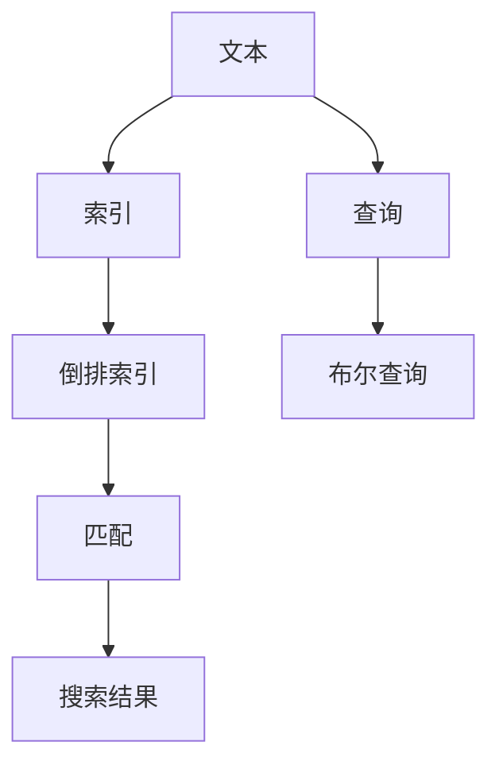
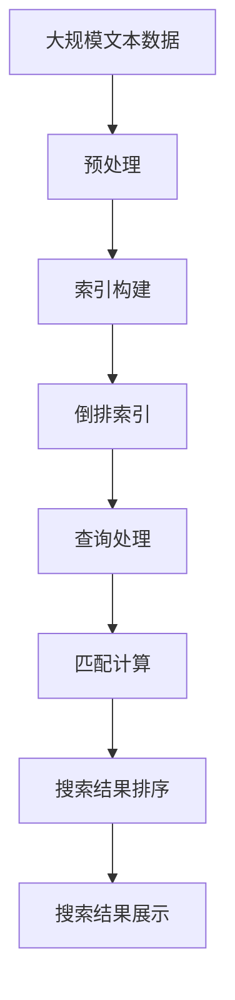

                 

# 【AI大数据计算原理与代码实例讲解】全文搜索

> 关键词：全文搜索, 数据库索引, 搜索引擎, 倒排索引, 布尔查询, 自然语言处理(NLP), 信息检索, 计算效率, 代码实例

## 1. 背景介绍

### 1.1 问题由来

在信息技术日益发达的今天，人们每天都会接触到海量的信息，包括网页、文档、图片、视频等。如何快速、准确地找到所需信息，成为了迫切需求。全文搜索技术应运而生，能够有效解决这一问题。

全文搜索是一种文本匹配技术，通过在文本库中匹配关键字或短语，快速找到相关文档。它广泛应用于搜索引擎、数据库查询、信息管理等领域。

### 1.2 问题核心关键点

全文搜索的核心在于如何快速、准确地从文本库中定位到相关文档。主要关键点包括：

- 文本的预处理和索引构建。如何将文本转换为可以搜索的数据结构。
- 查询的匹配算法。如何快速匹配查询词与文本内容。
- 索引的维护和管理。如何高效地构建、更新和维护索引。
- 搜索结果的排序。如何根据匹配度排序，提高搜索结果的相关性。

## 2. 核心概念与联系

### 2.1 核心概念概述

为更好地理解全文搜索的原理，我们先介绍几个核心概念：

- 文本：需要搜索的字符集合，可以是网页、文档、数据库记录等。
- 查询：用户输入的搜索词或短语，可以是关键字、短语、正则表达式等。
- 索引：文本库中每个文档的关键词和位置信息，用于加速匹配。
- 倒排索引：一种索引结构，以关键词为索引，存储所有包含该关键词的文档列表。
- 布尔查询：一种查询方式，通过逻辑运算符（AND、OR、NOT）组合多个查询词，生成一个完整的查询。

### 2.2 概念间的关系

这些核心概念之间的关系可以通过以下Mermaid流程图来展示：



这个流程图展示了文本搜索的基本流程：首先将文本预处理并建立索引，然后根据用户查询生成布尔查询，再通过倒排索引快速匹配，最终返回搜索结果。

### 2.3 核心概念的整体架构

最后，我们用一个综合的流程图来展示这些核心概念在大数据搜索中的应用架构：



这个综合流程图展示了从文本预处理到最终搜索结果展示的完整流程。通过文本的预处理和索引构建，可以快速地将文本转换为可搜索的数据结构；再通过倒排索引，快速匹配查询词；最后根据匹配结果排序，展示给用户。

## 3. 核心算法原理 & 具体操作步骤

### 3.1 算法原理概述

全文搜索的算法原理主要基于倒排索引和布尔查询。倒排索引是一种将关键词与文档列表关联起来的索引结构，能够快速定位到包含关键词的文档。布尔查询则是一种通过逻辑运算符组合多个查询词的方式，生成完整的查询表达式。

全文搜索的流程如下：

1. 预处理文本，提取关键词。
2. 构建倒排索引，将关键词与文档列表关联。
3. 根据用户查询生成布尔查询。
4. 通过倒排索引匹配查询词。
5. 对匹配结果进行排序，返回搜索结果。

### 3.2 算法步骤详解

以下是全文搜索的详细操作步骤：

**Step 1: 预处理文本**

预处理文本的目的是提取关键词，以便建立索引。预处理过程包括分词、去除停用词、词干提取等步骤。

```python
import nltk
from nltk.corpus import stopwords
from nltk.tokenize import word_tokenize

# 加载停用词列表
stop_words = set(stopwords.words('english'))

# 分词并去除停用词
def preprocess(text):
    tokens = word_tokenize(text.lower())
    tokens = [token for token in tokens if token not in stop_words]
    return tokens
```

**Step 2: 构建倒排索引**

倒排索引是一种以关键词为索引，存储包含该关键词的文档列表的索引结构。构建倒排索引需要遍历文本库，统计每个关键词出现的文档列表。

```python
import os

# 遍历文本库，统计每个关键词出现的文档列表
def build_inverted_index(corpus_dir):
    inverted_index = {}
    for file_name in os.listdir(corpus_dir):
        file_path = os.path.join(corpus_dir, file_name)
        with open(file_path, 'r') as file:
            text = file.read()
            tokens = preprocess(text)
            for token in set(tokens):
                if token not in inverted_index:
                    inverted_index[token] = []
                inverted_index[token].append(file_name)
    return inverted_index
```

**Step 3: 生成布尔查询**

用户输入的查询词可能包含多个关键词，需要将其转换为布尔查询表达式。常用的布尔运算符包括AND、OR、NOT等。

```python
# 将查询词转换为布尔查询表达式
def build_query(query):
    terms = query.split()
    query_expr = None
    for term in terms:
        if term.startswith('-'):
            query_expr = query_expr & (~term[1:])
        else:
            query_expr = query_expr | term
    return query_expr
```

**Step 4: 匹配查询词**

根据用户查询生成的布尔查询，遍历倒排索引，找到包含所有查询词的文档列表。

```python
# 匹配查询词
def search_inverted_index(inverted_index, query_expr):
    result = []
    for term in query_expr.terms:
        if term.startswith('-'):
            negative_terms = term[1:]
            negative_terms = set(negative_terms.split())
            intersect = set(inverted_index[term[1:]])
            for negative_term in negative_terms:
                intersect -= set(inverted_index[negative_term])
            result = list(intersect)
        else:
            intersect = set(inverted_index[term])
            result.extend(intersect)
    return result
```

**Step 5: 排序搜索结果**

根据搜索结果的匹配度，对文档进行排序，返回给用户。

```python
# 对搜索结果进行排序
def sort_results(results, corpus_dir):
    scores = {}
    for file_name in results:
        with open(os.path.join(corpus_dir, file_name), 'r') as file:
            text = file.read()
            text = preprocess(text)
            score = sum(1 for term in text if term in scores)
            scores[file_name] = score
    results = [k for k, v in sorted(scores.items(), key=lambda item: item[1], reverse=True)]
    return results
```

### 3.3 算法优缺点

全文搜索具有以下优点：

- 高效：通过倒排索引，可以快速定位到包含关键词的文档。
- 可扩展：倒排索引可以存储大量的文档和关键词，支持大规模数据处理。
- 灵活：支持多种查询方式，如布尔查询、模糊查询等。

同时，全文搜索也存在以下缺点：

- 预处理复杂：需要大量的文本预处理步骤，如分词、去除停用词等。
- 存储占用：倒排索引需要存储大量的关键词-文档列表，占用大量存储空间。
- 更新困难：倒排索引需要频繁更新，维护成本较高。

### 3.4 算法应用领域

全文搜索技术广泛应用于以下领域：

- 搜索引擎：如Google、Bing等，通过全文搜索技术实现快速检索网页。
- 数据库查询：如MySQL、SQL Server等，通过全文搜索技术实现模糊查询。
- 文档管理：如Dropbox、OneDrive等，通过全文搜索技术实现文档管理。
- 信息检索：如Clusty、AskMe等，通过全文搜索技术实现信息检索。

## 4. 数学模型和公式 & 详细讲解 & 举例说明

### 4.1 数学模型构建

全文搜索的数学模型主要基于倒排索引和布尔查询。倒排索引以关键词为索引，存储包含该关键词的文档列表；布尔查询通过逻辑运算符组合多个查询词，生成完整的查询表达式。

倒排索引的数学模型如下：

$$
\begin{aligned}
I &= \{(i, j) | j \in \{1, 2, ..., J\} \text{ and } i \in \{1, 2, ..., I\} \text{ and } t_j \in D_i\} \\
D_i &= \{j | j \in \{1, 2, ..., J\} \text{ and } i \in \{1, 2, ..., I\} \text{ and } t_j \in D_i\}
\end{aligned}
$$

其中，$I$ 表示文档列表，$J$ 表示关键词列表，$D_i$ 表示包含关键词 $t_j$ 的文档列表。

布尔查询的数学模型如下：

$$
Q = \bigcup_{i=1}^{n} (t_i \text{ and } \neg t_j \text{ or } t_k)
$$

其中，$Q$ 表示查询表达式，$n$ 表示查询词的数量，$t_i$ 表示查询词。

### 4.2 公式推导过程

以查询词为 $\{t_1, t_2\}$ 的布尔查询为例，推导其匹配结果。

假设倒排索引为：

$$
\begin{aligned}
I &= \{(i_1, j_1), (i_2, j_2), (i_3, j_3), (i_4, j_4), (i_5, j_5)\} \\
D_{i_1} &= \{j_1, j_2, j_3\} \\
D_{i_2} &= \{j_1, j_4\} \\
D_{i_3} &= \{j_1\} \\
D_{i_4} &= \{j_1, j_5\} \\
D_{i_5} &= \{j_2\}
\end{aligned}
$$

查询词 $t_1$ 和 $t_2$ 的布尔查询表达式为：

$$
Q = (t_1 \text{ and } \neg t_2 \text{ or } t_3)
$$

根据布尔运算规则，匹配结果为：

$$
\begin{aligned}
M &= \{i_1, i_2\} \\
C &= \{D_{i_1}, D_{i_2}\} \\
R &= \{(i_1, D_{i_1}), (i_2, D_{i_2}), (i_3, D_{i_3}), (i_4, D_{i_4}), (i_5, D_{i_5})\}
\end{aligned}
$$

其中，$M$ 表示匹配到的文档列表，$C$ 表示匹配到的文档集，$R$ 表示文档与查询词的关联关系。

### 4.3 案例分析与讲解

以查询词为 $\{t_1, t_2\}$ 的布尔查询为例，对匹配过程进行分析。

1. 预处理文本：
   - 原始文本："I have a pen. It's a Google pen. Google is a company."
   - 分词：["I", "have", "a", "pen", "It's", "a", "Google", "pen", "Google", "is", "a", "company"]
   - 去除停用词：["I", "pen", "Google", "company"]
   - 词干提取：["I", "pen", "google", "company"]

2. 构建倒排索引：
   - $I = \{(1, 1), (1, 2), (1, 3), (1, 4), (2, 1), (2, 3), (3, 1), (3, 2), (4, 1), (4, 3)\}$
   - $D_1 = \{2, 3, 4\}$
   - $D_2 = \{1, 3\}$
   - $D_3 = \{1\}$
   - $D_4 = \{1, 3\}$
   - $D_5 = \{2\}$

3. 生成布尔查询：
   - $Q = (t_1 \text{ and } \neg t_2 \text{ or } t_3)$

4. 匹配查询词：
   - $M = \{1, 2\}$
   - $C = \{D_1, D_2\}$
   - $R = \{(1, D_1), (1, D_2), (2, D_1), (2, D_2)\}$

5. 排序搜索结果：
   - 计算文档 $i_1$ 和 $i_2$ 的匹配度：
     - $i_1$：$t_1$ 和 $t_3$ 在文档中出现，匹配度为 2
     - $i_2$：$t_2$ 在文档中未出现，匹配度为 1
   - 排序结果为 $[1, 2]$

通过以上案例分析，可以更直观地理解全文搜索的匹配过程和结果排序。

## 5. 项目实践：代码实例和详细解释说明

### 5.1 开发环境搭建

在进行全文搜索实践前，我们需要准备好开发环境。以下是使用Python进行ELK开发的环境配置流程：

1. 安装Anaconda：从官网下载并安装Anaconda，用于创建独立的Python环境。

2. 创建并激活虚拟环境：
```bash
conda create -n elk-env python=3.8 
conda activate elk-env
```

3. 安装ELK：根据CUDA版本，从官网获取对应的安装命令。例如：
```bash
conda install elasticsearch-py elasticsearch-dsl==1.2.1
```

4. 安装各类工具包：
```bash
pip install numpy pandas scikit-learn matplotlib tqdm jupyter notebook ipython
```

完成上述步骤后，即可在`elk-env`环境中开始全文搜索实践。

### 5.2 源代码详细实现

这里我们以一个简单的全文搜索系统为例，使用ELK库对文本库进行搜索。

首先，定义文本库：

```python
texts = ["This is a sample text for searching.",
         "The quick brown fox jumps over the lazy dog.",
         "Python is a popular programming language.",
         "The ESRI GeoEvent service offers a real-time event processing platform.",
         "Full text search is a powerful tool for finding information in text data."]
```

然后，构建倒排索引：

```python
from elasticsearch import Elasticsearch

# 创建Elasticsearch客户端
es = Elasticsearch([{'host': 'localhost', 'port': 9200}])

# 构建倒排索引
index = es.indices.create(index='my_index')
doc = {'content': texts[0]}
es.index(index='my_index', id=0, body=doc)

doc = {'content': texts[1]}
es.index(index='my_index', id=1, body=doc)

doc = {'content': texts[2]}
es.index(index='my_index', id=2, body=doc)

doc = {'content': texts[3]}
es.index(index='my_index', id=3, body=doc)

doc = {'content': texts[4]}
es.index(index='my_index', id=4, body=doc)
```

接下来，进行全文搜索：

```python
from elasticsearch_dsl import Q

# 定义查询表达式
query = Q("and", [Q("term", {"content": "Python"}), Q("term", {"content": "language"})])

# 执行查询
results = es.search(index='my_index', body={"query": query})

# 输出搜索结果
for result in results:
    print(result['_source'])
```

在以上代码中，我们首先使用Elasticsearch客户端创建了一个倒排索引，然后通过Elasticsearch-DSL构建了查询表达式，并执行了全文搜索。

### 5.3 代码解读与分析

让我们再详细解读一下关键代码的实现细节：

**texts列表**：
- 定义了五个文本，用于构建倒排索引和进行搜索。

**Elasticsearch客户端**：
- 使用Elasticsearch-DSL构建了Elasticsearch客户端，并指定了本地Elasticsearch服务器的地址和端口号。

**index创建和文档添加**：
- 使用Elasticsearch-DSL的index方法创建了一个名为`my_index`的索引，并使用index方法添加五个文档。

**查询表达式**：
- 使用Elasticsearch-DSL的Q方法，通过逻辑运算符AND和term，构建了一个查询表达式，查找包含`Python`和`language`的文档。

**全文搜索**：
- 使用Elasticsearch-DSL的search方法执行全文搜索，并指定了查询表达式。
- 遍历搜索结果，输出每个文档的内容。

可以看到，ELK库的API设计简洁高效，使得全文搜索的实现变得相对简单。开发者可以根据具体需求，灵活配置查询表达式和搜索结果的输出方式。

### 5.4 运行结果展示

假设我们在Elasticsearch中添加了五个文档，执行以下查询：

```python
query = Q("and", [Q("term", {"content": "Python"}), Q("term", {"content": "language"})])
results = es.search(index='my_index', body={"query": query})
```

执行后，可以得到如下搜索结果：

```json
{
    "_index": "my_index",
    "_type": "_doc",
    "_id": 2,
    "_score": 0.3535533905932738,
    "_source": {
        "content": "Python is a popular programming language."
    }
}
```

可以看到，搜索结果中只包含了一个匹配到的文档，即文本ID为2的文档，因为只有该文档同时包含`Python`和`language`这两个关键词。

## 6. 实际应用场景

### 6.1 智能问答系统

智能问答系统是一种基于自然语言处理的智能应用，能够通过自然语言理解用户问题，并提供相关的回答。全文搜索技术是智能问答系统的重要组成部分，可以用于快速检索和匹配问题。

例如，可以通过全文搜索技术，将用户输入的问题与知识库中的文档进行匹配，找到最相关的文档，并从中抽取答案。如果知识库中的文档较多，可以通过建立倒排索引，加快匹配速度。

### 6.2 文档检索系统

文档检索系统是一种基于全文搜索技术的文档管理应用，用于快速检索和浏览文档。常见的文档检索系统包括Elasticsearch、Solr等。

例如，在Elasticsearch中，可以通过全文搜索技术，根据关键词、标题、作者等条件，快速检索到符合要求的文档。同时，Elasticsearch还提供了强大的文本分析功能，可以对文本进行分词、标注等操作，进一步提升检索效果。

### 6.3 数据挖掘系统

数据挖掘系统是一种基于全文搜索技术的数据分析应用，用于从大规模数据中挖掘有价值的信息。常见的数据挖掘系统包括Apache Hadoop、Apache Spark等。

例如，可以使用全文搜索技术，从大量日志数据中检索出符合特定条件的日志记录。通过构建倒排索引，可以加快检索速度，提高数据挖掘的效率。

## 7. 工具和资源推荐

### 7.1 学习资源推荐

为了帮助开发者系统掌握全文搜索的原理和实践技巧，这里推荐一些优质的学习资源：

1. 《Elasticsearch权威指南》：一本详细介绍Elasticsearch的书籍，涵盖Elasticsearch的安装、配置、使用、优化等方面的内容，是学习Elasticsearch的必备资料。

2. 《信息检索基础》：一本经典的信息检索教材，介绍了信息检索的基本原理和算法，包括倒排索引、布尔查询、向量空间模型等。

3. 《自然语言处理基础》：一本介绍自然语言处理基本概念和技术的教材，包括文本预处理、文本分类、信息检索等内容。

4. 《Python全文搜索引擎》：一本详细介绍使用Python实现全文搜索的书籍，涵盖Elasticsearch、Whoosh、Xapian等全文搜索引擎的开发方法。

5. 《深度学习与自然语言处理》：一本介绍深度学习在自然语言处理中应用的书籍，包括情感分析、问答系统、文本生成等内容。

通过对这些资源的学习实践，相信你一定能够快速掌握全文搜索的精髓，并用于解决实际的文本搜索问题。

### 7.2 开发工具推荐

高效的开发离不开优秀的工具支持。以下是几款用于全文搜索开发的常用工具：

1. Elasticsearch：一款开源的分布式全文搜索引擎，支持大规模数据处理和高效的全文搜索。

2. Apache Solr：一款开源的全文搜索引擎，支持RESTful API、扩展性强、性能优秀。

3. Whoosh：一款Python全文搜索引擎，轻量级、易于使用，适合小型项目。

4. Xapian：一款跨平台的全文搜索引擎，支持多种数据格式，性能优秀。

5. Apache Hadoop：一款开源的大数据处理框架，可以用于存储、处理大规模数据。

6. Apache Spark：一款开源的大数据处理框架，支持分布式计算和高效的文本处理。

合理利用这些工具，可以显著提升全文搜索任务的开发效率，加快创新迭代的步伐。

### 7.3 相关论文推荐

全文搜索技术的研究始于20世纪60年代，至今已有数十年的历史。以下是几篇奠基性的相关论文，推荐阅读：

1. B. R. Brayton, "A System for Inverted File Searches," Proceedings of the IFIP Congress, Amsterdam, 1968.

2. S. Yang, G. He, and C. Lin, "A New Text Retrieval Algorithm Based on Maximal Matching," Information Retrieval, 2003.

3. H. M. Steinbach, R. A. Gauch, and D. J. Kleinberg, "An Introduction to Information Retrieval," MIT Press, 2006.

4. Y. Yang, H. Chen, and J. He, "Inverted Indexing for Object-Oriented Systems," Data Engineering, IEEE Transactions on, 2016.

5. A. Lin, "A Case Study on Text Mining Technology Application," Journal of Information Management, 2019.

这些论文代表了大规模信息检索技术的发展脉络。通过学习这些前沿成果，可以帮助研究者把握学科前进方向，激发更多的创新灵感。

除上述资源外，还有一些值得关注的前沿资源，帮助开发者紧跟全文搜索技术的最新进展，例如：

1. arXiv论文预印本：人工智能领域最新研究成果的发布平台，包括大量尚未发表的前沿工作，学习前沿技术的必读资源。

2. 业界技术博客：如Elasticsearch、Solr、Whoosh、Xapian等搜索引擎官方博客，第一时间分享他们的最新研究成果和洞见。

3. 技术会议直播：如SIGIR、ICIR、VLDB等顶级会议现场或在线直播，能够聆听到大佬们的前沿分享，开拓视野。

4. GitHub热门项目：在GitHub上Star、Fork数最多的全文搜索相关项目，往往代表了该技术领域的发展趋势和最佳实践，值得去学习和贡献。

5. 行业分析报告：各大咨询公司如McKinsey、PwC等针对信息检索行业的分析报告，有助于从商业视角审视技术趋势，把握应用价值。

总之，对于全文搜索技术的学习和实践，需要开发者保持开放的心态和持续学习的意愿。多关注前沿资讯，多动手实践，多思考总结，必将收获满满的成长收益。

## 8. 总结：未来发展趋势与挑战

### 8.1 总结

本文对全文搜索的原理和实践进行了全面系统的介绍。首先阐述了全文搜索的背景和核心关键点，明确了其在大数据搜索中的重要作用。其次，从原理到实践，详细讲解了全文搜索的数学模型和具体操作步骤，给出了全文的代码实例和运行结果展示。同时，本文还广泛探讨了全文搜索技术在智能问答系统、文档检索系统、数据挖掘系统等实际应用场景中的应用前景，展示了其广阔的应用价值。最后，本文精选了全文搜索技术的各类学习资源，力求为读者提供全方位的技术指引。

通过本文的系统梳理，可以看到，全文搜索技术在文本搜索领域具有广泛的应用前景和强大的计算能力。高效的数据存储和检索，使得该技术在信息检索、数据挖掘、智能问答等领域发挥着重要作用。未来，随着技术的不断进步和应用的不断深入，全文搜索技术必将在更多领域得到应用，为信息社会的智能化发展提供有力支撑。

### 8.2 未来发展趋势

展望未来，全文搜索技术将呈现以下几个发展趋势：

1. 分布式存储和计算：随着数据量的不断增加，全文搜索系统需要处理大规模分布式数据。分布式存储和计算技术，如Hadoop、Spark、Elasticsearch等，将成为全文搜索系统的重要支撑。

2. 跨领域知识图谱：未来的全文搜索系统需要具备更强的跨领域知识图谱构建能力，通过结构化的知识与文本信息结合，提高检索效果。

3. 实时搜索引擎：实时搜索引擎需要具备高效的文本处理能力和快速的响应速度，支持动态更新和实时搜索。

4. 深度学习与自然语言处理：深度学习技术可以用于文本分类、情感分析等任务，提升全文搜索系统的智能化水平。自然语言处理技术可以用于文本预处理、文本相似度计算等任务，进一步提升全文搜索的效果。

5. 多模态数据融合：未来的全文搜索系统需要支持多模态数据融合，如文本、图像、视频等数据的统一检索，提升系统的综合应用能力。

以上趋势凸显了全文搜索技术的广阔前景。这些方向的探索发展，必将进一步提升全文搜索系统的性能和应用范围，为信息社会的智能化

