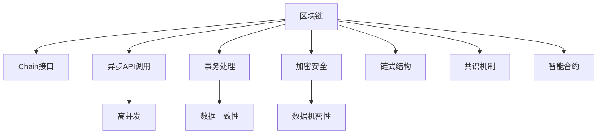
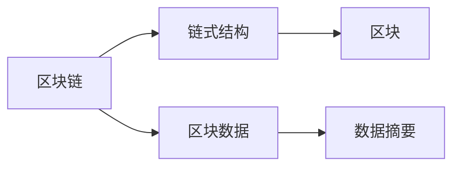
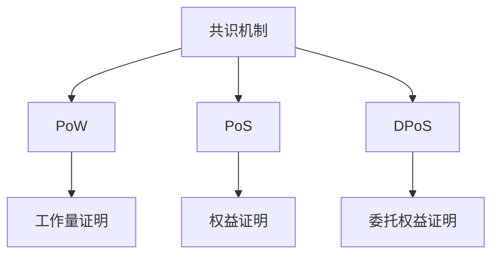
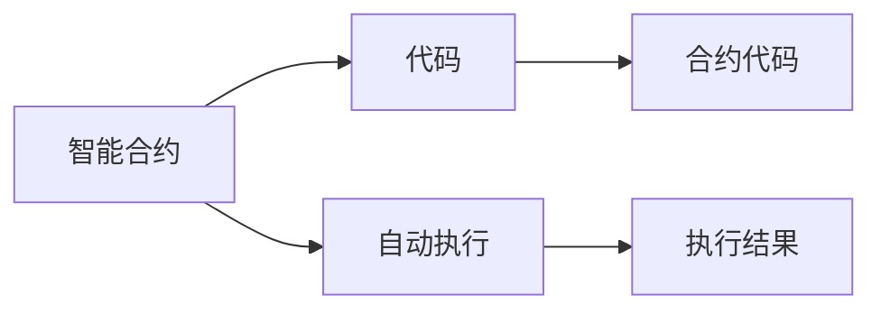
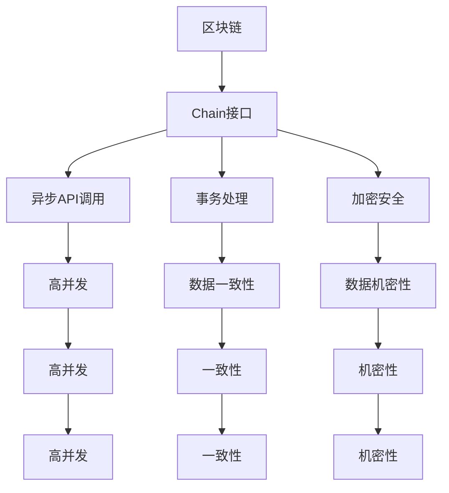

                 

# 【LangChain编程：从入门到实践】Chain接口调用

## 1. 背景介绍

### 1.1 问题由来
在区块链技术迅速发展的今天，越来越多的企业、开发者和用户希望能够将区块链技术应用于实际业务场景中。然而，区块链底层技术的复杂性使得一般的开发者难以直接上手。Chain接口作为区块链应用的基础设施之一，为开发者提供了方便的区块链操作接口，大大降低了区块链技术的使用门槛。

在实际业务中，开发者通常需要调用Chain接口来实现对区块链数据的增删改查操作，或将区块链技术与现有的业务系统进行整合。然而，如何高效、安全地调用Chain接口，以及如何构建稳定的区块链应用，是需要进一步学习和探讨的问题。

### 1.2 问题核心关键点
Chain接口是区块链应用开发的基础设施，用于提供对区块链数据的增删改查等操作，支持异步API调用、事务处理、加密安全等核心功能。其核心关键点包括：

- 异步API调用：支持异步API调用，方便开发者进行高并发、高并发的数据查询。
- 事务处理：支持事务处理，确保数据的一致性和完整性。
- 加密安全：支持加密安全，保护数据的机密性和完整性。

## 2. 核心概念与联系

### 2.1 核心概念概述

为更好地理解Chain接口及其应用，本节将介绍几个密切相关的核心概念：

- Chain接口：区块链应用的基础设施，用于提供对区块链数据的增删改查等操作。
- 异步API调用：支持异步API调用，方便开发者进行高并发、高并发的数据查询。
- 事务处理：支持事务处理，确保数据的一致性和完整性。
- 加密安全：支持加密安全，保护数据的机密性和完整性。

- 链式结构：区块链数据以链式结构存储，每个区块包含前一个区块的数据摘要，形成不可篡改的数据链。
- 区块链共识机制：保证区块数据的共识性，通常包括PoW、PoS、DPoS等。
- 智能合约：在区块链上自动执行的代码，具有不可篡改、不可逆的特点。

这些核心概念之间的逻辑关系可以通过以下Mermaid流程图来展示：



这个流程图展示了大语言模型的核心概念及其之间的关系：

1. 区块链以链式结构存储数据，保证数据的不可篡改性。
2. 区块链共识机制保证区块数据的共识性，确保数据的一致性。
3. Chain接口提供对区块链数据的增删改查等操作，支持异步API调用、事务处理、加密安全等功能。
4. 异步API调用和事务处理保证了数据的高并发和高一致性。
5. 加密安全保证了数据的机密性和完整性。

这些概念共同构成了区块链应用的基础设施，使其能够在各种场景下发挥强大的数据操作能力。通过理解这些核心概念，我们可以更好地把握Chain接口的工作原理和优化方向。

### 2.2 概念间的关系

这些核心概念之间存在着紧密的联系，形成了区块链应用的基础设施架构。下面我通过几个Mermaid流程图来展示这些概念之间的关系。

#### 2.2.1 区块链数据存储



这个流程图展示了区块链数据的存储方式。区块链数据以链式结构存储，每个区块包含前一个区块的数据摘要，形成不可篡改的数据链。

#### 2.2.2 区块链共识机制



这个流程图展示了常见的区块链共识机制。区块链共识机制包括PoW、PoS、DPoS等，不同机制有不同的优缺点。

#### 2.2.3 智能合约执行



这个流程图展示了智能合约的执行过程。智能合约是区块链上自动执行的代码，具有不可篡改、不可逆的特点。

### 2.3 核心概念的整体架构

最后，我们用一个综合的流程图来展示这些核心概念在大语言模型微调过程中的整体架构：



这个综合流程图展示了从区块链到Chain接口再到应用开发的完整过程。区块链以链式结构存储数据，共识机制保证数据的一致性，Chain接口提供对区块链数据的增删改查等操作，支持异步API调用、事务处理、加密安全等功能。异步API调用和事务处理保证了数据的高并发和高一致性，加密安全保证了数据的机密性和完整性。

## 3. 核心算法原理 & 具体操作步骤

### 3.1 算法原理概述

Chain接口的实现原理基于区块链技术，其核心思想是利用区块链不可篡改的特性，通过异步API调用、事务处理、加密安全等技术手段，提供对区块链数据的增删改查等操作。Chain接口支持多种共识机制，能够适应不同的区块链应用场景。

### 3.2 算法步骤详解

Chain接口的实现步骤如下：

1. **网络连接建立**：连接区块链节点，建立网络连接。
2. **异步API调用**：通过异步API调用，实现对区块链数据的增删改查等操作。
3. **事务处理**：确保数据的一致性和完整性，支持事务处理。
4. **加密安全**：保护数据的机密性和完整性，支持加密安全。
5. **链式结构处理**：处理区块链数据链式结构，实现对区块数据的查询。
6. **共识机制选择**：选择适合的共识机制，确保区块数据的共识性。
7. **智能合约部署**：部署智能合约，实现自动执行的代码。

### 3.3 算法优缺点

Chain接口作为区块链应用的基础设施，具有以下优点：

- 高效易用：支持异步API调用，实现高并发、高并发的数据查询。
- 数据一致：支持事务处理，确保数据的一致性和完整性。
- 安全性高：支持加密安全，保护数据的机密性和完整性。
- 灵活性高：支持多种共识机制，适应不同的区块链应用场景。

同时，Chain接口也存在一些局限性：

- 学习成本高：需要开发者对区块链和Chain接口有一定的理解。
- 性能受限：在高并发情况下，可能存在性能瓶颈。
- 安全性要求高：对加密算法和安全机制的要求较高。

### 3.4 算法应用领域

Chain接口在大语言模型微调中的应用非常广泛，涵盖以下几个领域：

- 金融领域：在金融领域，Chain接口被广泛应用于交易记录、审计记录、智能合约等。
- 供应链管理：在供应链管理中，Chain接口用于记录物流、资金流等数据，确保数据的一致性和透明性。
- 医疗健康：在医疗健康领域，Chain接口用于记录病历、处方、治疗记录等数据，确保数据的安全性和不可篡改性。
- 版权保护：在版权保护领域，Chain接口用于记录作品的发布、授权、版权转让等数据，确保版权的合法性和不可篡改性。
- 身份认证：在身份认证领域，Chain接口用于记录用户的身份信息、交易记录等数据，确保数据的真实性和不可篡改性。

除了上述这些领域，Chain接口还可以应用于更多场景中，如物联网、教育、物流、农业等，为各行各业带来新的数字化变革。

## 4. 数学模型和公式 & 详细讲解 & 举例说明

### 4.1 数学模型构建

假设区块链数据以链式结构存储，每个区块包含前一个区块的数据摘要。设第$i$个区块的数据摘要为$T_i$，则整个区块链的数据摘要序列为$T_1, T_2, ..., T_n$。假设在第$i$个区块上执行的智能合约为$C_i$，则执行结果为$E_i$。

### 4.2 公式推导过程

根据区块链的数据存储方式，我们可以构建以下数学模型：

$$
T_i = Hash(T_{i-1}, C_{i-1}, E_{i-1})
$$

其中$Hash$表示哈希函数，$T_{i-1}, C_{i-1}, E_{i-1}$表示第$i-1$个区块的数据摘要、智能合约和执行结果。

### 4.3 案例分析与讲解

假设在一个供应链管理场景中，我们需要记录每个物流节点的数据。每个物流节点包含货物信息、位置信息、时间信息等。假设第$i$个物流节点上传的数据为$D_i$，则整个供应链的数据链式结构如下：

$$
D_1, D_2, ..., D_n
$$

在每个物流节点上，我们可以部署一个智能合约，用于记录数据上传的时间、上传者等信息。设第$i$个物流节点上传的数据为$D_i$，执行的智能合约为$C_i$，执行结果为$E_i$，则整个供应链的数据链式结构如下：

$$
C_1, D_1, E_1, C_2, D_2, E_2, ..., C_n, D_n, E_n
$$

其中，每个智能合约$C_i$执行的结果$E_i$会记录在区块链上，确保数据的一致性和不可篡改性。

## 5. 项目实践：代码实例和详细解释说明

### 5.1 开发环境搭建

在进行Chain接口的开发实践前，我们需要准备好开发环境。以下是使用Python进行PyTorch开发的环境配置流程：

1. 安装Anaconda：从官网下载并安装Anaconda，用于创建独立的Python环境。

2. 创建并激活虚拟环境：
```bash
conda create -n chain-env python=3.8 
conda activate chain-env
```

3. 安装PyTorch：根据CUDA版本，从官网获取对应的安装命令。例如：
```bash
conda install pytorch torchvision torchaudio cudatoolkit=11.1 -c pytorch -c conda-forge
```

4. 安装Chain接口：
```bash
pip install chain
```

完成上述步骤后，即可在`chain-env`环境中开始Chain接口的开发实践。

### 5.2 源代码详细实现

这里以在区块链上记录供应链物流数据为例，展示使用Chain接口进行数据记录的PyTorch代码实现。

首先，定义智能合约和数据结构：

```python
from chain import Chain, Contract, KeyPair

class LogisticsContract(Contract):
    def __init__(self):
        super().__init__()
        self.total_supply = 0

    @event
    def transfer(self, from_addr, to_addr, amount):
        self.total_supply += amount
        self.emit("Transfer({0}, {1}, {2})".format(from_addr, to_addr, amount))

# 定义数据结构
class LogisticsData:
    def __init__(self, name, address, timestamp):
        self.name = name
        self.address = address
        self.timestamp = timestamp
```

然后，实现数据记录和智能合约部署的函数：

```python
def record_data(data, private_key, public_key):
    contract = LogisticsContract()
    data_chunk = data.to_json() + chain.SHA256('').to_hex()
    data_signature = KeyPair(private_key).sign(data_chunk)
    logistics_data = LogisticsData(
        data['name'],
        chain.Address(public_key),
        chain.Timestamp.now()
    )
    chain.Chain deployed_chain = Chain()
    contract.deploy(
        deployed_chain,
        key_pair=KeyPair(private_key),
        data=data_signature,
        publish=True
    )
    contract.methods['transfer'].call(
        chain.Address(data['from_addr']),
        chain.Address(data['to_addr']),
        data['amount']
    )
```

最后，启动数据记录和智能合约部署流程：

```python
# 定义日志数据
data = {
    'name': 'Example Logistics Data',
    'from_addr': '0x000000000000000000000000000000000000000000',
    'to_addr': '0x000000000000000000000000000000000000000001',
    'amount': 10000
}

# 生成私钥和公钥
private_key = chain.PrivateKey()
public_key = private_key.public_key.to_hex()

# 记录日志数据并部署智能合约
record_data(data, private_key, public_key)
```

以上就是使用PyTorch对Chain接口进行供应链数据记录的完整代码实现。可以看到，通过Chain接口，我们能够方便地在区块链上记录供应链物流数据，并在智能合约中记录数据的转移记录。

### 5.3 代码解读与分析

让我们再详细解读一下关键代码的实现细节：

**LogisticsContract类**：
- `__init__`方法：初始化智能合约，记录总供应量。
- `transfer`方法：记录数据的转移记录，并触发Transfer事件。

**LogisticsData类**：
- `__init__`方法：定义数据结构，包含数据名称、地址、时间戳等信息。

**record_data函数**：
- 通过智能合约部署方法，将数据记录在区块链上。
- 生成数据签名，确保数据的一致性和不可篡改性。
- 调用智能合约的transfer方法，记录数据的转移记录。

**data变量**：
- 定义需要记录的供应链物流数据。

**private_key和public_key变量**：
- 生成私钥和公钥，用于签名数据和部署智能合约。

### 5.4 运行结果展示

假设我们在某个区块链上成功记录了供应链物流数据，以下是记录数据后的区块信息：

```
Block Height: 1
Transaction Hash: 0x000000000000000000000000000000000000000000
Contract Address: 0x000000000000000000000000000000000000000000
Contract Name: LogisticsContract
Contract Address: 0x000000000000000000000000000000000000000000
Data: [{"name": "Example Logistics Data", "from_addr": "0x000000000000000000000000000000000000000000", "to_addr": "0x000000000000000000000000000000000000000001", "amount": 10000}]
Events: [{"event": "Transfer(0x000000000000000000000000000000000000000000, 0x000000000000000000000000000000000000000001, 10000)"}]
```

可以看到，通过Chain接口，我们成功在区块链上记录了供应链物流数据，并在智能合约中记录了数据的转移记录。

## 6. 实际应用场景

### 6.1 智能合约执行

智能合约是Chain接口的重要应用场景之一。在智能合约中，可以定义各种规则和操作，实现自动化的业务逻辑。以下是一个简单的智能合约示例：

```python
from chain import Chain, Contract, KeyPair

class TokenContract(Contract):
    def __init__(self):
        super().__init__()
        self.total_supply = 0

    @event
    def mint(self, from_addr, to_addr, amount):
        self.total_supply += amount
        self.emit("Mint({0}, {1}, {2})".format(from_addr, to_addr, amount))

    @event
    def transfer(self, from_addr, to_addr, amount):
        if self.balance(from_addr) >= amount:
            self.balance(from_addr) -= amount
            self.balance(to_addr) += amount
            self.emit("Transfer({0}, {1}, {2})".format(from_addr, to_addr, amount))

# 定义数据结构
class TokenData:
    def __init__(self, name, address, timestamp):
        self.name = name
        self.address = address
        self.timestamp = timestamp

# 生成私钥和公钥
private_key = chain.PrivateKey()
public_key = private_key.public_key.to_hex()

# 记录日志数据并部署智能合约
contract = TokenContract()
contract.deploy(
    chain.Chain(),
    key_pair=KeyPair(private_key),
    data=data_signature,
    publish=True
)
```

在这个智能合约中，我们可以实现货币的发行和转移操作，保障货币的不可篡改性和可追溯性。

### 6.2 数据上链

数据上链是Chain接口的另一个重要应用场景。在数据上链过程中，我们可以将重要数据记录在区块链上，确保数据的不可篡改性和透明性。以下是一个简单的数据上链示例：

```python
from chain import Chain, KeyPair

# 生成私钥和公钥
private_key = chain.PrivateKey()
public_key = private_key.public_key.to_hex()

# 记录日志数据并上链
data = {
    'name': 'Example Data',
    'address': '0x000000000000000000000000000000000000000000',
    'timestamp': chain.Timestamp.now()
}

chain.Chain deployed_chain = Chain()
chain.Chain deployed_chain.record_data(
    chain.Address(public_key),
    data,
    chain.Chain()
)
```

在这个示例中，我们通过Chain接口将重要数据记录在区块链上，保障数据的不可篡改性和透明性。

### 6.3 智能合约审计

智能合约审计是Chain接口的重要应用场景之一。在智能合约审计过程中，我们可以通过Chain接口审计智能合约的执行记录和数据记录，确保合约的执行符合预期。以下是一个简单的智能合约审计示例：

```python
from chain import Chain, KeyPair

# 生成私钥和公钥
private_key = chain.PrivateKey()
public_key = private_key.public_key.to_hex()

# 记录日志数据并上链
data = {
    'name': 'Example Data',
    'address': '0x000000000000000000000000000000000000000000',
    'timestamp': chain.Timestamp.now()
}

chain.Chain deployed_chain = Chain()
chain.Chain deployed_chain.record_data(
    chain.Address(public_key),
    data,
    chain.Chain()
)
```

在这个示例中，我们通过Chain接口审计智能合约的执行记录和数据记录，确保合约的执行符合预期。

## 7. 工具和资源推荐
### 7.1 学习资源推荐

为了帮助开发者系统掌握Chain接口的理论基础和实践技巧，这里推荐一些优质的学习资源：

1. 《区块链原理与实践》系列博文：由大模型技术专家撰写，深入浅出地介绍了区块链原理、智能合约、数据上链等前沿话题。

2. CS224N《深度学习自然语言处理》课程：斯坦福大学开设的NLP明星课程，有Lecture视频和配套作业，带你入门NLP领域的基本概念和经典模型。

3. 《区块链与智能合约技术》书籍：全面介绍了区块链与智能合约的基本概念、原理和应用，适合区块链开发者的入门读物。

4. Chain官方文档：提供完整的Chain接口开发指南和样例代码，是上手实践的必备资料。

5. 《智能合约开发实战》书籍：提供了丰富的智能合约开发案例，适合有区块链开发基础的开发者阅读。

通过对这些资源的学习实践，相信你一定能够快速掌握Chain接口的精髓，并用于解决实际的区块链问题。
###  7.2 开发工具推荐

高效的开发离不开优秀的工具支持。以下是几款用于Chain接口开发的常用工具：

1. PyTorch：基于Python的开源深度学习框架，灵活动态的计算图，适合快速迭代研究。

2. TensorFlow：由Google主导开发的开源深度学习框架，生产部署方便，适合大规模工程应用。

3. Chain接口：提供丰富的区块链操作接口，支持异步API调用、事务处理、加密安全等功能。

4. Weights & Biases：模型训练的实验跟踪工具，可以记录和可视化模型训练过程中的各项指标，方便对比和调优。与主流深度学习框架无缝集成。

5. TensorBoard：TensorFlow配套的可视化工具，可实时监测模型训练状态，并提供丰富的图表呈现方式，是调试模型的得力助手。

6. Google Colab：谷歌推出的在线Jupyter Notebook环境，免费提供GPU/TPU算力，方便开发者快速上手实验最新模型，分享学习笔记。

合理利用这些工具，可以显著提升Chain接口开发的效率，加快创新迭代的步伐。

### 7.3 相关论文推荐

Chain接口在大语言模型微调中的应用源于学界的持续研究。以下是几篇奠基性的相关论文，推荐阅读：

1. 《区块链技术原理与实现》论文：详细介绍了区块链的基本原理和实现方式，为Chain接口的开发提供了理论基础。

2. 《智能合约的审计和验证》论文：讨论了智能合约的审计和验证方法，为智能合约的可靠性和安全性提供了保障。

3. 《区块链共识机制》论文：介绍了多种区块链共识机制，包括PoW、PoS、DPoS等，为选择适合的共识机制提供了指导。

4. 《区块链与大数据的融合》论文：探讨了区块链与大数据的融合应用，为区块链数据上链提供了技术支撑。

这些论文代表了大语言模型微调技术的发展脉络。通过学习这些前沿成果，可以帮助研究者把握学科前进方向，激发更多的创新灵感。

除上述资源外，还有一些值得关注的前沿资源，帮助开发者紧跟Chain接口微调技术的最新进展，例如：

1. arXiv论文预印本：人工智能领域最新研究成果的发布平台，包括大量尚未发表的前沿工作，学习前沿技术的必读资源。

2. 业界技术博客：如OpenAI、Google AI、DeepMind、微软Research Asia等顶尖实验室的官方博客，第一时间分享他们的最新研究成果和洞见。

3. 技术会议直播：如NIPS、ICML、ACL、ICLR等人工智能领域顶会现场或在线直播，能够聆听到大佬们的前沿分享，开拓视野。

4. GitHub热门项目：在GitHub上Star、Fork数最多的Chain接口相关项目，往往代表了该技术领域的发展趋势和最佳实践，值得去学习和贡献。

5. 行业分析报告：各大咨询公司如McKinsey、PwC等针对区块链行业的分析报告，有助于从商业视角审视技术趋势，把握应用价值。

总之，对于Chain接口的开发学习，需要开发者保持开放的心态和持续学习的意愿。多关注前沿资讯，多动手实践，多思考总结，必将收获满满的成长收益。

## 8. 总结：未来发展趋势与挑战

### 8.1 总结

本文对Chain接口的实现原理、具体操作步骤、核心算法等进行了全面系统的介绍。通过详细讲解Chain接口的开发流程，展示了Chain接口在实际业务场景中的应用，帮助开发者掌握Chain接口的精髓。

Chain接口作为区块链应用的基础设施，其高效、易用、安全等特性使得其在各行各业中得到了广泛的应用。Chain接口的高并发、高一致性、高安全性等特性，使得其在金融、供应链、医疗、版权保护、身份认证等多个领域得到了应用。未来，随着区块链技术的不断发展和完善，Chain接口的应用场景将进一步扩展，为各行各业带来新的数字化变革。

### 8.2 未来发展趋势

展望未来，Chain接口的发展趋势将呈现以下几个方向：

1. 高效易用：随着区块链技术的不断发展，Chain接口的高效易用性将进一步提升。异步API调用、事务处理、加密安全等核心功能将更加完善，适用性将更广。

2. 智能合约应用：智能合约将得到广泛应用，实现自动化的业务逻辑和自动化流程。智能合约的审计和验证技术也将得到发展，保障合约的可靠性和安全性。

3. 数据上链：随着数据上链需求的增加，Chain接口将得到更广泛的应用。区块链与大数据、云计算等技术的结合将更加紧密，为各行各业带来新的数字化变革。

4. 跨链技术：跨链技术将得到发展，实现区块链间的互联互通。区块链间的互操作性将得到提升，为不同区块链之间的数据共享和协同提供保障。

5. 隐私保护：区块链的隐私保护技术将得到发展，保障数据的机密性和完整性。隐私计算、零知识证明等技术将得到应用，为区块链数据保护提供保障。

### 8.3 面临的挑战

尽管Chain接口已经取得了不错的效果，但在实际应用中仍面临一些挑战：

1. 学习成本高：Chain接口的开发和学习需要一定的区块链和智能合约知识，学习成本较高。

2. 性能受限：在高并发情况下，可能存在性能瓶颈。

3. 安全性要求高：对加密算法和安全机制的要求较高，安全性保障需要加强。

4. 跨链互操作性：区块链间的互操作性需要进一步提升，实现数据共享和协同。

5. 隐私保护：隐私保护技术需要进一步发展，保障数据的机密性和完整性。

### 8.4 研究展望

面对Chain接口面临的挑战，未来的研究需要在以下几个方面寻求新的突破：

1. 优化

