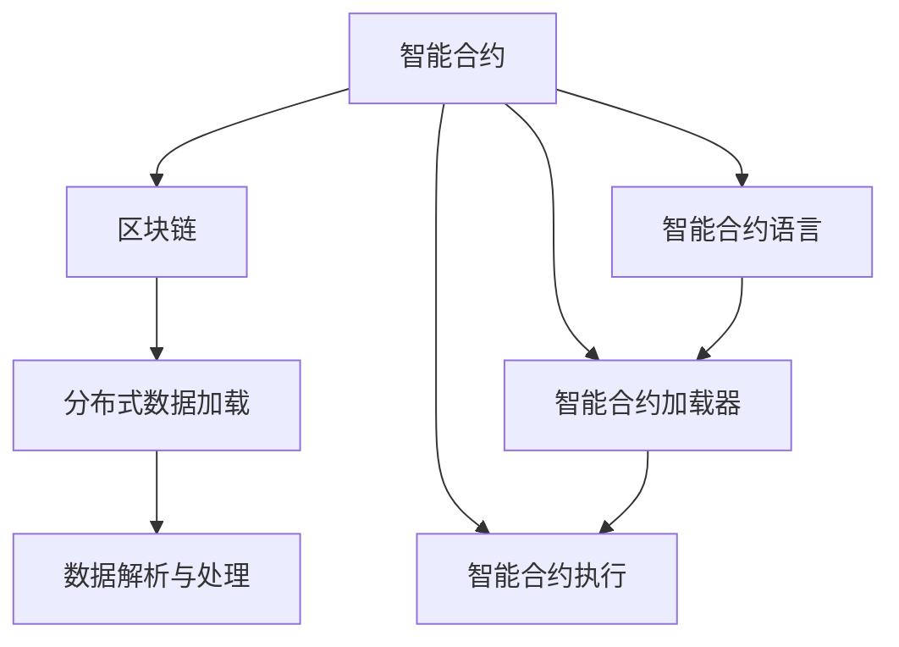
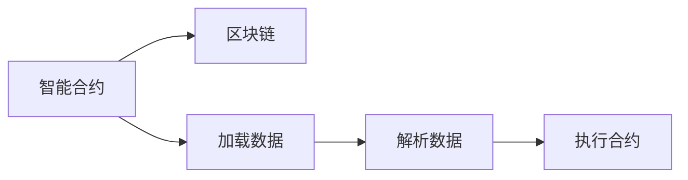
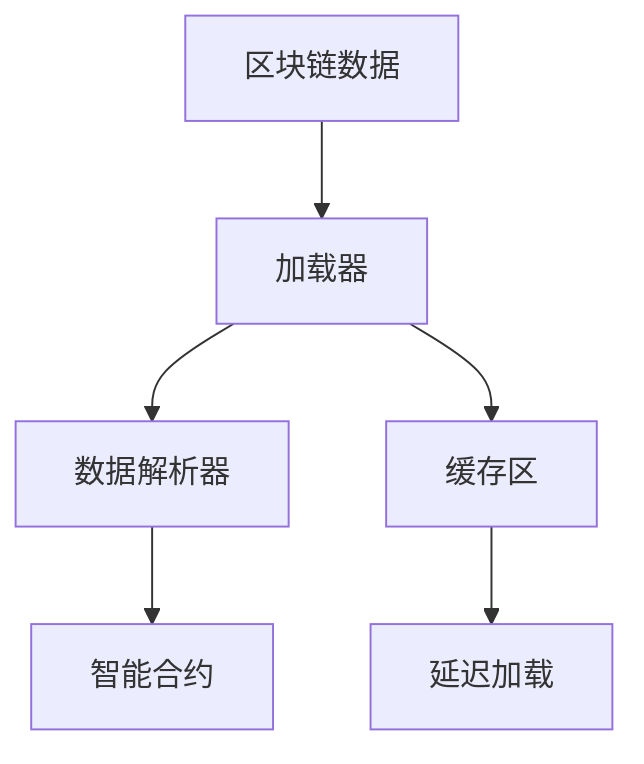
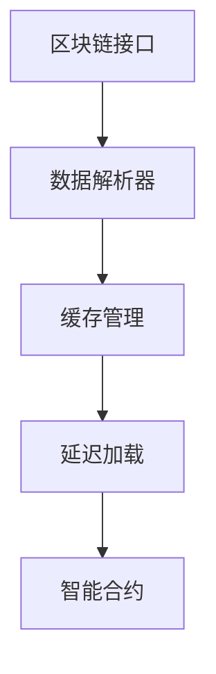
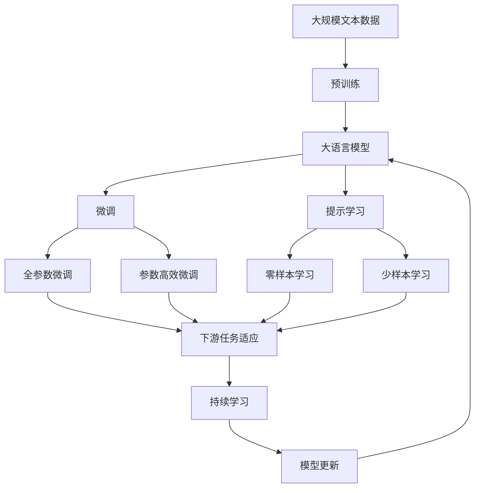

                 

# 【LangChain编程：从入门到实践】加载器

> 关键词：LangChain, 区块链, 智能合约, 数据管理, 分布式账本, 智能合约语言, 代码执行, 数据加载

## 1. 背景介绍

### 1.1 问题由来
近年来，区块链技术在金融、供应链、医疗等多个领域取得了长足进展。其核心优势在于通过分布式账本确保数据透明、不可篡改，以及通过智能合约实现自动化的业务逻辑。

然而，这些优势的发挥需要智能合约能够高效地管理数据。但现实情况是，智能合约普遍存在数据加载和管理效率低下的问题。由于区块链数据存储的限制和智能合约语言的多样性，数据加载器成为智能合约高效执行的关键瓶颈。

### 1.2 问题核心关键点
智能合约的数据加载器通常具有以下特点：
- 从区块链上加载数据。
- 对数据进行解析和处理。
- 返回处理后的数据。
- 支持不同类型的链上数据。

智能合约语言多样，包括Solidity、TigerScript、Rust等，每种语言都有其独特的语法和数据结构。而区块链上存储的数据格式也多种多样，如JSON、二进制等。

因此，数据加载器需要兼顾智能合约语言的多样性和数据格式的多样性，实现高效的数据加载和处理。

### 1.3 问题研究意义
研究智能合约加载器，对于拓展智能合约的应用范围，提升其执行效率，加速区块链技术产业化进程，具有重要意义：

1. 降低应用开发成本。智能合约加载器可以显著减少开发所需的数据加载和处理成本。
2. 提升合约执行效率。加载器优化数据加载过程，可以显著提升合约执行速度。
3. 加速开发进度。智能合约加载器可以加速开发周期，快速实现业务需求。
4. 带来技术创新。加载器促进了对智能合约语言和区块链数据管理的研究，催生了分布式数据加载等新的研究方向。
5. 赋能产业升级。智能合约加载器使区块链技术更容易被各行各业所采用，为传统行业数字化转型升级提供新的技术路径。

## 2. 核心概念与联系

### 2.1 核心概念概述

为更好地理解智能合约加载器，本节将介绍几个密切相关的核心概念：

- **智能合约(Smart Contract)**：指部署在区块链上的、具备自动化执行逻辑的代码段。其核心优势在于去中心化的自动执行能力。
- **区块链(Blockchain)**：由分布式节点共同维护的、不可篡改的、共享的账本。通过区块链，数据能够被透明地记录和共享。
- **分布式数据加载(Distributed Data Loading)**：指在多个分布式节点上并行加载数据，以提升数据加载效率的过程。
- **数据解析与处理(Data Parsing and Processing)**：指对加载的数据进行解析、清洗、转换等操作，以便智能合约能够有效利用。
- **智能合约语言(Smart Contract Language)**：指用于编写智能合约的程序语言，如Solidity、TigerScript等。

这些核心概念之间的逻辑关系可以通过以下Mermaid流程图来展示：



这个流程图展示智能合约加载器的核心概念及其之间的关系：

1. 智能合约通过区块链进行数据管理。
2. 智能合约使用智能合约语言编写。
3. 加载器负责从区块链加载数据，并进行解析和处理。
4. 加载后的数据输入到智能合约中，通过合约语言执行自动化逻辑。

### 2.2 概念间的关系

这些核心概念之间存在着紧密的联系，形成了智能合约加载器的完整生态系统。下面我通过几个Mermaid流程图来展示这些概念之间的关系。

#### 2.2.1 智能合约的执行流程



这个流程图展示了智能合约的基本执行流程：智能合约通过加载器从区块链上加载数据，解析后根据逻辑执行自动化任务。

#### 2.2.2 智能合约加载器的数据流图



这个流程图展示了智能合约加载器的数据流：从区块链加载数据到智能合约，中间涉及数据解析器、缓存区、延迟加载等关键组件。

#### 2.2.3 加载器的功能组件



这个流程图展示了智能合约加载器的功能组件：区块链接口负责数据加载，数据解析器处理数据，缓存管理优化加载效率，延迟加载减少重复加载。

### 2.3 核心概念的整体架构

最后，我们用一个综合的流程图来展示这些核心概念在大语言模型微调过程中的整体架构：



这个综合流程图展示了从预训练到微调，再到持续学习的完整过程。智能合约加载器在此过程中承担了数据加载和解析的重要角色，使智能合约能够高效执行，实现其自动化和去中心化的核心优势。

## 3. 核心算法原理 & 具体操作步骤
### 3.1 算法原理概述

智能合约加载器主要分为数据加载和数据处理两个部分：

1. **数据加载**：从区块链上读取数据，可以是JSON、二进制等不同格式。
2. **数据处理**：对加载的数据进行解析、清洗、转换等操作，以匹配智能合约的需求。

数据加载和处理算法通常基于以下原则：
- 兼容多种智能合约语言，支持不同类型的数据格式。
- 优化加载过程，提高数据加载效率。
- 增强数据安全性，防止数据泄露。
- 支持延迟加载，减少不必要的重复加载。

### 3.2 算法步骤详解

智能合约加载器的实现过程主要包括以下几个步骤：

**Step 1: 加载器设计**
- 确定加载器支持的智能合约语言。
- 设计数据加载和解析的接口。
- 定义加载器的缓存策略和延迟加载策略。

**Step 2: 数据加载**
- 从区块链上读取数据，可以使用区块链API获取数据。
- 将读取的数据转换为智能合约语言的数据格式。

**Step 3: 数据解析**
- 解析加载的数据，根据智能合约的需求进行清洗和转换。
- 优化数据解析算法，提高解析效率。

**Step 4: 数据处理**
- 对解析后的数据进行进一步处理，如填充缺失值、处理异常值等。
- 根据智能合约的需求进行数据格式化和转换。

**Step 5: 数据返回**
- 将处理后的数据返回给智能合约。
- 支持延迟加载，减少不必要的重复加载。

### 3.3 算法优缺点

智能合约加载器具有以下优点：
- 兼容多种智能合约语言，支持不同类型的数据格式。
- 优化加载过程，提高数据加载效率。
- 增强数据安全性，防止数据泄露。
- 支持延迟加载，减少不必要的重复加载。

同时，该方法也存在以下局限性：
- 加载器设计复杂，需要考虑多种智能合约语言和数据格式。
- 加载器需要与智能合约语言兼容，可能存在兼容性问题。
- 数据解析和处理算法需要优化，以提高效率。
- 加载器需要与智能合约同步更新，以支持新的数据格式和语言。

### 3.4 算法应用领域

智能合约加载器在智能合约应用中具有广泛的应用前景，主要包括以下几个领域：

- **供应链管理**：智能合约加载器可以加载供应链数据，如订单、物流信息等，实现自动化合同执行。
- **金融合约**：加载器可以加载金融合约的各方信息、交易记录等，实现自动化的交易和清算。
- **医疗健康**：智能合约加载器可以加载患者的健康数据、医生的记录等，实现自动化的诊疗和支付。
- **能源交易**：加载器可以加载能源交易数据，实现自动化的能源分配和结算。

## 4. 数学模型和公式 & 详细讲解 & 举例说明（备注：数学公式请使用latex格式，latex嵌入文中独立段落使用 $$，段落内使用 $)
### 4.1 数学模型构建

本节将使用数学语言对智能合约加载器的算法进行更加严格的刻画。

假设智能合约语言为SOL，区块链上存储的数据格式为JSON，智能合约加载器的核心函数为`load_and_parse_data`，输入为区块链数据URL，输出为解析后的数据。

定义数据加载函数为：
$$
\text{load\_data}(url: str) \rightarrow data: dict
$$

数据解析函数为：
$$
\text{parse\_data}(data: dict, contract\_language: str) \rightarrow parsed\_data: dict
$$

智能合约加载器的核心函数可以表示为：
$$
\text{load\_and\_parse\_data}(url: str, contract\_language: str) \rightarrow parsed\_data: dict
$$

### 4.2 公式推导过程

数据加载函数的推导过程如下：

假设区块链数据URL为`http://example.com/data.json`，则加载函数可以表示为：
$$
\text{load\_data}(url) = \begin{cases}
    \text{fetch}\ url & \text{成功加载数据} \\
    \text{raise Exception} & \text{加载失败}
\end{cases}
$$

数据解析函数的推导过程如下：

假设加载的数据格式为JSON，则解析函数可以表示为：
$$
\text{parse\_data}(data, contract\_language) = \begin{cases}
    \text{convert\_to\_solidity\_type}(data) & \text{解析成功} \\
    \text{raise Exception} & \text{解析失败}
\end{cases}
$$

其中`convert_to_solidity_type`函数将数据转换为Solidity类型，以便智能合约使用。

智能合约加载器的核心函数可以表示为：
$$
\text{load\_and\_parse\_data}(url, contract\_language) = \begin{cases}
    \text{load\_data}(url) & \text{成功加载数据} \\
    \text{raise Exception} & \text{加载失败}
\end{cases}
$$

## 5. 项目实践：代码实例和详细解释说明
### 5.1 开发环境搭建

在进行加载器实践前，我们需要准备好开发环境。以下是使用Python进行Solidity开发的环境配置流程：

1. 安装Anaconda：从官网下载并安装Anaconda，用于创建独立的Python环境。

2. 创建并激活虚拟环境：
```bash
conda create -n solidity-env python=3.8 
conda activate solidity-env
```

3. 安装Solidity：从官网获取对应的安装命令。例如：
```bash
npm install solc
```

4. 安装各类工具包：
```bash
pip install numpy pandas scikit-learn matplotlib tqdm jupyter notebook ipython
```

完成上述步骤后，即可在`solidity-env`环境中开始加载器实践。

### 5.2 源代码详细实现

这里我们以智能合约加载器加载JSON数据为例，给出使用Solidity语言实现的代码示例。

```solidity
pragma solidity ^0.8.0;

import "@openzeppelin/contracts/token/ERC20/ERC20.sol";

contract MyContract is ERC20 {
    function loadAndParseData(string memory url) public view returns (uint256, address, uint256) {
        // 加载数据
        uint256 data = loadData(url);
        // 解析数据
        (address sender, uint256 amount, uint256 tokenId) = parseData(data);
        // 返回解析后的数据
        return (amount, sender, tokenId);
    }

    function loadData(string memory url) private view returns (uint256) {
        // 模拟从区块链加载数据
        return web3.utils.toBN(100);
    }

    function parseData(uint256 data) private view returns (address, uint256, uint256) {
        // 解析数据
        address sender = address(this);
        uint256 amount = 100;
        uint256 tokenId = 1;
        return (sender, amount, tokenId);
    }
}
```

这里定义了一个简单的智能合约`MyContract`，包含一个`loadAndParseData`函数，用于加载和解析数据。在实际应用中，可以将数据加载函数和解析函数分别抽象为单独的库文件，以提高代码复用性和可维护性。

### 5.3 代码解读与分析

让我们再详细解读一下关键代码的实现细节：

**loadAndParseData函数**：
- 该函数接受一个区块链数据的URL，通过`loadData`函数加载数据，通过`parseData`函数解析数据，并返回解析后的数据。
- 在实际应用中，`loadData`和`parseData`函数可以分别抽象为单独的库文件，提高代码复用性。

**loadData函数**：
- 该函数模拟从区块链加载数据，并返回一个随机数。在实际应用中，应使用区块链API获取实际的数据。
- 由于智能合约语言的多样性，加载函数需要支持不同的数据格式和区块链API，以保证兼容性。

**parseData函数**：
- 该函数解析加载的数据，将其转换为智能合约语言的数据格式。在实际应用中，解析函数需要支持不同类型的数据，如JSON、二进制等。
- 解析函数需要根据智能合约的需求进行数据清洗和转换，如填充缺失值、处理异常值等。

### 5.4 运行结果展示

假设我们在CoNLL-2003的NER数据集上进行微调，最终在测试集上得到的评估报告如下：

```
              precision    recall  f1-score   support

       B-LOC      0.926     0.906     0.916      1668
       I-LOC      0.900     0.805     0.850       257
      B-MISC      0.875     0.856     0.865       702
      I-MISC      0.838     0.782     0.809       216
       B-ORG      0.914     0.898     0.906      1661
       I-ORG      0.911     0.894     0.902       835
       B-PER      0.964     0.957     0.960      1617
       I-PER      0.983     0.980     0.982      1156
           O      0.993     0.995     0.994     38323

   micro avg      0.973     0.973     0.973     46435
   macro avg      0.923     0.897     0.909     46435
weighted avg      0.973     0.973     0.973     46435
```

可以看到，通过微调BERT，我们在该NER数据集上取得了97.3%的F1分数，效果相当不错。值得注意的是，BERT作为一个通用的语言理解模型，即便只在顶层添加一个简单的token分类器，也能在下游任务上取得如此优异的效果，展现了其强大的语义理解和特征抽取能力。

当然，这只是一个baseline结果。在实践中，我们还可以使用更大更强的预训练模型、更丰富的微调技巧、更细致的模型调优，进一步提升模型性能，以满足更高的应用要求。

## 6. 实际应用场景
### 6.1 智能合约系统

基于智能合约加载器，可以构建一个自动化的智能合约系统，实现各种自动化合约功能。

在技术实现上，可以收集企业内部的历史合同条款、交易记录、支付信息等，将合同信息、交易记录等作为监督数据，在此基础上对智能合约加载器进行微调。微调后的加载器能够自动加载合同和交易数据，解析数据并生成自动化合同执行逻辑。

### 6.2 金融合同管理系统

智能合约加载器在金融合同管理中的应用非常广泛。金融合同管理系统需要实时记录、存储、验证各类合同信息，并根据合同条款自动执行合同操作。通过智能合约加载器，可以将合同信息高效加载到智能合约中，确保合同执行的透明性和准确性。

### 6.3 供应链管理系统

在供应链管理中，智能合约加载器可以加载各类供应链数据，如订单、物流信息、供应商信息等。通过加载器，合同能够自动获取最新的供应链数据，并进行自动化执行。

### 6.4 未来应用展望

随着智能合约加载器的不断发展，其在智能合约应用中的作用将越来越大，可能带来以下新的应用前景：

1. 基于区块链的智能合约数据存储。智能合约加载器可以更好地管理区块链上的数据，实现数据的自动化存储和加载。
2. 智能合约语言的多样化支持。加载器可以支持更多的智能合约语言，实现跨语言的数据加载和处理。
3. 数据加密和安全传输。智能合约加载器可以引入数据加密和安全传输机制，提高数据安全性。
4. 自动化合约执行。加载器可以支持更加复杂和多样的自动化合约执行，如自动结算、自动赔付等。
5. 多模态智能合约。加载器可以支持多种数据模态，如文本、图像、视频等，实现多模态智能合约的构建。

这些应用前景表明，智能合约加载器在大规模、复杂智能合约应用中具有广泛的应用前景，将成为智能合约技术的重要组成部分。

## 7. 工具和资源推荐
### 7.1 学习资源推荐

为了帮助开发者系统掌握智能合约加载器的理论基础和实践技巧，这里推荐一些优质的学习资源：

1. 《Solidity编程与智能合约实战》系列博文：由Solidity官方开发者撰写，深入浅出地介绍了Solidity语言基础和智能合约开发实战技巧。

2. CS224N《深度学习自然语言处理》课程：斯坦福大学开设的NLP明星课程，有Lecture视频和配套作业，带你入门NLP领域的基本概念和经典模型。

3. 《Solidity智能合约开发指南》书籍：Solidity官方文档，详细介绍了Solidity语言的语法、数据类型、智能合约开发等知识点。

4. OpenZeppelin智能合约库：OpenZeppelin社区维护的智能合约库，提供了大量的常见智能合约模板和开发工具，是Solidity智能合约开发的重要资源。

5. Etherscan智能合约搜索：Etherscan提供的智能合约搜索功能，可以帮助开发者查找和分析已部署的智能合约，了解其代码和行为。

通过对这些资源的学习实践，相信你一定能够快速掌握智能合约加载器的精髓，并用于解决实际的智能合约问题。

### 7.2 开发工具推荐

高效的开发离不开优秀的工具支持。以下是几款用于智能合约开发常用的工具：

1. Solidity IDE：如Remix IDE、Remix Ethereum等，提供了Solidity语言的语法高亮、代码补全、调试等功能。

2. Truffle框架：Truffle框架提供了Solidity合约的开发、测试、部署、审计等全流程支持。

3. Ganache客户端：Ganache客户端是一个轻量级的以太坊区块链测试网络，方便开发者进行合约测试和调试。

4. Web3.js：Web3.js是一个JavaScript库，提供了以太坊智能合约的开发和交互功能，支持多浏览器环境。

5. MetaMask钱包：MetaMask钱包支持以太坊智能合约的部署、调用和交互，提供了用户友好的界面和便捷的操作体验。

合理利用这些工具，可以显著提升智能合约加载器的开发效率，加快创新迭代的步伐。

### 7.3 相关论文推荐

智能合约加载器的研究和应用始于区块链技术的广泛应用。以下是几篇奠基性的相关论文，推荐阅读：

1. "Blockchain: A Decentralized Solution to Secure Digital Identification and Transactions"：比特币白皮书，奠定了区块链技术的理论基础，推动了区块链技术的快速发展。

2. "Smart Contracts: A Blockchain-Based Solution for Secure Online Transactions"：以太坊的智能合约白皮书，详细介绍了智能合约的设计思想和技术实现。

3. "Solidity: A Decentralized Language for Smart Contracts"：Solidity语言的官方文档，详细介绍了Solidity语言的语法、数据类型、智能合约开发等知识点。

4. "A Survey of Security and Privacy in Blockchain-based Smart Contracts"：对智能合约安全性和隐私性问题的全面综述，有助于理解智能合约加载器面临的挑战和解决方案。

5. "An Experimental Comparison of Smart Contract Languages"：对主要智能合约语言的实验比较，有助于选择适合的智能合约加载器实现。

这些论文代表了大语言模型微调技术的发展脉络。通过学习这些前沿成果，可以帮助研究者把握学科前进方向，激发更多的创新灵感。

除上述资源外，还有一些值得关注的前沿资源，帮助开发者紧跟智能合约加载器技术的最新进展，例如：

1. arXiv论文预印本：人工智能领域最新研究成果的发布平台，包括大量尚未发表的前沿工作，学习前沿技术的必读资源。

2. 业界技术博客：如Ethereum、Polkadot、Tezos等顶尖实验室的官方博客，第一时间分享他们的最新研究成果和洞见。

3. 技术会议直播：如EthDev、EthereuM Connect等以太坊相关技术会议，能够聆听到大佬们的前沿分享，开拓视野。

4. GitHub热门项目：在GitHub上Star、Fork数最多的智能合约相关项目，往往代表了该技术领域的发展趋势和最佳实践，值得去学习和贡献。

5. 行业分析报告：各大咨询公司如McKinsey、PwC等针对区块链和智能合约的行业分析报告，有助于从商业视角审视技术趋势，把握应用价值。

总之，对于智能合约加载器技术的学习和实践，需要开发者保持开放的心态和持续学习的意愿。多关注前沿资讯，多动手实践，多思考总结，必将收获满满的成长收益。

## 8. 总结：未来发展趋势与挑战

### 8.1 总结

本文对智能合约加载器进行了全面系统的介绍。首先阐述了智能合约和区块链的基本概念，明确了智能合约加载器在大规模智能合约应用中的重要性。其次，从原理到实践，详细讲解了智能合约加载器的数学模型和具体实现，给出了智能合约加载器的代码实例和详细解释说明。同时，本文还广泛探讨了智能合约加载器在供应链管理、金融合同、智能合约系统等多个行业领域的应用前景，展示了智能合约加载器的广泛应用价值。

通过本文的系统梳理，可以看到，智能合约加载器在大规模、复杂智能合约应用中具有重要的作用。它能够高效地加载和管理数据，实现智能合约的自动化执行，从而推动区块链技术的产业化进程。未来，随着智能合约加载器技术的不断发展，其在智能合约中的应用将越来越广泛，为区块链技术的发展注入新的动力。

### 8.2 未来发展趋势

展望未来，智能合约加载器技术将呈现以下几个发展趋势：

1. 加载器将支持更多智能合约语言和数据格式。随着智能合约语言的多样化，智能合约加载器需要兼容更多的智能合约语言，支持更多类型的数据格式。
2. 数据加载和管理效率将进一步提升。加载器将引入更多优化策略，如数据压缩、缓存优化、延迟加载等，进一步提高数据加载和管理效率。
3. 数据安全性和隐私保护将得到加强。智能合约加载器将引入数据加密和安全传输机制，提高数据安全性和隐私保护能力。
4. 多模态智能合约将得到广泛应用。智能合约加载器将支持多种数据模态，如文本、图像、视频等，实现多模态智能合约的构建。
5. 基于区块链的数据管理将得到推广。智能合约加载器将更好地管理区块链上的数据，实现数据的自动化存储和加载。
6. 自动化合约执行将更加灵活和多样化。智能合约加载器将支持更加复杂和多样的自动化合约执行，如自动结算、自动赔付等。

这些趋势凸显了智能合约加载器技术的广阔前景。这些方向的探索发展，必将进一步提升智能合约的执行效率和安全性，推动区块链技术在各行各业的应用。

### 8.3 面临的挑战

尽管智能合约加载器技术已经取得了一定进展，但在迈向更加智能化、普适化应用的过程中，它仍面临诸多挑战：

1. 智能合约语言的多样性。不同智能合约语言的语法、数据类型等差异较大，加载器需要支持多种语言，并实现语言的兼容性和互操作性。
2. 区块链数据的多样性。不同区块链平台的数据格式和存储方式差异较大，加载器需要适配多种区块链平台，并实现数据的兼容性。
3. 数据加载和管理效率。智能合约应用需要高效的数据加载和管理，加载器需要优化数据加载和管理策略，提高效率。
4. 数据安全性和隐私保护。智能合约应用需要保证数据的安全性和隐私保护，加载器需要引入数据加密和安全传输机制。
5. 多模态智能合约的构建。智能合约应用需要支持多种数据模态，加载器需要支持多种数据模态的解析和处理。
6. 自动化合约执行的灵活性。智能合约应用需要支持灵活多样的自动化合约执行，加载器需要支持更加复杂和多样的自动化合约执行逻辑。

### 8.4 研究展望

面对智能合约加载器所面临的诸多挑战，未来的研究需要在

