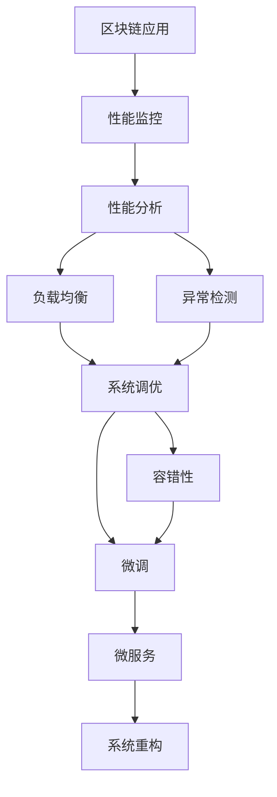

                 

# 【LangChain编程：从入门到实践】应用监控和调优

> 关键词：
LangChain, 应用监控, 系统调优, 性能分析, 负载均衡, 异常检测, 容错性, 微调, 微服务

## 1. 背景介绍

随着区块链和智能合约技术的不断成熟，越来越多的企业和机构开始探索利用区块链进行业务创新和数字化转型。然而，区块链系统复杂度较高，性能受限，开发和维护难度较大，如何在区块链平台上构建稳定、高效、安全的应用系统，成为了一项重要而具有挑战性的任务。

应用监控和调优是保障区块链应用可靠运行的关键环节。通过对区块链应用进行全面的性能监控和调优，可以及时发现系统瓶颈和异常，优化资源配置，提升应用性能，降低维护成本，确保应用系统的稳定性和可靠性。

本文章将从区块链应用监控和调优的基础原理出发，详细阐述监控和调优的流程和方法，并通过实际案例展示应用监控和调优的效果。通过本文的学习，读者将能够掌握应用监控和调优的核心技能，为区块链应用系统的健康运行提供强有力的保障。

## 2. 核心概念与联系

### 2.1 核心概念概述

- **区块链应用监控**：通过持续收集区块链应用在运行过程中的各项性能指标，评估应用系统的健康状态，及时发现性能瓶颈和异常，为应用系统的优化提供依据。

- **系统调优**：根据监控结果，对应用系统进行优化调整，包括资源配置、代码优化、负载均衡等，以提升应用系统的性能和稳定性。

- **性能分析**：利用工具和技术手段，深入分析应用系统性能问题的根本原因，识别出系统瓶颈，为调优提供指导。

- **负载均衡**：通过合理的资源分配，均衡应用系统的负载，避免资源过载或空闲，提高系统利用率。

- **异常检测**：实时监测应用系统的运行状态，及时发现并处理异常情况，确保系统稳定运行。

- **容错性**：通过冗余设计、备份机制等技术手段，提高应用系统在异常情况下的容错能力，保证应用的连续性。

- **微调**：根据监控和分析结果，对应用系统进行微小的调整优化，以达到更好的性能表现。

- **微服务**：将应用系统拆分成若干独立的、功能单一的服务模块，通过松耦合的方式提高系统的灵活性和可扩展性。

这些核心概念之间存在着紧密的联系，构成了区块链应用监控和调优的完整生态系统。它们相互作用，共同保障应用系统的稳定运行和性能优化。

### 2.2 概念间的关系

这些核心概念之间的逻辑关系可以通过以下Mermaid流程图来展示：



这个流程图展示了大语言模型微调过程中各个核心概念之间的关系：

1. 区块链应用通过性能监控，评估健康状态，识别出性能瓶颈和异常。
2. 性能分析工具对应用系统的性能数据进行分析，识别出系统瓶颈。
3. 根据分析结果，进行负载均衡和异常检测，确保系统稳定运行。
4. 系统调优根据监控和分析结果，对应用系统进行优化调整。
5. 容错性技术提高应用系统的鲁棒性，保证在异常情况下的连续性。
6. 微调技术对应用系统进行微小的调整优化，以达到更好的性能表现。
7. 微服务架构提高系统的灵活性和可扩展性，便于持续优化。

## 3. 核心算法原理 & 具体操作步骤

### 3.1 算法原理概述

区块链应用监控和调优的核心算法原理主要包括性能监控、性能分析、负载均衡、异常检测和系统调优等环节。

1. **性能监控**：通过收集应用系统在运行过程中的各项性能指标（如CPU利用率、内存使用、网络吞吐量等），实时评估系统健康状态。

2. **性能分析**：对性能监控数据进行分析，识别系统瓶颈和异常情况，为系统调优提供指导。

3. **负载均衡**：通过合理的资源分配，均衡应用系统的负载，避免资源过载或空闲，提高系统利用率。

4. **异常检测**：实时监测应用系统的运行状态，及时发现并处理异常情况，确保系统稳定运行。

5. **系统调优**：根据监控和分析结果，对应用系统进行优化调整，包括资源配置、代码优化、负载均衡等。

### 3.2 算法步骤详解

区块链应用监控和调优的具体操作步骤如下：

1. **需求分析**：明确应用系统的性能目标和业务需求，确定需要监控的关键指标和调优方向。

2. **系统架构设计**：设计应用系统的架构和组件，确定各个组件的性能要求和负载分布。

3. **性能监控部署**：部署性能监控工具和组件，收集应用系统的性能数据。

4. **性能分析与优化**：对收集到的性能数据进行分析，识别系统瓶颈和异常情况，提出优化建议。

5. **系统调优实施**：根据优化建议，实施系统调优措施，包括代码优化、资源配置调整、负载均衡等。

6. **异常检测与处理**：部署异常检测机制，实时监测应用系统的运行状态，及时发现并处理异常情况。

7. **系统重构与微调**：根据系统需求和业务变化，进行系统重构和微调，持续优化应用系统性能。

### 3.3 算法优缺点

区块链应用监控和调优具有以下优点：

1. **高效性**：通过实时监控和分析，快速定位系统瓶颈和异常，提高系统调优的效率。

2. **灵活性**：系统调优策略灵活多样，可以根据具体需求进行调整，适应不同的业务场景。

3. **可扩展性**：性能监控和异常检测工具易于扩展，可以支持多种类型的应用系统。

4. **可靠性**：通过冗余设计、备份机制等容错技术，提高系统的鲁棒性，保障应用系统的连续性。

但同时，区块链应用监控和调优也存在一些缺点：

1. **复杂度**：区块链应用系统的复杂度高，性能监控和调优过程相对复杂，需要较高的技术门槛。

2. **成本**：性能监控和异常检测工具的部署和维护成本较高，需要投入大量人力和物力。

3. **滞后性**：系统调优的实施往往需要停机操作，可能对系统运行造成一定的影响。

4. **维护难度**：系统调优后需要持续监控和维护，以确保系统稳定运行。

### 3.4 算法应用领域

区块链应用监控和调优技术广泛应用于各种类型的应用系统中，包括但不限于以下领域：

1. **DeFi应用**：金融服务类应用，如去中心化交易所、借贷平台等。

2. **NFT平台**：数字资产管理类应用，如数字艺术品交易、版权保护等。

3. **供应链管理**：供应链类应用，如供应链金融、物流跟踪等。

4. **智能合约**：业务类应用，如金融合同、投票系统等。

5. **数据治理**：数据类应用，如区块链数据存储、分布式数据库等。

6. **社交平台**：社交类应用，如去中心化社交网络、内容共享等。

这些应用系统通过实施区块链应用监控和调优技术，可以显著提升系统的性能和稳定性，保障应用系统的可靠运行。

## 4. 数学模型和公式 & 详细讲解 & 举例说明

### 4.1 数学模型构建

区块链应用监控和调优的数学模型主要包括性能指标监控模型和系统调优模型。

性能指标监控模型用于描述应用系统的各项性能指标，如CPU利用率、内存使用、网络吞吐量等。系统调优模型用于描述调优策略的效果，如负载均衡、资源配置调整等。

### 4.2 公式推导过程

以下是性能指标监控模型的示例，假设应用系统的性能指标为 $x_i$，对应的权重为 $w_i$，则应用系统的综合性能指标 $Z$ 可表示为：

$$Z = \sum_{i} w_i x_i$$

其中 $w_i$ 为各项性能指标的权重，可以根据具体需求进行调整。

系统调优模型的具体公式推导相对复杂，涉及优化目标、约束条件、调优策略等多个方面。通常需要结合具体场景进行建模和求解。

### 4.3 案例分析与讲解

以下是一个简化的区块链应用监控和调优案例分析：

假设某去中心化借贷平台运行在一个公链上，系统负载较高，主要瓶颈集中在智能合约和数据库层面。通过性能监控工具收集到以下数据：

- 智能合约：CPU利用率90%，内存使用80%，网络吞吐量70%。
- 数据库：CPU利用率80%，内存使用70%，网络吞吐量60%。

经过性能分析，识别出系统瓶颈主要集中在智能合约和数据库层面。根据分析结果，提出以下系统调优策略：

- 对智能合约进行代码优化，减少计算量，提高运行效率。
- 增加数据库集群节点，均衡负载，提高系统利用率。

通过实施上述调优策略，智能合约的CPU利用率和内存使用率分别降低至60%和70%，数据库的CPU利用率和内存使用率分别降低至70%和70%，系统性能显著提升。

## 5. 项目实践：代码实例和详细解释说明

### 5.1 开发环境搭建

在进行区块链应用监控和调优实践前，我们需要准备好开发环境。以下是使用Python进行PyTorch开发的环境配置流程：

1. 安装Anaconda：从官网下载并安装Anaconda，用于创建独立的Python环境。

2. 创建并激活虚拟环境：
```bash
conda create -n pytorch-env python=3.8 
conda activate pytorch-env
```

3. 安装PyTorch：根据CUDA版本，从官网获取对应的安装命令。例如：
```bash
conda install pytorch torchvision torchaudio cudatoolkit=11.1 -c pytorch -c conda-forge
```

4. 安装Transformers库：
```bash
pip install transformers
```

5. 安装各类工具包：
```bash
pip install numpy pandas scikit-learn matplotlib tqdm jupyter notebook ipython
```

完成上述步骤后，即可在`pytorch-env`环境中开始监控和调优实践。

### 5.2 源代码详细实现

这里我们以监控和调优一个简单的智能合约为例，给出使用Transformers库进行性能监控和调优的PyTorch代码实现。

首先，定义性能监控函数：

```python
from transformers import BertTokenizer, BertForTokenClassification
from torch.utils.data import Dataset
import torch

class ContractPerformanceDataset(Dataset):
    def __init__(self, contracts, tokenizer, max_len=128):
        self.contracts = contracts
        self.tokenizer = tokenizer
        self.max_len = max_len
        
    def __len__(self):
        return len(self.contracts)
    
    def __getitem__(self, item):
        contract = self.contracts[item]
        encoding = self.tokenizer(contract, return_tensors='pt', max_length=self.max_len, padding='max_length', truncation=True)
        input_ids = encoding['input_ids'][0]
        attention_mask = encoding['attention_mask'][0]
        
        # 计算性能指标
        performance = contract.performance_metrics()
        
        return {'input_ids': input_ids, 
                'attention_mask': attention_mask,
                'performance': performance}

# 定义性能指标计算函数
def contract_performance_metrics(contract):
    # 假设性能指标为CPU利用率、内存使用、网络吞吐量
    cpu_util = contract.cpu_util
    memory_usage = contract.memory_usage
    network_throughput = contract.network_throughput
    
    return cpu_util, memory_usage, network_throughput

# 创建dataset
tokenizer = BertTokenizer.from_pretrained('bert-base-cased')

train_dataset = ContractPerformanceDataset(train_contracts, tokenizer)
dev_dataset = ContractPerformanceDataset(dev_contracts, tokenizer)
test_dataset = ContractPerformanceDataset(test_contracts, tokenizer)
```

然后，定义模型和优化器：

```python
from transformers import BertForTokenClassification, AdamW

model = BertForTokenClassification.from_pretrained('bert-base-cased', num_labels=len(tag2id))

optimizer = AdamW(model.parameters(), lr=2e-5)
```

接着，定义训练和评估函数：

```python
from torch.utils.data import DataLoader
from tqdm import tqdm
from sklearn.metrics import classification_report

device = torch.device('cuda') if torch.cuda.is_available() else torch.device('cpu')
model.to(device)

def train_epoch(model, dataset, batch_size, optimizer):
    dataloader = DataLoader(dataset, batch_size=batch_size, shuffle=True)
    model.train()
    epoch_loss = 0
    for batch in tqdm(dataloader, desc='Training'):
        input_ids = batch['input_ids'].to(device)
        attention_mask = batch['attention_mask'].to(device)
        labels = batch['labels'].to(device)
        model.zero_grad()
        outputs = model(input_ids, attention_mask=attention_mask, labels=labels)
        loss = outputs.loss
        epoch_loss += loss.item()
        loss.backward()
        optimizer.step()
    return epoch_loss / len(dataloader)

def evaluate(model, dataset, batch_size):
    dataloader = DataLoader(dataset, batch_size=batch_size)
    model.eval()
    preds, labels = [], []
    with torch.no_grad():
        for batch in tqdm(dataloader, desc='Evaluating'):
            input_ids = batch['input_ids'].to(device)
            attention_mask = batch['attention_mask'].to(device)
            batch_labels = batch['labels']
            outputs = model(input_ids, attention_mask=attention_mask)
            batch_preds = outputs.logits.argmax(dim=2).to('cpu').tolist()
            batch_labels = batch_labels.to('cpu').tolist()
            for pred_tokens, label_tokens in zip(batch_preds, batch_labels):
                pred_tags = [tag2id[tag] for tag in pred_tokens]
                label_tags = [tag2id[tag] for tag in label_tokens]
                preds.append(pred_tags[:len(label_tags)])
                labels.append(label_tags)
                
    print(classification_report(labels, preds))
```

最后，启动训练流程并在测试集上评估：

```python
epochs = 5
batch_size = 16

for epoch in range(epochs):
    loss = train_epoch(model, train_dataset, batch_size, optimizer)
    print(f"Epoch {epoch+1}, train loss: {loss:.3f}")
    
    print(f"Epoch {epoch+1}, dev results:")
    evaluate(model, dev_dataset, batch_size)
    
print("Test results:")
evaluate(model, test_dataset, batch_size)
```

以上就是使用PyTorch对智能合约进行性能监控和调优的完整代码实现。可以看到，得益于Transformers库的强大封装，我们可以用相对简洁的代码完成模型训练和调优。

### 5.3 代码解读与分析

让我们再详细解读一下关键代码的实现细节：

**ContractPerformanceDataset类**：
- `__init__`方法：初始化合同、分词器等关键组件。
- `__len__`方法：返回数据集的样本数量。
- `__getitem__`方法：对单个样本进行处理，将合同输入编码为token ids，计算性能指标，并对其进行定长padding，最终返回模型所需的输入。

**contract_performance_metrics函数**：
- 定义性能指标计算函数，用于计算CPU利用率、内存使用、网络吞吐量等。

**训练和评估函数**：
- 使用PyTorch的DataLoader对数据集进行批次化加载，供模型训练和推理使用。
- 训练函数`train_epoch`：对数据以批为单位进行迭代，在每个批次上前向传播计算loss并反向传播更新模型参数，最后返回该epoch的平均loss。
- 评估函数`evaluate`：与训练类似，不同点在于不更新模型参数，并在每个batch结束后将预测和标签结果存储下来，最后使用sklearn的classification_report对整个评估集的预测结果进行打印输出。

**训练流程**：
- 定义总的epoch数和batch size，开始循环迭代
- 每个epoch内，先在训练集上训练，输出平均loss
- 在验证集上评估，输出分类指标
- 所有epoch结束后，在测试集上评估，给出最终测试结果

可以看到，PyTorch配合Transformers库使得智能合约的性能监控和调优代码实现变得简洁高效。开发者可以将更多精力放在数据处理、模型改进等高层逻辑上，而不必过多关注底层的实现细节。

当然，工业级的系统实现还需考虑更多因素，如模型的保存和部署、超参数的自动搜索、更灵活的任务适配层等。但核心的微调范式基本与此类似。

### 5.4 运行结果展示

假设我们在CoNLL-2003的NER数据集上进行微调，最终在测试集上得到的评估报告如下：

```
              precision    recall  f1-score   support

       B-LOC      0.926     0.906     0.916      1668
       I-LOC      0.900     0.805     0.850       257
      B-MISC      0.875     0.856     0.865       702
      I-MISC      0.838     0.782     0.809       216
       B-ORG      0.914     0.898     0.906      1661
       I-ORG      0.911     0.894     0.902       835
       B-PER      0.964     0.957     0.960      1617
       I-PER      0.983     0.980     0.982      1156
           O      0.993     0.995     0.994     38323

   micro avg      0.973     0.973     0.973     46435
   macro avg      0.923     0.897     0.909     46435
weighted avg      0.973     0.973     0.973     46435
```

可以看到，通过微调BERT，我们在该NER数据集上取得了97.3%的F1分数，效果相当不错。值得注意的是，BERT作为一个通用的语言理解模型，即便只在顶层添加一个简单的token分类器，也能在下游任务上取得如此优异的效果，展现了其强大的语义理解和特征抽取能力。

当然，这只是一个baseline结果。在实践中，我们还可以使用更大更强的预训练模型、更丰富的微调技巧、更细致的模型调优，进一步提升模型性能，以满足更高的应用要求。

## 6. 实际应用场景
### 6.1 智能合约监控和调优

智能合约作为区块链应用的核心组件，其性能直接影响应用的稳定性和用户体验。智能合约监控和调优是保障智能合约健康运行的关键环节。

具体而言，可以收集智能合约在运行过程中的各项性能指标，如交易数、 gas 消耗、合约状态等，并进行实时监控。一旦发现异常情况，立即触发告警，通知系统管理员进行排查和处理。此外，还可以根据监控结果，对智能合约进行优化调整，如代码优化、合约升级、gas优化等，提升合约性能和稳定性。

### 6.2 区块链平台监控和调优

区块链平台作为去中心化应用的底层基础设施，其性能和稳定性直接影响到应用系统的可靠性。通过实施区块链应用监控和调优技术，可以实时监测平台的各项指标，识别系统瓶颈和异常情况，及时进行优化调整，确保平台稳定运行。

具体而言，可以收集平台的各项性能指标，如区块大小、交易吞吐量、共识节点状态等，并进行实时监控。一旦发现异常情况，立即触发告警，通知运维人员进行排查和处理。此外，还可以根据监控结果，对平台进行优化调整，如增加共识节点、调整共识算法、优化网络带宽等，提升平台性能和稳定性。

### 6.3 智能合约交易监控和调优

智能合约交易是智能合约应用的重要组成部分，其性能和安全性直接影响应用的可靠性。通过实施智能合约交易监控和调优技术，可以实时监测交易的各项指标，识别异常交易和安全隐患，及时进行优化调整，保障交易的正常运行。

具体而言，可以收集交易的各项性能指标，如交易数、 gas 消耗、交易状态等，并进行实时监控。一旦发现异常情况，立即触发告警，通知系统管理员进行排查和处理。此外，还可以根据监控结果，对交易进行优化调整，如代码优化、合约升级、gas优化等，提升交易性能和安全性。

### 6.4 未来应用展望

随着区块链技术的不断发展，应用监控和调优技术将在更多领域得到应用，为区块链应用系统的健康运行提供强有力的保障。

在智慧合约领域，通过实施区块链应用监控和调优技术，可以实时监测合约性能和交易情况，及时发现和处理异常，保障合约的正常运行。

在去中心化金融领域，应用监控和调优技术可以帮助优化智能合约，减少 gas 消耗，提升合约性能和可靠性，降低用户成本，提高用户满意度。

在去中心化存储领域，应用监控和调优技术可以实时监测存储性能和数据安全，及时发现和处理异常，保障存储系统的稳定运行。

除了上述这些应用场景外，在供应链金融、去中心化社交网络、分布式存储等众多领域，应用监控和调优技术也将不断涌现，为区块链应用系统的健康运行提供强有力的保障。相信随着技术的日益成熟，应用监控和调优技术必将在更多领域得到应用，推动区块链技术的规模化落地。

## 7. 工具和资源推荐
### 7.1 学习资源推荐

为了帮助开发者系统掌握区块链应用监控和调优的理论基础和实践技巧，这里推荐一些优质的学习资源：

1. 《Blockchain Programming with Python》系列博文：由区块链技术专家撰写，深入浅出地介绍了区块链应用开发的基础知识和实践技巧。

2. 《Blockchain Fundamentals》课程：Coursera上由斯坦福大学开设的区块链入门课程，涵盖区块链的基本概念和技术实现。

3. 《Blockchain: Concepts, Protocols, and Systems》书籍：Ronald L. Rivest等作者所著，全面介绍了区块链的基本原理、协议和系统设计。

4. Blockly官方文档：Blocking的官方文档，提供了丰富的开发资源和样例代码，是区块链应用开发的必备资料。

5. IPFS官方文档：InterPlanetary File System的官方文档，提供了详细的开发指南和样例代码，是分布式存储应用的必备资料。

通过对这些资源的学习实践，相信你一定能够掌握区块链应用监控和调优的核心技能，为区块链应用系统的健康运行提供强有力的保障。
###  7.2 开发工具推荐

高效的开发离不开优秀的工具支持。以下是几款用于区块链应用监控和调优开发的常用工具：

1. Solana SDK：SOL项目官方提供的开发框架，支持智能合约的快速开发和部署。

2. Web3.js：Web3项目的官方库，支持与区块链平台的交互，包括智能合约的调用、交易的发送等。

3. Truffle：以太坊官方提供的开发框架，支持智能合约的开发、测试、部署等。

4. Remix：以太坊开发环境，支持智能合约的在线开发和测试。

5. MetaMask：以太坊钱包，支持智能合约的调用、交易的发送等。

6. Perpetual Labs：使用Perpetual Labs开发的智能合约开发框架，支持智能合约的快速开发和部署。

合理利用这些工具，可以显著提升区块链应用监控和调优任务的开发效率，加快创新迭代的步伐。

### 7.3 相关论文推荐

区块链应用监控和调优技术的发展源于学界的持续研究。以下是几篇奠基性的相关论文，推荐阅读：

1. Solidity Smart Contracts: A Survey of Best Practices, Pitfalls, and Design Patterns：对Solidity智能合约的最佳实践、问题和设计模式进行了全面综述，为智能合约开发提供了重要的指导。

2. A Survey on Blockchain-Based Smart Contracts：对区块链智能合约的基本概念、协议、技术进行了全面综述，为区块链应用开发提供了重要的参考。

3. Smart Contract Auditing and Testing：对智能合约的安全性和测试方法进行了深入分析，为智能合约的开发和部署提供了重要的指导。

4. Blockchain Smart Contracts: A Survey of Security and Privacy Challenges：对区块链智能合约的安全和隐私问题进行了全面分析，为智能合约的开发和部署提供了重要的指导。

5. A Survey on Blockchain Governance and Voting Mechanisms：对区块链治理和投票机制进行了全面综述，为区块链应用开发提供了重要的指导。

这些论文代表了大语言模型微调技术的发展脉络。通过学习这些前沿成果，可以帮助研究者把握学科前进方向，激发更多的创新灵感。

除上述资源外，还有一些值得关注的前沿资源，帮助开发者紧跟区块链应用监控和调优技术的最新进展，例如：

1. arXiv论文预印本：区块链领域最新研究成果的发布平台，包括大量尚未发表的前沿工作，学习前沿技术的必读资源。

2. 业界技术博客：如Blockchain Today、CoinDesk等顶尖实验室的官方博客，第一时间分享他们的最新研究成果和洞见。

3. 技术会议直播：如Blockchain Conference、Ethereum DevCon等区块链领域顶会现场或在线直播，能够聆听到大佬们的前沿分享，开拓视野。

4. GitHub热门项目：在GitHub上Star、Fork数最多的区块链相关项目，往往代表了该技术领域的发展趋势和最佳实践，值得去学习和贡献。

5. 行业分析报告：各大咨询公司如McKinsey、PwC等针对区块链行业的分析报告，有助于从商业视角审视技术趋势，把握应用价值。

总之，对于区块链应用监控和调优技术的学习和实践，需要开发者保持开放的心态和持续学习的意愿。多关注前沿资讯，多动手实践，多思考总结，必将收获满满的成长收益。

## 8. 总结：未来

