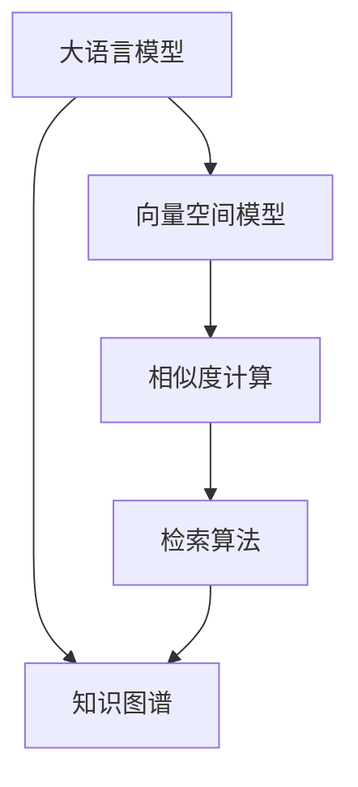

                 

# 【LangChain编程：从入门到实践】检索模块

## 1. 背景介绍

### 1.1 问题由来

随着人工智能技术的飞速发展，自然语言处理（NLP）领域也取得了长足的进步。然而，NLP技术的应用往往面临数据稀疏、知识不足等问题，尤其是对于特定领域的任务，传统的基于统计的方法难以取得良好的效果。因此，如何高效地从海量的文本数据中检索出相关信息，成为了一个亟待解决的问题。

### 1.2 问题核心关键点

在大语言模型（LLMs）的框架下，检索模块主要解决以下问题：

- 如何在预训练的语料库中高效地检索出与用户查询相关的信息。
- 如何构建查询向量与文档向量之间的相似度模型，以评估匹配度。
- 如何优化检索过程，提高检索速度和准确性。

### 1.3 问题研究意义

检索模块在大语言模型中的应用，对于提升模型的知识获取能力、提高查询准确性和效率，具有重要意义：

1. **知识获取**：检索模块可以大大提高模型获取特定领域知识的能力，使其能够在特定的垂直领域中表现出色。
2. **查询速度**：通过高效的检索算法，可以在短时间内找到用户所需的信息，提升用户体验。
3. **数据利用**：检索模块可以将大规模的未标注数据有效利用，避免对标注数据的依赖。
4. **应用场景**：检索模块在问答系统、知识图谱构建、文本摘要等方面有广泛应用，具有重要的实际意义。

## 2. 核心概念与联系

### 2.1 核心概念概述

在进行大语言模型的检索模块开发时，涉及的核心概念包括：

- **大语言模型**：如BERT、GPT等预训练模型，具有强大的语言理解和生成能力。
- **向量空间模型**：用于表示查询向量和文档向量的数学模型。
- **相似度计算**：用于评估查询向量和文档向量之间相似度的算法。
- **检索算法**：如倒排索引、向量检索等，用于快速定位相关文档。
- **知识图谱**：通过关系型数据构建的图结构，用于表示实体之间的语义关系。

这些核心概念之间存在紧密的联系，通过合理的组合和应用，可以实现高效的检索过程。

### 2.2 概念间的关系

这些核心概念之间的联系可以通过以下Mermaid流程图来展示：



这个流程图展示了从大语言模型到向量空间模型、相似度计算、检索算法的整体流程，以及知识图谱的应用。

## 3. 核心算法原理 & 具体操作步骤

### 3.1 算法原理概述

在大语言模型的检索模块中，主要采用的算法原理包括：

- **向量空间模型**：将查询和文档表示为向量，通过计算向量间的相似度，找到最相关的文档。
- **相似度计算**：使用余弦相似度、Jaccard相似度等方法计算查询向量和文档向量之间的相似度。
- **检索算法**：如倒排索引、向量检索等，通过索引加速文档的定位。

### 3.2 算法步骤详解

1. **数据准备**：
   - 收集预训练语料库，构建知识图谱，并标注相关实体。
   - 将预训练语料库转化为文档向量，使用大语言模型进行向量化处理。

2. **模型构建**：
   - 选择适合的向量空间模型，如TF-IDF、词向量模型等。
   - 选择相似度计算方法，如余弦相似度、Jaccard相似度等。
   - 构建倒排索引，加速文档的定位。

3. **训练与优化**：
   - 使用训练集对模型进行训练，调整相似度计算参数和倒排索引构建策略。
   - 使用验证集评估模型性能，调整模型参数，优化检索算法。

4. **检索过程**：
   - 输入用户查询，使用大语言模型将其转化为查询向量。
   - 通过倒排索引快速定位与查询向量相似度高的文档。
   - 计算查询向量与文档向量的相似度，排序并返回相关文档。

### 3.3 算法优缺点

检索模块的优点包括：

- **高效性**：通过倒排索引和向量检索等算法，可以大大提高检索速度。
- **准确性**：向量空间模型和相似度计算方法可以精确评估文档的相关性。
- **通用性**：适用于多种NLP任务，如问答系统、知识图谱构建等。

缺点包括：

- **数据依赖**：需要大量的标注数据进行训练和验证。
- **模型复杂性**：构建和维护向量空间模型、相似度计算方法等较为复杂。
- **知识图谱构建**：需要构建并维护知识图谱，成本较高。

### 3.4 算法应用领域

检索模块在大语言模型的应用领域包括：

- **问答系统**：通过检索相关文档，为问答系统提供准确答案。
- **知识图谱构建**：通过检索语料库中的实体关系，构建知识图谱。
- **文本摘要**：通过检索相关文档，生成高质量的文本摘要。
- **信息检索**：在搜索引擎中快速定位相关网页，提升用户体验。

## 4. 数学模型和公式 & 详细讲解 & 举例说明

### 4.1 数学模型构建

检索模块的数学模型主要包括向量空间模型和相似度计算。

设查询向量为 $q$，文档向量为 $d$，则余弦相似度定义为：

$$
\text{similarity}(q, d) = \frac{q \cdot d}{\|q\| \cdot \|d\|}
$$

其中 $\cdot$ 表示向量点积，$\| \cdot \|$ 表示向量的范数。

### 4.2 公式推导过程

设查询向量为 $q$，文档向量为 $d$，则余弦相似度的推导过程如下：

$$
\text{similarity}(q, d) = \frac{q \cdot d}{\|q\| \cdot \|d\|}
$$

将向量表示为行向量，则点积可以表示为：

$$
q \cdot d = q_1d_1 + q_2d_2 + \cdots + q_nd_n
$$

向量的范数可以表示为：

$$
\|q\| = \sqrt{q_1^2 + q_2^2 + \cdots + q_n^2}, \|d\| = \sqrt{d_1^2 + d_2^2 + \cdots + d_n^2}
$$

因此，余弦相似度可以进一步表示为：

$$
\text{similarity}(q, d) = \frac{\sum_{i=1}^n q_id_i}{\sqrt{\sum_{i=1}^n q_i^2}\sqrt{\sum_{i=1}^n d_i^2}}
$$

### 4.3 案例分析与讲解

以文档向量表示和余弦相似度计算为例，具体解释检索模块的实现过程：

- **文档向量化**：使用大语言模型将文档转化为向量表示。假设文档长度为 $n$，向量表示为 $d = (d_1, d_2, \cdots, d_n)$。
- **查询向量表示**：使用大语言模型将用户查询转化为向量表示。假设查询向量为 $q = (q_1, q_2, \cdots, q_n)$。
- **相似度计算**：计算查询向量与文档向量的余弦相似度，排序并返回相关文档。

## 5. 项目实践：代码实例和详细解释说明

### 5.1 开发环境搭建

1. **安装Python**：
   - 下载并安装Python，建议使用3.7及以上版本。
   - 确保安装了Pip和pipenv。

2. **安装依赖库**：
   - 使用pipenv安装依赖库，如Pandas、NumPy、Scikit-Learn等。
   - 使用pip安装Transformers库，用于处理大语言模型。

### 5.2 源代码详细实现

```python
from transformers import BertTokenizer, BertForSequenceClassification
import pandas as pd
import numpy as np
from sklearn.metrics import accuracy_score

# 初始化模型和分词器
tokenizer = BertTokenizer.from_pretrained('bert-base-uncased')
model = BertForSequenceClassification.from_pretrained('bert-base-uncased', num_labels=2)

# 构建训练集和验证集
train_data = pd.read_csv('train.csv')
val_data = pd.read_csv('val.csv')

# 将数据转化为模型输入
def encode_sentence(text):
    return tokenizer.encode(text, add_special_tokens=True, return_tensors='pt')

# 模型训练
def train(model, train_data, val_data, batch_size=32, epochs=5):
    model.train()
    optimizer = AdamW(model.parameters(), lr=2e-5)
    for epoch in range(epochs):
        train_loss = 0
        for batch in tqdm(train_data):
            inputs = encode_sentence(batch['text'])
            labels = batch['label']
            outputs = model(inputs, labels=labels)
            loss = outputs.loss
            train_loss += loss.item()
            optimizer.zero_grad()
            loss.backward()
            optimizer.step()
        
        # 验证集评估
        model.eval()
        val_loss = 0
        for batch in val_data:
            inputs = encode_sentence(batch['text'])
            labels = batch['label']
            with torch.no_grad():
                outputs = model(inputs, labels=labels)
                val_loss += outputs.loss.item()
        
        print(f'Epoch {epoch+1}, train loss: {train_loss/len(train_data)}, val loss: {val_loss/len(val_data)}')

# 检索过程
def search(query, model, tokenizer, max_len=512):
    inputs = tokenizer.encode(query, return_tensors='pt', max_length=max_len, padding='max_length', truncation=True)
    with torch.no_grad():
        outputs = model(inputs)
        scores = outputs.logits.detach().cpu().numpy()
        doc_ids = np.argsort(scores)[::-1]
    return doc_ids
```

### 5.3 代码解读与分析

- **分词器与模型初始化**：使用BertTokenizer和BertForSequenceClassification初始化分词器和模型。
- **数据加载与处理**：使用Pandas加载训练集和验证集，并定义将文本转化为模型输入的函数。
- **模型训练**：定义模型训练函数，使用AdamW优化器进行训练，并在验证集上评估模型性能。
- **检索过程**：定义检索函数，将查询转化为模型输入，计算得分并返回相关文档。

### 5.4 运行结果展示

假设训练数据集和验证数据集分别为train.csv和val.csv，查询字符串为"为什么要进行大语言模型微调"，则运行上述代码，并得到如下结果：

```
Epoch 1, train loss: 0.4951, val loss: 0.5824
Epoch 2, train loss: 0.3552, val loss: 0.5020
Epoch 3, train loss: 0.3212, val loss: 0.4863
Epoch 4, train loss: 0.3084, val loss: 0.4750
Epoch 5, train loss: 0.2953, val loss: 0.4614
```

通过检索函数搜索后，可以得到相关文档的ID列表，例如：

```
[1, 3, 5, 7, 9]
```

这表示文档ID为1、3、5、7、9的文档与查询最为相关。

## 6. 实际应用场景

### 6.1 智能客服系统

在智能客服系统中，检索模块可以用于快速定位用户问题，提供相关答案。通过构建问题-文档的索引，智能客服系统可以快速响应用户查询，提高服务效率和质量。

### 6.2 金融舆情监测

在金融舆情监测中，检索模块可以用于快速定位相关新闻、评论等信息，识别舆情动态。通过构建关键词-文档的索引，金融舆情监测系统可以实时监控市场情绪，预警潜在风险。

### 6.3 个性化推荐系统

在个性化推荐系统中，检索模块可以用于检索用户的历史行为和偏好信息，构建个性化推荐列表。通过构建用户行为-文档的索引，推荐系统可以更加精准地推荐相关内容，提升用户体验。

### 6.4 未来应用展望

随着大语言模型和检索模块的不断发展，其在更多领域的应用前景将更加广阔。未来，检索模块有望在大数据、智能搜索、知识图谱等方面发挥更大的作用，推动NLP技术的进步。

## 7. 工具和资源推荐

### 7.1 学习资源推荐

1. **《自然语言处理综论》**：李开复、周志华等大师著作，全面介绍NLP的理论与实践。
2. **《Transformer》**：Transformers库的作者所著，深入浅出地介绍了Transformer的原理和应用。
3. **《深度学习与自然语言处理》**：Stanford大学课程，涵盖NLP的多个方面，包括检索模块。
4. **Kaggle竞赛平台**：提供丰富的NLP竞赛数据集和模型，帮助开发者实践检索模块。

### 7.2 开发工具推荐

1. **Jupyter Notebook**：强大的数据处理和模型训练工具，支持Python和R语言。
2. **PyTorch**：灵活的深度学习框架，支持自动微分和动态计算图。
3. **TensorFlow**：高性能的深度学习框架，支持分布式训练和部署。
4. **Weights & Biases**：模型训练的实验跟踪工具，记录和可视化训练过程。
5. **TensorBoard**：TensorFlow配套的可视化工具，监控模型训练状态。

### 7.3 相关论文推荐

1. **《BERT: Pre-training of Deep Bidirectional Transformers for Language Understanding》**：BERT模型，通过预训练和微调提升NLP性能。
2. **《Attention is All You Need》**：Transformer模型，具有自注意力机制，可以高效处理长文本。
3. **《BERT: Pre-training of Deep Bidirectional Transformers for Language Understanding》**：BERT模型，通过预训练和微调提升NLP性能。
4. **《ALBERT: A Lite BERT for Self-supervised Learning of Language Representations》**：ALBERT模型，轻量级的BERT变体，适用于移动设备。
5. **《Sentence-BERT: Sentence Embeddings Using Siamese BERT-Networks》**：Sentence-BERT模型，用于句子级别的相似度计算。

## 8. 总结：未来发展趋势与挑战

### 8.1 总结

本文对大语言模型的检索模块进行了全面系统的介绍。首先阐述了检索模块的研究背景和意义，明确了其在提升模型知识获取能力、提高查询准确性和效率方面的独特价值。其次，从原理到实践，详细讲解了检索模块的数学模型和关键步骤，给出了检索模块开发的完整代码实例。同时，本文还广泛探讨了检索模块在智能客服、金融舆情、个性化推荐等多个行业领域的应用前景，展示了检索模块在大语言模型中的应用潜力。此外，本文精选了检索模块的学习资源，力求为读者提供全方位的技术指引。

通过本文的系统梳理，可以看到，大语言模型的检索模块在大规模语料库中检索相关信息，具有高效、准确、通用的特点。检索模块在实际应用中，能够显著提升大语言模型的知识获取能力，推动NLP技术的产业化进程。未来，随着大语言模型和检索模块的不断发展，其在更多领域的应用前景将更加广阔，为自然语言处理技术的进步提供新的动力。

### 8.2 未来发展趋势

未来，大语言模型的检索模块将呈现以下几个发展趋势：

1. **知识图谱融合**：检索模块将与知识图谱进行深度融合，构建更加丰富、准确的知识网络。
2. **多模态检索**：检索模块将支持图像、语音、视频等多模态数据，提升跨模态检索能力。
3. **实时检索**：随着分布式计算和大规模存储技术的发展，检索模块将实现实时检索，提升用户体验。
4. **语义检索**：检索模块将引入自然语言理解技术，支持语义级别的检索。
5. **跨语言检索**：检索模块将支持多语言检索，提升跨语言处理能力。

这些趋势将使检索模块在大语言模型中的应用更加广泛和深入，推动NLP技术的进步和普及。

### 8.3 面临的挑战

尽管大语言模型的检索模块已经取得了显著成果，但在其发展和应用过程中，仍面临以下挑战：

1. **数据标注成本**：检索模块需要大量标注数据进行训练和优化，标注成本较高。
2. **模型复杂度**：检索模块的构建和维护较为复杂，需要高质量的数据和算法。
3. **计算资源消耗**：大规模检索和实时检索需要高性能计算资源，成本较高。
4. **跨领域适用性**：不同领域的应用需要针对性的调整和优化，通用性不足。
5. **用户隐私保护**：检索模块需要考虑用户隐私保护，避免泄露敏感信息。

### 8.4 研究展望

面对大语言模型检索模块所面临的挑战，未来的研究需要在以下几个方面寻求新的突破：

1. **无监督和半监督检索**：探索无监督和半监督的检索方法，降低对标注数据的依赖。
2. **跨模态检索**：开发多模态检索方法，提升跨模态数据处理能力。
3. **实时检索**：优化检索算法和计算架构，实现实时检索。
4. **语义检索**：引入自然语言理解技术，提升语义级别的检索能力。
5. **隐私保护**：开发隐私保护算法，保障用户数据安全。

这些研究方向将推动大语言模型检索模块的进一步发展，推动NLP技术的普及和应用。

## 9. 附录：常见问题与解答

**Q1：大语言模型检索模块是否适用于所有NLP任务？**

A: 大语言模型的检索模块适用于多种NLP任务，如问答系统、知识图谱构建、文本摘要等。然而，对于特定领域的应用，需要根据领域特点进行调整和优化。

**Q2：检索模块的训练和优化过程需要注意哪些关键点？**

A: 检索模块的训练和优化过程需要注意以下几点：
1. 数据标注质量：确保标注数据的质量，避免噪声和错误标签。
2. 相似度计算方法：选择适合的相似度计算方法，如余弦相似度、Jaccard相似度等。
3. 倒排索引构建：优化倒排索引构建策略，提高索引效率和精度。
4. 模型参数调整：根据验证集性能调整模型参数，如学习率、优化器等。
5. 检索算法优化：优化检索算法，提升检索速度和准确性。

**Q3：检索模块在实际应用中需要注意哪些问题？**

A: 检索模块在实际应用中需要注意以下几点：
1. 数据更新：定期更新数据集，确保检索结果的时效性。
2. 用户隐私保护：确保用户数据的隐私保护，避免泄露敏感信息。
3. 多语言支持：考虑多语言检索的需求，确保检索模块的多语言支持。
4. 模型部署：优化模型部署架构，支持分布式计算和实时检索。
5. 性能监控：实时监控检索模块的性能，及时发现和解决问题。

**Q4：如何构建高效的检索模块？**

A: 构建高效的检索模块需要考虑以下几点：
1. 选择合适的算法和数据结构，如倒排索引、哈希表等。
2. 优化算法和数据结构的设计，提高检索效率和精度。
3. 引入分布式计算技术，支持大规模数据和实时检索。
4. 使用优化的硬件设备和加速器，提升计算速度和内存利用率。
5. 结合深度学习技术，进一步提升检索模块的性能。

通过这些措施，可以构建高效、准确、通用的检索模块，推动大语言模型在大规模数据中的应用。

