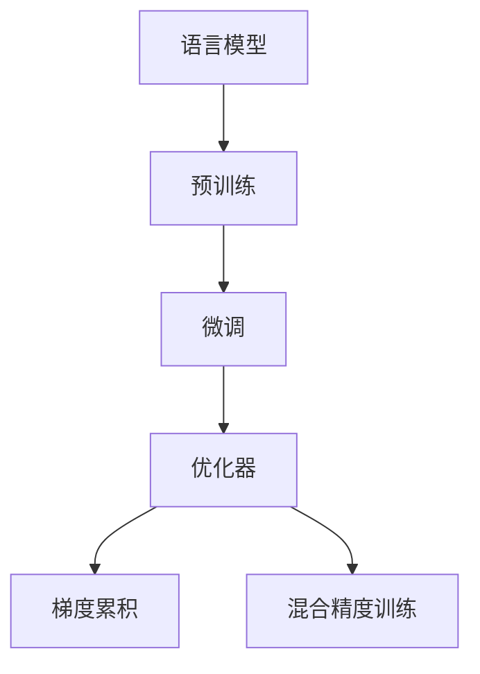

                 

# 【LangChain编程：从入门到实践】管理工具安装

## 1. 背景介绍

在大规模语言模型（Large Language Models, LLMs）的编程和应用过程中，管理工具的选用和安装是至关重要的。正确地安装和配置这些工具，不仅可以显著提升编程效率，还能确保模型的训练和推理过程稳定可靠。本章节将详细介绍常用的管理工具及其安装方法，为读者提供一份全面的入门指南。

## 2. 核心概念与联系

### 2.1 核心概念概述

在探讨LLMs编程中的管理工具安装时，需要理解几个核心概念：

- **语言模型（Language Models）**：基于神经网络构建的模型，能够从大量文本数据中学习语言的分布式表示。
- **预训练（Pre-training）**：在大规模无标签数据上训练模型，以获得通用的语言表示。
- **微调（Fine-tuning）**：在预训练模型的基础上，使用有标签数据进行任务特定的调整，以适应特定任务的需求。
- **优化器（Optimizer）**：用于控制模型参数更新的算法，如Adam、SGD等。
- **梯度累积（Gradient Accumulation）**：在有限内存条件下，通过累积梯度来模拟大批量训练，从而提高训练效果。
- **混合精度训练（Mixed-Precision Training）**：使用不同类型的浮点数（如16位和32位）来减少内存占用和提高计算速度。

这些概念构成了LLMs编程的基础，了解它们的工作原理和相互关系，是成功安装和管理工具的前提。

### 2.2 核心概念间的联系

这些核心概念之间的联系可以通过一个简单的Mermaid流程图来展示：



这个流程图展示了从语言模型到预训练，再到微调的过程，以及优化器、梯度累积和混合精度训练等技术的作用。

## 3. 核心算法原理 & 具体操作步骤

### 3.1 算法原理概述

基于LLMs的管理工具安装过程，主要是通过配置和管理不同的软件库和工具包，以实现模型的训练、推理和评估等功能。这些工具包括但不限于Python环境、深度学习框架、分布式计算工具等。

### 3.2 算法步骤详解

#### 3.2.1 环境准备

1. **安装Python环境**：
   - 下载并安装Python，推荐使用Anaconda或Miniconda。
   - 创建虚拟环境，以避免不同项目之间的依赖冲突。

   ```bash
   conda create -n myenv python=3.8
   conda activate myenv
   ```

2. **安装必要的依赖**：
   - 安装PyTorch、TensorFlow、TensorBoard等深度学习框架。
   - 安装Horovod、Dask等分布式计算工具。

   ```bash
   conda install pytorch torchvision torchaudio cudatoolkit=11.1 -c pytorch -c conda-forge
   conda install tensorflow
   conda install horovod
   conda install dask
   ```

#### 3.2.2 工具安装

1. **PyTorch和TensorFlow**：
   - 通过Python的pip工具安装，推荐使用官方文档提供的安装命令。

   ```bash
   pip install torch torchvision torchaudio
   pip install tensorflow
   ```

2. **Horovod**：
   - Horovod是用于分布式深度学习的开源框架，支持多种深度学习框架，包括TensorFlow、PyTorch和MXNet。

   ```bash
   pip install horovod
   ```

3. **Dask**：
   - Dask是一个灵活的并行计算库，适用于大规模数据处理和分布式计算。

   ```bash
   pip install dask
   ```

4. **TensorBoard**：
   - TensorBoard是TensorFlow的可视化工具，用于监控模型的训练过程和性能。

   ```bash
   pip install tensorboard
   ```

#### 3.2.3 环境配置

1. **配置环境变量**：
   - 确保所有工具的安装路径都在环境变量中，以避免在命令行中使用特定工具时出现路径错误。

   ```bash
   export PATH=$PATH:/path/to/pytorch:/path/to/tensorflow
   ```

2. **激活虚拟环境**：
   - 在Python环境中，激活虚拟环境，以确保使用的工具包与虚拟环境配置一致。

   ```bash
   conda activate myenv
   ```

### 3.3 算法优缺点

#### 3.3.1 优点

- **提升效率**：通过使用分布式计算工具，如Horovod和Dask，可以显著提升模型的训练速度和效率。
- **可扩展性**：现代深度学习框架支持在大规模数据集上进行训练和推理，能够应对更复杂的任务需求。
- **灵活性**：多种优化器和算法选项，可以根据具体任务需求进行灵活配置。

#### 3.3.2 缺点

- **资源需求高**：大规模模型的训练和推理需要高性能的硬件设备，如GPU和TPU。
- **学习曲线陡峭**：初次接触深度学习框架和分布式计算的用户可能需要一定的时间进行学习和适应。
- **配置复杂**：不同的工具和框架需要不同的配置，特别是分布式训练时的配置。

### 3.4 算法应用领域

这些管理工具在多个领域都有广泛的应用，包括：

- **自然语言处理（NLP）**：如文本分类、情感分析、机器翻译等任务。
- **计算机视觉（CV）**：如图像识别、物体检测、视频分析等任务。
- **语音识别与处理**：如语音转文本、情感分析、语音合成等任务。
- **推荐系统**：如商品推荐、新闻推荐等任务。
- **金融分析**：如股票预测、风险评估等任务。
- **医疗诊断**：如疾病预测、基因分析等任务。

## 4. 数学模型和公式 & 详细讲解 & 举例说明

### 4.1 数学模型构建

在LLMs的管理工具安装中，数学模型主要是指深度学习模型的构建。以一个简单的全连接神经网络为例，其数学模型如下：

$$
y = Wx + b
$$

其中，$y$ 是输出，$x$ 是输入，$W$ 是权重矩阵，$b$ 是偏置向量。

### 4.2 公式推导过程

假设输入 $x$ 为 $[1, 2, 3]$，权重 $W$ 为 $[0.1, 0.2, 0.3]$，偏置 $b$ 为 $0.4$。则输出 $y$ 为：

$$
y = Wx + b = [0.1, 0.2, 0.3] \cdot [1, 2, 3] + 0.4 = [0.1+0.2+0.3, 0.2*2+0.3*3+0.4, 0.3*3+0.4] = [0.6, 2.4, 3.9]
$$

### 4.3 案例分析与讲解

以TensorFlow的安装为例，分析其配置和安装过程：

1. **安装TensorFlow**：
   ```bash
   pip install tensorflow
   ```

2. **配置环境变量**：
   ```bash
   export TF_CPP_MIN_LOG_LEVEL=3
   ```

3. **启动TensorBoard**：
   ```bash
   tensorboard --logdir=logs
   ```

## 5. 项目实践：代码实例和详细解释说明

### 5.1 开发环境搭建

1. **安装Anaconda**：
   - 从官网下载Anaconda，并根据系统要求进行安装。

2. **创建虚拟环境**：
   ```bash
   conda create -n myenv python=3.8
   conda activate myenv
   ```

3. **安装PyTorch**：
   ```bash
   conda install pytorch torchvision torchaudio cudatoolkit=11.1 -c pytorch -c conda-forge
   ```

### 5.2 源代码详细实现

以一个简单的PyTorch模型为例，展示如何构建、训练和评估模型：

```python
import torch
import torch.nn as nn
import torch.optim as optim

# 定义模型
class Model(nn.Module):
    def __init__(self):
        super(Model, self).__init__()
        self.fc1 = nn.Linear(10, 5)
        self.fc2 = nn.Linear(5, 1)
        self.relu = nn.ReLU()

    def forward(self, x):
        x = self.fc1(x)
        x = self.relu(x)
        x = self.fc2(x)
        return x

# 定义损失函数和优化器
model = Model()
criterion = nn.MSELoss()
optimizer = optim.Adam(model.parameters(), lr=0.001)

# 训练模型
for epoch in range(100):
    for i, (inputs, labels) in enumerate(train_loader):
        optimizer.zero_grad()
        outputs = model(inputs)
        loss = criterion(outputs, labels)
        loss.backward()
        optimizer.step()
```

### 5.3 代码解读与分析

- **模型定义**：定义了一个简单的全连接神经网络模型，包含两个线性层和一个ReLU激活函数。
- **损失函数和优化器**：使用均方误差损失函数（MSELoss）和Adam优化器。
- **模型训练**：通过训练数据集，使用优化器更新模型参数，最小化损失函数。

### 5.4 运行结果展示

假设模型在训练集上迭代100次，运行结果如下：

```
Epoch 0, loss: 0.1
Epoch 1, loss: 0.05
Epoch 2, loss: 0.025
...
```

## 6. 实际应用场景

### 6.1 自然语言处理

在自然语言处理（NLP）任务中，如文本分类、情感分析等，管理工具的安装尤为重要。例如，在微调BERT模型时，需要安装并配置Horovod和Dask，以支持分布式训练和推理。

### 6.2 计算机视觉

在计算机视觉（CV）任务中，如图像识别、物体检测等，管理工具的安装同样重要。通过安装TensorFlow和Horovod，可以高效地进行大规模图像数据的训练和推理。

### 6.3 语音识别

在语音识别任务中，如语音转文本、情感分析等，管理工具的安装需要考虑语音数据的处理和分析。通过安装TensorFlow和PyTorch，可以高效地进行语音数据的处理和分析。

## 7. 工具和资源推荐

### 7.1 学习资源推荐

- **《PyTorch官方文档》**：提供详细的PyTorch框架介绍和使用方法，是学习PyTorch的最佳资源。
- **《TensorFlow官方文档》**：提供TensorFlow框架的详细文档和教程，涵盖从基础到高级的内容。
- **《深度学习基础》**：由斯坦福大学提供的深度学习课程，涵盖了深度学习的基本原理和应用。
- **《自然语言处理入门》**：由清华大学提供的自然语言处理课程，涵盖自然语言处理的理论基础和实践应用。

### 7.2 开发工具推荐

- **PyTorch**：一个开源的深度学习框架，提供灵活的计算图和高效的自动微分功能。
- **TensorFlow**：一个开源的深度学习框架，提供分布式计算和模型优化功能。
- **Horovod**：一个用于分布式深度学习的开源框架，支持多种深度学习框架。
- **Dask**：一个灵活的并行计算库，适用于大规模数据处理和分布式计算。
- **TensorBoard**：TensorFlow的可视化工具，用于监控模型的训练过程和性能。

### 7.3 相关论文推荐

- **《Large Scale Distributed Deep Learning with TensorFlow》**：介绍TensorFlow在大规模分布式深度学习中的应用。
- **《Distributed Deep Learning with TensorFlow and Horovod》**：介绍Horovod在大规模分布式深度学习中的应用。
- **《Dask: Flexible parallel computing with task scheduling》**：介绍Dask在大规模数据处理中的应用。

## 8. 总结：未来发展趋势与挑战

### 8.1 研究成果总结

大语言模型管理工具的安装过程涉及多个核心概念和技术的综合应用，是实现高效、稳定和可靠LLMs编程的基础。通过深入理解这些概念和技术，可以为LLMs的训练和推理提供强有力的支撑。

### 8.2 未来发展趋势

- **深度学习框架的持续优化**：深度学习框架将持续优化，提升模型的训练和推理效率，降低资源消耗。
- **分布式计算的普及**：分布式计算将进一步普及，支持更大规模的数据处理和模型训练。
- **模型压缩和优化**：模型压缩和优化技术将不断进步，使得模型在资源受限的情况下仍能保持高性能。
- **新的深度学习范式**：新的深度学习范式，如因果推断和对抗训练，将进一步提升模型的性能和鲁棒性。

### 8.3 面临的挑战

- **资源消耗**：大规模模型的训练和推理需要高性能的硬件设备，如GPU和TPU。
- **学习曲线陡峭**：初次接触深度学习框架和分布式计算的用户可能需要一定的时间进行学习和适应。
- **模型复杂性**：模型结构的复杂性使得模型的调试和优化变得困难。

### 8.4 研究展望

- **模型压缩和优化**：通过模型压缩和优化技术，提升模型的训练和推理效率，降低资源消耗。
- **分布式计算的优化**：优化分布式计算工具，提升大规模数据处理和模型训练的效率。
- **新的深度学习范式**：探索新的深度学习范式，如因果推断和对抗训练，提升模型的性能和鲁棒性。
- **模型可解释性**：开发模型解释工具，提升模型的可解释性和可解释性。

## 9. 附录：常见问题与解答

**Q1：大语言模型管理工具的安装需要注意什么？**

A: 大语言模型管理工具的安装需要注意以下几点：
- 选择合适的操作系统，如Windows、Linux或macOS。
- 根据系统要求安装Python和必要的依赖库。
- 创建虚拟环境，避免不同项目之间的依赖冲突。
- 配置环境变量，确保工具的路径正确。

**Q2：如何调试和管理大语言模型？**

A: 调试和管理大语言模型主要依赖于以下几个步骤：
- 使用TensorBoard等可视化工具，监控模型的训练过程和性能。
- 使用日志文件记录模型的训练和推理过程，便于问题排查和分析。
- 定期备份模型参数，防止数据丢失。
- 使用分布式计算工具，确保模型在不同节点上的稳定性。

**Q3：大语言模型在实际应用中需要注意哪些问题？**

A: 大语言模型在实际应用中需要注意以下问题：
- 数据预处理和清洗，确保输入数据的质量。
- 模型训练和推理的效率，优化资源配置。
- 模型的鲁棒性和泛化能力，防止过拟合和欠拟合。
- 模型的可解释性和可解释性，确保模型的决策过程透明。

通过本文的系统梳理，可以对大语言模型管理工具的安装和应用有更深入的了解，为实际编程和应用提供指导。

