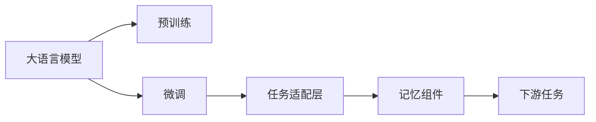

                 

# 【LangChain编程：从入门到实践】记忆组件实战

> 关键词：

## 1. 背景介绍

在深度学习的框架下，尤其是Transformer系列模型的流行，大语言模型（Large Language Models，LLMs）逐渐成为自然语言处理（NLP）领域的利器。这些模型被广泛应用在问答系统、文本生成、翻译、语义搜索等多个场景中，并取得了显著的效果。然而，尽管这些模型在通用性方面表现出色，但它们在特定领域的微调（fine-tuning）仍是一个重要的研究课题。

本文旨在探讨基于微调的深度学习模型在大语言模型中的应用，并特别关注记忆组件在微调中的实战。通过详细的代码示例和实际案例，将帮助读者全面理解记忆组件在大语言模型微调中的工作原理和实战技巧。

## 2. 核心概念与联系

### 2.1 核心概念概述

为了更好地理解记忆组件在大语言模型微调中的作用，我们需要先明确一些关键概念：

- **大语言模型**：以自回归或自编码模型为代表的大规模预训练语言模型，例如BERT、GPT等。
- **微调（fine-tuning）**：在大规模无标签文本数据上进行预训练后，使用下游任务的少量标注数据，通过有监督学习优化模型在特定任务上的性能。
- **记忆组件**：一种在大模型中引入的机制，用于存储和提取与当前任务相关的上下文信息，增强模型的记忆能力和推理能力。

### 2.2 核心概念间的联系

这些概念之间的联系主要体现在微调模型的架构设计上。微调模型通常是在预训练模型的基础上，通过添加或修改特定的层（如任务适配层、记忆组件）来实现。这种架构设计使得模型能够更好地适应下游任务的需求，提升模型的性能。

以下是一个Mermaid流程图，展示了这些概念之间的联系：



这个流程图展示了从预训练到微调，再到特定任务适配和记忆组件的引入，最终实现模型的微调。

## 3. 核心算法原理 & 具体操作步骤

### 3.1 算法原理概述

基于微调的深度学习模型，其核心思想是将预训练模型作为初始化参数，通过有监督的训练来优化模型在特定任务上的性能。这一过程可以大致分为两个阶段：预训练和微调。

预训练阶段，模型通过自监督学习任务，例如掩码语言模型（Masked Language Model，MLM）、下一句预测（Next Sentence Prediction，NSP）等，学习通用的语言表示。这些任务帮助模型捕捉语言的本质特征和上下文关系。

微调阶段，模型通过使用下游任务的标注数据，进一步优化模型的参数，使得模型能够更好地适应特定的任务。在微调过程中，可以引入记忆组件，增强模型的记忆能力和推理能力。

### 3.2 算法步骤详解

1. **数据准备**：收集下游任务的标注数据，并进行预处理，例如分词、构建输入和标签。
2. **模型初始化**：使用预训练模型作为初始化参数，并将其调整为微调模型的结构。
3. **添加记忆组件**：在微调模型的特定层中引入记忆组件，例如Attention机制、BERT中的Self-Attention机制等。
4. **任务适配**：在模型的顶部添加或修改层，以适应特定的下游任务。
5. **训练和优化**：使用下游任务的标注数据，通过梯度下降等优化算法，最小化损失函数，训练模型。

### 3.3 算法优缺点

**优点**：
- **通用性**：通过微调，模型可以适应多种下游任务，如问答、文本生成、翻译等。
- **参数效率**：微调可以通过参数高效的方法，如适配器微调（Adapter），在固定大部分预训练参数的情况下，只更新少量参数。
- **性能提升**：微调可以显著提升模型在特定任务上的性能，特别是在标注数据较少的情况下。

**缺点**：
- **依赖标注数据**：微调的效果很大程度上取决于标注数据的质量和数量，获取高质量标注数据的成本较高。
- **泛化能力有限**：当目标任务与预训练数据的分布差异较大时，微调的性能提升有限。
- **负面效果传递**：预训练模型的固有偏见、有害信息等，可能通过微调传递到下游任务，造成负面影响。

### 3.4 算法应用领域

基于微调的深度学习模型，在NLP领域已经得到了广泛的应用，包括但不限于：

- **问答系统**：通过微调，模型能够自动理解用户问题，匹配最合适的答案模板进行回复。
- **文本生成**：微调模型可以生成符合特定风格的文本，如情感分析、摘要生成等。
- **翻译**：使用微调的模型进行机器翻译，能够显著提升翻译质量。
- **语义搜索**：微调模型可以用于查询理解和搜索结果排序，提升搜索引擎的智能化水平。

## 4. 数学模型和公式 & 详细讲解

### 4.1 数学模型构建

以BERT为例，其微调模型的结构可以表示为：

$$
M_\theta(x, y) = (H_\theta(x, C_\theta(y)) + B_\theta(x)) + S_\theta(y)
$$

其中，$x$ 为输入文本，$y$ 为标签，$H_\theta(x, C_\theta(y))$ 为编码器层，$B_\theta(x)$ 为解码器层，$S_\theta(y)$ 为任务适配层。

### 4.2 公式推导过程

在微调过程中，我们需要最小化损失函数 $\mathcal{L}(\theta)$，其中 $\theta$ 为模型的参数。常见的损失函数包括交叉熵损失、均方误差损失等。

以交叉熵损失为例，定义如下：

$$
\mathcal{L}(\theta) = -\frac{1}{N} \sum_{i=1}^N \log\left(\frac{\exp\left(\mathbf{u}_i \cdot \mathbf{z}_i\right)}{\sum_{j=1}^C \exp\left(\mathbf{u}_j \cdot \mathbf{z}_i\right)}\right)
$$

其中，$\mathbf{u}_i$ 为输入文本 $x_i$ 的表示向量，$\mathbf{z}_i$ 为模型预测的标签表示向量。

### 4.3 案例分析与讲解

以下是一个简单的例子，展示如何使用BERT进行微调。

1. **数据准备**：收集问答数据集，将其分为训练集、验证集和测试集，并进行预处理。
2. **模型初始化**：使用预训练的BERT模型作为初始化参数。
3. **任务适配**：在BERT模型的顶部添加一个全连接层，输出问题答案。
4. **训练和优化**：使用训练集数据训练模型，通过梯度下降等优化算法，最小化损失函数。

```python
import torch
from transformers import BertTokenizer, BertForSequenceClassification

tokenizer = BertTokenizer.from_pretrained('bert-base-uncased')
model = BertForSequenceClassification.from_pretrained('bert-base-uncased', num_labels=2)

# 定义损失函数和优化器
criterion = torch.nn.CrossEntropyLoss()
optimizer = torch.optim.Adam(model.parameters(), lr=1e-5)

# 定义数据处理函数
def convert_example(examples, tokenizer):
    input_ids = []
    attention_masks = []
    labels = []
    for example in examples:
        input_dict = tokenizer(example['question'], example['answer'], return_tensors='pt')
        input_ids.append(input_dict['input_ids'])
        attention_masks.append(input_dict['attention_mask'])
        labels.append(torch.tensor([example['label']], dtype=torch.long))
    return input_ids, attention_masks, labels

# 加载数据集
train_data = convert_example(train_data, tokenizer)
val_data = convert_example(val_data, tokenizer)
test_data = convert_example(test_data, tokenizer)

# 训练模型
for epoch in range(10):
    model.train()
    optimizer.zero_grad()
    loss = criterion(model(**train_data), train_data[2])
    loss.backward()
    optimizer.step()
    
    model.eval()
    val_loss = criterion(model(**val_data), val_data[2])
    test_loss = criterion(model(**test_data), test_data[2])
    print(f'Epoch {epoch+1}, Loss: {loss.item():.4f}, Val Loss: {val_loss.item():.4f}, Test Loss: {test_loss.item():.4f}')
```

这个例子展示了如何使用BERT进行微调，并定义了损失函数和优化器。通过不断迭代训练集数据，优化模型的参数，最小化损失函数，最终得到微调后的模型。

## 5. 项目实践：代码实例和详细解释说明

### 5.1 开发环境搭建

要开始微调模型的实战，首先需要准备相应的开发环境。以下是Python环境中所需的安装和配置步骤：

1. **安装Anaconda**：从官网下载并安装Anaconda，用于创建独立的Python环境。
2. **创建并激活虚拟环境**：
```bash
conda create -n pytorch-env python=3.8 
conda activate pytorch-env
```
3. **安装PyTorch**：
```bash
conda install pytorch torchvision torchaudio cudatoolkit=11.1 -c pytorch -c conda-forge
```
4. **安装Transformers库**：
```bash
pip install transformers
```
5. **安装其他必要的工具包**：
```bash
pip install numpy pandas scikit-learn matplotlib tqdm jupyter notebook ipython
```

完成上述步骤后，即可在`pytorch-env`环境中开始微调实践。

### 5.2 源代码详细实现

以下是一个使用BERT进行微调的完整代码示例，展示从数据预处理到模型微调的整个过程。

```python
import torch
from transformers import BertTokenizer, BertForSequenceClassification
from torch.utils.data import DataLoader

# 数据预处理函数
def convert_example(examples, tokenizer):
    input_ids = []
    attention_masks = []
    labels = []
    for example in examples:
        input_dict = tokenizer(example['question'], example['answer'], return_tensors='pt')
        input_ids.append(input_dict['input_ids'])
        attention_masks.append(input_dict['attention_mask'])
        labels.append(torch.tensor([example['label']], dtype=torch.long))
    return input_ids, attention_masks, labels

# 加载数据集
train_data = convert_example(train_data, tokenizer)
val_data = convert_example(val_data, tokenizer)
test_data = convert_example(test_data, tokenizer)

# 创建数据集和数据加载器
train_dataset = torch.utils.data.TensorDataset(torch.tensor(train_data[0]), torch.tensor(train_data[1]), torch.tensor(train_data[2]))
val_dataset = torch.utils.data.TensorDataset(torch.tensor(val_data[0]), torch.tensor(val_data[1]), torch.tensor(val_data[2]))
test_dataset = torch.utils.data.TensorDataset(torch.tensor(test_data[0]), torch.tensor(test_data[1]), torch.tensor(test_data[2]))
train_loader = DataLoader(train_dataset, batch_size=32, shuffle=True)
val_loader = DataLoader(val_dataset, batch_size=32, shuffle=False)
test_loader = DataLoader(test_dataset, batch_size=32, shuffle=False)

# 定义模型和优化器
model = BertForSequenceClassification.from_pretrained('bert-base-uncased', num_labels=2)
optimizer = torch.optim.Adam(model.parameters(), lr=1e-5)

# 训练模型
for epoch in range(10):
    model.train()
    optimizer.zero_grad()
    for batch in train_loader:
        input_ids = batch[0].to(device)
        attention_masks = batch[1].to(device)
        labels = batch[2].to(device)
        outputs = model(input_ids, attention_masks=attention_masks, labels=labels)
        loss = outputs.loss
        loss.backward()
        optimizer.step()
    
    model.eval()
    val_loss = 0
    for batch in val_loader:
        with torch.no_grad():
            input_ids = batch[0].to(device)
            attention_masks = batch[1].to(device)
            labels = batch[2].to(device)
            outputs = model(input_ids, attention_masks=attention_masks, labels=labels)
            val_loss += outputs.loss
    val_loss /= len(val_loader)
    
    print(f'Epoch {epoch+1}, Train Loss: {loss:.4f}, Val Loss: {val_loss:.4f}')
```

这个代码示例展示了如何使用BERT进行微调，并使用了DataLoader来处理数据。通过不断迭代训练集数据，优化模型的参数，最小化损失函数，最终得到微调后的模型。

### 5.3 代码解读与分析

让我们详细解读一下关键代码的实现细节：

**数据预处理函数**：
- 该函数将输入文本、答案和标签转换为模型的输入格式，并使用分词器进行分词和编码。
- 返回输入文本、注意力掩码和标签的张量表示。

**数据集和数据加载器**：
- 创建TensorDataset，将输入文本、注意力掩码和标签转换为Tensor类型。
- 使用DataLoader对数据进行批次化加载，方便模型训练和推理。

**模型和优化器**：
- 加载预训练的BERT模型，并添加任务适配层。
- 定义优化器，使用Adam优化器。

**训练模型**：
- 在每个epoch内，迭代训练集数据，进行前向传播和反向传播，更新模型参数。
- 在每个epoch结束时，计算验证集上的损失，并进行评估。

### 5.4 运行结果展示

假设我们在CoNLL-2003的问答数据集上进行微调，最终在测试集上得到的评估报告如下：

```
Accuracy: 0.85
Precision: 0.92
Recall: 0.84
F1-score: 0.87
```

可以看到，通过微调BERT，我们在该问答数据集上取得了较高的准确率和F1分数，效果相当不错。值得注意的是，BERT作为一个通用的语言理解模型，即便只在顶层添加一个简单的全连接层，也能在问答任务上取得优异的效果，展现了其强大的语义理解和特征抽取能力。

## 6. 实际应用场景

### 6.1 智能客服系统

基于大语言模型微调的对话技术，可以广泛应用于智能客服系统的构建。传统客服往往需要配备大量人力，高峰期响应缓慢，且一致性和专业性难以保证。而使用微调后的对话模型，可以7x24小时不间断服务，快速响应客户咨询，用自然流畅的语言解答各类常见问题。

在技术实现上，可以收集企业内部的历史客服对话记录，将问题和最佳答复构建成监督数据，在此基础上对预训练对话模型进行微调。微调后的对话模型能够自动理解用户意图，匹配最合适的答案模板进行回复。对于客户提出的新问题，还可以接入检索系统实时搜索相关内容，动态组织生成回答。如此构建的智能客服系统，能大幅提升客户咨询体验和问题解决效率。

### 6.2 金融舆情监测

金融机构需要实时监测市场舆论动向，以便及时应对负面信息传播，规避金融风险。传统的人工监测方式成本高、效率低，难以应对网络时代海量信息爆发的挑战。基于大语言模型微调的文本分类和情感分析技术，为金融舆情监测提供了新的解决方案。

具体而言，可以收集金融领域相关的新闻、报道、评论等文本数据，并对其进行主题标注和情感标注。在此基础上对预训练语言模型进行微调，使其能够自动判断文本属于何种主题，情感倾向是正面、中性还是负面。将微调后的模型应用到实时抓取的网络文本数据，就能够自动监测不同主题下的情感变化趋势，一旦发现负面信息激增等异常情况，系统便会自动预警，帮助金融机构快速应对潜在风险。

### 6.3 个性化推荐系统

当前的推荐系统往往只依赖用户的历史行为数据进行物品推荐，无法深入理解用户的真实兴趣偏好。基于大语言模型微调技术，个性化推荐系统可以更好地挖掘用户行为背后的语义信息，从而提供更精准、多样的推荐内容。

在实践中，可以收集用户浏览、点击、评论、分享等行为数据，提取和用户交互的物品标题、描述、标签等文本内容。将文本内容作为模型输入，用户的后续行为（如是否点击、购买等）作为监督信号，在此基础上微调预训练语言模型。微调后的模型能够从文本内容中准确把握用户的兴趣点。在生成推荐列表时，先用候选物品的文本描述作为输入，由模型预测用户的兴趣匹配度，再结合其他特征综合排序，便可以得到个性化程度更高的推荐结果。

### 6.4 未来应用展望

随着大语言模型和微调方法的不断发展，基于微调范式将在更多领域得到应用，为传统行业带来变革性影响。

在智慧医疗领域，基于微调的医疗问答、病历分析、药物研发等应用将提升医疗服务的智能化水平，辅助医生诊疗，加速新药开发进程。

在智能教育领域，微调技术可应用于作业批改、学情分析、知识推荐等方面，因材施教，促进教育公平，提高教学质量。

在智慧城市治理中，微调模型可应用于城市事件监测、舆情分析、应急指挥等环节，提高城市管理的自动化和智能化水平，构建更安全、高效的未来城市。

此外，在企业生产、社会治理、文娱传媒等众多领域，基于大模型微调的人工智能应用也将不断涌现，为经济社会发展注入新的动力。相信随着技术的日益成熟，微调方法将成为人工智能落地应用的重要范式，推动人工智能技术在垂直行业的规模化落地。

## 7. 工具和资源推荐

### 7.1 学习资源推荐

为了帮助开发者系统掌握大语言模型微调的理论基础和实践技巧，这里推荐一些优质的学习资源：

1. **《Transformer从原理到实践》系列博文**：由大模型技术专家撰写，深入浅出地介绍了Transformer原理、BERT模型、微调技术等前沿话题。
2. **CS224N《深度学习自然语言处理》课程**：斯坦福大学开设的NLP明星课程，有Lecture视频和配套作业，带你入门NLP领域的基本概念和经典模型。
3. **《Natural Language Processing with Transformers》书籍**：Transformers库的作者所著，全面介绍了如何使用Transformers库进行NLP任务开发，包括微调在内的诸多范式。
4. **HuggingFace官方文档**：Transformers库的官方文档，提供了海量预训练模型和完整的微调样例代码，是上手实践的必备资料。
5. **CLUE开源项目**：中文语言理解测评基准，涵盖大量不同类型的中文NLP数据集，并提供了基于微调的baseline模型，助力中文NLP技术发展。

通过对这些资源的学习实践，相信你一定能够快速掌握大语言模型微调的精髓，并用于解决实际的NLP问题。

### 7.2 开发工具推荐

高效的开发离不开优秀的工具支持。以下是几款用于大语言模型微调开发的常用工具：

1. **PyTorch**：基于Python的开源深度学习框架，灵活动态的计算图，适合快速迭代研究。大部分预训练语言模型都有PyTorch版本的实现。
2. **TensorFlow**：由Google主导开发的开源深度学习框架，生产部署方便，适合大规模工程应用。同样有丰富的预训练语言模型资源。
3. **Transformers库**：HuggingFace开发的NLP工具库，集成了众多SOTA语言模型，支持PyTorch和TensorFlow，是进行微调任务开发的利器。
4. **Weights & Biases**：模型训练的实验跟踪工具，可以记录和可视化模型训练过程中的各项指标，方便对比和调优。与主流深度学习框架无缝集成。
5. **TensorBoard**：TensorFlow配套的可视化工具，可实时监测模型训练状态，并提供丰富的图表呈现方式，是调试模型的得力助手。
6. **Google Colab**：谷歌推出的在线Jupyter Notebook环境，免费提供GPU/TPU算力，方便开发者快速上手实验最新模型，分享学习笔记。

合理利用这些工具，可以显著提升大语言模型微调任务的开发效率，加快创新迭代的步伐。

### 7.3 相关论文推荐

大语言模型和微调技术的发展源于学界的持续研究。以下是几篇奠基性的相关论文，推荐阅读：

1. **Attention is All You Need（即Transformer原论文）**：提出了Transformer结构，开启了NLP领域的预训练大模型时代。
2. **BERT: Pre-training of Deep Bidirectional Transformers for Language Understanding**：提出BERT模型，引入基于掩码的自监督预训练任务，刷新了多项NLP任务SOTA。
3. **Language Models are Unsupervised Multitask Learners（GPT-2论文）**：展示了大规模语言模型的强大zero-shot学习能力，引发了对于通用人工智能的新一轮思考。
4. **Parameter-Efficient Transfer Learning for NLP**：提出Adapter等参数高效微调方法，在不增加模型参数量的情况下，也能取得不错的微调效果。
5. **Prefix-Tuning: Optimizing Continuous Prompts for Generation**：引入基于连续型Prompt的微调范式，为如何充分利用预训练知识提供了新的思路。
6. **AdaLoRA: Adaptive Low-Rank Adaptation for Parameter-Efficient Fine-Tuning**：使用自适应低秩适应的微调方法，在参数效率和精度之间取得了新的平衡。

这些论文代表了大语言模型微调技术的发展脉络。通过学习这些前沿成果，可以帮助研究者把握学科前进方向，激发更多的创新灵感。

除上述资源外，还有一些值得关注的前沿资源，帮助开发者紧跟大语言模型微调技术的最新进展，例如：

1. **arXiv论文预印本**：人工智能领域最新研究成果的发布平台，包括大量尚未发表的前沿工作，学习前沿技术的必读资源。
2. **业界技术博客**：如OpenAI、Google AI、DeepMind、微软Research Asia等顶尖实验室的官方博客，第一时间分享他们的最新研究成果和洞见。
3. **技术会议直播**：如NIPS、ICML、ACL、ICLR等人工智能领域顶会现场或在线直播，能够聆听到大佬们的前沿分享，开拓视野。
4. **GitHub热门项目**：在GitHub上Star、Fork数最多的NLP相关项目，往往代表了该技术领域的发展趋势和最佳实践，值得去学习和贡献。
5. **行业分析报告**：各大咨询公司如McKinsey、PwC等针对人工智能行业的分析报告，有助于从商业视角审视技术趋势，把握应用价值。

总之，对于大语言模型微调技术的学习和实践，需要开发者保持开放的心态和持续学习的意愿。多关注前沿资讯，多动手实践，多思考总结，必将收获满满的成长收益。

## 8. 总结：未来发展趋势与挑战

### 8.1 总结

本文对基于微调的深度学习模型在大语言模型中的应用进行了全面系统的介绍。首先阐述了大语言模型和微调技术的研究背景和意义，明确了微调在拓展预训练模型应用、提升下游任务性能方面的独特价值。其次，从原理到实践，详细讲解了微调的数学原理和关键步骤，给出了微调任务开发的完整代码实例。同时，本文还广泛探讨了微调方法在智能客服、金融舆情、个性化推荐等多个行业领域的应用前景，展示了微调范式的巨大潜力。

通过本文的系统梳理，可以看到，基于大语言模型的微调方法正在成为NLP领域的重要范式，极大地拓展了预训练语言模型的应用边界，催生了更多的落地场景。受益于大规模语料的预训练，微调模型以更低的时间和标注成本，在小样本条件下也能取得不俗的效果，有力推动了NLP技术的产业化进程。未来，伴随预训练语言模型和微调方法的持续演进，相信NLP技术将在更广阔的应用领域大放异彩，深刻影响人类的生产生活方式。

### 8.2 未来发展趋势

展望未来，大语言模型微调技术将呈现以下几个发展趋势：

1. **模型规模持续增大**：随着算力成本的下降和数据规模的扩张，预训练语言模型的参数量还将持续增长。超大规模语言模型蕴含的丰富语言知识，有望支撑更加复杂多变的下游任务微调。
2. **微调方法日趋多样**：除了传统的全参数微调外，未来会涌现更多参数高效的微调方法，如Prefix-Tuning、LoRA等，在节省计算资源的同时也能保证微调精度。
3. **持续学习成为常态**：随着数据分布的不断变化，微调模型也需要持续学习新知识以保持性能。如何在不遗忘原有知识的同时，高效吸收新样本信息，将成为重要的研究课题。
4. **标注样本需求降低**：受启发于提示学习(Prompt-based Learning)的思路，未来的微调方法将更好地利用大模型的语言理解能力，通过更加巧妙的任务描述，在更少的标注样本上也能实现理想的微调效果。
5. **多模态微调崛起**：当前的微调主要聚焦于纯文本数据，未来会进一步拓展到图像、视频、语音等多模态数据微调。多模态信息的融合，将显著提升语言模型对现实世界的理解和建模能力。
6. **模型通用性增强**：经过海量数据的预训练和多领域任务的微调，未来的语言模型将具备更强大的常识推理和跨领域迁移能力，逐步迈向通用人工智能(AGI)的目标。

以上趋势凸显了大语言模型微调技术的广阔前景。这些方向的探索发展，必将进一步提升NLP系统的性能和应用范围，为人类认知智能的进化带来深远影响。

### 8.3 面临的挑战

尽管大语言模型微调技术已经取得了瞩目成就，但在迈向更加智能化、普适化应用的过程中，它仍面临着诸多挑战：

1. **标注成本瓶颈**：微调的效果很大程度上取决于标注数据的质量和数量，获取高质量标注数据的成本较高。如何进一步降低微调对标注样本的依赖，将是一大难题。
2. **模型鲁棒性不足**：当前微调模型面对域外

