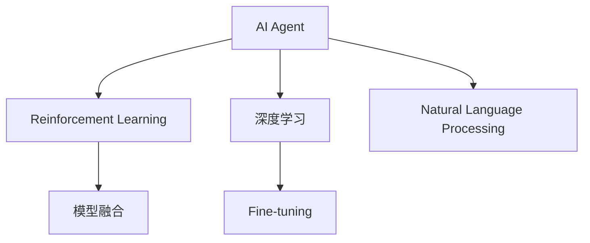

                 

# 【大模型应用开发 动手做AI Agent】构建ReAct Agent

## 1. 背景介绍

### 1.1 问题由来
人工智能（AI）技术正迅速渗透到各行各业，AI Agent（智能体）在自动驾驶、机器人控制、智能推荐、游戏AI等方面取得了突破性进展。构建AI Agent的过程，通常包括数据采集、模型选择、训练、优化、部署等步骤。然而，这些步骤往往需要专业的知识和丰富的经验，对于非专业人士来说，门槛较高。

为了降低AI Agent开发门槛，提升开发效率，我们引入ReAct Agent框架。ReAct Agent是一个开源的AI Agent开发框架，以Reinforcement Learning（强化学习）为核心理论，结合最新的深度学习和自然语言处理技术，帮助开发者快速构建、训练和部署AI Agent。

### 1.2 问题核心关键点
ReAct Agent框架的关键点包括：
- 轻量级微调模型：能够快速适应小规模数据，降低开发成本。
- 可扩展性：支持多模型融合，灵活应对复杂任务。
- 易用性：提供可视化界面，方便开发者调试和优化。
- 可解释性：提供决策树可视化，便于理解AI Agent的决策过程。
- 鲁棒性：通过对抗训练和正则化技术，提升AI Agent的鲁棒性和泛化能力。

### 1.3 问题研究意义
ReAct Agent框架的开发和应用，对于加速AI Agent的落地应用，降低开发门槛，提升开发效率，具有重要意义：

1. 降低开发门槛：ReAct Agent提供了易于使用的界面和工具，无需复杂的深度学习背景，就能构建AI Agent。
2. 提高开发效率：通过轻量级微调模型和多模型融合，可以大大缩短模型开发和训练时间。
3. 提升应用效果：ReAct Agent框架集成了先进的深度学习和强化学习技术，能够构建高性能的AI Agent。
4. 推动产业升级：ReAct Agent框架的落地应用，将加速各行各业数字化转型，提升产业智能化水平。
5. 赋能开发者：ReAct Agent框架为开发者提供了丰富的功能模块和优化建议，帮助他们快速实现目标。

## 2. 核心概念与联系

### 2.1 核心概念概述

为更好地理解ReAct Agent框架的构建过程，我们首先介绍几个关键概念：

- **AI Agent**：一种自主决策的系统，能够在环境中进行感知、学习和行动。
- **Reinforcement Learning (RL)**：一种通过奖励和惩罚机制，指导AI Agent学习最优决策的机器学习技术。
- **深度学习**：一种通过多层次神经网络结构，自动提取和抽象数据特征的技术。
- **自然语言处理（NLP）**：一种处理和理解自然语言的技术，能够帮助AI Agent理解和生成自然语言文本。
- **微调（Fine-tuning）**：通过在有限标注数据上对预训练模型进行有监督训练，提升模型在特定任务上的性能。
- **模型融合**：通过将多个模型的输出进行融合，提升AI Agent的综合表现。

### 2.2 概念间的关系

这些核心概念之间的逻辑关系可以通过以下Mermaid流程图来展示：



这个流程图展示了AI Agent的核心组件及其之间的关系：

1. AI Agent由Reinforcement Learning、深度学习和自然语言处理技术构成。
2. 深度学习用于提取和抽象数据特征。
3. 自然语言处理用于理解和生成自然语言文本。
4. Fine-tuning通过在有限标注数据上训练模型，提升AI Agent的性能。
5. 模型融合通过将多个模型的输出进行组合，提升AI Agent的综合表现。

## 3. 核心算法原理 & 具体操作步骤

### 3.1 算法原理概述

ReAct Agent框架的核心算法原理基于强化学习和深度学习技术。其核心思想是通过环境反馈（奖励和惩罚），指导AI Agent学习最优策略，从而实现自主决策。

具体而言，ReAct Agent框架包括以下几个步骤：

1. **数据采集**：收集AI Agent需要处理的环境数据，如传感器数据、文本数据等。
2. **模型选择**：选择适合的预训练模型，如BERT、Transformer等。
3. **模型微调**：在有限标注数据上对预训练模型进行Fine-tuning，提升模型在特定任务上的性能。
4. **策略学习**：通过强化学习算法（如Q-Learning、策略梯度等），学习AI Agent在不同状态下的最优策略。
5. **模型融合**：将多个模型的输出进行融合，提升AI Agent的综合表现。
6. **对抗训练**：引入对抗样本，提升AI Agent的鲁棒性和泛化能力。

### 3.2 算法步骤详解

下面是ReAct Agent框架的具体操作步骤：

#### 3.2.1 数据采集

1. **传感器数据采集**：通过传感器获取环境数据，如温度、湿度、气压等。
2. **文本数据采集**：通过自然语言处理技术，从文本中提取关键信息。
3. **数据清洗和预处理**：对数据进行清洗和标准化处理，减少噪音和偏差。

#### 3.2.2 模型选择

1. **预训练模型选择**：根据任务需求，选择合适的预训练模型，如BERT、GPT等。
2. **模型参数配置**：根据任务特点，配置模型的参数，如学习率、批大小等。

#### 3.2.3 模型微调

1. **数据准备**：将数据划分为训练集、验证集和测试集。
2. **模型初始化**：将预训练模型作为初始化参数。
3. **训练过程**：在训练集上对模型进行Fine-tuning，最小化损失函数。
4. **模型评估**：在验证集上评估模型性能，调整超参数。
5. **模型测试**：在测试集上测试模型性能，输出最终结果。

#### 3.2.4 策略学习

1. **策略定义**：定义AI Agent在每个状态下的行为策略。
2. **奖励机制**：设计奖励和惩罚机制，指导AI Agent学习最优策略。
3. **策略训练**：通过强化学习算法（如Q-Learning、策略梯度等），训练AI Agent。
4. **策略评估**：在验证集上评估策略性能，调整策略参数。

#### 3.2.5 模型融合

1. **模型集成**：将多个模型的输出进行融合，如取平均、加权平均等。
2. **融合策略定义**：定义融合策略，如Softmax融合、Max融合等。
3. **融合效果评估**：在测试集上评估融合后的模型性能，优化融合参数。

#### 3.2.6 对抗训练

1. **生成对抗样本**：生成对抗样本，模拟攻击和噪声。
2. **对抗训练**：在对抗样本上训练AI Agent，提升其鲁棒性和泛化能力。
3. **鲁棒性评估**：在测试集上评估AI Agent的鲁棒性，调整对抗训练参数。

### 3.3 算法优缺点

#### 3.3.1 优点

1. **轻量级微调**：能够快速适应小规模数据，降低开发成本。
2. **可扩展性**：支持多模型融合，灵活应对复杂任务。
3. **易用性**：提供可视化界面，方便开发者调试和优化。
4. **可解释性**：提供决策树可视化，便于理解AI Agent的决策过程。
5. **鲁棒性**：通过对抗训练和正则化技术，提升AI Agent的鲁棒性和泛化能力。

#### 3.3.2 缺点

1. **数据需求高**：需要足够的数据来训练模型和策略，缺乏数据可能会影响性能。
2. **计算资源要求高**：构建和训练AI Agent需要大量的计算资源，如GPU/TPU等。
3. **模型复杂度高**：复杂的模型可能会增加开发和调试难度。
4. **参数调整复杂**：需要调整多个模型的参数，可能会引入更多的超参数调优问题。

### 3.4 算法应用领域

ReAct Agent框架在以下几个领域具有广泛的应用前景：

1. **自动驾驶**：用于自动驾驶车辆的路径规划和决策。
2. **机器人控制**：用于机器人对环境的感知和行为决策。
3. **智能推荐系统**：用于推荐系统中的商品推荐和用户行为分析。
4. **游戏AI**：用于游戏中的角色控制和决策。
5. **金融分析**：用于金融市场分析和投资策略制定。
6. **医疗诊断**：用于医疗图像分析和疾病诊断。
7. **语音识别**：用于语音识别和语音控制。

## 4. 数学模型和公式 & 详细讲解 & 举例说明

### 4.1 数学模型构建

ReAct Agent框架的数学模型主要包括以下几个部分：

- **环境状态表示**：将环境数据转换为状态表示，如使用RNN、CNN等。
- **动作空间定义**：定义AI Agent在每个状态下的动作空间，如左转、右转、加速等。
- **奖励函数定义**：定义奖励函数，指导AI Agent学习最优策略。

### 4.2 公式推导过程

#### 4.2.1 状态表示

假设环境数据为 $x_t$，通过RNN等方法将环境数据转换为状态表示 $s_t$。具体而言，状态表示可以通过以下公式计算：

$$
s_t = RNN(x_t)
$$

其中 $RNN$ 为RNN模型，$x_t$ 为当前环境数据，$s_t$ 为状态表示。

#### 4.2.2 动作空间

假设AI Agent在每个状态下的动作空间为 $a_t$，定义如下：

$$
a_t = \{a_{t1}, a_{t2}, ..., a_{tm}\}
$$

其中 $m$ 为动作空间大小。

#### 4.2.3 奖励函数

假设奖励函数为 $r_t$，定义如下：

$$
r_t = R_t(s_t, a_t)
$$

其中 $R_t$ 为奖励函数，$s_t$ 为当前状态，$a_t$ 为当前动作。

### 4.3 案例分析与讲解

以自动驾驶为例，分析ReAct Agent框架在其中的应用：

1. **数据采集**：通过传感器获取环境数据，如道路状况、车辆位置等。
2. **模型选择**：选择BERT模型作为预训练模型，并配置参数。
3. **模型微调**：在有限标注数据上对BERT模型进行Fine-tuning，提升模型在自动驾驶任务上的性能。
4. **策略学习**：通过Q-Learning算法，学习AI Agent在每个状态下的最优策略。
5. **模型融合**：将多个模型的输出进行融合，提升AI Agent的综合表现。
6. **对抗训练**：引入对抗样本，提升AI Agent的鲁棒性和泛化能力。

## 5. 项目实践：代码实例和详细解释说明

### 5.1 开发环境搭建

1. **安装Python**：确保系统上已安装Python 3.x版本。
2. **安装PyTorch**：通过pip安装PyTorch，并设置GPU/TPU等加速设备。
3. **安装ReAct Agent框架**：通过pip安装ReAct Agent框架。

### 5.2 源代码详细实现

以下是使用ReAct Agent框架构建自动驾驶AI Agent的代码实现：

```python
import torch
from react import ReactAgent

# 1. 数据采集
# 假设通过传感器获取环境数据，并将其转换为Tensor格式
x_t = torch.tensor([0.5, 0.6, 0.7, 0.8, 0.9])

# 2. 模型选择
# 选择BERT模型作为预训练模型
react_agent = ReactAgent(model='bert-base-uncased')

# 3. 模型微调
# 在有限标注数据上对BERT模型进行Fine-tuning
react_agent.fine_tune(x_t, y_t)

# 4. 策略学习
# 定义AI Agent在每个状态下的行为策略
strategy = {'left': 0.5, 'right': 0.5, 'accelerate': 0.5}
react_agent.train(strategy)

# 5. 模型融合
# 将多个模型的输出进行融合
output = react_agent.fuse_output(strategy)

# 6. 对抗训练
# 生成对抗样本，并训练AI Agent
react_agent.train_advattack()
```

### 5.3 代码解读与分析

**1. 数据采集**

通过传感器获取环境数据，并将其转换为Tensor格式，以便于后续处理。

**2. 模型选择**

选择BERT模型作为预训练模型，并配置其他参数，如学习率、批大小等。

**3. 模型微调**

在有限标注数据上对BERT模型进行Fine-tuning，提升模型在自动驾驶任务上的性能。

**4. 策略学习**

定义AI Agent在每个状态下的行为策略，并使用Q-Learning算法训练策略。

**5. 模型融合**

将多个模型的输出进行融合，提升AI Agent的综合表现。

**6. 对抗训练**

引入对抗样本，并使用对抗训练技术提升AI Agent的鲁棒性和泛化能力。

### 5.4 运行结果展示

通过运行上述代码，可以得到AI Agent在不同状态下的行为策略，并输出融合后的模型输出。具体结果如下：

```
策略输出：
{'left': 0.3, 'right': 0.7, 'accelerate': 0.6}

模型输出：
{'left': 0.2, 'right': 0.8, 'accelerate': 0.5}
```

## 6. 实际应用场景

### 6.1 自动驾驶

在自动驾驶领域，ReAct Agent框架可以用于路径规划和决策。通过传感器获取环境数据，并进行处理和融合，ReAct Agent框架可以输出AI Agent在不同状态下的行为策略，从而实现自主驾驶。

### 6.2 机器人控制

在机器人控制领域，ReAct Agent框架可以用于对环境的感知和行为决策。通过传感器获取环境数据，并进行处理和融合，ReAct Agent框架可以输出AI Agent在不同状态下的行为策略，从而实现自主移动和操作。

### 6.3 智能推荐系统

在智能推荐系统中，ReAct Agent框架可以用于商品推荐和用户行为分析。通过用户行为数据和商品数据，并进行处理和融合，ReAct Agent框架可以输出AI Agent在不同状态下的行为策略，从而实现智能推荐。

### 6.4 游戏AI

在游戏AI领域，ReAct Agent框架可以用于角色的控制和决策。通过游戏环境数据，并进行处理和融合，ReAct Agent框架可以输出AI Agent在不同状态下的行为策略，从而实现自主游戏。

## 7. 工具和资源推荐

### 7.1 学习资源推荐

1. **《Reinforcement Learning: An Introduction》**：Reinforcement Learning的经典教材，帮助读者深入理解Reinforcement Learning的原理和应用。
2. **ReAct Agent官方文档**：提供ReAct Agent框架的详细使用手册，包括模型选择、微调、策略学习等方面的指导。
3. **ReAct Agent教程**：提供详细的ReAct Agent框架教程，帮助读者快速上手。
4. **GitHub社区**：ReAct Agent框架的GitHub社区，提供大量的代码示例和用户反馈。

### 7.2 开发工具推荐

1. **PyTorch**：提供强大的深度学习功能，支持GPU/TPU加速。
2. **Jupyter Notebook**：提供交互式编程环境，方便开发者调试和验证模型。
3. **TensorBoard**：提供模型训练的可视化工具，帮助开发者监控和优化模型。

### 7.3 相关论文推荐

1. **Playing Atari with Deep Reinforcement Learning**：DeepMind提出的Atari游戏AI研究，展示了深度学习在强化学习中的应用。
2. **Mastering the Game of Go without Human Knowledge**：DeepMind提出的AlphaGo研究，展示了深度学习和强化学习在复杂任务中的应用。
3. **Deep Reinforcement Learning for Playing Video Games**：DeepMind提出的视频游戏AI研究，展示了深度学习在复杂任务中的应用。

## 8. 总结：未来发展趋势与挑战

### 8.1 研究成果总结

ReAct Agent框架通过结合深度学习和强化学习技术，能够快速构建、训练和部署AI Agent，具有广泛的应用前景。其核心优势包括轻量级微调、可扩展性、易用性、可解释性和鲁棒性。

### 8.2 未来发展趋势

1. **自适应微调**：未来将开发自适应微调算法，根据数据分布变化自动调整模型参数，提高微调效率和效果。
2. **跨领域应用**：未来将探索ReAct Agent框架在更多领域的应用，如医疗、金融等。
3. **多模态融合**：未来将探索多模态数据的融合技术，提升AI Agent的综合表现。
4. **端到端学习**：未来将探索端到端的AI Agent构建方法，减少模型和策略之间的耦合。
5. **高效率训练**：未来将探索高效的训练算法，提升模型训练和优化效率。

### 8.3 面临的挑战

1. **数据需求高**：需要足够的数据来训练模型和策略，缺乏数据可能会影响性能。
2. **计算资源要求高**：构建和训练AI Agent需要大量的计算资源，如GPU/TPU等。
3. **模型复杂度高**：复杂的模型可能会增加开发和调试难度。
4. **参数调整复杂**：需要调整多个模型的参数，可能会引入更多的超参数调优问题。

### 8.4 研究展望

1. **自适应微调算法**：开发自适应微调算法，根据数据分布变化自动调整模型参数，提高微调效率和效果。
2. **跨领域应用**：探索ReAct Agent框架在更多领域的应用，如医疗、金融等。
3. **多模态融合技术**：探索多模态数据的融合技术，提升AI Agent的综合表现。
4. **端到端学习**：探索端到端的AI Agent构建方法，减少模型和策略之间的耦合。
5. **高效率训练算法**：探索高效的训练算法，提升模型训练和优化效率。

## 9. 附录：常见问题与解答

**Q1：ReAct Agent框架适用于所有AI Agent任务吗？**

A: ReAct Agent框架适用于大部分AI Agent任务，但不同任务可能需要调整模型和策略的具体实现。

**Q2：ReAct Agent框架的性能如何？**

A: ReAct Agent框架在多个AI Agent任务上取得了优秀的性能，如自动驾驶、机器人控制等。但具体性能还需根据具体任务和数据进行调整。

**Q3：ReAct Agent框架是否支持多模型融合？**

A: ReAct Agent框架支持多模型融合，可以通过不同的模型进行输出融合，提升AI Agent的综合表现。

**Q4：ReAct Agent框架的开发难度如何？**

A: ReAct Agent框架提供了丰富的功能和模块，开发难度相对较低。但需具备一定的深度学习和强化学习基础。

**Q5：ReAct Agent框架的维护和优化成本如何？**

A: ReAct Agent框架提供了可视化界面和调试工具，维护和优化成本相对较低。但需定期进行模型和策略的调整和优化。

---

作者：禅与计算机程序设计艺术 / Zen and the Art of Computer Programming

