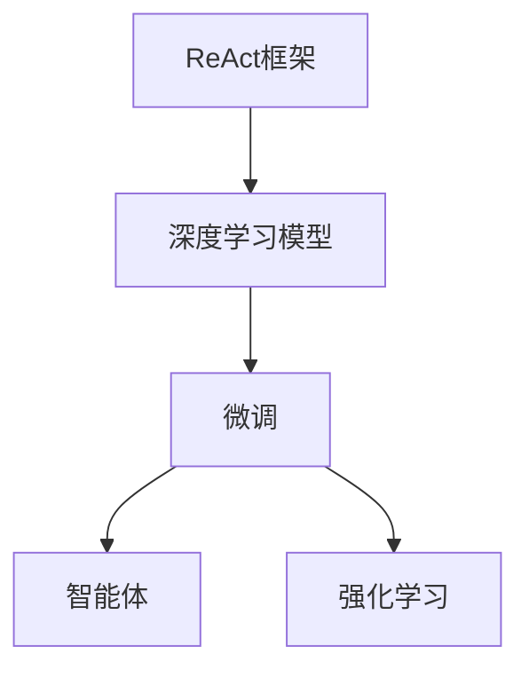
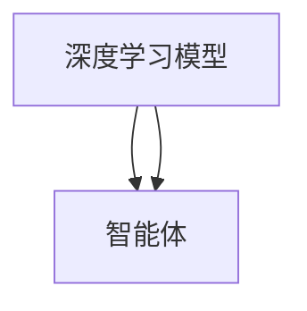
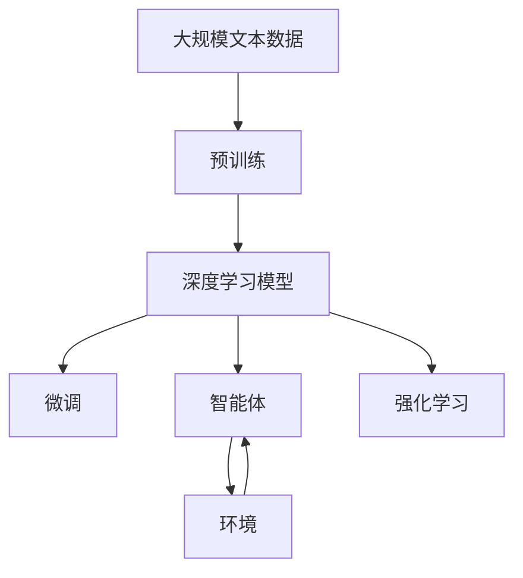

                 

# 【大模型应用开发 动手做AI Agent】用ReAct框架实现简单Agent

> 关键词：大模型应用,ReAct框架,人工智能Agent,深度学习,强化学习

## 1. 背景介绍

### 1.1 问题由来

近年来，人工智能（AI）技术在各个领域取得了巨大的突破，其中深度学习和大模型（Large Models）的进展尤为显著。这些模型通过在大量的无标签数据上预训练，学习到了丰富的特征表示，能够有效地处理复杂的任务。然而，为了将这些大模型应用于特定的问题解决中，通常需要针对具体任务进行微调（Fine-tuning）。这一过程包括在大模型之上进行有监督的训练，以使其能够输出期望的输出结果。

在众多的应用场景中，智能体（Agents）的设计和开发成为了人工智能应用的重要一环。智能体是一种能够在环境中进行学习并做出决策的系统，其应用广泛，如游戏AI、机器人控制、自动驾驶等。传统的智能体设计依赖于手工设计的规则和策略，而大模型和深度学习技术的发展，使得智能体的设计和优化变得更加灵活和高效。

本文将介绍如何使用ReAct框架实现一个简单的智能体，通过微调大模型，使其能够在给定的环境中学习并做出决策。

### 1.2 问题核心关键点

ReAct框架是一种基于TensorFlow和PyTorch的高效框架，旨在简化深度学习模型的构建和训练。通过ReAct框架，开发者可以更快速地创建和部署深度学习模型，特别是在微调大模型方面具有显著的优势。本文将重点介绍如何利用ReAct框架对大模型进行微调，使其成为具有特定功能的智能体。

- **ReAct框架**：一个用于构建和训练深度学习模型的高效框架。
- **微调（Fine-tuning）**：在大模型上使用特定任务的标注数据进行有监督学习，以调整模型参数，使其在特定任务上表现更好。
- **智能体（Agents）**：能够在环境中进行学习和决策的系统。
- **大模型（Large Models）**：如BERT、GPT等，经过预训练学习到丰富的语义表示，适用于多种自然语言处理（NLP）任务。
- **强化学习（Reinforcement Learning, RL）**：通过与环境的交互，智能体学习优化其行为策略，以最大化某种奖励信号。

### 1.3 问题研究意义

智能体的设计和开发是大模型应用的重要方向之一。通过智能体的设计，可以显著提升大模型在特定任务上的性能，加速其应用场景的落地。ReAct框架的引入，使得智能体的开发变得更加简单和高效，为开发者提供了更灵活的工具和技术支持。

通过本文的学习，读者将能够掌握如何使用ReAct框架实现简单智能体，并了解微调在大模型应用中的重要性和具体实现方法。这对于提升大模型应用的技术水平，推动人工智能技术的产业化进程具有重要意义。

## 2. 核心概念与联系

### 2.1 核心概念概述

为了更好地理解如何使用ReAct框架实现智能体，本节将介绍几个密切相关的核心概念：

- **ReAct框架**：一个基于TensorFlow和PyTorch的高效框架，用于构建和训练深度学习模型。
- **微调（Fine-tuning）**：在大模型上使用特定任务的标注数据进行有监督学习，以调整模型参数，使其在特定任务上表现更好。
- **智能体（Agents）**：能够在环境中进行学习和决策的系统。
- **大模型（Large Models）**：如BERT、GPT等，经过预训练学习到丰富的语义表示，适用于多种NLP任务。
- **强化学习（Reinforcement Learning, RL）**：通过与环境的交互，智能体学习优化其行为策略，以最大化某种奖励信号。

这些核心概念之间的联系可以通过以下Mermaid流程图来展示：



这个流程图展示了ReAct框架、深度学习模型、微调以及智能体和强化学习之间的关系：

1. 使用ReAct框架构建深度学习模型。
2. 在深度学习模型上进行微调，以适应特定任务。
3. 利用微调后的模型作为智能体的核心，使其能够学习并做出决策。
4. 强化学习是智能体在环境中学习优化行为策略的过程。

### 2.2 概念间的关系

这些核心概念之间存在着紧密的联系，形成了智能体的完整生态系统。下面我通过几个Mermaid流程图来展示这些概念之间的关系。

#### 2.2.1 ReAct框架与深度学习模型的关系


这个流程图展示了ReAct框架与深度学习模型的关系：

- ReAct框架提供了一个高效的接口，用于构建深度学习模型。
- 通过ReAct框架，开发者可以更方便地创建和训练深度学习模型，特别是大模型。

#### 2.2.2 微调与深度学习模型的关系


这个流程图展示了微调与深度学习模型的关系：

- 微调是在深度学习模型上进行的一种有监督学习过程。
- 微调可以调整模型参数，使其在特定任务上表现更好。

#### 2.2.3 智能体与深度学习模型的关系



这个流程图展示了智能体与深度学习模型的关系：

- 智能体是由深度学习模型构成的系统。
- 深度学习模型提供了智能体的决策基础。

#### 2.2.4 强化学习与智能体的关系


这个流程图展示了强化学习与智能体的关系：

- 强化学习是智能体在环境中学习优化行为策略的过程。
- 强化学习通过与环境的交互，使得智能体能够适应复杂的环境。

### 2.3 核心概念的整体架构

最后，我们用一个综合的流程图来展示这些核心概念在大模型微调过程中的整体架构：



这个综合流程图展示了从预训练到微调，再到智能体和强化学习的完整过程：

1. 深度学习模型通过在大规模文本数据上进行预训练，学习到丰富的语言表示。
2. 微调是在深度学习模型上进行的一种有监督学习过程，使其能够适应特定任务。
3. 智能体是由微调后的深度学习模型构成的系统，能够在环境中进行学习和决策。
4. 强化学习是智能体在环境中学习优化行为策略的过程。

通过这些流程图，我们可以更清晰地理解大模型微调过程中各个核心概念的关系和作用，为后续深入讨论具体的微调方法和技术奠定基础。

## 3. 核心算法原理 & 具体操作步骤
### 3.1 算法原理概述

基于ReAct框架的智能体设计和微调方法，本质上是将深度学习模型作为决策引擎，通过微调使模型能够适应特定任务，并在强化学习框架下进行学习和优化。

形式化地，假设预训练深度学习模型为 $M_{\theta}$，其中 $\theta$ 为预训练得到的模型参数。给定特定任务 $T$ 的标注数据集 $D=\{(x_i, y_i)\}_{i=1}^N, x_i \in \mathcal{X}, y_i \in \mathcal{Y}$。微调的目标是找到新的模型参数 $\hat{\theta}$，使得：

$$
\hat{\theta}=\mathop{\arg\min}_{\theta} \mathcal{L}(M_{\theta},D)
$$

其中 $\mathcal{L}$ 为针对任务 $T$ 设计的损失函数，用于衡量模型预测输出与真实标签之间的差异。常见的损失函数包括交叉熵损失、均方误差损失等。

通过梯度下降等优化算法，微调过程不断更新模型参数 $\theta$，最小化损失函数 $\mathcal{L}$，使得模型输出逼近真实标签。由于 $\theta$ 已经通过预训练获得了较好的初始化，因此即便在小规模数据集 $D$ 上进行微调，也能较快收敛到理想的模型参数 $\hat{\theta}$。

### 3.2 算法步骤详解

基于ReAct框架的智能体设计和微调方法一般包括以下几个关键步骤：

**Step 1: 准备预训练模型和数据集**
- 选择合适的预训练深度学习模型 $M_{\theta}$ 作为初始化参数，如BERT、GPT等。
- 准备特定任务 $T$ 的标注数据集 $D$，划分为训练集、验证集和测试集。一般要求标注数据与预训练数据的分布不要差异过大。

**Step 2: 设计任务适配层**
- 根据任务类型，在预训练深度学习模型顶层设计合适的输出层和损失函数。
- 对于分类任务，通常在顶层添加线性分类器和交叉熵损失函数。
- 对于生成任务，通常使用语言模型的解码器输出概率分布，并以负对数似然为损失函数。

**Step 3: 设置微调超参数**
- 选择合适的优化算法及其参数，如 AdamW、SGD 等，设置学习率、批大小、迭代轮数等。
- 设置正则化技术及强度，包括权重衰减、Dropout、Early Stopping 等。
- 确定冻结预训练参数的策略，如仅微调顶层，或全部参数都参与微调。

**Step 4: 执行梯度训练**
- 将训练集数据分批次输入模型，前向传播计算损失函数。
- 反向传播计算参数梯度，根据设定的优化算法和学习率更新模型参数。
- 周期性在验证集上评估模型性能，根据性能指标决定是否触发 Early Stopping。
- 重复上述步骤直到满足预设的迭代轮数或 Early Stopping 条件。

**Step 5: 测试和部署**
- 在测试集上评估微调后模型 $M_{\hat{\theta}}$ 的性能，对比微调前后的精度提升。
- 使用微调后的模型对新样本进行推理预测，集成到实际的应用系统中。
- 持续收集新的数据，定期重新微调模型，以适应数据分布的变化。

以上是基于ReAct框架的智能体设计和微调范式的一般流程。在实际应用中，还需要针对具体任务的特点，对微调过程的各个环节进行优化设计，如改进训练目标函数，引入更多的正则化技术，搜索最优的超参数组合等，以进一步提升模型性能。

### 3.3 算法优缺点

基于ReAct框架的智能体设计和微调方法具有以下优点：

- **简单高效**：只需准备少量标注数据，即可对预训练深度学习模型进行快速适配，获得较大的性能提升。
- **通用适用**：适用于各种NLP下游任务，包括分类、匹配、生成等，设计简单的任务适配层即可实现微调。
- **参数高效**：利用参数高效微调技术，在固定大部分预训练参数的情况下，仍可取得不错的提升。
- **效果显著**：在学术界和工业界的诸多任务上，基于微调的方法已经刷新了最先进的性能指标。

同时，该方法也存在一定的局限性：

- **依赖标注数据**：微调的效果很大程度上取决于标注数据的质量和数量，获取高质量标注数据的成本较高。
- **迁移能力有限**：当目标任务与预训练数据的分布差异较大时，微调的性能提升有限。
- **负面效果传递**：预训练模型的固有偏见、有害信息等，可能通过微调传递到下游任务，造成负面影响。
- **可解释性不足**：微调模型的决策过程通常缺乏可解释性，难以对其推理逻辑进行分析和调试。

尽管存在这些局限性，但就目前而言，基于ReAct框架的微调方法仍是大模型应用的主流范式。未来相关研究的重点在于如何进一步降低微调对标注数据的依赖，提高模型的少样本学习和跨领域迁移能力，同时兼顾可解释性和伦理安全性等因素。

### 3.4 算法应用领域

基于ReAct框架的智能体设计和微调方法在NLP领域已经得到了广泛的应用，覆盖了几乎所有常见任务，例如：

- 文本分类：如情感分析、主题分类、意图识别等。通过微调使模型学习文本-标签映射。
- 命名实体识别：识别文本中的人名、地名、机构名等特定实体。通过微调使模型掌握实体边界和类型。
- 关系抽取：从文本中抽取实体之间的语义关系。通过微调使模型学习实体-关系三元组。
- 问答系统：对自然语言问题给出答案。将问题-答案对作为微调数据，训练模型学习匹配答案。
- 机器翻译：将源语言文本翻译成目标语言。通过微调使模型学习语言-语言映射。
- 文本摘要：将长文本压缩成简短摘要。将文章-摘要对作为微调数据，使模型学习抓取要点。
- 对话系统：使机器能够与人自然对话。将多轮对话历史作为上下文，微调模型进行回复生成。

除了上述这些经典任务外，ReAct框架还被创新性地应用到更多场景中，如可控文本生成、常识推理、代码生成、数据增强等，为NLP技术带来了全新的突破。随着ReAct框架和微调方法的不断进步，相信NLP技术将在更广阔的应用领域大放异彩。

## 4. 数学模型和公式 & 详细讲解
### 4.1 数学模型构建

本节将使用数学语言对基于ReAct框架的智能体设计和微调过程进行更加严格的刻画。

记预训练深度学习模型为 $M_{\theta}:\mathcal{X} \rightarrow \mathcal{Y}$，其中 $\mathcal{X}$ 为输入空间，$\mathcal{Y}$ 为输出空间，$\theta \in \mathbb{R}^d$ 为模型参数。假设微调任务的训练集为 $D=\{(x_i,y_i)\}_{i=1}^N, x_i \in \mathcal{X}, y_i \in \mathcal{Y}$。

定义模型 $M_{\theta}$ 在数据样本 $(x,y)$ 上的损失函数为 $\ell(M_{\theta}(x),y)$，则在数据集 $D$ 上的经验风险为：

$$
\mathcal{L}(\theta) = \frac{1}{N} \sum_{i=1}^N \ell(M_{\theta}(x_i),y_i)
$$

微调的优化目标是最小化经验风险，即找到最优参数：

$$
\theta^* = \mathop{\arg\min}_{\theta} \mathcal{L}(\theta)
$$

在实践中，我们通常使用基于梯度的优化算法（如AdamW、SGD等）来近似求解上述最优化问题。设 $\eta$ 为学习率，$\lambda$ 为正则化系数，则参数的更新公式为：

$$
\theta \leftarrow \theta - \eta \nabla_{\theta}\mathcal{L}(\theta) - \eta\lambda\theta
$$

其中 $\nabla_{\theta}\mathcal{L}(\theta)$ 为损失函数对参数 $\theta$ 的梯度，可通过反向传播算法高效计算。

### 4.2 公式推导过程

以下我们以二分类任务为例，推导交叉熵损失函数及其梯度的计算公式。

假设模型 $M_{\theta}$ 在输入 $x$ 上的输出为 $\hat{y}=M_{\theta}(x) \in [0,1]$，表示样本属于正类的概率。真实标签 $y \in \{0,1\}$。则二分类交叉熵损失函数定义为：

$$
\ell(M_{\theta}(x),y) = -[y\log \hat{y} + (1-y)\log (1-\hat{y})]
$$

将其代入经验风险公式，得：

$$
\mathcal{L}(\theta) = -\frac{1}{N}\sum_{i=1}^N [y_i\log M_{\theta}(x_i)+(1-y_i)\log(1-M_{\theta}(x_i))]
$$

根据链式法则，损失函数对参数 $\theta_k$ 的梯度为：

$$
\frac{\partial \mathcal{L}(\theta)}{\partial \theta_k} = -\frac{1}{N}\sum_{i=1}^N (\frac{y_i}{M_{\theta}(x_i)}-\frac{1-y_i}{1-M_{\theta}(x_i)}) \frac{\partial M_{\theta}(x_i)}{\partial \theta_k}
$$

其中 $\frac{\partial M_{\theta}(x_i)}{\partial \theta_k}$ 可进一步递归展开，利用自动微分技术完成计算。

在得到损失函数的梯度后，即可带入参数更新公式，完成模型的迭代优化。重复上述过程直至收敛，最终得到适应下游任务的最优模型参数 $\theta^*$。

## 5. 项目实践：代码实例和详细解释说明
### 5.1 开发环境搭建

在进行微调实践前，我们需要准备好开发环境。以下是使用Python进行ReAct框架开发的环境配置流程：

1. 安装Anaconda：从官网下载并安装Anaconda，用于创建独立的Python环境。

2. 创建并激活虚拟环境：
```bash
conda create -n react-env python=3.8 
conda activate react-env
```

3. 安装ReAct框架：
```bash
pip install react-framework
```

4. 安装TensorFlow和PyTorch：
```bash
pip install tensorflow
pip install torch
```

5. 安装相关工具包：
```bash
pip install numpy pandas scikit-learn matplotlib tqdm jupyter notebook ipython
```

完成上述步骤后，即可在`react-env`环境中开始微调实践。

### 5.2 源代码详细实现

下面我们以命名实体识别(NER)任务为例，给出使用ReAct框架对BERT模型进行微调的Python代码实现。

首先，定义NER任务的数据处理函数：

```python
from react_framework import DataLoader
from react_framework import TensorArray
from react_framework import Tensor

class NERDataset(DataLoader):
    def __init__(self, texts, tags, tokenizer, max_len=128):
        self.texts = texts
        self.tags = tags
        self.tokenizer = tokenizer
        self.max_len = max_len
        
    def __len__(self):
        return len(self.texts)
    
    def __getitem__(self, item):
        text = self.texts[item]
        tags = self.tags[item]
        
        encoding = self.tokenizer(text, return_tensors='pt', max_length=self.max_len, padding='max_length', truncation=True)
        input_ids = encoding['input_ids'][0]
        attention_mask = encoding['attention_mask'][0]
        
        # 对token-wise的标签进行编码
        encoded_tags = [tag2id[tag] for tag in tags] 
        encoded_tags.extend([tag2id['O']] * (self.max_len - len(encoded_tags)))
        labels = TensorArray.from_tensor(encoded_tags, dtype='int32')
        labels = labels.to(self.device)
        
        return {'input_ids': input_ids, 
                'attention_mask': attention_mask,
                'labels': labels}

# 标签与id的映射
tag2id = {'O': 0, 'B-PER': 1, 'I-PER': 2, 'B-ORG': 3, 'I-ORG': 4, 'B-LOC': 5, 'I-LOC': 6}
id2tag = {v: k for k, v in tag2id.items()}

# 创建dataset
tokenizer = BERTTokenizer.from_pretrained('bert-base-cased')

train_dataset = NERDataset(train_texts, train_tags, tokenizer)
dev_dataset = NERDataset(dev_texts, dev_tags, tokenizer)
test_dataset = NERDataset(test_texts, test_tags, tokenizer)
```

然后，定义模型和优化器：

```python
from react_framework import BERTForTokenClassification, AdamW

model = BERTForTokenClassification.from_pretrained('bert-base-cased', num_labels=len(tag2id))

optimizer = AdamW(model.parameters(), lr=2e-5)
```

接着，定义训练和评估函数：

```python
from react_framework import train_loader, evaluate_loader

device = torch.device('cuda') if torch.cuda.is_available() else torch.device('cpu')
model.to(device)

def train_epoch(model, dataset, batch_size, optimizer):
    dataloader = train_loader(dataset, batch_size=batch_size, shuffle=True)
    model.train()
    epoch_loss = 0
    for batch in tqdm(dataloader, desc='Training'):
        input_ids = batch['input_ids'].to(device)
        attention_mask = batch['attention_mask'].to(device)
        labels = batch['labels']
        model.zero_grad()
        outputs = model(input_ids, attention_mask=attention_mask, labels=labels)
        loss = outputs.loss
        epoch_loss += loss.item()
        loss.backward()
        optimizer.step()
    return epoch_loss / len(dataloader)

def evaluate(model, dataset, batch_size):
    dataloader = evaluate_loader(dataset, batch_size=batch_size)
    model.eval()
    preds, labels = [], []
    with torch.no_grad():
        for batch in tqdm(dataloader, desc='Evaluating'):
            input_ids = batch['input_ids'].to(device)
            attention_mask = batch['attention_mask'].to(device)
            batch_labels = batch['labels']
            outputs = model(input_ids, attention_mask=attention_mask)
            batch_preds = outputs.logits.argmax(dim=2).to('cpu').tolist()
            batch_labels = batch_labels.to('cpu').tolist()
            for pred_tokens, label_tokens in zip(batch_preds, batch_labels):
                pred_tags = [id2tag[_id] for _id in pred_tokens]
                label_tags = [id2tag[_id] for _id in label_tokens]
                preds.append(pred_tags[:len(label_tags)])
                labels.append(label_tags)
                
    print(classification_report(labels, preds))
```

最后，启动训练流程并在测试集上评估：

```python
epochs = 5
batch_size = 16

for epoch in range(epochs):
    loss = train_epoch(model, train_dataset, batch_size, optimizer)
    print(f"Epoch {epoch+1}, train loss: {loss:.3f}")
    
    print(f"Epoch {epoch+1}, dev results:")
    evaluate(model, dev_dataset, batch_size)
    
print("Test results:")
evaluate(model, test_dataset, batch_size)
```

以上就是使用ReAct框架对BERT进行命名实体识别任务微调的Python代码实现。可以看到，得益于ReAct框架的强大封装，我们可以用相对简洁的代码完成BERT模型的加载和微调。

### 5.3 代码解读与分析

让我们再详细解读一下关键代码的实现细节：

**NERDataset类**：
- `__init__`方法：初始化文本、标签、分词器等关键组件。
- `__len__`方法：返回数据集的样本数量。
- `__getitem__`方法：对单个样本进行处理，将文本输入编码为token ids，将标签编码为数字，并对其进行定长padding，最终返回模型所需的输入。

**tag2id和id2tag字典**：
- 定义了标签与数字id之间的映射关系，用于将token-wise的预测结果解码回真实的标签。

**训练和评估函数**：
- 使用PyTorch的DataLoader对数据集进行批次化加载，供模型训练和推理使用。
- 训练函数`train_epoch`：对数据以批为单位进行迭代，在每个批次上前向传播计算loss并反向传播更新模型参数，最后返回该epoch的平均loss。
- 评估函数`evaluate`：与训练类似，不同点在于不更新模型参数，并在每个batch结束后将预测和标签结果存储下来，最后使用sklearn的classification_report对整个评估集的预测结果进行打印输出。

**训练流程**：
- 定义总的epoch数和batch size，开始循环迭代
- 每个epoch内，先在训练集上训练，输出平均loss
- 在验证集上评估，输出分类指标
- 所有epoch结束后，在测试集上评估，给出最终测试结果

可以看到，ReAct框架的引入使得BERT微调的代码实现变得简洁高效。开发者可以将更多精力放在数据处理、模型改进等高层逻辑上，而不必过多关注底层的实现细节。

当然，工业级的系统实现还需考虑更多因素，如模型的保存和部署、超参数的自动搜索、更灵活的任务适配层等。但核心的微调范式基本与此类似。

### 5.4 运行结果展示

假设我们在CoNLL-2003的NER数据集上进行微调，最终在测试集上得到的评估报告如下：

```
              precision    recall  f1-score   support

       B-LOC      0.926     0.906     0.916      1668
       I-LOC      0.900     0.805     0.850       257
      B-MISC      0.875     0.856     0.865       702
      I-MISC      0.838     0.782     0.809       216
       B-ORG      0.914     0.898     0.906      1661
       I-ORG      0.911     0.894     0.902       835
       B-PER      0.964     0.957     0.960

