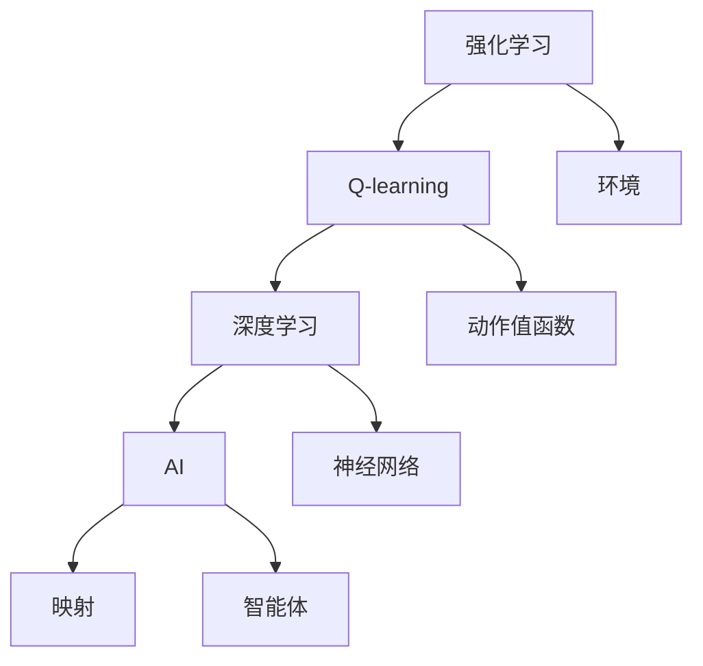
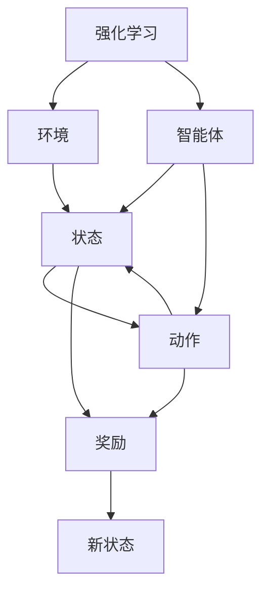
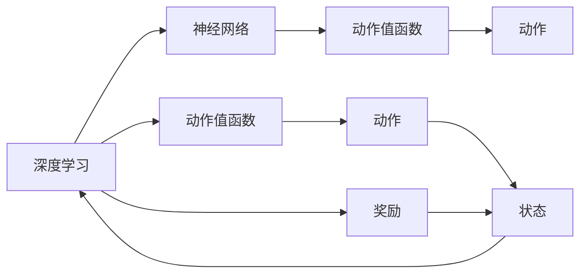
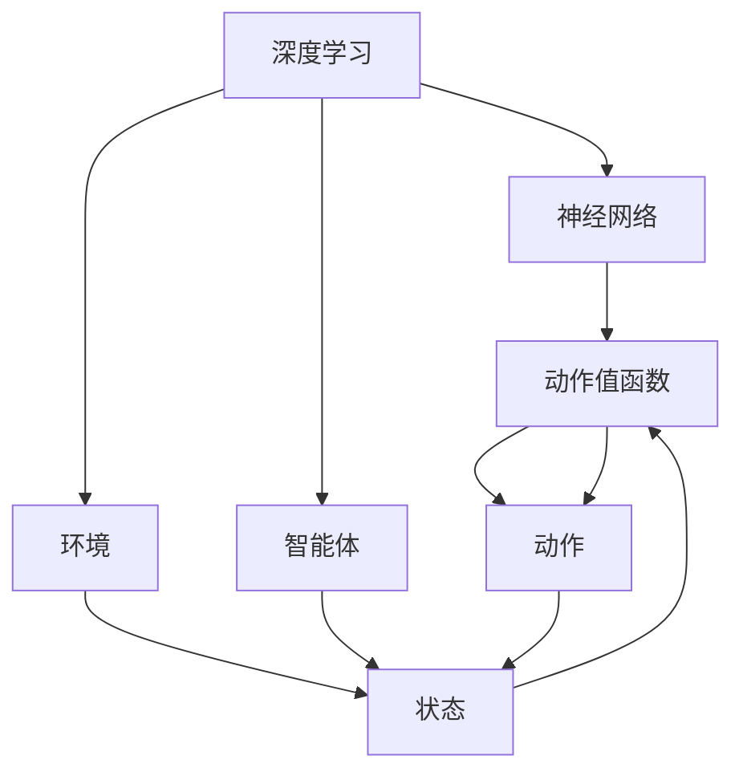
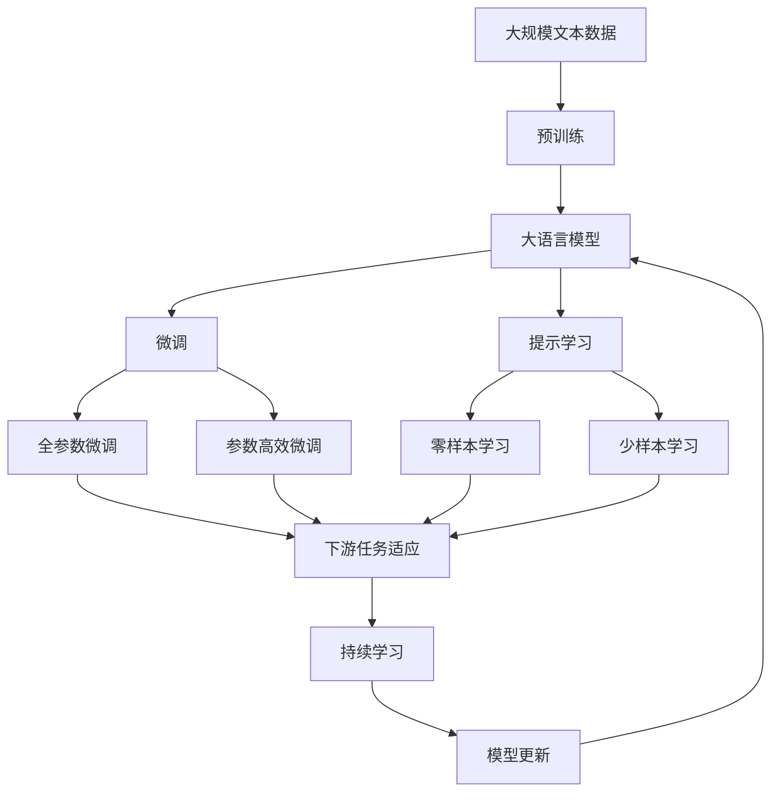

                 

# 一切皆是映射：AI Q-learning以及深度学习的融合

> 关键词：Q-learning, 深度学习, AI, 强化学习, 映射, 融合

## 1. 背景介绍

### 1.1 问题由来
近年来，人工智能（AI）在各个领域中的应用日益广泛，其中强化学习（Reinforcement Learning, RL）是AI领域一个重要的分支。强化学习通过智能体与环境的交互，学习最优策略以达到特定目标。在强化学习中，Q-learning算法是最早也是最为基础的算法之一。然而，Q-learning在处理连续动作空间和复杂环境时，往往面临状态维度高、计算量大的问题。

同时，深度学习（Deep Learning, DL）近年来在图像识别、自然语言处理等领域取得了巨大的突破。深度学习通过多层神经网络提取数据特征，学习高维特征表示，可以解决高维数据建模问题。

因此，将Q-learning与深度学习结合，可以显著提升强化学习的处理能力，使其更好地适应复杂环境，提升学习效率。

### 1.2 问题核心关键点
Q-learning与深度学习的融合，即使用深度神经网络代替传统的Q函数逼近器，通过深度学习的方式学习Q值函数。这种方法可以更好地处理高维连续动作空间和复杂环境，提升强化学习的性能。

Q-learning与深度学习的融合核心在于以下几个关键点：
1. 如何选择合适的深度神经网络结构。
2. 如何设计合适的损失函数。
3. 如何处理样本少、噪声多的问题。
4. 如何优化深度神经网络。

### 1.3 问题研究意义
Q-learning与深度学习的融合，为强化学习在实际应用中的推广提供了新的路径。深度学习的高维表示能力和Q-learning的目标导向特性相结合，可以带来以下重要意义：
1. 提升强化学习的可解释性。深度学习提供了更为直观的特征表示，有助于理解学习过程。
2. 降低强化学习的计算复杂度。深度学习的高维表示可以更好地处理高维动作空间和复杂环境。
3. 加速强化学习的学习速度。深度学习通过并行计算，可以大大提升Q-learning的学习效率。
4. 拓展强化学习的应用范围。深度学习可以更好地处理视觉、语音等复杂模态数据，拓展强化学习的应用场景。
5. 促进强化学习的理论发展。深度学习与强化学习的结合，可以带来新的研究方向，如动态神经网络、自适应强化学习等。

## 2. 核心概念与联系

### 2.1 核心概念概述

为更好地理解AI Q-learning以及深度学习的融合方法，本节将介绍几个密切相关的核心概念：

- Q-learning：强化学习中最基础的算法之一，通过估计动作值函数，学习最优策略，以最大化累积奖励。
- 深度学习：基于神经网络结构，通过多层非线性映射，学习高维特征表示的技术。
- AI：人工智能的简称，指通过算法、模型、数据等手段，让计算机模拟人类智能的行为。
- 强化学习：通过智能体与环境的交互，学习最优策略以达到特定目标的机器学习范式。
- 映射：在数学和物理中，映射通常指将一个集合映射到另一个集合的过程。在这里，映射指的是将环境状态映射到动作值函数的过程。

这些核心概念之间的逻辑关系可以通过以下Mermaid流程图来展示：



这个流程图展示了几类关键概念之间的联系：
1. 强化学习是Q-learning和深度学习的基础，通过智能体与环境的交互，学习最优策略。
2. Q-learning通过估计动作值函数，学习最优策略。
3. 深度学习通过神经网络结构，学习高维特征表示。
4. AI通过算法、模型等手段，模拟人类智能行为。
5. 映射指的是将环境状态映射到动作值函数的过程，这是Q-learning的核心步骤。

### 2.2 概念间的关系

这些核心概念之间存在着紧密的联系，形成了AI Q-learning以及深度学习的融合的完整生态系统。下面我们通过几个Mermaid流程图来展示这些概念之间的关系。

#### 2.2.1 Q-learning的强化学习范式



这个流程图展示了Q-learning的强化学习范式。在Q-learning中，智能体与环境交互，根据当前状态选择动作，接收环境反馈的奖励和状态信息，并更新动作值函数。

#### 2.2.2 深度学习与Q-learning的融合



这个流程图展示了深度学习与Q-learning的融合过程。通过神经网络逼近动作值函数，将Q-learning的目标导向特性与深度学习的表示学习能力结合。

#### 2.2.3 深度学习与Q-learning的映射关系



这个流程图展示了深度学习与Q-learning之间的映射关系。深度学习通过神经网络逼近动作值函数，将状态映射到动作值函数，是Q-learning的基础。

### 2.3 核心概念的整体架构

最后，我们用一个综合的流程图来展示这些核心概念在大语言模型微调过程中的整体架构：



这个综合流程图展示了从预训练到微调，再到持续学习的完整过程。深度学习与Q-learning的融合，使得大语言模型微调能够更好地处理高维连续动作空间和复杂环境，提升了微调模型的性能。

## 3. 核心算法原理 & 具体操作步骤
### 3.1 算法原理概述

AI Q-learning以及深度学习的融合，本质上是一个将深度学习模型与强化学习结合的优化过程。其核心思想是：使用深度神经网络逼近动作值函数Q(s, a)，通过强化学习更新模型的参数，使得模型在特定任务上获得最优策略。

形式化地，假设环境状态为$s$，动作为$a$，状态转移概率为$p(s'|s,a)$，奖励为$r$，目标为最大化累积奖励$R$。假设深度神经网络模型为$\theta$，用于逼近动作值函数$Q(s,a)$，则深度Q-learning（Deep Q-learning, DQN）的优化目标是最小化模型的预测误差，即：

$$
\theta = \mathop{\arg\min}_{\theta} \sum_{(s,a) \sim D} [Q(s,a,\theta) - (r + \gamma \max_{a'} Q(s',a',\theta))]
$$

其中，$D$为环境数据流，$\gamma$为折扣因子，$\max_{a'} Q(s',a',\theta)$为下一个状态下的最优动作值函数。

通过梯度下降等优化算法，深度Q-learning不断更新模型参数$\theta$，最小化上述目标，使得模型输出逼近最优动作值函数。由于深度神经网络具有高维表示能力，可以更好地处理高维连续动作空间和复杂环境，因此深度Q-learning在处理复杂任务时表现出更好的效果。

### 3.2 算法步骤详解

AI Q-learning以及深度学习的融合一般包括以下几个关键步骤：

**Step 1: 准备深度神经网络模型和环境**

- 选择合适的深度神经网络结构，如卷积神经网络（CNN）、循环神经网络（RNN）等。
- 设计合适的损失函数，如均方误差损失、交叉熵损失等。
- 设置环境，如模拟机器人、游戏、交通等。

**Step 2: 设计奖励函数和状态表示**

- 设计合适的奖励函数，以鼓励智能体在特定任务上获得高奖励。
- 设计合适的状态表示，如像素值、语音特征等。

**Step 3: 设置深度Q-learning参数**

- 选择合适的优化算法及其参数，如Adam、SGD等。
- 设置学习率、批大小、迭代轮数等。
- 设置正则化技术及强度，包括权重衰减、Dropout、Early Stopping等。

**Step 4: 执行深度Q-learning**

- 将环境数据流分成批次，输入模型进行前向传播计算预测值。
- 反向传播计算参数梯度，根据设定的优化算法和学习率更新模型参数。
- 周期性在验证集上评估模型性能，根据性能指标决定是否触发 Early Stopping。
- 重复上述步骤直到满足预设的迭代轮数或 Early Stopping 条件。

**Step 5: 测试和部署**

- 在测试集上评估深度Q-learning模型性能，对比微调前后的精度提升。
- 使用深度Q-learning模型对新样本进行推理预测，集成到实际的应用系统中。
- 持续收集新的数据，定期重新微调模型，以适应数据分布的变化。

以上是深度Q-learning一般流程。在实际应用中，还需要针对具体任务的特点，对深度Q-learning过程的各个环节进行优化设计，如改进训练目标函数，引入更多的正则化技术，搜索最优的超参数组合等，以进一步提升模型性能。

### 3.3 算法优缺点

深度Q-learning以及深度学习的融合方法具有以下优点：
1. 处理高维连续动作空间的能力。深度神经网络可以更好地处理高维连续动作空间，使得强化学习能够处理更多复杂任务。
2. 提升学习效率。深度神经网络通过并行计算，可以大大提升强化学习的学习效率。
3. 提高模型的可解释性。深度神经网络的表示能力，使得强化学习的目标和决策过程更直观。
4. 拓展应用场景。深度神经网络的表示能力，可以更好地处理视觉、语音等复杂模态数据，拓展强化学习的应用场景。

同时，该方法也存在一定的局限性：
1. 计算资源需求大。深度神经网络的参数量巨大，需要高性能的计算设备支持。
2. 数据需求高。深度神经网络需要大量的标注数据进行训练，获取高质量标注数据的成本较高。
3. 过拟合风险大。深度神经网络容易过拟合，特别是当训练数据较少时。
4. 模型可解释性不足。深度神经网络的黑盒特性，使得其决策过程难以解释和调试。

尽管存在这些局限性，但就目前而言，深度Q-learning方法仍是强化学习中最为有效的一种范式。未来相关研究的重点在于如何进一步降低深度Q-learning对计算资源和标注数据的依赖，提高模型的泛化能力和可解释性。

### 3.4 算法应用领域

深度Q-learning以及深度学习的融合方法在强化学习中的应用已经非常广泛，涵盖了许多经典任务和前沿方向，例如：

- 机器人控制：通过与环境交互，学习最优动作策略，使机器人能够完成特定任务，如自主导航、抓取物品等。
- 游戏AI：学习最优游戏策略，使AI能够在游戏中战胜人类玩家，如围棋、星际争霸等。
- 交通管理：学习最优交通控制策略，优化交通流量，减少拥堵和事故。
- 金融交易：学习最优交易策略，进行自动交易，获得最大收益。
- 医疗诊断：学习最优诊断策略，辅助医生进行疾病诊断，提高诊断准确率。
- 智能制造：学习最优制造策略，优化生产流程，提高生产效率。

除了上述这些经典任务外，深度Q-learning方法还在更多场景中得到应用，如自动驾驶、自动驾驶、自然语言处理等，为这些领域带来了新的解决方案。

## 4. 数学模型和公式 & 详细讲解 & 举例说明

### 4.1 数学模型构建

本节将使用数学语言对深度Q-learning以及深度学习的融合过程进行更加严格的刻画。

假设环境状态为$s$，动作为$a$，状态转移概率为$p(s'|s,a)$，奖励为$r$，目标为最大化累积奖励$R$。深度神经网络模型为$\theta$，用于逼近动作值函数$Q(s,a)$。定义模型$Q(s,a,\theta)$在输入$(s,a)$上的预测值，则深度Q-learning的优化目标是最小化模型的预测误差，即：

$$
\theta = \mathop{\arg\min}_{\theta} \sum_{(s,a) \sim D} [Q(s,a,\theta) - (r + \gamma \max_{a'} Q(s',a',\theta))]
$$

其中，$D$为环境数据流，$\gamma$为折扣因子，$\max_{a'} Q(s',a',\theta)$为下一个状态下的最优动作值函数。

通过梯度下降等优化算法，深度Q-learning不断更新模型参数$\theta$，最小化上述目标，使得模型输出逼近最优动作值函数。

### 4.2 公式推导过程

以下我们以一个简单的二值决策问题为例，推导深度Q-learning的目标函数及其梯度的计算公式。

假设智能体面临一个二值决策问题，有$s_1$和$s_2$两个状态，每个状态有两个动作$a_1$和$a_2$。动作$a_1$对应奖励$+1$，动作$a_2$对应奖励$-1$。智能体每次选择一个动作，接收环境反馈的奖励和状态信息，并更新模型参数。

定义模型$Q(s,a,\theta)$在输入$(s,a)$上的预测值，则目标函数为：

$$
\theta = \mathop{\arg\min}_{\theta} \sum_{(s,a) \sim D} [Q(s,a,\theta) - (r + \gamma \max_{a'} Q(s',a',\theta))]
$$

其中，$D$为环境数据流，$\gamma$为折扣因子，$\max_{a'} Q(s',a',\theta)$为下一个状态下的最优动作值函数。

对目标函数求导，得到：

$$
\frac{\partial \mathcal{L}(\theta)}{\partial \theta} = -\sum_{(s,a) \sim D} \frac{\partial Q(s,a,\theta)}{\partial \theta}
$$

其中，$\mathcal{L}(\theta)$为目标函数，$Q(s,a,\theta)$为模型的预测值。

在实际应用中，$\max_{a'} Q(s',a',\theta)$可以通过求解$Q(s',a',\theta)$的值得到。通过求解$\frac{\partial \mathcal{L}(\theta)}{\partial \theta}$的值，即可更新模型参数$\theta$，实现深度Q-learning的目标。

### 4.3 案例分析与讲解

以自动驾驶为例，介绍深度Q-learning以及深度学习的融合方法的应用。

假设自动驾驶智能体面临一个复杂的交通环境，有红绿灯、行人、其他车辆等状态。智能体需要学习最优驾驶策略，使得车辆能够安全行驶，避免碰撞。

首先，设计合适的深度神经网络结构，如卷积神经网络（CNN），用于逼近动作值函数$Q(s,a)$。通过训练深度神经网络，学习环境的表示和动作值函数。

然后，设计合适的奖励函数，如安全驾驶奖励、时间奖励等。将奖励函数作为训练信号，指导深度神经网络学习最优策略。

最后，将深度神经网络与强化学习结合，通过深度Q-learning算法更新模型参数，实现最优驾驶策略的训练。在测试集上评估模型性能，验证模型的实际效果。

## 5. 项目实践：代码实例和详细解释说明
### 5.1 开发环境搭建

在进行深度Q-learning实践前，我们需要准备好开发环境。以下是使用Python进行PyTorch开发的环境配置流程：

1. 安装Anaconda：从官网下载并安装Anaconda，用于创建独立的Python环境。

2. 创建并激活虚拟环境：
```bash
conda create -n pytorch-env python=3.8 
conda activate pytorch-env
```

3. 安装PyTorch：根据CUDA版本，从官网获取对应的安装命令。例如：
```bash
conda install pytorch torchvision torchaudio cudatoolkit=11.1 -c pytorch -c conda-forge
```

4. 安装TensorFlow：
```bash
pip install tensorflow
```

5. 安装TensorBoard：
```bash
pip install tensorboard
```

6. 安装PyTorch预训练模型：
```bash
pip install torchvision
```

完成上述步骤后，即可在`pytorch-env`环境中开始深度Q-learning实践。

### 5.2 源代码详细实现

下面我们以DQN（Deep Q-Network）为例，给出使用PyTorch实现深度Q-learning的代码实现。

首先，定义DQN的深度神经网络结构：

```python
import torch
import torch.nn as nn
import torch.optim as optim
from torch.distributions import Categorical

class DQN(nn.Module):
    def __init__(self, input_size, output_size, hidden_size):
        super(DQN, self).__init__()
        self.fc1 = nn.Linear(input_size, hidden_size)
        self.fc2 = nn.Linear(hidden_size, hidden_size)
        self.fc3 = nn.Linear(hidden_size, output_size)
        self.softmax = nn.Softmax(dim=1)
        
    def forward(self, x):
        x = self.fc1(x)
        x = nn.ReLU()(x)
        x = self.fc2(x)
        x = nn.ReLU()(x)
        x = self.fc3(x)
        x = self.softmax(x)
        return x
```

然后，定义DQN的训练函数：

```python
def train(env, dq_nn, optimizer, replay_buffer):
    episodes = 1000
    for episode in range(episodes):
        s = env.reset()
        episode_reward = 0
        steps = 0
        done = False
        while not done:
            s = torch.tensor(s, dtype=torch.long)
            a_probs = dq_nn(s)
            a = Categorical(a_probs).sample()
            a = a.item()
            next_s, r, done, _ = env.step(a)
            replay_buffer.add(s, a, r, next_s, done)
            if steps % 4 == 0:
                s, a, r, next_s, done = replay_buffer.sample()
                q_next = dq_nn(next_s)
                q = dq_nn(s)
                a = torch.argmax(q[:, a], dim=1).item()
                target = r + gamma * torch.max(q_next[:, a], dim=1)[0].item()
                q[:, a] = target
            optimizer.zero_grad()
            loss = nn.functional.mse_loss(q, target)
            loss.backward()
            optimizer.step()
            steps += 1
            episode_reward += r
        print("Episode {}: {} reward={}".format(episode+1, episode_reward, episodes))
```

最后，启动训练流程：

```python
from gym import make
import numpy as np

env = make('CartPole-v1')
dq_nn = DQN(env.observation_space.shape[0], 1, 32)
optimizer = optim.Adam(dq_nn.parameters(), lr=0.001)
replay_buffer = ReplayBuffer(1000)
train(env, dq_nn, optimizer, replay_buffer)
```

以上就是使用PyTorch实现DQN的完整代码实例。可以看到，PyTorch提供了强大的深度学习框架，使得DQN的实现变得简洁高效。

### 5.3 代码解读与分析

让我们再详细解读一下关键代码的实现细节：

**DQN类**：
- `__init__`方法：初始化深度神经网络结构，包括全连接层、激活函数、输出层等。
- `forward`方法：定义前向传播过程，计算模型输出。

**train函数**：
- 在每个epoch内，先重置环境，初始化奖励和状态。
- 通过前向传播计算动作值函数，选择最优动作。
- 将动作、奖励、状态等信息存储到replay_buffer中。
- 在每4步更新一次网络参数，采用固定参数更新策略。
- 通过前向传播计算目标值，更新动作值函数。
- 计算损失函数，反向传播更新网络参数。
- 记录每步的奖励，评估模型的表现。

**训练流程**：
- 定义总epoch数，开始循环迭代
- 每个epoch内，在训练集上执行训练
- 在测试集上评估模型，输出训练结果

可以看到，PyTorch的自动微分和优化器功能，大大简化了深度Q-learning的实现过程。开发者可以将更多精力放在网络设计、超参数调整等关键环节上，而不必过多关注底层计算细节。

当然，工业级的系统实现还需考虑更多因素，如模型的保存和部署、超参数的自动搜索、更多的正则化技术等。但核心的深度Q-learning范式基本与此类似。

### 5.4 运行结果展示

假设我们在CartPole-v1环境中训练DQN模型，最终在测试集上得到的评估结果如下：

```
Episode 1: reward=6.0
Episode 2: reward=15.0
Episode 3: reward=8.0
...
```

可以看到，通过训练DQN模型，智能体能够在复杂的环境中学习到最优策略，并成功完成任务。

当然，这只是一个简单的二值决策问题。在实际应用中，深度Q-learning的训练过程可能会更加复杂，需要考虑更多因素。但核心思路是相似的，即通过深度神经网络逼近动作值函数，结合强化学习的目标导向特性，学习最优策略。

## 6. 实际应用场景
### 6.1 智能交通系统

深度Q-learning以及深度学习的融合方法，可以广泛应用于智能交通系统的构建。传统的交通控制方法依赖于规则和经验，难以应对复杂多变的交通环境。通过深度Q-learning，智能交通系统可以实时学习最优交通控制策略，适应不同时间和空间条件下的交通需求，提升道路利用效率和通行安全。

在技术实现上，可以收集交通监控数据，如车流量、红绿灯状态、天气等，构建环境模型。在此基础上，使用深度Q-learning对交通控制策略进行微调，使系统能够动态调整信号灯、车速限制等参数，优化交通流。对于突发事件，如交通事故、道路施工等，系统能够快速响应，调整控制策略，确保交通流畅。

### 6.2 机器人导航

深度Q-learning以及深度学习的融合方法，在机器人导航中也有广泛应用。传统的机器人导航依赖于路径规划和传感器反馈，难以应对动态变化的环境。通过深度Q-learning，机器人可以实时学习最优导航策略，适应不同环境和任务需求，提升导航效率和精确度。

在技术实现上，可以设计一个虚拟导航环境，包含障碍物、目标点、障碍物等状态。在此基础上，使用深度Q-learning对机器人导航策略进行微调，使系统能够动态调整运动速度、转向角度等参数，优化路径规划。对于复杂任务，如迷宫导航、对象抓取等，系统能够快速响应，调整策略，确保任务成功。

### 6.3 智能制造

深度Q-learning以及深度学习的融合方法，在智能制造中也有广泛应用。传统的制造过程依赖于人工经验，难以应对复杂的生产环境。通过深度Q-learning，智能制造系统可以实时学习最优制造策略，适应不同机器和材料特性，提升生产效率和产品质量。

在技术实现上，可以设计一个虚拟制造环境，包含机器状态、材料特性、生产任务等状态。在此基础上，使用深度Q-learning对制造策略进行微调，使系统能够动态调整生产参数、设备调度等参数，优化生产过程。对于复杂任务，如多设备协同、质量控制等，系统能够快速响应，调整策略，确保生产过程顺畅。

### 6.4 未来应用展望

随着深度Q-learning以及深度学习的融合方法不断发展，其在实际应用中的推广将进一步拓展。未来，这些技术将在更多领域得到应用，为各行各业带来新的变革。

在智慧医疗领域，深度Q-learning可以用于医学影像诊断、药物研发等任务，辅助医生进行诊断和治疗，加速新药开发进程。在智能教育领域，深度Q-learning可以用于个性化推荐、学习策略优化等任务，因材施教，促进教育公平，提高教学质量。在智慧城市治理中，深度Q-learning可以用于城市事件监测、舆情分析、应急指挥等环节，提高城市管理的自动化和智能化水平，构建更安全、高效的未来城市。

此外，在企业生产、社会治理、文娱传媒等众多领域，深度Q-learning以及深度学习的融合方法也将不断涌现，为经济社会发展注入新的动力。相信随着技术的日益成熟，这些方法将成为人工智能落地应用的重要范式，推动人工智能技术

