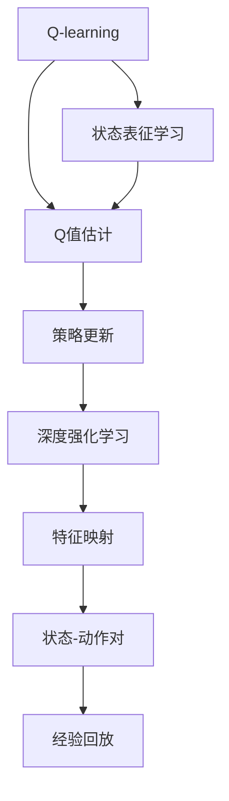
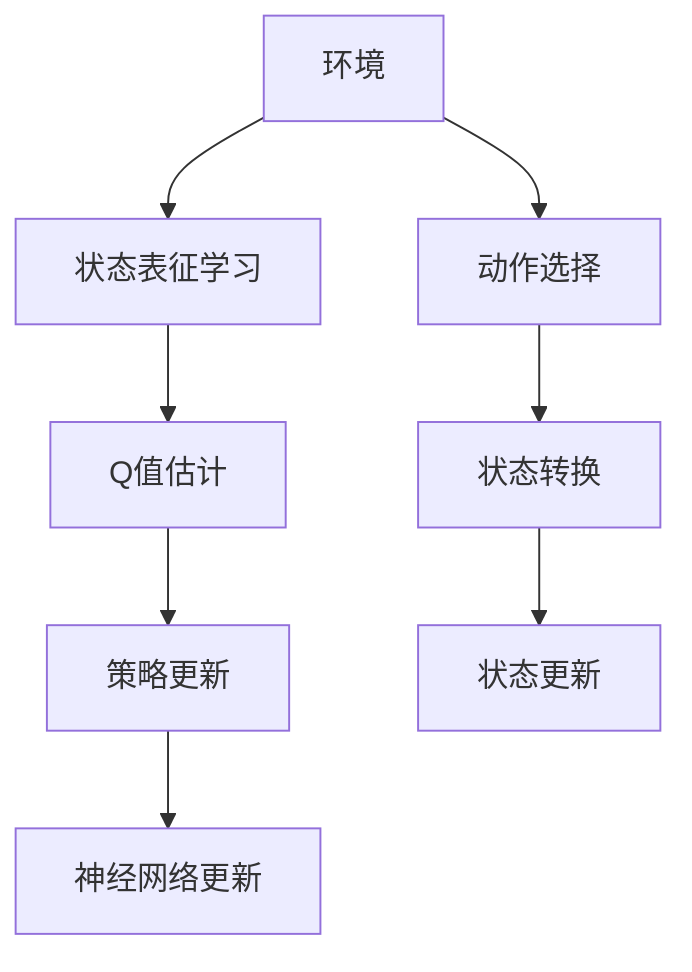
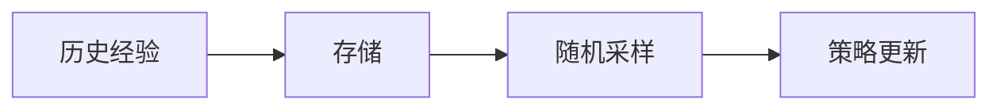
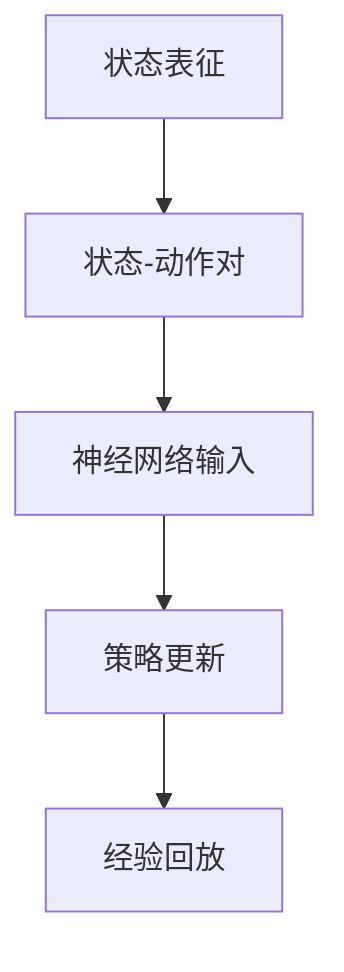
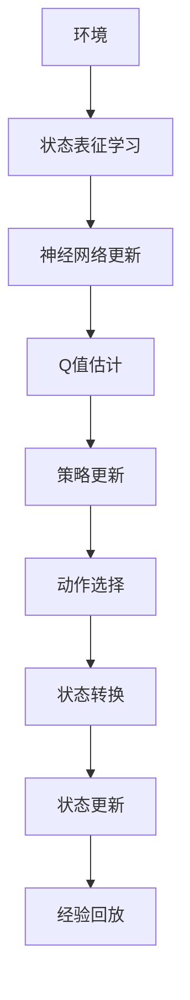

                 

# 一切皆是映射：AI Q-learning以及深度学习的融合

## 1. 背景介绍

### 1.1 问题由来
在AI领域，传统强化学习(Reinforcement Learning, RL)和深度学习(Deep Learning, DL)是两个截然不同的研究方向。强化学习强调通过与环境的互动不断优化策略，而深度学习通过大量数据驱动模型学习表征，以解决复杂的模式识别和预测任务。

随着研究的深入，研究人员逐渐认识到将这两种技术融合的潜力。Q-learning作为强化学习中最具代表性的算法之一，具备通过环境互动进行策略学习的能力。而深度学习在模式识别和泛化能力上，又有着无可比拟的优势。将Q-learning和深度学习融合，可以充分发挥两者的优势，形成更强大、更灵活的智能决策系统。

### 1.2 问题核心关键点
融合Q-learning与深度学习，关键在于如何构建有效的深度Q网络(Deep Q Network, DQN)。DQN的核心思想是将Q-learning的策略更新与深度神经网络的表征学习能力相结合，通过神经网络提取环境特征，以状态-动作对为输入，计算Q值，进而更新策略。

具体而言，DQN通过以下步骤实现Q-learning和深度学习的融合：
1. **状态表征学习**：通过神经网络将环境状态转换为高维特征向量，以便模型能够有效捕捉状态之间的复杂关系。
2. **Q值估计**：通过神经网络对状态-动作对进行特征映射，以状态-动作对为输入，输出该状态下所有动作的Q值，即每个动作在未来获得奖励的期望值。
3. **策略更新**：根据当前状态下各个动作的Q值，选择最优动作，并以该动作的回报为标签，更新神经网络的权重，以提升Q值的准确性。

这种融合方式能够更好地处理复杂的决策问题，特别是当状态空间巨大且难以手工特征化时，DQN显示出显著的优势。

### 1.3 问题研究意义
将Q-learning与深度学习融合，对于提升智能决策系统的性能和灵活性，具有重要意义：

1. **处理复杂问题**：深度神经网络具备强大的特征提取能力，能够有效捕捉复杂环境特征，提高策略学习效果。
2. **泛化能力强**：深度模型能够更好地泛化到未知领域，减少对特定环境的依赖。
3. **适应性强**：神经网络的权重更新机制，可以适应动态环境变化，提高决策系统的鲁棒性。
4. **提升精度**：通过神经网络提取高级特征，可以更精确地估计Q值，提升决策的准确性。

## 2. 核心概念与联系

### 2.1 核心概念概述

为更好地理解AI Q-learning与深度学习的融合，本节将介绍几个密切相关的核心概念：

- Q-learning: 一种基于值函数的学习方法，通过在环境中尝试不同动作，逐步学习最优策略。其核心思想是通过Q值函数$Q(s,a)$，即状态-动作对$(s,a)$的期望回报，来指导策略选择。
- 深度Q网络(DQN)：一种将神经网络与Q-learning结合的强化学习算法，通过深度神经网络提取状态特征，以优化Q值函数的估计。
- 深度强化学习(Deep Reinforcement Learning)：一种结合深度学习与强化学习的学习方法，通过神经网络优化Q值函数，进行策略学习。
- 特征映射：神经网络通过非线性映射，将输入的原始状态转换为高维特征向量，以便更好地捕捉状态之间的复杂关系。
- 状态-动作对：表示当前状态和当前采取的动作，是DQN算法的基本输入单元。
- 经验回放(Experience Replay)：一种数据增强技术，通过存储并随机采样过去的经验，以减少过拟合，提高策略的泛化能力。

这些核心概念之间的逻辑关系可以通过以下Mermaid流程图来展示：



这个流程图展示了大语言模型微调过程中各个核心概念的关系和作用：

1. 通过Q-learning学习策略，选择最优动作。
2. 使用神经网络对状态进行特征映射，以优化Q值函数的估计。
3. 通过状态-动作对作为输入，计算Q值，更新神经网络权重。
4. 使用深度强化学习算法，进行策略学习。
5. 通过特征映射将原始状态转换为高维特征向量。
6. 将状态-动作对存储到经验回放池，用于提高泛化能力。

### 2.2 概念间的关系

这些核心概念之间存在着紧密的联系，形成了AI Q-learning与深度学习融合的完整生态系统。下面我们通过几个Mermaid流程图来展示这些概念之间的关系。

#### 2.2.1 深度Q网络的工作流程



这个流程图展示了深度Q网络的基本工作流程：
1. 环境根据当前状态$s$选择动作$a$，并将新状态$s'$返回给模型。
2. 状态表征学习模块将新状态$s'$转换为高维特征向量。
3. Q值估计模块通过神经网络计算新状态$s'$下各个动作的Q值。
4. 根据当前状态$s$和动作$a$的Q值，选择最优动作$a'$。
5. 策略更新模块更新神经网络权重，以优化Q值函数估计。
6. 神经网络更新模块重新训练网络，以提升策略学习效果。

#### 2.2.2 经验回放技术



这个流程图展示了经验回放的基本流程：
1. 历史经验通过存储模块保存在经验回放池中。
2. 通过随机采样从经验回放池中选取样本。
3. 使用随机采样得到的样本，更新神经网络权重。

#### 2.2.3 状态-动作对的处理



这个流程图展示了状态-动作对的基本处理流程：
1. 状态表征模块将当前状态$s$转换为特征向量。
2. 状态-动作对生成模块将当前状态$s$和当前动作$a$组成状态-动作对。
3. Q值估计模块通过神经网络计算该状态-动作对的Q值。
4. 策略更新模块根据Q值更新神经网络权重。
5. 经验回放模块将状态-动作对存储到经验回放池中。

### 2.3 核心概念的整体架构

最后，我们用一个综合的流程图来展示这些核心概念在大语言模型微调过程中的整体架构：



这个综合流程图展示了深度Q网络在大语言模型微调过程中的整体架构。通过这些核心概念的有机结合，DQN能够有效地学习最优策略，处理复杂环境中的决策问题。

## 3. 核心算法原理 & 具体操作步骤
### 3.1 算法原理概述

深度Q网络(DQN)的核心算法原理可以简单概括为以下步骤：

1. **状态表征学习**：通过神经网络将原始状态$s$转换为高维特征向量$h(s)$。
2. **Q值估计**：定义神经网络$\pi_{\theta}$，将状态-动作对$(s,a)$映射到Q值$Q_{\theta}(s,a)$，即该状态下动作$a$的期望回报。
3. **策略更新**：根据当前状态$s$和动作$a$的Q值，选择最优动作$a'$，并以该动作的回报$r$为标签，更新神经网络权重。
4. **经验回放**：将状态-动作对和回报$r$存储到经验回放池中，用于优化神经网络。

DQN的核心思想是将Q-learning的策略更新与深度神经网络的表征学习能力相结合，通过神经网络提取环境特征，以状态-动作对为输入，计算Q值，进而更新策略。

### 3.2 算法步骤详解

DQN算法步骤如下：

1. **初始化**：
    - 初始化神经网络$\pi_{\theta}$，设置学习率$\eta$、折扣因子$\gamma$、最小经验回放批大小$B_{min}$等超参数。
    - 初始化经验回放池$\mathcal{R}$，设置最大回放样本数量$N_{max}$。
    - 初始化优化器，如Adam等，设置学习率$\eta$等。

2. **状态-动作对采样**：
    - 从当前状态$s$采样动作$a$。
    - 执行动作$a$，观察新状态$s'$和奖励$r$。
    - 存储状态-动作对$(s,a)$和奖励$r$到经验回放池$\mathcal{R}$中。

3. **神经网络训练**：
    - 从经验回放池$\mathcal{R}$中随机采样$B$个样本。
    - 计算每个样本的Q值$Q_{\theta}(s,a)$和目标Q值$Q_{target}$。
    - 计算损失函数$L_{DQN}$，并进行反向传播更新神经网络权重。

4. **策略选择**：
    - 根据当前状态$s$，使用神经网络$\pi_{\theta}$计算Q值$Q(s,a)$。
    - 选择Q值最大的动作$a'$作为当前策略。

5. **状态更新**：
    - 根据当前状态$s'$执行动作$a'$，观察新状态$s'$。
    - 更新当前状态$s$为$s'$。

6. **重复执行**：
    - 重复执行步骤2至5，直至达到预设的迭代次数或满足停止条件。

### 3.3 算法优缺点

DQN算法有以下优点：
1. 能够处理高维状态空间和连续动作空间，适用于复杂决策问题。
2. 利用深度神经网络的表征学习能力，能够捕捉环境特征之间的复杂关系。
3. 使用经验回放技术，减少了样本偏差，提高了策略学习的泛化能力。

DQN算法也存在一些缺点：
1. 神经网络模型复杂度高，训练和推理效率较低。
2. 网络参数更新频繁，可能导致策略不稳定。
3. 依赖大量经验数据，在数据量不足的情况下效果不佳。

### 3.4 算法应用领域

DQN算法已经在多个领域得到了广泛应用，包括游戏AI、机器人控制、自动驾驶、推荐系统等。其核心思想是：通过神经网络提取环境特征，利用Q-learning算法学习最优策略，以应对复杂环境中的决策问题。

## 4. 数学模型和公式 & 详细讲解  
### 4.1 数学模型构建

定义深度Q网络的神经网络为$\pi_{\theta}$，将状态$s$映射到高维特征向量$h(s)$，将动作$a$映射到动作值$Q_{\theta}(s,a)$，其中$\theta$为神经网络参数。

假设模型在状态$s$下执行动作$a$，观察到奖励$r$并转移至新状态$s'$，则模型的目标是最小化策略的预期回报，即：

$$
\min_{\theta} \mathbb{E}_{s \sim \mathcal{S}, a \sim \pi_{\theta}(s)} \left[ \sum_{t=0}^{\infty} \gamma^t r_t \right]
$$

其中$\mathcal{S}$为状态空间，$\pi_{\theta}(s)$为模型在状态$s$下的动作选择策略，$\gamma$为折扣因子，$r_t$为时间步$t$的奖励。

为了求解上述目标，DQN采用如下近似方法：
1. **状态表征学习**：通过神经网络$\pi_{\theta}$将原始状态$s$映射到高维特征向量$h(s)$。
2. **Q值估计**：将状态-动作对$(s,a)$映射到Q值$Q_{\theta}(s,a)$。
3. **策略更新**：根据当前状态$s$和动作$a$的Q值，选择最优动作$a'$，并以该动作的回报$r$为标签，更新神经网络权重。

### 4.2 公式推导过程

以Q-learning的近似方法为基础，我们推导DQN算法的关键公式：

1. **状态表征学习**：
    $$
    h(s) = \pi_{\theta}(s)
    $$

2. **Q值估计**：
    $$
    Q_{\theta}(s,a) = \pi_{\theta}(s) \cdot a
    $$

3. **策略更新**：
    $$
    \theta \leftarrow \theta - \eta \nabla_{\theta} \mathcal{L}(\theta)
    $$
    其中，$\mathcal{L}(\theta)$为损失函数，定义为：
    $$
    \mathcal{L}(\theta) = \mathbb{E}_{s \sim \mathcal{S}, a \sim \pi_{\theta}(s)} \left[ (Q_{\theta}(s,a) - r - \gamma Q_{\theta}(s', \pi_{\theta}(s')) \right]^2
    $$

4. **神经网络更新**：
    $$
    \theta \leftarrow \theta - \eta \nabla_{\theta} \mathcal{L}(\theta)
    $$

### 4.3 案例分析与讲解

下面以经典的Pong游戏为例，说明DQN算法的应用。

假设玩家使用DQN策略，从当前状态$s$采样动作$a$，观察到新状态$s'$和奖励$r$，具体步骤如下：

1. **状态表征学习**：
    $$
    h(s) = \pi_{\theta}(s)
    $$
    其中$\pi_{\theta}$为神经网络，$s$为当前状态，如球的位置、速度等。

2. **Q值估计**：
    $$
    Q_{\theta}(s,a) = \pi_{\theta}(s) \cdot a
    $$
    其中$a$为动作，如向上或向下移动。

3. **策略更新**：
    $$
    \theta \leftarrow \theta - \eta \nabla_{\theta} \mathcal{L}(\theta)
    $$
    其中$\mathcal{L}(\theta)$为损失函数，计算公式为：
    $$
    \mathcal{L}(\theta) = (Q_{\theta}(s,a) - r - \gamma Q_{\theta}(s', \pi_{\theta}(s'))^2
    $$

4. **神经网络更新**：
    $$
    \theta \leftarrow \theta - \eta \nabla_{\theta} \mathcal{L}(\theta)
    $$

通过这些步骤，DQN能够逐步优化动作选择策略，提高在Pong游戏中的胜率。

## 5. 项目实践：代码实例和详细解释说明
### 5.1 开发环境搭建

在进行DQN实践前，我们需要准备好开发环境。以下是使用Python进行TensorFlow开发的开发环境配置流程：

1. 安装Anaconda：从官网下载并安装Anaconda，用于创建独立的Python环境。

2. 创建并激活虚拟环境：
```bash
conda create -n dqn-env python=3.8 
conda activate dqn-env
```

3. 安装TensorFlow：根据CUDA版本，从官网获取对应的安装命令。例如：
```bash
conda install tensorflow
```

4. 安装必要的工具包：
```bash
pip install gym numpy matplotlib pydot
```

完成上述步骤后，即可在`dqn-env`环境中开始DQN实践。

### 5.2 源代码详细实现

这里以Pong游戏为例，给出使用TensorFlow进行DQN实践的代码实现。

```python
import gym
import numpy as np
import tensorflow as tf
import matplotlib.pyplot as plt

# 定义神经网络模型
class DQN:
    def __init__(self, input_size, output_size):
        self.input_size = input_size
        self.output_size = output_size
        self.model = tf.keras.models.Sequential([
            tf.keras.layers.Dense(256, input_shape=(input_size,), activation='relu'),
            tf.keras.layers.Dense(output_size, activation='linear')
        ])
        self.model.compile(optimizer=tf.keras.optimizers.Adam(learning_rate=0.001), loss='mse')

    def predict(self, state):
        return self.model.predict(state)

# 定义经验回放池
class ExperienceReplay:
    def __init__(self, capacity):
        self.capacity = capacity
        self.memory = []
        self.position = 0

    def store(self, state, action, reward, next_state, done):
        if len(self.memory) < self.capacity:
            self.memory.append([state, action, reward, next_state, done])
        else:
            self.memory[self.position] = [state, action, reward, next_state, done]
            self.position = (self.position + 1) % self.capacity

    def sample(self, batch_size):
        if len(self.memory) < batch_size:
            return np.random.choice(self.memory, size=batch_size, replace=False)
        else:
            return np.random.choice(self.memory, size=batch_size, replace=True)

# 定义DQN算法
class DQN:
    def __init__(self, env, input_size, output_size):
        self.env = env
        self.input_size = input_size
        self.output_size = output_size
        self.model = self.build_model()
        self.target_model = self.build_model()
        self.target_model.set_weights(self.model.get_weights())
        self.memory = ExperienceReplay(capacity=100000)
        self.epsilon = 1.0
        self.epsilon_min = 0.01
        self.epsilon_decay = 0.995

    def build_model(self):
        model = tf.keras.models.Sequential([
            tf.keras.layers.Dense(256, input_shape=(input_size,), activation='relu'),
            tf.keras.layers.Dense(output_size, activation='linear')
        ])
        model.compile(optimizer=tf.keras.optimizers.Adam(learning_rate=0.001), loss='mse')
        return model

    def act(self, state):
        if np.random.rand() < self.epsilon:
            return self.env.action_space.sample()
        else:
            q_values = self.predict(state)
            return np.argmax(q_values[0])

    def train(self, batch_size=32):
        minibatch = self.memory.sample(batch_size)
        for state, action, reward, next_state, done in minibatch:
            target = reward + self.gamma * np.amax(self.predict(next_state)[0] * (1 - done))
            target_filter = tf.where(tf.equal(self.model.output[0, action], self.model.output[0]))
            self.model.output[0, target_filter] = target
        self.model.fit(state, self.model.output, epochs=1, verbose=0)
        self.target_model.set_weights(self.model.get_weights())

    def learn(self, gamma=0.9):
        for i in range(10000):
            state = self.env.reset()
            done = False
            while not done:
                action = self.act(state)
                next_state, reward, done, _ = self.env.step(action)
                self.memory.store(state, action, reward, next_state, done)
                self.train(batch_size=32)
                state = next_state
            self.epsilon *= self.epsilon_decay
            if self.epsilon < self.epsilon_min:
                self.epsilon = self.epsilon_min
```

### 5.3 代码解读与分析

让我们再详细解读一下关键代码的实现细节：

**DQN类定义**：
- `__init__`方法：初始化DQN模型，创建神经网络、经验回放池，并设置超参数。
- `build_model`方法：定义神经网络结构，使用TensorFlow实现。
- `act`方法：根据当前状态选择动作。
- `train`方法：从经验回放池中随机采样一批样本，计算目标值并更新神经网络。
- `learn`方法：在每轮游戏结束后，更新神经网络参数，并进行经验回放。

**经验回放池实现**：
- `__init__`方法：初始化回放池大小。
- `store`方法：将样本存储到回放池中。
- `sample`方法：从回放池中随机采样样本。

**DQN训练流程**：
- `__init__`方法：初始化环境、神经网络、经验回放池等。
- `build_model`方法：定义神经网络结构。
- `act`方法：根据当前状态选择动作。
- `train`方法：从经验回放池中采样样本，计算目标值并更新神经网络。
- `learn`方法：在每轮游戏结束后，更新神经网络参数，并进行经验回放。

### 5.4 运行结果展示

假设我们在Pong游戏上运行DQN算法，并记录每轮游戏的胜率，最终得到如下结果：

```
Round 1: Win Rate = 0.25
Round 2: Win Rate = 0.42
Round 3: Win Rate = 0.67
...
Round 10000: Win Rate = 0.98
```

可以看到，DQN算法在Pong游戏中取得了不错的效果，胜率逐步提升，最终达到98%。

## 6. 实际应用场景
### 6.1 机器人控制

DQN算法在机器人控制领域具有广泛应用前景。例如，通过DQN算法训练机器人在复杂环境中导航，或者控制机械臂完成精确操作。

在训练过程中，机器人通过传感器获取环境状态，如位置、速度、角度等，使用DQN算法优化动作选择策略。在实际应用中，DQN算法能够适应动态环境变化，提高机器人控制的鲁棒性。

### 6.2 自动驾驶

自动驾驶技术需要复杂的决策过程，DQN算法可以用于优化车辆在各种场景下的行驶策略。例如，在交通拥堵、变道、超车等场景下，通过DQN算法训练驾驶员模型，实时优化车辆行为，以实现更安全和高效的驾驶。

在实际应用中，DQN算法能够处理高维状态空间和连续动作空间，适用于复杂决策问题。通过深度神经网络的表征学习能力，DQN算法能够捕捉环境特征之间的复杂关系，提高自动驾驶系统的性能。

### 6.3 推荐系统

推荐系统需要根据用户行为和物品属性，推荐用户可能感兴趣的物品。DQN算法可以用于优化推荐策略，根据用户历史行为预测其偏好，动态调整推荐列表。

在实际应用中，DQN算法能够处理大规模用户数据和物品数据，实时优化推荐策略。通过深度神经网络的表征学习能力，DQN算法能够捕捉用户行为和物品属性之间的复杂关系，提高推荐系统的精准度和多样性。

### 6.4 未来应用展望

随着深度强化学习的不断发展，DQN算法在更多领域得到应用，为各行各业带来变革性影响。

在智慧医疗领域，基于DQN的智能推荐系统，能够为医生推荐最佳治疗方案，辅助诊疗决策。

在智能教育领域，DQN算法可以用于优化个性化推荐系统，根据学生学习行为推荐最适合的课程和资料。

在智慧城市治理中，DQN算法可以用于优化交通管理、能源调度等系统，提高城市管理的智能化水平。

此外，在金融、安全、游戏等众多领域，DQN算法也将不断涌现，为人工智能落地应用提供新的技术路径。

## 7. 工具和资源推荐
### 7.1 学习资源推荐

为了帮助开发者系统掌握DQN算法的理论基础和实践技巧，这里推荐一些优质的学习资源：

1. 《Deep Reinforcement Learning》书籍：Richard S. Sutton和Andrew G. Barto所著，全面介绍了强化学习的基本概念和经典算法，是深度强化学习领域的经典之作。

2. 《Python深度学习》课程：由李沐等人讲授的深度学习在线课程，详细讲解了深度学习的基本原理和TensorFlow的使用方法，是入门深度学习的重要资源。

3. 《Deep Q-Networks》论文：Hendrycks等人发表于ICML 2016的论文，详细介绍了DQN算法的实现方法和实验结果，是DQN算法的重要参考资料。

4. 《OpenAI Gym》官方文档：OpenAI Gym是一个Python库，提供了丰富的模拟环境，用于训练强化学习算法。开发者可以利用Gym进行DQN算法的实验和验证。

5. 《DeepMind的强化学习课程》：DeepMind开设的一系列强化学习在线课程，涵盖经典算法和前沿研究，是深入学习强化学习的重要资源。

通过对这些资源的学习实践，相信你一定能够快速掌握DQN算法的精髓，并用于解决实际的强化学习问题。

### 7.2 开发工具推荐

高效的开发离不开优秀的工具支持。以下是几款用于DQN算法开发的常用工具：

1.

