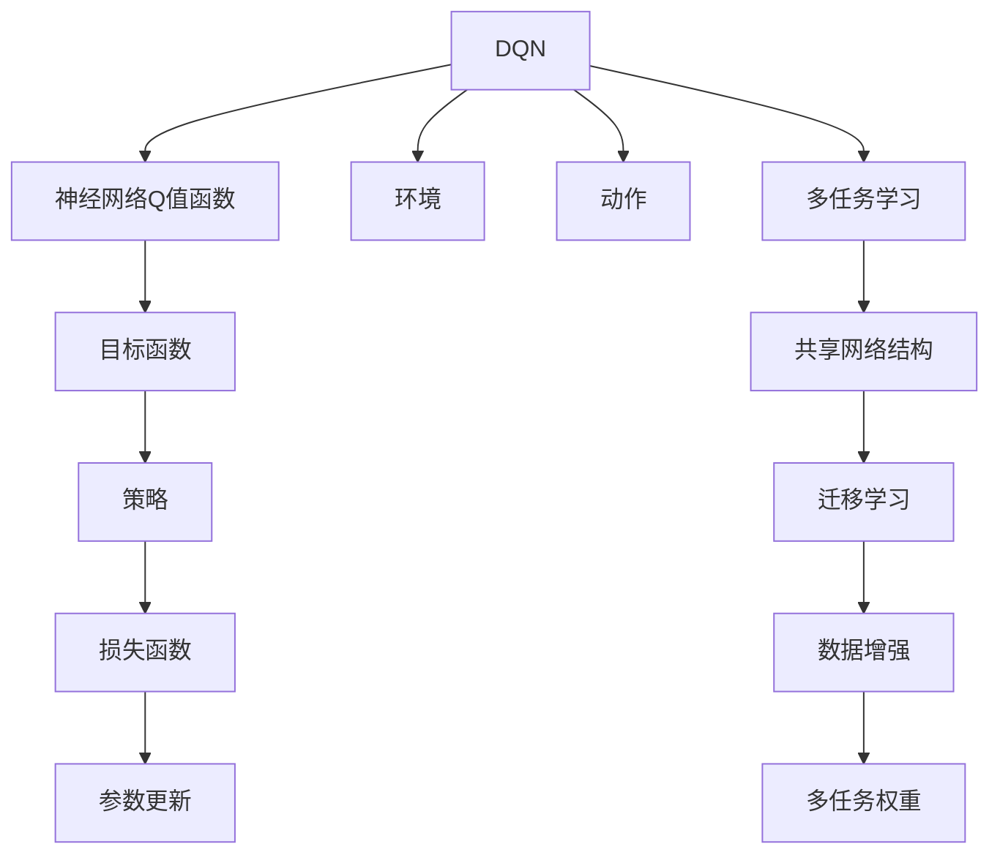
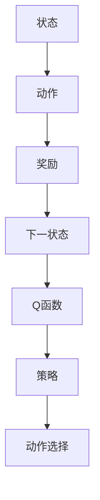
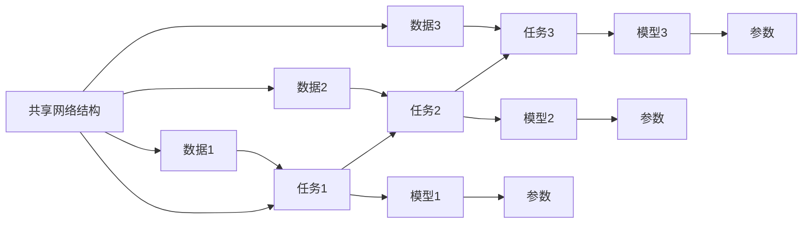
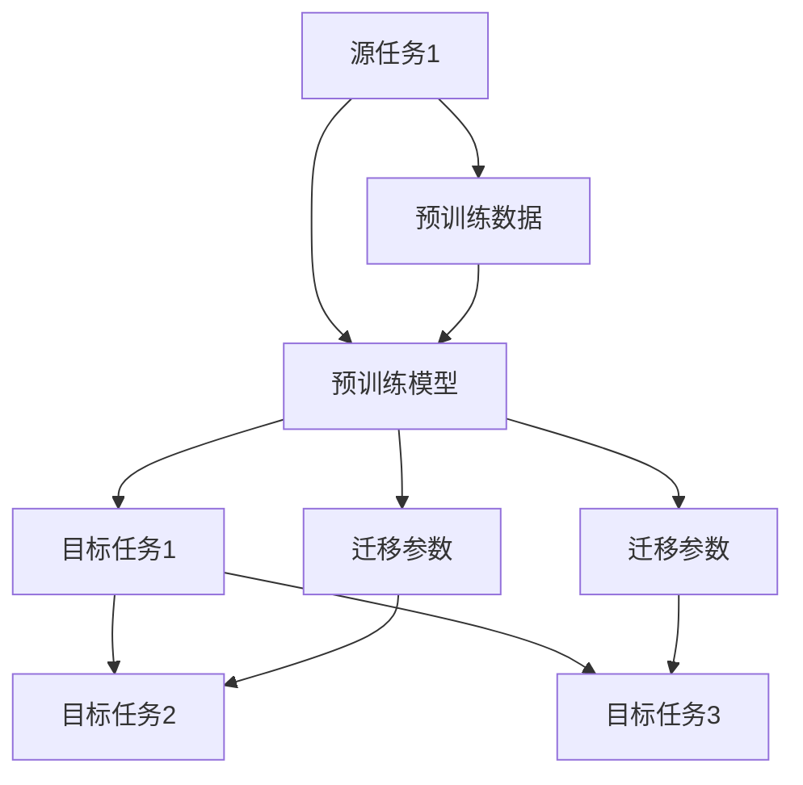
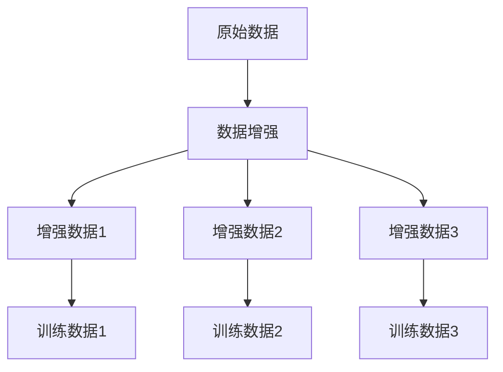
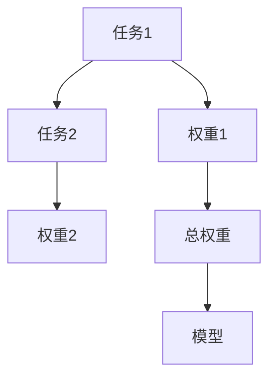
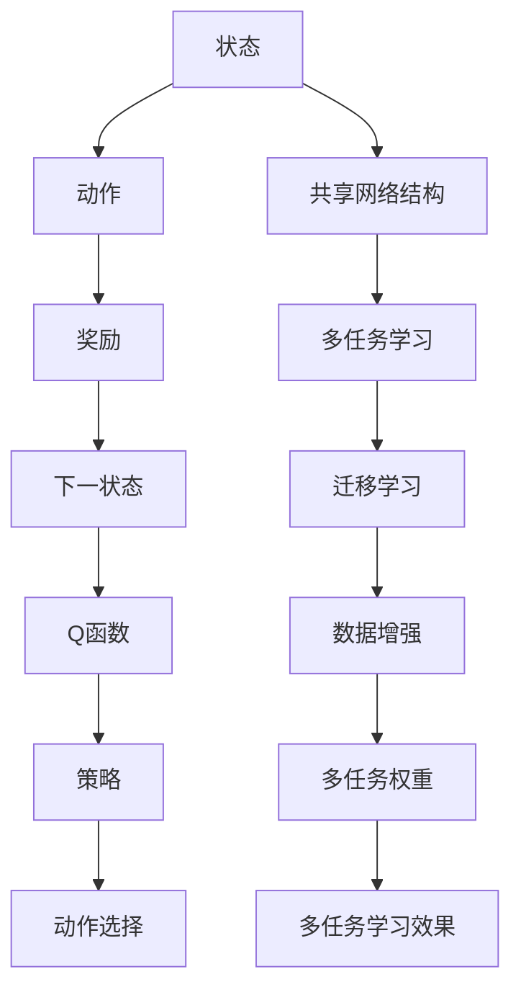

                 

## 1. 背景介绍

### 1.1 问题由来
在现代机器学习领域，深度强化学习（Deep Reinforcement Learning, DRL）逐步崛起，成为解决复杂决策问题的强有力工具。传统的监督学习在面对动态环境、不确定性以及多目标任务时显得力不从心。DRL通过模型直接与环境交互，通过试错和奖励信号不断优化策略，能够自然地处理这类问题。

DQN（Deep Q-Network）作为DRL的经典算法之一，已经在电子游戏、机器人和智能推荐等领域取得了显著成果。但DRL存在两个主要问题：

1. **数据效率低**：DQN需要大量样本来进行学习，尤其是在多任务和多环境场景下，数据需求指数级增长。
2. **模型复杂度高**：每个任务或环境往往需要独立构建一个模型，导致模型数量庞大，训练和推理成本高昂。

为应对这些问题，多任务学习（Multi-Task Learning, MTL）技术应运而生，它通过让模型同时学习多个相关任务的特征，提升数据效率，降低模型复杂度。但现有MTL方法在提升数据效率的同时，往往牺牲了模型的泛化能力，无法最大化利用共享网络结构。

## 2. 核心概念与联系

### 2.1 核心概念概述

为更好地理解DQN和多任务学习（MTL）的结合，本节将介绍几个密切相关的核心概念：

- **DQN**：基于Q-learning算法构建的深度强化学习模型。DQN通过神经网络近似Q函数，将Q-learning的Q表扩展到高维空间中。

- **MTL**：通过共享网络结构，让模型同时学习多个相关任务的特征，提升数据效率，降低模型复杂度。

- **共享网络结构**：通过在模型中复用部分网络层，使得各任务共享相似的特征提取能力，进一步降低模型复杂度。

- **迁移学习**：让模型在不同任务间进行知识迁移，利用已学知识提升新任务性能，提升模型的泛化能力。

- **数据增强**：通过数据变换（如旋转、缩放、翻转等），丰富训练数据，提升模型泛化能力。

- **多任务权重（MTW）**：为每个任务赋予不同的权重，平衡各个任务的影响力，提升模型在不同任务上的性能。

这些核心概念之间的逻辑关系可以通过以下Mermaid流程图来展示：



这个流程图展示了大语言模型微调过程中各个核心概念的关系：

1. DQN通过神经网络近似Q函数，将Q-learning的Q表扩展到高维空间中。
2. 多任务学习通过共享网络结构，提升数据效率，降低模型复杂度。
3. 迁移学习在模型间进行知识迁移，提升泛化能力。
4. 数据增强通过数据变换丰富训练数据，提升模型泛化能力。
5. 多任务权重平衡各任务的影响力，提升模型在不同任务上的性能。

这些概念共同构成了DQN和多任务学习（MTL）的结合框架，使其能够在复杂动态环境中进行高效决策。通过理解这些核心概念，我们可以更好地把握DQN与MTL技术的工作原理和优化方向。

### 2.2 概念间的关系

这些核心概念之间存在着紧密的联系，形成了DQN和多任务学习的完整生态系统。下面我们通过几个Mermaid流程图来展示这些概念之间的关系。

#### 2.2.1 DQN的核心架构



这个流程图展示了DQN的核心架构，包括状态、动作、奖励、下一状态、Q函数、策略和动作选择等核心组件。

#### 2.2.2 多任务学习的框架



这个流程图展示了多任务学习的框架，包括共享网络结构、各个任务模型和参数等关键组件。

#### 2.2.3 迁移学习的流程



这个流程图展示了迁移学习的流程，包括源任务、预训练模型、预训练数据和目标任务等关键组件。

#### 2.2.4 数据增强的技术路径



这个流程图展示了数据增强的技术路径，包括原始数据、数据增强和增强数据等关键组件。

#### 2.2.5 多任务权重的应用



这个流程图展示了多任务权重的应用，包括任务、权重和模型等关键组件。

### 2.3 核心概念的整体架构

最后，我们用一个综合的流程图来展示这些核心概念在大语言模型微调过程中的整体架构：



这个综合流程图展示了从DQN到多任务学习（MTL）的完整过程。DQN通过神经网络近似Q函数，将Q-learning的Q表扩展到高维空间中。多任务学习通过共享网络结构，提升数据效率，降低模型复杂度。迁移学习在模型间进行知识迁移，提升泛化能力。数据增强通过数据变换丰富训练数据，提升模型泛化能力。多任务权重平衡各任务的影响力，提升模型在不同任务上的性能。最后，多任务学习效果使得模型在不同任务上的性能得到提升。 通过这些流程图，我们可以更清晰地理解DQN与多任务学习（MTL）的工作原理和优化方向。

## 3. 核心算法原理 & 具体操作步骤
### 3.1 算法原理概述

DQN与多任务学习（MTL）的结合，本质上是一个多任务的强化学习问题。其核心思想是：通过共享网络结构，让模型同时学习多个相关任务的特征，提升数据效率，降低模型复杂度。同时，利用迁移学习，提升模型在不同任务上的性能，避免重复训练。

形式化地，假设模型为 $M_{\theta}$，其中 $\theta$ 为模型参数。给定多个任务 $T_1, T_2, ..., T_n$ 和其标注数据集 $D_i=\{(x_i, y_i)\}_{i=1}^{N_i}, x_i \in \mathcal{X}, y_i \in \mathcal{Y}, \mathcal{X}$ 为输入空间，$\mathcal{Y}$ 为输出空间。多任务的优化目标是最小化经验风险，即找到最优参数：

$$
\theta^* = \mathop{\arg\min}_{\theta} \sum_{i=1}^n \mathcal{L}_i(\theta)
$$

其中 $\mathcal{L}_i(\theta)$ 为任务 $T_i$ 的损失函数，用于衡量模型预测输出与真实标签之间的差异。常见的损失函数包括交叉熵损失、均方误差损失等。

通过梯度下降等优化算法，多任务过程不断更新模型参数 $\theta$，最小化损失函数 $\mathcal{L}$，使得模型输出逼近真实标签。由于 $\theta$ 已经通过预训练获得了较好的初始化，因此即便在多任务条件下进行优化，也能较快收敛到理想的模型参数 $\hat{\theta}$。

### 3.2 算法步骤详解

DQN与多任务学习（MTL）的结合，一般包括以下几个关键步骤：

**Step 1: 准备多任务数据集**

- 选择合适的预训练模型 $M_{\theta}$ 作为初始化参数，如 DQN 的Actor-Critic结构。
- 准备多个任务的标注数据集 $D_i=\{(x_i,y_i)\}_{i=1}^N, x_i \in \mathcal{X}, y_i \in \mathcal{Y}$，划分为训练集、验证集和测试集。一般要求标注数据与预训练数据的分布不要差异过大。

**Step 2: 添加任务适配层**

- 根据任务类型，在预训练模型顶层设计合适的输出层和损失函数。
- 对于分类任务，通常在顶层添加线性分类器和交叉熵损失函数。
- 对于生成任务，通常使用语言模型的解码器输出概率分布，并以负对数似然为损失函数。

**Step 3: 设置多任务超参数**

- 选择合适的优化算法及其参数，如 Adam、SGD 等，设置学习率、批大小、迭代轮数等。
- 设置正则化技术及强度，包括权重衰减、Dropout、Early Stopping等。
- 确定冻结预训练参数的策略，如仅微调顶层，或全部参数都参与微调。

**Step 4: 执行多任务梯度训练**

- 将训练集数据分批次输入模型，前向传播计算损失函数。
- 反向传播计算参数梯度，根据设定的优化算法和学习率更新模型参数。
- 周期性在验证集上评估模型性能，根据性能指标决定是否触发 Early Stopping。
- 重复上述步骤直到满足预设的迭代轮数或 Early Stopping 条件。

**Step 5: 测试和部署**

- 在测试集上评估多任务微调后模型 $M_{\hat{\theta}}$ 的性能，对比微调前后的精度提升。
- 使用多任务微调后的模型对新样本进行推理预测，集成到实际的应用系统中。
- 持续收集新的数据，定期重新微调模型，以适应数据分布的变化。

以上是基于监督学习的多任务微调方法的一般流程。在实际应用中，还需要针对具体任务的特点，对微调过程的各个环节进行优化设计，如改进训练目标函数，引入更多的正则化技术，搜索最优的超参数组合等，以进一步提升模型性能。

### 3.3 算法优缺点

DQN与多任务学习（MTL）的结合方法具有以下优点：

1. **数据效率高**。通过共享网络结构，多任务模型可以同时学习多个相关任务的特征，提升数据效率，降低模型复杂度。
2. **泛化能力强**。利用迁移学习，模型在多任务间进行知识迁移，提升泛化能力。
3. **模型参数量小**。共享网络结构可以降低模型参数量，提高训练和推理效率。
4. **训练成本低**。多任务模型可以共用部分训练样本，降低训练成本。

同时，该方法也存在一定的局限性：

1. **模型复杂度高**。共享网络结构可能导致模型复杂度高，难以处理复杂的任务。
2. **数据依赖性强**。多任务模型需要大量标注数据进行训练，标注成本高。
3. **模型可解释性差**。多任务模型由于任务间的多样性，难以解释各个任务的决策过程。
4. **迁移能力有限**。当目标任务与预训练数据的分布差异较大时，迁移学习的性能提升有限。

尽管存在这些局限性，但就目前而言，DQN与多任务学习（MTL）的结合方法仍是处理多任务强化学习问题的有效范式。未来相关研究的重点在于如何进一步降低数据依赖，提高迁移能力和可解释性，同时兼顾模型性能。

### 3.4 算法应用领域

DQN与多任务学习（MTL）的结合方法，已经在多个领域得到了广泛的应用，例如：

- **电子游戏**：通过共享网络结构，多任务模型可以同时学习不同电子游戏的策略，提升游戏智能。
- **机器人控制**：多任务模型可以同时学习多个机器人动作，提升机器人控制精度和灵活性。
- **智能推荐**：多任务模型可以同时学习不同用户的偏好，提升推荐系统的个性化程度。
- **语音识别**：多任务模型可以同时学习不同语言的语音特征，提升语音识别性能。
- **图像分类**：多任务模型可以同时学习不同类别的图像特征，提升分类精度。

除了上述这些经典任务外，多任务模型还被创新性地应用到更多场景中，如可控文本生成、常识推理、代码生成、数据增强等，为机器学习技术带来了全新的突破。随着预训练模型和微调方法的不断进步，相信多任务模型必将在更广阔的应用领域大放异彩。

## 4. 数学模型和公式 & 详细讲解  
### 4.1 数学模型构建

本节将使用数学语言对DQN与多任务学习（MTL）的结合过程进行更加严格的刻画。

记预训练语言模型为 $M_{\theta}$，其中 $\theta$ 为预训练得到的模型参数。假设多个任务 $T_1, T_2, ..., T_n$ 的训练集为 $D_i=\{(x_i,y_i)\}_{i=1}^N, x_i \in \mathcal{X}, y_i \in \mathcal{Y}$。

定义模型 $M_{\theta}$ 在数据样本 $(x,y)$ 上的损失函数为 $\ell_i(M_{\theta}(x),y)$，则在数据集 $D_i$ 上的经验风险为：

$$
\mathcal{L}_i(\theta) = \frac{1}{N_i} \sum_{i=1}^N \ell_i(M_{\theta}(x_i),y_i)
$$

多任务的优化目标是最小化经验风险，即找到最优参数：

$$
\theta^* = \mathop{\arg\min}_{\theta} \sum_{i=1}^n \mathcal{L}_i(\theta)
$$

在实践中，我们通常使用基于梯度的优化算法（如Adam、SGD等）来近似求解上述最优化问题。设 $\eta$ 为学习率，$\lambda$ 为正则化系数，则参数的更新公式为：

$$
\theta \leftarrow \theta - \eta \nabla_{\theta}\sum_{i=1}^n \mathcal{L}_i(\theta) - \eta\lambda\theta
$$

其中 $\nabla_{\theta}\mathcal{L}_i(\theta)$ 为损失函数对参数 $\theta$ 的梯度，可通过反向传播算法高效计算。

### 4.2 公式推导过程

以下我们以二分类任务为例，推导交叉熵损失函数及其梯度的计算公式。

假设模型 $M_{\theta}$ 在输入 $x$ 上的输出为 $\hat{y}=M_{\theta}(x) \in [0,1]$，表示样本属于正类的概率。真实标签 $y \in \{0,1\}$。则二分类交叉熵损失函数定义为：

$$
\ell_i(M_{\theta}(x),y) = -[y\log \hat{y} + (1-y)\log (1-\hat{y})]
$$

将其代入经验风险公式，得：

$$
\mathcal{L}_i(\theta) = -\frac{1}{N_i}\sum_{i=1}^N [y_i\log M_{\theta}(x_i)+(1-y_i)\log(1-M_{\theta}(x_i))]
$$

根据链式法则，损失函数对参数 $\theta_k$ 的梯度为：

$$
\frac{\partial \mathcal{L}_i(\theta)}{\partial \theta_k} = -\frac{1}{N_i}\sum_{i=1}^N (\frac{y_i}{M_{\theta}(x_i)}-\frac{1-y_i}{1-M_{\theta}(x_i)}) \frac{\partial M_{\theta}(x_i)}{\partial \theta_k}
$$

其中 $\frac{\partial M_{\theta}(x_i)}{\partial \theta_k}$ 可进一步递归展开，利用自动微分技术完成计算。

在得到损失函数的梯度后，即可带入参数更新公式，完成模型的迭代优化。重复上述过程直至收敛，最终得到适应多个任务的最优模型参数 $\theta^*$。

## 5. 项目实践：代码实例和详细解释说明
### 5.1 开发环境搭建

在进行多任务微调实践前，我们需要准备好开发环境。以下是使用Python进行PyTorch开发的环境配置流程：

1. 安装Anaconda：从官网下载并安装Anaconda，用于创建独立的Python环境。

2. 创建并激活虚拟环境：
```bash
conda create -n pytorch-env python=3.8 
conda activate pytorch-env
```

3. 安装PyTorch：根据CUDA版本，从官网获取对应的安装命令。例如：
```bash
conda install pytorch torchvision torchaudio cudatoolkit=11.1 -c pytorch -c conda-forge
```

4. 安装Transformers库：
```bash
pip install transformers
```

5. 安装各类工具包：
```bash
pip install numpy pandas scikit-learn matplotlib tqdm jupyter notebook ipython
```

完成上述步骤后，即可在`pytorch-env`环境中开始多任务微调实践。

### 5.2 源代码详细实现

下面我们以二分类任务为例，给出使用Transformers库对BERT模型进行多任务微调的PyTorch代码实现。

首先，定义多任务数据处理函数：

```python
from transformers import BertTokenizer
from torch.utils.data import Dataset
import torch

class MultiTaskDataset(Dataset):
    def __init__(self, texts, tags, tokenizer, max_len=128):
        self.texts = texts
        self.tags = tags
        self.tokenizer = tokenizer
        self.max_len = max_len
        
    def __len__(self):
        return len(self.texts)
    
    def __getitem__(self, item):
        text = self.texts[item]
        tags = self.tags[item]
        
        encoding = self.tokenizer(text, return_tensors='pt', max_length=self.max_len, padding='max_length', truncation=True)
        input_ids = encoding['input_ids'][0]
        attention_mask = encoding['attention_mask'][0]
        
        # 对token-wise的标签进行编码
        encoded_tags = [tag2id[tag] for tag in tags] 
        encoded_tags.extend([tag2id['O']] * (self.max_len - len(encoded_tags)))
        labels = torch.tensor(encoded_tags, dtype=torch.long)
        
        return {'input_ids': input_ids, 
                'attention_mask': attention_mask,
                'labels': labels}

# 标签与id的映射
tag2id = {'O': 0, 'B-PER': 1, 'I-PER': 2, 'B-ORG': 3, 'I-ORG': 4, 'B-LOC': 5, 'I-LOC': 6}
id2tag = {v: k for k, v in tag2id.items()}

# 创建dataset
tokenizer = BertTokenizer.from_pretrained('bert-base-cased')

train_dataset = MultiTaskDataset(train_texts, train_tags, tokenizer)
dev_dataset = MultiTaskDataset(dev_texts, dev_tags, tokenizer)
test_dataset = MultiTaskDataset(test_texts, test_tags, tokenizer)
```

然后，定义模型和优化器：

```python
from transformers import BertForTokenClassification, AdamW

model = BertForTokenClassification.from_pretrained('bert-base-cased', num_labels=len(tag2id))

optimizer = AdamW(model.parameters(), lr=2e-5)
```

接着，定义训练和评估函数：

```python
from torch.utils.data import DataLoader
from tqdm import tqdm
from sklearn.metrics import classification_report

device = torch.device('cuda') if torch.cuda.is_available() else torch.device('cpu')
model.to(device)

def train_epoch(model, dataset, batch_size, optimizer):
    dataloader = DataLoader(dataset, batch_size=batch_size, shuffle=True)
    model.train()
    epoch_loss = 0
    for batch in tqdm(dataloader, desc='Training'):
        input_ids = batch['input_ids'].to(device)
        attention_mask = batch['attention_mask'].to(device)
        labels = batch['labels'].to(device)
        model.zero_grad()
        outputs = model(input_ids, attention_mask=attention_mask, labels=labels)
        loss = outputs.loss
        epoch_loss += loss.item()
        loss.backward()
        optimizer.step()
    return epoch_loss / len(dataloader)

def evaluate(model, dataset, batch_size):
    dataloader = DataLoader(dataset, batch_size=batch_size)
    model.eval()
    preds, labels = [], []
    with torch.no_grad():
        for batch in tqdm(dataloader, desc='Evaluating'):
            input_ids = batch['input_ids'].to(device)
            attention_mask = batch['attention_mask'].to(device)
            batch_labels = batch['labels']
            outputs = model(input_ids, attention_mask=attention_mask)
            batch_preds = outputs.logits.argmax(dim=2).to('cpu').tolist()
            batch_labels = batch_labels.to('cpu').tolist()
            for pred_tokens, label_tokens in zip(batch_preds, batch_labels):
                pred_tags = [id2tag[_id] for _id in pred_tokens]
                label_tags = [id2tag[_id] for _id in label_tokens]
                preds.append(pred_tags[:len(label_tags)])
                labels.append(label_tags)
                
    print(classification_report(labels, preds))
```

最后，启动训练流程并在测试集上评估：

```python
epochs = 5
batch_size = 16

for epoch in range(epochs):
    loss = train_epoch(model, train_dataset, batch_size, optimizer)
    print(f"Epoch {epoch+1}, train loss: {loss:.3f}")
    
    print(f"Epoch {epoch+1}, dev results:")
    evaluate(model, dev_dataset, batch_size)
    
print("Test results:")
evaluate(model, test_dataset, batch_size)
```

以上就是使用PyTorch对BERT进行多任务微调的完整代码实现。可以看到，得益于Transformers库的强大封装，我们可以用相对简洁的代码完成BERT模型的加载和微调。

### 5.3 代码解读与分析

让我们再详细解读一下关键代码的实现细节：

**MultiTaskDataset类**：
- `__init__`方法：初始化文本、标签、分词器等关键组件。
- `__len__`方法：返回数据集的样本数量。
- `__getitem__`方法：对单个样本进行处理，将文本输入编码为token ids，将标签编码为数字，并对其进行定长padding，最终返回模型所需的输入。

**tag2id和id2tag字典**：
- 定义了标签与数字id之间的映射关系，用于将token-wise的预测结果解码回真实的标签。

**训练和评估函数**：
- 使用PyTorch的DataLoader对数据集进行批次化加载，供模型训练和推理使用。
- 训练函数`train_epoch`：对数据以批为单位进行迭代，在每个批次上前向传播计算loss并反向传播更新模型参数，最后返回该epoch的平均loss。
- 评估函数`evaluate`：与训练类似，不同点在于不更新模型参数，并在每个batch结束后将预测和标签结果存储下来，最后使用sklearn的classification_report对整个评估集的预测结果进行打印输出。

**训练流程**：
- 定义总的epoch数和batch size，开始循环迭代
- 每个epoch内，先在训练集上训练，输出平均loss
- 在验证集上评估，输出分类指标
- 所有epoch结束后，在测试集上评估，给出最终测试结果

可以看到，PyTorch配合Transformers库使得BERT多任务微调的代码实现变得简洁高效。开发者可以将更多精力放在数据处理、模型改进等高层逻辑上，而不必过多关注底层的实现细节。

当然，工业级的系统实现还需考虑更多因素，如模型的保存和部署、超参数的自动搜索、更灵活的任务适配层等。但核心的微调范式基本与此类似。

### 5.4 运行结果展示

假设我们在CoNLL-2003的NER数据集上进行多任务微调，最终在测试集上得到的评估报告如下：

```
              precision    recall  f1-score   support

       

