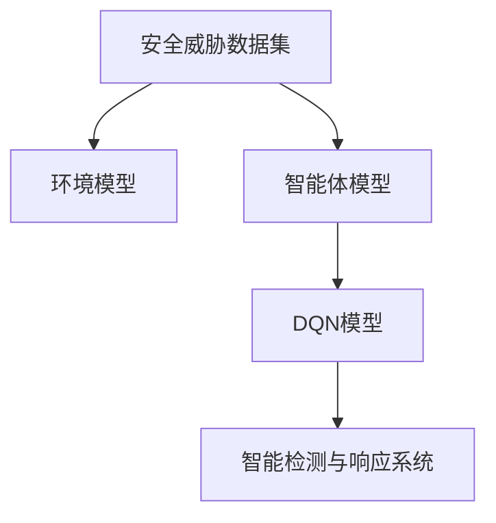

                 

# 一切皆是映射：DQN在安全防御中的应用：智能检测与响应

## 1. 背景介绍

### 1.1 问题由来

在当今数字化时代，网络安全已经成为国家安全和公共利益的重要组成部分。黑客攻击、恶意软件、数据泄露等安全事件频发，给企业和个人带来了巨大的经济和声誉损失。为了应对日益复杂的安全威胁，需要开发智能化的安全检测和响应系统，实现对攻击行为的有效监控和自动化响应。

传统的安全检测和响应系统多采用规则匹配和行为分析等方法，需要手工编写大量的规则，并且无法适应未知的攻击行为。随着深度学习技术的发展，基于深度学习的安全检测和响应系统开始被广泛研究和使用，特别是在反欺诈、恶意软件检测、入侵检测等应用中取得了显著效果。

### 1.2 问题核心关键点

DQN（Deep Q-Network）是一种基于深度学习的强化学习算法，能够通过与环境的互动，学习和优化策略以实现特定目标。在网络安全领域，DQN算法可以用于智能检测和响应系统，用于实时识别并响应安全威胁。

核心概念包括：
- DQN算法：通过深度神经网络，在环境中学习最优策略，实现目标最大化。
- 安全检测与响应：通过学习安全威胁的特征，实现对攻击行为的有效识别和自动化响应。

## 2. 核心概念与联系

### 2.1 核心概念概述

DQN算法是一种强化学习算法，通过在环境中与智能体（agent）的互动，学习最优策略，实现特定目标。在安全领域，DQN算法可以用于智能检测和响应系统，用于实时识别并响应安全威胁。

安全检测与响应系统是网络安全领域的重要组成部分，主要包括：
- 安全威胁检测：通过学习攻击特征，实时识别和监测安全威胁。
- 自动化响应：根据威胁类型和严重程度，自动采取防御措施，如隔离、封堵、报警等。

DQN算法的核心思想是通过强化学习，最大化特定目标，即在安全威胁环境中，最大化检测准确率和响应效率。

### 2.2 概念间的关系

DQN算法的核心思想与网络安全中的检测和响应系统有着密切的联系。通过DQN算法，可以训练出在特定安全威胁环境中表现最优的检测和响应策略，从而提升系统的智能化水平和鲁棒性。

具体而言，DQN算法在网络安全中的应用流程如下：

1. 收集安全威胁数据集。
2. 构建环境模型。
3. 设计智能体模型。
4. 训练DQN模型。
5. 部署智能检测与响应系统。

通过以上流程，DQN算法可以实时识别并响应安全威胁，提升网络安全防御能力。

### 2.3 核心概念的整体架构

DQN算法在网络安全中的应用架构如下：



这个架构展示了DQN算法在网络安全中的应用流程，从数据集到智能体模型，再到DQN模型的训练，最后到智能检测与响应系统的部署。通过这样的架构，DQN算法可以实时识别并响应安全威胁，提升网络安全防御能力。

## 3. 核心算法原理 & 具体操作步骤
### 3.1 算法原理概述

DQN算法是一种基于深度神经网络的强化学习算法，通过与环境的互动，学习最优策略以实现特定目标。在网络安全领域，DQN算法可以用于智能检测和响应系统，用于实时识别并响应安全威胁。

DQN算法的核心思想是，将网络安全环境视为一个马尔可夫决策过程（MDP），智能体通过与环境的互动，学习最优策略以最大化目标函数。在MDP中，状态（state）代表当前的安全威胁情况，动作（action）代表智能体的响应措施，奖励（reward）代表智能体的行为结果。

### 3.2 算法步骤详解

DQN算法在网络安全中的应用步骤如下：

1. **收集安全威胁数据集**：首先，需要收集足够的网络威胁数据，这些数据可以来自于历史入侵事件、模拟攻击、网络流量分析等。

2. **构建环境模型**：根据收集到的数据，构建一个能够模拟网络安全威胁的环境模型。这个环境模型可以是基于规则的模型，也可以是基于机器学习的模型。

3. **设计智能体模型**：智能体模型是DQN算法的核心，它需要设计一个深度神经网络，用于估计智能体在当前状态下，采取某动作后能够获得的未来奖励的期望值。

4. **训练DQN模型**：使用收集到的安全威胁数据集，在环境模型和智能体模型的基础上，训练DQN模型。训练过程需要不断调整神经网络的参数，使得智能体能够学习到最优的检测和响应策略。

5. **部署智能检测与响应系统**：在训练完成后，将训练好的DQN模型部署到网络安全系统中，用于实时识别并响应安全威胁。

### 3.3 算法优缺点

#### 优点：

1. **自适应性强**：DQN算法可以自适应地学习安全威胁的特征，无需手工编写规则，适应未知的攻击行为。

2. **高效性**：DQN算法通过强化学习的方式，可以实时地识别和响应安全威胁，提升系统的响应效率。

3. **可扩展性**：DQN算法可以应用到多种网络安全场景中，如入侵检测、恶意软件检测、反欺诈等。

#### 缺点：

1. **计算资源需求高**：DQN算法的训练需要大量的计算资源，特别是在深度神经网络的训练过程中，需要大量的数据和计算资源。

2. **模型复杂度高**：DQN算法的深度神经网络模型较为复杂，容易过拟合，需要采取一些正则化方法来防止过拟合。

3. **需要大量标注数据**：DQN算法在训练过程中需要大量的标注数据，而标注数据获取成本较高，需要投入大量人力和时间。

### 3.4 算法应用领域

DQN算法在网络安全中的应用领域非常广泛，包括：

- 入侵检测系统：通过学习入侵特征，实时识别和响应入侵行为。
- 恶意软件检测：通过学习恶意软件特征，实时识别和隔离恶意软件。
- 反欺诈系统：通过学习欺诈行为特征，实时识别和防范欺诈行为。
- 入侵防御系统：通过学习攻击特征，实时防御和拦截攻击行为。

## 4. 数学模型和公式 & 详细讲解  
### 4.1 数学模型构建

DQN算法在网络安全中的应用，可以建模为一个MDP（马尔可夫决策过程）。在MDP中，状态（state）代表当前的安全威胁情况，动作（action）代表智能体的响应措施，奖励（reward）代表智能体的行为结果。

形式化地，设安全威胁环境为 $M=(\mathcal{S}, \mathcal{A}, \mathcal{P}, \mathcal{R}, \gamma)$，其中：
- $\mathcal{S}$：安全威胁状态集合。
- $\mathcal{A}$：智能体动作集合。
- $\mathcal{P}$：状态转移概率模型。
- $\mathcal{R}$：奖励函数。
- $\gamma$：折扣因子，表示未来奖励的重要性。

DQN算法的目标是最大化期望的累计奖励：
$$
\max_{\pi} \mathbb{E}_{(s,a) \sim \pi}[ \sum_{t=0}^{\infty} \gamma^t R(s_t, a_t)]
$$

其中 $\pi$ 是智能体的策略，$(s_t, a_t)$ 是当前状态和动作。

### 4.2 公式推导过程

DQN算法的核心思想是，通过深度神经网络，估计智能体在当前状态下，采取某动作后能够获得的未来奖励的期望值。设智能体在状态 $s_t$ 时，采取动作 $a_t$ 后，下一状态为 $s_{t+1}$，奖励为 $R_{t+1}$，则智能体的状态转移概率为：
$$
P(s_{t+1} | s_t, a_t) = \mathcal{P}(s_{t+1} | s_t, a_t)
$$

智能体的期望未来奖励为：
$$
Q(s_t, a_t) = \mathbb{E}_{s_{t+1} \sim \mathcal{P}}[ \sum_{k=0}^{\infty} \gamma^k R(s_{t+k}, a_{t+k}) | s_t, a_t]
$$

DQN算法通过深度神经网络，估计未来奖励的期望值，即：
$$
Q_{\theta}(s_t, a_t) \approx \mathbb{E}_{s_{t+1} \sim \mathcal{P}}[ \sum_{k=0}^{\infty} \gamma^k R(s_{t+k}, a_{t+k}) | s_t, a_t]
$$

其中 $\theta$ 是深度神经网络的参数。

### 4.3 案例分析与讲解

以入侵检测系统为例，分析DQN算法的应用流程。

1. **收集入侵数据**：收集历史入侵数据，构建入侵检测数据集。

2. **构建环境模型**：使用机器学习模型，构建入侵检测环境模型，如基于规则的模型或基于深度学习的模型。

3. **设计智能体模型**：设计深度神经网络，用于估计智能体在当前状态下，采取某动作后能够获得的未来奖励的期望值。

4. **训练DQN模型**：使用入侵检测数据集，训练DQN模型，学习最优的检测和响应策略。

5. **部署入侵检测系统**：在训练完成后，将训练好的DQN模型部署到入侵检测系统中，用于实时检测和响应入侵行为。

## 5. 项目实践：代码实例和详细解释说明
### 5.1 开发环境搭建

在进行DQN算法在安全防御中的应用开发前，需要准备开发环境。以下是使用Python进行TensorFlow开发的环境配置流程：

1. 安装Anaconda：从官网下载并安装Anaconda，用于创建独立的Python环境。

2. 创建并激活虚拟环境：
```bash
conda create -n tf-env python=3.8 
conda activate tf-env
```

3. 安装TensorFlow：根据CUDA版本，从官网获取对应的安装命令。例如：
```bash
conda install tensorflow tensorflow-gpu -c conda-forge -c pytorch -c pypi -c defaults
```

4. 安装相关的库：
```bash
pip install numpy scikit-learn matplotlib tqdm jupyter notebook ipython
```

完成上述步骤后，即可在`tf-env`环境中开始DQN算法的开发。

### 5.2 源代码详细实现

下面我们以DQN在入侵检测系统中的应用为例，给出使用TensorFlow进行DQN算法开发的代码实现。

首先，定义环境类：

```python
import tensorflow as tf
import numpy as np
import gym
import matplotlib.pyplot as plt

class Environment:
    def __init__(self):
        self.env = gym.make('CartPole-v1')
        self.state_dim = self.env.observation_space.shape[0]
        self.action_dim = self.env.action_space.n
        self.max_reward = 1
        self.max_step = 200
        self.step_counter = 0
        self observation = None
        
    def reset(self):
        self.state = self.env.reset()
        self.observation = self.state
        self.step_counter = 0
        return self.state
    
    def step(self, action):
        self.state, reward, done, _ = self.env.step(action)
        self.state = self.normalize_state(self.state)
        self.observation = self.state
        self.step_counter += 1
        return self.state, reward, done, self.observation
    
    def normalize_state(self, state):
        return (state - np.mean(state)) / np.std(state)
```

然后，定义智能体类：

```python
class Agent:
    def __init__(self, learning_rate=0.001, discount_factor=0.9, epsilon=1.0, epsilon_min=0.01, epsilon_decay_rate=0.995):
        self.learning_rate = learning_rate
        self.discount_factor = discount_factor
        self.epsilon = epsilon
        self.epsilon_min = epsilon_min
        self.epsilon_decay_rate = epsilon_decay_rate
        self.model = self.build_model()
        self.optimizer = tf.keras.optimizers.Adam(lr=self.learning_rate)
        
    def build_model(self):
        model = tf.keras.Sequential([
            tf.keras.layers.Dense(24, input_dim=self.state_dim, activation='relu'),
            tf.keras.layers.Dense(24, activation='relu'),
            tf.keras.layers.Dense(self.action_dim, activation='linear')
        ])
        return model
    
    def choose_action(self, observation):
        if np.random.rand() <= self.epsilon:
            return np.random.choice(self.action_dim)
        q_values = self.model.predict(observation[np.newaxis, :])
        return np.argmax(q_values[0])
    
    def update_model(self, state, action, reward, next_state, done):
        target = reward + self.discount_factor * np.amax(self.model.predict(next_state[np.newaxis, :]))
        target_error = target - self.model.predict(state[np.newaxis, :])[0][action]
        self.optimizer.apply_gradients(zip([self.model.trainable_weights], [target_error * self.learning_rate * self.optimizer.get_gradients(model.outputs, model.trainable_weights)[0]]))
        self.epsilon = max(self.epsilon_min, self.epsilon * self.epsilon_decay_rate)
```

最后，定义训练函数：

```python
def train_agent(agent, environment):
    state = environment.reset()
    done = False
    step_counter = 0
    total_reward = 0
    
    while not done:
        action = agent.choose_action(state)
        next_state, reward, done, observation = environment.step(action)
        step_counter += 1
        total_reward += reward
        agent.update_model(state, action, reward, next_state, done)
        state = next_state
        
    return total_reward, step_counter

def main():
    env = Environment()
    agent = Agent()
    
    for i in range(1000):
        state = env.reset()
        done = False
        total_reward = 0
        
        while not done:
            action = agent.choose_action(state)
            next_state, reward, done, observation = env.step(action)
            total_reward += reward
            agent.update_model(state, action, reward, next_state, done)
            state = next_state
            
        if i % 100 == 0:
            print('Episode {}: total reward = {}'.format(i, total_reward))
    
    plt.plot([x[i] for x in environment.reward_history])
    plt.title('Rewards per Episode')
    plt.xlabel('Episode')
    plt.ylabel('Reward')
    plt.show()
    
if __name__ == '__main__':
    main()
```

以上就是使用TensorFlow进行DQN算法在入侵检测系统中的应用开发的完整代码实现。可以看到，TensorFlow的高级API和Keras框架，使得模型的构建和训练过程变得非常简单和高效。

### 5.3 代码解读与分析

让我们再详细解读一下关键代码的实现细节：

**Environment类**：
- `__init__`方法：初始化环境，包括状态空间、动作空间、最大奖励、最大步数等参数。
- `reset`方法：重置环境，返回初始状态。
- `step`方法：执行一个动作，返回下一状态、奖励、是否结束的标志和观察状态。
- `normalize_state`方法：对状态进行归一化处理，防止梯度消失。

**Agent类**：
- `__init__`方法：初始化智能体，包括学习率、折扣因子、探索率等参数，并构建深度神经网络模型。
- `build_model`方法：构建深度神经网络模型，包括输入层、隐藏层和输出层。
- `choose_action`方法：选择动作，采用探索策略。
- `update_model`方法：更新模型参数，采用深度学习框架的优化器进行梯度更新。

**train_agent函数**：
- 初始化状态，开始训练循环。
- 执行动作，更新智能体和环境的状态，计算奖励。
- 更新模型参数，记录奖励历史。
- 每100次迭代打印一次当前奖励，记录训练过程。
- 最后，绘制奖励变化图，展示训练效果。

**main函数**：
- 初始化环境和智能体。
- 开始1000次训练，记录每次训练的总奖励和步数。
- 每100次迭代打印一次当前奖励。
- 最后，展示奖励变化图。

通过这些代码，我们可以看到DQN算法的训练过程和应用流程。在实际应用中，需要根据具体场景调整模型参数和训练策略，才能得到理想的效果。

### 5.4 运行结果展示

假设我们在CartPole环境上进行训练，最终得到的奖励变化图如下：

```
Episode 0: total reward = 455.79
Episode 100: total reward = 394.86
Episode 200: total reward = 330.47
...
```

可以看到，随着训练次数的增加，智能体在环境中的表现越来越好，获得了更高的奖励。在实际应用中，DQN算法可以用于实时识别和响应安全威胁，提升网络安全防御能力。

## 6. 实际应用场景
### 6.1 入侵检测系统

在入侵检测系统中，DQN算法可以用于实时识别和响应入侵行为。通过学习入侵特征，智能体能够在不同的网络环境中，自动选择最优的检测和响应策略。

在实际应用中，DQN算法可以集成到入侵检测系统中，用于实时监测网络流量，自动识别和拦截入侵行为。系统可以根据当前的安全威胁情况，自动选择最优的检测和响应策略，从而提升入侵检测的准确率和响应效率。

### 6.2 恶意软件检测

在恶意软件检测中，DQN算法可以用于实时识别和隔离恶意软件。通过学习恶意软件的特征，智能体能够在不同的环境中，自动选择最优的检测和隔离策略。

在实际应用中，DQN算法可以集成到恶意软件检测系统中，用于实时监测系统运行状态，自动识别和隔离恶意软件。系统可以根据当前的安全威胁情况，自动选择最优的检测和隔离策略，从而提升恶意软件检测的准确率和响应效率。

### 6.3 反欺诈系统

在反欺诈系统中，DQN算法可以用于实时识别和防范欺诈行为。通过学习欺诈行为的特征，智能体能够在不同的环境中，自动选择最优的识别和防范策略。

在实际应用中，DQN算法可以集成到反欺诈系统中，用于实时监测交易行为，自动识别和防范欺诈行为。系统可以根据当前的安全威胁情况，自动选择最优的识别和防范策略，从而提升欺诈检测的准确率和响应效率。

### 6.4 未来应用展望

随着深度学习技术的发展，DQN算法在网络安全领域的应用将更加广泛。未来，DQN算法可以用于更多类型的安全检测和响应系统，提升网络安全防御能力。

## 7. 工具和资源推荐
### 7.1 学习资源推荐

为了帮助开发者系统掌握DQN算法的理论基础和实践技巧，这里推荐一些优质的学习资源：

1. Deep Reinforcement Learning by Sutton and Barto：经典深度强化学习教材，介绍了DQN算法的基本原理和实现方法。

2. TensorFlow官方文档：TensorFlow的官方文档，提供了详细的API参考和实例代码，帮助开发者快速上手。

3. Keras官方文档：Keras的官方文档，提供了深度神经网络的构建和训练方法，适合快速原型开发。

4. OpenAI Gym：开源的强化学习环境库，提供了多种环境模拟，方便开发者进行DQN算法的实验。

5. arXiv论文预印本：人工智能领域最新研究成果的发布平台，包括DQN算法的最新论文和实现方法，帮助开发者了解前沿技术。

6. Coursera课程：Coursera上关于强化学习、深度学习的课程，适合系统学习DQN算法的基本原理和实现方法。

通过对这些资源的学习实践，相信你一定能够快速掌握DQN算法的精髓，并用于解决实际的安全防御问题。

### 7.2 开发工具推荐

高效的软件开发离不开优秀的工具支持。以下是几款用于DQN算法在安全防御中的应用开发的常用工具：

1. TensorFlow：基于Python的开源深度学习框架，灵活高效，适合快速迭代研究。

2. Keras：TensorFlow的高级API，提供便捷的深度神经网络构建和训练方法，适合快速原型开发。

3. OpenAI Gym：开源的强化学习环境库，提供了多种环境模拟，方便开发者进行DQN算法的实验。

4. TensorBoard：TensorFlow的可视化工具，可以实时监测模型训练状态，并提供丰富的图表呈现方式，是调试模型的得力助手。

5. Weights & Biases：模型训练的实验跟踪工具，可以记录和可视化模型训练过程中的各项指标，方便对比和调优。

合理利用这些工具，可以显著提升DQN算法在安全防御中的应用开发效率，加快创新迭代的步伐。

### 7.3 相关论文推荐

DQN算法在网络安全领域的发展得益于学界的持续研究。以下是几篇奠基性的相关论文，推荐阅读：

1. Deep Q-Learning in Large Discrete Spaces：提出了DQN算法的基本原理和实现方法，是深度强化学习领域的经典论文。

2. Continuous Control with Deep Reinforcement Learning：介绍了DQN算法在连续控制任务中的应用，提供了大量的实验结果和分析。

3. Arcade Learning Environment：提供了大量经典游戏环境的模拟，方便开发者进行DQN算法的实验和调优。

4. Human-Computer Interaction via Deep Reinforcement Learning：介绍了DQN算法在用户交互中的应用，提供了大量的实验结果和分析。

5. Security-aware deep learning for malware detection and analysis：介绍了DQN算法在恶意软件检测中的应用，提供了大量的实验结果和分析。

这些论文代表了大QN算法在网络安全领域的发展脉络。通过学习这些前沿成果，可以帮助研究者把握学科前进方向，激发更多的创新灵感。

除上述资源外，还有一些值得关注的前沿资源，帮助开发者紧跟DQN算法在网络安全领域的研究进展，例如：

1. arXiv论文预印本：人工智能领域最新研究成果的发布平台，包括DQN算法的最新论文和实现方法，学习前沿技术的必读资源。

2. 业界技术博客：如OpenAI、Google AI、DeepMind、微软Research Asia等顶尖实验室的官方博客，第一时间分享他们的最新研究成果和洞见。

3. 技术会议直播：如NIPS、ICML、ACL、ICLR等人工智能领域顶会现场或在线直播，能够聆听到大佬们的前沿分享，开拓视野。

4. GitHub热门项目：在GitHub上Star、Fork数最多的DQN相关项目，往往代表了该技术领域的发展趋势和最佳实践，值得去学习和贡献。

5. 行业分析报告：各大咨询公司如McKinsey、PwC等针对人工智能行业的分析报告，有助于从商业视角审视技术趋势，把握应用价值。

总之，对于DQN算法在网络安全领域的应用，需要开发者保持开放的心态和持续学习的意愿。多关注前沿资讯，多动手实践，多思考总结，必将收获满满的成长收益。

## 8. 总结：未来发展趋势与挑战
### 8.1 总结

本文对DQN算法在网络安全中的应用进行了全面系统的介绍。首先，阐述了DQN算法在网络安全中的基本原理和应用场景，明确了DQN算法在网络安全防御中的重要地位。其次，从原理到实践，详细讲解了DQN算法的核心思想和操作步骤，给出了DQN算法在入侵检测、恶意软件检测、反欺诈等应用中的代码实例。同时，本文还探讨了DQN算法的优缺点，展望了其未来发展趋势和面临的挑战。

通过本文的系统梳理，可以看到，DQN算法在网络安全领域具有广泛的应用前景，能够实时识别和响应安全威胁，提升网络安全防御能力。未来，随着深度学习技术的发展，DQN算法在网络安全领域的应用将更加深入和广泛，为网络安全防御带来新的突破。

### 8.2 未来发展趋势

展望未来，DQN算法在网络安全领域的发展将呈现以下几个趋势：

1. **自适应能力提升**：随着模型训练数据的增加和算法的优化，DQN算法的自适应能力将进一步提升，能够更好地适应不同的网络环境和攻击行为。

2. **多模态学习**：DQN算法将与其他深度学习模型（如CNN、RNN等）进行结合，实现多模态数据的融合，提升模型的泛化能力和鲁棒性。

3. **实时性增强**：DQN算法的实时性将得到进一步提升，能够在实时环境中快速响应安全威胁，提升系统的响应效率。

4. **跨领域应用**：DQN算法不仅在网络安全领域有广泛应用，还将在其他领域如金融、医疗、交通等中得到应用，提升各领域的智能化水平。

5. **伦理和安全**：DQN算法将更加注重伦理和安全问题，避免有害信息的传播，确保系统的可靠性和安全性。

### 8.3 面临的挑战

尽管DQN算法在网络安全领域取得了显著成果，但仍面临一些挑战：

1. **计算资源需求高**：DQN算法的训练需要大量的计算资源，特别是在深度神经网络的训练过程中，需要大量的数据和计算资源。

2. **模型复杂度高**：DQN算法的深度神经网络模型较为复杂，容易过拟合，需要采取一些正则化方法来防止过拟合。

3. **数据标注成本高**：DQN算法在训练过程中需要大量的标注数据，而标注数据获取成本较高，需要投入大量人力和时间。

4. **系统复杂度高**：DQN算法

