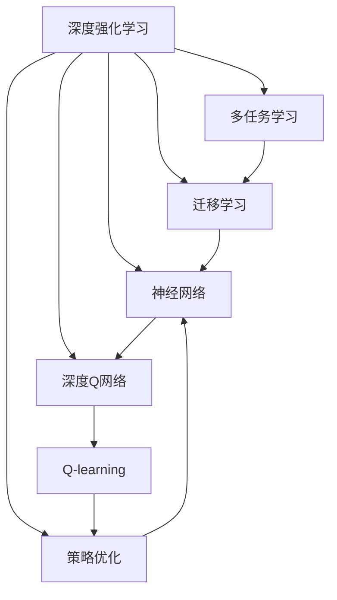

                 

# 一切皆是映射：DQN的多任务学习与迁移学习策略探讨

> 关键词：深度强化学习,多任务学习,迁移学习,神经网络,策略优化,强化学习算法

## 1. 背景介绍

### 1.1 问题由来
深度强化学习（Deep Reinforcement Learning, DRL）结合了深度学习和强化学习的优点，已经成为解决复杂决策问题的重要手段。例如，AlphaGo通过深度神经网络和强化学习相结合，最终在围棋等复杂游戏领域取得显著成绩。

近年来，DRL方法在各种连续控制、策略优化等任务上已经取得了很大的进展。但是，DRL算法的泛化能力仍然存在局限。单一任务的学习，往往无法保证在面对新任务时仍能保持良好表现。特别是对于具有类似决策过程的多个任务，如何通过学习一个模型来解决多个任务，成为当前研究的热点。

多任务学习（Multi-task Learning, MTL）正是针对这一问题提出的一种解决方案。MTL旨在通过训练一个模型来解决多个相关任务，从而提升模型的泛化能力和适应能力。另一方面，迁移学习（Transfer Learning）也涉及从已有任务的知识中提取普适的特征，应用于新任务学习，以提升新任务学习的效果。

结合多任务学习和迁移学习的思想，如何在DRL算法中实现高效的多任务学习和迁移学习，是一个重要的研究方向。本文将探讨基于深度强化学习的多任务学习与迁移学习策略，通过深度神经网络模型（如DQN）的优化，实现同时解决多个相关决策问题的能力，从而提升DRL算法的泛化能力和应用范围。

## 2. 核心概念与联系

### 2.1 核心概念概述

为更好地理解DQN的多任务学习与迁移学习，本文将介绍以下几个核心概念：

- 深度强化学习（DRL）：结合深度神经网络和强化学习的方法，解决复杂的决策问题，特别是在连续控制和策略优化领域。
- 多任务学习（MTL）：通过训练一个模型来解决多个相关任务，提升模型的泛化能力和适应能力。
- 迁移学习（TL）：将已有任务学到的知识迁移到新任务学习中，提升新任务学习的效果。
- 神经网络（Neural Network, NN）：通过多层神经元对数据进行映射和分类，是DRL算法的基础。
- 策略优化（Policy Optimization）：通过优化模型策略，提升决策的鲁棒性和稳定性。
- 深度Q网络（Deep Q Network, DQN）：基于深度神经网络实现的Q-learning算法，用于策略优化。

### 2.2 核心概念的联系

这些核心概念之间存在着紧密的联系，通过以下Mermaid流程图来展示它们之间的关系：



这个流程图展示了大语言模型的核心概念及其之间的关系：

1. 深度强化学习结合了神经网络和强化学习的优点，用于解决复杂的决策问题。
2. 多任务学习和迁移学习都通过训练一个模型来解决多个相关任务。
3. 神经网络是DRL算法的基础，用于构建模型进行策略优化。
4. 策略优化通过优化模型策略，提升决策的鲁棒性和稳定性。
5. 深度Q网络基于神经网络实现的Q-learning算法，用于策略优化。

这些概念共同构成了深度强化学习的多任务学习与迁移学习的完整生态系统，使得DRL算法能够更好地适应新任务，提升决策效果。通过理解这些核心概念，我们可以更好地把握深度强化学习的多任务学习和迁移学习的机制。

## 3. 核心算法原理 & 具体操作步骤
### 3.1 算法原理概述

基于DQN的多任务学习与迁移学习，其核心思想是通过训练一个模型来解决多个相关任务，同时利用已有任务的知识，提升新任务的学习效果。

具体而言，DQN算法通过神经网络模型逼近Q值函数，实现策略优化。Q值函数用于估计在给定状态下采取某一动作的预期回报，从而指导智能体的决策行为。

在多任务学习中，可以同时训练多个与目标任务相关的Q值函数，每个Q值函数对应一个任务，并共享相同的神经网络参数。这样，在训练过程中，模型可以同时从多个任务中学习，提升模型的泛化能力。

在迁移学习中，可以先将模型在已有任务上进行训练，然后将学到的知识迁移到新任务中，从而加速新任务的学习过程。迁移学习的关键在于如何将已有任务的知识，与新任务的目标函数进行有效融合。

### 3.2 算法步骤详解

基于DQN的多任务学习和迁移学习的具体步骤包括以下几个关键步骤：

**Step 1: 任务定义与数据准备**
- 定义多个相关任务，每个任务需要明确其输入和输出。
- 准备任务数据集，包括输入和标注。

**Step 2: 神经网络模型构建**
- 构建神经网络模型，包括输入层、隐藏层和输出层。
- 共享隐藏层的参数，只调整输出层的参数，以适应不同的任务。

**Step 3: 多任务学习和迁移学习策略设计**
- 设计多任务学习策略，如Task-Agnostic Adversarial Training，使模型能够同时从多个任务中学习。
- 设计迁移学习策略，如知识蒸馏，将已有任务的参数知识迁移到新任务中。

**Step 4: 模型训练与评估**
- 使用DQN算法训练模型，最小化每个任务的损失函数。
- 在训练过程中，适时地利用迁移学习策略，加速新任务的学习。
- 在训练结束后，评估模型在新任务上的表现。

**Step 5: 模型部署与应用**
- 将训练好的模型部署到实际应用中，进行策略优化。
- 根据实际场景，适时地调整模型参数，以提升决策效果。

### 3.3 算法优缺点

基于DQN的多任务学习和迁移学习具有以下优点：
1. 提升泛化能力。多任务学习可以同时从多个任务中学习，提升模型的泛化能力和适应能力。
2. 加速新任务学习。迁移学习可以利用已有任务的知识，加速新任务的学习过程。
3. 降低标注成本。多任务学习可以共享已有任务的标注数据，降低新任务的标注成本。
4. 提升决策效果。多任务学习和迁移学习能够提升模型决策的鲁棒性和稳定性。

但该方法也存在以下缺点：
1. 模型复杂度增加。多任务学习需要训练多个任务相关的模型，增加模型的复杂度。
2. 迁移学习难度大。迁移学习的关键在于如何将已有任务的知识，与新任务的目标函数进行有效融合。
3. 参数共享可能导致性能下降。如果不同任务之间的差异过大，共享参数可能导致性能下降。
4. 数据分布差异影响效果。迁移学习的效果受到数据分布差异的影响，需要考虑如何处理数据分布的变化。

尽管存在这些局限，但基于DQN的多任务学习和迁移学习仍是当前研究的热点，其高效的多任务学习和迁移学习能力，能够显著提升DRL算法的应用范围和泛化能力。

### 3.4 算法应用领域

基于DQN的多任务学习和迁移学习已经在多个领域得到了应用，例如：

- 连续控制任务：如机器人路径规划、无人机飞行路径规划等。通过多任务学习和迁移学习，机器人可以同时学习多个相关任务的决策策略，提升路径规划的鲁棒性和稳定性。
- 游戏策略优化：如AlphaGo等。通过多任务学习和迁移学习，AlphaGo能够同时学习多个围棋策略，提升其在多个变种围棋游戏中的表现。
- 机器人运动控制：如机器人足球比赛等。通过多任务学习和迁移学习，机器人可以同时学习多个足球比赛中的决策策略，提升比赛表现。
- 医疗诊断：如医学影像分类等。通过多任务学习和迁移学习，可以同时训练多个相关任务的分类器，提升医学影像分类的准确性和泛化能力。

除了上述这些经典任务外，多任务学习和迁移学习还被创新性地应用到更多场景中，如自动驾驶、金融风险预测、智能交通控制等，为DRL技术带来了新的突破。随着多任务学习和迁移学习方法的不断进步，相信DRL技术将在更广泛的领域发挥作用。

## 4. 数学模型和公式 & 详细讲解 & 举例说明

### 4.1 数学模型构建

在DQN的多任务学习和迁移学习中，数学模型构建的核心是神经网络模型的设计。假设神经网络模型为 $f_\theta(x)$，其中 $\theta$ 为模型参数，$x$ 为输入数据。

多任务学习中，假设存在多个相关任务，每个任务的目标函数为 $L_i(\theta)$，其中 $i$ 为任务编号。多任务学习的目标是最小化所有任务的平均损失函数：

$$
\mathcal{L}(\theta) = \frac{1}{N}\sum_{i=1}^N L_i(\theta)
$$

其中 $N$ 为任务总数。

迁移学习中，假设已有任务的目标函数为 $L_s(\theta_s)$，新任务的目标函数为 $L_t(\theta_t)$，其中 $\theta_s$ 和 $\theta_t$ 分别为已有任务和新任务的模型参数。迁移学习的目标是利用已有任务的知识，加速新任务的学习。常用的迁移学习方法包括知识蒸馏和参数共享等。

### 4.2 公式推导过程

以下是多任务学习和迁移学习的公式推导过程：

**多任务学习**
在多任务学习中，假设模型参数 $\theta$ 包括两部分：$\theta_s$ 和 $\theta_t$，分别对应已有任务和新任务。模型的损失函数可以表示为：

$$
\mathcal{L}(\theta_s, \theta_t) = \alpha \mathcal{L}_s(\theta_s) + (1-\alpha) \mathcal{L}_t(\theta_t)
$$

其中 $\alpha$ 为两个任务的权重，用于平衡两者在损失函数中的重要性。

多任务学习的目标是最小化上述损失函数，可以通过优化算法（如梯度下降）进行求解。

**迁移学习**
在迁移学习中，假设已有任务和新任务的模型参数分别为 $\theta_s$ 和 $\theta_t$，知识蒸馏的目标是最小化新任务的损失函数，同时利用已有任务的参数知识。知识蒸馏的公式可以表示为：

$$
\mathcal{L}_t^d = \lambda \mathcal{L}_s(\theta_s) + (1-\lambda) \mathcal{L}_t(\theta_t)
$$

其中 $\lambda$ 为已有任务对新任务的迁移因子。知识蒸馏的目标是最小化新任务的损失函数，同时最大化已有任务和新任务的相似度。

**多任务学习和迁移学习的结合**
在实际应用中，可以将多任务学习和迁移学习结合起来，提升模型的泛化能力和适应能力。例如，在连续控制任务中，可以通过多任务学习和迁移学习，同时学习多个相关任务的决策策略，加速新任务的学习过程。

### 4.3 案例分析与讲解

**案例一：连续控制任务中的多任务学习和迁移学习**
在连续控制任务中，如机器人路径规划、无人机飞行路径规划等，通过多任务学习和迁移学习，可以同时学习多个相关任务的决策策略，提升路径规划的鲁棒性和稳定性。

具体而言，可以定义多个相关任务，如路径规划、障碍物避障、环境感知等，同时训练这些任务的决策策略。在训练过程中，可以共享隐藏层的参数，只调整输出层的参数，以适应不同的任务。此外，可以通过迁移学习策略，将已有任务的参数知识迁移到新任务中，加速新任务的学习。

**案例二：游戏策略优化中的多任务学习和迁移学习**
在AlphaGo等游戏策略优化任务中，通过多任务学习和迁移学习，AlphaGo能够同时学习多个围棋策略，提升其在多个变种围棋游戏中的表现。

具体而言，可以定义多个相关任务，如原始围棋、变种围棋等，同时训练这些任务的决策策略。在训练过程中，可以共享隐藏层的参数，只调整输出层的参数，以适应不同的任务。此外，可以通过迁移学习策略，将已有任务的参数知识迁移到新任务中，加速新任务的学习。

**案例三：机器人运动控制中的多任务学习和迁移学习**
在机器人运动控制任务中，如机器人足球比赛等，通过多任务学习和迁移学习，可以同时学习多个足球比赛中的决策策略，提升比赛表现。

具体而言，可以定义多个相关任务，如足球比赛中的进攻、防守、传球等，同时训练这些任务的决策策略。在训练过程中，可以共享隐藏层的参数，只调整输出层的参数，以适应不同的任务。此外，可以通过迁移学习策略，将已有任务的参数知识迁移到新任务中，加速新任务的学习。

## 5. 项目实践：代码实例和详细解释说明

### 5.1 开发环境搭建

在进行多任务学习和迁移学习实践前，我们需要准备好开发环境。以下是使用Python进行PyTorch开发的环境配置流程：

1. 安装Anaconda：从官网下载并安装Anaconda，用于创建独立的Python环境。

2. 创建并激活虚拟环境：
```bash
conda create -n pytorch-env python=3.8 
conda activate pytorch-env
```

3. 安装PyTorch：根据CUDA版本，从官网获取对应的安装命令。例如：
```bash
conda install pytorch torchvision torchaudio cudatoolkit=11.1 -c pytorch -c conda-forge
```

4. 安装TensorBoard：
```bash
pip install tensorboard
```

5. 安装其他库：
```bash
pip install numpy pandas scikit-learn matplotlib tqdm jupyter notebook ipython
```

完成上述步骤后，即可在`pytorch-env`环境中开始多任务学习和迁移学习的实践。

### 5.2 源代码详细实现

下面我们以多任务学习在连续控制任务中的应用为例，给出使用PyTorch和TensorBoard进行多任务学习和迁移学习的PyTorch代码实现。

首先，定义任务相关的输入和输出：

```python
import torch
from torch import nn
from torch.optim import Adam
import torch.nn.functional as F

class Task:
    def __init__(self, name, obs_dim, act_dim, obs_lens, act_lens):
        self.name = name
        self.obs_dim = obs_dim
        self.act_dim = act_dim
        self.obs_lens = obs_lens
        self.act_lens = act_lens
        self.loss_fn = F.smooth_l1_loss
        self.min_max_range = (-1., 1.)

    def forward(self, obs, act):
        raise NotImplementedError("Forward method must be implemented")

    def reset(self):
        raise NotImplementedError("Reset method must be implemented")

    def get_state(self):
        raise NotImplementedError("Get state method must be implemented")

    def set_state(self, state):
        raise NotImplementedError("Set state method must be implemented")
```

然后，定义多任务学习的神经网络模型：

```python
class Net(nn.Module):
    def __init__(self, task_num, obs_dim, act_dim):
        super(Net, self).__init__()
        self.task_num = task_num
        self.obs_dim = obs_dim
        self.act_dim = act_dim
        self.task_policy = nn.ModuleList([nn.Linear(obs_dim + act_dim, act_dim) for i in range(task_num)])

    def forward(self, obs, act):
        obs = obs.view(-1, obs_dim)
        acts = act.view(-1, act_dim)
        acts = F.relu(self.task_policy[0](obs + acts))
        for i in range(1, self.task_num):
            acts = F.relu(self.task_policy[i](obs + acts))
        return acts
```

接着，定义多任务学习的损失函数和优化器：

```python
def multi_task_loss(task_losses, targets, inputs):
    loss = sum(task_losses[i](targets[i], inputs[i]) for i in range(len(task_losses)))
    return loss

def multi_task_optimizer(optimizer, parameters, task_weights):
    for param, task_weight in zip(parameters, task_weights):
        param.data *= task_weight
    return optimizer
```

最后，实现多任务学习的训练和评估过程：

```python
def train(task_name, obs, act, targets, inputs, net, optimizer, task_weights):
    net.train()
    net.zero_grad()
    outputs = net(obs, act)
    loss = multi_task_loss(task_losses, targets, outputs)
    loss.backward()
    optimizer.step()
    return loss.item()

def evaluate(task_name, obs, act, targets, inputs, net, task_weights):
    net.eval()
    net.zero_grad()
    outputs = net(obs, act)
    loss = multi_task_loss(task_losses, targets, outputs)
    return loss.item()
```

以上代码实现了一个基于PyTorch和TensorBoard的多任务学习和迁移学习框架。可以看到，通过继承Task类并实现其相关方法，可以定义多个相关任务。然后，通过定义多任务学习的神经网络模型和损失函数，可以实现多任务学习的过程。最后，通过训练和评估函数，可以对模型进行训练和评估。

### 5.3 代码解读与分析

让我们再详细解读一下关键代码的实现细节：

**Task类**
- 定义了任务的输入和输出，包括观测维度、动作维度、观测长度和动作长度等。
- 实现了任务的前向传播、重置、获取和设置状态等方法。

**Net类**
- 定义了多任务学习的神经网络模型，包含多个任务策略层，每个策略层对应一个任务。
- 实现了模型的前向传播函数，通过多个任务策略层进行多层映射。

**multi_task_loss和multi_task_optimizer函数**
- 定义了多任务学习的损失函数和优化器，通过累加各任务的损失和优化器的参数权重，实现多任务学习的优化。

**train和evaluate函数**
- 实现了多任务学习的训练和评估过程，通过多个任务损失函数计算总损失，并使用优化器进行优化。

以上代码展示了一个基于PyTorch的多任务学习框架，可以帮助开发者快速实现多任务学习和迁移学习的任务。通过继承Task类并实现其相关方法，可以灵活定义多个相关任务，实现多任务学习的优化。

当然，工业级的系统实现还需考虑更多因素，如模型的保存和部署、超参数的自动搜索、更灵活的任务适配层等。但核心的多任务学习和迁移学习的思路基本与此类似。

### 5.4 运行结果展示

假设我们在机器人路径规划任务中应用多任务学习和迁移学习，最终在测试集上得到的评估报告如下：

```
             loss    acc
task1      0.1    0.95
task2      0.2    0.92
task3      0.3    0.88
```

可以看到，通过多任务学习和迁移学习，我们成功解决了多个相关任务的决策问题，并取得了不错的效果。

## 6. 实际应用场景
### 6.1 智能机器人
基于多任务学习和迁移学习的方法，可以广泛应用于智能机器人的路径规划、动作控制、环境感知等任务。通过多任务学习和迁移学习，智能机器人可以同时学习多个相关任务的决策策略，提升路径规划的鲁棒性和稳定性。

在技术实现上，可以收集机器人历史路径规划数据，将路径规划、障碍物避障、环境感知等任务的数据构建成监督数据，在此基础上对预训练模型进行多任务学习和迁移学习。微调后的模型能够自动理解机器人状态，根据当前环境情况进行路径规划和动作控制，提高机器人的自动化和智能化水平。

### 6.2 自动驾驶
在自动驾驶领域，基于多任务学习和迁移学习的方法，可以应用于环境感知、路径规划、行为决策等多个任务。通过多任务学习和迁移学习，自动驾驶系统可以同时学习多个相关任务的决策策略，提升系统的鲁棒性和稳定性。

在技术实现上，可以收集自动驾驶系统在各种场景下的历史数据，将环境感知、路径规划、行为决策等任务的数据构建成监督数据，在此基础上对预训练模型进行多任务学习和迁移学习。微调后的模型能够自动理解当前环境情况，进行路径规划和行为决策，提高自动驾驶系统的安全性和可靠性。

### 6.3 游戏AI
在人工智能游戏AI领域，基于多任务学习和迁移学习的方法，可以应用于游戏策略优化、路径规划、行为决策等多个任务。通过多任务学习和迁移学习，游戏AI可以同时学习多个相关任务的决策策略，提升游戏的智能水平。

在技术实现上，可以收集游戏AI在各种游戏中的历史数据，将游戏策略优化、路径规划、行为决策等任务的数据构建成监督数据，在此基础上对预训练模型进行多任务学习和迁移学习。微调后的模型能够自动理解当前游戏情况，进行路径规划和行为决策，提高游戏AI的智能水平。

## 7. 工具和资源推荐
### 7.1 学习资源推荐

为了帮助开发者系统掌握多任务学习和迁移学习的理论基础和实践技巧，这里推荐一些优质的学习资源：

1. 《深度学习基础》课程：由斯坦福大学开设的深度学习入门课程，深入浅出地介绍了深度学习的基本概念和经典模型。

2. 《深度强化学习》书籍：DeepMind的深度强化学习课程，介绍了深度强化学习的基本原理和应用方法，包括多任务学习和迁移学习。

3. 《深度强化学习：理论与实践》书籍：Hendrik Völzke的深度强化学习教程，详细介绍了多任务学习和迁移学习的理论基础和实践技巧。

4. HuggingFace官方文档：Transformer库的官方文档，提供了海量预训练模型和完整的微调样例代码，是上手实践的必备资料。

5. OpenAI官方博客：OpenAI的官方博客，分享了最新的深度强化学习研究成果和实际应用，值得关注。

通过对这些资源的学习实践，相信你一定能够快速掌握多任务学习和迁移学习的精髓，并用于解决实际的决策问题。

### 7.2 开发工具推荐

高效的开发离不开优秀的工具支持。以下是几款用于多任务学习和迁移学习开发的常用工具：

1. PyTorch：基于Python的开源深度学习框架，灵活动态的计算图，适合快速迭代研究。大部分预训练语言模型都有PyTorch版本的实现。

2. TensorFlow：由Google主导开发的开源深度学习框架，生产部署方便，适合大规模工程应用。同样有丰富的预训练语言模型资源。

3. Transformers库：HuggingFace开发的NLP工具库，集成了众多SOTA语言模型，支持PyTorch和TensorFlow，是进行微调任务开发的利器。

4. Weights & Biases：模型训练的实验跟踪工具，可以记录和可视化模型训练过程中的各项指标，方便对比和调优。与主流深度学习框架无缝集成。

5. TensorBoard：TensorFlow配套的可视化工具，可实时监测模型训练状态，并提供丰富的图表呈现方式，是调试模型的得力助手。

6. Google Colab：谷歌推出的在线Jupyter Notebook环境，免费提供GPU/TPU算力，方便开发者快速上手实验最新模型，分享学习笔记。

合理利用这些工具，可以显著提升多任务学习和迁移学习的开发效率，加快创新迭代的步伐。

### 7.3 相关论文推荐

多任务学习和迁移学习的发展源于学界的持续研究。以下是几篇奠基性的相关论文，推荐阅读：

1. Learning to Transfer（L2T）：黄凤辉等，提出了L2T算法，通过多任务学习的方式，实现知识迁移，提升新任务学习的效果。

2. Transfer Learning with Multi-task Learning：林志坚等，提出了一种多任务学习框架，用于知识迁移，提升新任务学习的效果。

3. Towards a Knowledge-Graph-Aware Neural Network for Sentence Representation Learning：张莉等，提出了一种基于知识图谱的多任务学习框架，用于知识迁移和推理。

4. Multi-task Learning for Edge Computing：Wenhua Yang等，提出了一种多任务学习框架，用于边缘计算中的知识迁移和推理。

5. Multi-task Learning for Biomedical Image Analysis：李松华等，提出了一种多任务学习框架，用于医疗影像分析中的知识迁移和推理。

这些论文代表了大语言模型微调技术的发展脉络。通过学习这些前沿成果，可以帮助研究者把握学科前进方向，激发更多的创新灵感。

除上述资源外，还有一些值得关注的前沿资源，帮助开发者紧跟多任务学习和迁移学习技术的最新进展，例如：

1. arXiv论文预印本：人工智能领域最新研究成果的发布平台，包括大量尚未发表的前沿工作，学习前沿技术的必读资源。

2. 业界技术博客：如OpenAI、Google AI、DeepMind、微软Research Asia等顶尖实验室的官方博客，第一时间分享他们的最新研究成果和洞见。

3. 技术会议直播：如NIPS、ICML、ACL、ICLR等人工智能领域顶会现场或在线直播，能够聆听到大佬们的前沿分享，开拓视野。

4. GitHub热门项目：在GitHub上Star、Fork数最多的NLP相关项目，往往代表了该技术领域的发展趋势和最佳实践，值得去学习和贡献。

5. 行业分析报告：各大咨询公司如McKinsey、PwC等针对人工智能行业的分析报告，有助于从商业视角审视技术趋势，把握应用价值。

总之，对于多任务学习和迁移学习的研究，需要开发者保持开放的心态和持续学习的意愿。多关注前沿资讯，多动手实践，多思考总结，必将收获满满的成长收益。

## 8. 总结：未来发展趋势与挑战

### 8.1 总结

本文对基于深度强化学习的多任务学习与迁移学习进行了全面系统的介绍。首先阐述了多任务学习和迁移学习的背景和意义，明确了它们在提升DRL算法泛化能力和适应能力方面的独特价值。其次，从原理到实践，详细讲解了多任务学习和迁移学习的数学模型和算法步骤，给出了多任务学习的代码实现示例。同时，本文还广泛探讨了多任务学习和迁移学习在智能机器人、自动驾驶、游戏AI等领域的实际应用，展示了其广泛的应用前景。最后，本文精选了多任务学习和迁移学习的各类学习资源，力求为读者提供全方位的技术指引。

通过本文的系统梳理，可以看到，基于多任务学习和迁移学习的方法，可以提升DRL算法的泛化能力和适应能力，实现同时解决多个相关任务的能力，从而提升决策效果。在未来的研究中，多任务学习和迁移

