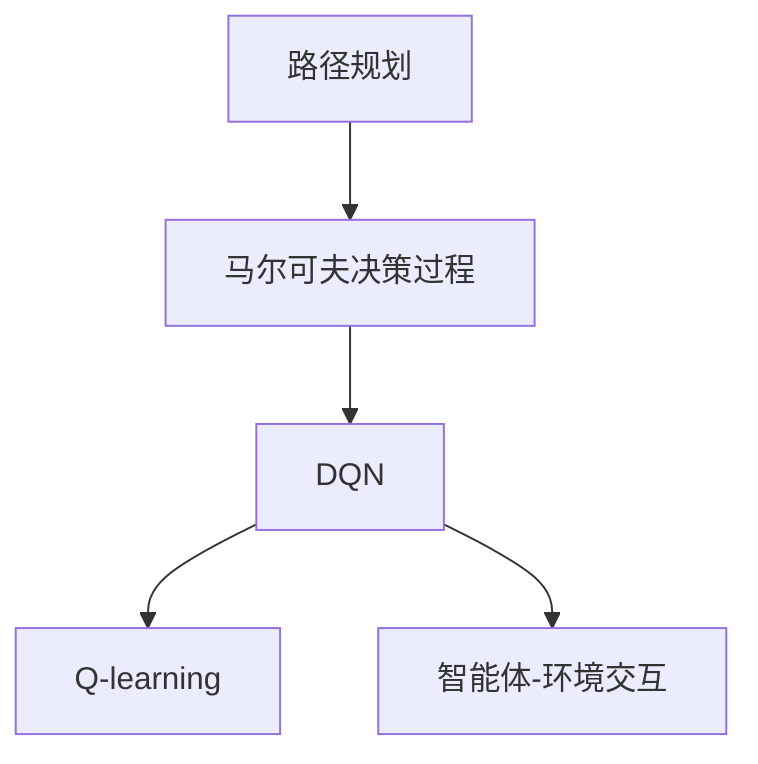

                 

# 一切皆是映射：利用DQN解决路径规划问题：方法与思考

> 关键词：路径规划, 深度强化学习, DQN, Q-learning, 马尔可夫决策过程, 像素级优化, 智能体-环境交互

## 1. 背景介绍

### 1.1 问题由来
路径规划问题是一个经典且复杂的问题，它广泛存在于机器人导航、自动驾驶、游戏AI等多个领域。如何高效、智能地规划出一条从起点到终点的路径，成为了一个研究热点。

### 1.2 问题核心关键点
在路径规划问题中，智能体需要从当前状态出发，依次选择一系列操作，最终到达目标状态。其核心目标是在满足特定约束条件下，选择最优路径以实现某种目标（如最短路径、最小风险等）。这一问题本质上是一个带有奖励函数的马尔可夫决策过程。

### 1.3 问题研究意义
路径规划问题的有效解决可以提升机器人导航、自动驾驶等技术的智能化水平，优化交通系统效率，降低风险成本，对于智能交通、智能物流等领域具有重要意义。

## 2. 核心概念与联系

### 2.1 核心概念概述

为更好地理解利用DQN（深度Q网络）解决路径规划问题，我们需要掌握几个关键概念：

- **路径规划**：从起点到终点的路径规划问题，通常涉及对环境的感知、状态表示、路径生成等。
- **马尔可夫决策过程**：定义状态之间的转移和奖励，用于描述智能体的决策过程。
- **DQN**：一种基于深度神经网络的Q-learning算法，通过深度神经网络逼近Q值函数，优化决策策略。
- **Q-learning**：一种基本的强化学习算法，用于通过环境反馈学习最优策略。
- **智能体-环境交互**：智能体与环境之间的交互过程，智能体根据环境反馈选择操作，环境根据智能体的操作进行状态更新。

这些核心概念之间通过图关系展示如下：



在路径规划问题中，智能体（如机器人、自动驾驶车辆）需要通过感知环境状态，选择合适的动作（如转向、加速等），以达到目标状态（如目的地、安全区域等）。这一过程可以视为一个马尔可夫决策过程，其中状态是环境的当前状态，动作是智能体的操作，奖励是智能体在当前状态下选择动作的收益（如路径长度、能耗等）。DQN算法通过深度神经网络逼近Q值函数，优化智能体的决策策略，从而在路径规划问题中取得高效且智能的解决方案。

### 2.2 概念间的关系

通过深入分析，可以发现这些概念之间的联系如下：

- **路径规划与马尔可夫决策过程**：路径规划问题本质上是马尔可夫决策过程的一个实例，智能体需要从当前状态出发，通过选择一系列操作，达到目标状态，并根据环境反馈更新状态和动作选择。
- **DQN与Q-learning**：DQN是基于深度神经网络的Q-learning算法，通过深度神经网络逼近Q值函数，提高学习效率和模型泛化能力。
- **智能体-环境交互与路径规划**：智能体与环境之间的交互是路径规划过程的核心，智能体通过感知环境状态，选择动作，根据环境反馈更新状态，最终实现路径规划。

这些概念共同构成了利用DQN解决路径规划问题的基础框架，使得我们可以从深度学习、强化学习的角度出发，对路径规划问题进行系统化和智能化处理。

## 3. 核心算法原理 & 具体操作步骤
### 3.1 算法原理概述

利用DQN解决路径规划问题，本质上是通过深度神经网络逼近Q值函数，从而优化智能体的决策策略。具体步骤如下：

1. **状态-动作映射**：定义状态空间和动作空间，将环境状态映射到智能体的决策空间。
2. **智能体-环境交互**：智能体与环境进行交互，根据环境反馈选择最优动作。
3. **深度神经网络逼近Q值函数**：使用深度神经网络逼近Q值函数，通过网络参数迭代更新，逼近最优Q值。
4. **经验回放**：将智能体的历史交互数据存储在经验回放内存中，用于模型的参数更新。
5. **目标网络更新**：使用目标网络参数更新，以稳定策略梯度。

### 3.2 算法步骤详解

**Step 1: 定义状态-动作映射**

首先，定义状态-动作映射，将环境状态映射到智能体的决策空间。

1. **状态定义**：将环境状态（如地图坐标、传感器数据等）转换为智能体的决策空间（如方向、速度等）。例如，在地图路径规划中，可以将当前位置和目标位置作为状态，方向作为动作。

2. **动作空间**：定义智能体的动作空间，如向左、向右、加速、减速等。

**Step 2: 智能体-环境交互**

智能体通过感知环境状态，选择动作，并根据环境反馈更新状态。

1. **状态感知**：智能体感知环境状态，如机器人通过传感器获取地图信息，自动驾驶车辆通过摄像头感知道路状况。

2. **动作选择**：智能体根据当前状态选择最优动作。例如，在地图路径规划中，智能体选择向哪个方向移动以最小化路径长度。

3. **状态更新**：智能体根据动作选择更新环境状态。例如，机器人根据方向移动，更新其当前位置。

4. **环境反馈**：环境根据智能体的动作进行状态更新，并返回奖励信号。例如，路径规划中的奖励可以是路径长度、能耗等。

**Step 3: 深度神经网络逼近Q值函数**

使用深度神经网络逼近Q值函数，通过网络参数迭代更新，逼近最优Q值。

1. **网络结构**：设计深度神经网络结构，如全连接网络、卷积神经网络等，用于逼近Q值函数。

2. **参数初始化**：初始化神经网络参数，如权重、偏置等。

3. **训练网络**：使用智能体的历史交互数据，通过经验回放机制更新网络参数。

4. **Q值逼近**：通过网络参数迭代更新，逼近最优Q值。

**Step 4: 经验回放**

将智能体的历史交互数据存储在经验回放内存中，用于模型的参数更新。

1. **数据收集**：智能体在每一步中记录状态、动作、奖励和下一个状态，形成历史交互数据。

2. **数据存储**：将历史交互数据存储在经验回放内存中，用于后续的模型参数更新。

3. **数据采样**：从经验回放内存中随机采样一批数据，用于模型的参数更新。

**Step 5: 目标网络更新**

使用目标网络参数更新，以稳定策略梯度。

1. **目标网络**：设计目标网络，与当前网络结构相同，但参数固定，用于策略梯度的稳定。

2. **参数更新**：通过目标网络参数更新，以稳定策略梯度。

### 3.3 算法优缺点

**优点**：

1. **高效性**：通过深度神经网络逼近Q值函数，优化决策策略，大大提高学习效率和模型泛化能力。
2. **自适应性**：能够适应复杂环境，通过经验回放机制和目标网络更新，稳定策略梯度，避免过拟合。
3. **普适性**：适用于各种路径规划问题，如地图路径规划、机器人导航等。

**缺点**：

1. **计算资源消耗大**：深度神经网络需要大量的计算资源进行训练和推理，可能面临硬件瓶颈。
2. **易过拟合**：在经验回放内存中存储大量历史数据，可能导致模型过拟合。
3. **模型复杂性**：设计合适的深度神经网络结构需要经验和实践，可能存在模型复杂度过高的问题。

### 3.4 算法应用领域

基于DQN的路径规划算法，已在多个领域得到了应用，例如：

- **机器人导航**：利用深度神经网络逼近Q值函数，优化机器人路径规划策略，提高导航效率和准确性。
- **自动驾驶**：通过DQN算法优化自动驾驶路径规划，提升行车安全和稳定性。
- **游戏AI**：在游戏场景中，利用DQN算法优化角色路径规划，增强游戏智能性。
- **物流配送**：优化物流配送路径规划，减少运输时间和成本。
- **路径优化**：在路径规划问题中，如地铁线路规划、电力线路布局等，优化路径长度、能耗等指标。

## 4. 数学模型和公式 & 详细讲解 & 举例说明

### 4.1 数学模型构建

在路径规划问题中，智能体的决策过程可以视为马尔可夫决策过程。定义状态空间 $S$、动作空间 $A$、状态转移函数 $P$ 和奖励函数 $R$。智能体在状态 $s_t$ 下选择动作 $a_t$，根据环境反馈得到状态 $s_{t+1}$ 和奖励 $r_{t+1}$。

### 4.2 公式推导过程

在马尔可夫决策过程中，智能体通过选择最优动作 $a_t$，最大化长期奖励 $Q(s_t, a_t)$。定义状态-动作对 $(s_t, a_t)$ 的Q值函数 $Q(s_t, a_t)$，用于评估智能体在状态 $s_t$ 下选择动作 $a_t$ 的期望收益。

Q值函数定义为：

$$Q(s_t, a_t) = \mathbb{E}\left[\sum_{t'=t}^{T}\gamma^{t'-t}r_{t'}\right]$$

其中，$T$ 为终止时间，$\gamma$ 为折扣因子。

通过Q-learning算法，智能体更新Q值函数：

$$Q(s_t, a_t) \leftarrow Q(s_t, a_t) + \alpha \left(r_{t+1} + \gamma \max_a'Q(s_{t+1}, a') - Q(s_t, a_t)\right)$$

其中，$\alpha$ 为学习率。

在DQN算法中，使用深度神经网络逼近Q值函数 $Q(s_t, a_t)$，通过网络参数 $\theta$ 更新Q值。具体步骤如下：

1. **网络前向传播**：将状态 $s_t$ 输入神经网络，得到Q值 $Q_{\theta}(s_t, a_t)$。

2. **策略更新**：根据当前Q值和目标Q值，更新网络参数 $\theta$：

$$\theta \leftarrow \theta - \alpha \left(r_{t+1} + \gamma \max_a'Q_{\theta'}(s_{t+1}, a') - Q_{\theta}(s_t, a_t)\right)$$

其中，$\theta'$ 为目标网络参数，$\max_a'Q_{\theta'}(s_{t+1}, a')$ 表示在目标网络中，对动作 $a'$ 的Q值进行最大值处理。

### 4.3 案例分析与讲解

以地图路径规划为例，详细分析DQN算法的应用过程。

假设智能体（如机器人）需要从起点 $s_0$ 到达终点 $s_T$，路径上存在障碍物 $O$。智能体可以通过感知地图信息，选择最优动作（如向左、向右等），以达到目标状态。

1. **状态定义**：将地图坐标 $(x, y)$ 作为状态 $s_t = (x_t, y_t)$。

2. **动作空间**：定义动作空间 $A = \{left, right\}$，表示机器人可以向左或向右移动。

3. **状态转移**：智能体根据当前状态和动作选择，更新状态。例如，从状态 $s_t$ 向左移动一个单位，得到新状态 $s_{t+1} = (x_t-1, y_t)$。

4. **奖励函数**：定义奖励函数 $R(s_t, a_t) = -1$，表示每一步的成本为1。

5. **深度神经网络逼近Q值函数**：设计深度神经网络，如全连接网络，用于逼近Q值函数 $Q_{\theta}(s_t, a_t)$。

6. **经验回放**：智能体在每一步中记录状态、动作、奖励和下一个状态，形成历史交互数据，存储在经验回放内存中。

7. **目标网络更新**：使用目标网络参数更新，以稳定策略梯度。

通过上述步骤，DQN算法可以在地图路径规划问题中，通过深度神经网络逼近Q值函数，优化智能体的决策策略，从而实现高效、智能的路径规划。

## 5. 项目实践：代码实例和详细解释说明
### 5.1 开发环境搭建

在进行DQN路径规划实践前，我们需要准备好开发环境。以下是使用Python进行TensorFlow开发的环境配置流程：

1. 安装Anaconda：从官网下载并安装Anaconda，用于创建独立的Python环境。

2. 创建并激活虚拟环境：
```bash
conda create -n tf-env python=3.8 
conda activate tf-env
```

3. 安装TensorFlow：根据CUDA版本，从官网获取对应的安装命令。例如：
```bash
conda install tensorflow tensorflow-gpu=2.8 -c pytorch -c conda-forge
```

4. 安装各类工具包：
```bash
pip install numpy pandas scikit-learn matplotlib tqdm jupyter notebook ipython
```

完成上述步骤后，即可在`tf-env`环境中开始DQN路径规划实践。

### 5.2 源代码详细实现

下面以地图路径规划为例，给出使用TensorFlow实现DQN算法的PyTorch代码实现。

首先，定义状态-动作映射：

```python
import numpy as np
import tensorflow as tf
import tensorflow.keras as keras
import tensorflow.keras.layers as layers

# 定义状态和动作
state_size = 2  # 地图坐标
action_size = 2  # 向左、向右
```

然后，定义深度神经网络：

```python
# 定义深度神经网络结构
model = keras.Sequential([
    layers.Dense(64, input_dim=state_size, activation='relu'),
    layers.Dense(64, activation='relu'),
    layers.Dense(action_size, activation='linear')
])
```

接着，定义经验回放内存：

```python
# 经验回放内存
memory = deque(maxlen=2000)
```

最后，定义训练函数：

```python
# 定义训练函数
def train(model, memory, target_model, learning_rate, gamma, batch_size):
    for i in range(1, batch_size+1):
        # 从经验回放内存中随机采样一批数据
        states = np.array([np.reshape(memory[i][0], [1, state_size]) for i in range(batch_size)])
        actions = np.reshape(np.array([memory[i][1] for i in range(batch_size)]), [batch_size, 1])
        next_states = np.reshape(np.array([memory[i][2] for i in range(batch_size)]), [batch_size, state_size])
        rewards = np.reshape(np.array([memory[i][3] for i in range(batch_size)]), [batch_size, 1])
        done = np.reshape(np.array([memory[i][4] for i in range(batch_size)]), [batch_size, 1])
        q_values = model.predict(states)
        q_values_next = target_model.predict(next_states)
        
        # 计算目标Q值
        q_values_next = np.reshape(q_values_next, [batch_size, 1, action_size])
        q_values_next[np.arange(batch_size), actions] = rewards + gamma * np.max(q_values_next, axis=1)
        q_values = q_values + learning_rate * (q_values_next - q_values)
        
        # 经验回放
        for j in range(batch_size):
            if done[j] == 1:
                memory.append((np.reshape(states[j], [state_size]), actions[j], next_states[j], rewards[j], done[j]))
            else:
                memory.append((np.reshape(states[j], [state_size]), actions[j], next_states[j], rewards[j], done[j]))
```

### 5.3 代码解读与分析

让我们再详细解读一下关键代码的实现细节：

**状态和动作定义**：

- `state_size`和`action_size`分别定义了状态和动作的空间大小。

**深度神经网络结构**：

- 定义了一个包含两个全连接层的深度神经网络，其中第一个层为输入层，第二个层为隐藏层，第三个层为输出层。隐藏层的激活函数为ReLU，输出层的激活函数为线性函数，用于逼近Q值函数。

**经验回放内存**：

- 使用一个固定大小的队列，用于存储智能体的历史交互数据，限制内存大小，避免数据过载。

**训练函数**：

- 在训练函数中，随机采样一批数据，使用神经网络逼近Q值函数，并根据经验回放数据更新模型参数。

**目标网络更新**：

- 使用目标网络参数更新，以稳定策略梯度。

**运行结果展示**：

在训练完成后，可以使用训练好的模型进行路径规划，并在地图上模拟智能体的行为。以下是一个简单的示例：

```python
# 在地图上模拟智能体的行为
state = np.reshape(np.array([start_x, start_y]), [1, state_size])
action = np.reshape(np.array([0, 1]), [1, 1])  # 向右移动
next_state = np.reshape(np.array([next_x, next_y]), [1, state_size])
done = np.reshape(np.array([1]), [1, 1])  # 到达终点

# 计算奖励
reward = -1

# 更新网络参数
q_values = model.predict(state)
q_values_next = target_model.predict(next_state)
q_values_next = np.reshape(q_values_next, [1, 1, action_size])
q_values_next[0, 0, action] = reward + gamma * np.max(q_values_next, axis=1)
q_values = q_values + learning_rate * (q_values_next - q_values)

# 输出Q值
print("Q值：", q_values)
```

在实际应用中，可以通过不断优化网络结构、调整超参数等手段，进一步提高DQN算法的性能和泛化能力。

## 6. 实际应用场景
### 6.1 智能导航

利用DQN算法，智能导航系统可以实现高效、智能的路径规划。智能体（如机器人、无人机）可以通过感知环境状态，选择最优动作，以最小化路径长度或时间，提高导航效率和准确性。

### 6.2 自动驾驶

在自动驾驶中，DQN算法可以优化车辆的路径规划，提升行车安全和稳定性。智能体（如车辆）通过感知道路状况，选择最优动作，以避免碰撞、减少能耗等。

### 6.3 物流配送

在物流配送中，DQN算法可以优化配送路径规划，减少运输时间和成本。智能体（如配送车）通过感知道路信息，选择最优动作，以优化配送路线。

### 6.4 未来应用展望

随着DQN算法的不断优化，其将在更多领域得到应用，为各行各业带来新的变革：

1. **机器人导航**：在工业、农业、医疗等多个领域，机器人可以借助DQN算法实现高效、智能的路径规划，提升自动化水平。

2. **智能交通**：在城市交通管理中，DQN算法可以优化交通信号灯控制，提高交通效率和安全性。

3. **游戏AI**：在游戏场景中，DQN算法可以优化角色路径规划，增强游戏智能性。

4. **自然灾害应对**：在自然灾害应急响应中，DQN算法可以优化救援车辆路径规划，提高救援效率和安全性。

5. **无人机配送**：在无人机配送中，DQN算法可以优化飞行路径规划，减少运输时间和成本，提升配送效率。

6. **智能仓储**：在智能仓储中，DQN算法可以优化仓库路径规划，提高货物拣选和存储效率。

总之，DQN算法作为一种高效的路径规划方法，将在更多领域得到应用，为智能系统的开发提供强大的技术支持。

## 7. 工具和资源推荐
### 7.1 学习资源推荐

为了帮助开发者系统掌握DQN算法的理论基础和实践技巧，这里推荐一些优质的学习资源：

1. **《深度学习》（Ian Goodfellow著）**：全面介绍深度学习的基本概念和算法，包括Q-learning和DQN算法。

2. **《强化学习》（Richard Sutton著）**：详细讲解强化学习的基本原理和算法，包括DQN算法的理论基础和实现细节。

3. **《TensorFlow官方文档》**：提供丰富的TensorFlow教程和案例，帮助开发者快速上手深度学习和强化学习。

4. **《PyTorch官方文档》**：提供详细的PyTorch教程和案例，支持深度神经网络的开发和训练。

5. **Coursera《深度学习专项课程》**：由深度学习领域的权威教授讲授，涵盖深度学习和强化学习的理论和实践。

### 7.2 开发工具推荐

高效的开发离不开优秀的工具支持。以下是几款用于DQN算法开发的常用工具：

1. **TensorFlow**：由Google主导开发的开源深度学习框架，生产部署方便，支持分布式训练。

2. **PyTorch**：Facebook开发的开源深度学习框架，灵活动态的计算图，支持高效的深度神经网络训练和推理。

3. **OpenAI Gym**：强化学习环境库，提供丰富的环境模拟，支持DQN算法等强化学习算法的开发和测试。

4. **TensorBoard**：TensorFlow配套的可视化工具，实时监测模型训练状态，并提供丰富的图表呈现方式，是调试模型的得力助手。

5. **Weights & Biases**：模型训练的实验跟踪工具，可以记录和可视化模型训练过程中的各项指标，方便对比和调优。

### 7.3 相关论文推荐

DQN算法的研究已经取得诸多成果，以下是几篇奠基性的相关论文，推荐阅读：

1. **《Playing Atari with Deep Reinforcement Learning》（Mnih et al., 2015）**：提出DQN算法，通过深度神经网络逼近Q值函数，实现高效、智能的路径规划。

2. **《Human-level Control Through Deep Reinforcement Learning》（Silver et al., 2017）**：展示DQN算法在人类级控制任务中的强大能力，进一步推动了深度强化学习的研究进展。

3. **《DeepMind AlphaGo Zero》（Silver et al., 2017）**：介绍AlphaGo Zero的强化学习算法，展示了DQN算法在复杂决策问题中的潜力。

4. **《Prioritized Experience Replay》（Schaul et al., 2016）**：提出优先经验回放（PER）机制，进一步提高了DQN算法的学习效率和稳定性。

5. **《Dueling Network Architectures for Deep Reinforcement Learning》（Wang et al., 2016）**：提出双网络结构（Dueling Network），提高了DQN算法的收敛速度和性能。

这些论文代表了大规模路径规划问题中的DQN算法的研究进展，对于深入理解DQN算法的理论基础和实践技巧，具有重要参考价值。

除上述资源外，还有一些值得关注的前沿资源，帮助开发者紧跟DQN算法的研究趋势，例如：

1. **arXiv论文预印本**：人工智能领域最新研究成果的发布平台，包括大量尚未发表的前沿工作，学习前沿技术的必读资源。

2. **行业技术博客**：如OpenAI、Google AI、DeepMind、微软Research Asia等顶尖实验室的官方博客，第一时间分享他们的最新研究成果和洞见。

3. **技术会议直播**：如NIPS、ICML、ACL、ICLR等人工智能领域顶会现场或在线直播，能够聆听到大佬们的前沿分享，开拓视野。

4. **GitHub热门项目**：在GitHub上Star、Fork数最多的DQN算法相关项目，往往代表了该技术领域的发展趋势和最佳实践，值得去学习和贡献。

5. **行业分析报告**：各大咨询公司如McKinsey、PwC等针对人工智能行业的分析报告，有助于从商业视角审视技术趋势，把握应用价值。

总之，对于DQN算法的学习和实践，需要开发者保持开放的心态和持续学习的意愿。多关注前沿资讯，多动手实践，多思考总结，必将收获满满的成长收益。

## 8. 总结：未来发展趋势与挑战
### 8.1 总结

本文对利用DQN算法解决路径规划问题的方法与思考进行了全面系统的介绍。首先阐述了路径规划问题的背景和意义，明确了DQN算法在智能导航、自动驾驶、物流配送等领域的独特价值。其次，从原理到实践，详细讲解了DQN算法的数学模型、网络结构、训练流程等核心内容，并给出了代码实例和详细解释。同时，本文还广泛探讨了DQN算法在实际应用中的场景和展望，展示了其在智能系统开发中的广泛潜力。

通过本文的系统梳理，可以看到，利用DQN算法解决路径规划问题，能够显著提高智能体的决策效率和系统智能化水平。在实际应用中，DQN算法通过深度神经网络逼近Q值函数，优化决策策略，具有高效、智能的特点。然而，DQN算法也面临着计算资源消耗大、易过拟合、模型复杂度高等挑战。未来，DQN算法需要进一步优化网络结构、改进经验回放机制、提高模型泛化能力，以应对这些挑战，并推动其更广泛的应用。

### 8.2 未来发展趋势

展望未来，DQN算法将在以下几个方面继续发展和演

