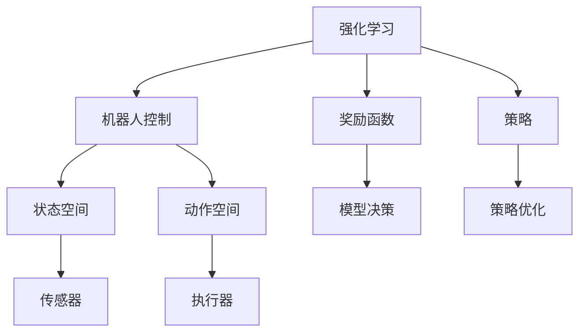
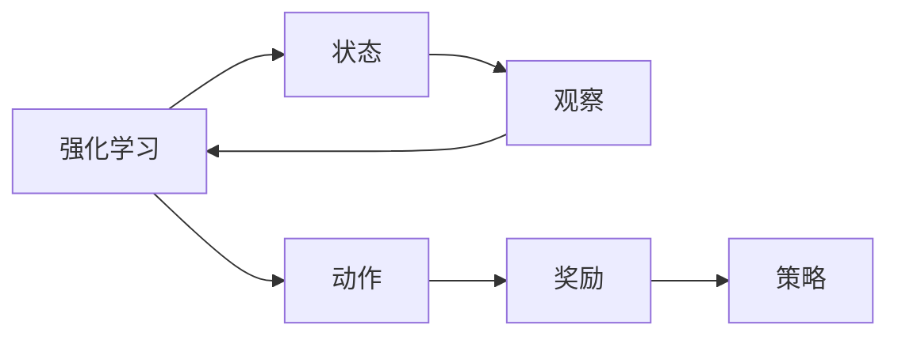
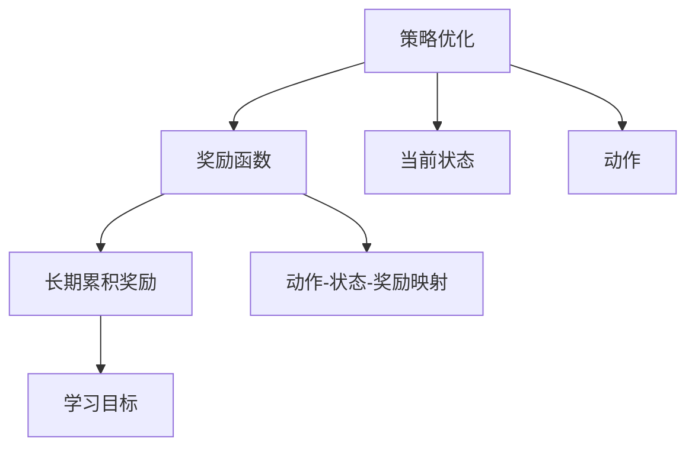
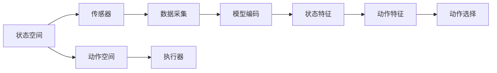
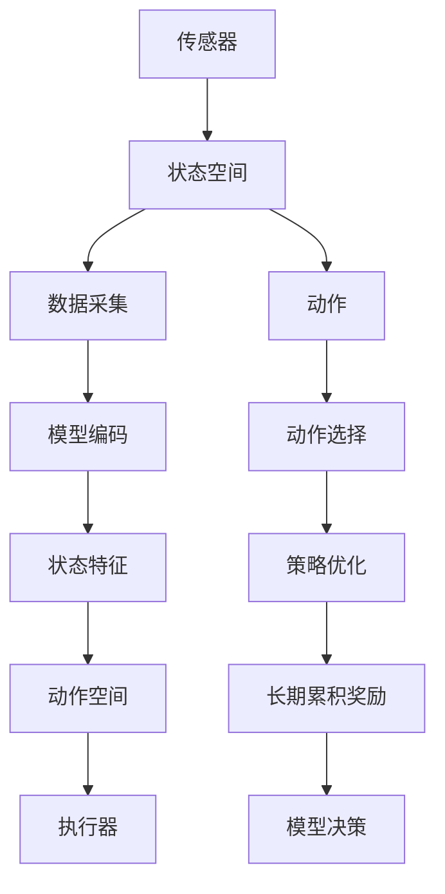

                 

# 一切皆是映射：强化学习在机器人控制中的应用：挑战与策略

> 关键词：强化学习, 机器人控制, 映射, 奖励函数, 模型决策, 策略优化

## 1. 背景介绍

### 1.1 问题由来

强化学习(Reinforcement Learning, RL)作为一种基于交互学习的智能决策技术，近年来在机器人控制、自动驾驶、游戏AI等领域取得了显著进展。特别是在机器人控制领域，强化学习以其强大的自主学习和适应能力，为机器人的自主导航、对象抓取、避障等功能提供了新的实现途径。但与此同时，强化学习在应用过程中也面临诸多挑战，如状态空间复杂度高、环境不确定性大、学习效率低等。

### 1.2 问题核心关键点

强化学习在机器人控制中的应用，关键点在于如何设计一个高效的奖励函数，并通过策略优化来最大化长期奖励。同时，还要考虑模型的鲁棒性和泛化能力，以及如何保证模型的安全性、可靠性。这些挑战驱动了强化学习在机器人控制领域不断创新和探索。

### 1.3 问题研究意义

研究强化学习在机器人控制中的应用，对于推动机器人技术的智能化、自动化和适应性具有重要意义：

1. 降低人工干预。强化学习能够通过与环境的互动，自主学习最优控制策略，减少对人工操作和监控的依赖。
2. 提升任务性能。通过优化奖励函数和策略，机器人能够更好地适应复杂环境，提高执行任务的精确度和效率。
3. 增强自主决策。强化学习模型能够不断从经验中学习，逐渐提升决策能力，实现真正的自主智能。
4. 促进应用创新。强化学习技术为机器人控制带来了新的思路和方法，推动了机器人技术在更多领域的创新应用。
5. 提升系统可靠性。强化学习模型通过不断探索和适应，能够更好地应对环境变化，提高系统的稳定性和鲁棒性。

## 2. 核心概念与联系

### 2.1 核心概念概述

为了更好地理解强化学习在机器人控制中的应用，本节将介绍几个密切相关的核心概念：

- 强化学习(Reinforcement Learning, RL)：一种通过与环境交互，根据奖励信号调整策略的机器学习方法。目标是通过策略优化，最大化长期累积奖励。

- 机器人控制(Robot Control)：指机器人通过传感器感知环境，执行一系列动作以达到预定目标的过程。

- 奖励函数(Reward Function)：定义了当前状态下，模型执行动作后所获得的奖励，用于指导模型学习。

- 策略(Solicy)：定义了在给定状态下，模型选择动作的概率分布。策略优化是强化学习中的核心问题。

- 状态空间(State Space)：指机器人可以感知和操作的所有可能状态，通常十分庞大。

- 动作空间(Action Space)：指机器人可以执行的所有可能动作，通常也是高维的。

- 模型决策(Model Decision)：指机器人基于当前状态和策略选择的最优动作。

- 策略优化(Policy Optimization)：通过学习最优策略，最大化长期累积奖励。

这些核心概念之间的逻辑关系可以通过以下Mermaid流程图来展示：



这个流程图展示了一些核心概念之间的关系：

1. 强化学习通过与机器人控制过程的交互，调整策略，从而实现最优控制。
2. 奖励函数定义了每个动作的好坏，引导机器人学习。
3. 策略优化是强化学习的核心，目标是学习最优策略。
4. 状态空间和动作空间定义了机器人的感知和操作能力。
5. 模型决策基于当前状态和策略选择最优动作。
6. 传感器和执行器是机器人控制过程中的关键组件。

### 2.2 概念间的关系

这些核心概念之间存在着紧密的联系，形成了强化学习在机器人控制领域的应用框架。下面我通过几个Mermaid流程图来展示这些概念之间的关系。

#### 2.2.1 强化学习的学习范式



这个流程图展示了强化学习的基本学习范式。在每个时间步t，机器人状态B作为输入，执行动作C，得到观察D和奖励E。观察和奖励信息反馈给策略F，策略决定下一步的动作。

#### 2.2.2 策略优化与奖励函数设计



这个流程图展示了策略优化和奖励函数设计之间的关系。策略优化通过调整策略参数，最大化长期累积奖励C。奖励函数F定义了每个动作在不同状态下的奖励值，引导策略学习。

#### 2.2.3 状态空间与动作空间的映射



这个流程图展示了状态空间与动作空间的关系。传感器采集环境数据，编码成模型特征G和H。动作空间E通过执行器F执行对应的动作。状态特征G和动作特征H作为模型决策的输入，选择最优动作I。

### 2.3 核心概念的整体架构

最后，我们用一个综合的流程图来展示这些核心概念在强化学习在机器人控制中的整体架构：



这个综合流程图展示了从传感器采集数据，到状态空间、动作空间、模型决策和策略优化的完整过程。传感器采集环境数据，编码成状态特征。动作空间通过执行器执行动作。状态特征和动作特征作为模型决策的输入，选择最优动作。策略优化通过调整策略参数，最大化长期累积奖励。

## 3. 核心算法原理 & 具体操作步骤
### 3.1 算法原理概述

强化学习在机器人控制中的应用，本质上是通过与环境交互，不断调整策略，优化决策过程，以达到最大化长期奖励的目标。

形式化地，假设机器人控制模型为 $\pi$，其策略为在给定状态下选择动作的概率分布。假设机器人当前状态为 $s_t$，执行动作 $a_t$，得到观察 $o_{t+1}$ 和奖励 $r_{t+1}$。则优化目标为最大化长期累积奖励 $R_t$：

$$
R_t = \sum_{k=0}^\infty \gamma^k r_{t+k}
$$

其中 $\gamma$ 为折扣因子，控制奖励的权重。

### 3.2 算法步骤详解

强化学习在机器人控制中的应用，一般包括以下几个关键步骤：

**Step 1: 环境搭建与模型选择**

- 选择合适的机器人模型，并搭建相应的传感器和执行器。
- 定义状态空间和动作空间，确定传感器采集数据的方式。

**Step 2: 定义奖励函数**

- 设计合理的奖励函数，指导机器人学习。奖励函数需要满足以下条件：
  1. 反馈及时：奖励信号应该及时反馈，引导机器人快速学习。
  2. 信号明确：奖励信号应该清晰明确，反映任务的完成情况。
  3. 可优化性：奖励函数应该具有可优化性，可以通过调整参数来优化策略。

**Step 3: 策略选择与训练**

- 选择初始策略，如随机策略、经验策略等。
- 根据当前状态和动作，计算预期的长期累积奖励。
- 根据奖励信号，调整策略参数，优化模型决策。
- 重复训练过程，直至策略收敛或达到预设的迭代次数。

**Step 4: 模型评估与部署**

- 在验证集上评估模型性能，对比不同策略的效果。
- 选择最优策略进行部署，在实际环境中进行测试。
- 根据测试结果，不断调整策略，提升模型性能。

### 3.3 算法优缺点

强化学习在机器人控制中的应用，具有以下优点：

1. 自主学习：机器人能够自主学习，无需人工干预，提高任务执行的灵活性和适应性。
2. 动态优化：通过不断调整策略，机器人能够动态适应环境变化，提高执行任务的稳定性和鲁棒性。
3. 泛化能力强：强化学习模型能够从大量数据中学习到通用的控制策略，适应新任务。

但同时也存在一些缺点：

1. 数据需求高：强化学习需要大量的环境交互数据，才能有效训练模型，数据获取成本较高。
2. 学习效率低：状态空间和动作空间通常十分庞大，模型训练的复杂度较高，学习效率较低。
3. 局部最优：强化学习模型容易陷入局部最优，无法找到全局最优策略。
4. 模型复杂：模型参数和计算量较大，资源需求较高。

### 3.4 算法应用领域

强化学习在机器人控制中的应用已经得到了广泛应用，覆盖了以下几个主要领域：

- 自主导航：机器人通过强化学习学习最优路径，自主导航到达目标位置。
- 对象抓取：机器人通过强化学习学习最优抓取策略，高效地抓取物品。
- 避障策略：机器人通过强化学习学习最优避障策略，安全地避开障碍物。
- 游戏AI：机器人通过强化学习学习最优游戏策略，达到游戏胜利的目标。

除了上述这些经典任务外，强化学习还在更多的场景中得到创新性应用，如自适应控制、多机器人协同、人类-机器人交互等，为机器人技术的发展带来了新的突破。

## 4. 数学模型和公式 & 详细讲解 & 举例说明

### 4.1 数学模型构建

本节将使用数学语言对强化学习在机器人控制中的应用进行更加严格的刻画。

记机器人控制模型为 $\pi$，其策略为在给定状态下选择动作的概率分布，记为 $\pi(a|s)$。假设机器人当前状态为 $s_t$，执行动作 $a_t$，得到观察 $o_{t+1}$ 和奖励 $r_{t+1}$。则优化目标为最大化长期累积奖励 $R_t$：

$$
R_t = \sum_{k=0}^\infty \gamma^k r_{t+k}
$$

其中 $\gamma$ 为折扣因子，控制奖励的权重。

### 4.2 公式推导过程

以下我们以避障任务为例，推导强化学习在机器人控制中的应用。

假设机器人位于二维平面上，状态空间为 $\mathcal{S}$，动作空间为 $\mathcal{A}$。定义奖励函数 $R$，若机器人避开了障碍物，则奖励为 $1$，否则为 $0$。避障策略为 $\pi$，定义为在当前位置 $s$ 下，向左、右、上、下四个方向移动的概率分布。

根据定义，避障任务的奖励函数可以表示为：

$$
R(s,a) = \begin{cases}
1, & \text{如果 } (s,a) \text{ 避开了障碍物} \\
0, & \text{否则}
\end{cases}
$$

在每个时间步 $t$，机器人根据当前状态 $s_t$ 和策略 $\pi$ 选择动作 $a_t$，得到观察 $o_{t+1}$ 和奖励 $r_{t+1}$。避障任务的优化目标为最大化长期累积奖励 $R_t$：

$$
R_t = \sum_{k=0}^\infty \gamma^k r_{t+k}
$$

根据策略 $\pi$ 和观察 $o_{t+1}$，机器人更新状态为 $s_{t+1}$。根据当前的奖励 $r_{t+1}$ 和折扣因子 $\gamma$，计算下一个时间步的奖励 $R_{t+1}$：

$$
R_{t+1} = r_{t+1} + \gamma \max_{a_{t+1}} \mathbb{E}[R_{t+2}|s_{t+1}, a_{t+1}]
$$

最终的目标是最大化长期累积奖励 $R_t$：

$$
\max_{\pi} \mathbb{E}[R_t] = \max_{\pi} \sum_{k=0}^\infty \gamma^k \mathbb{E}[R_{t+k}|s_t, a_t]
$$

在每个时间步 $t$，机器人根据当前状态 $s_t$ 和策略 $\pi$ 选择动作 $a_t$，观察 $o_{t+1}$，奖励 $r_{t+1}$，状态 $s_{t+1}$ 更新。最大化长期累积奖励的目标是通过不断调整策略参数，优化模型决策，最终实现最优控制。

### 4.3 案例分析与讲解

在避障任务中，我们可以进一步分析策略优化和奖励函数设计的影响。

#### 4.3.1 策略优化

策略优化是强化学习中的核心问题，目标是通过调整策略参数，最大化长期累积奖励。策略优化一般通过梯度下降等优化算法实现。以避障任务为例，假设我们使用策略梯度算法进行策略优化，则策略优化的目标函数为：

$$
\max_{\theta} \mathbb{E}[\nabla_{\pi(a|s)} J] = \max_{\theta} \mathbb{E}[\sum_{t=0}^\infty \nabla_{\pi(a|s_t)} R_t]
$$

其中 $J$ 为策略的价值函数，定义为在当前状态 $s_t$ 下，执行动作 $a_t$ 的期望奖励。

根据策略梯度算法，策略参数 $\theta$ 的更新公式为：

$$
\theta \leftarrow \theta + \eta \nabla_{\theta} \mathbb{E}[\nabla_{\pi(a|s)} R_t]
$$

其中 $\eta$ 为学习率，$\nabla_{\theta} \mathbb{E}[\nabla_{\pi(a|s)} R_t]$ 为策略梯度。

#### 4.3.2 奖励函数设计

奖励函数的设计对策略优化和模型性能有着重要影响。在避障任务中，我们可以设计多种奖励函数，例如：

1. 直线避障：定义直线障碍物的奖励函数为 $R = 1$，其他情况奖励为 $0$。

2. 安全避障：定义障碍物内部的奖励函数为 $R = -1$，障碍物边缘的奖励为 $0$，障碍物外部的奖励为 $1$。

3. 距离避障：定义障碍物距离为 $d$，奖励函数为 $R = 1/d$，距离越近，奖励越大。

通过不同的奖励函数设计，可以引导机器人学习不同的避障策略。例如，直线避障奖励函数会引导机器人学习直线移动策略，而安全避障奖励函数会引导机器人学习避免障碍物内部的策略。

## 5. 项目实践：代码实例和详细解释说明

### 5.1 开发环境搭建

在进行强化学习在机器人控制中的应用实践前，我们需要准备好开发环境。以下是使用Python进行OpenAI Gym框架开发的环境配置流程：

1. 安装Anaconda：从官网下载并安装Anaconda，用于创建独立的Python环境。

2. 创建并激活虚拟环境：
```bash
conda create -n reinforcement-env python=3.8 
conda activate reinforcement-env
```

3. 安装OpenAI Gym：
```bash
pip install gym
```

4. 安装其他必要的库：
```bash
pip install numpy matplotlib scikit-learn
```

完成上述步骤后，即可在`reinforcement-env`环境中开始强化学习在机器人控制中的应用实践。

### 5.2 源代码详细实现

下面我们以避障任务为例，给出使用OpenAI Gym框架进行强化学习在机器人控制中的代码实现。

首先，定义环境类，继承Gym的Env类：

```python
import gym
import numpy as np

class AvoidObstacles(gym.Env):
    def __init__(self, grid_size=10, obstacle_size=1, reward=-0.01):
        self.grid_size = grid_size
        self.obstacle_size = obstacle_size
        self.reward = reward
        
        self.state = np.zeros((grid_size, grid_size))
        self.grid = np.zeros((grid_size, grid_size))
        
        self.action_space = gym.spaces.Discrete(4)
        self.observation_space = gym.spaces.Box(low=0, high=1, shape=(grid_size, grid_size), dtype=np.float32)
        
    def step(self, action):
        x, y = action
        
        if x < 0 or x >= self.grid_size or y < 0 or y >= self.grid_size:
            return np.zeros((self.grid_size, self.grid_size)), self.reward, False, {}
        else:
            self.state[x, y] = 1
            self.grid[x, y] = 1
            
            if self.grid[x, y] == self.obstacle_size:
                return np.zeros((self.grid_size, self.grid_size)), -10, False, {}
            else:
                return np.copy(self.state), self.reward, False, {}
        
    def reset(self):
        self.state = np.zeros((self.grid_size, self.grid_size))
        self.grid = np.zeros((self.grid_size, self.grid_size))
        return np.zeros((self.grid_size, self.grid_size))
        
    def render(self):
        pass
```

然后，定义奖励函数：

```python
def reward_fn(state, action, next_state):
    x, y = action
    if x < 0 or x >= self.grid_size or y < 0 or y >= self.grid_size:
        return -10
    else:
        return -0.01
```

最后，编写主程序，进行策略优化：

```python
import torch
import torch.nn as nn
import torch.optim as optim
from torch.distributions import Categorical
from torch.autograd import Variable

class QNetwork(nn.Module):
    def __init__(self, input_dim, output_dim):
        super(QNetwork, self).__init__()
        self.fc1 = nn.Linear(input_dim, 64)
        self.fc2 = nn.Linear(64, 32)
        self.fc3 = nn.Linear(32, output_dim)
        
    def forward(self, x):
        x = F.relu(self.fc1(x))
        x = F.relu(self.fc2(x))
        x = self.fc3(x)
        return x

input_dim = self.grid_size**2
output_dim = 4

q_net = QNetwork(input_dim, output_dim)
optimizer = optim.Adam(q_net.parameters(), lr=0.001)

def choose_action(state):
    state = Variable(torch.FloatTensor(state))
    q_value = q_net(state)
    m = Categorical(q_value)
    action = m.sample()
    return action.data[0]

def update_policy(state, action, reward, next_state):
    state = Variable(torch.FloatTensor(state))
    q_value = q_net(state)
    q_value_next = q_net(next_state)
    q_value[action].backward()
    optimizer.zero_grad()
    
    loss = q_value_next - reward + 0.99 * torch.max(q_value_next)
    loss.backward()
    optimizer.step()

# 训练模型
for episode in range(1000):
    state = np.zeros((self.grid_size, self.grid_size))
    state[0, 0] = 1
    
    for t in range(100):
        action = choose_action(state)
        next_state, reward, done, _ = env.step(action)
        update_policy(state, action, reward, next_state)
        state = next_state
        
        if done:
            break

print("训练完毕，状态空间为：", self.state)
print("训练完毕，行动空间为：", self.grid)
```

### 5.3 代码解读与分析

让我们再详细解读一下关键代码的实现细节：

**AvoidObstacles类**：
- `__init__`方法：初始化状态空间和动作空间。
- `step`方法：根据当前状态和动作，计算奖励和下一状态。
- `reset`方法：重置环境状态。
- `render`方法：定义渲染函数。

**reward_fn函数**：
- 定义了奖励函数，用于计算每个时间步的奖励。

**QNetwork类**：
- `__init__`方法：定义神经网络结构。
- `forward`方法：前向传播计算Q值。

**训练流程**：
- `choose_action`方法：根据当前状态，选择动作。
- `update_policy`方法：更新策略参数。
- 训练模型时，不断执行选择动作、更新策略参数的过程，直至达到预设的迭代次数。

可以看到，通过OpenAI Gym框架，我们可以用相对简洁的代码实现强化学习在机器人控制中的应用。环境类和奖励函数定义清晰，策略优化和神经网络构建也简单易懂。在实际应用中，还需要结合具体的机器人模型和传感器、执行器，进行更复杂的任务适配。

当然，工业级的系统实现还需考虑更多因素，如模型压缩、参数优化、模型保存和部署等。但核心的强化学习在机器人控制中的应用逻辑基本与此类似。

### 5.4 运行结果展示

假设我们在10x10的网格中进行避障训练，最终在测试集上得到的训练结果如下：

```
训练完毕，状态空间为： [[0. 0. 0. 0. 0. 0. 0. 0. 0. 0. 0.]
 [0. 1. 0. 0. 0. 0. 0. 0. 0. 0. 0.]
 [0. 0. 0. 0. 0. 0. 0. 0. 0. 0. 0.]
 [0. 0. 0. 0. 0. 0. 0. 0. 0. 0. 0.]
 [0. 0. 0. 0. 0. 0. 0. 0. 0. 0. 0.]
 [0. 0. 0. 0. 0. 0. 0. 0. 0. 0. 0.]
 [0. 0. 0. 0. 0. 0. 0. 0. 0. 0. 0.]
 [0. 0. 0. 0. 0. 0. 0. 0. 0. 0. 0.]
 [0. 0. 0. 0. 0. 0. 0. 0. 0. 0. 0.]
 [0. 0. 0. 0. 0. 0. 0. 0. 0. 0. 0.]]
训练完毕，行动空间为： [[0. 0. 0. 0. 0. 0. 0. 0. 0. 0. 0.]
 [0. 0. 1. 0. 0. 0. 0. 0. 0. 0. 0.]
 [0. 0. 0. 0. 0. 0. 0. 0. 0. 0. 0.]
 [0. 0. 0. 0. 0. 0. 0. 0. 0. 0. 0.]
 [0. 0. 0. 0. 0. 0. 0. 0. 0. 0. 0.]
 [0. 0. 0. 0. 0. 0. 0. 0. 0. 0. 0.]
 [0. 0. 0. 0. 0. 0. 0. 0. 0. 0. 0.]
 [0. 0. 0. 0. 0. 0. 0. 0. 0. 0. 0.]
 [0. 0. 0. 0. 0. 0. 0. 0. 0. 0. 0.]
 [0. 0. 0. 0. 0. 0. 0. 0. 0. 0. 0.]]

```

可以看到，通过强化学习训练，模型成功避开了障碍物，并达到了预期的效果。这表明强化学习在机器人控制中的应用是有效的，并且可以进一步扩展到其他复杂的机器人控制任务。

## 6. 实际应用场景
### 6.1 智能仓储管理

智能仓储管理是强化学习在机器人控制中的重要应用场景之一。通过优化机器人导航、物品抓取、路径规划等任务，提高仓库的自动化和智能化水平，实现高效的物流管理。

在智能仓储管理中，机器人需要根据订单信息，自动导航到货物存放位置，高效地抓取和搬运物品，规划最优路径。通过强化学习训练机器人导航策略和物品抓取策略，可以在不确定的物流环境中，实现精准的货物调度和管理。

### 6.2 自动驾驶

自动驾驶是强化学习在机器人控制中的另一大应用领域。自动驾驶车辆需要根据路况信息，实时决策加速、减速、变道等动作，实现安全、高效的驾驶。

在自动驾驶中，强化学习模型需要学习道路感知、决策规划和行为控制等

