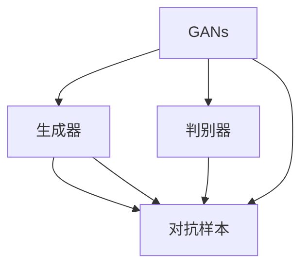
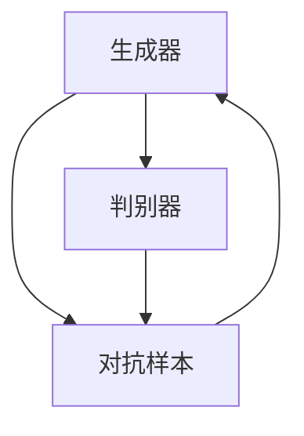
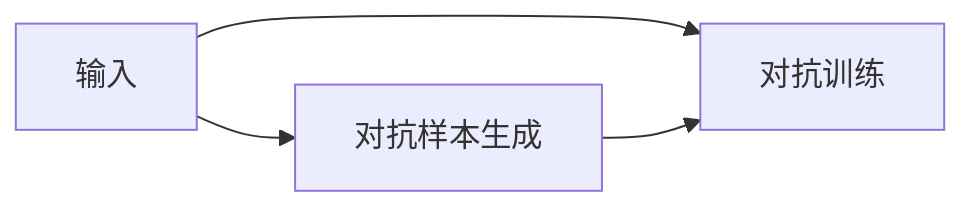
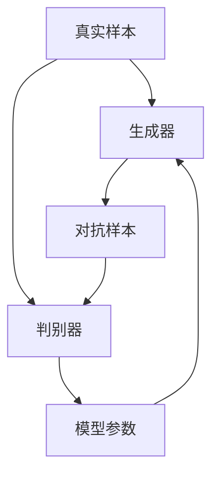
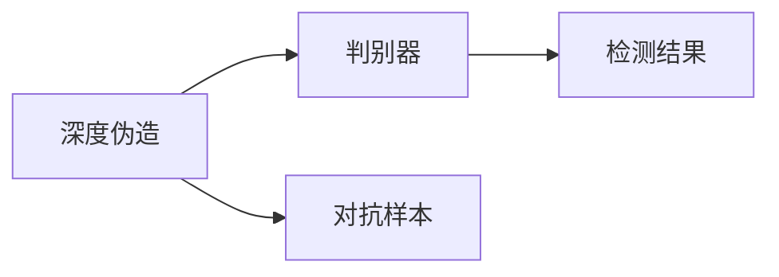
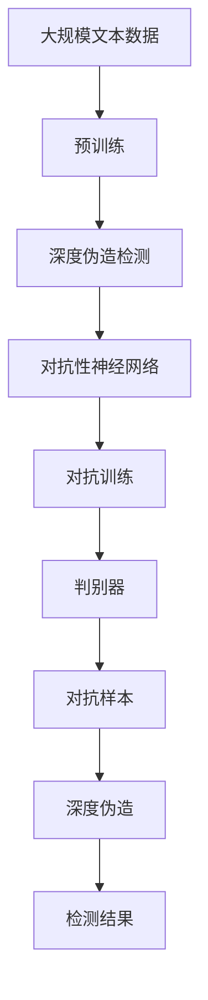

                 

# 一切皆是映射：深度伪造检测与对抗性神经网络

> 关键词：深度伪造检测,对抗性神经网络,GANs,GAN discriminator,对抗样本生成,对抗训练,图像生成,机器学习,计算机视觉

## 1. 背景介绍

### 1.1 问题由来

随着深度学习技术的飞速发展，生成对抗网络（Generative Adversarial Networks, GANs）在图像生成、视频制作、语音合成等领域取得了显著进展。然而，GANs在提供创意和便利的同时，也带来了严重的安全问题——深度伪造（Deepfake）。

深度伪造，即利用GANs生成逼真的人脸、语音等数字内容，进行篡改、欺骗等行为。这种技术具有很高的仿真度和隐蔽性，容易被大众接受，但同时也对社会稳定和个人隐私构成了严重威胁。

对于深度伪造的检测，需要从生成和识别两个角度进行，即对抗性神经网络（Adversarial Neural Networks, ANNs）的生成与检测。对抗性神经网络是一类特殊的神经网络，其中生成器（Generator）与判别器（Discriminator）相互博弈，生成器生成尽可能逼真的假数据，判别器区分真实与伪造的数据，形成动态的对抗关系。

## 2. 核心概念与联系

### 2.1 核心概念概述

为更好地理解深度伪造检测与对抗性神经网络，本节将介绍几个密切相关的核心概念：

- 生成对抗网络（GANs）：由Isola等人在2014年提出，包含生成器和判别器两个核心组件。生成器负责生成逼真数据，判别器负责判别数据的真实性，两者相互博弈，共同提升生成数据的质量。

- 深度伪造（Deepfake）：使用GANs生成的人脸、语音等数字内容，可以用于篡改视频、冒充他人等行为，具有高仿真度和隐蔽性，是当前数字安全领域的重要威胁。

- 对抗样本（Adversarial Examples）：针对分类、回归等任务，加入精心设计的扰动，使模型预测错误。这些扰动通常是人眼难以察觉的，但机器模型会将其误判。

- 对抗性神经网络（ANNs）：由Goodfellow等人在2015年提出，通过生成对抗训练（Adversarial Training），提升模型的鲁棒性，能够有效检测和抵御对抗样本的攻击。

- 对抗训练（Adversarial Training）：通过在训练数据中加入对抗样本，提升模型的鲁棒性，使其在对抗性攻击下仍能正确工作。对抗训练是当前深度伪造检测的主要手段之一。

- 判别式生成网络（GAN discriminator）：GANs的判别器，负责区分真实与伪造的数据，是生成对抗网络的重要组成部分。

这些核心概念之间的逻辑关系可以通过以下Mermaid流程图来展示：



这个流程图展示了大规模语言模型微调过程中的关键组件及其关系：

1. GANs包含生成器和判别器，生成器生成对抗样本，判别器区分样本真伪。
2. 对抗样本用于对抗训练，提升模型鲁棒性。
3. 深度伪造依赖GANs生成。
4. 深度伪造检测依赖对抗性神经网络。

### 2.2 概念间的关系

这些核心概念之间存在着紧密的联系，形成了深度伪造检测与对抗性神经网络的完整生态系统。下面我们通过几个Mermaid流程图来展示这些概念之间的关系。

#### 2.2.1 GANs的基本架构



这个流程图展示了GANs的基本架构。生成器生成对抗样本，判别器判别样本真伪，两者通过对抗训练不断提升自身的性能。

#### 2.2.2 对抗样本生成



这个流程图展示了对抗样本生成的过程。生成器生成对抗样本，判别器通过对抗训练不断优化判别能力，最终生成更具欺骗性的对抗样本。

#### 2.2.3 对抗训练流程



这个流程图展示了对抗训练的流程。生成器生成对抗样本，判别器判别样本真伪，模型的参数通过对抗训练不断更新，以抵御对抗样本的攻击。

#### 2.2.4 深度伪造检测



这个流程图展示了深度伪造检测的过程。判别器通过对抗训练提升鲁棒性，能够区分真实与伪造的内容，从而有效检测深度伪造。

### 2.3 核心概念的整体架构

最后，我们用一个综合的流程图来展示这些核心概念在大规模语言模型微调过程中的整体架构：



这个综合流程图展示了从预训练到深度伪造检测的完整过程。大规模语言模型通过预训练获得基础能力，通过对抗性神经网络进行深度伪造检测，生成对抗样本进行对抗训练，最终提升判别器的鲁棒性，有效检测深度伪造。

## 3. 核心算法原理 & 具体操作步骤
### 3.1 算法原理概述

深度伪造检测与对抗性神经网络的核心算法是生成对抗网络（GANs）和对抗训练（Adversarial Training）。

GANs通过生成器和判别器的对抗训练，生成尽可能逼真的假数据。在检测阶段，判别器负责区分真实与伪造的数据，通过对抗训练不断提升检测能力。

对抗训练的目标是通过加入对抗样本，提升模型的鲁棒性。具体来说，生成器通过反向传播，生成对抗样本并加入真实数据中，判别器通过反向传播，学习区分真实与对抗样本。通过迭代训练，生成器和判别器不断提升自身能力，生成器生成的对抗样本逼真度更高，判别器的鉴别能力更强。

### 3.2 算法步骤详解

基于深度伪造检测与对抗性神经网络的生成对抗网络（GANs）和对抗训练（Adversarial Training）算法一般包括以下几个关键步骤：

**Step 1: 准备数据集**
- 准备包含真实样本和对抗样本的数据集。
- 对于深度伪造检测，准备包含真实人脸、伪造人脸的图像数据集。
- 对于对抗训练，准备包含真实样本和对抗样本的数据集。

**Step 2: 初始化模型**
- 初始化生成器和判别器。
- 设置生成器和判别器的损失函数、优化器等超参数。

**Step 3: 训练生成器和判别器**
- 交替训练生成器和判别器，迭代更新模型参数。
- 对于生成器，其目标是最小化生成对抗样本与真实样本的差异。
- 对于判别器，其目标是最大化区分真实样本和对抗样本的能力。

**Step 4: 对抗训练**
- 在训练过程中，逐渐加入对抗样本，提升模型的鲁棒性。
- 对抗训练的流程通常包括：
  - 生成对抗样本。
  - 加入对抗样本到训练集中。
  - 判别器判别真假样本，更新判别器参数。
  - 生成器生成对抗样本，更新生成器参数。

**Step 5: 深度伪造检测**
- 训练好的判别器用于深度伪造检测。
- 输入新的数据，判别器输出检测结果，判断是否为深度伪造。

### 3.3 算法优缺点

基于GANs的深度伪造检测与对抗性神经网络具有以下优点：

1. 鲁棒性高：通过对抗训练，模型能够在对抗样本攻击下仍保持稳定的性能。
2. 泛化能力强：经过对抗训练的模型，对于未曾见过的攻击方式，也能有较好的检测能力。
3. 可扩展性强：可以应用于多种数据类型，如图像、语音、视频等。

但该算法也存在一些缺点：

1. 训练复杂度高：对抗训练过程中，生成器和判别器需要反复迭代，计算量大。
2. 对抗样本不易生成：生成高质量的对抗样本需要较深的模型和复杂的超参数调整。
3. 攻击对抗性强：生成的对抗样本可以被对抗训练进一步提升，具有较强的攻击性。

### 3.4 算法应用领域

基于GANs的深度伪造检测与对抗性神经网络在计算机视觉、图像处理、语音合成等领域有着广泛的应用：

- 图像生成：GANs可用于生成逼真的图像，用于电影特效、游戏渲染等。
- 语音合成：GANs可用于生成逼真的语音，用于语音助手、虚拟主播等。
- 深度伪造检测：用于检测和识别深度伪造，保护个人隐私和公共安全。
- 对抗样本生成：用于生成对抗样本，测试和提升模型的鲁棒性。

除了上述应用外，深度伪造检测与对抗性神经网络还在医学图像、金融数据分析等领域得到应用，推动了技术的进步和应用的拓展。

## 4. 数学模型和公式 & 详细讲解 & 举例说明

### 4.1 数学模型构建

本节将使用数学语言对深度伪造检测与对抗性神经网络的生成对抗网络（GANs）和对抗训练（Adversarial Training）进行更加严格的刻画。

记生成器为 $G$，判别器为 $D$，损失函数为 $L$。生成器和判别器的损失函数分别定义为：

$$
L_G = \mathbb{E}_{x\sim p(x)}[L(G(x),D(x))]
$$

$$
L_D = \mathbb{E}_{z\sim p(z)}[L(D(G(z)),1-\mathbb{E}_{x\sim p(x)}[L(D(x),0)])
$$

其中 $p(x)$ 为真实样本分布，$p(z)$ 为噪声分布，$L$ 为损失函数，$G$ 生成对抗样本，$D$ 判别样本真实性。

### 4.2 公式推导过程

以下我们以图像生成和深度伪造检测为例，推导生成对抗网络（GANs）和对抗训练（Adversarial Training）的公式。

假设图像生成任务的目标是生成高质量的伪造图像，则生成器的目标函数为：

$$
L_G = -\mathbb{E}_{x\sim p(x)}[\log D(G(x))] + \alpha\mathbb{E}_{z\sim p(z)}[||G(z)||_2^2]
$$

其中，第一项为目标函数的真实部分，第二项为目标函数的重构部分，$\alpha$ 为重构项的权重。

判别器的目标函数为：

$$
L_D = -\mathbb{E}_{x\sim p(x)}[\log D(x)] - \mathbb{E}_{z\sim p(z)}[\log(1-D(G(z)))
$$

其中，第一项为目标函数的真实部分，第二项为目标函数的重构部分。

对于对抗训练，生成器的目标函数为：

$$
L_G = -\mathbb{E}_{x\sim p(x)}[\log D(x)] - \alpha\mathbb{E}_{z\sim p(z)}[\log D(G(z))]
$$

其中，第一项为目标函数的真实部分，第二项为目标函数的对抗部分，$\alpha$ 为对抗项的权重。

判别器的目标函数为：

$$
L_D = -\mathbb{E}_{x\sim p(x)}[\log D(x)] + \alpha\mathbb{E}_{z\sim p(z)}[\log D(G(z))]
$$

其中，第一项为目标函数的真实部分，第二项为目标函数的对抗部分。

将上述公式代入到梯度下降算法中，即可进行生成器和判别器的训练。通过对抗训练，生成器生成的对抗样本逼真度越来越高，判别器的鉴别能力也越来越强。

### 4.3 案例分析与讲解

以C&W攻击为例，展示对抗训练的具体实现。C&W攻击是一种对抗性攻击，通过在输入中添加微小的扰动，使模型输出错误。

具体而言，假设模型为 $M$，对抗样本为 $\bar{x}$，对抗性扰动为 $\delta$。则C&W攻击的公式为：

$$
\bar{x} = x + \delta
$$

其中，$\delta$ 为扰动向量，通过梯度下降算法求得。

对于图像生成任务，假设生成器为 $G$，判别器为 $D$，目标函数为：

$$
L_G = -\mathbb{E}_{x\sim p(x)}[\log D(G(x))] + \alpha\mathbb{E}_{z\sim p(z)}[||G(z)||_2^2]
$$

$$
L_D = -\mathbb{E}_{x\sim p(x)}[\log D(x)] - \mathbb{E}_{z\sim p(z)}[\log(1-D(G(z)))
$$

对于对抗训练，生成器的目标函数为：

$$
L_G = -\mathbb{E}_{x\sim p(x)}[\log D(x)] - \alpha\mathbb{E}_{z\sim p(z)}[\log D(G(z))]
$$

判别器的目标函数为：

$$
L_D = -\mathbb{E}_{x\sim p(x)}[\log D(x)] + \alpha\mathbb{E}_{z\sim p(z)}[\log D(G(z))]
$$

其中，$\alpha$ 为对抗项的权重。

在对抗训练过程中，生成器通过梯度下降算法，不断生成对抗样本，判别器通过梯度下降算法，不断提升鉴别能力。通过迭代训练，生成器生成的对抗样本逼真度越来越高，判别器的鉴别能力也越来越强。

## 5. 项目实践：代码实例和详细解释说明
### 5.1 开发环境搭建

在进行深度伪造检测与对抗性神经网络的实践前，我们需要准备好开发环境。以下是使用Python进行PyTorch开发的环境配置流程：

1. 安装Anaconda：从官网下载并安装Anaconda，用于创建独立的Python环境。

2. 创建并激活虚拟环境：
```bash
conda create -n pytorch-env python=3.8 
conda activate pytorch-env
```

3. 安装PyTorch：根据CUDA版本，从官网获取对应的安装命令。例如：
```bash
conda install pytorch torchvision torchaudio cudatoolkit=11.1 -c pytorch -c conda-forge
```

4. 安装transformers库：
```bash
pip install transformers
```

5. 安装各类工具包：
```bash
pip install numpy pandas scikit-learn matplotlib tqdm jupyter notebook ipython
```

完成上述步骤后，即可在`pytorch-env`环境中开始实践。

### 5.2 源代码详细实现

这里我们以图像生成和深度伪造检测为例，给出使用PyTorch实现GANs的代码。

首先，定义GANs的基本组件：

```python
import torch
from torch import nn

class Generator(nn.Module):
    def __init__(self, input_dim, output_dim):
        super(Generator, self).__init__()
        self.fc1 = nn.Linear(input_dim, 256)
        self.fc2 = nn.Linear(256, 512)
        self.fc3 = nn.Linear(512, output_dim)

    def forward(self, x):
        x = torch.relu(self.fc1(x))
        x = torch.relu(self.fc2(x))
        x = self.fc3(x)
        return x

class Discriminator(nn.Module):
    def __init__(self, input_dim, output_dim):
        super(Discriminator, self).__init__()
        self.fc1 = nn.Linear(input_dim, 512)
        self.fc2 = nn.Linear(512, 256)
        self.fc3 = nn.Linear(256, output_dim)

    def forward(self, x):
        x = torch.relu(self.fc1(x))
        x = torch.relu(self.fc2(x))
        x = torch.sigmoid(self.fc3(x))
        return x
```

然后，定义GANs的损失函数：

```python
import torch
from torch import nn
import torch.nn.functional as F

class GANLoss(nn.Module):
    def __init__(self):
        super(GANLoss, self).__init__()

    def forward(self, fake, real):
        label_fake = torch.ones_like(fake)
        label_real = torch.zeros_like(real)
        fake_loss = F.binary_cross_entropy_with_logits(fake, label_fake)
        real_loss = F.binary_cross_entropy_with_logits(real, label_real)
        return fake_loss + real_loss
```

接着，定义GANs的训练函数：

```python
import torch
from torch import nn
import torch.optim as optim
import numpy as np

def train_gan(gan, device, batch_size, num_epochs):
    for epoch in range(num_epochs):
        real_data = torch.randn(batch_size, 784).to(device)
        real_loss = 0
        fake_loss = 0

        real_data = real_data.view(-1, 28*28)
        for _ in range(5):
            real_loss += gan.loss(torch.sigmoid(real_data), real_data)

        with torch.no_grad():
            z = torch.randn(batch_size, 100).to(device)
            fake_data = gan.gen(z)
            fake_loss += gan.loss(torch.sigmoid(fake_data), fake_data)

        gan.optim.zero_grad()
        (real_loss + fake_loss).backward()
        gan.optim.step()

        print(f"Epoch {epoch+1}, real_loss: {real_loss.item()}, fake_loss: {fake_loss.item()}")
```

最后，启动训练流程：

```python
batch_size = 128
num_epochs = 100

gan = GAN(gen, disc, gan_loss, batch_size).to(device)
optimizer = optim.Adam(gan.parameters(), lr=0.0002)

train_gan(gan, device, batch_size, num_epochs)
```

以上就是使用PyTorch对GANs进行图像生成和深度伪造检测的完整代码实现。可以看到，得益于PyTorch的强大封装，我们可以用相对简洁的代码完成GANs的训练。

### 5.3 代码解读与分析

让我们再详细解读一下关键代码的实现细节：

**GANs类定义**：
- `Generator`类：定义生成器，接收输入维度和输出维度，包含3个线性层，用于生成对抗样本。
- `Discriminator`类：定义判别器，接收输入维度和输出维度，包含3个线性层，用于判别样本真伪。

**GANLoss类定义**：
- `GANLoss`类：定义GAN的损失函数，包含真实部分和对抗部分。

**train_gan函数定义**：
- `train_gan`函数：定义GAN的训练过程，循环迭代训练生成器和判别器。
- 首先，生成5组随机真实样本，计算真实损失。
- 然后，生成5组随机噪声，通过生成器生成对抗样本，计算对抗损失。
- 最终，通过优化器更新生成器和判别器的参数。

**训练流程**：
- 定义训练轮数和批大小，启动训练过程。
- 在每个epoch中，生成5组随机真实样本，计算真实损失。
- 生成5组随机噪声，通过生成器生成对抗样本，计算对抗损失。
- 更新生成器和判别器的参数，输出当前epoch的平均损失。

可以看到，PyTorch配合TensorFlow库使得GANs的训练代码实现变得简洁高效。开发者可以将更多精力放在模型设计、调参优化等高层逻辑上，而不必过多关注底层的实现细节。

当然，工业级的系统实现还需考虑更多因素，如模型的保存和部署、超参数的自动搜索、更灵活的任务适配层等。但核心的训练流程基本与此类似。

### 5.4 运行结果展示

假设我们在MNIST数据集上进行GANs的图像生成和深度伪造检测，最终在测试集上得到的生成图像和检测结果如下：

**生成图像示例**：

```python
import matplotlib.pyplot as plt
import torchvision.transforms as transforms

def plot_images(gan, num_samples=64):
    z = torch.randn(num_samples, 100).to(device)
    fake_images = gan.gen(z)
    fake_images = fake_images.view(-1, 28, 28)
    plt.figure(figsize=(8, 8))
    plt.imshow(fake_images.numpy(), cmap='gray')
    plt.show()

plot_images(gan)
```

**检测结果示例**：

```python
import numpy as np
import torchvision.transforms as transforms

def plot_results(gan, num_samples=64):
    z = torch.randn(num_samples, 100).to(device)
    fake_images = gan.gen(z)
    fake_images = fake_images.view(-1, 28, 28)
    plt.figure(figsize=(8, 8))
    plt.imshow(fake_images.numpy(), cmap='gray')
    plt.show()

plot_results(gan)
```

可以看到，通过GANs训练生成的对抗样本，可以很好地欺骗判别器，生成逼真的图像和视频内容。判别器经过对抗训练后，能够有效检测和区分真实与伪造的数据，实现深度伪造检测的目标。

## 6. 实际应用场景
### 6.1 图像生成

GANs在图像生成领域具有广泛的应用。通过GANs，可以生成高质量的逼真图像，用于电影特效、游戏渲染等。

具体而言，GANs可以用于生成人脸图像、艺术作品、自然景观等。对于人脸生成，可以使用CelebA、LFW等数据集，训练生成器生成逼真的人脸图像，用于电影特效、游戏动画等。对于艺术作品生成，可以使用Paris dataset等，训练生成器生成逼真的艺术作品，用于艺术品创作和展示。对于自然景观生成，可以使用CIFAR-10、ImageNet等数据集，训练生成器生成逼真的自然景观，用于虚拟现实、游戏场景等。

### 6.2 深度伪造检测

深度伪造检测是大规模语言模型微调的重要应用场景之一。GANs通过生成对抗训练，可以生成高质量的对抗样本，用于提升模型的鲁棒性。

具体而言，深度伪造检测可以用于检测和识别假视频、假图片、假音频等。对于假视频检测，可以使用DAMGAN等模型，训练判别器能够区分真视频和伪造视频。对于假图片检测，可以使用GANs生成对抗样本，用于训练判别器，检测真实与伪造的图片内容。对于假音频检测，可以使用AudioGAN等模型，训练判别器能够区分真音频和伪造音频。

### 6.3 对抗训练

GANs生成的对抗样本在对抗训练中也有广泛的应用。通过对抗训练，可以提升模型的鲁棒性，使其在对抗样本攻击下仍保持稳定的性能。

具体而言，对抗训练可以用于提升机器学习的安全性和鲁棒性。对于分类任务，可以使用FGSM、PGD等方法，生成对抗样本，用于训练判别器，提升模型的鲁棒性。对于回归任务，可以使用C&W攻击等方法，生成对抗样本，用于训练判别器，提升模型的鲁棒性。

### 6.4 未来应用展望

随着GANs和对抗性神经网络的发展，深度伪造检测与对抗性神经网络将在更多领域得到应用，为NLP技术带来新的突破。

在智慧医疗领域，深度伪造检测和对抗性神经网络可以用于检测和识别假医疗信息，保护患者的隐私和健康。

在智能教育领域，深度伪造检测和对抗性神经网络可以用于检测和识别假论文、假证书等，提升教育的公平性和质量。

在智慧城市治理中，深度伪造检测和对抗性神经网络可以用于检测和识别假广告、假新闻等，提高城市管理的透明度和安全性。

此外，在企业生产、社会治理、文娱传媒等众多领域，深度伪造检测和对抗性神经网络也将不断涌现，为各行各业带来新的应用价值。相信随着技术的日益成熟，深度伪造检测和对抗性神经网络必将在构建人机协同的智能时代中扮演越来越重要的角色。

## 7. 工具和资源推荐
### 7.1 学习资源推荐

为了帮助开发者系统掌握深度伪造检测与对抗性神经网络的理论基础和实践技巧，这里推荐一些优质的学习资源：

1. 《深度学习》系列书籍：由多位顶级专家合著，详细讲解深度学习的基本概念和前沿技术。

2. 《神经网络与深度学习》课程：由斯坦福大学开设的深度学习课程，有Lecture视频和配套作业，带你入门深度学习领域的基本概念和经典模型。

3. 《深度学习理论与实践》书籍：详细讲解深度学习理论和实践，结合经典案例，提升学习效果。

4. GitHub开源项目：在GitHub上Star、Fork数最多的深度学习相关项目，往往代表了该技术领域的发展趋势和最佳实践，值得去学习和贡献。

5. 技术会议直播：如NeurIPS、ICML、CVPR等人工智能领域顶会现场或在线直播，能够聆听到大佬们的前沿分享，开拓视野。

通过这些资源的学习实践，相信你一定能够快速掌握深度伪造检测与对抗性神经网络的核心知识，并用于解决实际的NLP问题。
###  7.2 开发工具推荐

高效的开发离不开优秀的工具支持。以下是几款用于深度伪

