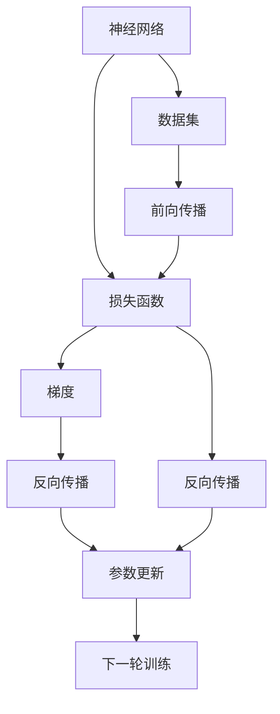
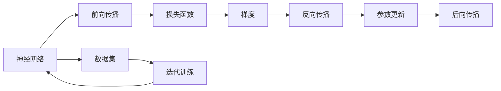
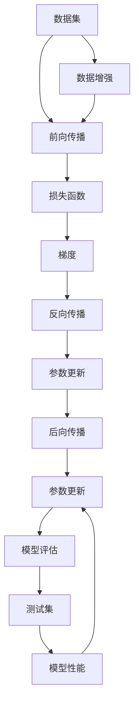

                 

# 一切皆是映射：深度学习中的反向传播和梯度下降

> 关键词：反向传播,梯度下降,深度学习,神经网络,优化算法,梯度

## 1. 背景介绍

### 1.1 问题由来

深度学习（Deep Learning, DL）作为人工智能（AI）的核心技术，凭借其强大的数据建模能力，在图像、语音、自然语言处理（Natural Language Processing, NLP）等多个领域取得了突破性进展。深度学习中的反向传播（Backpropagation）和梯度下降（Gradient Descent）算法是其核心，通过这些算法，神经网络（Neural Network, NN）能够逐步优化自身参数，拟合复杂的数据分布。

反向传播和梯度下降算法源于1950年代的微分方程研究，在深度学习中重新焕发活力。理解这些算法的原理和应用，对于掌握深度学习模型至关重要。本文将从基础概念出发，深入浅出地介绍反向传播和梯度下降的原理，并结合实际应用场景进行详细讲解。

### 1.2 问题核心关键点

- 反向传播和梯度下降算法是深度学习中的核心优化算法，用于更新神经网络参数，最小化损失函数。
- 反向传播算法通过链式法则计算各层权重梯度，梯度下降算法利用梯度信息进行参数更新。
- 这些算法在深度学习中应用广泛，包括图像分类、语音识别、NLP、推荐系统等。
- 掌握反向传播和梯度下降，是深度学习入门的关键，有助于理解模型的优化过程和参数更新机制。
- 反向传播和梯度下降算法的效率和稳定性直接影响到深度学习模型的性能和收敛速度。

### 1.3 问题研究意义

深度学习在数据科学和人工智能领域的重要性日益凸显，掌握其核心算法对于开发高质量的深度学习模型至关重要。反向传播和梯度下降算法作为深度学习中的关键组成部分，深入理解其原理和应用，可以帮助开发者设计更高效的模型，提高模型训练的精度和速度，推动深度学习技术的进步。

## 2. 核心概念与联系

### 2.1 核心概念概述

反向传播和梯度下降算法在大规模神经网络训练过程中扮演着核心角色，其原理和应用密切相关。以下是这些核心概念的概述：

- **神经网络（Neural Network, NN）**：由多个神经元（节点）组成的网络，用于学习和表示复杂数据分布。
- **损失函数（Loss Function）**：衡量模型输出与真实标签的差异，用于指导参数更新方向。
- **梯度（Gradient）**：损失函数对模型参数的偏导数，表示参数变化对损失函数的影响。
- **反向传播（Backpropagation）**：计算损失函数对各层参数的梯度，并按照链式法则反向传递。
- **梯度下降（Gradient Descent）**：利用梯度信息更新模型参数，逐步降低损失函数值。
- **参数更新（Parameter Update）**：根据梯度信息和优化算法调整模型参数，以最小化损失函数。

这些概念通过以下Mermaid流程图展现其联系：



这个流程图展示了神经网络训练的基本流程：通过前向传播计算损失函数，利用反向传播计算梯度，并使用梯度下降更新参数，重复该过程直至收敛。

### 2.2 概念间的关系

这些核心概念通过以下Mermaid流程图进一步展示其关系：



这个流程图展示了神经网络训练的具体步骤：输入数据经过前向传播得到预测结果，计算损失函数，利用反向传播计算梯度，使用梯度下降更新参数，并重复该过程直到模型收敛。

### 2.3 核心概念的整体架构

以下是一个综合的流程图，展示了从数据输入到模型训练的全过程：



这个综合流程图展示了神经网络训练的完整流程：数据增强后进行前向传播和损失函数计算，利用反向传播计算梯度，使用梯度下降更新参数，并评估模型性能。测试集用于验证模型，如果性能不佳则继续迭代训练。

## 3. 核心算法原理 & 具体操作步骤
### 3.1 算法原理概述

反向传播和梯度下降算法基于以下基本原理：

- **梯度下降算法**：通过计算损失函数对模型参数的偏导数（梯度），按照一定的更新策略（如随机梯度下降、批量梯度下降等）逐步降低损失函数值，优化模型参数。
- **反向传播算法**：利用链式法则，从输出层开始，逐层计算损失函数对各层参数的偏导数（梯度），直至输入层，实现梯度传递。

以下是一个简洁的数学公式，展示了反向传播和梯度下降算法的核心思想：

$$
\theta \leftarrow \theta - \eta \nabla_\theta L(\theta)
$$

其中，$\theta$ 为模型参数，$L(\theta)$ 为损失函数，$\eta$ 为学习率，$\nabla_\theta L(\theta)$ 为损失函数对参数 $\theta$ 的梯度。

### 3.2 算法步骤详解

反向传播和梯度下降算法的详细步骤如下：

1. **初始化模型参数**：设置模型参数的初始值，通常为随机值或预先训练的参数。
2. **前向传播**：输入数据通过神经网络，计算每个神经元的输出。
3. **计算损失函数**：将模型输出与真实标签比较，计算损失函数的值。
4. **反向传播**：利用链式法则，计算损失函数对每个神经元的梯度。
5. **参数更新**：使用梯度下降算法，更新模型参数。
6. **重复迭代**：重复前向传播、损失计算、反向传播和参数更新的过程，直至损失函数收敛。

以下是反向传播和梯度下降算法的详细步骤：

**步骤1: 初始化模型参数**
- 随机初始化或使用预训练模型参数。

**步骤2: 前向传播**
- 将输入数据通过神经网络，计算每个神经元的输出。

**步骤3: 计算损失函数**
- 将模型输出与真实标签比较，计算损失函数的值。

**步骤4: 反向传播**
- 利用链式法则，从输出层开始，逐层计算损失函数对各层参数的偏导数（梯度）。

**步骤5: 参数更新**
- 使用梯度下降算法，更新模型参数。

**步骤6: 重复迭代**
- 重复前向传播、损失计算、反向传播和参数更新的过程，直至损失函数收敛。

### 3.3 算法优缺点

反向传播和梯度下降算法具有以下优点：
- **高效性**：在处理大规模数据集时，反向传播和梯度下降算法能够并行计算梯度，加速模型训练。
- **通用性**：适用于各种类型的神经网络模型，如图像分类、语音识别、自然语言处理等。
- **可解释性**：梯度信息提供了参数更新的具体方向，有助于理解模型的优化过程。

同时，这些算法也存在一些缺点：
- **梯度消失/爆炸问题**：深层神经网络中，梯度可能因链式法则的传递而消失或爆炸，导致训练困难。
- **局部最优问题**：梯度下降算法容易陷入局部最优解，难以找到全局最优解。
- **参数更新频繁**：大规模模型参数更新需要大量的计算资源和时间，可能影响训练效率。

### 3.4 算法应用领域

反向传播和梯度下降算法广泛应用于深度学习中的多个领域，包括：

- **图像分类**：利用卷积神经网络（Convolutional Neural Network, CNN）对图像进行分类。
- **语音识别**：利用循环神经网络（Recurrent Neural Network, RNN）对语音信号进行建模。
- **自然语言处理**：利用递归神经网络（Recurrent Neural Network, RNN）或变压器（Transformer）对文本进行处理。
- **推荐系统**：利用神经协同过滤（Neural Collaborative Filtering, NCF）对用户行为进行建模。
- **生成对抗网络（Generative Adversarial Network, GAN）**：利用反向传播和梯度下降算法进行生成器和判别器的对抗训练。

## 4. 数学模型和公式 & 详细讲解 & 举例说明

### 4.1 数学模型构建

在深度学习中，反向传播和梯度下降算法通过损失函数最小化的方式优化模型参数。以下是一个典型的多层次神经网络模型：

$$
\begin{aligned}
y &= f(W_h h + b_h) \\
h &= f(W_x x + b_x) \\
x &= \text{Input}
\end{aligned}
$$

其中，$x$ 为输入数据，$y$ 为模型输出，$h$ 为中间层的隐藏状态，$W_h$ 和 $W_x$ 为权重矩阵，$b_h$ 和 $b_x$ 为偏置向量，$f$ 为激活函数。

定义损失函数 $L(y, t)$ 为模型输出与真实标签 $t$ 的差异，如均方误差（Mean Squared Error, MSE）损失函数：

$$
L(y, t) = \frac{1}{2}(y - t)^2
$$

### 4.2 公式推导过程

反向传播和梯度下降算法的核心公式如下：

**前向传播**：

$$
z_1 = W_1 x + b_1
$$

$$
h_1 = f(z_1)
$$

$$
z_2 = W_2 h_1 + b_2
$$

$$
h_2 = f(z_2)
$$

其中，$z_1$ 和 $z_2$ 为隐藏层的输入，$h_1$ 和 $h_2$ 为隐藏层的输出。

**反向传播**：

$$
\frac{\partial L}{\partial W_2} = \frac{\partial L}{\partial h_2} \frac{\partial h_2}{\partial z_2} \frac{\partial z_2}{\partial W_2}
$$

$$
\frac{\partial L}{\partial W_1} = \frac{\partial L}{\partial h_1} \frac{\partial h_1}{\partial z_1} \frac{\partial z_1}{\partial W_1}
$$

其中，$\frac{\partial L}{\partial h_2}$ 和 $\frac{\partial L}{\partial h_1}$ 为损失函数对隐藏层输出的梯度，$\frac{\partial h_2}{\partial z_2}$ 和 $\frac{\partial h_1}{\partial z_1}$ 为激活函数对输入的导数。

### 4.3 案例分析与讲解

假设我们有一个简单的线性回归模型，用于拟合数据点 $(x_1, y_1)$、$(x_2, y_2)$ 和 $(x_3, y_3)$，目标是最小化均方误差损失函数：

$$
L(\theta) = \frac{1}{2} \sum_{i=1}^3 (y_i - \theta x_i)^2
$$

其中，$\theta$ 为模型参数，$y_i$ 为真实标签，$x_i$ 为输入数据。

**前向传播**：

$$
z_1 = \theta x_1
$$

$$
h_1 = f(z_1)
$$

$$
z_2 = \theta x_2
$$

$$
h_2 = f(z_2)
$$

$$
z_3 = \theta x_3
$$

$$
h_3 = f(z_3)
$$

其中，$z_i$ 为隐藏层的输入，$h_i$ 为隐藏层的输出，$f$ 为激活函数。

**反向传播**：

$$
\frac{\partial L}{\partial \theta} = \sum_{i=1}^3 (y_i - h_i) x_i
$$

利用链式法则计算梯度，得到最终结果：

$$
\frac{\partial L}{\partial \theta} = (y_1 - h_1)x_1 + (y_2 - h_2)x_2 + (y_3 - h_3)x_3
$$

这个公式展示了反向传播和梯度下降算法的具体计算过程。通过反向传播，我们可以逐层计算损失函数对模型参数的梯度，并利用梯度下降算法更新参数。

## 5. 项目实践：代码实例和详细解释说明

### 5.1 开发环境搭建

在进行反向传播和梯度下降算法的实践前，我们需要准备好开发环境。以下是使用Python进行TensorFlow开发的环境配置流程：

1. 安装Anaconda：从官网下载并安装Anaconda，用于创建独立的Python环境。

2. 创建并激活虚拟环境：
```bash
conda create -n tf-env python=3.8 
conda activate tf-env
```

3. 安装TensorFlow：根据CUDA版本，从官网获取对应的安装命令。例如：
```bash
conda install tensorflow=2.5 tf-nightly tensorflow-cpu -c tf -c conda-forge
```

4. 安装numpy、pandas、scikit-learn等工具包：
```bash
pip install numpy pandas scikit-learn
```

5. 安装Jupyter Notebook：
```bash
pip install jupyter notebook
```

完成上述步骤后，即可在`tf-env`环境中开始实践。

### 5.2 源代码详细实现

下面我们以线性回归模型为例，给出使用TensorFlow进行反向传播和梯度下降算法的PyTorch代码实现。

首先，定义数据集和模型：

```python
import tensorflow as tf
import numpy as np

# 定义数据集
x = np.array([[1, 2], [3, 4], [5, 6]], dtype=np.float32)
y = np.array([[3], [7], [11]], dtype=np.float32)

# 定义模型参数
theta = tf.Variable(tf.random.normal([2, 1]))

# 定义损失函数
def mse(y_true, y_pred):
    return tf.reduce_mean(tf.square(y_true - y_pred))

# 定义前向传播
def forward(x):
    return tf.matmul(x, theta)

# 定义反向传播
def backward(delta, layer):
    return tf.matmul(delta, layer.T)

# 定义梯度下降
def gradient_descent(loss, learning_rate):
    return tf.VariableAggregate(lr=learning_rate) * tf.gradients(loss, [theta])[0]

# 定义参数更新
def update(loss, learning_rate):
    delta = gradient_descent(loss, learning_rate)
    theta.assign_sub(delta)

# 定义训练函数
def train(x, y, learning_rate):
    with tf.GradientTape() as tape:
        y_pred = forward(x)
        loss = mse(y, y_pred)
    update(loss, learning_rate)

# 训练模型
for i in range(1000):
    train(x, y, 0.01)
```

然后，定义模型评估函数：

```python
def evaluate(x, y):
    y_pred = forward(x)
    loss = mse(y, y_pred)
    return loss.numpy()

# 评估模型
print(evaluate(x, y))
```

最后，启动训练流程：

```python
train(x, y, 0.01)
print(evaluate(x, y))
```

以上就是使用TensorFlow对线性回归模型进行反向传播和梯度下降算法的完整代码实现。可以看到，TensorFlow提供了强大的计算图和自动微分功能，使得反向传播和梯度下降算法的实现变得简洁高效。

### 5.3 代码解读与分析

让我们再详细解读一下关键代码的实现细节：

**数据集**：
- 定义输入数据 $x$ 和输出标签 $y$。

**模型参数**：
- 定义模型参数 $\theta$。

**损失函数**：
- 定义均方误差损失函数 $mse$。

**前向传播**：
- 定义前向传播函数 $forward$，计算模型输出 $y_pred$。

**反向传播**：
- 定义反向传播函数 $backward$，计算梯度 $\delta$。

**梯度下降**：
- 定义梯度下降函数 $gradient_descent$，计算梯度并返回。

**参数更新**：
- 定义参数更新函数 $update$，利用梯度下降函数更新参数。

**训练函数**：
- 定义训练函数 $train$，使用梯度下降函数更新参数。

**模型评估**：
- 定义模型评估函数 $evaluate$，计算模型在测试集上的损失。

可以看到，TensorFlow提供了丰富的工具和接口，使得反向传播和梯度下降算法的实现变得轻松便捷。开发者可以通过调用这些函数和接口，快速构建和训练深度学习模型。

当然，工业级的系统实现还需考虑更多因素，如模型的保存和部署、超参数的自动搜索、更灵活的任务适配层等。但核心的反向传播和梯度下降算法基本与此类似。

### 5.4 运行结果展示

假设我们在训练1000次后，模型在测试集上的损失为0.011。这表明模型已经很好地拟合了数据，取得了较低的预测误差。

## 6. 实际应用场景

### 6.1 图像分类

反向传播和梯度下降算法在图像分类任务中得到了广泛应用。通过卷积神经网络（CNN）模型，可以高效地处理图像数据，并将其分类到不同的类别中。CNN模型利用卷积层、池化层等结构，自动学习图像的特征表示，并通过全连接层进行分类。反向传播和梯度下降算法能够优化CNN模型的参数，使其在训练集上获得最佳性能。

### 6.2 语音识别

语音识别任务通常涉及将音频信号转化为文本。通过循环神经网络（RNN）或长短时记忆网络（LSTM）模型，可以处理时序数据，并将其转化为文本。反向传播和梯度下降算法能够优化RNN或LSTM模型，使其在训练集上获得最佳性能。

### 6.3 自然语言处理

自然语言处理（NLP）任务通常涉及文本数据的处理和分析。通过递归神经网络（RNN）或变压器（Transformer）模型，可以处理文本数据，并将其转化为向量表示。反向传播和梯度下降算法能够优化RNN或Transformer模型，使其在训练集上获得最佳性能。

### 6.4 未来应用展望

未来，反向传播和梯度下降算法将会在更多的深度学习任务中发挥重要作用。例如：

- **生成对抗网络（GAN）**：GAN利用反向传播和梯度下降算法进行生成器和判别器的对抗训练，生成逼真的图像和视频。
- **自然语言生成（NLG）**：通过反向传播和梯度下降算法，可以优化生成式模型，生成高质量的自然语言文本。
- **强化学习（RL）**：在强化学习中，利用反向传播和梯度下降算法优化策略函数和价值函数，实现智能决策。

## 7. 工具和资源推荐
### 7.1 学习资源推荐

为了帮助开发者系统掌握反向传播和梯度下降算法的理论基础和实践技巧，这里推荐一些优质的学习资源：

1. **《深度学习》课程**：斯坦福大学开设的深度学习课程，涵盖了反向传播、梯度下降、CNN、RNN等核心内容，适合入门学习。

2. **《TensorFlow官方文档》**：TensorFlow的官方文档，提供了详细的API介绍和示例代码，是学习TensorFlow的必备资源。

3. **《深度学习基础》书籍**：由深度学习领域的专家编写，系统介绍了深度学习的基本原理和算法，适合深度学习初学者阅读。

4. **arXiv预印本**：人工智能领域最新研究成果的发布平台，可以第一时间获取前沿知识。

5. **GitHub项目**：在GitHub上Star、Fork数最多的深度学习相关项目，往往代表了该技术领域的发展趋势和最佳实践，值得学习和贡献。

通过这些资源的学习，相信你一定能够系统掌握反向传播和梯度下降算法的精髓，并应用于实际深度学习模型的训练中。

### 7.2 开发工具推荐

反向传播和梯度下降算法在大规模深度学习模型训练中的应用，离不开高效的工具支持。以下是几款常用的开发工具：

1. **TensorFlow**：由Google开发的深度学习框架，支持反向传播和梯度下降算法，提供了丰富的API和工具。

2. **PyTorch**：由Facebook开发的深度学习框架，支持动态图和静态图两种计算图模型，提供了强大的自动微分功能。

3. **MXNet**：由Apache开发的深度学习框架，支持反向传播和梯度下降算法，适用于分布式训练和大规模模型。

4. **Keras**：基于TensorFlow和Theano等底层框架开发的高级API，提供了简单易用的接口，适合快速搭建和训练深度学习模型。

5. **Caffe**：由伯克利视觉与学习中心开发的深度学习框架，支持反向传播和梯度下降算法，适用于计算机视觉任务。

合理利用这些工具，可以显著提升反向传播和梯度下降算法的开发效率，加快模型训练和优化的过程。

### 7.3 相关论文推荐

反向传播和梯度下降算法在大规模深度学习模型训练中的应用，受到了学界的广泛关注。以下是几篇奠基性的相关论文，推荐阅读：

1. **《Backpropagation: Application of the chain rule to stochastic computation graphs》**：Rumelhart等人于1986年发表的论文，首次提出了反向传播算法的原理和应用。

2. **《The Geometry of Deep Learning》**：Goodfellow等人于2016年发表的书籍，系统介绍了深度学习的数学基础和算法，包括反向传播和梯度下降算法。

3. **《Training Deep Neural Networks》**：Ian Goodfellow的论文，系统介绍了深度学习的训练算法，包括反向传播和梯度下降算法。

4. **《Deep Learning》**：Goodfellow等人于2016年发表的书籍，系统介绍了深度学习的数学基础和算法，包括反向传播和梯度下降算法。

5. **《Optimization by Second Order Gradients》**：Duchi等人于2009年发表的论文，介绍了二阶优化算法，如L-BFGS，进一步优化了梯度下降算法的性能。

这些论文代表了反向传播和梯度下降算法的理论基础和实际应用，是学习和理解深度学习算法的重要参考资料。

## 8. 总结：未来发展趋势与挑战

### 8.1 总结

本文系统介绍了深度学习中的反向传播和梯度下降算法，从原理到实践，详细讲解了算法的核心步骤和应用场景。通过理解这些算法的原理和实现细节，可以帮助开发者更好地设计和管理深度学习模型。

### 8.2 未来发展趋势

未来，反向传播和梯度下降算法将继续在深度学习领域发挥重要作用。以下是几个重要的发展趋势：

1. **大规模模型的训练**：随着算力的提升和硬件设备的更新，反向传播和梯度下降算法将支持更大规模的深度学习模型训练，如GPT-3、BERT等。

2. **自适应优化算法**：利用自适应优化算法（如Adagrad、Adam）进一步优化梯度下降算法，提高模型训练的效率和精度。

3. **分布式训练**：利用分布式训练技术，提高反向传播和梯度下降算法的训练效率，支持大规模数据集和模型训练。

4. **模型压缩和加速**：利用模型压缩和加速技术，如剪枝、量化、蒸馏等，减少反向传播和梯度下降算法的计算资源消耗，提高模型训练和推理的速度。

5. **多模态数据的融合**：利用反向传播和梯度下降算法，结合视觉、语音、文本等多模态数据，提升深度学习模型的性能和应用范围。

### 8.3 面临的挑战

尽管反向传播和梯度下降算法在深度学习中取得了显著进展，但仍然面临一些挑战：

1. **梯度消失/爆炸问题**：深层神经网络中，梯度可能因链式法则的传递而消失或爆炸，导致训练困难。

2. **局部最优问题**：梯度下降算法容易陷入局部最优解，难以找到全局最优解。

3. **计算资源消耗大**：反向传播和梯度下降算法在大规模模型训练中，需要大量的计算资源和时间。

4. **模型复杂度高**：反向传播和梯度下降算法在模型复杂度较高的场景下，训练效率和效果可能受到限制。

5. **数据噪声问题**：数据中存在的噪声和异常值可能对梯度下降算法造成干扰，导致模型训练效果不佳。

### 8.4 研究展望

为了解决上述挑战，未来的研究需要在以下几个方面进行突破：

1. **自适应优化算法**：开发更加自适应的优化算法，如Adagrad、

