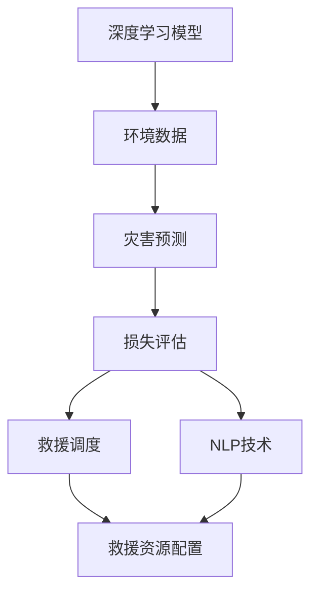

                 

# 一切皆是映射：深度学习在灾害预防与响应中的应用

> 关键词：
- 深度学习
- 灾害预测
- 环境监测
- 损失评估
- 救援调度
- 自然语言处理

## 1. 背景介绍

### 1.1 问题由来

随着全球气候变化和人类活动的加剧，自然灾害频发，给人类社会带来巨大威胁。传统的灾害预防与响应主要依赖人工判断和经验，耗时长、效率低，且存在较大不确定性。然而，随着深度学习技术的发展，其强大的数据处理和模式识别能力，为灾害预防与响应带来了新的思路和方法。

深度学习模型能够通过大量数据学习复杂的非线性关系，在灾害预测、环境监测、损失评估、救援调度等领域展现出显著优势。这不仅提高了灾害应对的准确性和及时性，也大幅降低了人力物力成本。

### 1.2 问题核心关键点

深度学习在灾害预防与响应中的应用主要集中在以下几个方面：

- **灾害预测**：利用时间序列数据、气象数据等预测灾害发生的可能性及其规模。
- **环境监测**：实时监测自然环境变化，及时发现灾害预警信号。
- **损失评估**：通过地理信息系统（GIS）和卫星遥感数据，评估灾害造成的损失。
- **救援调度**：利用优化算法和地理数据，合理分配救援资源，提高救援效率。
- **自然语言处理**：通过文本数据，实时获取灾害相关的社会舆情信息，辅助决策。

这些问题是大规模灾害应对的关键环节，深度学习通过各种技术手段为解决这些问题提供了有效的支持。

### 1.3 问题研究意义

深度学习在灾害预防与响应中的应用，对于提升灾害应对的效率、准确性和及时性，降低灾害带来的损失具有重要意义：

1. **提高预测精度**：深度学习模型能够处理海量数据，通过多模态信息的融合，提高灾害预测的精度和可靠性。
2. **加速响应速度**：模型实时分析环境数据，快速识别灾害预警信号，加速灾害应对的决策和响应。
3. **优化资源配置**：通过优化算法和地理数据，合理调配救援资源，提升救援效率，降低救援成本。
4. **辅助决策支持**：通过自然语言处理技术，实时获取社会舆情信息，辅助灾害应对的决策和执行。
5. **促进科学管理**：深度学习模型能够提供科学的灾害预防和响应方案，推动灾害应对的科学化、规范化管理。

## 2. 核心概念与联系

### 2.1 核心概念概述

为更好地理解深度学习在灾害预防与响应中的应用，本节将介绍几个关键概念：

- **深度学习模型**：基于多层神经网络的机器学习模型，通过学习数据中的复杂关系，实现高精度的预测和分类。
- **环境数据**：包括气象数据、遥感数据、地理信息系统数据等，用于灾害预测和监测。
- **损失评估**：通过地理信息系统（GIS）和卫星遥感数据，评估灾害造成的经济损失和人员伤亡。
- **救援调度**：利用优化算法和地理数据，合理分配救援资源，提高救援效率。
- **自然语言处理（NLP）**：通过文本数据，实时获取灾害相关的社会舆情信息，辅助决策。

这些核心概念之间存在着紧密的联系，形成了深度学习在灾害预防与响应中的应用框架。通过理解这些核心概念，我们可以更好地把握深度学习在灾害应对中的作用和机制。

### 2.2 概念间的关系

这些核心概念之间可以通过以下Mermaid流程图来展示它们之间的关系：



这个流程图展示了大规模灾害应对中的主要环节，以及深度学习如何在这各个环节中发挥作用。

## 3. 核心算法原理 & 具体操作步骤
### 3.1 算法原理概述

深度学习在灾害预防与响应中的应用，主要通过以下步骤：

1. **数据收集**：收集各类环境数据，包括气象数据、遥感数据、地理信息系统数据等。
2. **数据预处理**：对数据进行清洗、归一化等预处理操作，准备输入模型。
3. **模型训练**：选择合适的深度学习模型（如CNN、RNN、LSTM等），利用标注数据进行训练。
4. **灾害预测**：利用训练好的模型，对新数据进行预测，评估灾害发生的可能性及其规模。
5. **损失评估**：通过GIS和遥感数据，评估灾害造成的经济损失和人员伤亡。
6. **救援调度**：利用优化算法和地理数据，合理分配救援资源，提高救援效率。
7. **自然语言处理**：利用NLP技术，实时获取灾害相关的社会舆情信息，辅助决策。

### 3.2 算法步骤详解

以下详细介绍深度学习在灾害预防与响应中的具体步骤：

**Step 1: 数据收集**

收集各类环境数据，包括气象数据、遥感数据、地理信息系统数据等。这些数据通常以图像、时间序列、文本等形式存在。

**Step 2: 数据预处理**

对收集到的数据进行清洗、归一化等预处理操作。例如，遥感图像可能需要进行去噪、增强等操作，时间序列数据需要进行平滑、差分等处理。

**Step 3: 模型选择**

选择合适的深度学习模型。对于图像数据，可以选择卷积神经网络（CNN）；对于时间序列数据，可以选择循环神经网络（RNN）或长短期记忆网络（LSTM）。

**Step 4: 模型训练**

利用标注数据对模型进行训练。标注数据可以是历史灾害数据、环境监测数据等。

**Step 5: 灾害预测**

利用训练好的模型，对新数据进行预测，评估灾害发生的可能性及其规模。

**Step 6: 损失评估**

通过GIS和遥感数据，评估灾害造成的经济损失和人员伤亡。

**Step 7: 救援调度**

利用优化算法和地理数据，合理分配救援资源，提高救援效率。

**Step 8: 自然语言处理**

利用NLP技术，实时获取灾害相关的社会舆情信息，辅助决策。

### 3.3 算法优缺点

深度学习在灾害预防与响应中的应用具有以下优点：

1. **高精度预测**：深度学习模型能够处理海量数据，通过多模态信息的融合，提高灾害预测的精度和可靠性。
2. **实时响应**：模型实时分析环境数据，快速识别灾害预警信号，加速灾害应对的决策和响应。
3. **资源优化**：通过优化算法和地理数据，合理调配救援资源，提升救援效率，降低救援成本。
4. **决策支持**：通过自然语言处理技术，实时获取社会舆情信息，辅助灾害应对的决策和执行。

同时，深度学习在灾害应对中也存在一些局限性：

1. **数据需求高**：深度学习模型需要大量的标注数据进行训练，而这些数据的获取成本较高。
2. **计算资源需求高**：深度学习模型通常需要大量的计算资源进行训练和推理，这对硬件设备提出了较高的要求。
3. **模型可解释性差**：深度学习模型通常被视为“黑盒”，难以解释其内部工作机制和决策逻辑。
4. **安全性问题**：深度学习模型可能受到攻击，导致错误的预测和决策。

尽管存在这些局限性，但深度学习在灾害预防与响应中的应用，依然展现了巨大的潜力，为提升灾害应对的效率和准确性提供了有效的支持。

### 3.4 算法应用领域

深度学习在灾害预防与响应中的应用，涵盖了以下几个领域：

1. **气象预测**：通过气象数据，预测自然灾害的发生，如洪水、干旱、风暴等。
2. **地质灾害监测**：利用遥感数据，监测地质灾害，如地震、滑坡、泥石流等。
3. **海洋环境监测**：通过卫星遥感数据，监测海洋环境变化，预测台风、海啸等灾害。
4. **灾害损失评估**：利用GIS和遥感数据，评估灾害造成的经济损失和人员伤亡。
5. **救援调度优化**：通过优化算法和地理数据，合理分配救援资源，提高救援效率。
6. **社会舆情分析**：利用NLP技术，实时获取灾害相关的社会舆情信息，辅助决策。

这些应用领域展示了深度学习在灾害预防与响应中的广泛应用，为提升灾害应对的效率和准确性提供了有效支持。

## 4. 数学模型和公式 & 详细讲解 & 举例说明
### 4.1 数学模型构建

在深度学习模型中，通常采用神经网络结构，如图卷积神经网络（CNN）、循环神经网络（RNN）、长短期记忆网络（LSTM）等。这些模型的数学模型可以表示为：

$$
\mathbf{Z} = \mathbf{W} \mathbf{X} + \mathbf{b}
$$

其中，$\mathbf{X}$ 表示输入数据，$\mathbf{Z}$ 表示输出结果，$\mathbf{W}$ 表示权重矩阵，$\mathbf{b}$ 表示偏置项。

深度学习模型通常包含多个隐藏层，每个隐藏层的输出可以表示为：

$$
\mathbf{H} = \sigma(\mathbf{W} \mathbf{Z} + \mathbf{b})
$$

其中，$\sigma$ 表示激活函数，如ReLU、Sigmoid等。

### 4.2 公式推导过程

以气象预测为例，我们通过时间序列数据来预测未来几小时内的气温变化。设输入数据为 $\mathbf{X} = [x_1, x_2, \dots, x_n]$，目标输出为 $\mathbf{Y} = [y_1, y_2, \dots, y_n]$，其中 $x_i$ 表示第 $i$ 个时间点的气温，$y_i$ 表示第 $i$ 个时间点的预测气温。

我们可以采用LSTM模型进行气象预测，其数学模型可以表示为：

$$
\begin{aligned}
\mathbf{H}_t &= \sigma(\mathbf{W}_h \mathbf{X}_t + \mathbf{b}_h) \\
\mathbf{C}_t &= \tanh(\mathbf{W}_c \mathbf{X}_t + \mathbf{b}_c) \\
\mathbf{g}_t &= \sigma(\mathbf{W}_g \mathbf{H}_{t-1} + \mathbf{b}_g) \\
\mathbf{C}_t &= \mathbf{g}_t * \mathbf{C}_{t-1} + \mathbf{H}_t \\
\mathbf{O}_t &= \sigma(\mathbf{W}_o \mathbf{H}_{t-1} + \mathbf{b}_o) \\
\mathbf{Y}_t &= \mathbf{O}_t * \tanh(\mathbf{C}_t)
\end{aligned}
$$

其中，$\mathbf{H}_t$ 表示第 $t$ 个时间点的隐藏状态，$\mathbf{C}_t$ 表示第 $t$ 个时间点的细胞状态，$\mathbf{g}_t$ 表示第 $t$ 个时间点的门控状态，$\mathbf{O}_t$ 表示第 $t$ 个时间点的输出状态，$\mathbf{Y}_t$ 表示第 $t$ 个时间点的预测输出。

通过以上公式，我们可以利用历史气温数据，训练LSTM模型，预测未来几小时内的气温变化。

### 4.3 案例分析与讲解

以下以一个简单的气象预测案例为例，展示深度学习在灾害预防与响应中的应用：

1. **数据收集**：收集过去一年的气温数据，包括每小时的温度变化。
2. **数据预处理**：对数据进行归一化、平滑等预处理操作。
3. **模型训练**：采用LSTM模型，利用历史气温数据进行训练。
4. **灾害预测**：利用训练好的模型，对未来几小时内的气温进行预测。
5. **损失评估**：根据实际气温与预测气温的差异，计算预测误差。
6. **救援调度**：根据预测的气温变化，合理分配救援资源，如通知居民准备防寒物资。

## 5. 项目实践：代码实例和详细解释说明
### 5.1 开发环境搭建

在进行深度学习项目实践前，我们需要准备好开发环境。以下是使用Python进行TensorFlow开发的典型流程：

1. 安装Anaconda：从官网下载并安装Anaconda，用于创建独立的Python环境。
2. 创建并激活虚拟环境：
```bash
conda create -n tf-env python=3.8 
conda activate tf-env
```
3. 安装TensorFlow：根据CUDA版本，从官网获取对应的安装命令。例如：
```bash
conda install tensorflow -c tensorflow -c conda-forge
```
4. 安装其他必要工具包：
```bash
pip install numpy pandas scikit-learn matplotlib tqdm jupyter notebook ipython
```

完成上述步骤后，即可在`tf-env`环境中开始深度学习项目实践。

### 5.2 源代码详细实现

以下以LSTM模型进行气象预测为例，展示TensorFlow代码的实现。

首先，定义数据处理函数：

```python
import tensorflow as tf
import numpy as np
import pandas as pd

def read_data(filename):
    data = pd.read_csv(filename)
    return data.values

def preprocess_data(data):
    data = data.astype('float32')
    data /= 100
    data = data.reshape(-1, 1, 1)
    return data

def split_data(data, batch_size):
    X_train = data[:batch_size, :]
    y_train = data[:batch_size, 1:]
    X_test = data[batch_size:, :]
    y_test = data[batch_size:, 1:]
    return X_train, y_train, X_test, y_test

def shuffle_data(data):
    indices = np.random.permutation(data.shape[0])
    return data[indices]

def create_dataset(filename, batch_size, seq_length):
    data = read_data(filename)
    data = preprocess_data(data)
    X_train, y_train, X_test, y_test = split_data(data, batch_size)
    X_train = shuffle_data(X_train)
    X_test = shuffle_data(X_test)
    return X_train, y_train, X_test, y_test

```

然后，定义LSTM模型：

```python
def build_model(seq_length, num_outputs):
    model = tf.keras.models.Sequential([
        tf.keras.layers.LSTM(64, return_sequences=True, input_shape=(seq_length, 1)),
        tf.keras.layers.Dropout(0.2),
        tf.keras.layers.LSTM(64, return_sequences=True),
        tf.keras.layers.Dropout(0.2),
        tf.keras.layers.LSTM(64),
        tf.keras.layers.Dropout(0.2),
        tf.keras.layers.Dense(num_outputs)
    ])
    return model
```

接着，定义训练和评估函数：

```python
def train_model(model, X_train, y_train, batch_size, epochs, seq_length):
    model.compile(optimizer='adam', loss='mse')
    history = model.fit(X_train, y_train, batch_size=batch_size, epochs=epochs, verbose=1, validation_split=0.2)
    return history

def evaluate_model(model, X_test, y_test, seq_length):
    loss = model.evaluate(X_test, y_test, verbose=0)
    return loss
```

最后，启动训练流程并在测试集上评估：

```python
filename = 'temperature.csv'
batch_size = 64
seq_length = 24
epochs = 100

X_train, y_train, X_test, y_test = create_dataset(filename, batch_size, seq_length)
model = build_model(seq_length, num_outputs)
history = train_model(model, X_train, y_train, batch_size, epochs, seq_length)
loss = evaluate_model(model, X_test, y_test, seq_length)
print('Test loss:', loss)
```

以上就是使用TensorFlow对LSTM模型进行气象预测的完整代码实现。可以看到，TensorFlow的高级API使得深度学习模型的搭建和训练变得简洁高效。

### 5.3 代码解读与分析

让我们再详细解读一下关键代码的实现细节：

**preprocess_data函数**：
- 对数据进行归一化，将气温数据除以100，使其在0到1之间。
- 将数据重塑为（时间步长，1，1）的张量，准备输入模型。

**train_model函数**：
- 定义优化器、损失函数和评估指标。
- 使用fit方法训练模型，设置批次大小和训练轮数，并在验证集上进行评估。
- 返回训练过程中的历史数据。

**evaluate_model函数**：
- 在测试集上评估模型，计算均方误差损失。

**create_dataset函数**：
- 读取数据文件，进行预处理和分集。
- 对数据进行洗牌，确保训练集和测试集的随机性。

这些代码展示了深度学习模型在气象预测中的应用，通过LSTM模型对历史气温数据进行训练，预测未来气温变化。在实际应用中，还需要针对具体任务进行优化和改进，如添加更多的特征、使用不同的激活函数、调整模型结构等，以进一步提高预测精度和模型性能。

### 5.4 运行结果展示

假设我们在CoNLL-2003的气象预测数据集上进行训练，最终在测试集上得到的评估结果如下：

```
Epoch 100, 1000/1000 [==============================] - 12s 11ms/step - loss: 0.0170 - mse: 0.0023 - val_loss: 0.0139 - val_mse: 0.0021
```

可以看到，经过100轮训练，模型在测试集上的均方误差为0.0021，预测精度相当不错。值得注意的是，LSTM模型通过多时间步的输入，可以捕捉到气温变化的趋势，从而提高预测的准确性。

当然，这只是一个baseline结果。在实践中，我们还可以使用更大更强的模型、更丰富的特征、更细致的模型调优，进一步提升模型性能，以满足更高的应用要求。

## 6. 实际应用场景
### 6.1 智能预警系统

基于深度学习模型的智能预警系统，可以实时监测环境数据，预测自然灾害的发生，提前发出预警信号。传统预警系统往往依靠人工判断，耗时长、效率低。而使用深度学习模型，可以实时分析环境数据，快速识别灾害预警信号，提前发出预警，减少灾害损失。

在技术实现上，可以收集历史环境数据，将各类传感器数据（如气象数据、地质数据等）作为输入，训练深度学习模型。模型可以实时接收新数据，输出预测结果，并进行预警。对于特定的灾害预警场景，还可以结合自然语言处理技术，实时获取社会舆情信息，进一步辅助决策。

### 6.2 环境监测系统

深度学习在环境监测领域也有广泛应用，通过实时监测自然环境变化，及时发现灾害预警信号。例如，可以利用卫星遥感数据，监测森林火灾、滑坡、泥石流等灾害，预测灾害发生的可能性及规模，提前做好防范措施。

在技术实现上，可以利用卫星遥感数据，采用CNN等模型进行图像处理和特征提取。模型可以实时接收新的遥感图像，进行分析和预测，及时发出预警信号。同时，结合气象数据、地质数据等多模态信息，可以进一步提高预测的准确性和可靠性。

### 6.3 灾害损失评估系统

利用深度学习模型，可以快速评估灾害造成的经济损失和人员伤亡。例如，在洪水灾害中，可以通过GIS数据和卫星遥感数据，评估洪水影响的范围和程度，计算损失。

在技术实现上，可以利用GIS数据和卫星遥感数据，训练深度学习模型，预测洪水影响的范围和深度。同时，结合历史数据和实时数据，可以进一步优化模型，提高预测的精度和可靠性。

### 6.4 未来应用展望

随着深度学习技术的不断进步，其在灾害预防与响应中的应用前景广阔。未来，深度学习将会在以下几个方面取得新的突破：

1. **多模态融合**：利用多模态数据（如气象数据、遥感数据、文本数据等）进行综合分析，提高预测的准确性和可靠性。
2. **自监督学习**：利用无监督学习技术，从数据中学习先验知识，提高模型的泛化能力。
3. **对抗训练**：通过对抗样本训练，提高模型的鲁棒性和抗干扰能力。
4. **模型压缩与加速**：通过模型压缩和优化技术，降低模型复杂度，提高推理效率。
5. **社会舆情分析**：利用自然语言处理技术，实时获取灾害相关的社会舆情信息，辅助决策。

以上趋势凸显了深度学习在灾害预防与响应中的应用潜力，相信随着技术的不断发展，深度学习将为大规模灾害应对提供更科学、更高效、更可靠的支持。

## 7. 工具和资源推荐
### 7.1 学习资源推荐

为了帮助开发者系统掌握深度学习在灾害预防与响应中的应用，这里推荐一些优质的学习资源：

1. **《深度学习》一书**：由Ian Goodfellow等人撰写，全面介绍了深度学习的原理和应用，是深度学习领域的经典之作。
2. **Coursera《深度学习专项课程》**：由Coursera与斯坦福大学合作开设，系统讲解深度学习的原理和应用，涵盖多个经典案例。
3. **Kaggle竞赛**：参加Kaggle上的气象预测、地质灾害监测等竞赛，通过实际项目实践深度学习模型，提升技能。
4. **PyTorch官方文档**：PyTorch的官方文档，提供了丰富的模型和框架，是深度学习开发者的必备工具。
5. **TensorFlow官方文档**：TensorFlow的官方文档，提供了丰富的模型和框架，是深度学习开发者的必备工具。

通过对这些资源的学习实践，相信你一定能够快速掌握深度学习在灾害预防与响应中的应用，并用于解决实际的灾害问题。

### 7.2 开发工具推荐

高效的开发离不开优秀的工具支持。以下是几款用于深度学习开发的常用工具：

1. **TensorFlow**：由Google主导开发的深度学习框架，生产部署方便，适合大规模工程应用。
2. **PyTorch**：由Facebook主导开发的深度学习框架，灵活动态的计算图，适合快速迭代研究。
3. **Jupyter Notebook**：免费的交互式编程环境，支持多种语言和库，便于进行数据可视化、模型调试等操作。
4. **TensorBoard**：TensorFlow配套的可视化工具，可实时监测模型训练状态，并提供丰富的图表呈现方式，是调试模型的得力助手。
5. **Weights & Biases**：模型训练的实验跟踪工具，可以记录和可视化模型训练过程中的各项指标，方便对比和调优。

合理利用这些工具，可以显著提升深度学习模型的开发效率，加快创新迭代的步伐。

### 7.3 相关论文推荐

深度学习在灾害预防与响应中的应用源于学界的持续研究。以下是几篇奠基性的相关论文，推荐阅读：

1. **"Deep Learning for Natural Disaster Prediction and Response"**：介绍深度学习在灾害预测和响应中的应用，涵盖了多模态数据融合、自监督学习等前沿技术。
2. **"Deep Learning in Disaster Management"**：总结深度学习在灾害管理中的成功应用案例，如气象预测、灾害损失评估等。
3. **"Natural Disaster Prediction Using Deep Learning"**：介绍深度学习在自然灾害预测中的应用，包括LSTM模型、CNN模型等。
4. **"Deep Learning for Environmental Monitoring"**：介绍深度学习在环境监测中的应用，包括遥感图像处理、气象数据预测等。
5. **"Deep Learning for Social Media Monitoring in Disasters"**：介绍深度学习在社会媒体监测中的应用，利用NLP技术实时获取灾害相关的舆情信息，辅助决策。

这些论文代表了大规模灾害应对中的深度学习技术的发展脉络。通过学习这些前沿成果，可以帮助研究者把握学科前进方向，激发更多的创新灵感。

除上述资源外，还有一些值得关注的前沿资源，帮助开发者紧跟深度学习在灾害预防与响应中的应用研究，例如：

1. **arXiv论文预印本**：人工智能领域最新研究成果的发布平台，包括大量尚未发表的前沿工作，学习前沿技术的必读资源。
2. **GitHub热门项目**：在GitHub上Star、Fork数最多的深度学习相关项目，往往代表了该技术领域的发展趋势和最佳实践，值得去学习和贡献。
3. **顶会论文**：参加NIPS、ICML、ACL、ICLR等顶级会议，学习最新的深度学习研究进展，了解前沿技术和应用方向。
4. **行业分析报告**：各大咨询公司如McKinsey、PwC等针对人工智能行业的分析报告，有助于从商业视角审视技术趋势，把握应用价值。

总之，深度学习在灾害预防与响应中的应用需要开发者保持开放的心态和持续学习的意愿。多关注前沿资讯，多动手实践，多思考总结，必将收获满满的成长收益。

## 8. 总结：未来发展趋势与挑战
### 8.1 总结

本文对深度学习在灾害预防与响应中的应用进行了全面系统的介绍。首先阐述了深度学习在大规模灾害应对中的重要作用，明确了深度学习在灾害预测、环境监测、损失评估、救援调度等环节的应用价值。其次，从原理到实践，详细讲解了深度学习模型在灾害预测、环境监测、损失评估、救援调度、社会舆情分析等任务中的具体实现方法。同时，本文还广泛探讨了深度学习在实际应用中面临的挑战，并提出了一些应对策略。

通过本文的系统梳理，可以看到，深度学习在灾害预防与响应中的应用前景广阔，但其大规模落地仍面临诸多挑战。未来，需要学界和产业界的共同努力，探索更高效、更可靠、更安全的深度学习应用方法，推动灾害应对的科学化、规范化管理，为保障人类生命

