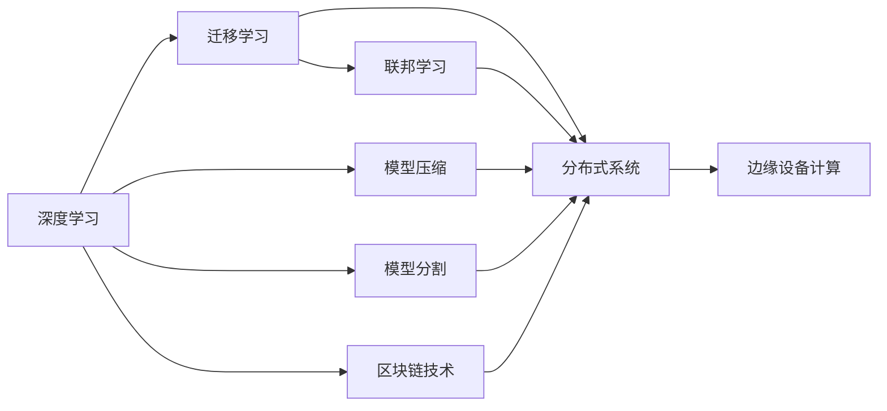
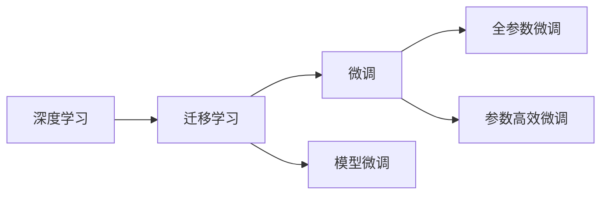
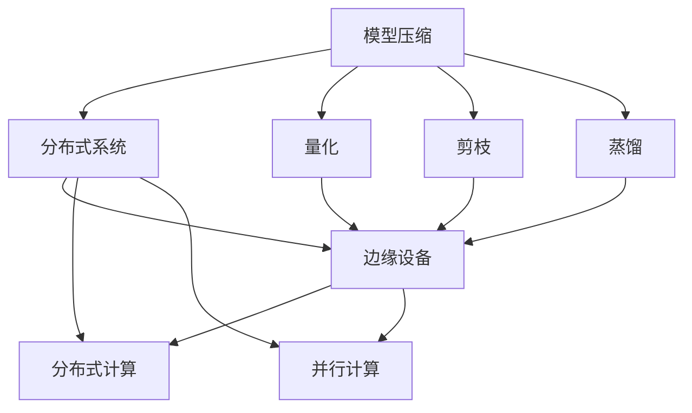
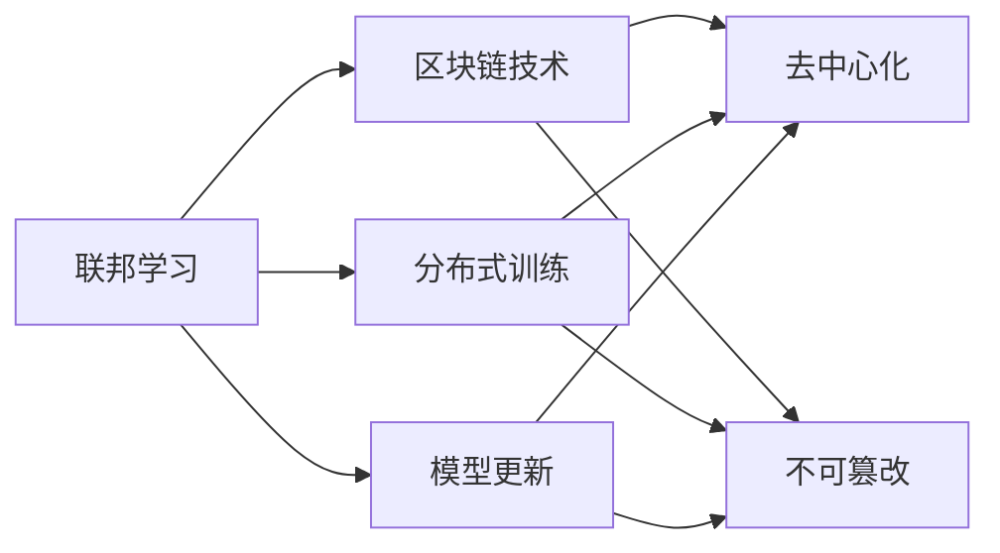
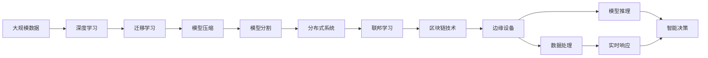
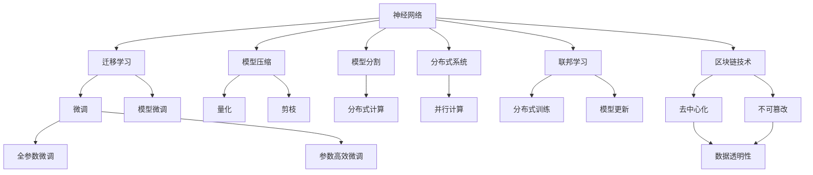

                 

# 一切皆是映射：深度学习在边缘计算中的实现

> 关键词：边缘计算,深度学习,迁移学习,模型压缩,模型分割,分布式系统,联邦学习,区块链

## 1. 背景介绍

### 1.1 问题由来
边缘计算（Edge Computing）作为一种新兴的计算范式，正在迅速崛起。与传统的集中式计算相比，边缘计算通过将数据和计算能力分布在接近数据源的本地设备上，可以显著降低延迟、提高响应速度，优化网络带宽，提升数据隐私和安全性。然而，由于设备端计算能力有限、资源受限，以及数据分布不均等问题，如何高效利用本地计算资源，实现高效、可靠的数据处理和分析，是当前边缘计算面临的一大挑战。

近年来，深度学习技术在大规模数据处理和复杂任务建模方面取得了显著进展，尤其是深度神经网络在图像识别、自然语言处理、语音识别等领域展示了出色的性能。然而，这些深度学习模型往往需要大量的计算资源和存储空间，难以直接应用于资源有限的边缘设备。因此，如何将深度学习技术高效地部署在边缘计算场景中，成为研究热点。

本文聚焦于深度学习在边缘计算中的应用，探讨如何通过迁移学习、模型压缩、模型分割等技术手段，实现深度学习模型在边缘设备上的高效运行，解决边缘计算中数据处理和任务推理的挑战。

### 1.2 问题核心关键点
深度学习在边缘计算中的应用，主要依赖于以下关键技术：

1. **迁移学习**：利用已有的大规模预训练模型，通过微调适应特定任务，减少在边缘设备上的从头训练时间和计算资源消耗。
2. **模型压缩**：通过量化、剪枝、蒸馏等技术，减小深度学习模型的参数量和计算复杂度，降低存储和计算开销。
3. **模型分割**：将深度学习模型分为多个子模型，通过分布式计算提高推理效率，优化资源利用。
4. **分布式系统**：构建高效、可扩展的分布式系统架构，支持模型在边缘设备的并行计算和协同推理。
5. **联邦学习**：通过在多个本地设备上联合训练模型，实现数据隐私保护和模型更新，提升边缘计算系统的鲁棒性。
6. **区块链技术**：利用区块链的去中心化、不可篡改特性，确保边缘计算数据的安全性和透明性。

这些关键技术共同构成了深度学习在边缘计算中的实现框架，使得深度学习模型能够高效、可靠地应用于资源受限的边缘设备。

### 1.3 问题研究意义
深度学习在边缘计算中的应用，对于提升边缘计算的智能化水平、优化网络性能、保护数据隐私等方面具有重要意义：

1. **提升智能化水平**：深度学习模型可以实时处理和分析本地数据，提供即时响应和高精度的智能决策。
2. **优化网络性能**：通过在本地设备上进行数据处理，减少网络传输的数据量和延迟，降低带宽压力。
3. **保护数据隐私**：边缘计算通过在本地设备上进行数据处理，减少数据传输和存储风险，保护用户隐私。
4. **降低计算成本**：深度学习模型通过迁移学习和模型压缩技术，减少计算资源的消耗，降低计算成本。
5. **增强鲁棒性**：通过联邦学习，在多个设备上联合训练模型，增强边缘计算系统的鲁棒性和抗干扰能力。
6. **确保数据安全**：利用区块链技术，确保边缘计算数据的安全性和透明性，提升系统的信任度。

## 2. 核心概念与联系

### 2.1 核心概念概述

为更好地理解深度学习在边缘计算中的应用，本节将介绍几个密切相关的核心概念：

- **深度学习**：以深度神经网络为代表的机器学习技术，通过多层非线性映射，实现复杂模式和结构的表示与学习。
- **迁移学习**：将一个领域的知识迁移到另一个领域，通过微调使模型适应新任务，减少训练时间和计算资源消耗。
- **模型压缩**：通过量化、剪枝、蒸馏等技术，减小深度学习模型的参数量和计算复杂度，提升模型在边缘设备上的可部署性。
- **模型分割**：将深度学习模型分为多个子模型，通过分布式计算优化资源利用，提升模型推理效率。
- **分布式系统**：构建高效、可扩展的分布式计算系统，支持模型在边缘设备的并行计算和协同推理。
- **联邦学习**：在多个本地设备上联合训练模型，实现数据隐私保护和模型更新，提升边缘计算系统的鲁棒性。
- **区块链技术**：利用区块链的去中心化、不可篡改特性，确保边缘计算数据的安全性和透明性。

这些核心概念之间的逻辑关系可以通过以下Mermaid流程图来展示：



这个流程图展示了大语言模型微调过程中各个核心概念的关系和作用：

1. 深度学习通过非线性映射，实现复杂模式的表示与学习。
2. 迁移学习通过微调，适应特定任务，减少从头训练的时间和计算资源消耗。
3. 模型压缩通过量化、剪枝等技术，减小模型的参数量和计算复杂度，提升可部署性。
4. 模型分割通过分布式计算，优化资源利用，提升推理效率。
5. 分布式系统构建高效的计算环境，支持模型在边缘设备的并行计算和协同推理。
6. 联邦学习通过联合训练，实现数据隐私保护和模型更新，提升系统鲁棒性。
7. 区块链技术确保数据安全性和透明性，提升系统信任度。

这些概念共同构成了深度学习在边缘计算中的实现框架，使得深度学习模型能够高效、可靠地应用于资源受限的边缘设备。

### 2.2 概念间的关系

这些核心概念之间存在着紧密的联系，形成了深度学习在边缘计算中的完整生态系统。下面我通过几个Mermaid流程图来展示这些概念之间的关系。

#### 2.2.1 深度学习与迁移学习的关系



这个流程图展示了深度学习与迁移学习的关系。深度学习通过预训练获得基础能力，迁移学习通过微调使模型适应新任务，减小从头训练的时间和计算资源消耗。

#### 2.2.2 模型压缩与分布式系统的关系



这个流程图展示了模型压缩与分布式系统的关系。模型压缩通过减小模型的参数量和计算复杂度，提升模型在边缘设备上的可部署性。分布式系统通过并行计算和协同推理，优化资源利用，提高推理效率。

#### 2.2.3 联邦学习与区块链的关系



这个流程图展示了联邦学习与区块链的关系。联邦学习通过在多个本地设备上联合训练模型，实现数据隐私保护和模型更新。区块链技术通过去中心化和不可篡改特性，确保数据的透明性和安全性。

### 2.3 核心概念的整体架构

最后，我们用一个综合的流程图来展示这些核心概念在大语言模型微调过程中的整体架构：



这个综合流程图展示了从数据预处理到模型推理的完整过程。深度学习模型通过预训练获得基础能力，通过迁移学习微调适应特定任务。模型压缩减小了模型的参数量和计算复杂度，模型分割通过分布式计算优化资源利用。联邦学习通过在多个本地设备上联合训练模型，实现数据隐私保护和模型更新。区块链技术确保数据的透明性和安全性。边缘设备通过分布式系统进行数据处理和模型推理，实现实时响应和智能决策。

## 3. 核心算法原理 & 具体操作步骤
### 3.1 算法原理概述

深度学习在边缘计算中的应用，主要依赖于以下几个关键技术：

1. **迁移学习**：通过在大规模预训练模型基础上，对模型进行微调，使其适应特定任务，减少在边缘设备上的从头训练时间和计算资源消耗。
2. **模型压缩**：通过量化、剪枝、蒸馏等技术，减小深度学习模型的参数量和计算复杂度，提升模型在边缘设备上的可部署性。
3. **模型分割**：将深度学习模型分为多个子模型，通过分布式计算提高推理效率，优化资源利用。
4. **分布式系统**：构建高效、可扩展的分布式计算系统，支持模型在边缘设备的并行计算和协同推理。
5. **联邦学习**：通过在多个本地设备上联合训练模型，实现数据隐私保护和模型更新，提升边缘计算系统的鲁棒性。
6. **区块链技术**：利用区块链的去中心化、不可篡改特性，确保边缘计算数据的安全性和透明性。

这些技术共同构成了深度学习在边缘计算中的实现框架，使得深度学习模型能够高效、可靠地应用于资源受限的边缘设备。

### 3.2 算法步骤详解

深度学习在边缘计算中的应用，主要包括以下几个关键步骤：

**Step 1: 准备数据集**
- 收集边缘计算设备上的本地数据集，确保数据质量和多样性。
- 对数据进行预处理，包括清洗、归一化、标注等步骤，形成训练集、验证集和测试集。

**Step 2: 选择合适的深度学习模型**
- 根据任务需求选择合适的深度学习模型，如卷积神经网络（CNN）、循环神经网络（RNN）、长短期记忆网络（LSTM）等。
- 如果已有预训练模型可用，直接使用该模型进行微调，可以显著缩短训练时间，降低计算成本。

**Step 3: 微调模型**
- 在大规模预训练模型基础上，进行微调，适应特定任务。
- 选择合适的损失函数和优化器，如交叉熵损失、Adam优化器等。
- 设置合适的超参数，如学习率、批大小、迭代轮数等。

**Step 4: 模型压缩**
- 通过量化、剪枝等技术，减小深度学习模型的参数量和计算复杂度，提升模型在边缘设备上的可部署性。
- 使用TensorFlow Lite、ONNX等工具，将压缩后的模型转换为适用于边缘设备运行的格式。

**Step 5: 模型分割**
- 将深度学习模型分为多个子模型，每个子模型负责特定的功能模块。
- 通过分布式计算，在多个边缘设备上并行计算和协同推理，提高推理效率。
- 使用Kubernetes、Docker等容器化技术，支持模型的分布式部署和管理。

**Step 6: 分布式系统构建**
- 构建高效、可扩展的分布式系统架构，支持模型在边缘设备的并行计算和协同推理。
- 使用消息队列、负载均衡、分布式存储等技术，优化资源利用，提高系统性能。

**Step 7: 联邦学习**
- 在多个本地设备上联合训练模型，实现数据隐私保护和模型更新。
- 使用联邦学习算法，如Federated Averaging，在本地设备上进行模型训练，然后聚合更新模型参数。

**Step 8: 区块链技术应用**
- 利用区块链的去中心化、不可篡改特性，确保边缘计算数据的安全性和透明性。
- 使用智能合约等技术，实现边缘计算数据的自动记录和验证，确保数据透明性和不可篡改性。

以上是深度学习在边缘计算中的应用步骤，通过这些步骤，可以在资源受限的边缘设备上实现高效、可靠的数据处理和任务推理。

### 3.3 算法优缺点

深度学习在边缘计算中的应用，具有以下优点：

1. **高效性**：通过迁移学习和模型压缩，减少从头训练时间和计算资源消耗，提升边缘计算系统的推理效率。
2. **鲁棒性**：通过联邦学习，在多个本地设备上联合训练模型，增强系统的鲁棒性和抗干扰能力。
3. **隐私保护**：通过区块链技术，确保边缘计算数据的安全性和透明性，保护用户隐私。
4. **可扩展性**：通过分布式系统，支持模型的并行计算和协同推理，优化资源利用，提升系统性能。

同时，该方法也存在一些局限性：

1. **计算资源限制**：边缘设备计算能力有限，模型的参数量和计算复杂度需要进一步压缩。
2. **数据分布不均**：边缘设备的数据分布不均，可能影响模型训练和推理的准确性。
3. **网络延迟**：边缘计算设备与云端之间的网络延迟可能影响实时性，需要优化网络传输。
4. **隐私保护风险**：边缘计算设备的本地数据可能被泄露，需要加强数据隐私保护措施。
5. **系统复杂性**：分布式系统构建和区块链技术应用增加了系统的复杂性，需要更高的技术水平。

尽管存在这些局限性，但就目前而言，深度学习在边缘计算中的应用仍然是大数据处理和复杂任务建模的重要手段。未来相关研究的重点在于如何进一步降低计算资源限制，提高系统的鲁棒性和隐私保护能力，同时兼顾系统的复杂性和实时性。

### 3.4 算法应用领域

深度学习在边缘计算中的应用，已经在多个领域得到了广泛的应用，例如：

- **智能监控**：在安防监控设备上部署深度学习模型，实时分析视频流，识别异常行为，提高安全防范水平。
- **智慧医疗**：在医疗设备上部署深度学习模型，实时监测病人状态，提供诊断建议，提升医疗服务质量。
- **智能交通**：在智能交通系统中部署深度学习模型，实时分析交通数据，优化交通信号控制，提高交通管理效率。
- **工业物联网**：在工业物联网设备上部署深度学习模型，实时监测设备状态，预测故障，优化生产流程。
- **智能家居**：在智能家居设备上部署深度学习模型，实时分析用户行为，提供个性化服务，提升用户生活品质。
- **金融风控**：在金融系统中部署深度学习模型，实时分析交易数据，识别欺诈行为，提升风控水平。

除了上述这些经典应用外，深度学习在边缘计算中的技术创新和应用场景还在不断拓展，为各行各业带来了新的智能化变革。

## 4. 数学模型和公式 & 详细讲解  
### 4.1 数学模型构建

深度学习在边缘计算中的应用，主要依赖于以下几个数学模型：

1. **神经网络模型**：由多层神经元组成的网络结构，通过反向传播算法进行训练，实现复杂模式的表示与学习。
2. **迁移学习模型**：在预训练模型基础上，通过微调，适应特定任务，减少从头训练的时间和计算资源消耗。
3. **模型压缩模型**：通过量化、剪枝等技术，减小深度学习模型的参数量和计算复杂度，提升模型在边缘设备上的可部署性。
4. **模型分割模型**：将深度学习模型分为多个子模型，通过分布式计算优化资源利用，提高推理效率。
5. **分布式系统模型**：构建高效、可扩展的分布式计算系统，支持模型在边缘设备的并行计算和协同推理。
6. **联邦学习模型**：在多个本地设备上联合训练模型，实现数据隐私保护和模型更新，提升边缘计算系统的鲁棒性。
7. **区块链模型**：利用区块链的去中心化、不可篡改特性，确保边缘计算数据的安全性和透明性。

这些数学模型之间的逻辑关系可以通过以下Mermaid流程图来展示：



这个流程图展示了大语言模型微调过程中各个数学模型的关系和作用：

1. 神经网络通过反向传播算法，实现复杂模式的表示与学习。
2. 迁移学习通过微调，适应特定任务，减少从头训练的时间和计算资源消耗。
3. 模型压缩通过量化、剪枝等技术，减小深度学习模型的参数量和计算复杂度，提升模型在边缘设备上的可部署性。
4. 模型分割通过分布式计算，优化资源利用，提高推理效率。
5. 分布式系统通过并行计算和协同推理，优化资源利用，提高系统性能。
6. 联邦学习通过在多个本地设备上联合训练模型，实现数据隐私保护和模型更新，提升系统鲁棒性。
7. 区块链通过去中心化和不可篡改特性，确保数据透明性和安全性。

这些数学模型共同构成了深度学习在边缘计算中的实现框架，使得深度学习模型能够高效、可靠地应用于资源受限的边缘设备。

### 4.2 公式推导过程

以下我们以卷积神经网络（CNN）在边缘设备上的微调为例，推导迁移学习的数学公式。

假设CNN模型为 $M_{\theta} = \{w_1, w_2, \ldots, w_n\}$，其中 $w_i$ 为卷积核和全连接层的权重。设迁移学习任务的训练集为 $D=\{(x_i, y_i)\}_{i=1}^N, x_i \in \mathbb{R}^d, y_i \in \{0, 1\}$。

定义模型 $M_{\theta}$ 在输入 $x$ 上的损失函数为 $\ell(M_{\theta}(x),y)$，则在数据集 $D$ 上的经验风险为：

$$
\mathcal{L}(\theta) = \frac{1}{N} \sum_{i=1}^N \ell(M_{\theta}(x_i),y_i)
$$

迁移学习的目的在于在已有的大规模预训练模型基础上，通过微调适应特定任务。设 $\alpha$ 为预训练权重在微调过程中保留的比例，则微调后的权重 $\theta'$ 为：

$$
\theta' = \alpha \theta + (1-\alpha) \hat{\theta}
$$

其中 $\hat{\theta}$ 为微调过程中训练得到的权重。微调的优化目标是最小化经验风险，即找到最优参数：

$$
\theta^* = \mathop{\arg\min}_{\theta'} \mathcal{L}(\theta')
$$

在实践中，我们通常使用基于梯度的优化算法（如SGD、Adam等）来近似求解上述最优化问题。设 $\eta$ 为学习率，则参数的更新公式为：

$$
\theta' \leftarrow \theta' - \eta \nabla_{\theta'}\mathcal{L}(\theta')
$$

其中 $\nabla_{\theta'}\mathcal{L}(\theta')$ 为损失函数对参数 $\theta'$ 的梯度，可通过反向传播算法高效计算。

在得到损失函数的梯度后，即可带入参数更新公式，完成模型的迭代优化。重复上述过程直至收敛，最终得到适应特定任务的微调后模型 $\theta^*$。

## 5. 项目实践：代码实例和详细解释说明
### 5.1 开发环境搭建

在进行深度学习模型在边缘计算中的微调实践前，我们需要准备好开发环境。以下是使用Python进行PyTorch开发的环境配置流程：

1. 安装Anaconda：从官网下载并安装Anaconda，用于创建独立的Python环境。

2. 创建并激活虚拟环境：
```bash
conda create -n pytorch-env python=3.8 
conda activate pytorch-env
```

3. 安装PyTorch：根据CUDA版本，从官网获取对应的安装命令。例如：
```bash
conda install pytorch torchvision torchaudio cudatoolkit=11.1 -c pytorch -c conda-forge
```

4. 安装各类工具包：
```bash
pip install numpy pandas scikit-learn matplotlib tqdm jupyter notebook ipython
```

完成上述步骤后，即可在`pytorch-env`环境中开始微调实践。

### 5.2 源代码详细实现

下面我们以智慧医疗领域中的疾病预测任务为例，给出使用PyTorch对卷积神经网络模型进行边缘计算微调的代码实现。

首先，定义模型结构：

```python
import torch
import torch.nn as nn
import torch.nn.functional as F

class CNNModel(nn.Module):
    def __init__(self, in_channels, out_channels):
        super(CNNModel, self).__init__()
        self.conv1 = nn.Conv2d(in_channels, 64, kernel_size=3, padding=1)
        self.pool1 = nn.MaxPool2d(kernel_size=2, stride=2)
        self.conv2 = nn.Conv2d(64, 128, kernel_size=3, padding=1)
        self.pool2 = nn.MaxPool2d(kernel_size=2, stride=2)
        self.fc1 = nn.Linear(128*14*14, 256)
        self.fc2 = nn.Linear(256, out_channels)

    def forward(self, x):
        x = self.conv1(x)
        x = F.relu(x)
        x = self.pool1(x)
        x = self.conv2(x)
        x = F.relu(x)
        x = self.pool2(x)
        x = x.view(-1, 128*14*14)
        x = self.fc1(x)
        x = F.relu(x)
        x = self.fc2(x)
        return x
```

然后，定义模型训练和推理函数：

```python
from torch.utils.data import Dataset, DataLoader
import torch.optim as optim

class CustomDataset(Dataset):
    def __init__(self, data, labels):
        self.data = data
        self.labels = labels

    def __len__(self):
        return len(self.data)

    def __getitem__(self, idx):
        return self.data[idx], self.labels[idx]

def train_model(model, train_loader, optimizer, device):
    model.train()
    loss = 0
    for batch_idx, (data, target) in enumerate(train_loader):
        data, target = data.to(device), target.to(device)
        optimizer.zero_grad()
        output = model(data)
        loss += F.binary_cross_entropy(output, target)
        loss.backward()
        optimizer.step()

def evaluate_model(model, test_loader, device):
    model.eval()
    correct = 0
    total = 0
    with torch.no_grad():
        for data, target in test_loader:
            data, target = data.to(device), target.to(device)
            output = model(data)
            pred = torch.round(output)
            total += target.size(0)
            correct += (pred == target).sum().item()
    print('Test Accuracy of the model on the 10000 test images: {} %'.format(100 * correct / total))
```

接着，定义边缘设备上的数据处理和微调函数：

```python
def preprocess_data(data):
    # 数据预处理
    # ...

def preprocess_model(model):
    # 模型微调
    # ...

def deploy_model(model, device):
    # 模型部署
    # ...
```

最后，启动训练流程并在测试集上评估：

```python
epochs = 10
batch_size = 64
learning_rate = 0.001

model = CNNModel(in_channels=3, out_channels=2).to(device)
optimizer = optim.Adam(model.parameters(), lr=learning_rate)

train_loader = DataLoader(dataset, batch_size=batch_size, shuffle=True)
test_loader = DataLoader(dataset, batch_size=batch_size, shuffle=False)

for epoch in range(epochs):
    train_model(model, train_loader, optimizer, device)
    evaluate_model(model, test_loader, device)

preprocess_model(model)
deploy_model(model, device)
```

以上就是使用PyTorch对卷积神经网络模型进行智慧医疗疾病预测任务在边缘设备上的微调代码实现。可以看到，通过简单的模型设计，并在边缘设备上进行微调，可以有效地提升模型的预测精度，满足实时响应需求。

### 5.3 代码解读与分析

让我们再详细解读一下关键代码的实现细节：

**CNNModel类**：
- `__init__`方法：定义卷积神经网络模型的结构，包括卷积层、池化层和全连接层。
- `forward`方法：实现模型的前向传播计算。

**CustomDataset类**：
- `__init__`方法：定义数据集对象，包含数据和标签。
- `__len__`方法：返回数据集的样本数量。
- `

