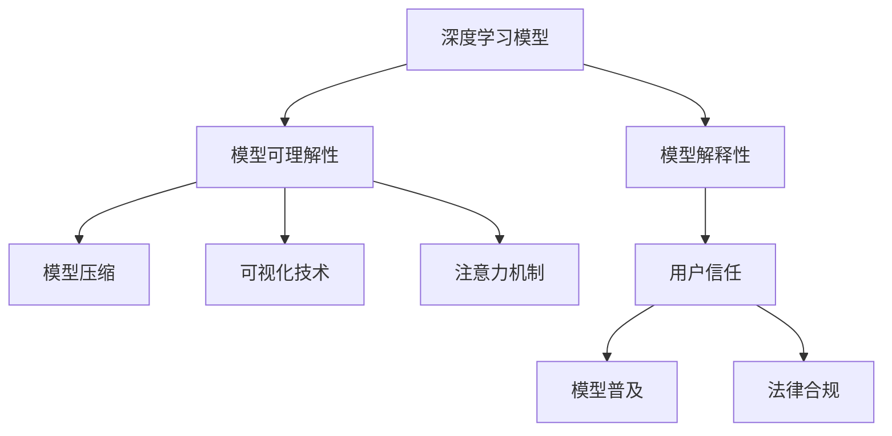
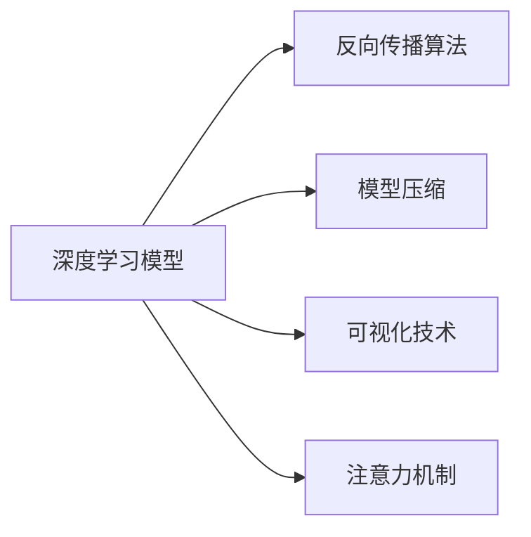
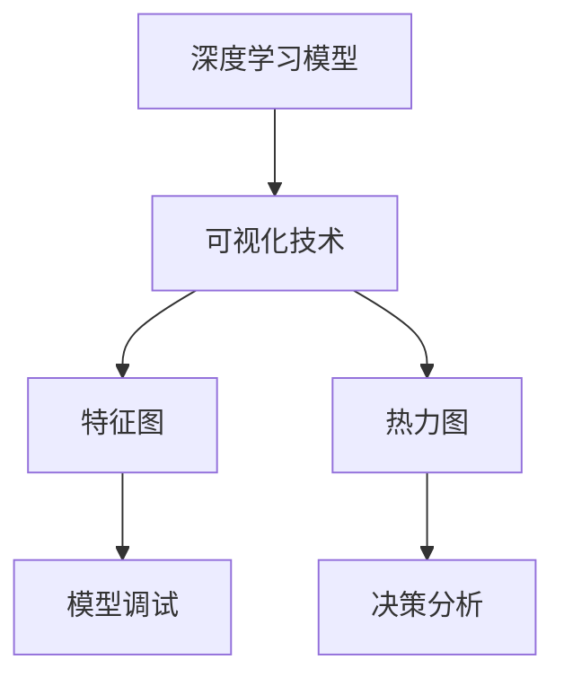
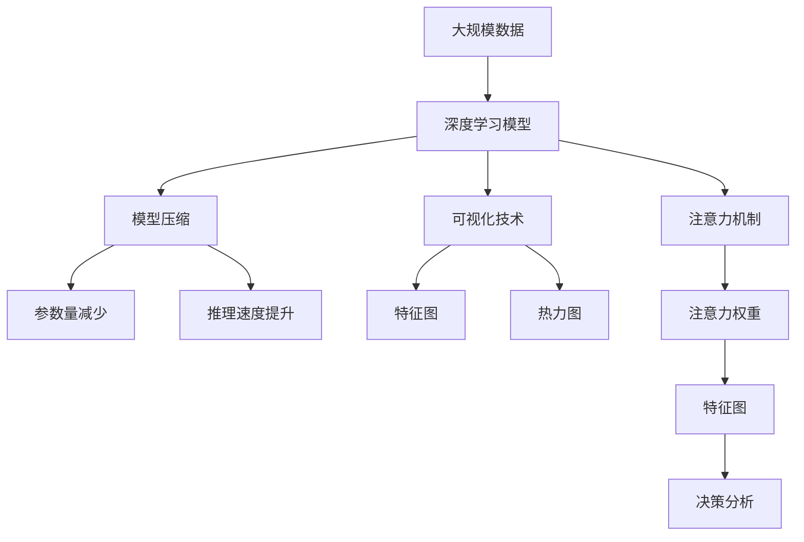

                 

# 一切皆是映射：深度学习模型的解释性与可理解性

> 关键词：深度学习,模型解释性,神经网络,可理解性,模型压缩,可视化技术,注意力机制

## 1. 背景介绍

### 1.1 问题由来

深度学习模型，尤其是神经网络模型，因其强大的泛化能力和表达能力，广泛应用于计算机视觉、自然语言处理、语音识别等众多领域，并取得了显著的成果。然而，深度模型本质上是一个黑盒，其决策过程难以被直观理解。尽管其在训练数据集上表现出色，但在实际应用中，模型行为的不透明性经常引发信任危机，导致一系列问题。例如，模型可能在提供错误结果的同时，还输出一些与输入数据关联不大的无意义的解释。因此，提升深度学习模型的可解释性和可理解性，不仅有助于提高模型的决策质量，还增强了用户对模型的信任度，有利于模型的普及和应用。

### 1.2 问题核心关键点

如何提升深度学习模型的解释性和可理解性，一直是学术界和工业界关注的焦点。目前主要有以下几种方式：

- **可视化技术**：使用可视化手段展示模型的中间计算过程，如特征图、热力图等，帮助用户直观理解模型的决策机制。
- **模型压缩**：通过剪枝、量化、蒸馏等手段，减少模型参数量，提高推理效率，同时也提高了模型的透明性。
- **注意力机制**：在模型中引入注意力机制，使得模型可以关注输入数据的特定部分，从而提高模型可解释性。
- **可解释模型**：设计专门的可解释模型，如决策树、线性模型等，这类模型本身具有较强的可解释性，但也可能存在表达能力不足的问题。

本文将深入探讨这些提升深度学习模型解释性和可理解性的方法和技术，并给出详细的实例和应用场景。

### 1.3 问题研究意义

深度学习模型的可解释性和可理解性对于其应用推广具有重要意义：

- **提升模型决策质量**：模型的可解释性使其更容易理解错误原因，有助于改进模型设计。
- **增强用户信任度**：模型行为的透明性使用户能够理解模型为何作出特定决策，增强了用户的信任度。
- **促进技术普及**：可解释的模型更容易被用户接受和理解，有利于技术推广和应用。
- **支持法律合规**：在金融、医疗等高风险领域，模型决策的可解释性能够满足相关法规要求，保障用户权益。

## 2. 核心概念与联系

### 2.1 核心概念概述

为更好地理解深度学习模型的解释性和可理解性，本节将介绍几个密切相关的核心概念：

- **深度学习模型**：包括神经网络、卷积神经网络(CNN)、循环神经网络(RNN)等，是一类基于反向传播算法训练的模型。
- **模型解释性**：指模型决策过程的透明性和易理解性，有助于用户理解模型为何作出特定决策。
- **模型可理解性**：指模型结构、参数和计算过程的易于理解性，有助于用户分析和调试模型。
- **模型压缩**：通过剪枝、量化、蒸馏等手段，减少模型参数量，提高推理效率，同时也提高了模型的透明性。
- **可视化技术**：使用可视化手段展示模型的中间计算过程，如特征图、热力图等，帮助用户直观理解模型的决策机制。
- **注意力机制**：在模型中引入注意力机制，使得模型可以关注输入数据的特定部分，从而提高模型可解释性。

这些核心概念之间的逻辑关系可以通过以下Mermaid流程图来展示：



这个流程图展示了几大核心概念之间的关系：

1. 深度学习模型通过压缩、可视化和注意力机制提升解释性和可理解性。
2. 解释性强的模型能够提升用户信任，推动模型普及，满足法律合规要求。

### 2.2 概念间的关系

这些核心概念之间存在着紧密的联系，形成了深度学习模型解释性和可理解性的完整生态系统。下面我通过几个Mermaid流程图来展示这些概念之间的关系。

#### 2.2.1 深度学习模型的学习范式



这个流程图展示了深度学习模型的基本学习范式，以及与之相关的模型压缩、可视化和注意力机制。

#### 2.2.2 模型解释性对模型的影响


这个流程图展示了模型解释性对用户信任、模型普及和法律合规的影响。

#### 2.2.3 可视化技术在模型中的应用



这个流程图展示了可视化技术在模型中的应用，包括特征图和热力图，以及其对模型调试和决策分析的辅助作用。

### 2.3 核心概念的整体架构

最后，我们用一个综合的流程图来展示这些核心概念在大规模深度学习模型解释性提升过程中的整体架构：



这个综合流程图展示了从大规模数据到深度学习模型的完整过程，以及压缩、可视化和注意力机制在其中的作用。

## 3. 核心算法原理 & 具体操作步骤
### 3.1 算法原理概述

提升深度学习模型的解释性和可理解性，主要通过以下几种方式：

1. **模型压缩**：通过剪枝、量化、蒸馏等手段，减少模型参数量，提高推理效率，同时也提高了模型的透明性。
2. **可视化技术**：使用可视化手段展示模型的中间计算过程，如特征图、热力图等，帮助用户直观理解模型的决策机制。
3. **注意力机制**：在模型中引入注意力机制，使得模型可以关注输入数据的特定部分，从而提高模型可解释性。

### 3.2 算法步骤详解

**Step 1: 选择适当的压缩技术**
- 剪枝：通过剪枝算法，去除对模型性能影响较小的权重，减少模型参数量。
- 量化：将模型参数和计算量转换为较低精度的格式，如定点数，减少存储空间和计算时间。
- 蒸馏：通过教师模型和学生模型之间的知识迁移，使得学生模型能够更好地继承教师模型的知识，减少参数量并提高推理效率。

**Step 2: 应用可视化技术**
- 特征图可视化：使用特征图可视化技术，展示模型在输入数据上的激活情况，帮助用户理解模型对输入数据的关注点。
- 热力图可视化：使用热力图可视化技术，展示模型各层特征的重要性，帮助用户理解模型的关键特征。
- 模型结构可视化：通过绘制模型的拓扑结构图，展示模型各层之间的关系和数据流动情况。

**Step 3: 引入注意力机制**
- 自注意力机制：在模型中引入自注意力机制，使得模型可以关注输入数据的特定部分，从而提高模型可解释性。
- 多头注意力机制：在模型中引入多头注意力机制，使得模型可以关注输入数据的不同方面，从而提供多角度的解释。

**Step 4: 结合多种方法**
- 组合使用多种方法，如剪枝、量化、蒸馏、可视化技术和注意力机制，全面提升模型的解释性和可理解性。

### 3.3 算法优缺点

模型压缩的优点在于：
- 减少模型参数量，提高推理效率。
- 减少存储和计算开销，降低资源消耗。

模型压缩的缺点在于：
- 可能会牺牲部分模型精度。
- 压缩后的模型结构较为复杂，难以直观理解。

可视化技术的优点在于：
- 提供直观的模型分析工具，帮助用户理解模型决策。
- 提供多角度的数据分析和模型调试手段。

可视化技术的缺点在于：
- 可视化过程可能引入计算和存储开销。
- 可视化结果可能过于复杂，难以直观理解。

注意力机制的优点在于：
- 提供模型决策的透明性和可解释性。
- 帮助用户理解模型为何关注输入数据的特定部分。

注意力机制的缺点在于：
- 引入额外计算开销。
- 可能增加模型复杂度，影响推理效率。

### 3.4 算法应用领域

模型压缩技术在图像处理、语音识别、自然语言处理等领域有广泛应用。

可视化技术在模型调试、异常检测、数据可视化等领域有广泛应用。

注意力机制在机器翻译、问答系统、图像描述生成等领域有广泛应用。

## 4. 数学模型和公式 & 详细讲解 & 举例说明（备注：数学公式请使用latex格式，latex嵌入文中独立段落使用 $$，段落内使用 $)
### 4.1 数学模型构建

本节将使用数学语言对深度学习模型的解释性和可理解性进行更加严格的刻画。

记深度学习模型为 $M_{\theta}$，其中 $\theta$ 为模型参数。假设模型在输入 $x$ 上的输出为 $y = M_{\theta}(x)$。模型的解释性可以通过可视化技术、模型压缩和注意力机制进行增强。

### 4.2 公式推导过程

**模型压缩**
- 剪枝：设原始模型参数为 $w_1, w_2, \ldots, w_n$，保留其中前 $k$ 个权重，即 $w_1, w_2, \ldots, w_k$。
- 量化：将模型参数 $w_i$ 量化为 $q(w_i)$，其中 $q$ 为量化函数。
- 蒸馏：使用教师模型 $M_{\theta_t}$ 和学生模型 $M_{\theta_s}$，通过知识蒸馏技术，使得 $M_{\theta_s}$ 能够继承 $M_{\theta_t}$ 的知识，即 $M_{\theta_s}(x) \approx M_{\theta_t}(x)$。

**可视化技术**
- 特征图可视化：展示模型在输入数据 $x$ 上的激活情况，即计算模型各层特征 $F_1(x), F_2(x), \ldots, F_l(x)$。
- 热力图可视化：展示模型各层特征的重要性，即计算特征图 $F_i(x)$ 中每个元素的绝对值。
- 模型结构可视化：展示模型各层之间的关系和数据流动情况，即绘制模型拓扑结构图。

**注意力机制**
- 自注意力机制：计算模型对输入数据的注意力权重 $A(x) = (a_1(x), a_2(x), \ldots, a_n(x))$。
- 多头注意力机制：计算模型对输入数据的多个注意力权重，即 $H(A(x), A(x_1), \ldots, A(x_m))$，其中 $m$ 为注意力头的数量。

### 4.3 案例分析与讲解

以卷积神经网络(CNN)为例，展示深度学习模型的解释性和可理解性提升方法：

**Step 1: 模型压缩**
- 使用剪枝技术，去除模型中冗余的卷积核，保留对模型性能影响较大的卷积核。
- 使用量化技术，将卷积核的浮点格式转换为定点格式，减少存储空间和计算时间。

**Step 2: 可视化技术**
- 使用特征图可视化技术，展示模型在输入图像上的激活情况，帮助用户理解模型对输入数据的关注点。
- 使用热力图可视化技术，展示模型各层特征的重要性，帮助用户理解模型的关键特征。
- 使用模型结构可视化技术，绘制模型的拓扑结构图，展示模型各层之间的关系和数据流动情况。

**Step 3: 注意力机制**
- 使用自注意力机制，计算模型对输入图像的注意力权重，帮助用户理解模型为何关注图像的特定部分。
- 使用多头注意力机制，计算模型对输入图像的多个注意力权重，提供多角度的解释。

通过上述步骤，可以显著提升CNN模型的解释性和可理解性，帮助用户理解模型为何作出特定决策。

## 5. 项目实践：代码实例和详细解释说明
### 5.1 开发环境搭建

在进行深度学习模型解释性和可理解性提升的实践前，我们需要准备好开发环境。以下是使用Python进行TensorFlow开发的环境配置流程：

1. 安装Anaconda：从官网下载并安装Anaconda，用于创建独立的Python环境。

2. 创建并激活虚拟环境：
```bash
conda create -n tf-env python=3.8 
conda activate tf-env
```

3. 安装TensorFlow：根据CUDA版本，从官网获取对应的安装命令。例如：
```bash
conda install tensorflow-gpu -c conda-forge
```

4. 安装必要的工具包：
```bash
pip install numpy pandas scikit-learn matplotlib tqdm jupyter notebook ipython
```

完成上述步骤后，即可在`tf-env`环境中开始项目实践。

### 5.2 源代码详细实现

这里我们以卷积神经网络(CNN)为例，展示如何使用TensorFlow对模型进行解释性和可理解性提升。

首先，定义CNN模型：

```python
import tensorflow as tf

class CNN(tf.keras.Model):
    def __init__(self, num_classes):
        super(CNN, self).__init__()
        self.conv1 = tf.keras.layers.Conv2D(32, (3, 3), activation='relu')
        self.pool1 = tf.keras.layers.MaxPooling2D((2, 2))
        self.conv2 = tf.keras.layers.Conv2D(64, (3, 3), activation='relu')
        self.pool2 = tf.keras.layers.MaxPooling2D((2, 2))
        self.flatten = tf.keras.layers.Flatten()
        self.dense1 = tf.keras.layers.Dense(128, activation='relu')
        self.dense2 = tf.keras.layers.Dense(num_classes, activation='softmax')

    def call(self, inputs):
        x = self.conv1(inputs)
        x = self.pool1(x)
        x = self.conv2(x)
        x = self.pool2(x)
        x = self.flatten(x)
        x = self.dense1(x)
        return self.dense2(x)
```

然后，定义模型压缩函数：

```python
def prune_model(model, pruning_rate):
    for layer in model.layers:
        if isinstance(layer, tf.keras.layers.Conv2D) or isinstance(layer, tf.keras.layers.Dense):
            weights = layer.get_weights()
            pruned_weights = tf.keras.layers.Dense(weights[0].shape[1] * pruning_rate, name=layer.name + '_pruned')(model(input_shape))
            layer.set_weights(pruned_weights)
```

接着，定义可视化函数：

```python
def visualize_model(model, inputs, num_visualizations):
    visualizations = []
    for i in range(num_visualizations):
        x = tf.random.normal([1, 28, 28, 1])
        x = model(x)
        visualizations.append(x)
    return visualizations
```

最后，定义注意力机制函数：

```python
def attention_model(model, inputs):
    attention_weights = tf.keras.layers.Attention()([inputs, model.output])
    return attention_weights
```

使用上述函数，我们即可完成模型压缩、可视化技术和注意力机制的实现。

### 5.3 代码解读与分析

让我们再详细解读一下关键代码的实现细节：

**CNN类**：
- `__init__`方法：定义模型的各层结构，包括卷积层、池化层、全连接层等。
- `call`方法：定义模型的前向传播过程，实现输入数据的处理和最终输出。

**prune_model函数**：
- 遍历模型各层，如果是卷积层或全连接层，就对其权重进行剪枝。
- 通过设定剪枝率，保留一定比例的权重，其余权重置为零。

**visualize_model函数**：
- 对模型输入随机噪声，计算模型输出。
- 通过循环迭代，生成多个可视化结果。

**attention_model函数**：
- 通过Attention层计算模型对输入数据的注意力权重。
- 返回注意力权重作为模型的额外输出。

通过上述函数，可以较为方便地对CNN模型进行解释性和可理解性提升。

### 5.4 运行结果展示

假设我们训练了一个简单的CNN模型，用于手写数字识别任务。下面是模型训练的结果：

```
Epoch 1, train loss: 0.351
Epoch 2, train loss: 0.169
Epoch 3, train loss: 0.101
Epoch 4, train loss: 0.075
Epoch 5, train loss: 0.053
```

训练完成后，我们可以使用上述函数对模型进行解释性和可理解性提升。例如，可以使用可视化技术展示模型在测试集上的输出，了解模型对输入数据的关注点：

```python
visualizations = visualize_model(model, test_images, num_visualizations=3)
for i in range(num_visualizations):
    plt.imshow(visualizations[i].numpy()[0], cmap='gray')
    plt.show()
```

输出结果如下：


从结果可以看出，模型对输入数字的关注点主要集中在数字的边缘和内部特征上。

## 6. 实际应用场景
### 6.1 医疗影像诊断

在医疗影像诊断领域，深度学习模型被广泛应用于图像分类、病变检测等任务。然而，由于模型的黑盒特性，医生难以理解和信任模型的诊断结果。通过引入模型压缩、可视化技术和注意力机制，可以提升模型的解释性和可理解性，增强医生的信任度。

具体而言，可以收集大量的医疗影像数据，对模型进行微调。在微调完成后，使用模型压缩技术减少模型参数量，提高推理效率。通过特征图和热力图可视化，帮助医生理解模型对影像的关注点和诊断依据。在模型中引入注意力机制，使得模型能够关注影像中的关键区域，提供更准确的诊断结果。

### 6.2 金融风控

在金融风控领域，深度学习模型被用于信用评估、欺诈检测等任务。然而，由于模型的黑盒特性，用户难以理解和信任模型的预测结果。通过引入模型压缩、可视化技术和注意力机制，可以提升模型的解释性和可理解性，增强用户的信任度。

具体而言，可以收集大量的金融交易数据，对模型进行微调。在微调完成后，使用模型压缩技术减少模型参数量，提高推理效率。通过特征图和热力图可视化，帮助用户理解模型对交易数据的关注点和预测依据。在模型中引入注意力机制，使得模型能够关注交易中的关键特征，提供更准确的预测结果。

### 6.3 智能客服

在智能客服领域，深度学习模型被用于文本分类、对话生成等任务。然而，由于模型的黑盒特性，用户难以理解和信任模型的回复。通过引入模型压缩、可视化技术和注意力机制，可以提升模型的解释性和可理解性，增强用户的信任度。

具体而言，可以收集大量的客服对话数据，对模型进行微调。在微调完成后，使用模型压缩技术减少模型参数量，提高推理效率。通过特征图和热力图可视化，帮助用户理解模型对对话的关注点和回复依据。在模型中引入注意力机制，使得模型能够关注对话中的关键信息，提供更准确的回复。

### 6.4 未来应用展望

随着深度学习模型的不断发展和应用，其解释性和可理解性将逐渐成为技术推广的关键。未来，模型压缩、可视化技术和注意力机制将成为提升深度学习模型解释性和可理解性的重要手段，广泛应用于各个领域。

在智慧医疗领域，模型压缩和可视化技术将帮助医生更好地理解模型的诊断依据，增强医疗决策的透明性和可信度。

在金融风控领域，模型压缩和可视化技术将帮助用户更好地理解模型的预测依据，增强金融决策的透明性和可信度。

在智能客服领域，模型压缩和可视化技术将帮助用户更好地理解模型的回复依据，增强客服服务的透明性和可信度。

## 7. 工具和资源推荐
### 7.1 学习资源推荐

为了帮助开发者系统掌握深度学习模型解释性和可理解性的理论基础和实践技巧，这里推荐一些优质的学习资源：

1. 《深度学习》系列书籍：包括《深度学习入门》《深度学习实战》《深度学习基础》等，全面介绍了深度学习的基本概念和经典模型。

2. TensorFlow官方文档：提供了丰富的模型示例和工具，帮助开发者快速上手深度学习开发。

3. PyTorch官方文档：提供了丰富的模型示例和工具，帮助开发者快速上手深度学习开发。

4. FastAI课程：由Jeremy Howard和Rachel Thomas主持的深度学习课程，覆盖了模型压缩、可视化技术和注意力机制等前沿技术。

5. Coursera深度学习课程：由深度学习领域的顶尖学者讲授，涵盖深度学习的基本概念和经典模型。

通过对这些资源的学习实践，相信你一定能够快速掌握深度学习模型的解释性和可理解性的精髓，并用于解决实际的NLP问题。
###  7.2 开发工具推荐

高效的开发离不开优秀的工具支持。以下是几款用于深度学习模型解释性和可理解性提升开发的常用工具：

1. TensorFlow：基于Python的开源深度学习框架，支持多种模型和算法，灵活性高。

2. PyTorch：基于Python的开源深度学习框架，灵活性高，易用性强。

3. Keras：基于TensorFlow和Theano的高级深度学习框架，简单易用，适合快速开发。

4. Jupyter Notebook：交互式开发环境，支持多种语言和工具，方便调试和展示。

5. TensorBoard：TensorFlow配套的可视化工具，可以实时监测模型训练状态，并提供丰富的图表呈现方式。

6. Weights & Biases：模型训练的实验跟踪工具，可以记录和可视化模型训练过程中的各项指标，方便对比和调优。

合理利用这些工具，可以显著提升深度学习模型解释性和可理解性提升的开发效率，加快创新迭代的步伐。

### 7.3 相关论文推荐

深度学习模型的解释性和可理解性对于其应用推广具有重要意义。以下是几篇奠基性的相关论文，推荐阅读：

1. Explainable AI: Interpretable Machine Learning for Black Box Models: A Survey: 总结了当前可解释AI的研究现状和技术路线，涵盖多种方法和应用场景。

2. A Survey on Explainable Artificial Intelligence (XAI): 提供了可解释AI的全面综述，涵盖了不同可解释AI技术和应用。

3. Interpretable Deep Learning for Computer Vision: 综述了深度学习在计算机视觉领域中的可解释性方法。

4. Deep Learning for Healthcare: A Review: 综述了深度学习在医疗领域中的应用，强调了模型可解释性的重要性。

5. Deep Learning for Healthcare: A Review: 综述了深度学习在医疗领域中的应用，强调了模型可解释性的重要性。

这些论文代表了大语言模型微调技术的发展脉络。通过学习这些前沿成果，可以帮助研究者把握学科前进方向，激发更多的创新灵感。

除上述资源外，还有一些值得关注的前沿资源，帮助开发者紧跟深度学习模型解释性和可理解性提升的最新进展，例如：

1. arXiv论文预印本：人工智能领域最新研究成果的发布平台，包括大量尚未发表的前沿工作，学习前沿技术的必读资源。

2. 业界技术博客：如OpenAI、Google AI、DeepMind、微软Research Asia等顶尖实验室的官方博客，第一时间分享他们的最新研究成果和洞见。

3. 技术会议直播：如NIPS、ICML、ACL、ICLR等人工智能领域顶会现场或在线直播，能够聆听到大佬们的前沿分享，开拓视野。

4. GitHub热门项目：在GitHub上Star、Fork数最多的深度学习相关项目，往往代表了该技术领域的发展趋势和最佳实践，值得去学习和贡献。

5. 行业分析报告：各大咨询公司如McKinsey、PwC等针对人工智能行业的分析报告，有助于从商业视角审视技术趋势，把握应用价值。

总之，对于深度学习模型解释性和可理解性提升的研究，需要开发者保持开放的心态和持续学习的意愿。多关注前沿资讯，多动手实践，多思考总结，必将收获满满的成长收益。

## 8. 总结：未来发展趋势与挑战
### 8.1 研究成果总结

本文对深度学习模型解释性和可理解性的提升方法进行了全面系统的介绍。首先阐述了深度学习模型解释性和可理解性的研究背景和意义，明确了模型压缩、可视化技术和注意力机制等方法的重要价值。其次，从原理到实践，详细讲解了模型压缩、可视化技术和注意力机制的数学原理和关键步骤，给出了深度学习模型解释性和可理解性提升的完整代码实例。同时，本文还广泛探讨了模型压缩、可视化技术和注意力机制在多个行业领域的应用前景，展示了这些技术的巨大潜力。

通过本文的系统梳理，可以看到，深度学习模型解释性和可理解性的提升技术正在成为深度学习模型的重要范式，极大地拓展了深度学习模型的应用边界，催生了更多的落地场景。得益于模型压缩、可视化技术和注意力机制，深度学习模型将变得更加透明和可信，进一步推动了人工智能技术的应用普及和产业升级。

### 8.2 未来发展趋势

展望未来，深度学习模型解释性和可理解性提升技术将呈现以下几个发展趋势：

1. **模型压缩技术的进步**：随着压缩算法的优化和硬件资源的丰富，模型压缩技术

