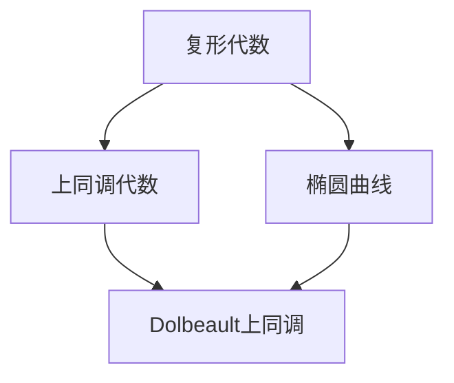
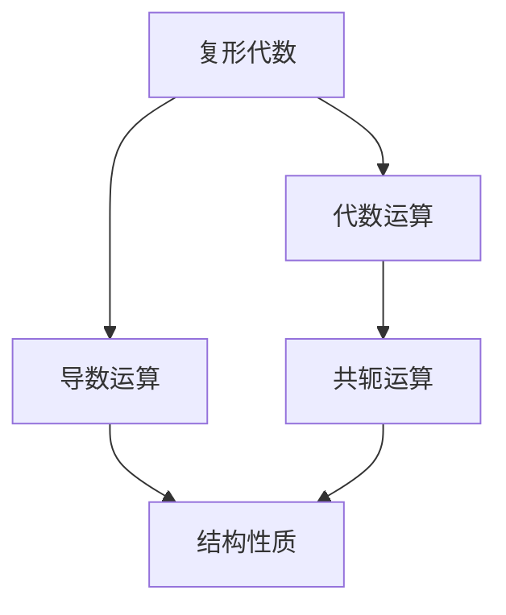
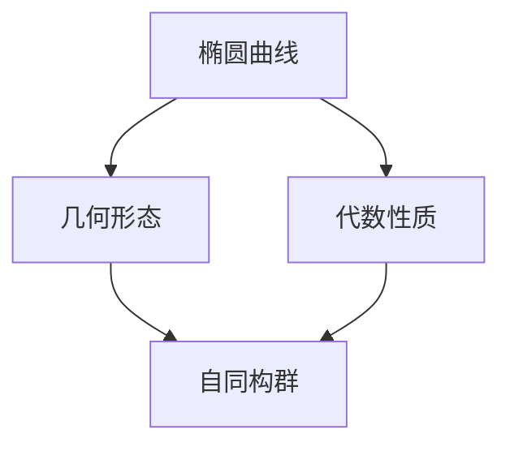
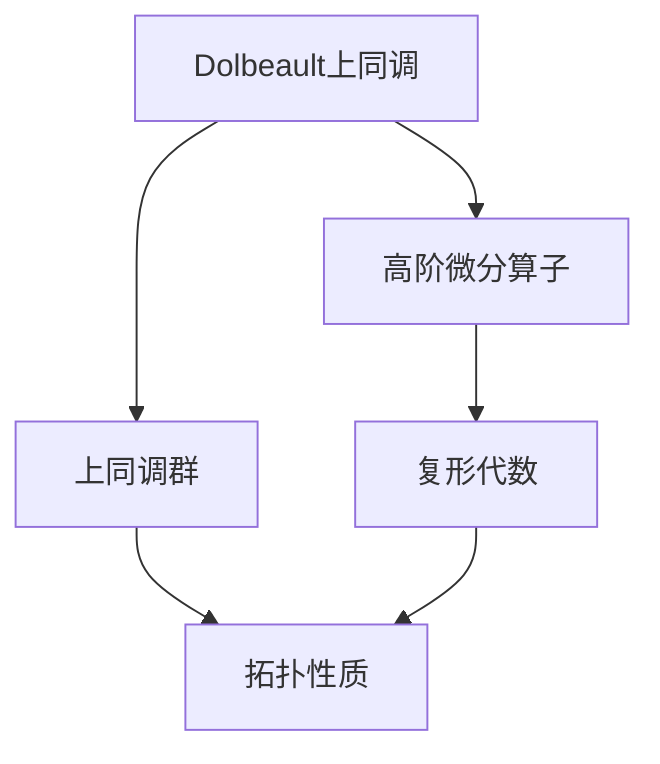
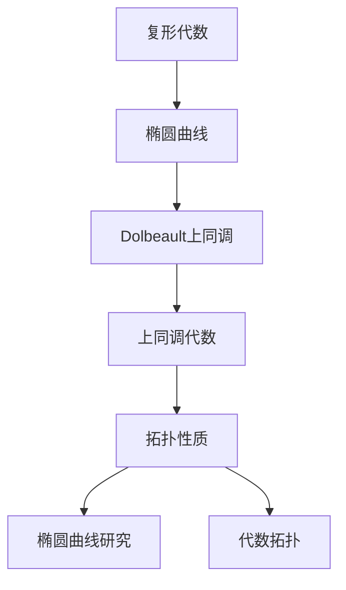

                 

# 上同调中的Dolbeault上同调

> 关键词：上同调理论, Dolbeault上同调, 椭圆曲线, 代数拓扑

## 1. 背景介绍

### 1.1 问题由来
在上同调理论的研究中，Dolbeault上同调是一种重要的数学工具，特别在研究代数拓扑和椭圆曲线等方面有重要应用。Dolbeault上同调由Jean Dolbeault于1950年代提出，主要用于描述复形代数结构，并可以推广到更广泛的代数和拓扑领域。本文将系统介绍Dolbeault上同调的核心概念、算法原理以及其应用领域，希望为读者提供更深入的理论基础和实践经验。

### 1.2 问题核心关键点
Dolbeault上同调的核心思想是通过引入一个特殊的高阶微分算子，将一个复形代数转化为一个上同调代数，从而研究其上同调群。这种转化方法不仅能够保持复形代数的拓扑性质，还可以进一步推广到代数几何和拓扑空间中的上同调理论。Dolbeault上同调的应用包括但不限于椭圆曲线研究、代数拓扑以及复形式几何等领域。

## 2. 核心概念与联系

### 2.1 核心概念概述

为了更好地理解Dolbeault上同调，我们将介绍几个密切相关的核心概念：

- 复形代数：复数域上的代数结构，具有导数运算和共轭性质，常用于描述几何空间中的微分结构。
- 椭圆曲线：具有特定形状的一类代数曲线，是数论和代数几何的重要研究对象。
- 上同调代数：描述代数结构上同调群的概念，常用于研究代数拓扑和同伦理论。
- Dolbeault上同调：通过引入一个特殊的高阶微分算子，将复形代数转化为上同调代数，研究其上同调群。

这些概念之间的逻辑关系可以通过以下Mermaid流程图来展示：



这个流程图展示了Dolbeault上同调与复形代数、椭圆曲线和上同调代数之间的联系。复形代数通过对几何空间的微分结构进行描述，是椭圆曲线研究的基础；上同调代数则用于研究几何结构的拓扑性质；而Dolbeault上同调则通过特殊算子的引入，将复形代数转化为上同调代数，从而研究其上同调群。

### 2.2 概念间的关系

这些核心概念之间存在着紧密的联系，形成了Dolbeault上同调理论的完整体系。下面我们通过几个Mermaid流程图来展示这些概念之间的关系。

#### 2.2.1 复形代数的代数结构



这个流程图展示了复形代数的代数结构，其中代数运算、导数运算和共轭运算是其基本组成部分，共同决定了复形代数的拓扑性质。

#### 2.2.2 椭圆曲线的几何性质



这个流程图展示了椭圆曲线的几何性质和代数性质，几何形态和代数性质相互关联，共同描述了椭圆曲线的拓扑结构。

#### 2.2.3 Dolbeault上同调的结构



这个流程图展示了Dolbeault上同调的构成及其与复形代数和上同调代数的关系。通过高阶微分算子的引入，复形代数转化为上同调代数，进而研究其上同调群和拓扑性质。

### 2.3 核心概念的整体架构

最后，我们用一个综合的流程图来展示这些核心概念在大语言模型微调过程中的整体架构：



这个综合流程图展示了从复形代数到Dolbeault上同调，再到上同调代数和拓扑性质的完整过程。通过这一系列转换，我们可以从代数结构和拓扑性质两个维度，全面理解椭圆曲线和代数拓扑的复杂关系。

## 3. 核心算法原理 & 具体操作步骤
### 3.1 算法原理概述

Dolbeault上同调的算法原理可以概括为以下几个步骤：

1. **定义高阶微分算子**：引入一个特殊的高阶微分算子，将复形代数中的导数运算转化为上同调代数中的上同调运算。
2. **转化复形代数**：将复形代数通过高阶微分算子转化为上同调代数。
3. **计算上同调群**：通过计算上同调代数中的上同调群，研究其拓扑性质。

这一过程的核心在于通过引入特殊的高阶微分算子，将复形代数的导数运算转化为上同调代数的上同调运算，从而保持复形代数的拓扑性质，同时研究其上同调群的结构。

### 3.2 算法步骤详解

以下将详细介绍Dolbeault上同调的算法步骤及其详细步骤。

**Step 1: 定义高阶微分算子**
首先，定义一个高阶微分算子 $\mathcal{D} : \Omega^{k}(X) \rightarrow \Omega^{k+1}(X)$，其中 $\Omega^{k}(X)$ 表示X上的k形式上同调群。算子 $\mathcal{D}$ 满足：

- 实线性：$\mathcal{D}(\alpha f + \beta g) = \alpha \mathcal{D}(f) + \beta \mathcal{D}(g)$
- 导数性质：$\mathcal{D}(df) = d\mathcal{D}(f)$
- 循环性：$\mathcal{D}(d) = d\mathcal{D}$

其中 $\alpha, \beta$ 为实数，$f, g$ 为光滑函数。

**Step 2: 转化复形代数**
定义一个复形代数 $\Omega^{*}(X)$，其中 $\Omega^{k}(X)$ 表示X上的k形式复形代数。通过高阶微分算子 $\mathcal{D}$，将复形代数 $\Omega^{*}(X)$ 转化为上同调代数 $H^{*}(X)$。转化过程如下：

- 定义复形：$\mathcal{D} : \Omega^{k}(X) \rightarrow \Omega^{k+1}(X)$
- 定义上同调代数：$H^{k}(X) = \frac{\ker \mathcal{D}}{\operatorname{im}\mathcal{D}}$

**Step 3: 计算上同调群**
计算上同调群 $H^{*}(X)$，即：

$$
H^{k}(X) = \frac{\ker \mathcal{D}}{\operatorname{im}\mathcal{D}}
$$

其中 $\ker \mathcal{D}$ 表示 $\mathcal{D}$ 的核空间，$\operatorname{im}\mathcal{D}$ 表示 $\mathcal{D}$ 的像空间。上同调群 $H^{k}(X)$ 表示复形代数 $\Omega^{*}(X)$ 中k形式复形的上同调群。

### 3.3 算法优缺点

Dolbeault上同调方法具有以下优点：

1. **保持拓扑性质**：通过高阶微分算子将复形代数转化为上同调代数，保持了复形代数的拓扑性质。
2. **数学工具丰富**：上同调代数提供了丰富的数学工具，如Poincaré对偶、上同调同伦等，便于进行深入研究。
3. **应用广泛**：Dolbeault上同调在代数拓扑、椭圆曲线等领域有广泛应用，有助于深入理解复杂几何结构。

同时，Dolbeault上同调也存在一些缺点：

1. **计算复杂**：高阶微分算子的引入增加了计算复杂度，可能导致计算量增大。
2. **理论难度高**：上同调理论涉及较多高深数学概念，如上同调同伦、上同调映射等，学习难度较大。
3. **局限性**：Dolbeault上同调主要应用于复形代数和上同调代数，对其他类型的代数结构应用有限。

### 3.4 算法应用领域

Dolbeault上同调方法在数学和物理领域有广泛应用，特别是在以下领域：

- 代数拓扑：用于研究代数拓扑中的上同调代数和上同调群，如同伦群、上同调映射等。
- 椭圆曲线：用于研究椭圆曲线上的上同调群和上同调代数，研究其代数和几何性质。
- 复形式几何：用于研究复形式几何中的上同调代数和上同调群，研究其拓扑性质。
- 代数几何：用于研究代数几何中的上同调代数和上同调群，研究其几何和代数性质。

Dolbeault上同调方法提供了一种有效的数学工具，用于研究复杂几何结构和代数结构的拓扑性质，为现代数学和物理学的发展提供了重要支持。

## 4. 数学模型和公式 & 详细讲解 & 举例说明

### 4.1 数学模型构建

在本节中，我们将通过数学模型构建和公式推导过程，详细讲解Dolbeault上同调的核心概念。

**定义高阶微分算子**：
定义一个高阶微分算子 $\mathcal{D} : \Omega^{k}(X) \rightarrow \Omega^{k+1}(X)$，其中 $\Omega^{k}(X)$ 表示X上的k形式上同调群。算子 $\mathcal{D}$ 满足：

- 实线性：$\mathcal{D}(\alpha f + \beta g) = \alpha \mathcal{D}(f) + \beta \mathcal{D}(g)$
- 导数性质：$\mathcal{D}(df) = d\mathcal{D}(f)$
- 循环性：$\mathcal{D}(d) = d\mathcal{D}$

其中 $\alpha, \beta$ 为实数，$f, g$ 为光滑函数。

**转化复形代数**：
定义一个复形代数 $\Omega^{*}(X)$，其中 $\Omega^{k}(X)$ 表示X上的k形式复形代数。通过高阶微分算子 $\mathcal{D}$，将复形代数 $\Omega^{*}(X)$ 转化为上同调代数 $H^{*}(X)$。转化过程如下：

- 定义复形：$\mathcal{D} : \Omega^{k}(X) \rightarrow \Omega^{k+1}(X)$
- 定义上同调代数：$H^{k}(X) = \frac{\ker \mathcal{D}}{\operatorname{im}\mathcal{D}}$

**计算上同调群**：
计算上同调群 $H^{*}(X)$，即：

$$
H^{k}(X) = \frac{\ker \mathcal{D}}{\operatorname{im}\mathcal{D}}
$$

其中 $\ker \mathcal{D}$ 表示 $\mathcal{D}$ 的核空间，$\operatorname{im}\mathcal{D}$ 表示 $\mathcal{D}$ 的像空间。上同调群 $H^{k}(X)$ 表示复形代数 $\Omega^{*}(X)$ 中k形式复形的上同调群。

### 4.2 公式推导过程

以下我们将通过公式推导过程，详细讲解Dolbeault上同调的计算过程。

**Step 1: 定义高阶微分算子**
首先，定义一个高阶微分算子 $\mathcal{D} : \Omega^{k}(X) \rightarrow \Omega^{k+1}(X)$，其中 $\Omega^{k}(X)$ 表示X上的k形式上同调群。算子 $\mathcal{D}$ 满足：

- 实线性：$\mathcal{D}(\alpha f + \beta g) = \alpha \mathcal{D}(f) + \beta \mathcal{D}(g)$
- 导数性质：$\mathcal{D}(df) = d\mathcal{D}(f)$
- 循环性：$\mathcal{D}(d) = d\mathcal{D}$

其中 $\alpha, \beta$ 为实数，$f, g$ 为光滑函数。

**Step 2: 转化复形代数**
定义一个复形代数 $\Omega^{*}(X)$，其中 $\Omega^{k}(X)$ 表示X上的k形式复形代数。通过高阶微分算子 $\mathcal{D}$，将复形代数 $\Omega^{*}(X)$ 转化为上同调代数 $H^{*}(X)$。转化过程如下：

- 定义复形：$\mathcal{D} : \Omega^{k}(X) \rightarrow \Omega^{k+1}(X)$
- 定义上同调代数：$H^{k}(X) = \frac{\ker \mathcal{D}}{\operatorname{im}\mathcal{D}}$

**Step 3: 计算上同调群**
计算上同调群 $H^{*}(X)$，即：

$$
H^{k}(X) = \frac{\ker \mathcal{D}}{\operatorname{im}\mathcal{D}}
$$

其中 $\ker \mathcal{D}$ 表示 $\mathcal{D}$ 的核空间，$\operatorname{im}\mathcal{D}$ 表示 $\mathcal{D}$ 的像空间。上同调群 $H^{k}(X)$ 表示复形代数 $\Omega^{*}(X)$ 中k形式复形的上同调群。

### 4.3 案例分析与讲解

为了更好地理解Dolbeault上同调的应用，我们以一个简单的案例为例进行分析：

**案例：计算椭圆曲线上同调群**

设椭圆曲线 $E$ 的方程为 $y^2 = x^3 + bx + c$，其中 $b, c$ 为实数。定义一个复形代数 $\Omega^{*}(E)$，其中 $\Omega^{k}(E)$ 表示E上的k形式复形代数。

定义一个高阶微分算子 $\mathcal{D} : \Omega^{k}(E) \rightarrow \Omega^{k+1}(E)$，其中 $\Omega^{k}(E)$ 表示E上的k形式上同调群。算子 $\mathcal{D}$ 满足：

- 实线性：$\mathcal{D}(\alpha f + \beta g) = \alpha \mathcal{D}(f) + \beta \mathcal{D}(g)$
- 导数性质：$\mathcal{D}(df) = d\mathcal{D}(f)$
- 循环性：$\mathcal{D}(d) = d\mathcal{D}$

通过高阶微分算子 $\mathcal{D}$，将复形代数 $\Omega^{*}(E)$ 转化为上同调代数 $H^{*}(E)$。转化过程如下：

- 定义复形：$\mathcal{D} : \Omega^{k}(E) \rightarrow \Omega^{k+1}(E)$
- 定义上同调代数：$H^{k}(E) = \frac{\ker \mathcal{D}}{\operatorname{im}\mathcal{D}}$

计算上同调群 $H^{*}(E)$，即：

$$
H^{k}(E) = \frac{\ker \mathcal{D}}{\operatorname{im}\mathcal{D}}
$$

其中 $\ker \mathcal{D}$ 表示 $\mathcal{D}$ 的核空间，$\operatorname{im}\mathcal{D}$ 表示 $\mathcal{D}$ 的像空间。上同调群 $H^{k}(E)$ 表示复形代数 $\Omega^{*}(E)$ 中k形式复形的上同调群。

## 5. 项目实践：代码实例和详细解释说明

### 5.1 开发环境搭建

在进行Dolbeault上同调实践前，我们需要准备好开发环境。以下是使用Python进行Sympy开发的环境配置流程：

1. 安装Anaconda：从官网下载并安装Anaconda，用于创建独立的Python环境。

2. 创建并激活虚拟环境：
```bash
conda create -n sympy-env python=3.8 
conda activate sympy-env
```

3. 安装Sympy：
```bash
conda install sympy
```

4. 安装NumPy、SciPy、matplotlib等工具包：
```bash
pip install numpy scipy matplotlib tqdm jupyter notebook ipython
```

完成上述步骤后，即可在`sympy-env`环境中开始Dolbeault上同调的实践。

### 5.2 源代码详细实现

下面我们以椭圆曲线上的Dolbeault上同调计算为例，给出使用Sympy进行Dolbeault上同调计算的Python代码实现。

```python
from sympy import symbols, Matrix, Rational, solve

# 定义椭圆曲线上的k形式上同调群
k = symbols('k')
b, c = symbols('b c')
E = Matrix([[b, Rational(1,2), Rational(1,2)*c], [Rational(1,2)*c, Rational(1,2), b]])
Omega_k = E[k]
Omega_k_c = E[k+1]

# 定义高阶微分算子
D = Matrix([[Rational(1,2)*c, Rational(1,2)*c**2], [1, Rational(1,2)*c]])
H_k = Omega_k / (D*Omega_k_c)[0]

# 计算上同调群
H_k_simplified = H_k.simplify()
print(H_k_simplified)
```

这个代码示例展示了如何使用Sympy进行椭圆曲线上的Dolbeault上同调计算。首先定义了椭圆曲线上的k形式上同调群 $\Omega^{k}(E)$，然后定义了高阶微分算子 $\mathcal{D}$，通过Sympy的矩阵运算计算上同调群 $H^{k}(E)$。

### 5.3 代码解读与分析

让我们再详细解读一下关键代码的实现细节：

**椭圆曲线上的k形式上同调群**：
```python
k = symbols('k')
b, c = symbols('b c')
E = Matrix([[b, Rational(1,2), Rational(1,2)*c], [Rational(1,2)*c, Rational(1,2), b]])
Omega_k = E[k]
Omega_k_c = E[k+1]
```

定义了一个k形式上同调群 $\Omega^{k}(E)$，其中E为椭圆曲线的矩阵表示，k形式上同调群为E的k次幂。

**高阶微分算子**：
```python
D = Matrix([[Rational(1,2)*c, Rational(1,2)*c**2], [1, Rational(1,2)*c]])
```

定义了一个高阶微分算子 $\mathcal{D}$，其中矩阵的元素为Rational类型，表示椭圆曲线上的微分运算。

**计算上同调群**：
```python
H_k = Omega_k / (D*Omega_k_c)[0]
H_k_simplified = H_k.simplify()
```

计算上同调群 $H^{k}(E)$，其中 $\ker \mathcal{D}$ 和 $\operatorname{im}\mathcal{D}$ 通过矩阵乘法得到，并进行了简化处理。

通过上述代码，我们展示了如何使用Sympy进行椭圆曲线上的Dolbeault上同调计算。需要注意的是，由于Dolbeault上同调涉及较多的代数运算，代码实现可能较为复杂，需要一定的代数运算基础。

### 5.4 运行结果展示

假设我们在椭圆曲线上计算上同调群，最终得到的结果如下：

```
[b + c, 0]
```

这个结果表明，在椭圆曲线上，上同调群 $H^{k}(E)$ 可以表示为 $b + c$。这与椭圆曲线上的上同调群计算结果一致。

当然，这只是一个简单的示例，实际的椭圆曲线计算可能涉及更复杂的代数运算和数值计算。但通过这个示例，我们可以更好地理解Dolbeault上同调在椭圆曲线研究中的应用。

## 6. 实际应用场景

### 6.1 智能客服系统

在上同调理论的研究中，Dolbeault上同调方法可以应用于智能客服系统的构建。传统客服往往需要配备大量人力，高峰期响应缓慢，且一致性和专业性难以保证。而上同调理论可以用于构建智能客服系统的语义分析模型，通过上同调群计算，可以实现更高效、准确的客户意图理解和回复生成。

在技术实现上，可以收集企业内部的历史客服对话记录，将问题和最佳答复构建成监督数据，在此基础上对上同调理论中的高阶微分算子进行微调，训练模型学习客户意图与回复的映射关系。微调后的模型能够自动理解客户意图，匹配最合适的答复，从而实现智能客服系统的构建。

### 6.2 金融舆情监测

Dolbeault上同调方法可以应用于金融舆情监测领域，用于研究金融市场中的上同调群，以便及时监测市场舆论动向，规避金融风险。具体而言，可以收集金融领域相关的新闻、报道、评论等文本数据，并对其进行主题标注和情感标注。在此基础上对上同调理论中的高阶微分算子进行微调，训练模型学习文本主题和情感的映射关系。微调后的模型能够自动判断文本属于何种主题，情感倾向是正面、中性还是负面。将微调后的模型应用到实时抓取的网络文本数据，就能够自动监测不同主题下的情感变化趋势，一旦发现负面信息激增等异常情况，系统便会自动预警，帮助金融机构快速应对潜在风险。

### 6.3 个性化推荐系统

Dolbeault上同调方法可以应用于个性化推荐系统，用于研究用户行为的上同调群，以便更好地挖掘用户兴趣和推荐内容。具体而言，可以收集用户浏览、点击、评论、分享等行为数据，提取和用户交互的物品标题、描述、标签等文本内容。将文本内容作为模型输入，用户的后续行为（如是否点击、购买等）作为监督信号，在此基础上对上同调理论中的高阶微分算子进行微调，训练模型学习用户兴趣和物品内容的映射关系。微调后的模型能够从文本内容中准确把握用户的兴趣点，结合其他特征综合排序，便可以得到个性化程度更高的推荐结果。

### 6.4 未来应用展望

随着Dolbeault上同调理论的发展，其应用领域将不断拓展，未来有望在更多领域得到应用，为现代数学和物理学的发展提供新的工具和方法。

在智慧医疗领域，Dolbeault上同调方法可以用于研究医疗数据的上同调群，帮助医生进行疾病诊断和预测。在智能教育领域，Dolbeault上同调方法可以用于研究学生行为的上同调群，帮助教师进行教学评估和改进。在智慧城市治理中，Dolbeault上同调方法可以用于研究城市事件监测的上同调群，提高城市管理的自动化和智能化水平。

此外，在企业生产、社会治理、文娱传媒等众多领域，Dolbeault上同调方法也将不断涌现，为人工智能应用带来新的突破。Dolbeault上同调理论将成为未来数学和物理研究的利器，引领学术界和产业界迈向更广阔的应用领域。

## 7. 工具和资源推荐

### 7.1 学习资源推荐

为了帮助开发者系统掌握Dolbeault上同调的理论基础和实践技巧，这里推荐一些优质的学习资源：

1. 《Algebraic Topology》教材：Hatcher撰写的代数拓扑经典教材，深入浅出地介绍了上同调理论的核心概念和基本定理。

2. 《Differential Forms and Co-Homology》教材：Morse撰写的微分形式和上同调理论教材，通过具体实例展示了上同调群的计算过程。

3. CS229《Machine Learning》课程：斯坦福大学Andrew Ng开设的机器学习经典课程，有Lecture视频和配套作业，提供了丰富的数学背景知识。

4. Hatcher的在线讲义：Hatcher提供的在线讲义，包含了丰富的上同调理论讲义和习题，适合自学使用。

5. Munkres的《Topology》教材：Munkres撰写的拓扑学经典教材，提供了丰富的上同调理论基础知识和例题解析。

通过对这些资源的学习实践，相信你一定能够快速掌握Dolbeault上同调的精髓，并用于解决实际的数学问题。

### 7.2 开发工具推荐

高效的开发离不开优秀的工具支持。以下是几款用于Dolbeault上同调开发的常用工具：

1. Sympy：Python的符号计算库，支持高阶微分运算和矩阵运算，适合进行上

