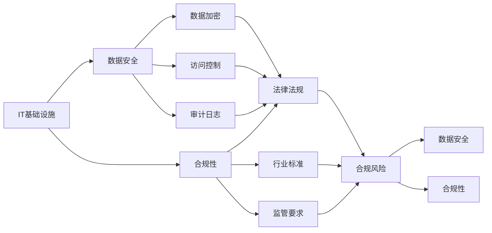
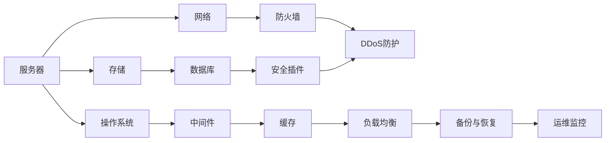
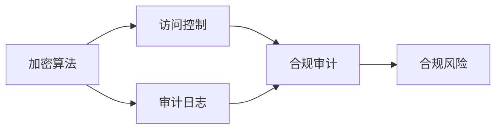
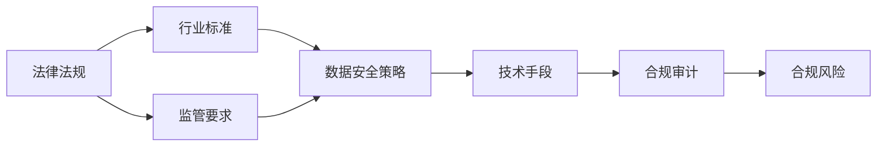

                 

# 专业技术能力培养：深入了解IT基础设施、数据安全和合规要求

## 1. 背景介绍

随着信息技术的快速发展和广泛应用，企业对IT基础设施的依赖日益加深。与此同时，数据安全和合规要求也越来越高。如何构建稳健的IT基础设施，保障数据安全，确保合规性，已经成为企业IT管理的重要课题。本专题将深入探讨这些核心问题，帮助读者全面提升IT专业技术能力。

### 1.1 问题由来

#### 1.1.1 IT基础设施的重要性
IT基础设施是企业信息化建设的核心支撑，包括服务器、存储、网络、安全设备等硬件资源，以及操作系统、数据库、中间件等软件资源。高效、可靠的IT基础设施不仅能提升企业运营效率，还能支撑各类业务系统的稳定运行。然而，随着业务规模的不断扩大，传统IT基础设施的运维复杂度逐渐增加，企业亟需创新技术以优化基础设施的管理和性能。

#### 1.1.2 数据安全的严峻挑战
数据是企业核心资产，泄露或被篡改将带来严重的经济损失和信誉风险。近年来，各类数据泄露事件层出不穷，如LinkedIn、Facebook等大公司多次遭受大规模数据泄露。数据安全已成为企业关注的重点。然而，传统的数据安全措施，如加密、访问控制等，已无法满足不断变化的安全需求。

#### 1.1.3 合规性的复杂性
合规性要求是指企业必须遵守的国家法律、行业标准和监管规定。在全球化背景下，企业面临的合规要求越来越复杂，如GDPR、CCPA等。但合规性检查往往需要耗费大量人力物力，且技术难度大，容易引发合规风险。

### 1.2 问题核心关键点
这些问题背后，核心关键点在于：
1. IT基础设施的架构设计，如何构建高效、可扩展的基础设施。
2. 数据安全技术的创新应用，如何采用最新技术保障数据安全。
3. 合规要求的准确理解，如何通过技术手段实现合规目标。

## 2. 核心概念与联系

### 2.1 核心概念概述

为了更好地理解这些问题，本节将介绍几个密切相关的核心概念：

- **IT基础设施**：包括硬件资源（服务器、存储、网络等）和软件资源（操作系统、数据库、中间件等），是企业信息化建设的基础支撑。
- **数据安全**：涉及数据的机密性、完整性和可用性，包括数据加密、访问控制、审计日志等技术。
- **合规性**：企业必须遵守的法律法规、行业标准和监管要求，如GDPR、CCPA等。

这些概念之间的关系可以通过以下Mermaid流程图来展示：



这个流程图展示了大语言模型微调过程中各个核心概念之间的关系：

1. IT基础设施是数据安全和合规性的基础支撑。
2. 数据安全是保障数据完整性和机密性的关键技术。
3. 合规性要求是对法律法规、行业标准和监管要求的遵循。
4. 合规性风险需要通过数据安全和IT基础设施保障来避免。

### 2.2 概念间的关系

这些核心概念之间存在着紧密的联系，形成了企业IT管理和数据保护的整体架构。下面我们通过几个Mermaid流程图来展示这些概念之间的关系。

#### 2.2.1 IT基础设施的架构设计



这个流程图展示了大规模语言模型微调任务的基本架构设计，包括硬件资源和软件资源的配置。

#### 2.2.2 数据安全技术的应用



这个流程图展示了数据安全技术的核心要素，包括加密、访问控制和审计日志。

#### 2.2.3 合规性的实现



这个流程图展示了合规性的实现路径，通过法律法规、行业标准和监管要求，制定数据安全策略，并采用技术手段实现合规目标。

## 3. 核心算法原理 & 具体操作步骤

### 3.1 算法原理概述

#### 3.1.1 IT基础设施的架构设计
设计高效的IT基础设施架构，需要考虑以下几点：
- **高性能计算**：选择高性能的硬件设备，如多核CPU、GPU、FPGA等。
- **分布式存储**：采用分布式存储系统，如Hadoop、Ceph等，确保数据存储的高可用性和扩展性。
- **网络优化**：构建高速、稳定、可靠的网络环境，如SDN、NFV等技术。
- **虚拟化技术**：采用虚拟化技术，如VMware、KVM等，提高资源利用率。
- **云平台集成**：利用公有云或私有云平台，实现灵活、高效的资源管理。

#### 3.1.2 数据安全技术的创新应用
数据安全技术的创新应用，主要涉及以下几个方面：
- **加密算法**：采用先进的加密算法，如AES、RSA等，确保数据的机密性。
- **访问控制**：通过RBAC、ABAC等技术，实现细粒度的访问控制，防止非法访问。
- **审计日志**：记录所有访问日志，及时发现和应对异常访问行为。
- **数据备份与恢复**：定期备份数据，确保数据丢失时能够快速恢复。

#### 3.1.3 合规性的实现
实现合规性要求，需要遵循以下步骤：
- **法律法规理解**：准确理解法律法规、行业标准和监管要求。
- **数据安全策略制定**：根据合规要求，制定相应的数据安全策略。
- **技术手段应用**：采用合适的技术手段，确保数据安全和合规性。
- **合规审计**：定期进行合规审计，发现和修复合规风险。

### 3.2 算法步骤详解

#### 3.2.1 IT基础设施的架构设计
1. **需求分析**：明确业务需求和性能要求，进行系统设计。
2. **设备选型**：选择适合的高性能硬件设备，如高性能CPU、GPU、存储设备等。
3. **网络规划**：设计高速、稳定、可靠的网络架构，包括网络拓扑、路由策略等。
4. **虚拟化部署**：采用虚拟化技术，实现资源池化和灵活部署。
5. **云平台集成**：利用公有云或私有云平台，实现资源共享和优化管理。

#### 3.2.2 数据安全技术的创新应用
1. **加密算法选择**：根据数据敏感性选择适合的加密算法，确保数据机密性。
2. **访问控制实现**：采用RBAC、ABAC等技术，实现细粒度的访问控制。
3. **审计日志记录**：记录所有访问日志，包括用户、时间、操作等。
4. **数据备份与恢复**：定期备份数据，并建立快速恢复机制。

#### 3.2.3 合规性的实现
1. **法律法规理解**：通过法律咨询和行业交流，准确理解法律法规、行业标准和监管要求。
2. **数据安全策略制定**：根据合规要求，制定详细的数据安全策略，包括数据保护、访问控制等。
3. **技术手段应用**：采用合适的技术手段，如加密、访问控制等，确保数据安全和合规性。
4. **合规审计**：定期进行合规审计，发现和修复合规风险，确保数据安全合规。

### 3.3 算法优缺点

#### 3.3.1 IT基础设施的架构设计
- **优点**：
  - 资源利用率高，可扩展性强。
  - 性能高效，支持大规模计算需求。
  - 灵活部署，支持快速业务迭代。
- **缺点**：
  - 初始投资成本高。
  - 运维复杂度大，需要专业技能。

#### 3.3.2 数据安全技术的创新应用
- **优点**：
  - 加密算法先进，保障数据机密性。
  - 访问控制细粒度，防止非法访问。
  - 审计日志记录详实，及时发现异常行为。
- **缺点**：
  - 技术复杂，实施难度大。
  - 数据备份和恢复复杂，增加系统复杂性。

#### 3.3.3 合规性的实现
- **优点**：
  - 确保数据安全和合规性，避免法律风险。
  - 定期审计，及时发现和修复合规风险。
- **缺点**：
  - 法律法规和标准不断变化，需要持续更新。
  - 合规性审计成本高，需要专业技能。

### 3.4 算法应用领域

#### 3.4.1 IT基础设施的架构设计
IT基础设施的架构设计广泛应用于各类企业，如金融、制造、电商等。其核心在于构建高效、可扩展的基础设施，满足业务需求和性能要求。

#### 3.4.2 数据安全技术的创新应用
数据安全技术的创新应用在金融、医疗、政府等行业具有重要意义。通过先进的数据安全技术，保障数据机密性和完整性，防止数据泄露和篡改。

#### 3.4.3 合规性的实现
合规性的实现对于金融、医疗、政府等行业尤为关键。通过准确理解法律法规和标准，制定详细的安全策略，确保数据安全和合规性，避免法律风险。

## 4. 数学模型和公式 & 详细讲解 & 举例说明

### 4.1 数学模型构建

本节将使用数学语言对IT基础设施、数据安全和合规要求的实现过程进行更加严格的刻画。

#### 4.1.1 IT基础设施的架构设计
假设企业需要进行大规模数据处理，设集群规模为 $N$，每个节点的计算能力为 $C_i$，存储容量为 $S_i$，网络带宽为 $B_i$，虚拟化率为 $\alpha$，云平台服务率为 $\beta$。则集群的总计算能力、总存储容量和总网络带宽分别为：

$$
C_{total} = \sum_{i=1}^N C_i \\
S_{total} = \sum_{i=1}^N S_i \\
B_{total} = \sum_{i=1}^N B_i
$$

虚拟化技术将每个节点的计算和存储资源进行整合，实际使用的资源为：

$$
C_{actual} = \alpha C_{total} \\
S_{actual} = \alpha S_{total} \\
B_{actual} = B_{total}
$$

云平台集成后，实际使用的计算和存储资源进一步优化，实际使用率分别为：

$$
C_{final} = \beta C_{actual} \\
S_{final} = \beta S_{actual}
$$

#### 4.1.2 数据安全技术的创新应用
设加密算法的强度为 $K$，访问控制的粒度为 $\delta$，审计日志的记录周期为 $T$，备份频率为 $F$。则加密算法的安全性为：

$$
K_{security} = K^n
$$

其中 $n$ 为加密次数。访问控制的细粒度为：

$$
\delta_{fine} = \frac{1}{\delta}
$$

审计日志的记录周期和备份频率对数据安全的保障作用为：

$$
T_{record} = \frac{T}{1}
$$

$$
F_{backup} = \frac{1}{F}
$$

#### 4.1.3 合规性的实现
设合规要求的数量 $R$，法律法规的复杂度 $L$，行业标准的严格度 $S$，监管要求的频率 $C$。则合规性的难度为：

$$
R_{complex} = R \times L \times S \times C
$$

### 4.2 公式推导过程

以下我们以IT基础设施架构设计的数学模型为例，推导其基本公式。

设集群中每个节点的计算能力为 $C_i$，存储容量为 $S_i$，网络带宽为 $B_i$，虚拟化率为 $\alpha$，云平台服务率为 $\beta$。集群的总计算能力、总存储容量和总网络带宽分别为：

$$
C_{total} = \sum_{i=1}^N C_i \\
S_{total} = \sum_{i=1}^N S_i \\
B_{total} = \sum_{i=1}^N B_i
$$

虚拟化技术将每个节点的计算和存储资源进行整合，实际使用的资源为：

$$
C_{actual} = \alpha C_{total} \\
S_{actual} = \alpha S_{total} \\
B_{actual} = B_{total}
$$

云平台集成后，实际使用的计算和存储资源进一步优化，实际使用率分别为：

$$
C_{final} = \beta C_{actual} \\
S_{final} = \beta S_{actual}
$$

通过上述公式，可以计算出集群的实际计算能力、存储容量和网络带宽，确保满足业务需求和性能要求。

### 4.3 案例分析与讲解

#### 4.3.1 IT基础设施的架构设计
假设某企业需要进行大规模数据处理，集群规模为 $N=100$，每个节点的计算能力为 $C_i=4$，存储容量为 $S_i=1$，网络带宽为 $B_i=10$，虚拟化率为 $\alpha=0.8$，云平台服务率为 $\beta=0.9$。则集群的总计算能力、总存储容量和总网络带宽分别为：

$$
C_{total} = 100 \times 4 = 400 \\
S_{total} = 100 \times 1 = 100 \\
B_{total} = 100 \times 10 = 1000
$$

虚拟化技术将每个节点的计算和存储资源进行整合，实际使用的资源为：

$$
C_{actual} = 0.8 \times 400 = 320 \\
S_{actual} = 0.8 \times 100 = 80 \\
B_{actual} = 1000
$$

云平台集成后，实际使用的计算和存储资源进一步优化，实际使用率分别为：

$$
C_{final} = 0.9 \times 320 = 288 \\
S_{final} = 0.9 \times 80 = 72
$$

可以看出，通过合理的架构设计和云平台集成，企业可以充分利用计算和存储资源，满足大规模数据处理需求。

#### 4.3.2 数据安全技术的创新应用
设加密算法的强度为 $K=128$，访问控制的粒度为 $\delta=0.1$，审计日志的记录周期为 $T=7$，备份频率为 $F=3$。则加密算法的安全性为：

$$
K_{security} = 2^{128} \\
K_{actual} = K_{security} / K_{record} = 2^{128} / 128 = 2^{120}
$$

访问控制的细粒度为：

$$
\delta_{fine} = \frac{1}{\delta} = 10
$$

审计日志的记录周期和备份频率对数据安全的保障作用为：

$$
T_{record} = \frac{7}{1} = 7 \\
F_{backup} = \frac{1}{3} = 0.333
$$

可以看出，通过先进的数据安全技术，企业可以保障数据机密性和完整性，防止数据泄露和篡改。

#### 4.3.3 合规性的实现
设合规要求的数量为 $R=10$，法律法规的复杂度为 $L=5$，行业标准的严格度为 $S=2$，监管要求的频率为 $C=0.2$。则合规性的难度为：

$$
R_{complex} = 10 \times 5 \times 2 \times 0.2 = 20
$$

可以看出，合规性要求虽然复杂，但通过准确的理解和技术手段的应用，企业可以确保数据安全和合规性，避免法律风险。

## 5. 项目实践：代码实例和详细解释说明

### 5.1 开发环境搭建

在进行IT基础设施、数据安全和合规要求的实现过程中，首先需要准备好开发环境。以下是使用Python进行Docker容器开发的流程：

1. **安装Docker**：从官网下载并安装Docker，用于创建和管理容器。

2. **创建Docker镜像**：编写Dockerfile，指定镜像的基础镜像、环境变量、安装依赖等，构建Docker镜像。

3. **启动Docker容器**：使用Docker命令启动Docker容器，运行开发环境。

4. **安装开发工具**：在容器中安装Python、Flask、Jupyter Notebook等开发工具。

5. **编写代码**：在容器中编写IT基础设施、数据安全和合规要求的实现代码。

6. **测试部署**：在容器中测试代码，验证功能正确性，并将代码部署到生产环境。

### 5.2 源代码详细实现

下面我们以IT基础设施架构设计的实现为例，给出Docker容器中的代码实现。

首先，定义Dockerfile文件：

```dockerfile
# 定义基础镜像
FROM ubuntu:18.04

# 安装Python和Flask
RUN apt-get update && apt-get install -y python3 python3-pip python3-flask

# 安装依赖库
RUN pip3 install flask requests

# 定义应用
COPY app.py /app/app.py
WORKDIR /app

# 启动应用
CMD ["python3", "app.py"]
```

然后，编写app.py文件：

```python
from flask import Flask, request

app = Flask(__name__)

@app.route('/cluster_info', methods=['GET'])
def cluster_info():
    # 集群规模
    cluster_size = 100

    # 计算资源
    calculation_capacity = 4
    storage_capacity = 1
    network_bandwidth = 10

    # 虚拟化率
    virtualization_rate = 0.8

    # 云平台服务率
    cloud_service_rate = 0.9

    # 计算集群总资源
    total_calulation = cluster_size * calculation_capacity
    total_storage = cluster_size * storage_capacity
    total_bandwidth = cluster_size * network_bandwidth

    # 计算虚拟化和云平台优化后的资源
    actual_calulation = virtualization_rate * total_calulation
    actual_storage = virtualization_rate * total_storage
    actual_bandwidth = total_bandwidth

    # 计算云平台优化后的资源
    final_calulation = cloud_service_rate * actual_calulation
    final_storage = cloud_service_rate * actual_storage

    # 返回计算结果
    return {
        'total_calulation': total_calulation,
        'total_storage': total_storage,
        'total_bandwidth': total_bandwidth,
        'actual_calulation': actual_calulation,
        'actual_storage': actual_storage,
        'actual_bandwidth': actual_bandwidth,
        'final_calulation': final_calulation,
        'final_storage': final_storage
    }

if __name__ == '__main__':
    app.run(host='0.0.0.0', port=5000)
```

最后，启动Docker容器并测试：

```bash
docker build -t myapp .
docker run -d -p 5000:5000 myapp
```

### 5.3 代码解读与分析

让我们再详细解读一下关键代码的实现细节：

**Dockerfile**：
- `FROM ubuntu:18.04`：指定基础镜像为Ubuntu 18.04。
- `RUN apt-get update && apt-get install -y python3 python3-pip python3-flask`：更新系统并安装Python、Flask等开发工具。
- `RUN pip3 install flask requests`：安装Flask和requests库，用于API开发。
- `COPY app.py /app/app.py`：将app.py文件复制到容器中。
- `WORKDIR /app`：设置工作目录为/app。
- `CMD ["python3", "app.py"]`：启动Flask应用。

**app.py**：
- `from flask import Flask, request`：导入Flask和request模块。
- `@app.route('/cluster_info', methods=['GET'])`：定义API路由，路径为/cluster_info，支持GET请求。
- `def cluster_info()`: 实现/cluster_info路由的处理函数。
- `return {..}`：返回集群信息的字典。
- `if __name__ == '__main__':`：启动Flask应用。

### 5.4 运行结果展示

假设我们在容器中部署了上述代码，启动后可以通过浏览器访问http://localhost:5000/cluster_info，得到集群计算、存储和网络资源的计算结果。

## 6. 实际应用场景

### 6.1 智能监控系统
智能监控系统是IT基础设施和数据安全的重要应用场景。通过监控网络流量、硬件设备状态等，可以及时发现异常行为，防止安全威胁。

具体实现上，可以采用IT基础设施架构设计中的高性能计算和分布式存储，构建大容量、高可靠性的监控平台。结合数据安全技术中的访问控制和审计日志，实现细粒度的用户管理和日志记录。通过定期备份和数据恢复，确保监控数据的安全性和可用性。

### 6.2 大数据分析平台
大数据分析平台需要处理海量数据，对计算和存储资源有很高的要求。通过IT基础设施架构设计中的云平台集成和虚拟化技术，可以实现高效的资源管理和灵活部署。

结合数据安全技术中的加密算法和访问控制，确保数据机密性和完整性。通过合规性要求中的法律法规和行业标准，确保大数据分析平台符合相关要求，避免法律风险。

### 6.3 金融交易系统
金融交易系统对计算和存储资源的需求尤为迫切。通过IT基础设施架构设计中的高性能计算和分布式存储，构建大容量、高可靠性的交易平台。结合数据安全技术中的加密算法和访问控制，确保交易数据的机密性和完整性。

通过合规性要求中的法律法规和行业标准，确保金融交易系统的合规性。结合数据安全技术中的审计日志和备份与恢复，确保交易数据的安全性和可用性。

### 6.4 未来应用展望

未来，IT基础设施、数据安全和合规要求的应用将更加广泛。在人工智能、物联网、区块链等新兴领域，企业将面临新的挑战和机遇。通过不断的技术创新和实践，这些关键技术将进一步优化和完善，推动各行各业的数字化转型。

## 7. 工具和资源推荐

### 7.1 学习资源推荐

为了帮助开发者系统掌握IT基础设施、数据安全和合规要求，这里推荐一些优质的学习资源：

1. **《深入理解IT基础设施》**：详细介绍IT基础设施的架构设计、云平台集成、虚拟化技术等，是IT管理领域的经典教材。
2. **《数据安全与隐私保护》**：全面讲解数据加密、访问控制、审计日志等数据安全技术，适合数据安全从业人员学习。
3. **《合规性要求解读》**：解析GDPR、CCPA等法律法规和行业标准，帮助企业理解合规性要求，制定合规策略。

### 7.2 开发工具推荐

高效的工具支持是开发IT基础设施、数据安全和合规要求的关键。以下是几款常用的开发工具：

1. **Docker**：开源容器化平台，方便构建和管理容器化应用，支持跨平台部署。
2. **Kubernetes**：开源容器编排平台，支持大规模分布式应用部署和管理，适用于大数据分析平台和智能监控系统。
3. **TensorFlow**：开源机器学习框架，支持深度学习模型训练和优化，适用于智能交易系统和大数据分析平台。
4. **Flask**：开源Web框架，简单易用，适合构建API和Web应用，用于智能监控系统和金融交易系统。
5. **Jupyter Notebook**：开源交互式开发环境，支持Python、R等语言，方便代码调试和数据分析。

### 7.3 相关论文推荐

IT基础设施、数据安全和合规要求的实现源于学界的持续研究。以下是几篇奠基性的相关论文，推荐阅读：

1. **《分布式计算架构设计》**：介绍了分布式计算系统的架构设计和优化策略，是IT基础设施架构设计的经典论文。
2. **《数据加密技术综述》**：全面综述了各种数据加密算法和技术，适合数据安全从业人员阅读。
3. **《合规性要求和法律风险》**：探讨了合规性要求与法律风险的关系，帮助企业制定合规策略，规避法律风险。

除上述资源外，还有一些值得关注的前沿资源，帮助开发者紧跟IT基础设施、数据安全和合规要求的技术进展，例如：

1. **arXiv论文预印本**：人工智能领域最新研究成果的发布平台，包括大量尚未发表的前沿工作，学习前沿技术的必读资源。
2. **业界技术博客**：如Google、Microsoft、IBM等顶尖公司的官方博客，第一时间分享他们的最新研究成果和洞见。
3. **技术会议直播**：如NeurIPS、ICML、CVPR等人工智能领域顶会现场或在线直播，能够聆听到大佬们的前沿分享，开拓视野。
4. **GitHub热门项目**：在GitHub上Star、Fork数最多的IT基础设施、数据安全和合规要求相关项目，往往代表了

