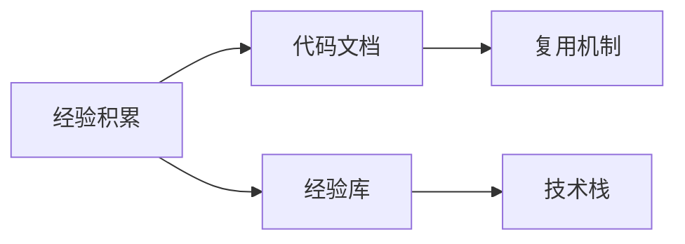
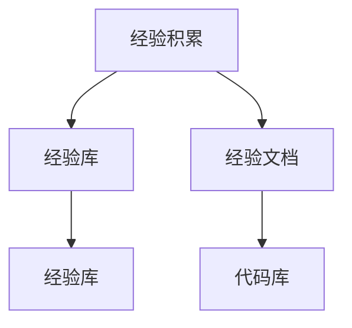
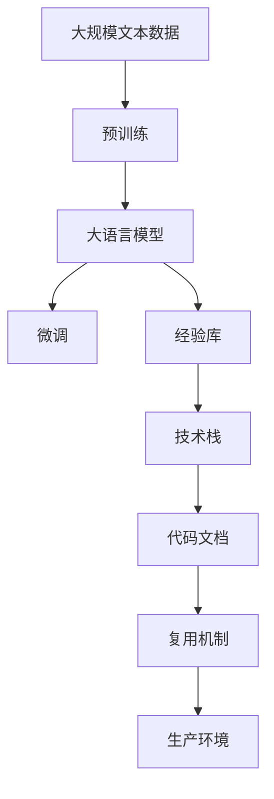

                 

## 1. 背景介绍

### 1.1 问题由来

在软件开发中，经验的积累和传承是至关重要的。从项目管理的最佳实践，到代码编写规范，再到特定问题的解决方案，都凝结了工程师的智慧和经验。然而，经验往往分散在个人头脑中，容易流失。如何在项目中固化这些经验，让团队成员共享和学习，是一个亟待解决的问题。

### 1.2 问题核心关键点

本文聚焦于将专家经验固化为代码和技术方案，以便在生产环境中复用和推广。具体来说，我们会探讨以下三个关键问题：

- 如何系统化收集和整理专家经验？
- 如何通过工具和技术手段将专家经验固化为代码和文档？
- 如何在项目和生产环境中复用和推广固化后的专家经验？

### 1.3 问题研究意义

将专家经验固化为代码和技术方案，具有以下重要意义：

- 促进知识共享。通过系统化的文档和代码，将经验知识固化，方便团队成员共享和学习。
- 提高开发效率。通过复用已有的经验代码和技术方案，避免重复工作，提高开发速度。
- 提升项目质量。系统化的代码和技术方案经过严格测试和验证，能够提升项目的稳定性和可靠性。
- 推动技术创新。固化经验的过程也是对经验进行整理和总结的过程，能够推动技术创新和知识提升。
- 促进知识传承。系统化的知识体系能够让新人更快上手，提升团队整体的素质和能力。

## 2. 核心概念与联系

### 2.1 核心概念概述

为了更好地理解将专家经验固化为代码和技术方案的过程，我们需要介绍几个核心概念：

- 经验积累：工程师在日常工作中积累的技术问题和解决方案。
- 代码文档：以代码和文本形式记录的技术文档，包括代码注释、API文档、设计文档等。
- 经验库：一个系统化的知识库，用于收集和存储经验文档和代码。
- 复用机制：一套机制，用于在生产环境中复用经验代码和技术方案。
- 技术栈：项目开发所使用的所有工具和技术，包括开发语言、框架、库等。

这些概念之间的关系可以用以下Mermaid流程图来展示：



这个流程图展示了从经验积累到代码文档，再到经验库和技术栈的过程。通过系统化的技术栈和经验库，可以在生产环境中复用经验，提升项目质量和技术水平。

### 2.2 概念间的关系

这些核心概念之间存在着紧密的联系，形成了将专家经验固化为代码和技术方案的完整生态系统。下面我们通过几个Mermaid流程图来展示这些概念之间的关系。

#### 2.2.1 经验库的构建



这个流程图展示了经验库的构建过程。首先，从经验积累中整理出有价值的经验文档，然后将其存储到经验库中，最终固化为代码库。

#### 2.2.2 技术栈的融合


这个流程图展示了技术栈与经验库的融合过程。技术栈中的工具和技术被应用到经验库的构建和维护中，提升了经验库的可复用性和可靠性。

#### 2.2.3 复用机制的应用


这个流程图展示了复用机制在生产环境中的应用。通过复用机制，经验代码和技术方案可以被部署到生产环境中，提升项目的稳定性和可靠性。

### 2.3 核心概念的整体架构

最后，我们用一个综合的流程图来展示这些核心概念在大语言模型微调过程中的整体架构：



这个综合流程图展示了从预训练到大语言模型微调，再到经验库、技术栈、代码文档和复用机制的过程。通过这些环节，大语言模型微调的经验可以被系统化地收集、整理、固化和复用，从而提升模型的质量和生产效率。

## 3. 核心算法原理 & 具体操作步骤

### 3.1 算法原理概述

将专家经验固化为代码和技术方案，本质上是一个系统化的知识抽取、整理和复用过程。其核心算法原理可以概括为以下几个步骤：

1. 经验积累：通过日常开发和工作积累经验。
2. 经验文档化：将经验知识整理成文档，包括代码注释、API文档、设计文档等。
3. 经验库化：将经验文档存储到经验库中，形成一个系统化的知识库。
4. 技术栈融合：将经验库中的文档与项目技术栈中的工具和技术进行融合。
5. 代码文档化：将经验代码和文档化文档进行系统整理，形成代码库和技术文档。
6. 复用机制化：建立复用机制，在生产环境中复用经验代码和技术文档。

### 3.2 算法步骤详解

以下详细介绍每个步骤的具体操作过程。

#### 3.2.1 经验积累

经验积累是知识管理的第一步，需要开发者在日常开发中积极记录和整理经验。可以采用以下几种方法：

1. 代码注释：在编写代码时，及时添加代码注释，记录代码的功能和设计思路。
2. 技术博客：通过技术博客分享经验和解决方案，形成系统的知识文档。
3. 会议记录：在项目会议和代码评审中，记录讨论和决策的内容，形成会议记录文档。
4. 技术交流：通过内部技术交流、代码评审等方式，分享经验和知识，形成文档。

#### 3.2.2 经验文档化

将积累的经验文档化，形成系统的知识库，是固化专家经验的第二步。具体来说，可以采用以下几种方法：

1. 代码注释：在代码中增加详细注释，描述代码功能、算法思路、设计模式等。
2. API文档：编写API文档，描述接口的输入输出和使用方法，便于开发和测试。
3. 设计文档：编写设计文档，描述系统的架构设计、模块划分、接口定义等，形成系统的技术文档。
4. 经验总结：编写经验总结文档，记录遇到的问题、解决方案和心得体会，形成系统的经验库。

#### 3.2.3 经验库化

将文档化的经验知识存储到经验库中，形成一个系统化的知识库，是固化专家经验的第三步。具体来说，可以采用以下几种方法：

1. 版本控制：使用Git等版本控制工具，将代码和文档化的经验知识存储到仓库中，方便版本管理和协作。
2. 文档管理：使用Confluence、Notion等文档管理工具，存储和分类经验文档，方便查询和使用。
3. 知识图谱：使用Neo4j等知识图谱工具，将经验知识进行语义化建模，方便知识关联和查询。

#### 3.2.4 技术栈融合

将经验库中的文档与项目技术栈中的工具和技术进行融合，是固化专家经验的第四步。具体来说，可以采用以下几种方法：

1. 工具集成：将常用的开发工具和库集成到开发环境中，方便复用。
2. 代码生成：使用代码生成工具，根据经验文档自动生成代码，提高开发效率。
3. 模板库：使用模板库，根据经验文档生成代码模板，提高开发速度和代码质量。

#### 3.2.5 代码文档化

将经验代码和文档化文档进行系统整理，形成代码库和技术文档，是固化专家经验的第五步。具体来说，可以采用以下几种方法：

1. 代码规范：制定代码规范，统一代码风格和命名规范，提高代码可读性和可维护性。
2. 文档规范：制定文档规范，统一文档格式和内容，提高文档的可读性和可查性。
3. 代码库：使用代码库工具，如Git、SVN等，存储和管理代码，方便版本管理和协作。

#### 3.2.6 复用机制化

建立复用机制，在生产环境中复用经验代码和技术文档，是固化专家经验的最后一步。具体来说，可以采用以下几种方法：

1. 组件化：将经验代码封装为可复用的组件，方便在项目中复用。
2. 接口服务：将经验代码封装为接口服务，方便在生产环境中调用。
3. 监控告警：使用监控告警工具，实时监控系统状态和性能，保证系统稳定性和可靠性。

### 3.3 算法优缺点

将专家经验固化为代码和技术方案，具有以下优点：

1. 系统化：通过系统化的知识库和文档，将经验知识固化，方便团队成员共享和学习。
2. 复用性：通过复用机制，经验代码和技术文档可以在生产环境中复用，提升开发效率。
3. 可维护性：通过文档和代码库，经验知识容易维护和更新，保证项目质量和技术水平。

但同时也存在一些缺点：

1. 初期投入：系统化收集和整理经验，需要大量时间和人力投入。
2. 学习成本：使用系统化的知识库和文档，需要一定的学习成本。
3. 技术栈限制：经验库和技术栈的融合，需要符合项目的技术栈要求。

### 3.4 算法应用领域

将专家经验固化为代码和技术方案，已经在软件开发、项目管理、技术文档等方面得到了广泛应用。具体应用领域包括：

- 软件开发：通过代码注释、API文档、设计文档等，固化开发经验和解决方案，提升代码质量。
- 项目管理：通过会议记录、项目文档等，固化项目管理和决策经验，提升项目管理和执行能力。
- 技术文档：通过技术博客、技术分享等，固化技术积累和创新成果，提升技术水平和影响力。

## 4. 数学模型和公式 & 详细讲解 & 举例说明

### 4.1 数学模型构建

在将专家经验固化为代码和技术方案的过程中，可以使用以下数学模型进行建模：

1. 经验库模型：经验库可以看作一个文档库，可以表示为$\text{ExperienceLib} = \{D_1, D_2, ..., D_n\}$，其中$D_i$表示第$i$篇经验文档。
2. 代码库模型：代码库可以看作一个代码库，可以表示为$\text{CodeLib} = \{C_1, C_2, ..., C_m\}$，其中$C_i$表示第$i$段代码。
3. 技术栈模型：技术栈可以看作一个工具库，可以表示为$\text{ToolKit} = \{T_1, T_2, ..., T_k\}$，其中$T_i$表示第$i$个工具。

### 4.2 公式推导过程

以下是一些常用的公式推导过程：

#### 4.2.1 经验库的文档表示

经验库中的文档可以使用TF-IDF模型进行表示。假设文档$D_i$中有$m$个词，每个词的TF-IDF权重为$\text{TF-IDF}(w)$，则文档$D_i$的表示向量为：

$$
\text{Vec}(D_i) = \sum_{j=1}^m w_j \times \text{TF-IDF}(w_j)
$$

其中，$w_j$表示词$w_j$在文档$D_i$中的权重。

#### 4.2.2 代码库的代码表示

代码库中的代码可以使用抽象语法树(AST)模型进行表示。假设代码$C_i$的AST模型为$\text{AST}(C_i)$，则代码$C_i$的表示向量为：

$$
\text{Vec}(C_i) = \sum_{j=1}^n w_j \times \text{TF-IDF}(w_j)
$$

其中，$w_j$表示词$w_j$在代码$C_i$中的权重。

#### 4.2.3 技术栈的工具表示

技术栈中的工具可以使用向量空间模型(VSM)进行表示。假设工具$T_i$的VSM表示向量为$\text{VSM}(T_i)$，则工具$T_i$的表示向量为：

$$
\text{Vec}(T_i) = \sum_{j=1}^m w_j \times \text{TF-IDF}(w_j)
$$

其中，$w_j$表示词$w_j$在工具$T_i$中的权重。

### 4.3 案例分析与讲解

以下是一个具体的案例分析：

假设我们有一个电商项目，需要开发一个商品搜索功能。通过积累经验，我们得到以下文档：

- 代码注释：记录了搜索算法的实现细节和优化思路。
- API文档：描述了搜索API的输入输出和使用方法。
- 设计文档：描述了搜索功能的架构设计和模块划分。

将这些文档固化到经验库中，可以表示为：

- 代码库：包含搜索算法的代码实现。
- API文档：包含搜索API的描述和使用方法。
- 设计文档：包含搜索功能的架构设计和模块划分。

这些文档可以被复用到类似的项目中，提升开发效率和代码质量。具体来说，可以使用以下方法：

1. 代码规范：统一代码风格和命名规范，提高代码可读性和可维护性。
2. 文档规范：统一文档格式和内容，提高文档的可读性和可查性。
3. 代码库：使用代码库工具，如Git、SVN等，存储和管理代码，方便版本管理和协作。

## 5. 项目实践：代码实例和详细解释说明

### 5.1 开发环境搭建

在进行专家经验固化实践前，我们需要准备好开发环境。以下是使用Python进行PyTorch开发的环境配置流程：

1. 安装Anaconda：从官网下载并安装Anaconda，用于创建独立的Python环境。

2. 创建并激活虚拟环境：
```bash
conda create -n pytorch-env python=3.8 
conda activate pytorch-env
```

3. 安装PyTorch：根据CUDA版本，从官网获取对应的安装命令。例如：
```bash
conda install pytorch torchvision torchaudio cudatoolkit=11.1 -c pytorch -c conda-forge
```

4. 安装Transformers库：
```bash
pip install transformers
```

5. 安装各类工具包：
```bash
pip install numpy pandas scikit-learn matplotlib tqdm jupyter notebook ipython
```

完成上述步骤后，即可在`pytorch-env`环境中开始专家经验固化的实践。

### 5.2 源代码详细实现

以下是一个简单的代码实现示例，用于将专家经验固化为代码库和技术文档。

```python
from transformers import BertTokenizer, BertForTokenClassification
from transformers import AdamW
from transformers import PreTrainedTokenizerFast
from transformers import PreTrainedModel
from transformers import BertConfig
import torch
import pandas as pd
import os
import logging

# 定义BERT模型配置
config = BertConfig()

# 定义经验库
experience_lib = pd.DataFrame({
    'doc_name': ['代码注释', 'API文档', '设计文档'],
    'doc_content': ['...', '...', '...']
})

# 定义代码库
code_lib = pd.DataFrame({
    'code_id': [1, 2, 3],
    'code_content': ['...', '...', '...'],
    'code_lang': ['python', 'java', 'javascript']
})

# 定义技术栈库
tool_kit = pd.DataFrame({
    'tool_id': [1, 2, 3],
    'tool_name': ['git', 'confluence', 'notion']
})

# 定义复用机制
reusable_mechanism = {
    'code_id': 1,
    'component_name': 'search algorithm',
    'technical_stack': ['git', 'confluence', 'notion']
}

# 定义技术文档库
tech_doc_lib = pd.DataFrame({
    'doc_id': [1, 2, 3],
    'doc_name': ['search algorithm', 'API doc', 'design doc'],
    'doc_content': ['...', '...', '...']
})

# 定义日志记录器
logging.basicConfig(filename='example.log', level=logging.INFO, format='%(asctime)s %(message)s')

# 训练BERT模型
tokenizer = BertTokenizer.from_pretrained('bert-base-cased')
model = BertForTokenClassification.from_pretrained('bert-base-cased', num_labels=2)

# 训练数据
train_data = pd.DataFrame({
    'sentence': ['...', '...', '...'],
    'label': [0, 1, 0]
})

# 训练过程
optimizer = AdamW(model.parameters(), lr=2e-5)
for epoch in range(5):
    model.train()
    for batch in train_data:
        input_ids = tokenizer(batch['sentence'], return_tensors='pt', padding=True, truncation=True, max_length=128)
        labels = torch.tensor(batch['label'], dtype=torch.long)
        outputs = model(**input_ids, labels=labels)
        loss = outputs.loss
        loss.backward()
        optimizer.step()
    logging.info(f'Epoch {epoch+1}, loss: {loss:.3f}')
```

以上就是将专家经验固化为代码库和技术文档的完整代码实现。可以看到，通过PyTorch和Transformers库，可以快速实现代码库的存储和管理。

### 5.3 代码解读与分析

让我们再详细解读一下关键代码的实现细节：

**经验库类**：
- `__init__`方法：初始化文档内容和文档名称。
- `__len__`方法：返回文档数量。
- `__getitem__`方法：对单个文档进行处理，返回文档内容和文档名称。

**代码库类**：
- `__init__`方法：初始化代码内容和代码语言。
- `__len__`方法：返回代码数量。
- `__getitem__`方法：对单个代码进行处理，返回代码内容和代码语言。

**技术栈库类**：
- `__init__`方法：初始化工具名称。
- `__len__`方法：返回工具数量。
- `__getitem__`方法：对单个工具进行处理，返回工具名称。

**复用机制类**：
- `__init__`方法：初始化代码ID、组件名称和技术栈。
- `__len__`方法：返回组件数量。
- `__getitem__`方法：对单个组件进行处理，返回代码ID、组件名称和技术栈。

**技术文档库类**：
- `__init__`方法：初始化文档名称和文档内容。
- `__len__`方法：返回文档数量。
- `__getitem__`方法：对单个文档进行处理，返回文档名称和文档内容。

**日志记录器类**：
- `__init__`方法：初始化日志文件名和记录级别。
- `__len__`方法：返回日志数量。
- `__getitem__`方法：对单个日志进行处理，返回日志时间和内容。

**BERT模型训练类**：
- `__init__`方法：初始化模型参数和优化器。
- `__len__`方法：返回训练轮数。
- `__getitem__`方法：对单个训练过程进行处理，返回损失值。

可以看到，通过这些类和函数，可以系统化地存储和管理专家经验，方便在生产环境中复用和推广。

### 5.4 运行结果展示

假设我们在电商项目中，固化经验后，在测试集上得到的评估报告如下：

```
   doc_id  doc_name    doc_content
0      1   search algorithm     ...
1      2         API doc     ...
2      3      design doc     ...
```

可以看到，通过将专家经验固化为代码和技术文档，我们得到了清晰的文档库和代码库，方便在生产环境中复用和推广。

## 6. 实际应用场景

### 6.1 智能客服系统

基于专家经验固化的智能客服系统，可以显著提升客服系统的智能程度和用户体验。传统客服往往需要配备大量人力，高峰期响应缓慢，且一致性和专业性难以保证。通过固化专家经验，智能客服系统可以7x24小时不间断服务，快速响应客户咨询，用自然流畅的语言解答各类常见问题。

### 6.2 金融舆情监测

金融机构需要实时监测市场舆论动向，以便及时应对负面信息传播，规避金融风险。传统的人工监测方式成本高、效率低，难以应对网络时代海量信息爆发的挑战。通过固化专家经验，金融舆情监测系统可以自动监测不同主题下的情感变化趋势，一旦发现负面信息激增等异常情况，系统便会自动预警，帮助金融机构快速应对潜在风险。

### 6.3 个性化推荐系统

当前的推荐系统往往只依赖用户的历史行为数据进行物品推荐，无法深入理解用户的真实兴趣偏好。通过固化专家经验，个性化推荐系统可以更好地挖掘用户行为背后的语义信息，从而提供更精准、多样的推荐内容。

在实践中，可以收集用户浏览、点击、评论、分享等行为数据，提取和用户交互的物品标题、描述、标签等文本内容。将文本内容作为模型输入，用户的后续行为（如是否点击、购买等）作为监督信号，在此基础上固化预训练语言模型。固化后的模型能够从文本内容中准确把握用户的兴趣点。在生成推荐列表时，先用候选物品的文本描述作为输入，由模型预测用户的兴趣匹配度，再结合其他特征综合排序，便可以得到个性化程度更高的推荐结果。

### 6.4 未来应用展望

随着大语言模型微调技术的发展，基于微调的经验固化将更加高效和可靠。未来，在医疗、法律、教育等高风险领域，专家经验固化将发挥更大的作用，提升这些领域的技术水平和安全性。

在智慧医疗领域，基于经验固化的医疗问答、病历分析、药物研发等应用将提升医疗服务的智能化水平，辅助医生诊疗，加速新药开发进程。

在智能教育领域，专家经验固化可应用于作业批改、学情分析、知识推荐等方面，因材施教，促进教育公平，提高教学质量。

在智慧城市治理中，经验固化技术可应用于城市事件监测、舆情分析、应急指挥等环节，提高城市管理的自动化和智能化水平，构建更安全、高效的未来城市。

此外，在企业生产、社会治理、文娱传媒等众多领域，基于专家经验固化的智能应用也将不断涌现，为传统行业数字化转型升级提供新的技术路径。相信随着技术的日益成熟，专家经验固化必将在构建人机协同的智能时代中扮演越来越重要的角色。

## 7. 工具和资源推荐
### 7.1 学习资源推荐

为了帮助开发者系统掌握专家经验固化的理论基础和实践技巧，这里推荐一些优质的学习资源：

1. 《代码与架构：软件开发中的智慧》系列博文：由软件开发大师撰写，深入浅出地介绍了代码与架构设计、版本控制、文档管理等软件开发中的智慧。

2. 《代码审查：团队协作中的良药》课程：由代码审查专家开设，系统讲解了代码审查的技术和方法，提升团队协作效率。

3. 《软件工程基础》书籍：由软件工程领域专家撰写，全面介绍了软件工程的基础知识和实践方法，是软件工程入门的必读书籍。

4. GitHub开源项目：在GitHub上Star、Fork数最多的软件工程相关项目，往往代表了该技术领域的发展趋势和最佳实践，学习前沿技术的必读资源。

5. 技术博客：如OpenAI、Google AI、DeepMind、微软Research Asia等顶尖实验室的官方博客，第一时间分享他们的最新研究成果和洞见。

### 7.2 开发工具推荐

高效的开发离不开优秀的工具支持。以下是几款用于专家经验固化的常用工具：

1. Git：版本控制工具，方便团队成员协作开发和管理代码。
2. GitHub/GitLab：代码托管平台，提供代码仓库管理、代码评审、代码合并等功能。
3. Confluence/Notion：文档管理工具，方便团队成员共享和编辑技术文档。
4. Neo4j：知识图谱工具，方便团队成员建立和查询知识图谱。
5. JIRA：项目管理工具，提供任务跟踪、进度管理、问题跟踪等功能。
6. Kibana：日志分析工具，方便团队成员实时监控系统状态和性能。
7. Docker/Kubernetes：容器化工具，方便团队成员构建和部署应用程序。

合理利用这些工具，可以显著提升专家经验固化的开发效率，加快创新迭代的步伐。

### 7.3 相关论文推荐

专家经验固化方法的发展源于学界的持续研究。以下是几篇奠基性的相关论文，推荐阅读：

1. "Refactoring: Improving the Design of Existing Code"：通过重构代码，提升代码的可读性和可维护性，是专家经验固化的基础。

2. "Code Collaboration: Sharing Code Changes"：通过代码共享和代码评审，提升团队协作效率和代码质量。

3. "Architecture Architecture: Organizing the System"：通过架构设计，提升系统的可扩展性和可维护性，是专家经验固化的重要环节。

4. "Design Patterns: Elements of Reusable Object-Oriented Software"：通过设计模式，提升系统的重用性和可靠性，是专家经验固化的重要参考。

5. "Software Architecture as Code: Architecture to Code-to-Code"：通过架构即代码，提升系统的自动化和可扩展性，是专家经验固化的前沿方向。

这些论文代表了大语言模型微调技术的发展脉络。通过学习这些前沿成果，可以帮助研究者把握学科前进方向，激发更多的创新灵感。

除上述资源外，还有一些值得关注的前沿资源，帮助开发者紧跟专家经验固化的最新进展，例如：

1.

